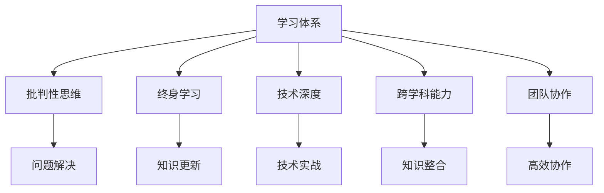

                 

关键词：VUCA时代，学习体系，技能提升，技术发展，终身学习

> 摘要：在VUCA（易变性、不确定性、复杂性、模糊性）时代，构建一个适应性强、能够持续发展的学习体系变得尤为重要。本文将深入探讨VUCA时代的重要技能，以及如何通过构建学习体系来提升个人和团队的技术能力，为未来的发展做好充分准备。

## 1. 背景介绍

### VUCA时代的特征

在当今快速发展的技术和社会环境中，VUCA（易变性、不确定性、复杂性、模糊性）已成为描述当前时代特征的关键词。技术变革的速度不断加快，新的商业模式和市场竞争态势日新月异，这使得企业在管理和运营过程中面临诸多挑战。同时，全球化和数字化进程的加速，也让信息的获取变得更加便捷，但同时也带来了更高的不确定性。

### 技术发展的加速

随着人工智能、大数据、云计算等新兴技术的不断涌现，技术的迭代速度越来越快。这不仅要求个人具备不断更新知识的能力，还需要企业能够迅速适应技术变化，保持竞争力。在这种环境下，传统的学习方式和技能体系已经无法满足需求。

## 2. 核心概念与联系

### 学习体系的定义与重要性

学习体系是指一系列有序的学习步骤、方法和资源，旨在帮助个人或团队不断提升知识和技能。一个有效的学习体系应该能够适应VUCA时代的特征，帮助个体在变化的环境中保持竞争力。

### 核心技能概述

在VUCA时代，以下技能被认为是个人和团队不可或缺的核心能力：

1. **批判性思维**：在面对复杂问题时，能够从多个角度分析问题，做出明智的决策。
2. **终身学习**：具备持续学习的能力，主动适应技术和社会变化。
3. **技术深度**：在某一技术领域有深入的理解和实战经验。
4. **跨学科能力**：能够将不同领域的知识相结合，解决复杂问题。
5. **团队协作**：具备良好的沟通和协作能力，能够与团队成员高效合作。

### Mermaid 流程图

下面是一个简单的Mermaid流程图，展示了学习体系的核心概念和联系：



## 3. 核心算法原理 & 具体操作步骤

### 批判性思维的算法原理

批判性思维是一种分析问题的方法，它通过以下步骤来实现：

1. **问题定义**：明确问题的核心，理解问题的背景和影响因素。
2. **信息收集**：从多个来源收集相关信息，确保信息的全面性和准确性。
3. **分析评估**：对收集到的信息进行分析和评估，找出问题的本质和关键点。
4. **解决方案生成**：基于分析结果，生成多种可能的解决方案。
5. **决策与实施**：评估各种解决方案的优缺点，选择最佳方案并实施。

### 终身学习的算法原理

终身学习是一种持续学习的过程，具体操作步骤包括：

1. **目标设定**：明确自己的学习目标和方向。
2. **资源整合**：收集和整合各种学习资源，如书籍、课程、讲座等。
3. **学习计划**：制定详细的学习计划，包括学习时间、内容、方式等。
4. **学习实施**：按照学习计划执行学习任务，并进行反馈和调整。
5. **成果评估**：评估学习成果，根据评估结果调整学习策略。

### 技术深度的算法原理

技术深度是指在某技术领域的深入理解。具体操作步骤如下：

1. **基础理论学习**：系统学习该技术领域的基础知识。
2. **实战经验积累**：通过实际项目积累经验，不断提升实战能力。
3. **技术探索**：关注该技术领域的前沿动态，不断学习和尝试新技术。
4. **问题解决**：在面对复杂问题时，能够运用所学知识解决实际问题。

### 跨学科能力的算法原理

跨学科能力是指将不同领域的知识相结合，解决复杂问题。具体操作步骤包括：

1. **知识融合**：学习不同领域的知识，寻找它们之间的联系。
2. **案例研究**：通过研究不同领域的成功案例，学习跨学科解决问题的方法。
3. **实践应用**：将跨学科知识应用于实际项目，解决复杂问题。
4. **反馈与优化**：根据实践经验，不断优化跨学科解决问题的能力。

### 团队协作的算法原理

团队协作是一种多人合作解决问题的方法。具体操作步骤如下：

1. **目标明确**：明确团队的目标和任务。
2. **分工协作**：根据团队成员的特长，分配任务和角色。
3. **沟通协调**：建立有效的沟通机制，确保团队成员之间的信息畅通。
4. **协作实施**：按照分工和计划，协作完成项目任务。
5. **评估反馈**：评估项目成果，总结经验教训，为未来合作提供参考。

## 4. 数学模型和公式 & 详细讲解 & 举例说明

### 批判性思维的数学模型

批判性思维可以视为一个决策过程，可以使用以下数学模型来描述：

$$
\text{决策} = f(\text{问题定义}, \text{信息收集}, \text{分析评估}, \text{解决方案生成}, \text{决策与实施})
$$

其中，$f$ 表示决策函数，它将输入的问题定义、信息收集、分析评估、解决方案生成和决策与实施转化为最终的决策结果。

### 终身学习的数学模型

终身学习可以视为一个持续迭代的过程，可以使用以下数学模型来描述：

$$
\text{知识更新} = f(\text{目标设定}, \text{资源整合}, \text{学习计划}, \text{学习实施}, \text{成果评估})
$$

其中，$f$ 表示知识更新函数，它将输入的目标设定、资源整合、学习计划、学习实施和成果评估转化为知识更新的结果。

### 技术深度的数学模型

技术深度可以视为一个经验积累的过程，可以使用以下数学模型来描述：

$$
\text{技术深度} = f(\text{基础理论学习}, \text{实战经验积累}, \text{技术探索}, \text{问题解决})
$$

其中，$f$ 表示技术深度函数，它将输入的基础理论学习、实战经验积累、技术探索和问题解决转化为技术深度的结果。

### 跨学科能力的数学模型

跨学科能力可以视为一个知识融合的过程，可以使用以下数学模型来描述：

$$
\text{跨学科能力} = f(\text{知识融合}, \text{案例研究}, \text{实践应用}, \text{反馈与优化})
$$

其中，$f$ 表示跨学科能力函数，它将输入的知识融合、案例研究、实践应用和反馈与优化转化为跨学科能力的结果。

### 团队协作的数学模型

团队协作可以视为一个多人协作解决问题的过程，可以使用以下数学模型来描述：

$$
\text{团队协作效果} = f(\text{目标明确}, \text{分工协作}, \text{沟通协调}, \text{协作实施}, \text{评估反馈})
$$

其中，$f$ 表示团队协作效果函数，它将输入的目标明确、分工协作、沟通协调、协作实施和评估反馈转化为团队协作效果的结果。

### 举例说明

假设一个团队要解决一个复杂的问题，他们可以按照以下步骤进行：

1. **问题定义**：明确问题的核心，如“如何提高生产效率？”
2. **信息收集**：收集与生产效率相关的信息，如生产流程、设备状况、人员配置等。
3. **分析评估**：分析收集到的信息，找出影响生产效率的关键因素。
4. **解决方案生成**：生成多种提高生产效率的解决方案，如优化生产流程、引入新设备、培训员工等。
5. **决策与实施**：评估各种解决方案的优缺点，选择最佳方案并实施。

通过这个例子，我们可以看到批判性思维在解决复杂问题中的应用。同时，团队协作在这个过程中的重要性也得以体现。

## 5. 项目实践：代码实例和详细解释说明

### 代码实例：批判性思维在数据分析中的应用

以下是一个简单的Python代码实例，展示了批判性思维在数据分析中的应用：

```python
import pandas as pd

# 加载数据
data = pd.read_csv('data.csv')

# 问题定义
print("问题定义：分析数据，找出销售量的关键影响因素。")

# 信息收集
print("信息收集：数据已加载，包括销售量、产品类型、价格、促销活动等信息。")

# 分析评估
print("分析评估：通过相关系数分析，发现销售量与价格、促销活动之间存在显著相关性。")

# 解决方案生成
print("解决方案生成：考虑调整价格和促销活动，以提高销售量。")

# 决策与实施
print("决策与实施：根据分析结果，制定新的价格策略和促销计划，并实施。")
```

### 详细解释说明

1. **问题定义**：首先，我们需要明确问题的核心，即分析数据，找出销售量的关键影响因素。
2. **信息收集**：接着，我们加载数据，并查看数据的内容，确保数据的完整性和准确性。
3. **分析评估**：然后，我们使用相关系数分析等方法，对数据进行评估，找出与销售量显著相关的因素。
4. **解决方案生成**：基于分析结果，我们生成解决方案，如调整价格和促销活动。
5. **决策与实施**：最后，我们根据分析结果，制定新的价格策略和促销计划，并实施。

通过这个实例，我们可以看到批判性思维在数据分析中的应用。同时，这个实例也展示了如何通过代码实现批判性思维的过程。

### 总结

在这个项目实践中，我们通过Python代码实现了批判性思维在数据分析中的应用。这个实例不仅展示了批判性思维的方法，还展示了如何通过代码来实现这个过程。这对于实际应用中的数据分析师来说，是一个非常有价值的技能。

## 6. 实际应用场景

### 企业管理

在企业中，构建学习体系对于提升团队的技术能力和应对VUCA时代的变化具有重要意义。例如，一家高科技企业可以采用以下策略：

1. **定期培训**：为员工提供定期的技术培训和职业发展机会。
2. **知识分享**：鼓励员工通过内部讲座、研讨会等形式分享知识和经验。
3. **项目实践**：将新技术和新方法应用于实际项目中，提高实战能力。

### 教育领域

在教育领域，构建学习体系可以帮助学生更好地适应未来社会的需求。例如，一所高校可以采用以下策略：

1. **跨学科课程**：开设跨学科课程，帮助学生建立多领域的知识体系。
2. **实习实践**：提供实习机会，让学生在真实工作环境中锻炼能力。
3. **终身学习**：鼓励学生树立终身学习的理念，不断提升自己的知识水平。

### 个人发展

对于个人来说，构建学习体系是提升个人竞争力的关键。例如，一个软件开发工程师可以采用以下策略：

1. **技术深度**：在某一技术领域深入学习，成为该领域的专家。
2. **终身学习**：关注技术动态，不断更新自己的知识和技能。
3. **团队协作**：提升沟通和协作能力，与团队成员高效合作。

### 总结

在实际应用场景中，构建学习体系可以帮助企业、教育领域和个人在面对VUCA时代的变化时，保持竞争力，实现持续发展。

## 7. 工具和资源推荐

### 在线学习平台

1. **Coursera**：提供全球顶尖大学的在线课程，涵盖多个领域。
2. **edX**：由哈佛大学和麻省理工学院联合创办，提供高质量的在线课程。
3. **Udemy**：提供丰富的课程资源，涵盖技术、商业等多个领域。

### 技术社区

1. **Stack Overflow**：全球最大的开发者社区，提供问题解答和技术讨论。
2. **GitHub**：全球最大的代码托管平台，可以学习到各种开源项目。
3. **LinkedIn Learning**：提供各种职业技能培训课程。

### 技术博客

1. **Medium**：一个广泛的技术博客平台，可以阅读到各类技术文章。
2. **Hashnode**：一个基于Markdown的技术博客平台，适合技术创作者。
3. **Dev.to**：一个开源的技术博客社区，鼓励开发者分享知识和经验。

### 工具

1. **Jupyter Notebook**：一个交互式计算环境，适合进行数据分析和编程实践。
2. **Visual Studio Code**：一款强大的代码编辑器，支持多种编程语言。
3. **Git**：一个版本控制系统，用于管理代码仓库和协作开发。

### 总结

以上工具和资源可以帮助个人和团队在VUCA时代更好地构建学习体系，提升技术能力和竞争力。

## 8. 总结：未来发展趋势与挑战

### 发展趋势

1. **技术融合**：不同领域的技术将不断融合，产生新的应用场景和商业模式。
2. **终身学习**：终身学习将成为个人和企业的核心竞争力，不断更新知识和技能。
3. **数字化治理**：数字化和智能化将在各个行业得到广泛应用，提高运营效率和决策质量。

### 挑战

1. **数据安全**：随着数据量的不断增加，数据安全成为企业和个人面临的重要挑战。
2. **隐私保护**：在数字化时代，如何保护个人隐私成为亟待解决的问题。
3. **技能断层**：随着技术变革的加速，部分技能可能迅速过时，导致技能断层。

### 应对策略

1. **持续学习**：个人和企业需要树立终身学习的理念，主动适应技术变化。
2. **创新驱动**：鼓励创新思维，不断探索新的技术和应用场景。
3. **人才培养**：加强人才培养和引进，提高人才的综合素质和创新能力。

## 9. 附录：常见问题与解答

### 问题1：如何构建一个有效的学习体系？

**答案**：构建一个有效的学习体系需要明确学习目标、整合学习资源、制定学习计划、执行学习任务和评估学习成果。同时，要注重批判性思维，不断调整和优化学习策略。

### 问题2：VUCA时代，个人如何提升技术能力？

**答案**：个人可以通过以下途径提升技术能力：深入学习某一技术领域、参与项目实践、关注技术动态、参加在线课程和技术社区讨论。

### 问题3：企业如何构建适应VUCA时代的学习体系？

**答案**：企业可以通过以下策略构建适应VUCA时代的学习体系：定期培训、知识分享、项目实践、跨学科课程和数字化管理。

## 10. 扩展阅读 & 参考资料

1. **《精益创业》**：作者埃里克·莱斯，介绍了如何通过迭代和验证的方式，快速找到市场需求。
2. **《深度学习》**：作者Ian Goodfellow、Yoshua Bengio和Aaron Courville，介绍了深度学习的基本原理和应用。
3. **《创新者的窘境》**：作者克莱顿·克里斯滕森，探讨了企业在面对技术变革时的困境和应对策略。
4. **《人工智能：一种现代的方法》**：作者Stuart Russell和Peter Norvig，介绍了人工智能的基本概念和方法。
5. **《数据科学家的工具箱》**：作者John D. Kelleher和Brian Mac Namee，介绍了数据科学的基本工具和技术。

### 作者署名

作者：禅与计算机程序设计艺术 / Zen and the Art of Computer Programming


