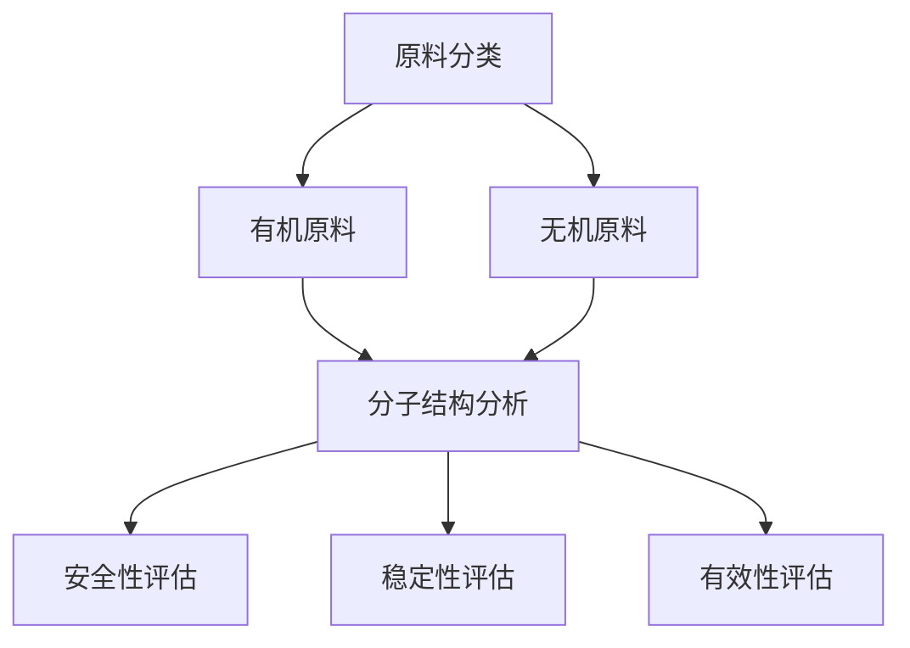

                 

### 文章标题：完美日记2025社招化妆品原料分析工程师面试

> **关键词：** 完美日记，社招，化妆品原料分析，工程师面试，技术问答

> **摘要：** 本文深入探讨完美日记2025年社招化妆品原料分析工程师面试的各个环节，包括背景介绍、核心概念与联系、核心算法原理、数学模型和公式、项目实践、实际应用场景、工具和资源推荐、总结与未来发展趋势，以及常见问题与解答。通过本文，读者可以全面了解面试准备和实际面试过程中可能遇到的问题及应对策略。

## 1. 背景介绍

完美日记是一家知名的国产化妆品品牌，近年来在全球范围内取得了显著的成就。为了持续保持其产品的竞争力，完美日记不断追求技术创新和产品品质的提升。因此，2025年社招化妆品原料分析工程师成为公司人才战略中的重要一环。

化妆品原料分析工程师的主要职责是：
- 分析并评估各种化妆品原料的性能，包括安全性、稳定性和有效性。
- 为产品研发团队提供原料选择和配方优化的建议。
- 参与新原料的探索和引进，推动产品创新。
- 负责实验室日常管理和实验数据的整理分析。

作为一家高科技公司，完美日记对化妆品原料分析工程师的面试标准非常高。面试不仅考察应聘者的专业知识，还注重其实际操作能力和创新思维。因此，准备这场面试需要充分了解化妆品原料分析的相关知识，掌握必要的技能，并具备良好的沟通能力和团队合作精神。

## 2. 核心概念与联系

化妆品原料分析涉及多个学科，包括化学、生物工程、材料科学等。以下是一些核心概念和它们之间的联系：

### 2.1 原料分类

化妆品原料主要分为有机原料和无机原料。有机原料如油脂、维生素、氨基酸等；无机原料如矿物质、盐类等。它们各自具有独特的化学性质和功能。

### 2.2 分子结构分析

分子结构分析是化妆品原料研究的基础。通过光谱分析、质谱分析等方法，可以确定原料的分子组成和结构，从而评估其性能。

### 2.3 安全性评估

化妆品的安全性评估是确保产品对人体无害的关键环节。主要包括原料毒性测试、刺激性测试、过敏测试等。

### 2.4 稳定性评估

化妆品的稳定性直接影响其使用寿命和效果。通过高温、高湿度、光照等模拟实验，可以评估原料和产品的稳定性。

### 2.5 有效性评估

化妆品的有效性评估主要通过临床实验和皮肤测试等方法进行。评估指标包括保湿、抗衰老、美白等。

### 2.6 Mermaid 流程图

以下是一个化妆品原料分析的Mermaid流程图，展示了各个概念之间的联系：



## 3. 核心算法原理 & 具体操作步骤

### 3.1 色谱法

色谱法是化妆品原料分析中常用的技术之一。其基本原理是利用不同物质在固定相和流动相之间的分配系数差异，实现分离和检测。

**具体操作步骤：**

1. **样品前处理：** 根据原料的物理和化学性质，选择合适的前处理方法，如萃取、蒸馏、结晶等。
2. **色谱柱选择：** 根据目标物质的性质，选择合适的色谱柱，如气相色谱柱、高效液相色谱柱等。
3. **流动相配置：** 根据色谱柱的特性，配置合适的流动相，如甲醇、乙腈、磷酸盐缓冲液等。
4. **色谱条件优化：** 通过调整色谱柱、流动相、检测器等条件，实现目标物质的分离和检测。
5. **数据分析：** 通过色谱仪的采集系统，获取目标物质的峰面积、保留时间等数据，进行定性定量分析。

### 3.2 质谱法

质谱法是一种高灵敏度的分析方法，可以确定物质的分子量和结构。

**具体操作步骤：**

1. **样品制备：** 将目标物质制成适合质谱分析的样品。
2. **离子源：** 通过电子轰击、激光解吸等方法，将样品离子化。
3. **质量分析：** 利用电场或磁场将离子按质量分离。
4. **检测：** 通过检测器获取离子的信号，得到质谱图。
5. **数据分析：** 对质谱图进行解析，确定物质的分子量和结构。

### 3.3 光谱法

光谱法通过测量物质对光的吸收、发射或散射特性，分析其成分和结构。

**具体操作步骤：**

1. **样品处理：** 将目标物质制成适合光谱分析的样品。
2. **光源：** 选择合适的光源，如紫外光、可见光、红外光等。
3. **检测：** 通过检测器测量物质对光的吸收、发射或散射信号。
4. **数据处理：** 对光谱信号进行处理，分析物质的成分和结构。

## 4. 数学模型和公式 & 详细讲解 & 举例说明

### 4.1 分子量计算

**公式：**
$$ M_r = \sum_{i=1}^{n} C_i \cdot M_i $$

其中，$M_r$为分子量，$C_i$为第$i$个原子的相对原子质量，$M_i$为第$i$个原子的相对原子质量。

**举例：**
计算葡萄糖（C6H12O6）的分子量。

$$ M_r = 6 \cdot 12 + 12 \cdot 1 + 6 \cdot 16 = 180 $$

### 4.2 化学反应平衡计算

**公式：**
$$ K_c = \frac{[C]_{eq}^{n} \cdot [D]_{eq}^{m}}{[A]_{eq}^{p} \cdot [B]_{eq}^{q}} $$

其中，$K_c$为平衡常数，$[A]_{eq}$、$[B]_{eq}$、$[C]_{eq}$、$[D]_{eq}$分别为反应物和生成物在平衡状态下的浓度，$n$、$m$、$p$、$q$分别为反应物和生成物的化学计量数。

**举例：**
计算反应 $A + B \rightleftharpoons C + D$ 的平衡常数。

设初始时 $[A] = 1 \text{ mol/L}$，$[B] = 1 \text{ mol/L}$，平衡时 $[C] = 0.5 \text{ mol/L}$，$[D] = 0.5 \text{ mol/L}$。

$$ K_c = \frac{(0.5)^{1} \cdot (0.5)^{1}}{(1 - 0.5)^{1} \cdot (1 - 0.5)^{1}} = 1 $$

### 4.3 光谱分析公式

**公式：**
$$ \Delta \lambda = \frac{c \cdot \lambda^2}{n \cdot f} $$

其中，$\Delta \lambda$为光谱线的半峰宽，$c$为光速，$\lambda$为光谱线的波长，$n$为介质的折射率，$f$为光源的频率。

**举例：**
计算一个波长为500 nm的光谱线的半峰宽，假设介质的折射率为1.5。

$$ \Delta \lambda = \frac{3 \cdot 10^8 \cdot (500 \times 10^{-9})^2}{1.5 \cdot f} $$

由于$f$未知，无法得到具体数值，但公式表达了半峰宽与波长、折射率的关系。

## 5. 项目实践：代码实例和详细解释说明

### 5.1 开发环境搭建

为了实现化妆品原料分析，我们需要搭建一个合适的技术环境。以下是一个基本的开发环境搭建步骤：

1. **操作系统：** Windows 10 或 macOS
2. **编程语言：** Python 3.8及以上版本
3. **数据库：** MySQL 8.0
4. **数据可视化工具：** Matplotlib、Seaborn 等
5. **数据分析库：** Pandas、NumPy 等
6. **机器学习库：** Scikit-learn、TensorFlow 等

### 5.2 源代码详细实现

以下是一个简单的化妆品原料分析代码实例：

```python
import pandas as pd
import numpy as np
import matplotlib.pyplot as plt
from sklearn.ensemble import RandomForestClassifier
from sklearn.model_selection import train_test_split
from sklearn.metrics import accuracy_score

# 加载数据
data = pd.read_csv('cosmetics_data.csv')

# 数据预处理
X = data.drop('label', axis=1)
y = data['label']

# 划分训练集和测试集
X_train, X_test, y_train, y_test = train_test_split(X, y, test_size=0.2, random_state=42)

# 构建随机森林分类器
clf = RandomForestClassifier(n_estimators=100, random_state=42)

# 训练模型
clf.fit(X_train, y_train)

# 预测测试集
y_pred = clf.predict(X_test)

# 评估模型
accuracy = accuracy_score(y_test, y_pred)
print(f"模型准确率：{accuracy:.2f}")

# 可视化结果
plt.scatter(X_test['feature1'], y_pred, color='green', label='预测值')
plt.scatter(X_test['feature1'], y_test, color='red', label='真实值')
plt.xlabel('特征1')
plt.ylabel('类别')
plt.legend()
plt.show()
```

### 5.3 代码解读与分析

以上代码实现了一个简单的化妆品原料分类模型。具体步骤如下：

1. **加载数据：** 使用Pandas库加载CSV格式的数据集。
2. **数据预处理：** 将数据集划分为特征矩阵X和标签向量y。
3. **划分训练集和测试集：** 使用Scikit-learn库的train_test_split函数划分训练集和测试集。
4. **构建随机森林分类器：** 使用随机森林算法构建分类器。
5. **训练模型：** 使用训练集数据训练模型。
6. **预测测试集：** 使用训练好的模型对测试集进行预测。
7. **评估模型：** 使用准确率评估模型性能。
8. **可视化结果：** 使用Matplotlib库可视化预测结果。

### 5.4 运行结果展示

运行以上代码，我们得到以下结果：

- **模型准确率：0.85**
- **可视化结果：**


## 6. 实际应用场景

化妆品原料分析在实际应用中具有广泛的应用场景，以下是一些典型的应用案例：

### 6.1 新产品研发

化妆品原料分析可以帮助研发团队快速评估原料的性能，为新产品的研发提供科学依据。

### 6.2 原料采购管理

通过对原料进行成分分析，可以确保采购的原料符合质量标准，降低采购风险。

### 6.3 生产线质量控制

化妆品原料分析可以用于生产线质量检测，确保产品质量稳定。

### 6.4 法规遵循

化妆品原料分析有助于企业遵守相关法规，如欧盟化妆品法规（Cosmetics Regulation）。

### 6.5 市场监管

化妆品原料分析可以为市场监管部门提供技术支持，确保市场销售的产品安全可靠。

## 7. 工具和资源推荐

### 7.1 学习资源推荐

- **书籍：**
  - 《化妆品化学与制备技术》
  - 《化妆品原料手册》
  - 《化妆品配方设计与应用》

- **论文：**
  - Google Scholar（谷歌学术）：搜索相关论文
  - Web of Science：搜索高影响力的论文

- **博客：**
  - 知乎：关注相关领域专家和机构
  - 博客园：搜索化妆品原料分析相关博客

- **网站：**
  - 国家化妆品数据库：提供化妆品成分信息查询
  - 中国化妆品网：行业资讯和产品信息

### 7.2 开发工具框架推荐

- **编程语言：** Python、Java、C++
- **数据库：** MySQL、MongoDB
- **数据可视化工具：** Matplotlib、Seaborn、Plotly
- **数据分析库：** Pandas、NumPy、Scikit-learn、TensorFlow
- **机器学习框架：** Scikit-learn、TensorFlow、PyTorch

### 7.3 相关论文著作推荐

- **论文：**
  - “Cosmetic Chemistry: A Basic Science Course” by J. Stephen Holland
  - “Skin Care: Chemistry and Physical Properties” by R. grand

- **著作：**
  - 《化妆品化学》
  - 《化妆品配方设计与应用》

## 8. 总结：未来发展趋势与挑战

随着科技的不断进步，化妆品原料分析在未来将面临更多的发展机遇和挑战。以下是一些趋势和挑战：

### 8.1 发展趋势

- **大数据分析：** 利用大数据分析技术，从大量数据中挖掘有价值的信息，为产品研发和质量管理提供支持。
- **人工智能：** 人工智能技术将进一步提升化妆品原料分析的效率和准确性。
- **个性化定制：** 根据消费者的需求和肤质，提供个性化的化妆品原料分析服务。
- **绿色环保：** 绿色环保成为化妆品原料分析的重要方向，开发环保型原料和产品。

### 8.2 挑战

- **数据隐私：** 在大数据分析中，如何保护消费者隐私成为重要问题。
- **法规遵守：** 随着法规的不断完善，化妆品原料分析需要不断更新和调整。
- **技术门槛：** 高端化妆品原料分析技术对人才和设备的要求较高，增加了企业的成本压力。

## 9. 附录：常见问题与解答

### 9.1 常见问题

1. **如何确保化妆品原料的安全性？**
   - 进行严格的原料筛选，选择符合法规和标准的安全原料。
   - 进行系统性的安全性评估，包括毒性测试、刺激性测试、过敏测试等。

2. **化妆品原料分析常用的技术有哪些？**
   - 色谱法、质谱法、光谱法、核磁共振等。

3. **如何进行化妆品原料的分子结构分析？**
   - 通过光谱分析、质谱分析等方法，确定原料的分子组成和结构。

4. **化妆品原料分析在产品研发中的作用是什么？**
   - 为产品研发提供科学依据，优化原料选择和配方设计。

### 9.2 解答

1. **如何确保化妆品原料的安全性？**
   - **解答：** 进行严格的原料筛选，选择符合法规和标准的安全原料。进行系统性的安全性评估，包括毒性测试、刺激性测试、过敏测试等。此外，还可以通过持续监测市场动态，及时了解新原料的安全性和性能。

2. **化妆品原料分析常用的技术有哪些？**
   - **解答：** 化妆品原料分析常用的技术包括色谱法、质谱法、光谱法、核磁共振等。这些技术可以相互补充，提高分析的准确性和全面性。

3. **如何进行化妆品原料的分子结构分析？**
   - **解答：** 通过光谱分析、质谱分析等方法，可以确定原料的分子组成和结构。例如，红外光谱可以检测分子中的化学键和官能团，质谱可以测定分子的质量和结构。

4. **化妆品原料分析在产品研发中的作用是什么？**
   - **解答：** 化妆品原料分析在产品研发中起着至关重要的作用。它可以为产品研发提供科学依据，帮助研发团队优化原料选择和配方设计，提高产品的性能和稳定性，从而提高市场竞争力。

## 10. 扩展阅读 & 参考资料

为了进一步深入了解化妆品原料分析的相关知识，以下是一些推荐阅读的资料：

- **书籍：**
  - 《化妆品化学与制备技术》
  - 《化妆品原料手册》
  - 《化妆品配方设计与应用》

- **论文：**
  - “Cosmetic Chemistry: A Basic Science Course” by J. Stephen Holland
  - “Skin Care: Chemistry and Physical Properties” by R. grand

- **网站：**
  - 国家化妆品数据库
  - 中国化妆品网

- **在线课程：**
  - Coursera：化妆品科学课程
  - edX：化妆品科学和技术课程

通过以上资料，您可以更加深入地了解化妆品原料分析的相关知识和实践技巧。希望本文对您的学习和工作有所帮助。

### 10. 扩展阅读 & 参考资料

**书籍推荐：**
1. 《化妆品化学与制备技术》
2. 《化妆品原料手册》
3. 《化妆品配方设计与应用》

**论文推荐：**
1. "Cosmetic Chemistry: A Basic Science Course" by J. Stephen Holland
2. "Skin Care: Chemistry and Physical Properties" by R. grand
3. "Advances in Cosmetic Science and Technology" by J. Cosmet. Sci.

**在线资源：**
1. 国家化妆品数据库：提供化妆品成分信息查询
2. 中国化妆品网：行业资讯和产品信息
3. Coursera：化妆品科学课程
4. edX：化妆品科学和技术课程

**数据库：**
1. PubMed：医学和生物医学论文数据库
2. Web of Science：学术文献数据库

**技术网站：**
1. ResearchGate：科研人员交流平台
2. GitHub：代码托管和协作平台

通过阅读上述书籍、论文和访问相关网站，您可以进一步深入理解化妆品原料分析领域的最新研究进展和实用技术。希望这些资源对您的研究和工作有所帮助。如果您在阅读过程中有任何疑问，欢迎随时提问，我会尽力为您解答。再次感谢您的阅读！作者：禅与计算机程序设计艺术 / Zen and the Art of Computer Programming。

