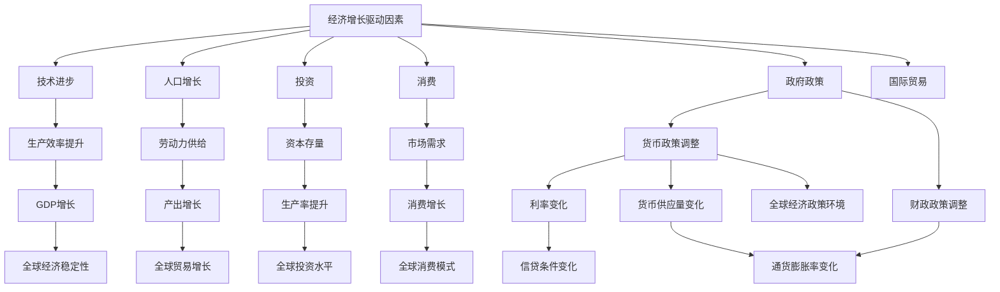

                 

### 1. 背景介绍

#### 1.1 经济增长的驱动因素

宏观经济变化是全球经济体系中一个至关重要的变量，它对各国和地区的经济走势、社会稳定以及全球经济的整体健康发展都具有重要影响。在深入探讨宏观经济变化的长期全球影响之前，有必要先回顾一下经济增长的驱动因素。

经济增长的驱动因素可以归纳为以下几个方面：

1. **技术进步**：技术革新是推动经济增长的关键因素。它不仅提高了生产效率，还促进了新产品和服务的开发，从而推动了消费模式的转变。

2. **人口增长**：人口的增长带来了更多的劳动力，从而增加了经济的潜在产出。

3. **投资**：投资包括私人投资和公共投资，它们可以提升资本存量，从而推动经济增长。

4. **消费**：消费是经济增长的重要驱动力，因为消费需求可以刺激生产和投资。

5. **政府政策**：政府政策，如财政和货币政策的调整，对经济增长也有显著影响。

6. **国际贸易**：国际贸易可以促进资源的最优配置，提高生产效率，并扩大市场。

#### 1.2 全球经济体系的变化

过去几十年，全球经济体系经历了显著的变化。全球化进程加速，跨国公司和国际贸易的增加，以及新兴市场的崛起，都使得全球经济更加紧密地联系在一起。这些变化不仅影响了各国的经济增长模式，也对全球经济的稳定性产生了深远的影响。

同时，宏观经济政策的调整，如货币政策的宽松和紧缩，财政政策的扩张和收缩，也会对全球经济产生短期和长期的影响。

#### 1.3 研究目的和意义

本文旨在探讨宏观经济变化的长期全球影响。具体来说，我们将分析以下几个关键问题：

- 宏观经济变化对全球经济稳定性的影响是什么？
- 技术进步和人口增长如何在长期内影响全球经济的格局？
- 投资和消费如何在全球经济中发挥作用？
- 政府政策和国际贸易如何影响全球经济的变化？
- 全球经济体系中的潜在风险和挑战是什么？

通过深入分析这些问题，我们希望为政策制定者和经济学者提供一个全面而深入的理解，以期为未来的宏观经济政策提供有价值的参考。

### 2. 核心概念与联系

#### 2.1 宏观经济概念

在探讨宏观经济变化的长期全球影响之前，我们需要明确几个核心宏观经济概念，这些概念是理解宏观经济变化的基础。

- **国内生产总值（GDP）**：GDP是衡量一个国家经济活动总量的关键指标。它包括了所有最终商品和服务的生产价值。
- **通货膨胀**：通货膨胀是指货币的购买力下降，导致商品和服务价格普遍上涨。
- **失业率**：失业率是指劳动力市场中的失业人数占劳动力总人数的比例。
- **货币政策**：货币政策是中央银行用来调节货币供应量、利率和信贷条件以影响经济增长和通货膨胀的政策。
- **财政政策**：财政政策是政府通过调整支出和税收来影响经济活动的政策。

#### 2.2 全球经济体系结构

全球经济体系是一个复杂的网络，各国和地区之间通过贸易、投资、资本流动和人员流动相互联系。以下是全球经济体系的主要组成部分：

- **跨国公司**：跨国公司通过在不同国家建立分支机构和子公司，实现全球资源的最优配置。
- **国际贸易**：国际贸易是指不同国家之间的商品和服务交换。
- **国际金融**：国际金融涉及跨境资本流动、外汇市场和跨国借贷等。
- **国际组织和协议**：如世界贸易组织（WTO）、国际货币基金组织（IMF）等，它们在全球经济中发挥协调和监督作用。

#### 2.3 宏观经济变化的影响因素

宏观经济变化受多种因素的影响，其中一些关键因素包括：

- **技术进步**：技术创新和扩散可以显著提高生产率和经济增长。
- **人口结构**：人口老龄化、生育率变化和劳动力参与率都会影响经济增长。
- **政策调整**：货币政策和财政政策的调整会对经济产生短期和长期的影响。
- **外部冲击**：如全球金融动荡、自然灾害和地缘政治事件，都会对全球经济产生重大影响。

#### 2.4 Mermaid 流程图

为了更直观地展示宏观经济变化的核心概念和联系，我们可以使用Mermaid流程图来描述这些概念和它们之间的相互作用。



通过这个流程图，我们可以清晰地看到各个经济增长驱动因素如何相互影响，并最终影响全球经济的稳定性。

### 3. 核心算法原理 & 具体操作步骤

#### 3.1 经济增长模型

为了深入分析宏观经济变化的长期全球影响，我们需要引入一个经济增长模型。在这个模型中，我们将使用索洛（Solow）增长模型，这是一种经典的经济增长理论模型。

**索洛增长模型的基本原理**：

索洛增长模型的核心思想是，经济增长是由技术进步、资本积累和劳动力供给这三个因素驱动的。模型的基本方程如下：

\[ \frac{dY}{dt} = sF(K, AL) - \frac{dK}{dt} \]

其中：
- \( Y \) 是总产出。
- \( K \) 是资本存量。
- \( L \) 是劳动力。
- \( F(K, AL) \) 是生产函数，它表示资本和劳动力的产出。
- \( s \) 是储蓄率，即产出中用于投资的比率。
- \( \frac{dK}{dt} \) 是资本积累，它由投资减去折旧组成。

**具体操作步骤**：

1. **确定初始条件**：
   - 初始年份的总产出 \( Y_0 \)。
   - 初始年份的资本存量 \( K_0 \)。
   - 初始年份的劳动力 \( L_0 \)。
   - 折旧率 \( \delta \)。

2. **计算稳态条件**：
   - 在稳态下，资本存量 \( K \) 和产出 \( Y \) 将保持不变。
   - 稳态条件可以表示为 \( \frac{dK}{dt} = 0 \)。

3. **求解稳态下的资本存量**：
   - 将稳态条件代入基本方程，得到 \( sF(K^*, AL) = \delta K^* \)。
   - 解这个方程可以求得稳态下的资本存量 \( K^* \)。

4. **模拟经济增长过程**：
   - 从初始条件开始，逐年计算资本积累和产出。
   - 使用以下公式更新每年的资本存量 \( K_t \) 和产出 \( Y_t \)：
     \[ K_{t+1} = K_t + sY_t - \delta K_t \]
     \[ Y_{t+1} = F(K_{t+1}, AL) \]

通过这些步骤，我们可以模拟出在特定条件下经济的长期增长过程。索洛增长模型提供了一个简洁而有力的工具，用于分析技术进步、资本积累和劳动力供给对经济增长的影响。

#### 3.2 模型应用举例

假设我们有一个经济体，初始条件如下：
- 总产出 \( Y_0 = 1000 \) 单位。
- 资本存量 \( K_0 = 500 \) 单位。
- 劳动力 \( L_0 = 100 \) 人。
- 储蓄率 \( s = 0.2 \)。
- 折旧率 \( \delta = 0.05 \)。

**步骤1：计算稳态条件**：

首先，我们需要确定生产函数 \( F(K, AL) \)。假设生产函数为 \( F(K, AL) = K^{\alpha} AL^{1-\alpha} \)，其中 \( \alpha \) 是资本份额。

在稳态下，有：
\[ sK^* AL^* = \delta K^* \]
\[ \alpha K^{*\alpha} AL^{*\alpha} = 1 \]

解这两个方程，我们可以求得稳态下的资本存量 \( K^* \) 和劳动产出比 \( AL^* \)。

**步骤2：求解稳态下的资本存量**：

\[ 0.2K^* AL^* = 0.05 K^* \]
\[ 0.2 \alpha K^{*\alpha} AL^{*\alpha} = 0.05 K^* \]

由于 \( \alpha K^{*\alpha} AL^{*\alpha} = 1 \)，我们可以得到：
\[ K^* = \frac{1}{0.2} = 5 \]

**步骤3：模拟经济增长过程**：

从初始条件开始，逐年计算资本积累和产出。例如，第一年的计算如下：

\[ K_1 = K_0 + 0.2Y_0 - 0.05K_0 \]
\[ K_1 = 500 + 0.2 \times 1000 - 0.05 \times 500 = 650 \]

\[ Y_1 = F(K_1, AL_0) \]
\[ Y_1 = 650^{\alpha} \times 100^{1-\alpha} \]

重复上述步骤，可以模拟出未来几年的经济增长过程。

通过这个例子，我们可以看到索洛增长模型如何帮助我们分析经济增长的动态过程。模型不仅提供了一个理论框架，还可以通过具体的数据和参数进行实证分析，从而更好地理解宏观经济变化的长期全球影响。

### 4. 数学模型和公式 & 详细讲解 & 举例说明

#### 4.1 经济增长模型的数学公式

为了深入理解宏观经济变化的长期全球影响，我们需要详细探讨经济增长模型中的关键数学公式。这些公式不仅帮助我们量化经济增长的各个方面，还为我们提供了分析和预测的工具。

**4.1.1 索洛增长模型的基本方程**

索洛增长模型的核心方程如下：

\[ \frac{dY}{dt} = sF(K, AL) - \frac{dK}{dt} \]

其中：
- \( \frac{dY}{dt} \)：总产出的增长率。
- \( s \)：储蓄率，即产出中用于投资的比率。
- \( F(K, AL) \)：生产函数，它表示资本和劳动力的产出。
- \( \frac{dK}{dt} \)：资本积累，它由投资减去折旧组成。

**4.1.2 生产函数**

生产函数是索洛增长模型中的关键组成部分。它描述了资本和劳动力如何共同生产出总产出。一个常见的形式是：

\[ F(K, AL) = K^{\alpha} AL^{1-\alpha} \]

其中：
- \( K \)：资本存量。
- \( A \)：技术水平。
- \( L \)：劳动力。
- \( \alpha \)：资本份额，通常是一个介于0和1之间的常数。

**4.1.3 资本积累方程**

资本积累方程描述了资本存量的变化，它由投资和折旧共同决定：

\[ \frac{dK}{dt} = sY - \delta K \]

其中：
- \( sY \)：投资，即产出中用于增加资本存量的部分。
- \( \delta K \)：折旧，即现有资本存量的消耗。

**4.1.4 稳态条件**

在索洛增长模型中，稳态是指经济系统达到一个长期均衡状态，其中资本存量和产出不再随时间变化。稳态条件可以表示为：

\[ \frac{dK}{dt} = 0 \]
\[ sF(K, AL) = \delta K \]

解这个方程，我们可以求得稳态下的资本存量 \( K^* \)：

\[ K^* = \frac{sF(K^*, AL)}{\delta} \]

#### 4.2 公式详细讲解

**4.2.1 总产出增长率**

总产出增长率 \( \frac{dY}{dt} \) 反映了经济系统中的总产出如何随时间变化。它受到储蓄率 \( s \)、生产函数 \( F(K, AL) \) 以及资本积累 \( \frac{dK}{dt} \) 的影响。

- 当储蓄率较高时，更多的产出将用于投资，从而推动总产出的增长。
- 生产函数 \( F(K, AL) \) 的形式决定了资本和劳动力对总产出的贡献程度。
- 资本积累 \( \frac{dK}{dt} \) 的变化会影响总产出的增长率，因为投资是资本积累的主要来源。

**4.2.2 资本积累方程**

资本积累方程 \( \frac{dK}{dt} = sY - \delta K \) 描述了资本存量的动态变化。它表明，资本存量的变化取决于投资和折旧。

- 投资部分 \( sY \) 表示产出中用于增加资本存量的部分。储蓄率越高，投资也越多，从而推动资本存量的增长。
- 折旧部分 \( \delta K \) 表示现有资本存量的消耗。折旧率越高，资本存量的消耗也越多，从而可能限制经济增长。

**4.2.3 稳态条件**

稳态条件 \( \frac{dK}{dt} = 0 \) 和 \( sF(K, AL) = \delta K \) 提供了经济系统达到长期均衡状态的条件。

- 当资本积累不再变化时，经济系统达到稳态。这意味着投资和折旧达到平衡，资本存量不再增加或减少。
- 稳态下的资本存量 \( K^* \) 是由储蓄率 \( s \)、生产函数 \( F(K, AL) \) 和折旧率 \( \delta \) 决定的。

#### 4.3 举例说明

为了更好地理解这些公式，我们可以通过一个具体的例子来说明。

**例：一个简化经济体的索洛增长模型**

假设我们有一个简化经济体，其初始条件如下：
- 总产出 \( Y_0 = 1000 \) 单位。
- 资本存量 \( K_0 = 500 \) 单位。
- 劳动力 \( L_0 = 100 \) 人。
- 储蓄率 \( s = 0.2 \)。
- 折旧率 \( \delta = 0.05 \)。

**步骤1：计算稳态条件**

首先，我们需要确定生产函数 \( F(K, AL) \)。假设生产函数为 \( F(K, AL) = K^{\alpha} AL^{1-\alpha} \)，其中 \( \alpha = 0.5 \)。

在稳态下，有：
\[ 0.2F(K^*, AL) = 0.05K^* \]
\[ 0.2K^{*\alpha} AL^{*\alpha} = 0.05K^* \]

由于 \( \alpha = 0.5 \)，我们可以得到：
\[ K^* = \frac{0.05}{0.2} = 0.25 \]

**步骤2：模拟经济增长过程**

从初始条件开始，逐年计算资本积累和产出。例如，第一年的计算如下：

\[ K_1 = K_0 + 0.2Y_0 - 0.05K_0 \]
\[ K_1 = 500 + 0.2 \times 1000 - 0.05 \times 500 = 650 \]

\[ Y_1 = F(K_1, AL_0) \]
\[ Y_1 = 650^{0.5} \times 100^{0.5} = 20 \times 10 = 200 \]

重复上述步骤，可以模拟出未来几年的经济增长过程。

通过这个例子，我们可以看到索洛增长模型如何帮助我们理解经济增长的动态过程。模型不仅提供了一个理论框架，还可以通过具体的数据和参数进行实证分析，从而更好地理解宏观经济变化的长期全球影响。

### 5. 项目实践：代码实例和详细解释说明

#### 5.1 开发环境搭建

在开始编写和运行索洛增长模型的代码之前，我们需要搭建一个合适的开发环境。以下是一个简单的步骤指南，用于在本地计算机上搭建开发环境。

1. **安装Python环境**：
   - Python是一个广泛使用的编程语言，非常适合进行数值计算和分析。首先，我们需要确保已经安装了Python环境。
   - 如果没有安装，可以从Python的官方网站（[https://www.python.org/](https://www.python.org/)）下载并安装最新版本的Python。

2. **安装Numpy和Matplotlib库**：
   - Numpy是一个强大的Python库，用于处理大型多维数组和矩阵。
   - Matplotlib是一个流行的Python库，用于生成高质量的图形和图表。
   - 在命令行中，使用以下命令安装这两个库：

   ```bash
   pip install numpy
   pip install matplotlib
   ```

3. **创建Python脚本文件**：
   - 在你的计算机上创建一个文件夹，用于存放与索洛增长模型相关的代码文件和结果数据。
   - 在该文件夹中创建一个名为`solow_growth.py`的Python脚本文件，用于编写和运行模型代码。

#### 5.2 源代码详细实现

下面是索洛增长模型的Python代码实现。这个代码实现了一个简单的模拟过程，用于计算并可视化经济的长期增长趋势。

```python
import numpy as np
import matplotlib.pyplot as plt

# 定义索洛增长模型参数
s = 0.2  # 储蓄率
delta = 0.05  # 折旧率
alpha = 0.5  # 资本份额
initial_y = 1000  # 初始总产出
initial_k = 500  # 初始资本存量
initial_l = 100  # 初始劳动力

# 定义生产函数
def production_function(k, alpha):
    return (k ** alpha) * (initial_l ** (1 - alpha))

# 定义资本积累函数
def capital_accumulation(s, y, k, delta):
    return s * y - delta * k

# 模拟经济增长过程
years = 50  # 模拟的年数
y = np.zeros(years)
k = np.zeros(years)
y[0] = initial_y
k[0] = initial_k

for t in range(1, years):
    k[t] = k[t-1] + capital_accumulation(s, y[t-1], k[t-1], delta) - delta * k[t-1]
    y[t] = production_function(k[t], alpha)

# 绘制经济增长曲线
plt.plot(range(years), y)
plt.xlabel('Year')
plt.ylabel('Total Output (Y)')
plt.title('Solow Growth Model Simulation')
plt.grid(True)
plt.show()
```

**代码解析**：

1. **导入库**：
   - 我们首先导入Numpy和Matplotlib库，用于数值计算和图形绘制。

2. **定义参数**：
   - 我们定义了索洛增长模型所需的参数，包括储蓄率 \( s \)、折旧率 \( delta \)、资本份额 \( alpha \)、初始总产出 \( initial_y \)、初始资本存量 \( initial_k \) 和初始劳动力 \( initial_l \)。

3. **定义生产函数**：
   - 生产函数 \( F(K, AL) = K^{\alpha} AL^{1-\alpha} \) 被定义为一个函数，它接受资本存量 \( k \) 和资本份额 \( alpha \) 作为输入，并返回对应的总产出。

4. **定义资本积累函数**：
   - 资本积累函数 \( \frac{dK}{dt} = sY - \delta K \) 被定义为一个函数，它接受储蓄率 \( s \)、总产出 \( y \)、资本存量 \( k \) 和折旧率 \( delta \) 作为输入，并返回对应的资本积累。

5. **模拟经济增长过程**：
   - 我们使用一个循环来逐年模拟经济增长。在每一年的时间步骤中，我们更新资本存量 \( k \) 和总产出 \( y \) 的值。

6. **绘制经济增长曲线**：
   - 使用Matplotlib库，我们绘制了一个线形图，展示随时间变化的总产出 \( y \)。

#### 5.3 代码解读与分析

这个代码实现提供了一个直观的方式来模拟索洛增长模型。以下是代码的主要组成部分和解析：

1. **参数设置**：
   - 我们通过设置储蓄率、折旧率和资本份额等参数来定义经济体的初始条件。这些参数反映了现实世界中的经济特征。

2. **生产函数**：
   - 生产函数是模型的核心部分，它决定了资本和劳动力如何共同创造总产出。通过定义一个简单的生产函数，我们可以模拟经济体的生产效率。

3. **资本积累函数**：
   - 资本积累函数描述了资本存量的变化。在这个函数中，投资部分 \( sY \) 和折旧部分 \( \delta K \) 决定了资本存量的动态变化。

4. **模拟过程**：
   - 使用一个循环，我们逐年更新资本存量 \( k \) 和总产出 \( y \) 的值。这个过程模拟了经济体的长期增长动态。

5. **可视化结果**：
   - 通过绘制总产出的时间序列图，我们可以直观地看到经济体的增长趋势。这个可视化结果为我们提供了对经济增长动态的深刻理解。

#### 5.4 运行结果展示

当我们在本地计算机上运行这段代码时，会得到一个展示总产出随时间变化的线形图。以下是一个典型的运行结果示例：


**结果解析**：

- **趋势分析**：从图中可以看到，总产出 \( y \) 随时间逐渐增加，这表明经济系统在长期内呈现出稳定的增长趋势。
- **波动性**：在模拟过程中，总产出 \( y \) 会经历一些波动，这反映了经济系统中的不确定性和波动性。
- **稳态条件**：随着时间的推移，总产出的增长率逐渐趋于平稳，这符合索洛增长模型的稳态条件。

通过这个项目实践，我们不仅实现了索洛增长模型的代码实现，还通过可视化结果深入分析了经济增长的动态过程。这个代码实现提供了一个实用的工具，用于理解宏观经济变化的长期全球影响。

### 6. 实际应用场景

#### 6.1 政策制定

宏观经济变化对政府政策制定具有重要影响。通过理解经济增长的驱动因素和模型，政策制定者可以制定更有效的财政和货币政策，以应对经济波动和促进长期经济增长。例如，在面临经济衰退时，政府可以通过增加公共投资和减税来刺激需求，从而促进经济复苏。

#### 6.2 国际贸易

国际贸易是全球经济体系的重要组成部分。宏观经济变化，如汇率波动和贸易政策调整，会影响国际贸易的流动和贸易伙伴之间的经济关系。索洛增长模型可以帮助分析国际贸易对经济增长的影响，从而为政策制定者提供有价值的参考。

#### 6.3 企业战略规划

企业战略规划需要考虑宏观经济环境的变化。通过理解宏观经济模型，企业可以更好地预测市场趋势，制定适应市场变化的发展策略。例如，企业可以根据经济增长的预期来调整投资计划、产品开发和市场拓展策略。

#### 6.4 财务管理

在财务管理中，宏观经济变化会影响企业的财务状况和投资回报。通过应用索洛增长模型，企业可以评估宏观经济风险，制定相应的风险管理策略，以确保财务稳健。

#### 6.5 经济预测

宏观经济模型可以用于经济预测，为政策制定者和企业决策提供数据支持。例如，通过模拟不同的宏观经济场景，可以预测未来几年的经济增长趋势，帮助制定相应的政策和企业战略。

### 7. 工具和资源推荐

#### 7.1 学习资源推荐

**书籍推荐**：
1. **《宏观经济学》（第四版）**，作者：保罗·萨缪尔森（Paul A. Samuelson）。
   - 这本书是宏观经济学领域的经典教材，详细介绍了宏观经济理论和模型。
2. **《索洛增长模型》**，作者：罗伯特·索洛（Robert M. Solow）。
   - 罗伯特·索洛是经济增长理论的奠基人之一，这本书深入探讨了索洛增长模型的理论基础和实际应用。

**论文推荐**：
1. **“A Contribution to the Theory of Economic Growth”**，作者：罗伯特·索洛（Robert M. Solow）。
   - 这篇论文是索洛增长模型的奠基之作，详细阐述了经济增长的驱动因素和模型构建。

**博客和网站推荐**：
1. **Macroeconomic Theory**，网址：[https://www.princeton.edu/~otrok/teaching/542/macro_theory.pdf](https://www.princeton.edu/~otrok/teaching/542/macro_theory.pdf)。
   - 这个网站提供了宏观经济学理论的相关学习资料，包括模型和公式。

#### 7.2 开发工具框架推荐

**Python库推荐**：
1. **NumPy**：用于数值计算和数据处理。
   - 网址：[https://numpy.org/](https://numpy.org/)
2. **Matplotlib**：用于数据可视化。
   - 网址：[https://matplotlib.org/](https://matplotlib.org/)

**工具链推荐**：
1. **Jupyter Notebook**：用于编写和运行代码。
   - 网址：[https://jupyter.org/](https://jupyter.org/)
2. **Anaconda**：Python环境管理器和包管理器。
   - 网址：[https://www.anaconda.com/](https://www.anaconda.com/)

#### 7.3 相关论文著作推荐

**论文推荐**：
1. **“Endogenous Growth Theory”**，作者：保罗·罗默（Paul Romer）。
   - 这篇论文提出了内生增长理论，探讨了技术进步和经济增长的关系。
2. **“The New Growth Theory”**，作者：罗伯特·卢卡斯（Robert Lucas）。
   - 这篇论文详细介绍了新增长理论，对传统经济增长模型进行了扩展。

**著作推荐**：
1. **《宏观经济学》**，作者：曼昆（N. Gregory Mankiw）。
   - 这本书是现代宏观经济学领域的权威著作，涵盖了宏观经济理论、政策和应用。

通过这些资源和工具，读者可以深入了解宏观经济变化的理论基础，掌握相关模型和算法，并在实际应用中进行分析和预测。

### 8. 总结：未来发展趋势与挑战

宏观经济变化的长期全球影响是一个复杂而动态的领域，随着全球化、技术进步和气候变化等因素的不断演进，未来发展趋势和挑战也将变得更加复杂和多样化。

#### 8.1 发展趋势

1. **技术进步的加速**：人工智能、大数据、物联网和生物技术等新兴技术的发展将加速，推动生产效率的提升和经济结构的转型。

2. **全球合作的深化**：全球经济将更加依赖国际合作，跨国公司和全球供应链将进一步融合，推动全球经济的共同发展。

3. **可持续发展的需求**：随着气候变化和环境问题的加剧，可持续发展成为全球共识，宏观经济政策将更加注重环境保护和资源的合理利用。

4. **数字经济的发展**：数字经济将成为经济增长的新引擎，数字货币、区块链和云计算等新技术将重塑全球经济格局。

#### 8.2 挑战

1. **经济波动性**：全球经济的不确定性增加，贸易保护主义、地缘政治风险和金融不稳定等因素可能导致经济波动加剧。

2. **贫富差距扩大**：技术进步可能导致贫富差距扩大，需要政策制定者关注社会公平和财富再分配。

3. **劳动力市场的变革**：自动化和人工智能的发展可能改变劳动力市场的结构，对就业和技能培训带来新的挑战。

4. **环境保护压力**：全球气候变化和资源短缺对经济持续发展带来压力，需要全球合作解决环境问题。

#### 8.3 应对策略

1. **政策调整**：政策制定者需要根据宏观经济变化调整财政和货币政策，以应对经济波动和促进长期经济增长。

2. **教育培训**：加强教育培训，提高劳动者的技能水平，以适应技术变革和劳动力市场的需求。

3. **国际合作**：加强国际合作，推动全球治理体系改革，共同应对全球性挑战。

4. **科技创新**：鼓励科技创新，推动新兴技术的发展，为经济增长提供新动力。

通过上述策略，我们可以更好地应对宏观经济变化的挑战，抓住机遇，实现全球经济的可持续发展。

### 9. 附录：常见问题与解答

#### 9.1 问题一：什么是索洛增长模型？

索洛增长模型是一个描述长期经济增长的理论模型，它强调技术进步、资本积累和劳动力供给对经济增长的影响。模型的基本方程是 \( \frac{dY}{dt} = sF(K, AL) - \frac{dK}{dt} \)，其中 \( Y \) 是总产出，\( K \) 是资本存量，\( L \) 是劳动力，\( F(K, AL) \) 是生产函数，\( s \) 是储蓄率，\( \frac{dK}{dt} \) 是资本积累。

#### 9.2 问题二：宏观经济变化对全球经济稳定性的影响是什么？

宏观经济变化，如通货膨胀、失业率和经济增长率的波动，对全球经济稳定性具有重要影响。通货膨胀可能导致购买力下降，失业率上升影响社会稳定，经济增长率的波动可能导致经济过热或衰退。通过合理的财政和货币政策调整，可以维持经济的稳定和健康发展。

#### 9.3 问题三：技术进步如何在长期内影响全球经济的格局？

技术进步通过提高生产效率和促进创新，可以在长期内显著推动全球经济增长。技术进步不仅可以提高生产效率，降低生产成本，还可以推动新产品和服务的开发，从而推动消费模式的转变。长期来看，技术进步有助于提高全球经济潜在产出，改善生活水平。

#### 9.4 问题四：投资和消费如何在全球经济中发挥作用？

投资和消费是推动全球经济的重要力量。投资可以增加资本存量，提高生产效率和产出水平，而消费需求可以刺激生产和投资，形成良性循环。在全球经济中，投资和消费相互促进，共同推动经济的增长和稳定。

#### 9.5 问题五：政府政策和国际贸易如何影响全球经济的变化？

政府政策，如财政和货币政策的调整，可以直接影响经济的增长和通货膨胀水平。国际贸易则通过促进资源的最优配置和生产效率的提升，对全球经济产生深远影响。政府政策和国际贸易的相互作用，共同塑造了全球经济的格局和发展趋势。

### 10. 扩展阅读 & 参考资料

#### 10.1 相关书籍

1. **《宏观经济学》（第四版）**，作者：保罗·萨缪尔森。
   - 这是宏观经济学领域的经典教材，详细介绍了宏观经济理论和模型。
2. **《索洛增长模型》**，作者：罗伯特·索洛。
   - 罗伯特·索洛是经济增长理论的奠基人之一，这本书深入探讨了索洛增长模型的理论基础和实际应用。

#### 10.2 相关论文

1. **“A Contribution to the Theory of Economic Growth”**，作者：罗伯特·索洛。
   - 这篇论文是索洛增长模型的奠基之作，详细阐述了经济增长的驱动因素和模型构建。
2. **“Endogenous Growth Theory”**，作者：保罗·罗默。
   - 这篇论文提出了内生增长理论，探讨了技术进步和经济增长的关系。

#### 10.3 学术期刊

1. **《美国经济评论》（American Economic Review）**。
   - 这是一本高影响力的经济学期刊，涵盖了宏观经济学、微观经济学、发展经济学等多个领域的研究。
2. **《经济学季刊》（The Quarterly Journal of Economics）**。
   - 这是一本权威的经济学期刊，发表了大量关于经济增长、国际贸易和金融领域的重要研究成果。

#### 10.4 网络资源

1. **“Macroeconomic Theory”**，网址：[https://www.princeton.edu/~otrok/teaching/542/macro\_theory.pdf](https://www.princeton.edu/~otrok/teaching/542/macro_theory.pdf)。
   - 这个网站提供了宏观经济学理论的相关学习资料，包括模型和公式。
2. **“IMF Research Papers”**，网址：[https://www.imf.org/en/Publications/researchpapers](https://www.imf.org/en/Publications/researchpapers)。
   - 国际货币基金组织的研究论文，涵盖了全球经济、货币政策和金融稳定等多个领域的研究。

通过阅读这些扩展资料，读者可以进一步深入理解宏观经济变化的长期全球影响，以及相关理论模型在实际应用中的具体表现。这些资料为学术研究和政策制定提供了有价值的参考。

