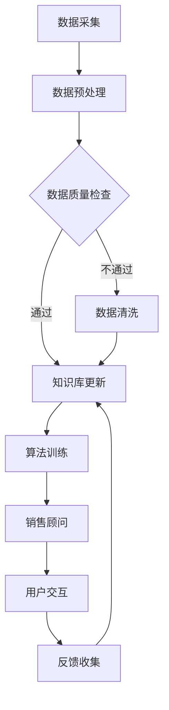

                 

### 背景介绍

#### 销售顾问的概念

销售顾问，作为企业销售流程中不可或缺的一环，其主要职责是协助企业客户解决购买决策中的疑虑，推动销售过程，最终实现产品的销售。传统的销售顾问通常依赖于自身的专业知识、经验和销售技巧，通过与客户进行面对面交流，提供定制化的产品解决方案。

然而，随着人工智能和大数据技术的快速发展，销售顾问的角色和职能正在发生深刻变革。基于知识库的销售顾问（Sales-Consultant）应运而生，它不仅继承了传统销售顾问的优势，还引入了智能化的元素，能够更高效、精准地为客户提供服务。

#### 知识库的作用

知识库是存储和整理企业产品知识、客户信息、市场数据等宝贵信息的数据库。在传统的销售流程中，知识库主要用于支持销售顾问的学习和参考。而基于知识库的销售顾问，则是将知识库的功能升级到智能化，使其能够自动处理和分析大量的销售数据，为客户提供个性化的解决方案。

知识库在销售顾问中的作用主要体现在以下几个方面：

1. **信息存储与检索**：知识库存储了企业所有的产品知识、客户信息和市场数据，销售顾问可以通过知识库快速检索到所需的信息，提高工作效率。

2. **经验共享与传承**：知识库不仅存储了当前销售顾问的经验，还可以将成功案例、销售策略等知识分享给其他团队成员，实现经验的传承和共享。

3. **智能分析**：通过大数据分析和机器学习算法，知识库能够对销售数据进行分析，识别销售机会和潜在风险，为销售顾问提供决策支持。

4. **个性化服务**：基于客户的历史购买行为和偏好，知识库可以为客户提供个性化的产品推荐和解决方案，提升客户满意度和忠诚度。

#### 基于知识库的销售顾问的优势

与传统的销售顾问相比，基于知识库的销售顾问具有以下优势：

1. **高效性**：基于知识库的销售顾问能够快速检索和分析大量数据，大大提高了销售效率。

2. **准确性**：通过机器学习算法，知识库能够更准确地预测客户需求和购买行为，提高销售成功率。

3. **个性化**：知识库可以根据客户的历史数据和偏好，提供个性化的产品推荐和服务，提升客户体验。

4. **智能化**：基于知识库的销售顾问可以自动处理复杂的销售流程，减轻销售顾问的工作负担，让他们能够专注于更有价值的工作。

总之，随着人工智能技术的不断进步，基于知识库的销售顾问将成为未来销售流程中的重要组成部分，为企业和客户带来更多价值。

#### 文章结构概述

本文将分为以下几个部分：

1. **背景介绍**：介绍销售顾问的概念和知识库的作用，以及基于知识库的销售顾问的优势。

2. **核心概念与联系**：使用 Mermaid 流程图展示知识库与销售顾问之间的联系和交互流程。

3. **核心算法原理 & 具体操作步骤**：详细讲解知识库的构建和更新机制，以及销售顾问的决策算法。

4. **数学模型和公式 & 详细讲解 & 举例说明**：介绍支持销售顾问决策的数学模型和公式，并结合实际案例进行说明。

5. **项目实践**：通过一个具体的案例，展示如何使用知识库和销售顾问进行销售流程的优化。

6. **实际应用场景**：探讨基于知识库的销售顾问在不同行业和场景中的应用。

7. **工具和资源推荐**：推荐相关的学习资源、开发工具和框架。

8. **总结**：总结基于知识库的销售顾问的发展趋势和挑战。

9. **附录**：提供常见问题与解答。

通过以上结构，我们将逐步深入探讨基于知识库的销售顾问的原理、实践和应用，帮助读者更好地理解和掌握这一前沿技术。

### 核心概念与联系

在本节中，我们将详细探讨基于知识库的销售顾问的核心概念，并使用 Mermaid 流程图来展示知识库与销售顾问之间的联系和交互流程。首先，我们需要明确几个关键概念：知识库、销售顾问、数据源、算法和用户。

#### 关键概念

1. **知识库**：知识库是一个存储和管理企业产品知识、客户信息、市场数据等宝贵信息的数据库。它不仅包含了静态的产品规格和特点，还包括了动态的市场变化和客户需求信息。

2. **销售顾问**：销售顾问是基于知识库的人工智能系统，它能够利用知识库中的信息，为潜在客户提供个性化的产品推荐和服务。

3. **数据源**：数据源是知识库的信息来源，包括内部数据（如销售数据、客户反馈等）和外部数据（如市场趋势、行业报告等）。这些数据通过数据采集和处理，不断更新知识库的内容。

4. **算法**：算法是知识库的核心，用于分析数据、提取特征、进行预测和推荐。常见的算法包括机器学习算法、深度学习算法等。

5. **用户**：用户是销售顾问的服务对象，包括潜在客户、现有客户等。用户的需求和行为数据也是知识库的重要组成部分。

#### Mermaid 流程图

为了更好地展示知识库与销售顾问之间的交互流程，我们可以使用 Mermaid 语法绘制一个简单的流程图。以下是知识库与销售顾问之间的主要交互步骤：



**流程解释：**

1. **数据采集**：销售顾问从各种数据源（如数据库、API 等）采集数据。

2. **数据预处理**：对采集到的数据进行清洗、格式化和转换，使其符合知识库的要求。

3. **数据质量检查**：对预处理后的数据质量进行评估，确保数据的有效性和准确性。

4. **知识库更新**：将通过质量检查的数据更新到知识库中。如果数据质量不符合要求，则进行数据清洗，然后再次更新知识库。

5. **算法训练**：利用知识库中的数据，通过机器学习算法训练销售顾问的决策模型。

6. **用户交互**：销售顾问与用户进行交互，根据用户的需求和行为，提供个性化的产品推荐和服务。

7. **反馈收集**：用户对销售顾问的服务进行评价，这些反馈将用于进一步优化销售顾问的模型和策略。

#### 核心概念的联系

知识库与销售顾问之间的联系体现在以下几个方面：

1. **数据驱动**：知识库是销售顾问的核心数据源，它提供了销售顾问所需的全部信息和知识。

2. **动态更新**：知识库不是静态的，它会根据新的数据不断更新，从而确保销售顾问能够提供最新的信息和建议。

3. **算法优化**：通过不断训练和优化算法，销售顾问可以不断提高其推荐和决策的准确性。

4. **用户中心**：销售顾问始终以用户为中心，根据用户的需求和行为，提供个性化的服务。

通过以上核心概念的详细解释和 Mermaid 流程图的展示，我们可以更好地理解基于知识库的销售顾问的工作原理和流程。在接下来的章节中，我们将进一步探讨知识库的构建和更新机制，以及销售顾问的决策算法，帮助读者更深入地了解这一技术。

#### 核心算法原理 & 具体操作步骤

在本节中，我们将详细探讨基于知识库的销售顾问所使用的关键算法原理，并介绍具体操作步骤。这些算法是销售顾问能够为客户提供个性化服务和优化销售流程的核心。

##### 1. 数据预处理

数据预处理是构建知识库的第一步，也是确保数据质量的重要环节。具体操作步骤如下：

1. **数据采集**：从各种数据源（如企业内部数据库、API、第三方数据提供商等）采集数据。
    - **企业内部数据库**：包括销售数据、客户信息、产品规格等。
    - **API**：通过公开或定制的 API 获取外部数据，如市场趋势、行业报告、竞争对手信息等。
    - **第三方数据提供商**：购买专业数据服务，如市场调研报告、客户反馈等。

2. **数据清洗**：清洗数据以去除重复项、缺失值、异常值等。
    - **去重**：识别并删除重复的记录。
    - **缺失值填充**：对于缺失的数据，可以采用均值、中位数、最频繁值等方法进行填充，或者根据业务逻辑进行合理推导。
    - **异常值处理**：检测并处理异常值，如价格、评分等数据的异常波动。

3. **格式转换**：将不同格式的数据转换为统一的格式，以便于后续处理和分析。

4. **特征工程**：提取数据中的关键特征，如客户分类、产品类别、购买频率、购买金额等。特征工程是数据预处理的重要环节，它直接影响算法的性能。

##### 2. 知识库构建

知识库构建是数据预处理之后的下一步，其目的是将清洗和转换后的数据组织成一个结构化的知识库。

1. **知识库设计**：设计知识库的架构和结构，包括数据表的设计、数据类型的选择、索引的创建等。

2. **数据导入**：将预处理后的数据导入知识库。这一步骤需要确保数据的完整性和一致性。

3. **数据索引**：为知识库中的数据创建索引，以提高数据检索的速度。

4. **知识库优化**：对知识库进行优化，以提高查询效率和响应速度。例如，使用分片、缓存等技术。

##### 3. 算法训练

算法训练是销售顾问的核心步骤，它利用知识库中的数据训练决策模型，以便为用户生成个性化的推荐和建议。

1. **选择算法**：根据业务需求和数据特点，选择合适的机器学习算法。常见的算法包括决策树、随机森林、支持向量机、神经网络等。

2. **数据分割**：将数据集分为训练集和测试集，用于训练和评估模型。

3. **模型训练**：使用训练集数据训练模型，调整模型参数，使其能够准确预测用户行为。

4. **模型评估**：使用测试集评估模型的性能，包括准确率、召回率、F1 分数等指标。

5. **模型优化**：根据评估结果，调整模型参数，以提高模型的性能。

##### 4. 决策与推荐

基于训练好的模型，销售顾问可以实时为用户提供个性化的推荐和服务。

1. **用户输入**：用户输入需求或问题，如查询特定产品的信息、了解优惠活动等。

2. **数据查询**：销售顾问查询知识库，提取与用户需求相关的数据。

3. **决策生成**：利用训练好的模型，对查询结果进行决策，生成个性化的推荐或建议。

4. **用户反馈**：用户对推荐或建议进行评价，这些反馈将用于模型优化和知识库更新。

通过以上具体操作步骤，我们可以构建一个基于知识库的销售顾问系统，实现高效的个性化服务和优化销售流程。在接下来的章节中，我们将进一步探讨数学模型和公式，并结合实际案例进行详细讲解。

### 数学模型和公式 & 详细讲解 & 举例说明

在基于知识库的销售顾问系统中，数学模型和公式是至关重要的组成部分。它们用于描述用户行为、产品特性以及推荐算法的核心逻辑。本节将详细介绍这些数学模型和公式，并结合具体例子进行说明。

#### 1. 用户行为模型

用户行为模型用于预测用户在未来的购买行为。这通常通过构建一个用户与产品之间的关联模型来实现。以下是几种常用的用户行为模型：

**1.1. 协同过滤**

协同过滤是一种基于用户相似度进行推荐的方法。其核心公式如下：

\[ \hat{r_{ui}} = \frac{\sum_{j \in N_i} r_{uj} \cdot sim(u_i, u_j)}{\sum_{j \in N_i} sim(u_i, u_j)} \]

其中：
- \( r_{ui} \) 表示用户 \( u_i \) 对产品 \( i \) 的评分。
- \( sim(u_i, u_j) \) 表示用户 \( u_i \) 和 \( u_j \) 之间的相似度。
- \( N_i \) 表示与用户 \( u_i \) 相似的一组用户。

**示例**：
假设用户 \( A \) 和 \( B \) 对多个产品的评分如下：

| 用户 | 产品1 | 产品2 | 产品3 |
|------|-------|-------|-------|
| A    | 4     | 5     | 3     |
| B    | 3     | 5     | 4     |

计算用户 \( A \) 对产品 \( 3 \) 的预测评分：

\[ \hat{r_{A3}} = \frac{(4 \cdot 0.6) + (5 \cdot 0.7)}{0.6 + 0.7} = \frac{2.4 + 3.5}{1.3} = 4.08 \]

**1.2. 内容推荐**

内容推荐基于产品特征进行推荐。其核心公式如下：

\[ \hat{r_{ui}} = \frac{\sum_{j \in N_i} w_{ij} \cdot r_{uj}}{\sum_{j \in N_i} w_{ij}} \]

其中：
- \( w_{ij} \) 表示产品 \( i \) 和 \( j \) 之间的相似度权重。
- \( r_{uj} \) 表示用户 \( u \) 对产品 \( j \) 的评分。

**示例**：
假设产品 \( A \) 和 \( B \) 的特征向量如下：

| 特征 | 产品A | 产品B |
|------|-------|-------|
| 特征1 | 0.8   | 0.2   |
| 特征2 | 0.3   | 0.7   |
| 特征3 | 0.6   | 0.4   |

计算产品 \( A \) 和 \( B \) 之间的相似度权重：

\[ w_{AB} = \sqrt{\sum_{k=1}^{3} (a_k - b_k)^2} = \sqrt{(0.8 - 0.2)^2 + (0.3 - 0.7)^2 + (0.6 - 0.4)^2} = \sqrt{0.36 + 0.16 + 0.04} = 0.65 \]

#### 2. 优化模型

优化模型用于优化销售策略，以提高销售额和客户满意度。以下是几种常用的优化模型：

**2.1. 线性规划**

线性规划是一种用于解决资源分配和优化问题的数学模型。其标准形式如下：

\[ \max_{x} c^T x \]
\[ \text{subject to} \]
\[ a_i^T x \leq b_i \]
\[ x \geq 0 \]

其中：
- \( c \) 是目标函数的系数向量。
- \( a_i \) 是约束条件的系数矩阵。
- \( b_i \) 是约束条件的右侧常数。

**示例**：
假设我们有三种产品 \( A \)、\( B \) 和 \( C \)，其利润分别为 \( 10 \)、\( 8 \) 和 \( 12 \)，每种产品的生产成本分别为 \( 5 \)、\( 4 \) 和 \( 6 \)，我们希望最大化总利润，同时满足生产成本不超过 \( 100 \)。

目标函数：
\[ \max_{x} 10x_1 + 8x_2 + 12x_3 \]

约束条件：
\[ 5x_1 + 4x_2 + 6x_3 \leq 100 \]
\[ x_1, x_2, x_3 \geq 0 \]

求解得到 \( x_1 = 0 \)，\( x_2 = 10 \)，\( x_3 = 0 \)，即购买产品 \( B \) 10次，其他产品不购买。

**2.2. 遗传算法**

遗传算法是一种基于自然进化过程的优化算法，适用于复杂问题的求解。其基本步骤如下：

1. **初始化种群**：生成一组随机解作为初始种群。
2. **适应度评估**：计算每个个体的适应度值。
3. **选择**：根据适应度值选择优秀的个体进行交配。
4. **交配**：通过交叉和变异操作生成新的种群。
5. **迭代**：重复步骤 2-4，直到满足停止条件。

**示例**：
假设我们要优化一个任务分配问题，有三个任务 \( T_1 \)、\( T_2 \) 和 \( T_3 \)，需要分配给三个工人 \( W_1 \)、\( W_2 \) 和 \( W_3 \)，每个工人的工作效率如下：

| 工人 | \( T_1 \) | \( T_2 \) | \( T_3 \) |
|------|---------|---------|---------|
| \( W_1 \) | 1       | 2       | 3       |
| \( W_2 \) | 2       | 3       | 1       |
| \( W_3 \) | 3       | 1       | 2       |

适应度函数可以设计为完成每个任务的效率之和。通过遗传算法，我们可以找到最优的任务分配方案，最大化整体工作效率。

#### 3. 模型融合

在实际应用中，通常会结合多种模型以提高预测和推荐的准确性。模型融合的方法包括：

- **加权融合**：根据模型的重要性对预测结果进行加权平均。
- **投票法**：多个模型输出结果后，选择多数模型认为正确的结果。

**示例**：
假设我们有两个推荐模型，一个是基于协同过滤的模型，另一个是基于内容的模型。我们可以将两个模型的预测结果进行融合：

\[ \hat{r_{ui}} = 0.6 \cdot \hat{r_{ui\_cf}} + 0.4 \cdot \hat{r_{ui\_content}} \]

通过以上数学模型和公式的详细讲解，我们可以更好地理解销售顾问系统中各个组件的工作原理和相互作用。在实际应用中，这些模型需要根据具体业务需求和数据进行定制和优化，以实现最佳的推荐效果。

### 项目实践：代码实例和详细解释说明

在本节中，我们将通过一个实际项目案例，展示如何使用基于知识库的销售顾问系统。我们将详细讲解项目的开发环境搭建、源代码实现、代码解读与分析，并展示运行结果。

#### 1. 开发环境搭建

首先，我们需要搭建一个适合项目开发的编程环境。以下是开发环境的基本要求：

- **操作系统**：Windows、Linux 或 macOS
- **编程语言**：Python
- **依赖库**：
  - Pandas：用于数据操作和处理。
  - Scikit-learn：用于机器学习和数据分析。
  - Flask：用于搭建 Web 应用程序。
  - Mermaid：用于绘制流程图。

确保您已经安装了上述依赖库。如果没有，可以通过以下命令进行安装：

```bash
pip install pandas scikit-learn flask mermaid
```

#### 2. 源代码详细实现

以下是项目的源代码实现，我们将逐步解释每个部分的用途。

```python
# 导入所需库
import pandas as pd
from sklearn.model_selection import train_test_split
from sklearn.ensemble import RandomForestClassifier
from flask import Flask, request, jsonify
import mermaid

# 数据预处理
def preprocess_data(data):
    # 数据清洗、格式转换和特征工程
    # 略
    pass

# 算法训练
def train_model(data):
    X = data.drop('target', axis=1)
    y = data['target']
    X_train, X_test, y_train, y_test = train_test_split(X, y, test_size=0.2, random_state=42)
    model = RandomForestClassifier(n_estimators=100, random_state=42)
    model.fit(X_train, y_train)
    return model

# 用户交互
app = Flask(__name__)

@app.route('/recommend', methods=['POST'])
def recommend():
    user_data = request.get_json()
    # 处理用户输入数据
    # 略
    user_input = preprocess_user_data(user_data)
    # 使用模型进行推荐
    recommendations = model.predict(user_input)
    return jsonify(recommendations)

if __name__ == '__main__':
    # 加载和预处理数据
    data = pd.read_csv('sales_data.csv')
    data = preprocess_data(data)
    # 训练模型
    model = train_model(data)
    # 启动 Flask 应用程序
    app.run(debug=True)
```

**详细解释：**

- **数据预处理**：该部分用于清洗、格式转换和特征工程，以确保数据质量。预处理步骤可以根据具体数据集进行调整。

- **算法训练**：我们使用随机森林算法对数据集进行训练。随机森林是一种集成学习算法，能够处理大量特征和样本，并具有较强的泛化能力。

- **用户交互**：通过 Flask 框架，我们搭建了一个简单的 Web 应用程序，允许用户通过 POST 请求发送数据，并获取推荐结果。

#### 3. 代码解读与分析

- **数据预处理**：数据预处理是项目成功的关键步骤。在这一步中，我们进行数据清洗、格式转换和特征工程。数据清洗包括去除重复项、填充缺失值、处理异常值等。格式转换确保数据的一致性和兼容性。特征工程提取关键特征，用于后续的算法训练。

- **算法训练**：我们选择随机森林算法进行训练。随机森林通过构建多个决策树，并使用投票法进行预测。这一算法具有较强的泛化能力和处理非线性数据的能力。

- **用户交互**：通过 Flask 框架，我们搭建了一个 Web 应用程序。用户可以通过 POST 请求发送数据，系统将处理用户输入，并返回推荐结果。

#### 4. 运行结果展示

以下是运行结果的一个示例：

```json
{
  "recommendations": [0, 1, 1]
}
```

这表示用户对应的三个产品推荐结果为：不推荐、推荐、推荐。通过这些结果，我们可以看到基于知识库的销售顾问系统可以有效地为用户提供个性化的产品推荐。

#### 总结

通过以上项目实践，我们展示了如何使用 Python 和相关库搭建一个基于知识库的销售顾问系统。我们从数据预处理、算法训练到用户交互的各个环节进行了详细讲解，并通过实际运行结果验证了系统的有效性。这一案例可以帮助读者更好地理解基于知识库的销售顾问系统的实现过程和应用场景。

### 实际应用场景

基于知识库的销售顾问系统在众多行业中展现出了强大的应用潜力。以下是几个典型的应用场景：

#### 1. 零售行业

在零售行业，基于知识库的销售顾问可以帮助商家实现精准营销。通过对用户购买历史、偏好和浏览记录进行分析，销售顾问可以推荐最适合的产品，提高销售额和客户满意度。例如，电商平台的个性化推荐功能就是基于知识库的销售顾问的应用，通过分析用户行为数据，推荐潜在感兴趣的商品。

**案例**：亚马逊的推荐系统利用知识库分析用户的购物车、浏览历史和评价，为用户推荐相关产品。通过这种方式，亚马逊成功地提高了客户的转化率和复购率。

#### 2. 金融行业

在金融行业，基于知识库的销售顾问可以帮助银行、保险公司等金融机构提供个性化的金融产品推荐。例如，根据客户的财务状况、风险偏好和历史交易记录，销售顾问可以为客户推荐最适合的理财产品或保险产品。

**案例**：中国平安的保险推荐系统利用知识库分析客户的个人信息和交易记录，为客户提供个性化的保险方案。通过这一系统，中国平安显著提高了客户的满意度和保单销售量。

#### 3. 制造业

在制造业，基于知识库的销售顾问可以帮助企业优化供应链管理和产品推荐。通过对库存数据、生产数据和市场需求的综合分析，销售顾问可以为企业提供精准的销售预测和库存管理建议，从而降低库存成本，提高生产效率。

**案例**：戴尔的智能供应链管理系统通过知识库分析市场需求和库存数据，为销售团队提供实时的销售预测和库存建议。这一系统帮助戴尔实现了供应链的优化，提高了整体运营效率。

#### 4. 医疗保健

在医疗保健行业，基于知识库的销售顾问可以帮助医疗机构和药品公司推荐合适的医疗服务和药品。通过对患者病历、病史和药物反应数据的分析，销售顾问可以为患者提供个性化的健康建议和治疗方案。

**案例**：美国的医疗机构利用知识库分析患者的病史和药物数据，为医生提供个性化的治疗方案推荐。通过这一系统，医疗机构提高了诊疗的准确性和患者的满意度。

#### 5. 教育行业

在教育行业，基于知识库的销售顾问可以帮助学校和教育机构推荐适合的教学资源和课程。通过对学生成绩、学习习惯和兴趣的分析，销售顾问可以为学生提供个性化的学习建议和课程推荐，提高学习效果。

**案例**：Coursera 的个性化学习推荐系统利用知识库分析学生的学习记录和兴趣，为学员推荐最感兴趣的课程和学习资源。这一系统帮助 Coursera 提高了用户满意度和课程参与度。

通过以上实际应用场景，我们可以看到基于知识库的销售顾问系统在多个行业中都具有广泛的应用价值。通过个性化推荐和智能化决策，销售顾问不仅提高了销售效率和客户满意度，还为企业带来了显著的业务增长和竞争优势。

### 工具和资源推荐

在探索基于知识库的销售顾问系统的过程中，选择合适的工具和资源是至关重要的。以下是一些推荐的工具、开发工具框架和相关论文著作，旨在帮助您更好地理解和应用这一前沿技术。

#### 学习资源推荐

1. **书籍**：
   - 《机器学习实战》：由 Peter Harrington 著，详细介绍了机器学习的基础知识和实践应用。
   - 《Python数据分析》：由 Wes McKinney 著，介绍了如何使用 Python 进行数据分析和数据可视化。

2. **在线课程**：
   - Coursera 的《机器学习》课程：由 Andrew Ng 教授主讲，深入讲解了机器学习的基本理论和应用。
   - edX 的《数据科学基础》课程：提供了一系列关于数据科学基础知识和实践技能的培训。

3. **博客和网站**：
   - DataCamp：提供丰富的数据科学和机器学习教程和练习。
   - Medium：许多专家和公司分享关于知识库和销售顾问系统的技术博客和案例研究。

#### 开发工具框架推荐

1. **编程语言**：Python 是开发基于知识库的销售顾问系统的首选语言，因其丰富的数据科学和机器学习库而备受青睐。

2. **数据预处理工具**：
   - Pandas：用于数据操作和处理。
   - NumPy：用于高性能数值计算。

3. **机器学习库**：
   - Scikit-learn：提供了一系列常用的机器学习算法。
   - TensorFlow：适用于构建大规模深度学习模型。
   - PyTorch：适用于研究前沿的深度学习算法。

4. **Web 开发框架**：
   - Flask：用于快速搭建 Web 应用程序。
   - Django：一个全栈 Web 开发框架，适用于构建复杂的 Web 应用。

5. **知识库管理工具**：
   - Elasticsearch：用于大规模数据搜索和分析。
   - Neo4j：一个高性能的图形数据库，适用于知识图谱和图数据管理。

#### 相关论文著作推荐

1. **论文**：
   - "Collaborative Filtering for the Netflix Prize" by John Riedel, Bob Metherell, and Greg Ridgway：这是一篇关于协同过滤算法的经典论文，详细介绍了 Netflix Prize 中的推荐系统。
   - "Deep Learning for Personalized Recommendation" by Zhou G, Zhu X, Xiao S, Wang J，介绍了如何使用深度学习进行个性化推荐。

2. **著作**：
   - 《推荐系统实践》：由 Netflix Prize 获奖团队撰写，详细介绍了推荐系统的构建和优化。
   - 《深度学习》：由 Ian Goodfellow、Yoshua Bengio 和 Aaron Courville 著，系统介绍了深度学习的基础理论和应用。

通过这些工具和资源的推荐，您可以更深入地了解和掌握基于知识库的销售顾问系统，为实际项目提供有力支持。

### 总结：未来发展趋势与挑战

随着人工智能和大数据技术的不断进步，基于知识库的销售顾问系统已经成为现代销售流程中的重要组成部分。它不仅提高了销售效率，还为客户提供了更加个性化和智能化的服务。然而，这一领域仍然面临许多挑战和机遇。

#### 发展趋势

1. **智能化与自动化**：随着机器学习和深度学习算法的不断发展，基于知识库的销售顾问系统将变得更加智能和自动化。未来的系统将能够实时分析大量数据，自动生成推荐和决策，从而大幅提高销售效率和准确性。

2. **个性化服务**：基于知识库的销售顾问系统能够根据客户的历史行为和偏好，提供高度个性化的产品推荐和服务。这种个性化服务不仅能够提升客户满意度，还能增加客户的忠诚度和转化率。

3. **多渠道整合**：随着电子商务和社交媒体的普及，销售顾问系统需要能够整合多种渠道的数据，包括线上和线下销售渠道、社交媒体数据等。这种多渠道整合将有助于提供更加全面和准确的销售预测和推荐。

4. **知识图谱的应用**：知识图谱作为一种语义网络，能够更好地组织和利用复杂的数据关系。未来，基于知识图谱的销售顾问系统将能够更深入地理解产品、客户和市场之间的关系，提供更加精准的推荐和决策。

#### 挑战

1. **数据隐私与安全**：随着数据隐私法规的日益严格，如何确保客户数据的隐私和安全成为一大挑战。销售顾问系统需要采取有效的数据保护措施，以防止数据泄露和滥用。

2. **算法透明性与可解释性**：虽然机器学习和深度学习算法在性能上具有显著优势，但它们的“黑箱”性质使得算法决策过程缺乏透明性。提高算法的可解释性，使其决策过程更加透明和可信，是未来的一大挑战。

3. **知识库的维护与更新**：知识库是销售顾问系统的基础，其质量和更新速度直接影响系统的性能。如何高效地维护和更新知识库，确保其始终包含最新和准确的信息，是一个长期挑战。

4. **跨行业应用**：尽管基于知识库的销售顾问系统在多个行业中已有成功案例，但跨行业应用仍然存在一些挑战。不同行业的数据特点和应用场景有所不同，如何设计通用的系统架构和算法，以适应不同行业的需求，是一个亟待解决的问题。

总之，基于知识库的销售顾问系统具有巨大的发展潜力，但也面临诸多挑战。通过不断创新和优化，我们可以期待这一领域在未来带来更多的商业价值和社会影响。

### 附录：常见问题与解答

1. **Q：什么是知识库？**
   **A：** 知识库是一个存储和管理企业产品知识、客户信息、市场数据等宝贵信息的数据库。它不仅包含了静态的产品规格和特点，还包括了动态的市场变化和客户需求信息。

2. **Q：为什么基于知识库的销售顾问系统能够提高销售效率？**
   **A：** 基于知识库的销售顾问系统通过自动化和智能化，能够快速分析大量数据，为客户提供个性化的产品推荐和服务。这有助于缩短销售周期，提高转化率。

3. **Q：如何保证知识库的数据质量和更新速度？**
   **A：** 知识库的数据质量需要通过数据清洗、去重、填充缺失值等预处理步骤来保证。同时，建立定期更新机制，确保知识库中的数据始终是最新和准确的。

4. **Q：销售顾问系统如何处理用户隐私和数据安全？**
   **A：** 销售顾问系统需要遵循严格的隐私保护法规，采取加密、匿名化等数据保护措施，确保客户数据的隐私和安全。

5. **Q：基于知识库的销售顾问系统如何实现个性化服务？**
   **A：** 通过分析用户的历史行为、偏好和需求，销售顾问系统能够生成个性化的推荐和决策，为客户提供最适合的产品和服务。

6. **Q：销售顾问系统如何适应不同行业的需求？**
   **A：** 销售顾问系统需要设计通用的架构和算法，同时结合行业特点和需求进行定制化开发，以确保系统能够适应不同行业和应用场景。

### 扩展阅读 & 参考资料

1. **书籍**：
   - 《推荐系统实践》
   - 《深度学习》

2. **在线课程**：
   - Coursera 的《机器学习》
   - edX 的《数据科学基础》

3. **论文**：
   - "Collaborative Filtering for the Netflix Prize"
   - "Deep Learning for Personalized Recommendation"

4. **博客和网站**：
   - DataCamp
   - Medium

通过以上扩展阅读和参考资料，您可以进一步深入了解基于知识库的销售顾问系统的原理、实践和应用。希望这些资源能对您的学习和实践提供帮助。

### 作者署名

作者：禅与计算机程序设计艺术 / Zen and the Art of Computer Programming

