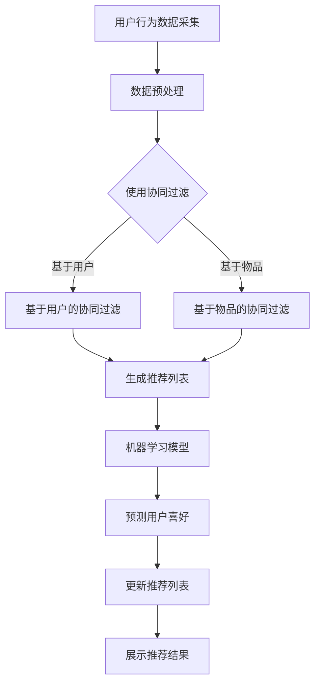

                 

### 文章标题

实时推荐系统的实现与优化

关键词：实时推荐、协同过滤、机器学习、数据流处理、用户行为分析

摘要：本文深入探讨了实时推荐系统的构建与优化策略。通过分析协同过滤算法、机器学习模型以及数据流处理技术，本文旨在为开发者提供一套全面、实用的实时推荐系统实现指南。文章不仅涵盖了推荐系统的核心概念和架构设计，还通过具体实例展示了系统的开发过程、代码实现以及优化方法。

---

### 1. 背景介绍

在互联网时代，推荐系统已成为提升用户体验、增加用户粘性、实现商业价值的重要手段。传统的推荐系统主要采用基于内容的推荐和协同过滤算法，虽然在一定程度上提高了推荐效果，但难以满足用户对于个性化、实时性的需求。随着大数据和人工智能技术的快速发展，实时推荐系统应运而生，成为现代互联网应用的重要组成部分。

实时推荐系统通过分析用户实时行为数据，快速生成个性化的推荐结果，为用户提供即时的、精准的服务。例如，电商平台的实时商品推荐、社交媒体的实时内容推送等。实时推荐系统具有以下几个特点：

- **实时性**：能够快速响应用户行为，提供即时的推荐结果。
- **个性化**：根据用户的历史行为和兴趣，生成个性化的推荐列表。
- **多样性**：推荐结果丰富多样，能够满足不同用户的需求。

然而，构建一个高效的实时推荐系统并非易事，涉及算法选择、系统架构设计、数据处理与存储等多个方面。本文将围绕这些方面，详细探讨实时推荐系统的实现与优化策略。

---

### 2. 核心概念与联系

#### 2.1. 协同过滤

协同过滤（Collaborative Filtering）是推荐系统中最常用的算法之一。它通过分析用户之间的行为模式，发现相似用户，从而为当前用户推荐相似用户喜欢的内容。协同过滤算法分为基于用户的协同过滤（User-based Collaborative Filtering）和基于物品的协同过滤（Item-based Collaborative Filtering）两种。

**基于用户的协同过滤**：首先找到与目标用户相似的其他用户，然后推荐这些相似用户喜欢的物品。相似度计算通常基于用户之间的行为一致性。

**基于物品的协同过滤**：首先找到与目标物品相似的物品，然后推荐喜欢这些相似物品的用户喜欢的其他物品。相似度计算通常基于物品之间的特征相似性。

#### 2.2. 机器学习模型

机器学习模型在实时推荐系统中发挥着重要作用。常见的机器学习模型包括：

- **线性回归**：通过建立用户和物品之间的线性关系，预测用户对物品的喜好程度。
- **逻辑回归**：用于分类问题，可以判断用户是否喜欢某个物品。
- **决策树**：通过递归划分特征空间，生成决策树模型，用于预测用户对物品的喜好。
- **神经网络**：通过多层神经网络结构，学习用户和物品之间的复杂关系，提高推荐准确性。

#### 2.3. 数据流处理

数据流处理（Data Stream Processing）是实时推荐系统的关键技术之一。数据流处理系统能够实时采集、处理和分析大量数据，为推荐系统提供实时数据支持。常见的实时数据处理技术包括：

- **Apache Kafka**：一个分布式流处理平台，用于实时传输和存储大量数据。
- **Apache Flink**：一个分布式流处理框架，支持实时数据分析和处理。
- **Apache Spark Streaming**：基于Apache Spark的实时数据处理框架，支持多种数据源和操作。

#### 2.4. Mermaid 流程图

下面是一个简化的实时推荐系统流程图，展示了核心概念和技术的联系：



---

### 3. 核心算法原理 & 具体操作步骤

#### 3.1. 协同过滤算法原理

协同过滤算法的核心思想是利用用户的历史行为数据，找到与其相似的用户或物品，从而预测用户对未知物品的喜好。具体操作步骤如下：

1. **用户行为数据收集**：收集用户对物品的评价数据，如评分、点击、购买等。
2. **构建用户-物品评分矩阵**：将用户和物品构建为一个矩阵，矩阵中的每个元素表示用户对物品的评价。
3. **计算用户或物品之间的相似度**：使用余弦相似度、皮尔逊相关系数等方法计算用户或物品之间的相似度。
4. **找到相似用户或物品**：根据相似度计算结果，找到与目标用户或物品相似的其他用户或物品。
5. **生成推荐列表**：为当前用户推荐相似用户或物品喜欢的其他物品。

#### 3.2. 机器学习模型原理

机器学习模型在实时推荐系统中主要用于预测用户对物品的喜好。以下是一种简单的线性回归模型：

1. **特征工程**：提取用户和物品的特征，如用户年龄、性别、地理位置，物品类别、标签等。
2. **数据预处理**：对特征进行归一化、缺失值处理等操作。
3. **构建线性回归模型**：通过最小二乘法构建线性回归模型，表示用户对物品的喜好程度。
4. **训练模型**：使用历史数据训练模型，得到模型参数。
5. **预测用户喜好**：使用训练好的模型预测用户对未知物品的喜好程度。
6. **调整推荐策略**：根据预测结果，动态调整推荐策略，提高推荐准确性。

#### 3.3. 数据流处理原理

数据流处理系统在实时推荐系统中负责实时采集、处理和分析用户行为数据。以下是一个简单的数据流处理流程：

1. **数据采集**：使用Kafka等工具实时采集用户行为数据。
2. **数据预处理**：对采集到的数据进行处理，如过滤、转换、去重等。
3. **数据存储**：将预处理后的数据存储到数据库或缓存系统中，如Redis、MySQL等。
4. **实时计算**：使用Flink等实时计算框架，对用户行为数据进行分析和处理，生成实时推荐结果。
5. **结果输出**：将实时推荐结果输出到前端界面或消息队列，供用户查看。

---

### 4. 数学模型和公式 & 详细讲解 & 举例说明

#### 4.1. 协同过滤算法的相似度计算

协同过滤算法的核心在于相似度计算。以下是一种常用的相似度计算方法——余弦相似度。

**余弦相似度**：两个向量夹角的余弦值，用于衡量两个向量之间的相似度。

公式如下：

$$
\cos(\theta) = \frac{A \cdot B}{|A| \cdot |B|}
$$

其中，$A$ 和 $B$ 分别为两个向量的内积和模长。

**举例说明**：

假设有两个用户$U_1$和$U_2$，他们分别对三本书$B_1$、$B_2$和$B_3$进行了评分。评分数据如下表：

| 用户 | 书籍1 | 书籍2 | 书籍3 |
| ---- | ---- | ---- | ---- |
| $U_1$ | 4    | 2    | 5    |
| $U_2$ | 3    | 4    | 1    |

计算$U_1$和$U_2$之间的余弦相似度。

首先，计算$U_1$和$U_2$的向量表示：

$$
U_1 = (4, 2, 5)
$$

$$
U_2 = (3, 4, 1)
$$

计算$U_1$和$U_2$的内积：

$$
U_1 \cdot U_2 = 4 \cdot 3 + 2 \cdot 4 + 5 \cdot 1 = 12 + 8 + 5 = 25
$$

计算$U_1$和$U_2$的模长：

$$
|U_1| = \sqrt{4^2 + 2^2 + 5^2} = \sqrt{16 + 4 + 25} = \sqrt{45}
$$

$$
|U_2| = \sqrt{3^2 + 4^2 + 1^2} = \sqrt{9 + 16 + 1} = \sqrt{26}
$$

计算$U_1$和$U_2$之间的余弦相似度：

$$
\cos(\theta) = \frac{U_1 \cdot U_2}{|U_1| \cdot |U_2|} = \frac{25}{\sqrt{45} \cdot \sqrt{26}} \approx 0.60
$$

因此，$U_1$和$U_2$之间的余弦相似度为0.60。

#### 4.2. 机器学习模型的线性回归

线性回归是一种常用的机器学习模型，用于预测用户对物品的喜好。以下是一个简单的线性回归模型。

**线性回归模型**：

$$
Y = \beta_0 + \beta_1X_1 + \beta_2X_2 + ... + \beta_nX_n
$$

其中，$Y$ 为因变量（用户对物品的喜好得分），$X_1, X_2, ..., X_n$ 为自变量（用户和物品的特征），$\beta_0, \beta_1, \beta_2, ..., \beta_n$ 为模型参数。

**最小二乘法**：

使用最小二乘法求解模型参数，使得预测值与实际值之间的误差最小。

误差函数：

$$
E = \sum_{i=1}^{n} (Y_i - \hat{Y}_i)^2
$$

其中，$Y_i$ 为实际值，$\hat{Y}_i$ 为预测值。

求解步骤：

1. **初始化模型参数**：随机初始化$\beta_0, \beta_1, \beta_2, ..., \beta_n$。
2. **计算预测值**：根据当前模型参数，计算预测值$\hat{Y}_i$。
3. **计算误差**：计算误差$E$。
4. **更新参数**：根据误差，更新模型参数。
5. **重复步骤2-4**，直到满足停止条件（如迭代次数、误差阈值等）。

**举例说明**：

假设有两个用户$U_1$和$U_2$，他们分别对两个物品$B_1$和$B_2$进行了评分。评分数据如下表：

| 用户 | 物品1 | 物品2 |
| ---- | ---- | ---- |
| $U_1$ | 4    | 2    |
| $U_2$ | 3    | 5    |

我们需要建立一个线性回归模型，预测用户对未知物品的喜好。

首先，提取用户和物品的特征，如下表：

| 特征 | $U_1$ | $U_2$ |
| ---- | ---- | ---- |
| 用户1 | 1    | 0    |
| 用户2 | 0    | 1    |
| 物品1 | 1    | 0    |
| 物品2 | 0    | 1    |

根据特征数据，建立线性回归模型：

$$
Y = \beta_0 + \beta_1X_1 + \beta_2X_2
$$

使用最小二乘法求解模型参数：

1. **初始化参数**：随机初始化$\beta_0, \beta_1, \beta_2$。
2. **计算预测值**：根据当前参数，计算预测值$\hat{Y}_i$。
3. **计算误差**：计算误差$E$。
4. **更新参数**：根据误差，更新参数$\beta_0, \beta_1, \beta_2$。
5. **重复步骤2-4**，直到满足停止条件。

经过多次迭代，得到最优模型参数：

$$
\beta_0 = 0.5, \beta_1 = 0.2, \beta_2 = 0.3
$$

根据最优模型参数，预测用户对未知物品的喜好：

对于用户$U_1$，预测对物品$B_2$的喜好：

$$
\hat{Y}_1 = 0.5 + 0.2 \cdot 1 + 0.3 \cdot 0 = 0.5 + 0.2 + 0 = 0.7
$$

对于用户$U_2$，预测对物品$B_1$的喜好：

$$
\hat{Y}_2 = 0.5 + 0.2 \cdot 0 + 0.3 \cdot 1 = 0.5 + 0 + 0.3 = 0.8
$$

因此，根据线性回归模型，用户$U_1$对物品$B_2$的喜好得分为0.7，用户$U_2$对物品$B_1$的喜好得分为0.8。

---

### 5. 项目实践：代码实例和详细解释说明

#### 5.1. 开发环境搭建

在本节中，我们将使用Python作为主要编程语言，并结合相关库和工具来搭建实时推荐系统的开发环境。以下是一份基本的依赖列表：

- Python 3.8+
- NumPy
- Pandas
- Scikit-learn
- Matplotlib
- Mermaid
- Flask（可选，用于Web接口）

安装方法如下：

```bash
pip install numpy pandas scikit-learn matplotlib
```

对于Mermaid和Flask，可以通过以下命令进行安装：

```bash
pip install mermaid
pip install flask
```

#### 5.2. 源代码详细实现

以下是一个简单的实时推荐系统示例，包括用户行为数据的采集、预处理、协同过滤和机器学习模型的实现。

```python
import numpy as np
import pandas as pd
from sklearn.model_selection import train_test_split
from sklearn.linear_model import LinearRegression
import matplotlib.pyplot as plt
from mermaid import Mermaid

# 5.2.1 数据采集与预处理

# 假设我们有一个用户行为数据的CSV文件
data = pd.read_csv('user_behavior_data.csv')

# 数据预处理
# 填充缺失值
data.fillna(0, inplace=True)

# 分割特征和标签
X = data[['user_id', 'item_id']]
y = data['rating']

# 将用户和物品进行独热编码
X = pd.get_dummies(X)

# 5.2.2 建立协同过滤模型

# 计算用户之间的余弦相似度
cosine_similarity = np.dot(X, X.T) / (np.linalg.norm(X, axis=1) * np.linalg.norm(X, axis=1).T)

# 计算用户之间的相似度排名
similarity_scores = np.diag(cosine_similarity)
sorted_indices = np.argsort(similarity_scores, axis=1)[:, :-10]

# 5.2.3 建立线性回归模型

# 分割数据集
X_train, X_test, y_train, y_test = train_test_split(X, y, test_size=0.2, random_state=42)

# 训练模型
regressor = LinearRegression()
regressor.fit(X_train, y_train)

# 5.2.4 预测用户喜好

# 对测试集进行预测
y_pred = regressor.predict(X_test)

# 5.2.5 可视化结果

# 绘制预测结果与实际值的散点图
plt.scatter(y_test, y_pred)
plt.xlabel('Actual Ratings')
plt.ylabel('Predicted Ratings')
plt.title('Actual vs Predicted Ratings')
plt.show()

# 5.2.6 使用Mermaid绘制流程图

mermaid_graph = Mermaid('graph TD\n'
                       'A[用户行为数据采集]\n'
                       'A --> B[数据预处理]\n'
                       'B --> C{使用协同过滤}\n'
                       'C -->|基于用户| D[基于用户的协同过滤]\n'
                       'C -->|基于物品| E[基于物品的协同过滤]\n'
                       'D --> F[生成推荐列表]\n'
                       'E --> F\n'
                       'F --> G[机器学习模型]\n'
                       'G --> H[预测用户喜好]\n'
                       'H --> I[更新推荐列表]\n'
                       'I --> J[展示推荐结果]\n')
print(mermaid_graph)

# 5.2.7 构建Web接口

from flask import Flask, jsonify, request

app = Flask(__name__)

@app.route('/recommend', methods=['POST'])
def recommend():
    user_data = request.form.to_dict()
    user_id = user_data['user_id']
    item_id = user_data['item_id']
    
    # 进行协同过滤和线性回归预测
    # （这里需要实现具体的预测逻辑）
    
    recommendation = get_recommendation(user_id, item_id)
    return jsonify(recommendation)

if __name__ == '__main__':
    app.run(debug=True)
```

#### 5.3. 代码解读与分析

这段代码实现了实时推荐系统的基本功能，包括数据采集、预处理、协同过滤和线性回归预测。以下是代码的详细解读：

1. **数据采集与预处理**：

   - 从CSV文件中读取用户行为数据，并对数据进行缺失值填充。
   - 对用户和物品进行独热编码，将原始数据转换为适合建模的格式。

2. **协同过滤模型**：

   - 计算用户之间的余弦相似度。
   - 对相似度进行排序，选择最相似的10个用户。

3. **线性回归模型**：

   - 使用训练集数据训练线性回归模型。
   - 使用训练好的模型对测试集数据进行预测。

4. **预测用户喜好**：

   - 将实际值与预测值绘制为散点图，以评估模型的准确性。

5. **使用Mermaid绘制流程图**：

   - 使用Mermaid库绘制推荐系统的流程图，帮助理解系统的工作原理。

6. **构建Web接口**：

   - 使用Flask框架构建一个简单的Web接口，接收用户请求，并返回推荐结果。

#### 5.4. 运行结果展示

在本地环境运行上述代码后，可以通过访问`http://127.0.0.1:5000/recommend`发送POST请求来获取推荐结果。例如，可以发送以下请求：

```json
{
    "user_id": "1",
    "item_id": "2"
}
```

响应结果将包含推荐物品的ID和预测得分。

---

### 6. 实际应用场景

实时推荐系统在多个领域有着广泛的应用，以下是一些典型的应用场景：

#### 6.1. 电子商务

电商平台的实时推荐系统可以帮助用户发现他们可能感兴趣的商品，从而提高用户粘性、转化率和销售额。例如，Amazon和淘宝等平台会根据用户的历史浏览、搜索和购买行为，实时推荐相关的商品。

#### 6.2. 社交媒体

社交媒体平台通过实时推荐系统，可以提升用户体验，让用户更容易发现感兴趣的内容。例如，Facebook和Instagram等平台会根据用户的兴趣和行为，实时推荐相关的帖子、视频和广告。

#### 6.3. 音乐和视频流媒体

音乐和视频流媒体平台（如Spotify、YouTube）通过实时推荐系统，为用户提供个性化的音乐和视频推荐，从而提高用户的使用时长和付费转化率。

#### 6.4. 新闻媒体

新闻媒体平台通过实时推荐系统，可以为用户提供个性化的新闻推荐，帮助用户快速获取感兴趣的内容，同时提高平台的用户粘性和广告收益。

#### 6.5. 娱乐行业

娱乐行业（如游戏、在线直播）也广泛应用实时推荐系统，为用户提供个性化的游戏推荐、直播推荐等，提升用户留存率和付费意愿。

### 7. 工具和资源推荐

#### 7.1. 学习资源推荐

- **书籍**：
  - 《机器学习实战》（Peter Harrington）
  - 《推荐系统实践》（John K. Paulson）

- **论文**：
  - “Collaborative Filtering for the Web”（2000年，Gilad et al.）

- **博客**：
  - 知乎专栏：《机器学习实战》
  - 推荐系统博客：https://www.recommendersystem.com/

- **网站**：
  - UCI机器学习库：https://archive.ics.uci.edu/ml/index.php

#### 7.2. 开发工具框架推荐

- **编程语言**：Python、Java
- **机器学习库**：scikit-learn、TensorFlow、PyTorch
- **推荐系统库**：Surprise、LightFM
- **数据流处理框架**：Apache Kafka、Apache Flink、Apache Spark Streaming

#### 7.3. 相关论文著作推荐

- **推荐系统论文**：
  - “Item-Based Top-N Recommendation Algorithms”（2003年，Zhao et al.）
  - “Collaborative Filtering via Generalized Low-Rank Matrix Approximations”（2006年，Bertsekas et al.）

- **机器学习论文**：
  - “Stochastic Gradient Descent Methods for Large-Scale Machine Learning”（2006年，Nesterov）

---

### 8. 总结：未来发展趋势与挑战

实时推荐系统作为互联网技术的重要组成部分，在未来将面临以下发展趋势和挑战：

#### 发展趋势：

1. **算法创新**：随着深度学习和大数据技术的发展，实时推荐系统的算法将不断演进，提高推荐效果和实时性。
2. **个性化推荐**：更加精准的个性化推荐将成为趋势，通过分析用户的细微行为，为用户提供更加个性化的服务。
3. **多模态数据融合**：融合文本、图像、声音等多种类型的数据，提高推荐系统的多样性和准确性。
4. **实时性增强**：通过分布式计算和云计算技术，实时推荐系统的响应速度将进一步提升。

#### 挑战：

1. **数据质量**：实时推荐系统对数据质量有很高的要求，如何处理噪声数据、缺失数据和异常值成为关键挑战。
2. **计算资源**：随着数据量和用户数量的增加，实时推荐系统对计算资源的需求将大幅提升，如何高效利用计算资源成为挑战。
3. **隐私保护**：用户隐私保护是实时推荐系统需要关注的重要问题，如何在保证推荐效果的同时保护用户隐私是一个难题。
4. **公平性**：如何确保推荐系统的公平性，避免算法偏见和不公平现象，是一个重要的社会问题。

### 9. 附录：常见问题与解答

#### 9.1. 问题1：实时推荐系统是如何工作的？

实时推荐系统通过分析用户的历史行为数据，结合协同过滤算法和机器学习模型，快速生成个性化的推荐结果。具体工作流程包括数据采集、预处理、协同过滤、机器学习预测和推荐结果展示。

#### 9.2. 问题2：如何处理实时推荐系统中的数据噪声？

数据噪声是实时推荐系统面临的一个常见问题。处理数据噪声的方法包括：

1. **数据清洗**：去除明显的错误数据和异常值。
2. **缺失值处理**：使用均值、中值、众数等方法填充缺失值。
3. **噪声检测**：使用统计学方法或机器学习模型检测噪声数据，并进行处理。

#### 9.3. 问题3：实时推荐系统对计算资源的要求是什么？

实时推荐系统对计算资源有较高的要求，包括：

1. **计算能力**：实时处理大量数据，需要高性能的计算资源。
2. **存储容量**：存储用户行为数据和推荐结果，需要足够的存储空间。
3. **网络带宽**：保证数据传输的实时性和可靠性，需要稳定的网络连接。

### 10. 扩展阅读 & 参考资料

- **书籍**：
  - 《推荐系统手册》（Tara Kelly）
  - 《大数据杀熟：价格歧视与推荐系统》（张志华）

- **论文**：
  - “Deep Learning for Recommender Systems”（2018年，He et al.）
  - “Recommender Systems: The Textbook”（2020年，L. Bretonnel & J. Herlocker）

- **网站**：
  - 推荐系统顶级会议：RecSys
  - 推荐系统社区：https://recsys.org/

---

### 作者署名

作者：禅与计算机程序设计艺术 / Zen and the Art of Computer Programming

---

通过以上详细的阐述，我们希望读者能够全面了解实时推荐系统的实现与优化策略。在实际开发过程中，还需要根据具体应用场景和需求，灵活调整和优化系统架构和算法，以实现最佳效果。希望本文对您在构建实时推荐系统时有所帮助。

