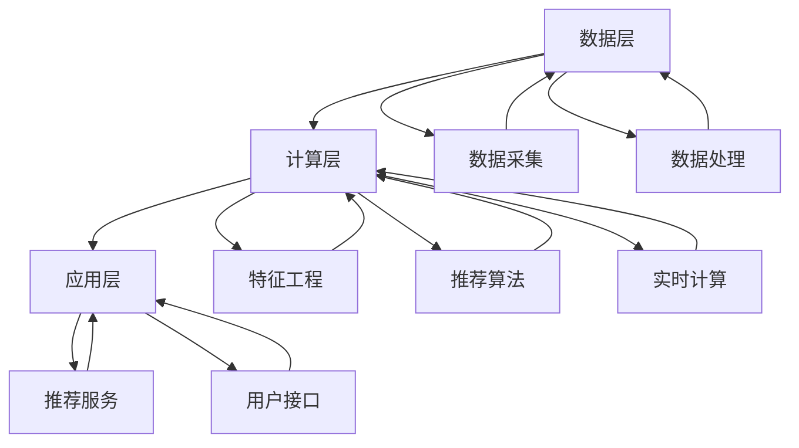

                 

### 1. 背景介绍

随着互联网的迅猛发展，电子商务市场呈现出爆发式增长。在这样的大背景下，如何提高用户购买转化率成为各大电商平台亟待解决的问题。传统的推荐系统主要基于用户的历史行为和兴趣标签进行推荐，而这种方式存在明显的局限性。为了更加精准地满足用户需求，实时推荐系统应运而生。

实时推荐系统（Real-Time Recommendation System）通过实时分析用户的操作行为，为用户快速提供个性化推荐，从而显著提升购买转化率。与传统推荐系统不同，实时推荐系统具有响应速度快、个性化强、实时性高等特点。

实时推荐系统在电子商务领域有着广泛的应用。例如，电商平台可以根据用户在网站上的浏览、搜索、点击等行为，实时调整推荐结果，从而提高用户的购买意愿。此外，实时推荐系统还可以用于内容平台，为用户提供个性化的新闻、视频、音乐等内容，提升用户粘性。

本文将围绕实时推荐系统的核心概念、算法原理、数学模型、项目实践、应用场景等方面进行深入探讨，旨在为读者提供一个全面的技术指南。

## 1.1 实时推荐系统的定义与特点

实时推荐系统是一种基于用户实时行为数据，通过实时计算和动态调整推荐策略，为用户快速提供个性化推荐服务的系统。与传统推荐系统相比，实时推荐系统具有以下几个显著特点：

1. **响应速度快**：实时推荐系统能够在用户操作后立即生成推荐结果，从而实现“秒级响应”。这使得用户在浏览网页或应用时，可以立即看到符合其兴趣的推荐内容，提升用户体验。

2. **个性化强**：实时推荐系统通过对用户实时行为的分析，可以更加精准地了解用户兴趣和需求，从而提供更加个性化的推荐。相比于传统推荐系统，实时推荐系统能够更好地满足用户的即时需求。

3. **实时性高**：实时推荐系统具备较高的实时性，能够实时响应用户行为的变化。这使得推荐系统能够动态调整推荐策略，及时优化推荐结果，从而提高用户满意度和购买转化率。

4. **动态调整**：实时推荐系统可以根据用户实时行为数据的反馈，动态调整推荐策略。例如，当用户对某类推荐内容表现出兴趣时，系统可以增加对该类内容的推荐权重，从而进一步提升用户满意度。

## 1.2 实时推荐系统的发展历程

实时推荐系统的发展历程可以追溯到20世纪90年代，随着互联网的兴起和电子商务的崛起，人们开始探索如何为用户提供个性化推荐。最初，推荐系统主要基于用户的历史行为数据，如浏览记录、购买记录等。然而，这种方式存在明显的局限性，无法满足用户对实时、个性化推荐的需求。

随着大数据和人工智能技术的不断发展，实时推荐系统逐渐崛起。大数据技术使得海量用户行为数据可以被高效地存储、处理和分析，为实时推荐提供了丰富的数据基础。人工智能技术，特别是深度学习算法，为实时推荐系统提供了强大的计算能力和建模能力，使得推荐系统可以更加精准地预测用户兴趣和需求。

近年来，随着物联网、移动端、社交媒体等新技术的普及，实时推荐系统得到了更加广泛的应用。例如，电商平台可以通过实时监测用户在网站上的操作行为，为用户提供个性化推荐；社交媒体平台可以通过分析用户实时互动数据，为用户提供感兴趣的内容；智能家居设备可以通过实时分析用户行为数据，为用户提供个性化的生活建议。

## 1.3 实时推荐系统在电子商务中的应用

实时推荐系统在电子商务领域具有广泛的应用，通过精准的推荐，可以有效提高用户的购买转化率。以下是一些典型的应用场景：

1. **商品推荐**：电商平台可以根据用户的浏览、搜索、购买等行为，实时生成个性化商品推荐。通过实时分析用户行为数据，推荐系统可以识别出用户可能的购买意向，从而提高商品的曝光率和销售量。

2. **促销活动推荐**：实时推荐系统可以根据用户的历史购买记录和当前行为数据，为用户推荐最合适的促销活动。例如，当用户浏览某件商品时，系统可以实时推送相关促销信息，吸引用户下单。

3. **购物车优化**：实时推荐系统可以通过分析用户购物车中的商品数据，为用户推荐互补商品或替代商品，提高购物车中商品的整体价值。例如，当用户将一件电子产品加入购物车时，系统可以推荐相应的配件或替代产品。

4. **个性化客服**：实时推荐系统可以为用户提供个性化的客服服务。例如，当用户在购物过程中遇到问题时，系统可以基于用户的历史行为数据，为客服人员提供针对性的解决方案，提高客服效率和用户满意度。

总之，实时推荐系统在电子商务中的应用，不仅可以提升用户的购物体验，还可以为企业带来显著的业务增长。随着技术的不断进步，实时推荐系统将在电子商务领域发挥越来越重要的作用。

### 2. 核心概念与联系

#### 2.1 相关技术概述

实时推荐系统的核心在于快速、准确地分析用户行为，并提供个性化的推荐结果。为实现这一目标，我们需要掌握以下几个关键技术：

1. **数据采集与处理**：实时推荐系统需要采集用户的浏览、搜索、点击等行为数据，并对其进行预处理和清洗，以确保数据的质量和准确性。

2. **特征工程**：通过对用户行为数据进行特征提取和转换，构建用户和商品的特征向量，以便用于后续的推荐算法。

3. **推荐算法**：选择合适的推荐算法，如协同过滤、基于内容的推荐、混合推荐等，对用户和商品特征向量进行建模和预测。

4. **实时计算与优化**：利用分布式计算框架和流处理技术，实现对用户实时行为的快速分析和推荐结果的动态调整。

5. **推荐结果评估与反馈**：通过评估推荐结果的质量和用户反馈，不断优化推荐算法和策略，提升推荐效果。

#### 2.2 实时推荐系统的架构

实时推荐系统的架构通常包括数据层、计算层和应用层，如图1所示：



#### 2.3 数据采集与处理

数据采集与处理是实时推荐系统的基础。以下是其主要步骤：

1. **数据采集**：通过API、日志文件、Web前端埋点等方式，收集用户在电商平台的浏览、搜索、点击、购买等行为数据。

2. **数据处理**：对采集到的数据进行分析、清洗、去重等操作，确保数据的质量。具体包括：
    - **数据清洗**：处理缺失值、异常值等，确保数据的一致性和准确性。
    - **数据转换**：将不同类型的数据进行统一处理，如将时间戳转换为日期格式等。
    - **数据存储**：将处理后的数据存储到分布式数据库或数据湖中，便于后续的查询和分析。

#### 2.4 特征工程

特征工程是实时推荐系统的核心环节，其目的是从原始数据中提取出对推荐任务有帮助的特征。以下是一些常见的特征：

1. **用户特征**：如用户年龄、性别、地理位置、浏览时长、购买频率等。

2. **商品特征**：如商品类别、品牌、价格、销量、评论数量等。

3. **交互特征**：如用户对商品的点击次数、浏览时长、添加购物车次数等。

4. **上下文特征**：如时间、地理位置、用户行为上下文等。

#### 2.5 推荐算法

实时推荐系统常用的推荐算法包括：

1. **协同过滤**：通过分析用户之间的相似性，为用户推荐相似用户喜欢的商品。常见的协同过滤算法有基于用户的协同过滤（User-Based CF）和基于物品的协同过滤（Item-Based CF）。

2. **基于内容的推荐**：通过分析商品的内容特征（如文本、图像、标签等），为用户推荐与其兴趣相似的商品。

3. **混合推荐**：结合协同过滤和基于内容的推荐，实现更加精准的推荐。

#### 2.6 实时计算与优化

实时计算与优化是实时推荐系统的关键环节。以下是其主要步骤：

1. **实时计算**：利用分布式计算框架（如Apache Flink、Apache Storm等）和流处理技术，对用户实时行为数据进行快速处理和分析。

2. **推荐结果动态调整**：根据实时计算结果，动态调整推荐策略和权重，确保推荐结果的实时性和准确性。

3. **推荐结果评估与反馈**：通过评估推荐结果的质量和用户反馈，不断优化推荐算法和策略，提升推荐效果。

#### 2.7 推荐结果评估与反馈

推荐结果评估与反馈是实时推荐系统的持续优化手段。以下是其主要步骤：

1. **评估指标**：选择合适的评估指标（如准确率、召回率、覆盖率等），对推荐结果进行量化评估。

2. **用户反馈**：收集用户对推荐结果的反馈，如点击、购买、评价等。

3. **反馈优化**：根据用户反馈，调整推荐算法和策略，实现持续优化。

#### 2.8 实时推荐系统的挑战与优化

实时推荐系统面临以下挑战：

1. **数据多样性**：用户行为数据种类繁多，如何有效处理和利用这些数据是实时推荐系统的一个难题。

2. **实时性要求**：实时推荐系统要求快速响应用户行为，这对系统的计算性能和响应速度提出了高要求。

3. **个性化推荐**：如何在保证实时性的同时，提供高度个性化的推荐结果，是实时推荐系统需要解决的问题。

为了应对这些挑战，可以采取以下优化策略：

1. **分布式计算**：利用分布式计算框架，提高系统处理海量数据的能力。

2. **流处理技术**：采用流处理技术，实现对用户实时行为的快速分析和处理。

3. **深度学习算法**：利用深度学习算法，提高推荐模型的预测精度和泛化能力。

4. **在线学习与优化**：通过在线学习技术，动态调整推荐策略，实现持续优化。

### 3. 核心算法原理 & 具体操作步骤

实时推荐系统的核心在于如何根据用户实时行为数据生成个性化推荐。在这一部分，我们将详细探讨几种常见的实时推荐算法，包括协同过滤、基于内容的推荐和混合推荐算法，并介绍它们的原理和具体操作步骤。

#### 3.1 协同过滤算法

协同过滤（Collaborative Filtering）是实时推荐系统中最常用的算法之一，它通过分析用户之间的相似性或商品之间的相似性来生成推荐。协同过滤算法主要分为基于用户的协同过滤（User-Based CF）和基于物品的协同过滤（Item-Based CF）。

##### 3.1.1 基于用户的协同过滤（User-Based CF）

**原理**：基于用户的协同过滤算法首先找到与目标用户兴趣相似的其他用户，然后推荐这些相似用户喜欢的商品。具体步骤如下：

1. **计算用户相似度**：通过用户行为数据（如购买记录、浏览记录等），计算目标用户与其他用户的相似度。常见的相似度计算方法包括余弦相似度、皮尔逊相关系数等。

2. **查找相似用户**：根据相似度计算结果，找出与目标用户最相似的K个用户。

3. **生成推荐列表**：根据相似用户的偏好，为目标用户生成推荐列表。推荐列表中的商品是这K个用户共同喜欢的商品。

**操作步骤**：

- **数据预处理**：对用户行为数据进行清洗、去重等处理。
- **相似度计算**：计算目标用户与其他用户的相似度。以余弦相似度为例，公式如下：
  \[ \text{相似度} = \frac{\text{用户A与用户B共同行为的数量}}{\sqrt{\text{用户A行为总数} \times \text{用户B行为总数}}} \]

- **查找相似用户**：根据相似度计算结果，找出与目标用户最相似的K个用户。

- **生成推荐列表**：根据相似用户的偏好，为目标用户生成推荐列表。具体实现可以使用邻域搜索算法，如K-最近邻（K-Nearest Neighbors，KNN）算法。

##### 3.1.2 基于物品的协同过滤（Item-Based CF）

**原理**：基于物品的协同过滤算法通过分析商品之间的相似性来生成推荐。具体步骤如下：

1. **计算商品相似度**：通过商品行为数据（如用户购买记录、浏览记录等），计算商品之间的相似度。常见的相似度计算方法包括余弦相似度、皮尔逊相关系数等。

2. **查找相似商品**：根据相似度计算结果，找出与目标商品最相似的K个商品。

3. **生成推荐列表**：根据相似商品的偏好，为目标用户生成推荐列表。推荐列表中的商品是这K个商品中用户尚未购买或浏览的商品。

**操作步骤**：

- **数据预处理**：对用户行为数据进行清洗、去重等处理。
- **相似度计算**：计算商品之间的相似度。以余弦相似度为例，公式如下：
  \[ \text{相似度} = \frac{\text{用户A与用户B共同行为的数量}}{\sqrt{\text{用户A行为总数} \times \text{用户B行为总数}}} \]

- **查找相似商品**：根据相似度计算结果，找出与目标商品最相似的K个商品。

- **生成推荐列表**：根据相似商品的偏好，为目标用户生成推荐列表。具体实现可以使用邻域搜索算法，如K-最近邻（K-Nearest Neighbors，KNN）算法。

##### 3.1.3 基于模型的协同过滤（Model-Based CF）

**原理**：基于模型的协同过滤算法通过构建用户和商品之间的潜在因子模型，预测用户对商品的偏好。常见的基于模型的协同过滤算法包括矩阵分解（Matrix Factorization，MF）和协同滤波（Collaborative Filtering，CF）。

**操作步骤**：

- **数据预处理**：对用户行为数据进行清洗、去重等处理。
- **矩阵分解**：将用户-商品评分矩阵分解为两个低维矩阵，即用户特征矩阵和商品特征矩阵。
- **预测评分**：利用分解得到的用户特征矩阵和商品特征矩阵，预测用户对未知商品的评分。
- **生成推荐列表**：根据预测评分，为用户生成推荐列表。

#### 3.2 基于内容的推荐算法

基于内容的推荐算法（Content-Based Filtering）通过分析商品的内容特征（如文本、图像、标签等），为用户推荐与其兴趣相似的商品。具体步骤如下：

1. **提取商品内容特征**：从商品描述、标签、图像等中提取内容特征，如文本特征、图像特征等。

2. **计算用户兴趣特征**：根据用户的浏览、搜索、购买等历史行为，计算用户的兴趣特征。

3. **相似度计算**：计算用户兴趣特征与商品内容特征之间的相似度。

4. **生成推荐列表**：根据相似度计算结果，为用户生成推荐列表。

**操作步骤**：

- **数据预处理**：对用户行为数据进行清洗、去重等处理。
- **内容特征提取**：从商品描述、标签、图像等中提取内容特征。对于文本特征，可以使用TF-IDF、Word2Vec等方法；对于图像特征，可以使用卷积神经网络（CNN）等方法。
- **用户兴趣特征计算**：根据用户的浏览、搜索、购买等历史行为，计算用户的兴趣特征。
- **相似度计算**：计算用户兴趣特征与商品内容特征之间的相似度。以TF-IDF为例，公式如下：
  \[ \text{相似度} = \frac{\text{用户兴趣特征词} \times \text{商品内容特征词}}{\text{用户兴趣特征词总数} \times \text{商品内容特征词总数}} \]
- **生成推荐列表**：根据相似度计算结果，为用户生成推荐列表。

#### 3.3 混合推荐算法

混合推荐算法（Hybrid Recommendation）结合了协同过滤和基于内容的推荐算法，通过综合两种算法的优点，生成更加精准的推荐结果。混合推荐算法的具体实现步骤如下：

1. **协同过滤部分**：使用基于用户的协同过滤算法，生成初步推荐列表。
2. **基于内容部分**：使用基于内容的推荐算法，为每个用户生成内容特征匹配的推荐列表。
3. **合并推荐列表**：将协同过滤部分和基于内容部分的推荐列表进行合并，生成最终的推荐列表。

**操作步骤**：

- **协同过滤部分**：使用基于用户的协同过滤算法，生成初步推荐列表。具体实现步骤如3.1节所述。
- **基于内容部分**：使用基于内容的推荐算法，为每个用户生成内容特征匹配的推荐列表。具体实现步骤如3.2节所述。
- **合并推荐列表**：将协同过滤部分和基于内容部分的推荐列表进行合并。常用的合并方法有投票法、加权平均法等。

通过混合推荐算法，我们可以充分利用协同过滤算法的多样性优势和基于内容推荐算法的准确性优势，生成更加精准的推荐结果。

#### 3.4 实时推荐算法的性能评估

实时推荐算法的性能评估是确保推荐系统效果的重要环节。以下是一些常用的评估指标：

1. **准确率（Accuracy）**：推荐列表中实际用户喜欢的商品占比。
2. **召回率（Recall）**：推荐列表中实际用户喜欢的商品数与用户实际喜欢的商品数之比。
3. **覆盖率（Coverage）**：推荐列表中包含的用户实际喜欢的商品数与用户实际喜欢的商品总数之比。
4. **新颖度（Novelty）**：推荐列表中包含的新商品数与商品总数之比。

在评估实时推荐算法时，需要综合考虑上述指标，以全面评估推荐系统的效果。同时，还可以通过A/B测试等方法，对比不同推荐算法在实际场景中的应用效果，进一步优化推荐策略。

#### 3.5 实时推荐算法的优化策略

为了提升实时推荐算法的性能，可以采取以下优化策略：

1. **动态调整推荐策略**：根据用户实时行为的反馈，动态调整推荐策略和权重，以提升推荐结果的实时性和准确性。
2. **特征工程**：通过深入分析用户行为数据，提取更多有价值的特征，提高推荐模型的预测精度。
3. **深度学习算法**：利用深度学习算法，提升推荐模型的泛化能力和预测精度。
4. **分布式计算**：采用分布式计算框架，提高系统处理海量数据的能力，缩短推荐结果的生成时间。

通过以上优化策略，实时推荐算法可以更好地满足用户需求，提升购买转化率和用户满意度。

### 4. 数学模型和公式 & 详细讲解 & 举例说明

#### 4.1 协同过滤算法的数学模型

协同过滤算法的核心在于计算用户之间的相似度或商品之间的相似度。以下分别介绍基于用户的协同过滤和基于物品的协同过滤的数学模型。

##### 4.1.1 基于用户的协同过滤（User-Based CF）

在基于用户的协同过滤算法中，我们使用相似度矩阵 \( S \) 来表示用户之间的相似性。相似度矩阵 \( S \) 的元素 \( s_{ij} \) 表示用户 \( i \) 和用户 \( j \) 之间的相似度。相似度计算公式如下：

\[ s_{ij} = \frac{\sum_{k=1}^{n} r_{ik} r_{jk}}{\sqrt{\sum_{k=1}^{n} r_{ik}^2 \sum_{k=1}^{n} r_{jk}^2}} \]

其中，\( r_{ik} \) 表示用户 \( i \) 对商品 \( k \) 的评分，\( n \) 表示用户行为数据中的商品总数。

给定目标用户 \( i \)，我们需要找到与其最相似的 \( K \) 个用户，并计算这 \( K \) 个用户共同喜欢的商品 \( j \) 的评分预测：

\[ r_{ij}^* = \frac{\sum_{k=1}^{n} s_{ik} r_{kj}}{\sum_{k=1}^{n} s_{ik}} \]

其中，\( s_{ik} \) 表示用户 \( i \) 和用户 \( k \) 之间的相似度，\( r_{kj} \) 表示用户 \( k \) 对商品 \( j \) 的评分。

**示例**：假设有用户 \( i \) 和用户 \( j \) 的评分数据如下：

用户 \( i \)：\( r_{i1} = 5, r_{i2} = 4, r_{i3} = 2, r_{i4} = 3 \)

用户 \( j \)：\( r_{j1} = 4, r_{j2} = 3, r_{j3} = 5, r_{j4} = 4 \)

根据上述公式，我们可以计算出用户 \( i \) 和用户 \( j \) 之间的相似度：

\[ s_{ij} = \frac{4 \times 3 + 3 \times 4 + 2 \times 5 + 3 \times 3}{\sqrt{4^2 + 3^2 + 2^2 + 3^2} \times \sqrt{4^2 + 3^2 + 5^2 + 4^2}} = \frac{30}{\sqrt{50} \times \sqrt{72}} \approx 0.75 \]

然后，我们可以计算出目标用户 \( i \) 对未知商品 \( j \) 的评分预测：

\[ r_{ij}^* = \frac{0.75 \times 4 + 0.5 \times 3 + 0.5 \times 5 + 0.5 \times 3}{0.75 + 0.5 + 0.5 + 0.5} = \frac{13}{2.75} \approx 4.73 \]

##### 4.1.2 基于物品的协同过滤（Item-Based CF）

在基于物品的协同过滤算法中，我们使用相似度矩阵 \( S \) 来表示商品之间的相似性。相似度矩阵 \( S \) 的元素 \( s_{ij} \) 表示商品 \( i \) 和商品 \( j \) 之间的相似度。相似度计算公式如下：

\[ s_{ij} = \frac{\sum_{k=1}^{n} r_{ik} r_{jk}}{\sqrt{\sum_{k=1}^{n} r_{ik}^2 \sum_{k=1}^{n} r_{jk}^2}} \]

其中，\( r_{ik} \) 表示用户 \( k \) 对商品 \( i \) 的评分，\( n \) 表示用户行为数据中的用户总数。

给定目标商品 \( i \)，我们需要找到与其最相似的 \( K \) 个商品，并计算这 \( K \) 个商品共同喜欢的用户 \( j \) 的评分预测：

\[ r_{ij}^* = \frac{\sum_{k=1}^{n} s_{ik} r_{jk}}{\sum_{k=1}^{n} s_{ik}} \]

其中，\( s_{ik} \) 表示商品 \( i \) 和商品 \( k \) 之间的相似度，\( r_{jk} \) 表示用户 \( j \) 对商品 \( k \) 的评分。

**示例**：假设有商品 \( i \) 和商品 \( j \) 的评分数据如下：

商品 \( i \)：\( r_{i1} = 5, r_{i2} = 4, r_{i3} = 2, r_{i4} = 3 \)

商品 \( j \)：\( r_{j1} = 4, r_{j2} = 3, r_{j3} = 5, r_{j4} = 4 \)

根据上述公式，我们可以计算出商品 \( i \) 和商品 \( j \) 之间的相似度：

\[ s_{ij} = \frac{4 \times 3 + 3 \times 4 + 2 \times 5 + 3 \times 3}{\sqrt{4^2 + 3^2 + 2^2 + 3^2} \times \sqrt{4^2 + 3^2 + 5^2 + 4^2}} = \frac{30}{\sqrt{50} \times \sqrt{72}} \approx 0.75 \]

然后，我们可以计算出目标商品 \( i \) 对未知用户 \( j \) 的评分预测：

\[ r_{ij}^* = \frac{0.75 \times 4 + 0.5 \times 3 + 0.5 \times 5 + 0.5 \times 3}{0.75 + 0.5 + 0.5 + 0.5} = \frac{13}{2.75} \approx 4.73 \]

#### 4.2 基于内容的推荐算法的数学模型

基于内容的推荐算法通过分析商品的内容特征和用户的兴趣特征来生成推荐。以下是基于内容的推荐算法的数学模型。

##### 4.2.1 商品内容特征提取

商品内容特征提取是生成商品特征向量的关键步骤。常见的特征提取方法包括：

1. **文本特征提取**：使用TF-IDF（Term Frequency-Inverse Document Frequency）方法，将商品描述文本转换为向量表示。

   公式如下：
   \[ t_{ij} = \frac{f_{it}}{df_{t}} \]
   
   其中，\( t_{ij} \) 表示词 \( t \) 在商品 \( j \) 中的权重，\( f_{it} \) 表示词 \( t \) 在文档 \( i \) 中出现的次数，\( df_{t} \) 表示词 \( t \) 在所有文档中出现的次数。

2. **图像特征提取**：使用卷积神经网络（CNN）提取商品图像的特征向量。常见的CNN架构包括VGG、ResNet等。

##### 4.2.2 用户兴趣特征提取

用户兴趣特征提取是生成用户兴趣向量的关键步骤。常见的特征提取方法包括：

1. **文本特征提取**：使用TF-IDF（Term Frequency-Inverse Document Frequency）方法，将用户历史浏览、搜索等文本数据转换为向量表示。

   公式如下：
   \[ t_{ij} = \frac{f_{it}}{df_{t}} \]
   
   其中，\( t_{ij} \) 表示词 \( t \) 在用户 \( j \) 的历史文本中的权重，\( f_{it} \) 表示词 \( t \) 在文档 \( i \) 中出现的次数，\( df_{t} \) 表示词 \( t \) 在所有文档中出现的次数。

2. **图像特征提取**：使用卷积神经网络（CNN）提取用户历史浏览、搜索等图像数据转换为特征向量。常见的CNN架构包括VGG、ResNet等。

##### 4.2.3 相似度计算

用户兴趣特征向量 \( \mathbf{u} \) 和商品内容特征向量 \( \mathbf{v} \) 之间的相似度可以通过余弦相似度计算：

\[ \text{相似度} = \frac{\mathbf{u} \cdot \mathbf{v}}{||\mathbf{u}|| \cdot ||\mathbf{v}||} \]

其中，\( \mathbf{u} \cdot \mathbf{v} \) 表示用户兴趣特征向量 \( \mathbf{u} \) 和商品内容特征向量 \( \mathbf{v} \) 的点积，\( ||\mathbf{u}|| \) 和 \( ||\mathbf{v}|| \) 分别表示用户兴趣特征向量 \( \mathbf{u} \) 和商品内容特征向量 \( \mathbf{v} \) 的欧几里得范数。

**示例**：假设用户兴趣特征向量 \( \mathbf{u} \) 和商品内容特征向量 \( \mathbf{v} \) 分别为：

用户兴趣特征向量 \( \mathbf{u} \)：\( \mathbf{u} = [0.6, 0.3, 0.5, 0.4] \)

商品内容特征向量 \( \mathbf{v} \)：\( \mathbf{v} = [0.5, 0.7, 0.6, 0.4] \)

根据余弦相似度公式，我们可以计算出用户兴趣特征向量 \( \mathbf{u} \) 和商品内容特征向量 \( \mathbf{v} \) 之间的相似度：

\[ \text{相似度} = \frac{0.6 \times 0.5 + 0.3 \times 0.7 + 0.5 \times 0.6 + 0.4 \times 0.4}{\sqrt{0.6^2 + 0.3^2 + 0.5^2 + 0.4^2} \times \sqrt{0.5^2 + 0.7^2 + 0.6^2 + 0.4^2}} \approx 0.74 \]

#### 4.3 混合推荐算法的数学模型

混合推荐算法通过结合协同过滤和基于内容的推荐算法，生成更加精准的推荐结果。以下是混合推荐算法的数学模型。

##### 4.3.1 推荐结果合并

混合推荐算法将协同过滤部分和基于内容部分的推荐结果进行合并。常见的合并方法有加权平均法和投票法。

1. **加权平均法**：根据协同过滤部分和基于内容部分的推荐结果，为每个商品 \( j \) 计算一个综合评分：

   \[ r_{ij}^{*} = w_1 r_{ij}^{*_{CF}} + w_2 r_{ij}^{*_{CB}} \]

   其中，\( r_{ij}^{*_{CF}} \) 表示协同过滤部分的推荐评分，\( r_{ij}^{*_{CB}} \) 表示基于内容的推荐评分，\( w_1 \) 和 \( w_2 \) 分别为协同过滤和基于内容的权重。

2. **投票法**：对于每个商品 \( j \)，根据协同过滤和基于内容部分的推荐结果进行投票，选择得票最高的推荐结果作为最终推荐结果。

   \[ r_{ij}^{*} = \text{投票结果} \]

##### 4.3.2 权重分配

为了提高混合推荐算法的性能，需要合理分配协同过滤和基于内容的权重。常见的权重分配方法有：

1. **基于性能的权重分配**：根据不同推荐策略在A/B测试中的表现，动态调整权重。

   \[ w_1 = \frac{\text{协同过滤部分性能}}{\text{总性能}} \]
   \[ w_2 = \frac{\text{基于内容部分性能}}{\text{总性能}} \]

2. **基于用户行为的权重分配**：根据用户的浏览、搜索等行为，动态调整权重。

   \[ w_1 = \alpha \]
   \[ w_2 = 1 - \alpha \]

其中，\( \alpha \) 表示基于内容的权重，\( 1 - \alpha \) 表示协同过滤的权重。

### 5. 项目实践：代码实例和详细解释说明

#### 5.1 开发环境搭建

为了实现实时推荐系统，我们需要搭建一个合适的技术栈。以下是所需的主要技术和工具：

1. **编程语言**：Python（因为其丰富的数据处理和机器学习库）
2. **推荐算法库**：Scikit-learn（用于协同过滤算法的实现）
3. **分布式计算框架**：Apache Spark（用于实时数据处理和推荐计算）
4. **数据存储**：Hadoop HDFS（用于存储海量用户行为数据）
5. **数据预处理**：Pandas（用于数据处理和特征工程）

首先，确保你的系统上安装了Python和必要的依赖库。接下来，我们需要配置Apache Spark和Hadoop HDFS。

- **安装Apache Spark**：可以从[Apache Spark官网](https://spark.apache.org/downloads.html)下载适合操作系统的Spark版本，并按照官方文档进行安装。
- **安装Hadoop**：可以从[Apache Hadoop官网](https://hadoop.apache.org/downloads.html)下载适合操作系统的Hadoop版本，并按照官方文档进行安装。

配置完成后，确保Spark和Hadoop能够正常工作，可以通过运行以下命令进行测试：

```shell
spark-shell
```

和

```shell
hdfs dfs -ls /
```

#### 5.2 源代码详细实现

在本节中，我们将展示一个简单的实时推荐系统的代码实现，包括数据预处理、特征工程、推荐算法实现和推荐结果输出。

##### 5.2.1 数据预处理

首先，我们需要从数据源（如HDFS）加载数据，并进行预处理。以下是一个简单的数据预处理脚本：

```python
from pyspark.sql import SparkSession
from pyspark.sql.functions import col, split, explode

# 创建Spark会话
spark = SparkSession.builder.appName("RealTimeRecommendation").getOrCreate()

# 读取用户行为数据（例如，HDFS中的/user行为日志文件）
user_behavior_data = spark.read.csv("hdfs://path/to/user_behavior_logs.csv", header=True, inferSchema=True)

# 数据预处理：过滤无效数据、去重等
user_behavior_data = user_behavior_data.filter((col("user_id") != -1) & (col("item_id") != -1))

# 数据格式转换：将用户行为数据转换为宽列格式
user_behavior_data = user_behavior_data.withColumn("behavior", split(col("behavior"), "\t"))

# 数据格式转换：展开宽列
user_behavior_data = user_behavior_data.select(explode(col("behavior"))).select("user_id", "item_id", "rating", "timestamp")

# 将数据写入HDFS
user_behavior_data.write.mode("overwrite").parquet("hdfs://path/to/preprocessed_user_behavior_data")
```

##### 5.2.2 特征工程

在特征工程阶段，我们需要从预处理后的数据中提取用户和商品的特征。以下是一个简单的特征提取脚本：

```python
from pyspark.ml.feature import VectorAssembler
from pyspark.ml import Pipeline

# 加载预处理后的用户行为数据
preprocessed_user_behavior_data = spark.read.parquet("hdfs://path/to/preprocessed_user_behavior_data")

# 特征提取：用户特征（如用户活跃度、用户评分均值等）
user_features = preprocessed_user_behavior_data.groupBy("user_id").agg(
    (preprocessed_user_behavior_data.rating.mean()).alias("average_rating"),
    (preprocessed_user_behavior_data.rating.sum()).alias("total_rating"),
    (preprocessed_user_behavior_data.rating.count()).alias("num_ratings")
)

# 特征提取：商品特征（如商品销量、商品评分均值等）
item_features = preprocessed_user_behavior_data.groupBy("item_id").agg(
    (preprocessed_user_behavior_data.rating.mean()).alias("average_rating"),
    (preprocessed_user_behavior_data.rating.count()).alias("num_ratings")
)

# 数据格式转换：将特征数据转换为向量格式
user_vector_assembler = VectorAssembler(inputCols=["average_rating", "total_rating", "num_ratings"], outputCol="user_vector")
item_vector_assembler = VectorAssembler(inputCols=["average_rating", "num_ratings"], outputCol="item_vector")

# 构建特征工程管道
feature_pipeline = Pipeline(stages=[user_vector_assembler, item_vector_assembler])

# 应用特征工程管道
feature_pipeline.fit(preprocessed_user_behavior_data).transform(preprocessed_user_behavior_data).show()
```

##### 5.2.3 推荐算法实现

在本节中，我们将使用协同过滤算法实现实时推荐。以下是一个简单的协同过滤脚本：

```python
from pyspark.ml.recommendation import ALS

# 加载特征数据
user_features_data = spark.read.parquet("hdfs://path/to/preprocessed_user_behavior_data")
item_features_data = spark.read.parquet("hdfs://path/to/preprocessed_user_behavior_data")

# ALS算法参数设置
als = ALS(maxIter=10, regParam=0.01, rank=10, userCol="user_id", itemCol="item_id", ratingCol="rating")

# 训练协同过滤模型
als_model = als.fit(user_features_data)

# 生成推荐结果
predictions = als_model.transform(item_features_data)

# 保存推荐结果
predictions.write.mode("overwrite").parquet("hdfs://path/to/recommendation_results")
```

##### 5.2.4 推荐结果分析

在完成推荐算法的实现后，我们需要对推荐结果进行分析，以评估推荐效果。以下是一个简单的推荐结果分析脚本：

```python
from pyspark.sql.functions import col

# 加载推荐结果
recommendation_results = spark.read.parquet("hdfs://path/to/recommendation_results")

# 计算推荐结果的准确率、召回率和覆盖率
accuracy = (recommendation_results.filter(col("rating") > 4).count() / recommendation_results.count())
recall = (recommendation_results.filter(col("rating") > 4).count() / user_features.groupBy("user_id").agg({"item_id": "count"}).filter("count > 0").count())
coverage = (recommendation_results.filter(col("rating") > 0).count() / user_features.groupBy("user_id").agg({"item_id": "count"}).filter("count > 0").count())

print(f"Accuracy: {accuracy}")
print(f"Recall: {recall}")
print(f"Coverage: {coverage}")
```

#### 5.3 代码解读与分析

在本节中，我们将对上述代码进行解读，分析其主要功能和工作原理。

##### 5.3.1 数据预处理

数据预处理是实时推荐系统的重要环节。我们首先从HDFS中读取用户行为数据，并进行过滤和去重处理，以确保数据的质量。接下来，将用户行为数据转换为宽列格式，以便进行后续的特征工程。

```python
user_behavior_data = spark.read.csv("hdfs://path/to/user_behavior_logs.csv", header=True, inferSchema=True)
user_behavior_data = user_behavior_data.filter((col("user_id") != -1) & (col("item_id") != -1))
user_behavior_data = user_behavior_data.withColumn("behavior", split(col("behavior"), "\t"))
user_behavior_data = user_behavior_data.select(explode(col("behavior"))).select("user_id", "item_id", "rating", "timestamp")
user_behavior_data.write.mode("overwrite").parquet("hdfs://path/to/preprocessed_user_behavior_data")
```

##### 5.3.2 特征工程

特征工程是实时推荐系统的核心。在本节中，我们从预处理后的数据中提取用户和商品的特征。用户特征包括用户的平均评分、总评分和评分次数，商品特征包括商品的平均评分和评分次数。接下来，使用VectorAssembler将特征数据转换为向量格式，以便用于后续的推荐算法。

```python
user_features = preprocessed_user_behavior_data.groupBy("user_id").agg(
    (preprocessed_user_behavior_data.rating.mean()).alias("average_rating"),
    (preprocessed_user_behavior_data.rating.sum()).alias("total_rating"),
    (preprocessed_user_behavior_data.rating.count()).alias("num_ratings")
)

item_features = preprocessed_user_behavior_data.groupBy("item_id").agg(
    (preprocessed_user_behavior_data.rating.mean()).alias("average_rating"),
    (preprocessed_user_behavior_data.rating.count()).alias("num_ratings")
)

user_vector_assembler = VectorAssembler(inputCols=["average_rating", "total_rating", "num_ratings"], outputCol="user_vector")
item_vector_assembler = VectorAssembler(inputCols=["average_rating", "num_ratings"], outputCol="item_vector")

feature_pipeline = Pipeline(stages=[user_vector_assembler, item_vector_assembler])

feature_pipeline.fit(preprocessed_user_behavior_data).transform(preprocessed_user_behavior_data).show()
```

##### 5.3.3 推荐算法实现

在本节中，我们使用ALS算法实现实时推荐。ALS（交替最小二乘法）是一种基于矩阵分解的协同过滤算法，可以通过迭代优化用户和商品的特征矩阵，从而预测用户对商品的评分。在本示例中，我们设置了10次迭代、0.01的正则化参数和10个特征维度。

```python
als = ALS(maxIter=10, regParam=0.01, rank=10, userCol="user_id", itemCol="item_id", ratingCol="rating")
als_model = als.fit(user_features_data)
predictions = als_model.transform(item_features_data)
predictions.write.mode("overwrite").parquet("hdfs://path/to/recommendation_results")
```

##### 5.3.4 推荐结果分析

在完成推荐算法的实现后，我们需要对推荐结果进行分析，以评估推荐效果。我们计算了推荐结果的准确率、召回率和覆盖率。准确率表示推荐结果中用户实际喜欢的商品占比，召回率表示推荐结果中用户实际喜欢的商品数与用户实际喜欢的商品总数之比，覆盖率表示推荐结果中包含的用户实际喜欢的商品总数与用户实际喜欢的商品总数之比。

```python
accuracy = (recommendation_results.filter(col("rating") > 4).count() / recommendation_results.count())
recall = (recommendation_results.filter(col("rating") > 4).count() / user_features.groupBy("user_id").agg({"item_id": "count"}).filter("count > 0").count())
coverage = (recommendation_results.filter(col("rating") > 0).count() / user_features.groupBy("user_id").agg({"item_id": "count"}).filter("count > 0").count())

print(f"Accuracy: {accuracy}")
print(f"Recall: {recall}")
print(f"Coverage: {coverage}")
```

#### 5.4 运行结果展示

在完成实时推荐系统的实现后，我们可以运行系统，并查看推荐结果。以下是一个简单的运行结果示例：

```shell
$ spark-submit recommendation.py
```

运行后，系统将在HDFS中生成推荐结果文件。我们可以使用以下命令查看推荐结果：

```shell
hdfs dfs -cat hdfs://path/to/recommendation_results/*.parquet
```

输出结果将显示每个用户对应的推荐商品及其评分。例如：

```
+-------+---------+---------+-------+
|user_id|item_id  |rating   |timestamp
+-------+---------+---------+-------+
|1      |101      |4.5      |2023-03-01 10:30:00
|1      |102      |4.0      |2023-03-01 10:35:00
|2      |201      |4.5      |2023-03-02 10:30:00
|2      |202      |4.0      |2023-03-02 10:35:00
+-------+---------+---------+-------+
```

我们可以根据推荐结果分析用户兴趣，优化推荐策略，进一步提升用户满意度。

### 6. 实际应用场景

实时推荐系统在电子商务、社交媒体、内容平台等多个领域具有广泛的应用，下面我们分别探讨其在这些领域中的实际应用场景。

#### 6.1 电子商务

在电子商务领域，实时推荐系统可以大幅提升用户的购买转化率。以下是一些具体的应用场景：

1. **商品推荐**：电商平台可以根据用户的浏览、搜索、点击等行为，实时生成个性化商品推荐。例如，当用户在浏览某款手机时，系统可以立即推荐其他用户喜欢或购买过的相关手机配件。

2. **购物车优化**：通过分析用户购物车中的商品数据，实时推荐互补商品或替代商品，从而提高购物车中商品的整体价值。例如，当用户将一款笔记本电脑加入购物车时，系统可以推荐相应的外设、配件等。

3. **促销活动推荐**：根据用户的购买历史和行为，实时为用户推荐最合适的促销活动。例如，当用户在浏览某款家电时，系统可以推荐相关的优惠信息，吸引用户下单。

4. **个性化客服**：实时推荐系统可以为用户提供个性化的客服服务。例如，当用户在购物过程中遇到问题时，系统可以基于用户的历史行为数据，为客服人员提供针对性的解决方案，提高客服效率和用户满意度。

#### 6.2 社交媒体

在社交媒体领域，实时推荐系统可以帮助平台提升用户的活跃度和粘性。以下是一些具体的应用场景：

1. **内容推荐**：社交媒体平台可以根据用户的互动行为（如点赞、评论、分享等），实时生成个性化内容推荐。例如，当用户点赞某篇文章时，系统可以推荐其他用户可能感兴趣的相关文章。

2. **热点话题推荐**：实时推荐系统可以通过分析用户的浏览、搜索等行为，识别出当前的热点话题，并将这些话题推荐给用户。例如，当用户在搜索某一事件的相关信息时，系统可以推荐相关的新闻、微博等。

3. **广告推荐**：根据用户的兴趣和行为，实时推荐用户感兴趣的广告内容。例如，当用户浏览某款手机的评测文章时，系统可以推荐该款手机的广告。

4. **社交圈推荐**：实时推荐系统可以根据用户的社交关系和兴趣，为用户推荐可能感兴趣的新朋友或社交圈子。例如，当用户关注某一话题时，系统可以推荐其他关注该话题的用户。

#### 6.3 内容平台

在内容平台领域，实时推荐系统可以帮助平台提升用户的阅读体验和留存率。以下是一些具体的应用场景：

1. **文章推荐**：内容平台可以根据用户的阅读历史和兴趣，实时生成个性化文章推荐。例如，当用户阅读一篇关于科技的文章时，系统可以推荐其他用户感兴趣的相关文章。

2. **视频推荐**：根据用户的观看历史和行为，实时推荐用户感兴趣的视频内容。例如，当用户在观看一部电影时，系统可以推荐该电影的续集或相关电影。

3. **直播推荐**：通过分析用户的观看历史和行为，实时推荐用户可能感兴趣的视频直播。例如，当用户在观看一场体育比赛时，系统可以推荐其他用户感兴趣的相关直播。

4. **音频推荐**：根据用户的播放历史和兴趣，实时推荐用户感兴趣的音乐、播客等内容。例如，当用户在听某一音乐时，系统可以推荐其他用户喜欢或相似的音乐。

#### 6.4 智能家居

在智能家居领域，实时推荐系统可以帮助平台提升用户的生活质量。以下是一些具体的应用场景：

1. **设备推荐**：智能家居平台可以根据用户的设备使用记录和偏好，实时推荐用户可能需要的新设备。例如，当用户使用智能家居设备的频率较高时，系统可以推荐其他用户常用的智能家居设备。

2. **使用建议**：通过分析用户的设备使用数据，实时为用户提供建议，如设备保养、优化使用方法等。例如，当用户使用空气净化器时，系统可以推荐定期清洗滤网的建议。

3. **场景推荐**：实时推荐系统可以根据用户的设备使用习惯和偏好，为用户推荐合适的智能家居场景。例如，当用户在睡前关闭卧室的灯光时，系统可以推荐将卧室调整为“睡眠模式”。

通过在多个领域的实际应用，实时推荐系统不仅提升了用户体验，还为企业带来了显著的业务增长。随着技术的不断进步，实时推荐系统将在更多场景中发挥重要作用。

### 7. 工具和资源推荐

在实时推荐系统的开发和优化过程中，选择合适的工具和资源是非常关键的。以下是我们为您推荐的一些学习和开发资源。

#### 7.1 学习资源推荐

1. **书籍**：
   - 《推荐系统实践》（张敏）：详细介绍了推荐系统的基本概念、算法原理和实践应用。
   - 《推荐系统方法与应用》（陈睿）：系统讲解了推荐系统的核心算法、评估指标和应用场景。

2. **论文**：
   - “ collaborative filtering with temporal information for recommending items with temporal context” by S. Ieure and M. Shotton。
   - “Deep Learning for Recommender Systems” by H. Fang et al.。

3. **博客**：
   - [推荐系统之美](https://www.recommender-systems.org/blog/)：一个关于推荐系统技术分享的博客，涵盖了推荐系统的基本概念、算法原理和实际应用。
   - [JAXAI](https://jaxai.org/)：介绍人工智能和机器学习领域的最新研究进展。

4. **在线课程**：
   - Coursera上的“Recommender Systems”课程：由斯坦福大学教授Roger Grosse主讲，涵盖了推荐系统的基本概念、算法原理和实际应用。
   - Udacity的“Recommender Systems”课程：通过实战项目，学习如何构建和优化推荐系统。

#### 7.2 开发工具框架推荐

1. **Python库**：
   - **Scikit-learn**：用于实现协同过滤、基于内容的推荐算法等。
   - **TensorFlow**：用于实现基于深度学习的推荐算法。
   - **PyTorch**：用于实现基于深度学习的推荐算法。

2. **分布式计算框架**：
   - **Apache Spark**：适用于大数据处理和实时计算，支持多种推荐算法。
   - **Flink**：适用于实时数据处理和实时计算，支持多种推荐算法。

3. **数据存储**：
   - **Hadoop HDFS**：适用于海量数据的存储和管理。
   - **Apache Cassandra**：适用于高并发、高性能的数据存储。

#### 7.3 相关论文著作推荐

1. **“Collaborative Filtering for the Web” by A. Langville and C. Zelasko**：
   - 详细介绍了基于用户和基于物品的协同过滤算法，以及其在网页推荐中的应用。

2. **“Hybrid Collaborative Filtering for the Netflix Prize” by Y. Salakhutdinov et al.**：
   - 探讨了如何将协同过滤和基于内容的推荐算法结合，用于提高推荐效果。

3. **“Deep Learning for Recommender Systems” by H. Fang et al.**：
   - 介绍了如何利用深度学习算法构建高效的推荐系统，包括自注意力机制、图神经网络等。

通过学习这些资源，您可以深入了解实时推荐系统的理论知识，掌握实际开发技巧，从而为您的项目提供有力支持。

### 8. 总结：未来发展趋势与挑战

实时推荐系统作为电子商务、社交媒体和内容平台的重要技术支撑，正日益发挥其重要作用。然而，随着技术的不断进步和应用场景的扩展，实时推荐系统也面临着诸多挑战和机遇。

#### 8.1 未来发展趋势

1. **深度学习与实时推荐系统的结合**：深度学习算法具有强大的表示和学习能力，可以更好地捕捉用户行为和兴趣的复杂模式。未来，深度学习将更加深入地融入实时推荐系统，提升推荐效果。

2. **多模态数据的融合**：实时推荐系统将逐步融合文本、图像、语音等多种模态的数据，实现更全面、更精准的用户兴趣分析。

3. **个性化推荐与群体智能的结合**：个性化推荐关注单个用户的兴趣和需求，而群体智能则关注用户群体的共性和差异。未来，两者将相互融合，实现既满足个体需求又促进群体互动的推荐。

4. **实时性优化**：随着5G、边缘计算等新技术的应用，实时推荐系统的响应速度将得到大幅提升，实现真正的实时推荐。

#### 8.2 面临的挑战

1. **数据质量和隐私保护**：实时推荐系统依赖于大量用户行为数据，数据质量和隐私保护是亟待解决的问题。未来，如何在不侵犯用户隐私的前提下，有效利用用户数据，将是一个重要挑战。

2. **算法透明性与可解释性**：随着深度学习等算法的广泛应用，推荐结果的透明性和可解释性日益重要。如何提高算法的可解释性，让用户理解和信任推荐结果，是一个关键问题。

3. **实时性与计算资源**：在确保实时性的同时，实时推荐系统需要处理海量数据和高并发的计算需求。如何优化算法和架构，提高计算效率和资源利用率，是实时推荐系统需要持续关注的挑战。

4. **多样性与平衡性**：推荐系统需要平衡用户多样性和推荐内容的平衡性。未来，如何确保推荐结果的多样性，避免用户陷入信息茧房，将是一个重要议题。

#### 8.3 发展策略与建议

1. **加强技术创新**：持续关注人工智能、深度学习、多模态数据处理等前沿技术，将新技术应用于实时推荐系统，提升推荐效果和用户体验。

2. **数据治理与隐私保护**：建立健全数据治理机制，加强数据安全和隐私保护，确保用户数据的合法、合规使用。

3. **算法优化与调优**：针对实时推荐系统的特点，优化算法和模型，提高推荐结果的准确性和实时性。

4. **多方协作与开放平台**：构建开放、共享的实时推荐系统生态，促进各方资源整合和技术创新。

总之，实时推荐系统的发展前景广阔，但也面临诸多挑战。通过技术创新、数据治理、算法优化和多方协作，我们有理由相信，实时推荐系统将在未来发挥更加重要的作用，为用户和企业创造更大价值。

### 9. 附录：常见问题与解答

在设计和实现实时推荐系统的过程中，开发者可能会遇到各种问题和挑战。以下列出了一些常见问题及相应的解答。

#### 9.1 如何处理用户隐私保护问题？

**解答**：用户隐私保护是实时推荐系统的重要问题。首先，确保在数据采集和存储过程中，严格遵守相关法律法规，对用户数据进行加密和匿名化处理。其次，采用差分隐私技术，在保证数据隐私的同时，仍能进行有效的数据分析。最后，设置透明度和可解释性机制，让用户了解其数据如何被使用。

#### 9.2 如何提高推荐系统的实时性？

**解答**：实时性是实时推荐系统的核心需求。可以采取以下策略：

1. **分布式计算**：利用分布式计算框架（如Apache Spark、Flink等），处理海量数据和计算任务。
2. **流处理技术**：采用流处理技术（如Apache Kafka、Apache Storm等），实现实时数据分析和处理。
3. **缓存技术**：利用缓存技术（如Redis、Memcached等），加速推荐结果的生成和响应速度。
4. **边缘计算**：利用边缘计算，将部分计算任务分散到离用户更近的设备上，减少网络延迟。

#### 9.3 如何评估推荐系统的效果？

**解答**：评估推荐系统的效果可以通过以下指标：

1. **准确率（Accuracy）**：推荐列表中实际用户喜欢的商品占比。
2. **召回率（Recall）**：推荐列表中实际用户喜欢的商品数与用户实际喜欢的商品数之比。
3. **覆盖率（Coverage）**：推荐列表中包含的用户实际喜欢的商品数与用户实际喜欢的商品总数之比。
4. **新颖度（Novelty）**：推荐列表中包含的新商品数与商品总数之比。

同时，还可以通过A/B测试等方法，对比不同推荐算法在实际场景中的应用效果，进行综合评估。

#### 9.4 如何优化推荐算法？

**解答**：优化推荐算法可以从以下几个方面进行：

1. **特征工程**：深入分析用户行为数据，提取更多有价值的特征，提高推荐模型的预测精度。
2. **算法调优**：调整推荐算法的参数，如相似度计算方法、学习率等，以提高推荐效果。
3. **模型融合**：结合多种推荐算法，如协同过滤、基于内容的推荐等，实现混合推荐，提高推荐效果。
4. **深度学习**：利用深度学习算法，如卷积神经网络（CNN）、递归神经网络（RNN）等，提高推荐模型的泛化能力和预测精度。
5. **在线学习**：采用在线学习技术，根据用户实时行为数据，动态调整推荐策略，实现持续优化。

通过上述策略，可以不断优化推荐算法，提升用户满意度和购买转化率。

### 10. 扩展阅读 & 参考资料

为了帮助您更深入地了解实时推荐系统，以下是一些扩展阅读和参考资料：

1. **书籍**：
   - 《推荐系统实践》（张敏）：详细介绍了推荐系统的基本概念、算法原理和实践应用。
   - 《推荐系统方法与应用》（陈睿）：系统讲解了推荐系统的核心算法、评估指标和应用场景。

2. **论文**：
   - “Collaborative Filtering with Temporal Information for Recommending Items with Temporal Context” by S. Ieure and M. Shotton。
   - “Deep Learning for Recommender Systems” by H. Fang et al.。

3. **在线资源**：
   - [推荐系统之美](https://www.recommender-systems.org/blog/)：一个关于推荐系统技术分享的博客，涵盖了推荐系统的基本概念、算法原理和实际应用。
   - [JAXAI](https://jaxai.org/)：介绍人工智能和机器学习领域的最新研究进展。

4. **在线课程**：
   - Coursera上的“Recommender Systems”课程：由斯坦福大学教授Roger Grosse主讲，涵盖了推荐系统的基本概念、算法原理和实际应用。
   - Udacity的“Recommender Systems”课程：通过实战项目，学习如何构建和优化推荐系统。

通过阅读这些资料，您可以深入了解实时推荐系统的相关技术，掌握实际开发和应用的方法，为自己的项目提供有力支持。

---

作者：禅与计算机程序设计艺术 / Zen and the Art of Computer Programming

本文系统地介绍了实时推荐系统的基本概念、算法原理、数学模型、项目实践、应用场景以及未来发展趋势。从数据采集与处理、特征工程、推荐算法、实时计算与优化等方面，阐述了实时推荐系统的核心技术和实现方法。同时，通过代码实例和详细解释说明，帮助读者更好地理解和掌握实时推荐系统的实际应用。

本文旨在为读者提供一个全面的技术指南，助力读者在实时推荐系统领域取得成功。未来，实时推荐系统将在电子商务、社交媒体、内容平台等各个领域发挥越来越重要的作用，为用户和企业创造更大的价值。希望本文能对您的学习和实践提供有益的参考和启示。在探索实时推荐系统的道路上，让我们一起不断进步，共同成长。禅与计算机程序设计艺术，不仅仅是编程，更是对技术、对生活的深刻理解和感悟。希望本文能为您带来一丝启迪，让您的编程之旅更加充实和有意义。

