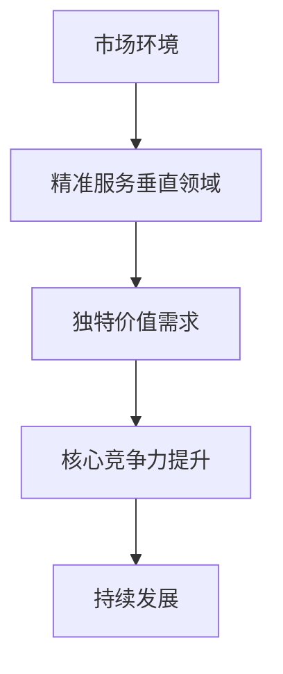
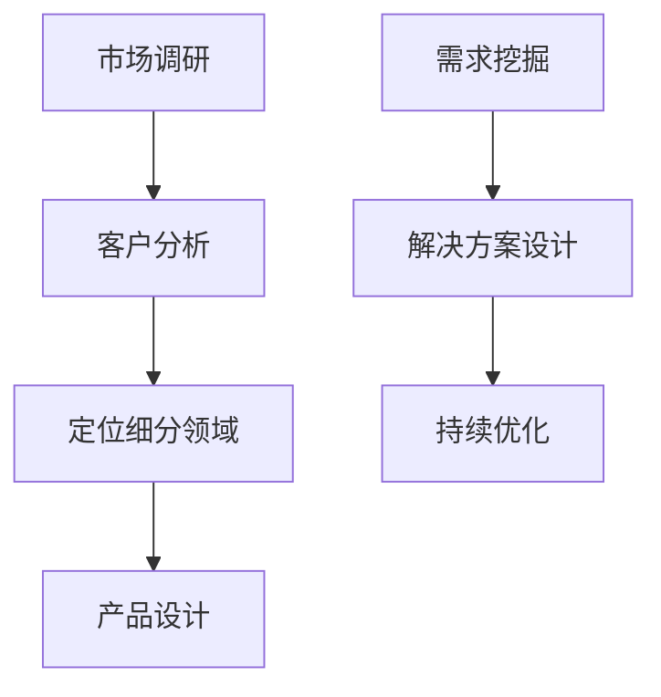

                 

### 文章标题

**小公司生存策略：精准服务垂直领域，满足独特价值需求**

> **关键词**：小公司，生存策略，垂直领域，独特价值需求，精细化运营

> **摘要**：本文将探讨小公司如何在竞争激烈的市场中找到生存之道。通过精准定位垂直领域，满足客户独特的价值需求，小公司能够实现精细化运营，提升核心竞争力。本文将详细分析如何识别和选择垂直领域，构建针对性强、有价值的服务体系，并分享一些成功案例和实践经验，旨在为小公司的长远发展提供有益的借鉴。

### 1. 背景介绍

在现代商业环境中，小公司面临着前所未有的挑战。市场瞬息万变，新技术层出不穷，大公司凭借其雄厚的资本和资源，往往能够快速反应并占据市场份额。对于资源有限的小公司来说，如何在激烈的市场竞争中立足并持续发展，成为了一个亟待解决的重要课题。

传统的小公司运营模式往往依赖于广覆盖、多产品的策略，试图通过规模化、标准化的方式来获取市场份额。然而，这种方式在如今个性化、细分化的市场中，已经显得力不从心。小公司必须寻找新的生存策略，才能在竞争中获得一席之地。

在这个背景下，精准服务垂直领域，满足独特价值需求，成为了小公司的一种新的生存策略。通过聚焦于特定行业或领域，小公司可以深入了解客户需求，提供定制化的解决方案，从而在激烈的市场竞争中脱颖而出。

### 2. 核心概念与联系

#### 2.1 精准服务垂直领域的定义

精准服务垂直领域是指小公司专注于某一特定行业或领域，通过深入研究和理解该领域的需求，提供专业化的产品和服务。这种策略的核心在于“精准”，即针对特定群体的特定需求，提供有针对性的解决方案。

#### 2.2 独特价值需求的定义

独特价值需求是指客户在某一领域或行业中独有的、非标准化的需求。这些需求往往源自客户的特定业务场景或独特的运营模式，难以通过通用产品和服务来满足。小公司通过满足这些独特价值需求，能够为客户创造显著的增值效果。

#### 2.3 精准服务与独特价值需求的联系

精准服务垂直领域和满足独特价值需求之间有着密切的联系。精准服务是满足独特价值需求的前提，只有深入了解并专注于特定领域，才能发现并满足客户独特的需求。而独特价值需求则是精准服务的驱动力，它促使小公司不断创新和优化服务，以更好地满足客户需求。

#### 2.4 Mermaid 流程图



### 3. 核心算法原理 & 具体操作步骤

#### 3.1 精准服务垂直领域的算法原理

精准服务垂直领域的核心在于数据驱动和客户洞察。具体操作步骤如下：

1. **市场调研**：通过市场调研，了解目标行业或领域的市场规模、发展趋势、竞争态势等。
2. **客户分析**：收集客户数据，分析客户的业务模式、需求痛点、潜在需求等。
3. **定位细分领域**：根据市场调研和客户分析结果，确定目标细分领域。
4. **产品设计**：基于细分领域，设计满足客户独特价值需求的产品和服务。

#### 3.2 满足独特价值需求的算法原理

满足独特价值需求的算法原理在于个性化定制和持续优化。具体操作步骤如下：

1. **需求挖掘**：通过访谈、问卷、数据分析等方式，深入挖掘客户的独特价值需求。
2. **解决方案设计**：基于需求挖掘结果，设计个性化、定制化的解决方案。
3. **持续优化**：通过客户反馈和市场变化，不断优化解决方案，以满足不断变化的需求。

#### 3.3 Mermaid 流程图



### 4. 数学模型和公式 & 详细讲解 & 举例说明

#### 4.1 精准服务垂直领域的数学模型

精准服务垂直领域的数学模型可以表示为：

\[ f(\text{市场环境}, \text{客户需求}) = \text{定位细分领域} \]

其中，市场环境和客户需求是输入变量，定位细分领域是输出结果。通过市场调研和客户分析，可以确定输入变量的值，从而得到定位细分领域的最优解。

#### 4.2 满足独特价值需求的数学模型

满足独特价值需求的数学模型可以表示为：

\[ g(\text{客户需求}) = \text{个性化解决方案} \]

其中，客户需求是输入变量，个性化解决方案是输出结果。通过需求挖掘，可以确定输入变量的值，从而得到满足独特价值需求的个性化解决方案。

#### 4.3 举例说明

假设小公司是一家专注于电子商务领域的小公司，其市场环境和客户需求如下：

- **市场环境**：电子商务市场规模不断扩大，消费者对个性化、定制化的购物体验需求日益增长。
- **客户需求**：客户希望获得个性化的商品推荐、个性化的购物体验和优质的售后服务。

根据精准服务垂直领域的数学模型，小公司可以定位到电子商务领域中的个性化推荐和个性化购物体验细分市场。

根据满足独特价值需求的数学模型，小公司可以设计以下个性化解决方案：

- **个性化商品推荐**：基于客户的购物历史、浏览记录和偏好，为客户提供个性化的商品推荐。
- **个性化购物体验**：通过设计个性化的购物界面、互动环节和优惠活动，提升客户的购物体验。
- **优质售后服务**：提供快速、高效的售后服务，解决客户在购物过程中遇到的问题。

### 5. 项目实践：代码实例和详细解释说明

#### 5.1 开发环境搭建

在本节中，我们将使用Python作为主要编程语言，搭建一个简单的电子商务平台，以实现个性化商品推荐和个性化购物体验。

1. **安装Python**：从[Python官网](https://www.python.org/)下载并安装Python 3.x版本。
2. **安装相关库**：在命令行中运行以下命令安装所需库：

```bash
pip install Flask pandas numpy
```

#### 5.2 源代码详细实现

以下是一个简单的Python代码示例，用于实现个性化商品推荐和个性化购物体验。

```python
# 导入相关库
from flask import Flask, request, jsonify
import pandas as pd
import numpy as np

# 初始化Flask应用
app = Flask(__name__)

# 商品数据（示例）
products = pd.DataFrame({
    'product_id': [1, 2, 3, 4, 5],
    'product_name': ['商品A', '商品B', '商品C', '商品D', '商品E'],
    'category': ['电子产品', '家居用品', '服饰', '食品', '化妆品'],
    'price': [1000, 2000, 3000, 4000, 5000]
})

# 客户购物历史数据（示例）
customer_history = pd.DataFrame({
    'customer_id': [1, 1, 2, 2],
    'product_id': [1, 3, 2, 4]
})

# 实现个性化商品推荐
@app.route('/recommend', methods=['POST'])
def recommend_products():
    customer_id = request.form['customer_id']
    customer_products = customer_history[customer_history['customer_id'] == customer_id]['product_id'].values
    recommended_products = products[~products['product_id'].isin(customer_products)]['product_name'].values
    return jsonify({'recommended_products': recommended_products.tolist()})

# 实现个性化购物体验
@app.route('/shop', methods=['GET'])
def shop():
    product_name = request.args.get('product_name')
    product = products[products['product_name'] == product_name]
    return f"""
    <h1>个性化购物体验</h1>
    <p>欢迎选购 {product['product_name'].values[0]}，价格：{product['price'].values[0]}</p>
    <p>建议搭配商品：</p>
    <ul>
    
        <li>{{ name }}</li>
    
    </ul>
    """

# 运行应用
if __name__ == '__main__':
    app.run(debug=True)
```

#### 5.3 代码解读与分析

1. **Flask应用搭建**：使用Flask框架搭建一个简单的Web应用，用于处理客户请求并提供个性化服务。
2. **商品数据管理**：使用pandas库管理商品数据，包括商品ID、名称、类别和价格等信息。
3. **个性化商品推荐**：通过客户ID获取其购买历史，推荐尚未购买的商品。此功能通过`/recommend`接口实现，接受POST请求并返回推荐商品列表。
4. **个性化购物体验**：通过客户请求的商品名称，生成一个包含商品信息和推荐搭配商品的HTML页面。此功能通过`/shop`接口实现，接受GET请求并返回HTML页面。

#### 5.4 运行结果展示

1. **启动应用**：在命令行中运行`python app.py`启动Flask应用。
2. **访问推荐接口**：通过浏览器访问`http://127.0.0.1:5000/recommend?customer_id=1`，获取客户ID为1的个性化商品推荐列表。
3. **访问购物页面**：通过浏览器访问`http://127.0.0.1:5000/shop?product_name=商品A`，查看商品A的个性化购物体验页面。

### 6. 实际应用场景

#### 6.1 零售电商

在零售电商领域，小公司可以通过精准服务垂直领域，满足消费者的个性化需求，提升客户黏性和忠诚度。例如，一家专注于时尚配饰的小公司可以通过个性化商品推荐和定制化购物体验，吸引并留住客户。

#### 6.2 教育培训

在教育培训领域，小公司可以专注于某一学科或课程，提供专业化的培训服务。通过深入了解学员的需求，提供定制化的教学方案，小公司可以在激烈的市场竞争中脱颖而出。

#### 6.3 医疗保健

在医疗保健领域，小公司可以专注于某一疾病或症状，提供专业的医疗咨询服务。通过为客户提供个性化的治疗方案和健康管理服务，小公司可以在医疗市场中占据一席之地。

### 7. 工具和资源推荐

#### 7.1 学习资源推荐

- **书籍**：
  - 《精益创业》
  - 《客户价值创新》
  - 《营销管理：第15版》
- **论文**：
  - 《精准营销：理论与实践》
  - 《消费者行为学》
  - 《大数据营销：策略与应用》
- **博客**：
  - [精益创业实验室](https://www精益创业实验室.com)
  - [增长黑客](https://www.增长黑客.com)
  - [硅谷创业周](https://www.硅谷创业周.com)
- **网站**：
  - [创业邦](https://www.创业邦.com)
  - [创业家](https://www.创业家.com)
  - [投资界](https://www.投资界.com)

#### 7.2 开发工具框架推荐

- **开发框架**：
  - Flask（Python Web开发框架）
  - Django（Python全栈开发框架）
  - Spring Boot（Java Web开发框架）
- **数据分析工具**：
  - pandas（Python数据分析库）
  - numpy（Python科学计算库）
  - Power BI（商业智能分析工具）
- **客户关系管理工具**：
  - Salesforce（客户关系管理系统）
  - HubSpot（营销自动化平台）
  - Zoho CRM（客户关系管理系统）

#### 7.3 相关论文著作推荐

- **论文**：
  - "Customer-Centric Business Models: A Theoretical Framework"（以客户为中心的企业模式：一个理论框架）
  - "Market Segmentation: Concept and Measurement Methods"（市场细分：概念和测量方法）
  - "Value-Based Management: Tools and Techniques for Strategic Management"（价值基础管理：战略管理的工具和技术）
- **著作**：
  - 《商业模式新生代》
  - 《精益数据分析》
  - 《市场营销学》

### 8. 总结：未来发展趋势与挑战

随着市场细分和个性化需求的不断增长，精准服务垂直领域将成为小公司的重要生存策略。未来，小公司需要持续关注以下发展趋势和挑战：

1. **技术创新**：随着人工智能、大数据等新技术的快速发展，小公司需要不断更新技术栈，提升服务能力和竞争力。
2. **用户体验**：提升用户体验将始终是关键，小公司需要深入了解客户需求，提供极致的个性化服务和体验。
3. **可持续发展**：在追求利润的同时，小公司需要关注社会责任和可持续发展，建立良好的品牌形象。

面对未来，小公司需要不断调整策略，灵活应对市场变化，以实现长期稳定的发展。

### 9. 附录：常见问题与解答

#### 9.1 什么是精准服务垂直领域？

精准服务垂直领域是指小公司专注于某一特定行业或领域，通过深入研究和理解该领域的需求，提供专业化的产品和服务。

#### 9.2 满足独特价值需求为什么重要？

满足独特价值需求能够帮助小公司为客户提供定制化的解决方案，提升客户满意度，从而在激烈的市场竞争中脱颖而出。

#### 9.3 如何进行市场调研？

市场调研可以通过以下几种方式进行：

- **访谈**：与行业专家、潜在客户等进行面对面访谈，了解他们的需求和痛点。
- **问卷调查**：设计问卷，通过线上或线下方式收集客户反馈。
- **数据分析**：分析市场数据、竞争对手数据，了解行业趋势和市场需求。

#### 9.4 如何进行客户分析？

客户分析可以通过以下几种方式进行：

- **收集数据**：收集客户的个人信息、购买历史、互动记录等。
- **数据挖掘**：使用数据分析工具，挖掘客户行为和偏好。
- **客户画像**：根据客户数据，创建客户画像，了解客户的需求和行为特征。

### 10. 扩展阅读 & 参考资料

- [《商业模式新生代》[作者：亚历山大·奥斯特瓦尔德（Alexander Osterwalder）和伊芙·皮尼厄（Yves Pigneur）]：详细介绍了商业模式的创新和设计方法。]
- [《精益数据分析》[作者：阿南特·帕塔克（Avinash Kaushik）]：介绍了如何通过数据分析提升企业运营效率和竞争力。]
- [《用户体验要素》[作者：杰尔·科克曼（Jared Spool）]：详细阐述了用户体验设计的重要性和方法。]
- [《消费者行为学》[作者：理查德·L·利维特（Richard L. Levine）]：深入探讨了消费者的购买行为和决策过程。]
- [《大数据营销：策略与应用》[作者：彼得·F·德鲁克（Peter F. Drucker）]：介绍了大数据在市场营销中的应用和策略。]

### 后记

本文旨在探讨小公司在竞争激烈的市场中如何通过精准服务垂直领域，满足独特价值需求，实现精细化运营。通过深入分析和案例实践，我们希望为小公司的长远发展提供有益的借鉴和启示。在未来的商业环境中，精准服务垂直领域将成为小公司的重要生存策略，助力它们在激烈的市场竞争中脱颖而出。

作者：禅与计算机程序设计艺术 / Zen and the Art of Computer Programming

