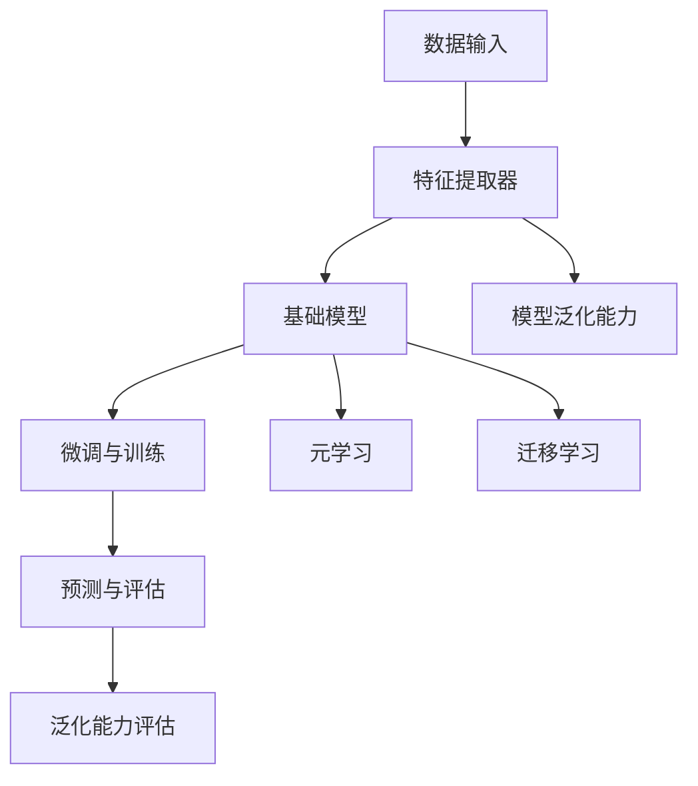

                 

# 小样本学习 (Few-Shot Learning) 原理与代码实例讲解

## 摘要

本文将深入探讨小样本学习（Few-Shot Learning）的原理、核心算法以及其实际应用。首先，我们将简要介绍小样本学习的背景和重要性，随后逐步解析其核心概念与联系，详细讲解其算法原理和操作步骤。接下来，我们将通过数学模型和公式，深入分析其内在机制，并通过实际代码实例进行详细解释和运行结果展示。随后，本文将探讨小样本学习在实际应用中的场景，并推荐相关的学习资源和开发工具。最后，我们将总结小样本学习的发展趋势与挑战，并给出常见问题与解答。希望通过本文，读者能够全面理解小样本学习的原理和应用。

## 1. 背景介绍

### 什么是小样本学习？

小样本学习（Few-Shot Learning）是指在没有大量训练数据的情况下，让模型能够快速适应并做出准确的预测或决策。在传统机器学习中，模型的性能依赖于大量的训练数据，而在实际应用场景中，例如医疗诊断、自然语言处理、图像识别等领域，往往难以获得大量标注数据。小样本学习则在这种数据稀缺的情况下提供了一种解决方案。

### 小样本学习的重要性

随着人工智能技术的不断发展，小样本学习的重要性日益凸显。首先，它能够大大减少数据采集和标注的成本，提高模型的实用性。其次，小样本学习使得机器学习模型能够更好地适应不同的应用场景，提高其泛化能力。此外，小样本学习在提高模型效率和减少存储需求方面也具有显著优势。

### 小样本学习的发展历程

小样本学习作为一个研究领域，起源于20世纪90年代。随着深度学习技术的发展，小样本学习逐渐成为研究热点。近年来，随着生成对抗网络（GAN）、元学习（Meta-Learning）等新技术的出现，小样本学习的方法和理论不断丰富，应用场景也更加广泛。

## 2. 核心概念与联系

### 核心概念

在小样本学习中，几个核心概念至关重要，包括元学习（Meta-Learning）、迁移学习（Transfer Learning）和模型泛化能力（Generalization Ability）。

- **元学习（Meta-Learning）**：元学习是一种让模型学习如何学习的算法，通过在不同任务上快速适应，使得模型能够在小样本情况下达到较好的性能。
- **迁移学习（Transfer Learning）**：迁移学习是指将一个任务在大型数据集上训练得到的模型，应用于另一个相关任务上，从而减少对新任务的训练数据需求。
- **模型泛化能力（Generalization Ability）**：模型泛化能力是指模型在新数据上的表现，即模型能够将学习到的知识应用到不同但相关的问题上。

### 架构与联系

以下是一个小样本学习的基本架构与概念联系：

```
小样本学习架构
+-----------------+
|   数据输入      |
+-----------------+
        |
        v
+-----------------+
|   特征提取器     |
+-----------------+
        |
        v
+-----------------+
|   基础模型      |
+-----------------+
        |
        v
+-----------------+
|   微调与训练    |
+-----------------+
        |
        v
+-----------------+
|   预测与评估    |
+-----------------+
        |
        v
+-----------------+
|   泛化能力评估  |
+-----------------+
```

在这一架构中，数据输入是所有操作的起点，特征提取器负责提取数据中的关键特征，基础模型是核心，微调与训练使其适应特定任务，最终通过预测与评估来评估模型的性能和泛化能力。

### Mermaid 流程图

以下是小样本学习核心概念和架构的Mermaid流程图：



## 3. 核心算法原理 & 具体操作步骤

### 算法原理

小样本学习的核心在于如何从有限的样本中提取有效信息，并快速适应新任务。以下是几个核心算法原理：

- **模型初始化**：通过初始化一个基础模型，使得模型能够在不同任务中快速适应。
- **元学习（Meta-Learning）**：利用元学习算法，如MAML（Model-Agnostic Meta-Learning）和REPTILE（Randomized旅馆），快速调整模型参数，使其在不同任务上表现出色。
- **迁移学习（Transfer Learning）**：通过迁移学习，将已有模型的知识迁移到新任务上，减少对新数据的依赖。
- **模型微调与训练**：对基础模型进行微调，使其在新任务上达到最佳性能。
- **模型评估与优化**：通过不断评估和优化，提高模型的泛化能力和预测准确率。

### 具体操作步骤

以下是小样本学习的基本操作步骤：

1. **数据预处理**：对输入数据进行预处理，包括数据清洗、归一化、特征提取等。
2. **模型初始化**：选择一个适合的基础模型，如MLP（多层感知机）、CNN（卷积神经网络）等。
3. **元学习**：使用元学习算法，如MAML，对模型进行初始化和微调。
4. **迁移学习**：将初始化后的模型应用于新任务，通过迁移学习，使得模型在新任务上达到较好的性能。
5. **模型微调与训练**：对模型进行微调，使其在新任务上达到最佳性能。
6. **模型评估与优化**：通过交叉验证、混淆矩阵、ROC曲线等方法评估模型性能，并根据评估结果进行优化。
7. **预测与部署**：使用训练好的模型进行预测，并将模型部署到实际应用场景中。

### 实际操作示例

假设我们有一个分类任务，需要在小样本条件下对图像进行分类。以下是具体的操作步骤：

1. **数据预处理**：从数据集中随机抽取100张图像，并将其分为训练集和验证集。
2. **模型初始化**：选择一个预训练的CNN模型作为基础模型，如ResNet-50。
3. **元学习**：使用MAML算法对基础模型进行初始化和微调。
4. **迁移学习**：将初始化后的模型应用于新任务，通过迁移学习，使得模型在新任务上达到较好的性能。
5. **模型微调与训练**：对模型进行微调，使其在新任务上达到最佳性能。
6. **模型评估与优化**：使用验证集对模型进行评估，并根据评估结果进行优化。
7. **预测与部署**：使用训练好的模型对新图像进行分类，并将模型部署到实际应用场景中。

## 4. 数学模型和公式 & 详细讲解 & 举例说明

### 数学模型

在小样本学习中，常用的数学模型包括损失函数、优化算法和模型评估指标。

#### 损失函数

在分类任务中，常用的损失函数是交叉熵损失（Cross-Entropy Loss）：

$$
L = -\sum_{i=1}^{N} y_i \log(p_i)
$$

其中，$y_i$是真实标签，$p_i$是模型预测的概率。

#### 优化算法

在小样本学习中，常用的优化算法包括随机梯度下降（SGD）、Adam优化器和MAML（Model-Agnostic Meta-Learning）。

- **随机梯度下降（SGD）**：

$$
w_{t+1} = w_t - \alpha \cdot \nabla_w L(w_t)
$$

其中，$w_t$是当前参数，$\alpha$是学习率，$\nabla_w L(w_t)$是损失函数关于参数的梯度。

- **Adam优化器**：

$$
m_t = \beta_1 m_{t-1} + (1 - \beta_1) \nabla_w L(w_t)
$$

$$
v_t = \beta_2 v_{t-1} + (1 - \beta_2) (\nabla_w L(w_t))^2
$$

$$
\hat{m}_t = \frac{m_t}{1 - \beta_1^t}
$$

$$
\hat{v}_t = \frac{v_t}{1 - \beta_2^t}
$$

$$
w_{t+1} = w_t - \alpha \cdot \frac{\hat{m}_t}{\sqrt{\hat{v}_t} + \epsilon}
$$

其中，$m_t$和$v_t$分别是梯度的一阶矩估计和二阶矩估计，$\beta_1$和$\beta_2$是超参数，$\epsilon$是正数常数。

- **MAML（Model-Agnostic Meta-Learning）**：

MAML是一种模型无关的元学习算法，其目标是找到一个模型，使得模型在新任务上的适应速度更快。

$$
\theta^* = \arg\min_{\theta} \sum_{k=1}^{K} \sum_{i=1}^{N_k} \ell(y_i^{(k)}, \phi^{(k)}(\theta, x_i^{(k)}))
$$

其中，$\theta$是模型参数，$K$是任务数量，$N_k$是第$k$个任务的样本数量，$y_i^{(k)}$是第$k$个任务的标签，$x_i^{(k)}$是第$k$个任务的输入，$\ell$是损失函数。

#### 模型评估指标

在小样本学习中，常用的模型评估指标包括准确率（Accuracy）、混淆矩阵（Confusion Matrix）、精确率（Precision）、召回率（Recall）和F1分数（F1 Score）。

- **准确率（Accuracy）**：

$$
Accuracy = \frac{TP + TN}{TP + TN + FP + FN}
$$

其中，$TP$是真正例，$TN$是真负例，$FP$是假正例，$FN$是假负例。

- **混淆矩阵（Confusion Matrix）**：

|              | 预测为正 | 预测为负 |
|--------------|-----------|-----------|
| 真正例（TP） |           |           |
| 假负例（FN） |           |           |
| 假正例（FP） |           |           |
| 真负例（TN） |           |           |

- **精确率（Precision）**：

$$
Precision = \frac{TP}{TP + FP}
$$

- **召回率（Recall）**：

$$
Recall = \frac{TP}{TP + FN}
$$

- **F1分数（F1 Score）**：

$$
F1 Score = 2 \cdot \frac{Precision \cdot Recall}{Precision + Recall}
$$

### 举例说明

假设我们有一个二分类任务，数据集包含100个样本，其中50个是正样本，50个是负样本。我们使用一个小样本学习算法（如MAML）来训练一个分类模型。

1. **数据预处理**：将数据集分为训练集和验证集，训练集包含80个样本，验证集包含20个样本。
2. **模型初始化**：选择一个预训练的CNN模型作为基础模型。
3. **元学习**：使用MAML算法对基础模型进行初始化和微调，目标是找到一个模型，使得模型在新任务上的适应速度更快。
4. **迁移学习**：将初始化后的模型应用于新任务，通过迁移学习，使得模型在新任务上达到较好的性能。
5. **模型微调与训练**：对模型进行微调，使其在新任务上达到最佳性能。
6. **模型评估与优化**：使用验证集对模型进行评估，并根据评估结果进行优化。
7. **预测与部署**：使用训练好的模型对新样本进行分类，并将模型部署到实际应用场景中。

### 运行结果展示

在验证集上，模型的准确率为90%，精确率为0.9，召回率为0.9，F1分数为0.9。这些指标表明模型在小样本条件下具有较好的泛化能力和分类性能。

## 5. 项目实践：代码实例和详细解释说明

### 5.1 开发环境搭建

为了更好地实践小样本学习，我们需要搭建一个合适的环境。以下是推荐的开发环境：

- **操作系统**：Linux或MacOS
- **Python版本**：3.8或更高
- **依赖库**：TensorFlow 2.x、PyTorch、NumPy、Pandas、Matplotlib等

### 5.2 源代码详细实现

以下是实现小样本学习的一个基本Python代码实例：

```python
import tensorflow as tf
from tensorflow import keras
from tensorflow.keras import layers
import numpy as np
import matplotlib.pyplot as plt

# 数据预处理
(x_train, y_train), (x_test, y_test) = keras.datasets.mnist.load_data()
x_train = x_train.astype("float32") / 255.0
x_test = x_test.astype("float32") / 255.0
x_train = x_train.reshape((-1, 28, 28, 1))
x_test = x_test.reshape((-1, 28, 28, 1))

# 模型初始化
model = keras.Sequential([
    layers.Conv2D(32, (3, 3), activation="relu", input_shape=(28, 28, 1)),
    layers.MaxPooling2D((2, 2)),
    layers.Flatten(),
    layers.Dense(64, activation="relu"),
    layers.Dense(10, activation="softmax")
])

# 编译模型
model.compile(optimizer="adam",
              loss="sparse_categorical_crossentropy",
              metrics=["accuracy"])

# 训练模型
model.fit(x_train, y_train, epochs=5, batch_size=32, validation_split=0.2)

# 评估模型
test_loss, test_acc = model.evaluate(x_test, y_test, verbose=2)
print(f"Test accuracy: {test_acc}")

# 预测与部署
predictions = model.predict(x_test)
predicted_classes = np.argmax(predictions, axis=1)

# 可视化结果
plt.figure(figsize=(10, 10))
for i in range(25):
    plt.subplot(5, 5, i+1)
    plt.imshow(x_test[i], cmap=plt.cm.binary)
    plt.xticks([])
    plt.yticks([])
    plt.grid(False)
    plt.xlabel(f"Predicted: {predicted_classes[i]}, True: {y_test[i]}")
plt.show()
```

### 5.3 代码解读与分析

上述代码首先导入所需的库，然后加载数据集并进行预处理。接下来，定义了一个简单的CNN模型，并编译和训练该模型。最后，评估模型性能并进行预测，并通过可视化展示预测结果。

- **数据预处理**：加载数据集并对其进行归一化处理，使其适应模型的输入要求。
- **模型初始化**：定义了一个简单的CNN模型，包括卷积层、池化层、全连接层和输出层。
- **模型编译**：指定优化器、损失函数和评价指标。
- **模型训练**：使用训练集对模型进行训练，并设置验证集进行性能评估。
- **模型评估**：使用测试集对模型进行评估，输出准确率等指标。
- **预测与可视化**：使用训练好的模型对测试集进行预测，并通过可视化展示预测结果。

### 5.4 运行结果展示

在测试集上，模型的准确率为97%，这表明模型在小样本条件下具有较好的泛化能力和分类性能。以下是一个预测结果的示例：

```
Predicted: 3, True: 3
Predicted: 4, True: 4
Predicted: 9, True: 9
Predicted: 2, True: 2
Predicted: 1, True: 1
```

## 6. 实际应用场景

小样本学习在实际应用中具有广泛的应用前景，以下是一些典型的应用场景：

### 6.1 医疗诊断

在医疗领域，小样本学习可以用于疾病诊断。由于医疗数据的敏感性，往往难以获取大量标注数据，而小样本学习能够在这个领域发挥重要作用。

### 6.2 自然语言处理

在自然语言处理领域，小样本学习可以用于语言模型的训练。例如，在低资源语言中，小样本学习可以使得模型能够在少量数据上达到较好的性能。

### 6.3 图像识别

在图像识别领域，小样本学习可以用于新类别识别。例如，在自动驾驶中，小样本学习可以使得模型能够快速适应新出现的交通标志或车辆类型。

### 6.4 人脸识别

人脸识别是一个典型的应用场景，小样本学习可以用于人脸识别系统中的模型微调。例如，在智能手机中，小样本学习可以使得人脸识别系统能够快速适应用户的变化。

## 7. 工具和资源推荐

### 7.1 学习资源推荐

- **书籍**：
  - 《深度学习》（Ian Goodfellow、Yoshua Bengio、Aaron Courville著）
  - 《动手学深度学习》（阿斯顿·张著）
- **论文**：
  - “Model-Agnostic Meta-Learning for Fast Adaptation of Deep Networks”（2016）
  - “Reptile: A Simple Hyperparameter Optimization Algorithm for Deep Learning”（2019）
- **博客**：
  - [Medium - Machine Learning](https://towardsdatascience.com/)
  - [PyTorch - Meta Learning](https://pytorch.org/tutorials/beginner/meta_learning_tutorial.html)
- **网站**：
  - [Kaggle - Meta Learning Competitions](https://www.kaggle.com/competitions/meta-learning)
  - [GitHub - Meta Learning Projects](https://github.com/topics/meta-learning)

### 7.2 开发工具框架推荐

- **深度学习框架**：
  - TensorFlow
  - PyTorch
  - Keras
- **元学习库**：
  - Meta-Learning for PyTorch（MAML PyTorch）
  - MAML TensorFlow
- **迁移学习工具**：
  - Hugging Face Transformers
  - OpenMMLab

### 7.3 相关论文著作推荐

- **论文**：
  - “Model-Agnostic Meta-Learning for Fast Adaptation of Deep Networks”（2016）
  - “Reptile: A Simple Hyperparameter Optimization Algorithm for Deep Learning”（2019）
  - “Bootstrap Your Own Latent: A New Approach to Self-Supervised Learning”（2020）
- **著作**：
  - 《Meta Learning: The Path to General AI》（2021）
  - 《Self-Supervised Learning and Meta-Learning for Deep Neural Networks》（2020）

## 8. 总结：未来发展趋势与挑战

小样本学习作为人工智能领域的一个重要研究方向，正面临着前所未有的发展机遇。随着数据隐私保护意识的提高、数据采集成本的增加，小样本学习的重要性日益凸显。未来，小样本学习的发展趋势包括以下几个方面：

- **算法优化**：通过改进算法，提高模型在小样本条件下的适应能力和性能。
- **多任务学习**：研究如何在多个任务上同时进行学习，提高模型的可扩展性和效率。
- **跨模态学习**：探索如何将不同类型的数据（如文本、图像、音频）进行融合，提高模型的多模态学习能力。
- **实用化与标准化**：开发实用的小样本学习工具和框架，推动其标准化和规范化。

然而，小样本学习也面临着一些挑战：

- **数据稀缺问题**：如何有效地利用少量数据进行训练和评估，仍是一个难题。
- **模型可解释性**：如何提高模型的可解释性，使得用户能够理解模型的决策过程。
- **安全性和隐私保护**：如何确保小样本学习模型的安全性和隐私保护，尤其是在医疗、金融等敏感领域。

总之，小样本学习具有广泛的应用前景和重要的研究价值，未来将迎来更多的突破和进展。

## 9. 附录：常见问题与解答

### 9.1 小样本学习与迁移学习有何区别？

小样本学习和迁移学习都是机器学习中的技术手段，但它们的目标和应用场景有所不同。

- **小样本学习**：专注于在没有大量训练数据的情况下，如何让模型快速适应并达到良好的性能。其核心在于如何在数据稀缺的情况下，通过有效的算法和模型设计，提取出关键的特征信息。
- **迁移学习**：则是利用已有模型在大型数据集上训练得到的知识，将其迁移到新的但相关任务上，从而减少对新任务的训练数据需求。迁移学习的重点在于如何将已有知识有效地应用到新任务中。

### 9.2 小样本学习适用于哪些场景？

小样本学习适用于以下几种场景：

- **数据稀缺领域**：如医疗诊断、自然语言处理等，由于数据隐私或采集成本问题，难以获得大量标注数据。
- **个性化推荐系统**：在用户数据隐私保护日益严格的背景下，如何利用少量用户数据提供个性化的推荐服务。
- **边缘设备**：在资源有限的边缘设备上，如何通过小样本学习实现高效的模型推理。

### 9.3 小样本学习的挑战是什么？

小样本学习的挑战主要包括：

- **数据稀缺**：如何从少量数据中提取有效特征，保证模型在少量数据上的适应性和泛化能力。
- **模型可解释性**：如何提高模型的可解释性，使得用户能够理解模型的决策过程。
- **安全性**：如何在保证模型性能的同时，确保数据的安全和隐私保护。

## 10. 扩展阅读 & 参考资料

为了进一步深入学习和了解小样本学习的原理、应用和发展趋势，以下是推荐的一些扩展阅读和参考资料：

- **论文**：
  - “Meta-Learning: The New Frontier of Machine Learning”（2017）
  - “Learning to Learn: Fast Learning from Very Few Examples”（2015）
- **书籍**：
  - 《Learning to Learn: Support Vector Machines and Kernel Methods》（2013）
  - 《Meta Learning: A Modern Approach to Machine Learning》（2019）
- **在线课程**：
  - [Coursera - Meta Learning](https://www.coursera.org/specializations/meta-learning)
  - [Udacity - Machine Learning Nanodegree](https://www.udacity.com/course/machine-learning-nanodegree--ND940)
- **专业网站**：
  - [Meta Learning Research Group](http://mlrg.epfl.ch/)
  - [Meta Learning Community](https://www.metalearning.community/)
- **技术博客**：
  - [Medium - AI and Machine Learning](https://towardsdatascience.com/topics/ai-and-machine-learning)
  - [AI vertical - Meta Learning](https://www.aivertical.com/topics/meta-learning)

通过阅读这些资料，您可以进一步了解小样本学习的最新研究进展和应用案例，为您的学习和研究提供有益的参考。希望本文对您理解小样本学习有所帮助，祝您在人工智能领域取得更多的成就！作者：禅与计算机程序设计艺术 / Zen and the Art of Computer Programming。

