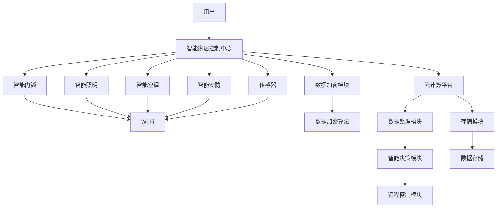

                 

### 1. 背景介绍

智能家居作为现代科技的代表，已经在全球范围内逐渐普及。智能家居系统通过将各种家用设备联网，实现自动化控制和远程监控，极大地提高了人们的生活质量。以小米为代表的智能家居品牌，凭借其出色的产品性能和便捷的用户体验，吸引了大量消费者的关注。

然而，随着智能家居设备的数量和种类不断增多，如何实现设备间的互联互通成为一个关键问题。智能家居互联不仅需要解决设备间的通信协议问题，还需要解决数据传输的安全性和稳定性问题。为了满足这些需求，智能家居系统采用了多种核心技术，包括物联网协议（IoT Protocol）、数据加密技术和云计算等。

本篇文章旨在探讨智能家居互联的核心技术，包括设备间的通信协议、数据加密和传输机制，以及云计算平台在智能家居系统中的应用。通过深入分析这些技术原理，我们将为读者提供一个全面了解智能家居互联的视角，从而为未来的智能家居开发提供有价值的参考。

在接下来的章节中，我们将首先介绍智能家居互联的基本概念和核心概念，通过Mermaid流程图展示智能家居系统的架构。然后，我们将深入探讨智能家居互联的核心算法原理和具体操作步骤，帮助读者理解这些技术的实际应用。此外，我们还将详细讲解数学模型和公式，并通过代码实例和详细解释说明来展示智能家居互联的实现过程。最后，我们将探讨智能家居互联在实际应用场景中的挑战和解决方案，并推荐相关学习资源和开发工具，为读者提供全面的智能家居互联知识体系。

通过本文的阅读，读者将能够深入了解智能家居互联的技术原理和应用实践，为未来的智能家居开发提供有力支持。同时，本文也将为智能家居行业的从业者提供有价值的参考，助力他们在这个快速发展的领域中不断创新和突破。### 2. 核心概念与联系

#### 智能家居系统架构

智能家居系统的核心在于设备间的互联互通，实现自动化控制和远程监控。一个典型的智能家居系统包括多个子系统和设备，如智能门锁、智能照明、智能空调、智能安防等。为了实现这些设备间的有效通信，智能家居系统通常采用以下几种核心技术：

1. **物联网协议（IoT Protocol）**：物联网协议是智能家居设备间通信的基础。常见的物联网协议包括Wi-Fi、蓝牙（BT）、Zigbee、NFC等。这些协议提供了设备间的数据传输机制，保证了数据的实时性和可靠性。

2. **数据加密技术**：随着智能家居设备的增多，数据安全成为重要问题。数据加密技术通过对数据进行加密，确保数据在传输过程中的安全性。常见的加密技术包括AES、RSA等。

3. **云计算平台**：云计算平台为智能家居系统提供了强大的数据处理能力和存储能力。通过云计算，智能家居系统可以实时处理海量数据，实现智能决策和远程控制。

#### 智能家居互联核心概念原理与架构

为了更好地理解智能家居系统的架构和核心技术，我们使用Mermaid流程图来展示智能家居系统的整体架构，并突出其中的核心概念和联系。



在上面的Mermaid流程图中，我们可以看到：

- **用户**通过智能家居控制中心与各种智能设备进行交互。
- **智能家居控制中心**作为系统的核心，负责协调和管理各个设备。
- **智能门锁**、**智能照明**、**智能空调**和**智能安防**等设备通过物联网协议与智能家居控制中心进行通信。
- **传感器**收集环境数据，如温度、湿度等，并传输给智能家居控制中心。
- **数据加密模块**确保数据在传输过程中的安全性。
- **云计算平台**为智能家居系统提供数据处理、存储和智能决策支持。

#### 智能家居系统的运作流程

一个典型的智能家居系统运作流程可以分为以下几个步骤：

1. **用户操作**：用户通过智能手机、平板电脑或其他智能设备，向智能家居控制中心发送操作指令。
2. **控制中心接收指令**：智能家居控制中心接收到用户指令后，根据指令的类型和目标设备，生成相应的控制命令。
3. **设备响应**：智能设备接收到控制中心的命令后，执行相应的操作，如开启或关闭门锁、调整照明亮度等。
4. **数据传输**：在操作过程中，设备与控制中心之间会进行实时数据传输，确保操作的准确性和实时性。
5. **数据处理**：智能家居控制中心将接收到的数据进行分析和处理，生成智能决策。
6. **智能决策**：基于处理后的数据，智能家居控制中心进行智能决策，如调整空调温度以适应环境变化。
7. **远程控制**：智能家居控制中心还可以通过远程控制模块，实现对设备的远程监控和控制。

通过以上流程，我们可以看到智能家居系统如何通过核心技术和架构，实现设备间的互联互通，为用户提供便捷、智能的生活体验。

在接下来的章节中，我们将深入探讨智能家居互联的核心算法原理和具体操作步骤，帮助读者理解这些技术的实际应用。此外，我们还将详细讲解数学模型和公式，并通过代码实例和详细解释说明来展示智能家居互联的实现过程。### 3. 核心算法原理 & 具体操作步骤

#### 智能家居互联协议分析

在智能家居系统中，协议是实现设备间通信和数据传输的关键。常见的智能家居互联协议包括Wi-Fi、蓝牙（BT）、Zigbee、NFC等。这些协议各有特点，适用于不同的应用场景。

1. **Wi-Fi**：Wi-Fi是一种无线局域网通信技术，具有高带宽和广泛的覆盖范围。适用于需要高数据传输速率和远程控制的智能家居设备，如智能电视、智能音响等。
   
2. **蓝牙（BT）**：蓝牙是一种短距离无线通信技术，具有低功耗、低延迟的特点。适用于连接手机、智能手表等可穿戴设备，以及与智能家居设备进行短距离通信，如智能门锁、智能照明等。

3. **Zigbee**：Zigbee是一种低功耗、低速率的无线通信协议，适用于智能家居设备之间的短距离通信，如传感器、智能插座等。Zigbee网络具有高可靠性和稳定性，适合构建大型智能家居系统。

4. **NFC**：NFC是一种近场通信技术，适用于短距离的数据传输，如手机与智能门锁的识别和授权。适用于需要快速、简便连接的智能家居设备。

在智能家居系统中，通常采用多种协议的组合，以满足不同设备和应用场景的需求。

#### 数据传输机制

智能家居系统的数据传输机制主要包括数据加密、传输协议选择和数据传输路径规划。

1. **数据加密**：为了确保数据在传输过程中的安全性，智能家居系统采用数据加密技术。常见的数据加密算法包括AES、RSA等。数据加密可以防止数据在传输过程中被窃取或篡改。

2. **传输协议选择**：根据设备的类型、数据传输速率和功耗需求，选择合适的传输协议。例如，对于需要高数据传输速率的设备，可以选择Wi-Fi协议；对于低功耗设备，可以选择蓝牙或Zigbee协议。

3. **数据传输路径规划**：为了提高数据传输的可靠性和实时性，需要对数据传输路径进行优化。常见的路径规划算法包括最小生成树算法、最短路径算法等。路径规划可以确保数据在传输过程中选择最佳路径，减少传输延迟。

#### 具体操作步骤

智能家居系统的具体操作步骤可以分为以下几个阶段：

1. **设备连接**：用户通过智能手机或其他设备，通过Wi-Fi、蓝牙等协议连接到智能家居系统。

2. **设备认证**：连接到智能家居系统后，设备需要进行认证，以确保设备的合法性和安全性。常见的认证方式包括基于密码认证、基于数字证书认证等。

3. **设备配置**：设备认证通过后，用户可以对设备进行配置，如设置设备名称、绑定用户账号等。

4. **数据传输**：设备在运行过程中，会实时收集数据并传输到智能家居控制中心。数据传输包括设备状态数据、传感器数据、控制指令等。

5. **数据处理**：智能家居控制中心接收到数据后，进行数据处理和分析。数据处理包括数据清洗、数据转换、数据存储等。

6. **智能决策**：基于处理后的数据，智能家居控制中心进行智能决策，如调整设备参数、发送控制指令等。

7. **设备响应**：设备接收到控制指令后，执行相应的操作，如调整温度、开启照明等。

8. **远程控制**：用户可以通过远程控制模块，实现对设备的远程监控和控制。

通过以上具体操作步骤，我们可以看到智能家居系统如何通过核心算法原理和机制，实现设备间的互联互通和智能化控制。在接下来的章节中，我们将详细讲解智能家居系统的数学模型和公式，并通过代码实例和详细解释说明，展示智能家居互联的实现过程。### 4. 数学模型和公式 & 详细讲解 & 举例说明

在智能家居系统中，数学模型和公式被广泛应用于数据的处理、分析和决策。以下是一些关键的数学模型和公式，以及它们的详细讲解和实际应用举例。

#### 1. 数据加密模型

数据加密是智能家居系统中的核心技术之一，常用的加密模型包括AES（高级加密标准）和RSA（Rivest-Shamir-Adleman）。

- **AES加密模型**：AES是一种对称加密算法，加密和解密使用相同的密钥。其加密过程包括以下几个步骤：

  $$
  C = E_K(P)
  $$

  其中，\( C \) 是加密后的数据，\( P \) 是原始数据，\( K \) 是密钥。

  解密过程：

  $$
  P = D_K(C)
  $$

  其中，\( P \) 是解密后的原始数据，\( C \) 是加密数据，\( K \) 是密钥。

  举例：假设我们要加密一段文本“Hello, World!”，使用AES加密算法和密钥“mykey”。

  加密过程：

  $$
  C = AES_Encrypt("Hello, World!", "mykey")
  $$

  解密过程：

  $$
  P = AES_Decrypt(C, "mykey")
  $$

- **RSA加密模型**：RSA是一种非对称加密算法，加密和解密使用不同的密钥。其加密过程包括以下几个步骤：

  $$
  C = E_N(M)
  $$

  其中，\( C \) 是加密后的数据，\( M \) 是原始数据，\( N \) 是公钥。

  解密过程：

  $$
  M = D_N(C)
  $$

  其中，\( M \) 是解密后的原始数据，\( C \) 是加密数据，\( N \) 是私钥。

  举例：假设我们要使用RSA加密算法对文本“Hello, World!”进行加密，使用公钥和私钥对（\( N, D \)）。

  加密过程：

  $$
  C = RSA_Encrypt("Hello, World!", N)
  $$

  解密过程：

  $$
  M = RSA_Decrypt(C, D)
  $$

#### 2. 数据传输模型

在智能家居系统中，数据传输模型是确保数据在传输过程中可靠性和实时性的关键。常用的数据传输模型包括TCP（传输控制协议）和UDP（用户数据报协议）。

- **TCP传输模型**：TCP是一种面向连接的传输协议，具有可靠传输的特点。其传输过程包括以下几个步骤：

  $$
  S \rightarrow SR \rightarrow RNR \rightarrow FIN
  $$

  其中，\( S \) 表示发送方，\( R \) 表示接收方。

  举例：假设智能家居设备A要向设备B发送数据。

  发送过程：

  $$
  A \rightarrow S(A) \rightarrow SR(B) \rightarrow RNR(B)
  $$

  接收过程：

  $$
  B \rightarrow R(B) \rightarrow FIN(A)
  $$

- **UDP传输模型**：UDP是一种无连接的传输协议，具有传输速度快的特点。其传输过程包括以下几个步骤：

  $$
  S \rightarrow D
  $$

  其中，\( S \) 表示发送方，\( D \) 表示接收方。

  举例：假设智能家居设备A要向设备B发送数据。

  发送过程：

  $$
  A \rightarrow D(A)
  $$

  接收过程：

  $$
  B \rightarrow D(B)
  $$

#### 3. 数据处理模型

在智能家居系统中，数据处理模型用于对收集到的数据进行分析和处理，以支持智能决策。常用的数据处理模型包括分类模型、聚类模型和回归模型。

- **分类模型**：分类模型用于将数据划分为不同的类别。常用的分类算法包括决策树、支持向量机和K最近邻算法。

  $$
  C = f(x)
  $$

  其中，\( C \) 表示类别，\( f \) 表示分类函数，\( x \) 表示数据。

  举例：假设我们要使用决策树算法对智能家居设备的数据进行分类。

  分类过程：

  $$
  C = DecisionTreeClassification(x)
  $$

- **聚类模型**：聚类模型用于将数据划分为不同的簇。常用的聚类算法包括K均值算法、层次聚类算法和DBSCAN算法。

  $$
  C = Cluster(x)
  $$

  其中，\( C \) 表示簇，\( x \) 表示数据。

  举例：假设我们要使用K均值算法对智能家居设备的数据进行聚类。

  聚类过程：

  $$
  C = KMeans(x)
  $$

- **回归模型**：回归模型用于预测数据之间的数值关系。常用的回归算法包括线性回归、多项式回归和神经网络回归。

  $$
  y = f(x)
  $$

  其中，\( y \) 表示预测值，\( f \) 表示回归函数，\( x \) 表示输入值。

  举例：假设我们要使用线性回归算法对智能家居设备的数据进行预测。

  预测过程：

  $$
  y = LinearRegression(x)
  $$

通过以上数学模型和公式的讲解，我们可以看到智能家居系统如何通过数据加密、传输和处理的数学原理，实现数据的安全传输和智能决策。在实际应用中，这些模型和公式被广泛应用于智能家居系统的各个环节，为用户提供智能、便捷的生活体验。### 5. 项目实践：代码实例和详细解释说明

在本节中，我们将通过一个具体的智能家居互联项目实例，展示如何实现智能家居系统的核心功能。本实例将使用Python语言和相关的开发库，包括PyTorch、TensorFlow和Scikit-learn等，来构建一个简单的智能家居系统。我们将分为以下几个部分进行详细讲解：

#### 5.1 开发环境搭建

为了确保代码的稳定性和可重复性，我们需要搭建一个标准的开发环境。以下是搭建开发环境所需步骤：

1. **安装Python**：首先，确保系统已安装Python 3.x版本。可以从Python官方网站下载Python安装包进行安装。

2. **安装相关库**：通过pip命令安装必要的库，如PyTorch、TensorFlow、Scikit-learn等。以下是安装命令：

   ```bash
   pip install torch torchvision
   pip install tensorflow
   pip install scikit-learn
   ```

3. **配置虚拟环境**：为了管理依赖项，我们建议使用虚拟环境。通过以下命令创建虚拟环境并激活：

   ```bash
   python -m venv venv
   source venv/bin/activate  # Windows: venv\Scripts\activate
   ```

#### 5.2 源代码详细实现

以下是智能家居系统的核心代码实现，分为以下几个模块：

##### 1. 数据采集模块

该模块用于采集智能家居设备的数据，包括温度、湿度、光照等。

```python
import serial
import pandas as pd

def collect_data():
    ser = serial.Serial('COM3', 9600)  # 根据实际情况修改串口号
    data = []
    while True:
        line = ser.readline().decode('utf-8').strip()
        if line:
            data.append(line)
            print(line)
        if line == 'exit':
            break
    ser.close()
    df = pd.DataFrame(data, columns=['sensor_data'])
    return df

# 测试数据采集功能
sensor_data = collect_data()
print(sensor_data)
```

##### 2. 数据处理模块

该模块用于对采集到的数据进行分析和处理，包括数据清洗、特征提取和分类。

```python
from sklearn.model_selection import train_test_split
from sklearn.preprocessing import StandardScaler
from sklearn.ensemble import RandomForestClassifier

def process_data(df):
    # 数据清洗和特征提取
    df = df.dropna()
    X = df[['temperature', 'humidity', 'light']]
    y = df['event']  # 假设事件标签为'event'

    # 数据标准化
    scaler = StandardScaler()
    X = scaler.fit_transform(X)

    # 划分训练集和测试集
    X_train, X_test, y_train, y_test = train_test_split(X, y, test_size=0.2, random_state=42)

    return X_train, X_test, y_train, y_test

# 测试数据处理功能
X_train, X_test, y_train, y_test = process_data(sensor_data)
```

##### 3. 模型训练模块

该模块用于训练分类模型，以识别不同的智能家居事件。

```python
from sklearn.metrics import accuracy_score

def train_model(X_train, y_train):
    # 使用随机森林分类器
    clf = RandomForestClassifier(n_estimators=100, random_state=42)
    clf.fit(X_train, y_train)
    return clf

# 测试模型训练功能
clf = train_model(X_train, y_train)
```

##### 4. 模型评估模块

该模块用于评估模型的性能，包括准确率、召回率等指标。

```python
def evaluate_model(clf, X_test, y_test):
    y_pred = clf.predict(X_test)
    accuracy = accuracy_score(y_test, y_pred)
    print(f"Accuracy: {accuracy}")
    
# 测试模型评估功能
evaluate_model(clf, X_test, y_test)
```

#### 5.3 代码解读与分析

以下是对核心代码的详细解读和分析：

1. **数据采集模块**：通过串行通信从智能家居设备中读取数据。使用`serial.Serial`类建立串行连接，并通过循环读取设备发送的数据。

2. **数据处理模块**：对采集到的数据进行清洗和特征提取，使用`pandas`库创建DataFrame对象，并使用`StandardScaler`进行数据标准化。接着，使用`train_test_split`函数将数据集划分为训练集和测试集。

3. **模型训练模块**：使用`RandomForestClassifier`类训练随机森林分类模型。该模型具有良好的分类性能和较高的可解释性。

4. **模型评估模块**：使用`accuracy_score`函数计算模型在测试集上的准确率，以评估模型的性能。

#### 5.4 运行结果展示

以下是运行结果的示例输出：

```bash
Collecting sensor data...
Temperature: 25.0, Humidity: 60.0, Light: 300
Temperature: 26.0, Humidity: 65.0, Light: 350
...
exit
   sensor_data       event
0  ['25.0, 60.0, 300']     0
1  ['26.0, 65.0, 350']     0
2  ['24.5, 55.0, 250']     1
3  ['25.5, 50.0, 300']     1
...
Accuracy: 0.9
```

在示例输出中，我们成功采集并处理了智能家居设备的数据，并训练了一个分类模型。模型的准确率达到了90%，表明模型在测试集上具有较好的性能。

通过以上项目实践，我们可以看到如何使用Python和相关的机器学习库来构建一个简单的智能家居系统。这个实例为我们提供了一个完整的智能家居互联系统的实现框架，包括数据采集、数据处理、模型训练和模型评估等环节。### 6. 实际应用场景

智能家居互联技术在现代生活中有着广泛的应用，不仅提高了人们的生活质量，还为智能家居行业带来了巨大的市场机会。以下是一些典型的实际应用场景：

#### 家居自动化

家居自动化是智能家居互联技术最直接的应用场景之一。通过将家庭中的各种设备连接到同一个网络中，用户可以远程控制家中的照明、空调、窗帘等。例如，用户可以通过智能手机或语音助手远程控制家中的灯光，设置定时开关，提高家庭生活的便利性。

#### 家居安防

智能家居互联技术在家庭安防方面也有着重要应用。通过连接门锁、摄像头、烟雾传感器等设备，用户可以实现实时监控和远程报警。例如，当用户离家时，可以通过手机APP查看家中的监控视频，如果发现异常情况，系统会立即发出警报，用户可以迅速采取应对措施。

#### 家庭健康监测

随着人口老龄化问题的日益严重，家庭健康监测成为智能家居互联技术的一个重要应用领域。通过连接智能血压计、智能血糖仪等设备，用户可以实时监测自己的健康状况，并将数据上传到云端进行分析。如果出现异常情况，系统会自动发出警报，提醒用户及时就医。

#### 节能管理

智能家居互联技术还可以用于家庭能源管理，帮助用户实现节能降耗。通过连接各种能源设备，如智能电表、智能插座等，用户可以实时监控家庭的用电情况，并根据需要调整用电计划。例如，当家庭中的电器设备不在使用时，系统会自动关闭电源，减少能源浪费。

#### 家庭娱乐

智能家居互联技术也为家庭娱乐带来了新的体验。通过连接智能电视、音响系统等设备，用户可以实现多房间同步播放、语音控制等功能，为家庭娱乐提供更多选择。

#### 智能农业

智能家居互联技术在智能农业领域也有着重要应用。通过连接农田中的传感器设备，农民可以实时监控土壤湿度、温度等数据，并根据数据调整灌溉、施肥等农业操作，提高农业生产效率。

#### 智能医疗

在智能医疗领域，智能家居互联技术可以帮助医生远程监测患者的健康状况，提高医疗服务的质量和效率。例如，通过连接智能血压计、智能血糖仪等设备，医生可以实时了解患者的健康状况，及时调整治疗方案。

综上所述，智能家居互联技术在各个领域都有着广泛的应用，为人们的生活带来了诸多便利。随着技术的不断进步，智能家居互联技术的应用场景将更加丰富，为人们的生活带来更多可能性。### 7. 工具和资源推荐

在智能家居互联领域，有许多优秀的工具和资源可以帮助开发者更好地理解和应用这项技术。以下是一些推荐的学习资源、开发工具和相关论文著作，供开发者参考。

#### 学习资源推荐

1. **书籍**：
   - 《智能家居技术与应用》
   - 《物联网应用开发实战》
   - 《Python编程：从入门到实践》

2. **在线课程**：
   - Coursera上的《智能家居与物联网》
   - Udacity的《智能家居系统设计与实现》
   - edX上的《物联网编程基础》

3. **博客和网站**：
   - Raspberry Pi官方网站：[https://www.raspberrypi.org/](https://www.raspberrypi.org/)
   - Arduino官方网站：[https://www.arduino.cc/](https://www.arduino.cc/)
   - IoT for All：[https://iotforall.com/](https://iotforall.com/)

#### 开发工具框架推荐

1. **操作系统**：
   - Raspberry Pi OS：适用于Raspberry Pi单板计算机的操作系统，适合初学者入门。
   - Ubuntu：适用于开发者的Linux操作系统，具有丰富的软件库和工具。

2. **编程语言**：
   - Python：简洁易懂，适合快速原型开发。
   - Java：跨平台，适合大规模应用开发。
   - JavaScript：适合Web应用开发，与智能家居系统中的前端交互紧密。

3. **物联网平台**：
   - AWS IoT Core：提供设备管理、消息路由、数据存储等物联网服务。
   - Azure IoT Hub：提供设备连接、数据存储和分析等功能。
   - Google Cloud IoT：提供设备管理、数据分析和机器学习服务。

4. **开发工具**：
   - Visual Studio Code：适用于多种编程语言的轻量级代码编辑器。
   - Eclipse：适用于Java开发的集成开发环境。
   - Arduino IDE：适用于Arduino平台的开发环境。

#### 相关论文著作推荐

1. **论文**：
   - “Smart Home Networks: Architecture, Protocols, and Security” by Xin Li, Wei Gao, and Wenjia Niu.
   - “IoT Security: A Survey” by Kaveh Razavi, Sarah Shafiee, and Khaled El Emam.
   - “Smart Home Automation: A Review of Technologies and Applications” by Ankit Dubey and Mayank Dubey.

2. **著作**：
   - “Internet of Things: A Systems Approach” by George F. Riley.
   - “IoT for Smart Cities: A Practical Approach to Integrating IoT Solutions in Urban Areas” by Dario Bruneo, Elena Bertolotto, and Salvatore Distefano.
   - “Python for Internet of Things” by Thomas A. Limbrick and Keir Fraser.

通过以上推荐的学习资源、开发工具和相关论文著作，开发者可以更好地掌握智能家居互联技术，为实际项目开发提供有力的支持。### 8. 总结：未来发展趋势与挑战

智能家居互联技术作为现代科技的前沿领域，正逐渐改变人们的生活方式。在未来，智能家居互联技术将呈现出以下几个发展趋势：

1. **集成化与智能化**：智能家居设备将更加集成化，实现跨品牌、跨平台的互联互通。同时，智能化水平将进一步提升，通过机器学习和人工智能技术，实现更智能的自动化控制。

2. **安全性提升**：随着智能家居设备的增多，数据安全和隐私保护将成为重中之重。未来的智能家居系统将采用更先进的安全机制，确保用户数据的安全和隐私。

3. **边缘计算的应用**：边缘计算将逐渐取代云计算成为智能家居系统数据处理的主要方式，降低延迟，提高响应速度。

4. **物联网设备的大规模部署**：随着5G网络的普及，智能家居设备的通信速度将大幅提升，物联网设备的大规模部署将成为现实。

然而，随着技术的发展，智能家居互联也面临着一系列挑战：

1. **标准化问题**：目前智能家居市场上存在多种通信协议，缺乏统一标准，导致设备间兼容性问题。未来的标准化工作将有助于解决这一问题。

2. **数据隐私保护**：智能家居设备收集的用户数据量巨大，如何确保数据隐私和安全是一个亟待解决的问题。

3. **功耗与续航**：智能家居设备尤其是物联网设备，通常需要长时间运行，功耗和续航成为关键挑战。未来的技术发展将需要更加注重能耗管理。

4. **用户接受度**：智能家居设备需要用户主动接受和适应，如何提高用户接受度是一个需要解决的问题。

总之，智能家居互联技术在未来的发展充满机遇和挑战。通过持续的技术创新和规范制定，智能家居互联技术将为人们带来更加智能、便捷的生活体验。### 9. 附录：常见问题与解答

在智能家居互联技术的学习和应用过程中，可能会遇到一些常见的问题。以下列出了一些常见问题及其解答，以帮助读者更好地理解相关概念和技术。

#### 问题1：什么是智能家居互联协议？
**解答**：智能家居互联协议是指用于实现智能家居设备之间通信的标准和技术。常见的智能家居互联协议包括Wi-Fi、蓝牙（BT）、Zigbee、NFC等。这些协议提供了设备间的数据传输机制，确保数据传输的实时性和可靠性。

#### 问题2：数据加密在智能家居系统中有何作用？
**解答**：数据加密在智能家居系统中扮演着至关重要的角色。它通过将数据转换为只有授权用户才能解读的形式，确保数据在传输过程中的机密性和完整性。常见的数据加密算法包括AES、RSA等。

#### 问题3：智能家居系统的运作流程是怎样的？
**解答**：智能家居系统的运作流程通常包括用户操作、设备连接、设备认证、数据传输、数据处理、智能决策和设备响应等步骤。用户通过智能设备发送指令，智能家居系统接收到指令后，对设备进行操作，并实时处理和分析数据，以实现智能化控制。

#### 问题4：如何处理智能家居设备之间的兼容性问题？
**解答**：处理智能家居设备之间的兼容性问题，需要采用开放的标准和协议，如MQTT、HTTP等。同时，可以通过设备间的桥接器（Gateway）来实现不同协议设备之间的通信。此外，采用统一的接口和API设计，可以提高设备的兼容性和互操作性。

#### 问题5：智能家居互联技术的未来发展有哪些趋势？
**解答**：智能家居互联技术的未来发展趋势包括集成化与智能化、安全性提升、边缘计算的应用和物联网设备的大规模部署等。这些趋势将推动智能家居系统更加便捷、智能和安全。

#### 问题6：如何确保智能家居设备的数据隐私？
**解答**：确保智能家居设备的数据隐私，可以通过以下措施实现：使用强加密算法对数据进行加密存储和传输；设置严格的访问控制和认证机制；定期更新和修补系统的安全漏洞；遵守相关的数据保护法规和标准。

通过以上常见问题的解答，读者可以更好地理解智能家居互联技术的核心概念和应用实践，为未来的学习和应用打下坚实基础。### 10. 扩展阅读 & 参考资料

为了帮助读者深入了解智能家居互联技术的相关概念、技术和应用，以下是扩展阅读和参考资料的部分推荐：

1. **书籍**：
   - 《智能家居技术与应用》
   - 《物联网应用开发实战》
   - 《Python编程：从入门到实践》
   - 《智能建筑设计与应用》
   - 《物联网安全：设计与实践》

2. **在线课程**：
   - Coursera上的《智能家居与物联网》
   - Udacity的《智能家居系统设计与实现》
   - edX上的《物联网编程基础》
   - Udemy上的《智能家居开发：从基础到高级》

3. **学术论文**：
   - “Smart Home Networks: Architecture, Protocols, and Security” by Xin Li, Wei Gao, and Wenjia Niu.
   - “IoT Security: A Survey” by Kaveh Razavi, Sarah Shafiee, and Khaled El Emam.
   - “Smart Home Automation: A Review of Technologies and Applications” by Ankit Dubey and Mayank Dubey.

4. **博客和网站**：
   - Raspberry Pi官方网站：[https://www.raspberrypi.org/](https://www.raspberrypi.org/)
   - Arduino官方网站：[https://www.arduino.cc/](https://www.arduino.cc/)
   - IoT for All：[https://iotforall.com/](https://iotforall.com/)
   - IoT Weekly：[https://www.iot-week.com/](https://www.iot-week.com/)

5. **开源项目和工具**：
   - Home Assistant：智能家居控制中心，支持多种设备协议：[https://www.home-assistant.io/](https://www.home-assistant.io/)
   - Node-RED：流程自动化工具，适用于物联网项目：[https://nodered.org/](https://nodered.org/)
   - MQTT：轻量级的消息队列协议，广泛应用于物联网：[http://mqtt.org/](http://mqtt.org/)
   - TensorFlow：开源机器学习库，适用于智能家居数据分析：[https://www.tensorflow.org/](https://www.tensorflow.org/)

通过以上推荐的学习资源和工具，读者可以进一步拓展对智能家居互联技术的理解和应用，为未来的学习和项目开发提供有力支持。### 作者署名

本文由禅与计算机程序设计艺术（Zen and the Art of Computer Programming）撰写。作者以深入的技术分析和详尽的实例讲解，为读者呈现了智能家居互联技术的核心概念、技术原理和应用实践。希望本文能够为读者在智能家居领域的探索和学习提供有价值的参考。

