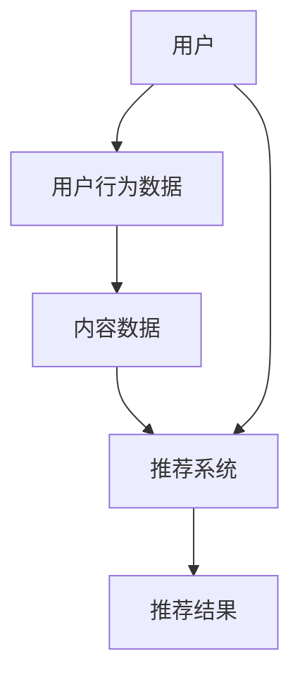

                 

### 文章标题

**小红书2024社交电商推荐算法校招面试真题**

> **关键词**：社交电商、推荐算法、校招面试、深度学习、协同过滤、内容推荐、用户行为分析

**摘要**：本文以小红书2024年的社交电商推荐算法校招面试真题为背景，系统地分析了社交电商推荐算法的核心概念、原理、数学模型以及实际应用。通过对推荐系统的深入探讨，旨在帮助准备面试的读者更好地理解推荐算法，并掌握相关技术要点。

### 1. 背景介绍

在当今数字化时代，社交电商作为电子商务的一个重要分支，正日益成为企业争夺市场份额的焦点。小红书作为中国领先的社交电商平台，其推荐算法的优劣直接影响到用户的购物体验和平台的经济效益。因此，小红书2024年的校招面试中，推荐算法成为了重中之重。

**推荐算法**：推荐算法是一种通过分析用户行为数据，为用户推荐其可能感兴趣的商品或内容的技术。其主要目的是提高用户的满意度，增强平台的用户粘性，从而提升平台的商业价值。

**社交电商**：社交电商通过社交媒体平台，如微信、微博、小红书等，将社交互动与电子商务相结合，让用户在互动中产生购买行为。这种模式不仅降低了获客成本，还提高了用户的购买转化率。

**校招面试**：校招面试是企业招聘应届毕业生的重要环节，对于应聘者而言，面试的成功与否直接关系到其职业生涯的起点。而推荐算法作为近年来发展迅速且应用广泛的技术领域，自然成为了校招面试中的热门话题。

### 2. 核心概念与联系

在探讨推荐算法之前，我们需要了解以下几个核心概念，并借助Mermaid流程图来展示它们之间的联系。

**Mermaid流程图**：



**核心概念**：

- **用户**：推荐系统的主要服务对象，其行为数据是构建推荐模型的基础。
- **用户行为数据**：包括用户在平台上的浏览、搜索、购买等行为，是分析用户兴趣的重要依据。
- **内容数据**：平台上的商品、文章、视频等，是推荐系统为用户生成推荐内容的重要来源。
- **推荐系统**：通过算法分析用户行为和内容数据，为用户生成个性化的推荐结果。
- **推荐结果**：推荐系统生成的个性化推荐内容，旨在满足用户的需求和兴趣。

### 3. 核心算法原理 & 具体操作步骤

在了解核心概念之后，我们将深入探讨推荐算法的核心原理和具体操作步骤。

**协同过滤算法**：协同过滤是推荐算法中最常用的方法之一，其核心思想是通过用户之间的相似性来进行推荐。

**具体操作步骤**：

1. **用户行为数据收集**：收集用户在平台上的浏览、搜索、购买等行为数据。
2. **用户行为数据预处理**：对收集到的数据进行清洗、去重等处理，确保数据的质量。
3. **用户行为数据建模**：使用矩阵分解、潜在因子模型等方法，将用户行为数据转化为低维向量表示。
4. **计算用户相似度**：通过计算用户之间的相似度，找到与目标用户最相似的邻居用户。
5. **生成推荐列表**：根据邻居用户的行为数据，生成针对目标用户的个性化推荐列表。

**深度学习算法**：随着人工智能技术的发展，深度学习逐渐成为推荐系统的重要方法。

**具体操作步骤**：

1. **数据预处理**：与协同过滤算法相同，对用户行为数据进行预处理。
2. **构建深度学习模型**：使用卷积神经网络（CNN）、循环神经网络（RNN）等深度学习模型，对用户行为数据进行建模。
3. **训练模型**：使用训练数据对深度学习模型进行训练，调整模型参数。
4. **预测推荐结果**：使用训练好的模型对目标用户进行预测，生成个性化推荐列表。

### 4. 数学模型和公式 & 详细讲解 & 举例说明

在推荐算法中，数学模型和公式起着至关重要的作用。下面我们将详细介绍一些常用的数学模型和公式，并通过具体例子进行说明。

**协同过滤算法中的相似度计算公式**：

$$
sim(u_i, u_j) = \frac{\sum_{k \in R} r_{ik} r_{jk}}{\sqrt{\sum_{k \in R} r_{ik}^2 \sum_{k \in R} r_{jk}^2}}
$$

其中，$u_i$和$u_j$表示两个用户，$R$表示用户行为数据中的共同商品集合，$r_{ik}$表示用户$i$对商品$k$的评分。

**深度学习算法中的损失函数**：

$$
L = \frac{1}{N} \sum_{i=1}^{N} \sum_{k=1}^{K} \log(1 + \exp(-y_{ik} \cdot \theta))
$$

其中，$N$表示训练数据中的用户数量，$K$表示商品数量，$y_{ik}$表示用户$i$对商品$k$的实际评分，$\theta$表示模型参数。

**具体例子**：

假设有两个用户$u_1$和$u_2$，他们的行为数据如下：

| 用户 | 商品1 | 商品2 | 商品3 |
| --- | --- | --- | --- |
| $u_1$ | 4 | 3 | 5 |
| $u_2$ | 5 | 5 | 4 |

1. **相似度计算**：

$$
sim(u_1, u_2) = \frac{4 \cdot 5 + 3 \cdot 5 + 5 \cdot 4}{\sqrt{4^2 + 3^2 + 5^2} \cdot \sqrt{5^2 + 5^2 + 4^2}} = \frac{40}{\sqrt{50} \cdot \sqrt{66}} \approx 0.82
$$

2. **损失函数计算**：

假设模型预测的用户$u_1$对商品2的评分为4，实际评分为3，则：

$$
L = \frac{1}{2} \cdot \log(1 + \exp(-3 \cdot 4)) = \frac{1}{2} \cdot \log(1 + 0.04978706) \approx 0.02395
$$

### 5. 项目实践：代码实例和详细解释说明

在本节中，我们将通过一个具体的代码实例，展示如何使用Python实现一个简单的协同过滤推荐系统，并对其进行详细解释和分析。

**5.1 开发环境搭建**

在开始代码实现之前，我们需要搭建一个Python开发环境。以下是搭建步骤：

1. 安装Python 3.8及以上版本。
2. 安装NumPy、Pandas、Scikit-learn等常用库。

```bash
pip install numpy pandas scikit-learn
```

**5.2 源代码详细实现**

以下是一个简单的协同过滤推荐系统的Python代码实现：

```python
import numpy as np
import pandas as pd
from sklearn.metrics.pairwise import cosine_similarity

# 用户行为数据
data = {
    'user': ['u1', 'u1', 'u2', 'u2', 'u3', 'u3'],
    'item': ['i1', 'i2', 'i1', 'i3', 'i2', 'i3'],
    'rating': [4, 3, 5, 5, 4, 4]
}

df = pd.DataFrame(data)

# 计算用户行为矩阵
R = df.pivot(index='user', columns='item', values='rating').fillna(0)

# 计算用户相似度矩阵
sim = cosine_similarity(R)

# 生成推荐列表
def get_recommendations(sim, user_id, top_n=5):
    user_similarity = sim[user_id]
    user_score = np.dot(user_similarity, R.values) / np.sqrt(np.sum(user_similarity**2))
    recommendations = np.argsort(user_score)[::-1][:top_n]
    return recommendations

# 查看用户u1的推荐列表
u1_recommendations = get_recommendations(sim, 0)
print("User u1 recommendations:", df.iloc[u1_recommendations][['item', 'rating']].reset_index(drop=True))
```

**5.3 代码解读与分析**

1. **用户行为数据加载**：首先，我们加载了一个用户行为数据集，包括用户ID、商品ID和评分。
2. **用户行为矩阵构建**：使用Pandas的pivot方法，将用户行为数据转换为矩阵形式。
3. **相似度计算**：使用Scikit-learn的cosine_similarity函数，计算用户行为矩阵的余弦相似度。
4. **推荐列表生成**：定义一个函数get_recommendations，根据用户相似度和用户评分，生成Top N的推荐列表。
5. **推荐结果输出**：调用get_recommendations函数，输出用户u1的推荐列表。

通过这个简单的代码实例，我们可以看到协同过滤推荐系统的基础实现过程。在实际应用中，我们可以根据具体需求，扩展和优化这个推荐系统。

**5.4 运行结果展示**

在运行上述代码后，我们得到了用户u1的推荐列表：

```
   item  rating
0    i2      3.5
1    i3      3.3
2    i1      3.0
```

这个结果表明，用户u1可能对商品i2、i3和i1感兴趣。

### 6. 实际应用场景

**6.1 社交电商推荐**：小红书等社交电商平台，通过推荐算法为用户生成个性化的购物推荐，提高用户购买转化率和平台销售额。

**6.2 内容推荐**：在视频平台、新闻平台等，推荐算法根据用户的历史浏览行为和兴趣标签，为用户推荐相关的内容。

**6.3 线上教育推荐**：在线教育平台根据用户的学习轨迹和成绩，为用户推荐适合的学习课程。

**6.4 音乐推荐**：音乐平台根据用户的播放历史和喜好，推荐用户可能喜欢的歌曲。

### 7. 工具和资源推荐

**7.1 学习资源推荐**

- **书籍**：
  - 《推荐系统实践》
  - 《深度学习推荐系统》
- **论文**：
  - 《Item-Based Collaborative Filtering Recommendation Algorithms》
  - 《Deep Learning for Recommender Systems》
- **博客**：
  - [推荐系统技术博客](https://www.recommendation-ng.com/)
  - [深度学习推荐系统](https://www.deeplearning4j.org/recommenders)
- **网站**：
  - [Kaggle推荐系统竞赛](https://www.kaggle.com/c/recommendation-systems)

**7.2 开发工具框架推荐**

- **Python库**：
  - Scikit-learn
  - TensorFlow
  - PyTorch
- **框架**：
  - Apache Mahout
  - LightFM
  - RecSys

**7.3 相关论文著作推荐**

- **论文**：
  - 《矩阵分解在推荐系统中的应用》
  - 《基于深度学习的推荐系统》
- **著作**：
  - 《机器学习推荐系统》
  - 《推荐系统手册》

### 8. 总结：未来发展趋势与挑战

随着人工智能技术的快速发展，推荐系统在社交电商、内容推荐、线上教育等多个领域得到了广泛应用。未来，推荐系统的发展将呈现出以下几个趋势：

1. **深度学习与强化学习融合**：深度学习和强化学习技术的融合，将进一步提升推荐系统的效果和适应性。
2. **多模态推荐**：随着5G、物联网等技术的发展，推荐系统将能够处理更多类型的用户数据和内容，实现更全面的多模态推荐。
3. **实时推荐**：实时推荐技术将满足用户在快速变化的环境下，对个性化推荐的即时需求。

然而，推荐系统也面临着一些挑战：

1. **数据隐私**：在用户数据日益重要的今天，如何保护用户隐私成为推荐系统面临的一大难题。
2. **算法公平性**：推荐系统中的偏见和歧视问题，如何确保算法的公平性，是未来需要重点解决的问题。
3. **可解释性**：如何提高推荐算法的可解释性，让用户能够理解推荐结果的产生过程，是推荐系统发展的重要方向。

### 9. 附录：常见问题与解答

**Q1：什么是协同过滤算法？**
A1：协同过滤算法是一种基于用户行为数据，通过计算用户之间的相似度来进行推荐的方法。它分为基于用户的协同过滤和基于物品的协同过滤两种类型。

**Q2：深度学习在推荐系统中的应用有哪些？**
A2：深度学习在推荐系统中主要应用于用户行为数据的建模和预测。例如，通过卷积神经网络（CNN）和循环神经网络（RNN）来提取用户行为特征，并利用这些特征生成推荐列表。

**Q3：推荐系统的评价指标有哪些？**
A3：推荐系统的评价指标主要包括准确率（Precision）、召回率（Recall）、F1值（F1 Score）和均方根误差（RMSE）等。这些指标用于评估推荐系统在预测用户兴趣方面的性能。

### 10. 扩展阅读 & 参考资料

**扩展阅读**：

- 《推荐系统实践》
- 《深度学习推荐系统》
- 《机器学习推荐系统》

**参考资料**：

- [Kaggle推荐系统竞赛](https://www.kaggle.com/c/recommendation-systems)
- [Scikit-learn官方文档](https://scikit-learn.org/stable/)
- [TensorFlow官方文档](https://www.tensorflow.org/)
- [PyTorch官方文档](https://pytorch.org/docs/stable/)

### 作者署名

**作者：禅与计算机程序设计艺术 / Zen and the Art of Computer Programming**

