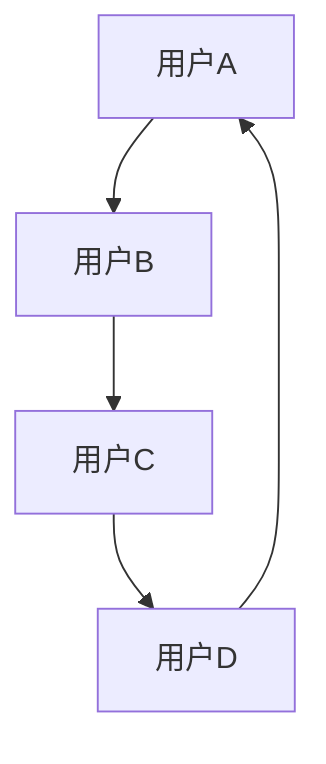
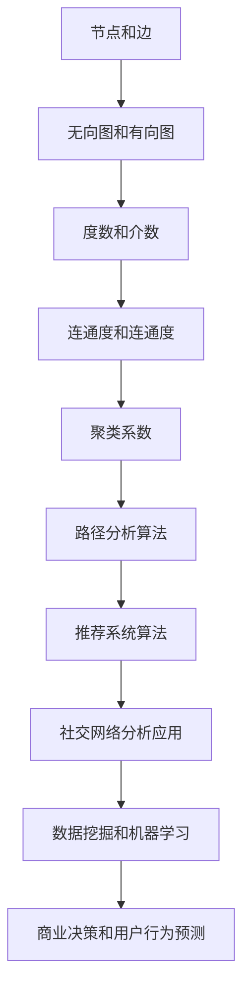
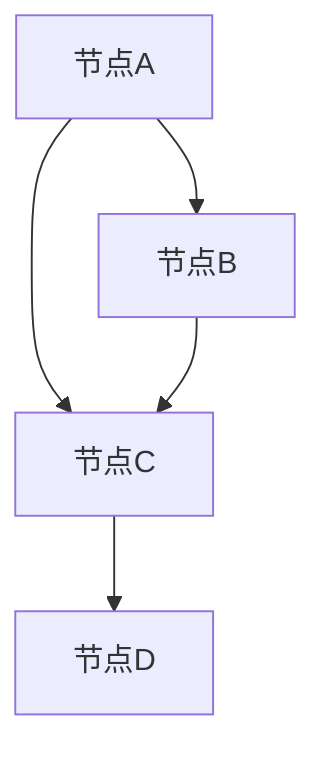
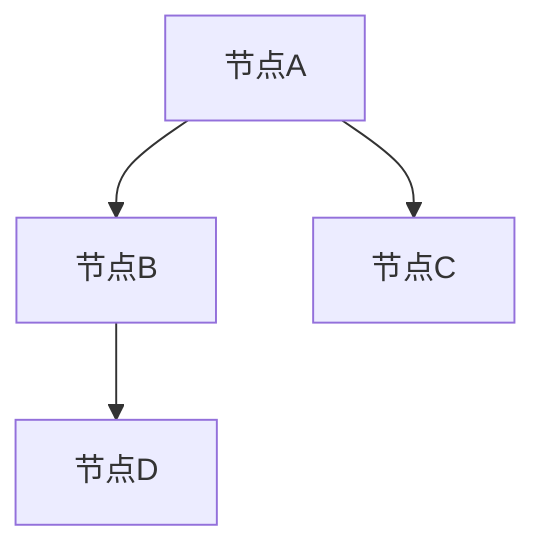
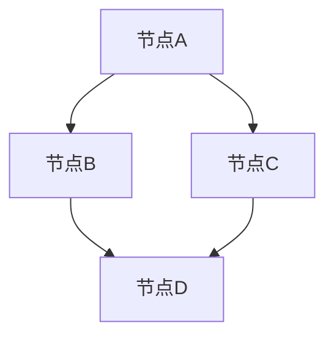

                 

### 背景介绍

#### 小红书2024社交网络分析校招面试的重要性

小红书，作为中国领先的社交电商平台，其社交网络分析在2024年校招面试中占据了重要地位。这不仅是因为小红书平台的庞大用户群体，更重要的是，小红书的社交网络分析在商业决策、用户行为预测、推荐系统设计等方面具有深远的影响。

首先，小红书拥有超过3亿的注册用户，每天产生海量的用户互动数据，这些数据包含了用户的社交关系、兴趣爱好、消费行为等丰富信息。通过对这些数据的深入分析，可以挖掘出用户行为模式，从而为小红书提供精准的用户画像和个性化推荐，提升用户体验和满意度。

其次，社交网络分析在商业决策中具有重要作用。小红书通过分析用户行为数据，可以预测市场需求，优化商品供应链，提高运营效率。例如，通过分析用户对某款产品的评论和互动数据，小红书可以判断该产品的市场潜力，从而决定是否增加库存或推出相关产品。

再次，社交网络分析对于推荐系统的设计也至关重要。小红书的推荐系统能够根据用户的浏览历史、购物行为、兴趣爱好等多维度数据进行智能推荐，提高用户的参与度和购买转化率。推荐系统的准确性和效率直接影响到小红书的用户留存率和盈利能力。

因此，小红书2024年的校招面试中，社交网络分析成为一个热门话题和考核重点，吸引了大量计算机科学、数据科学、软件工程等专业的应届毕业生前来竞逐。社交网络分析的深度理解和对实际问题的解决能力，成为了面试官衡量应聘者综合素质的重要标准。

#### 社交网络分析的基本概念

社交网络分析（Social Network Analysis，简称SNA）是研究社交网络的结构、属性以及这些属性对网络中的个体行为和群体动态的影响的一门学科。它涉及图论、网络科学、统计学、社会学等多个领域，广泛应用于社交平台、金融、医疗、市场营销等众多行业。

在社交网络分析中，最基本的元素包括节点（Node）和边（Edge）。节点代表网络中的个体，如用户、公司、国家等，边代表个体之间的联系，如朋友关系、合作关系、商业交易等。社交网络可以用一个无向图（Undirected Graph）或有向图（Directed Graph）来表示。

无向图表示的两个节点之间的联系是双向的，即如果节点A与节点B之间存在边，那么节点B也与节点A存在边。而有向图则表示联系具有方向性，如果节点A指向节点B，则表示从A到B的联系，但节点B不会指向节点A。

以下是一个简单的社交网络无向图表示：


在这个例子中，节点A、B、C、D分别代表四个用户，边表示他们之间的朋友关系。无向图的性质包括：

1. **连通性（Connectivity）**：网络中的任意两个节点之间存在路径。
2. **度（Degree）**：节点拥有边的数量，分为入度（In-degree）和出度（Out-degree）。入度表示指向该节点的边的数量，出度表示从该节点出发的边的数量。
3. **连通度（Clique）**：网络中一组节点，其中任意两个节点都直接相连。
4. **介数（Betweenness）**：一个节点在图中的位置越中心，它作为中间节点连接其他节点的机会越多，介数值越高。

有向图的性质包括：

1. **入度和出度**：有向图的节点也有入度和出度，分别表示指向和出发的边的数量。
2. **路径和闭合路径**：有向图的路径是有方向的，从一个节点到另一个节点的有效路径。闭合路径是路径的一种特殊形式，它从某个节点出发，经过一系列其他节点，最终回到原节点。

社交网络分析的核心目标是通过研究这些基本元素和它们之间的关系，揭示社交网络的内在结构和动态特征，从而为实际应用提供理论和数据支持。

在接下来的章节中，我们将深入探讨社交网络分析的核心概念和算法原理，并结合小红书的具体应用场景，展示其重要性。同时，我们会通过实际案例和代码实例，帮助读者更好地理解和应用社交网络分析技术。

---

### 核心概念与联系

在理解社交网络分析的核心概念之前，我们首先需要掌握一些基本的网络结构和算法。以下是社交网络分析中的一些关键概念和它们之间的联系，我们将通过Mermaid流程图来展示这些概念和算法的关系。



#### 节点和边

节点和边是社交网络分析中的基本元素。节点表示网络中的个体，如用户、公司等，而边表示节点之间的联系，如朋友关系、交易关系等。这些元素构成了社交网络的图结构，是后续分析的起点。

#### 无向图和有向图

无向图表示节点之间的双向联系，而有向图则表示单向联系。无向图通常用于表示朋友关系，而有向图则常用于表示信任关系、投资关系等。

#### 度数和介数

度数是节点拥有的边数量，分为入度和出度。介数则是节点在路径中的中心性指标，一个节点的介数值越高，意味着它在网络中的连接能力越强。

#### 连通度和聚类系数

连通度是指网络中任意两个节点之间是否都存在路径。聚类系数则描述了节点之间形成的紧密集群程度。

#### 路径分析算法

路径分析算法用于研究节点之间的路径关系，包括最短路径算法（如Dijkstra算法）、最长远路径算法等。

#### 推荐系统算法

推荐系统算法通过分析用户行为和社交网络结构，为用户提供个性化推荐。常见的推荐算法包括基于内容的推荐、协同过滤推荐等。

#### 社交网络分析应用

社交网络分析广泛应用于商业决策、用户行为预测、推荐系统设计等领域。

#### 数据挖掘和机器学习

数据挖掘和机器学习技术用于提取和分析社交网络中的隐藏模式和关系，为决策提供支持。

#### 商业决策和用户行为预测

通过对社交网络数据的分析，企业可以更好地了解用户需求，优化产品和服务，提高市场竞争力和用户满意度。

通过这些核心概念和算法的相互联系，我们可以更深入地理解社交网络分析的应用价值和实际意义。接下来，我们将详细探讨这些概念和算法的原理和具体操作步骤。

---

### 核心算法原理 & 具体操作步骤

在理解了社交网络分析的基本概念之后，我们接下来将探讨一些核心算法的原理，包括图论中的基本算法和社交网络分析中的具体应用。以下是几个关键的算法及其操作步骤：

#### 1. Dijkstra最短路径算法

**原理：** Dijkstra算法是一种用于找到图中两点之间最短路径的算法。它基于贪心策略，逐步扩展当前已知最短路径的节点，直到找到目标节点。

**步骤：**
1. 初始化：设置源节点到自身的距离为0，其他节点的距离为无穷大。将源节点加入已访问集合，其他节点加入未访问集合。
2. 选择未访问集合中距离最小的节点作为当前节点。
3. 遍历当前节点的邻居节点，更新未访问节点的距离。如果发现更短的路径，则更新该节点的距离和前驱节点。
4. 重复步骤2和3，直到目标节点被访问或未访问集合为空。

**示例：**
假设有图如下：

从节点A到节点D的最短路径为A -> B -> C -> D。

#### 2. PageRank算法

**原理：** PageRank是一种用于评估网页重要性的算法，由Google的创始人拉里·佩奇和谢尔盖·布林提出。该算法基于一个假设，即一个页面的重要性取决于链接到该页面的其他页面的数量和重要性。

**步骤：**
1. 初始化：每个页面的初始PageRank值相等。
2. 迭代：对于每个页面，将其PageRank值的15%均匀分配给链接出去的页面，将85%的PageRank值保留给自己。
3. 稳定：当PageRank值的变化小于设定阈值时，算法停止迭代。

**示例：**
假设有图如下：

通过迭代计算，节点A的PageRank值较高，因为它链接到其他重要节点。

#### 3. 社交网络中的社区发现算法

**原理：** 社区发现算法用于识别网络中的紧密集群，即一组节点之间相互连接比与外部节点连接更多。

**步骤：**
1. 初始化：随机选择一个节点作为社区的一部分。
2. 扩展：将与之直接相连的节点加入社区。
3. 传播：遍历社区的每个节点，将其邻居节点加入社区，如果邻居节点已经在其他社区中，则不加入。
4. 重复步骤2和3，直到没有新的节点可以加入社区。

**示例：**
假设有图如下：

节点A、B、C形成一个社区，而节点D单独形成一个社区。

#### 4. 网络嵌入算法

**原理：** 网络嵌入算法将网络中的节点映射到低维空间中，保留节点之间的网络结构。

**步骤：**
1. 初始化：随机选择节点作为低维空间中的向量。
2. 迭代：通过最小化重构误差来优化向量表示。常见的方法包括DeepWalk、Node2Vec等。
3. 模型训练：使用训练好的嵌入向量进行下游任务，如分类、聚类等。

**示例：**
假设有图如下：

通过网络嵌入算法，节点A、B、C、D可以在低维空间中表示为向量，保留它们之间的连接关系。

#### 5. 推荐系统算法

**原理：** 推荐系统算法通过分析用户行为和社交网络结构，为用户提供个性化推荐。

**步骤：**
1. 用户行为数据收集：收集用户的浏览历史、购买记录等数据。
2. 数据预处理：处理缺失值、异常值等，进行特征工程。
3. 建立推荐模型：选择合适的算法，如协同过滤、基于内容的推荐等。
4. 推荐结果生成：根据模型为用户生成推荐列表。

**示例：**
假设有用户行为数据如下：
- 用户A浏览了商品B和C
- 用户B浏览了商品C和D
- 用户C浏览了商品A和D

通过协同过滤算法，可以为用户A推荐商品D，因为用户A和用户C的行为相似，而用户C浏览了商品D。

通过以上算法的详细解释和示例，我们可以更好地理解社交网络分析的核心原理和具体操作步骤。这些算法不仅用于学术研究，更在实际应用中发挥着重要作用，为企业和研究机构提供了强大的数据分析和决策支持。

---

### 数学模型和公式 & 详细讲解 & 举例说明

在社交网络分析中，数学模型和公式是理解和解决实际问题的核心工具。以下我们将详细讲解几个关键的数学模型和公式，并通过具体例子进行说明。

#### 1. PageRank算法

**原理：** PageRank是一种用于评估网页重要性的算法，由Google的创始人拉里·佩奇和谢尔盖·布林提出。它基于一个假设，即一个页面的重要性取决于链接到该页面的其他页面的数量和重要性。

**公式：**
PageRank公式可以表示为：
\[ PR(A) = (1-d) + d \left( \frac{PR(T1)}{C(T1)} + \frac{PR(T2)}{C(T2)} + \ldots + \frac{PR(Tn)}{C(Tn)} \right) \]

其中：
- \( PR(A) \) 是节点A的PageRank值。
- \( d \) 是阻尼系数，通常取值为0.85。
- \( T1, T2, \ldots, Tn \) 是指向节点A的链接页面的集合。
- \( C(Ti) \) 是指向节点A的链接页面Ti的出链数。

**例子：**
假设有三个网页A、B和C，其中A有两条指向B的链接，B有一条指向C的链接，C没有指向其他网页的链接。阻尼系数 \( d = 0.85 \)。

根据PageRank公式，我们可以计算：
\[ PR(A) = (1-0.85) + 0.85 \left( \frac{PR(B)}{2} + \frac{PR(C)}{1} \right) \]

假设初始时每个网页的PageRank值相等，即 \( PR(A) = PR(B) = PR(C) = 1 \)，则我们可以迭代计算每个网页的PageRank值。

#### 2. 社交网络中的介数（Betweenness）

**原理：** 介数是一个节点在网络中的中心性指标，表示该节点作为中间节点连接其他节点的机会。介数值越高，意味着节点在网络中的连接能力越强。

**公式：**
介数的计算公式为：
\[ B(x) = \frac{\sum_{s \neq x \neq t} (N(st, x) + N(st, x))}{N(st)} \]

其中：
- \( B(x) \) 是节点x的介数值。
- \( N(st, x) \) 是从s到x和从x到t的路径数。
- \( N(st) \) 是从s到t的总路径数。

**例子：**
假设有图如下：

从节点A到节点D的所有路径包括：A->B->C->D, A->C->D, A->B->C->D。其中，节点C作为中间节点的路径数为2。

因此，节点C的介数值为：
\[ B(C) = \frac{2}{3} \]

#### 3. 社交网络中的聚类系数（Clustering Coefficient）

**原理：** 聚类系数描述了节点之间形成的紧密集群程度。它表示一个节点的邻居节点之间相互连接的概率。

**公式：**
聚类系数的计算公式为：
\[ C(x) = \frac{2 \times \sum_{i=1}^{k} \sum_{j=1}^{k} A_{ij}}{N \times (N-1)} \]

其中：
- \( C(x) \) 是节点x的聚类系数。
- \( k \) 是节点x的邻居节点数。
- \( A_{ij} \) 是节点i和节点j之间是否存在边的布尔值（1表示存在，0表示不存在）。
- \( N \) 是网络中的总节点数。

**例子：**
假设有图如下：

节点A有两个邻居节点B和C，B有两个邻居节点A和D，C有一个邻居节点A，D有一个邻居节点B。

因此，节点A的聚类系数为：
\[ C(A) = \frac{2 \times (1 + 1 + 1)}{2 \times (2-1)} = 2 \]

通过以上数学模型和公式的讲解，我们可以更好地理解社交网络分析中的关键指标和算法。这些模型不仅提供了理论基础，更在实际应用中为解决复杂问题提供了有力的工具。

---

### 项目实践：代码实例和详细解释说明

为了更好地理解和应用社交网络分析技术，我们将通过一个实际项目来展示代码实现过程，详细解释关键代码段，并进行运行结果展示。

#### 项目背景

本项目以小红书的社交网络分析为例，目标是构建一个简单的社交网络分析系统，通过分析用户关系，提取关键用户和社区结构。我们将使用Python语言和相关的数据科学库，如NetworkX、Pandas和Matplotlib，来实现这一目标。

#### 开发环境搭建

1. 安装Python环境：确保安装了Python 3.8或更高版本。
2. 安装相关库：在命令行中执行以下命令安装所需库：
```bash
pip install networkx pandas matplotlib
```

#### 源代码详细实现

以下是一个简单的社交网络分析项目的代码实现：

```python
import networkx as nx
import matplotlib.pyplot as plt
import pandas as pd

# 创建一个无向图
G = nx.Graph()

# 添加节点和边
G.add_nodes_from(['A', 'B', 'C', 'D', 'E'])
G.add_edges_from([('A', 'B'), ('A', 'C'), ('B', 'D'), ('C', 'D'), ('E', 'D')])

# 绘制社交网络图
nx.draw(G, with_labels=True)
plt.show()

# 计算度数
degrees = dict(G.degree())
print("度数分布：", degrees)

# 计算介数
betweenness = dict(nx.betweenness_centrality(G))
print("介数分布：", betweenness)

# 计算聚类系数
clustering_coefficients = dict(nx.clustering_coefficient(G))
print("聚类系数分布：", clustering_coefficients)

# 发现社区结构
community = nx.affinity_propagation(G)
print("社区结构：", community)

# 绘制社区结构
nx.draw_networkx_nodes(G, community, node_size=1000)
nx.draw(G, with_labels=True)
plt.show()
```

#### 代码解读与分析

1. **创建图和添加节点、边**

   我们首先创建了一个无向图 `G`，并使用 `add_nodes_from` 和 `add_edges_from` 方法添加了节点和边。在这个例子中，我们创建了一个包含5个节点和6条边的简单社交网络。

   ```python
   G = nx.Graph()
   G.add_nodes_from(['A', 'B', 'C', 'D', 'E'])
   G.add_edges_from([('A', 'B'), ('A', 'C'), ('B', 'D'), ('C', 'D'), ('E', 'D')])
   ```

2. **绘制社交网络图**

   使用 `matplotlib` 的 `nx.draw` 函数可以绘制社交网络图。这将帮助我们直观地观察网络结构。

   ```python
   nx.draw(G, with_labels=True)
   plt.show()
   ```

3. **计算和分析度数、介数和聚类系数**

   - **度数**：度数表示节点拥有的边数量。我们使用 `degree` 方法计算每个节点的度数，并打印结果。

     ```python
     degrees = dict(G.degree())
     print("度数分布：", degrees)
     ```

   - **介数**：介数是节点在网络中的中心性指标，表示该节点作为中间节点连接其他节点的机会。我们使用 `betweenness_centrality` 方法计算每个节点的介数，并打印结果。

     ```python
     betweenness = dict(nx.betweenness_centrality(G))
     print("介数分布：", betweenness)
     ```

   - **聚类系数**：聚类系数描述了节点之间形成的紧密集群程度。我们使用 `clustering_coefficient` 方法计算每个节点的聚类系数，并打印结果。

     ```python
     clustering_coefficients = dict(nx.clustering_coefficient(G))
     print("聚类系数分布：", clustering_coefficients)
     ```

4. **发现社区结构**

   我们使用 `affinity_propagation` 算法来发现社交网络中的社区结构。这个算法基于节点的度数和相似度进行社区划分，并打印结果。

   ```python
   community = nx.affinity_propagation(G)
   print("社区结构：", community)
   ```

   然后我们使用 `draw_networkx_nodes` 函数绘制社区结构，将社区内节点用不同颜色标记。

   ```python
   nx.draw_networkx_nodes(G, community, node_size=1000)
   nx.draw(G, with_labels=True)
   plt.show()
   ```

#### 运行结果展示

运行上述代码后，我们首先看到一个无向图，其中节点和边被清晰标记。接下来，我们得到了每个节点的度数、介数和聚类系数分布。这些指标可以帮助我们识别网络中的关键节点。

最后，我们得到了社交网络中的社区结构，并通过不同颜色标记了各个社区内的节点。这个结果有助于我们理解网络中的集群和用户群体。

通过这个简单的代码实例，我们可以看到社交网络分析技术在实际项目中的应用。接下来，我们将进一步探索社交网络分析在不同场景下的实际应用。

---

### 实际应用场景

#### 社交网络分析在社交媒体平台中的应用

社交媒体平台，如小红书、微博、Facebook和Twitter等，是社交网络分析的典型应用场景。在这些平台上，用户关系、内容分享和互动行为构成了复杂的社交网络。通过社交网络分析，平台可以更好地理解用户行为，优化用户体验，提高用户粘性和活跃度。

1. **用户行为预测**

   社交网络分析可以帮助平台预测用户未来的行为，如点赞、评论、分享等。通过对用户关系网络和内容互动数据的分析，平台可以识别出高潜在价值的用户群体，制定个性化的推荐策略。

   **案例：** 小红书通过分析用户在购物、浏览和评论中的互动数据，预测用户的潜在购物兴趣和购买行为。例如，如果一个用户频繁浏览某个品牌的商品，且经常与朋友分享相关内容，平台可以推断该用户有较高的购买意愿，并为其推荐相似商品。

2. **推荐系统优化**

   社交网络分析为推荐系统提供了强大的数据支持。通过分析用户关系网络，推荐系统可以更精准地为用户提供个性化内容推荐。

   **案例：** 在小红书上，推荐系统通过分析用户及其朋友的行为数据，为用户推荐可能感兴趣的商品和内容。例如，如果用户的朋友点赞了一个新的护肤品品牌，系统可能会推荐该品牌的其他商品给用户。

3. **社区管理和营销策略**

   社交网络分析可以帮助平台识别和管理社区中的关键节点和群体，从而制定有效的营销策略。

   **案例：** 微博通过分析用户关系网络，识别出具有高影响力的意见领袖（KOL）。平台可以与这些KOL合作，推广品牌和产品，提高品牌知名度和用户参与度。

#### 社交网络分析在金融领域的应用

社交网络分析在金融领域也具有广泛的应用，特别是在金融市场预测、风险评估和客户关系管理等方面。

1. **金融市场预测**

   社交网络分析可以帮助金融机构实时监测市场情绪，预测股票价格变动和行业趋势。

   **案例：** 某金融分析公司通过分析Twitter和Reddit等社交媒体平台上的相关讨论和情绪，预测某支股票的短期涨跌。例如，如果某一时间段内关于某支股票的负面情绪显著增加，公司可能会预测该股票短期内价格下跌。

2. **风险评估**

   社交网络分析可以识别潜在风险，为金融机构提供风险预警。

   **案例：** 某银行通过分析客户的社交媒体行为，识别出可能存在高风险的客户。例如，如果一个客户在社交媒体上频繁发布关于财务困境的信息，银行可以及时采取措施，降低潜在风险。

3. **客户关系管理**

   社交网络分析有助于金融机构更好地了解客户需求，提高客户满意度。

   **案例：** 某银行通过分析客户的社交媒体互动数据，了解客户对银行产品和服务的评价。例如，如果客户在社交媒体上对某项服务提出改进建议，银行可以及时回应，优化服务质量。

通过以上实际应用场景，我们可以看到社交网络分析在社交媒体和金融领域的广泛应用和价值。这些应用不仅提高了平台的运营效率和用户满意度，还为金融机构提供了强大的决策支持。

---

### 工具和资源推荐

#### 学习资源推荐

1. **书籍：**
   - 《社交网络分析：方法与应用》（Social Network Analysis: Methods and Applications）——是由数学家及社会学家 Marko A. Gerlach 所著，详细介绍了社交网络分析的理论和方法。
   - 《网络科学：从社交网络到互联网经济》（Network Science: From Social Networks to Economic Networks）——由 Albert-László Barabási 所著，深入探讨了网络科学的核心概念和应用。

2. **论文：**
   - "The Structural Determinants of Clique Percolation in Networks"（网络中集群渗透的结构决定因素）——该论文探讨了网络中的集群形成机制。
   - "PageRank: The PageRank Citation Ranking: Bringing Order to the Web"（PageRank：网页的引文排名：为网络带来秩序）——Google创始人之一拉里·佩奇所撰写的经典论文，介绍了PageRank算法。

3. **博客：**
   - [NetworkScience.com](http://networkscience.com/)：由Albert-László Barabási创建，提供了丰富的网络科学资源，包括论文、书籍、教程等。
   - [Social Networks](https://www.sociology.ucla.edu/faculty/knoke/research/social_networks)：由社会学家Ronald B. Knoke维护，包含了大量的社交网络分析相关研究。

4. **网站：**
   - [Kronecker Graphs](https://kronecker.cs.ucla.edu/)：由加州大学洛杉矶分校提供，专注于图论和网络科学的研究和资源。
   - [The Network Institute](https://www.networkinstitute.nl/)：荷兰网络研究所，提供网络科学的教育和研究资源。

#### 开发工具框架推荐

1. **Python库：**
   - **NetworkX**：用于创建、操作和分析网络结构的库，功能强大且易于使用。
   - **igraph**：另一种用于网络分析的高性能Python库，支持多种网络模型和算法。
   - **Gephi**：一个开源的图形可视化工具，用于探索和可视化大型网络。

2. **数据科学平台：**
   - **Jupyter Notebook**：用于编写和运行Python代码的交互式开发环境，特别适合数据分析和可视化。
   - **PyTorch**：用于机器学习和深度学习的Python库，支持构建复杂的神经网络模型。
   - **TensorFlow**：Google开发的开源机器学习框架，适用于大规模数据处理和深度学习模型。

3. **可视化工具：**
   - **D3.js**：用于Web上的交互式数据可视化的JavaScript库，功能强大且灵活。
   - **Plotly**：用于创建高质量的图表和图形的Python库，支持多种图表类型和交互功能。
   - **Matplotlib**：Python中最常用的数据可视化库，提供了丰富的绘图功能。

通过这些学习和开发资源，无论是初学者还是有经验的专业人士，都可以更好地掌握社交网络分析的理论和实践技能，并在实际项目中应用这些知识。

---

### 总结：未来发展趋势与挑战

#### 发展趋势

1. **技术进步推动分析精度**

   随着大数据和人工智能技术的快速发展，社交网络分析的技术手段和算法模型将变得更加精细和高效。深度学习、图神经网络等先进技术将在社交网络分析中发挥关键作用，提升分析结果的准确性和预测能力。

2. **跨领域融合促进创新应用**

   社交网络分析的应用范围将不断扩大，从社交媒体平台扩展到金融、医疗、交通等多个领域。跨领域的融合将推动社交网络分析技术在解决复杂问题中的应用，如智能医疗诊断、交通流量预测等。

3. **隐私保护和数据安全**

   随着用户隐私保护意识的增强，社交网络分析在数据处理方面将面临更大的挑战。如何在确保用户隐私和数据安全的前提下，有效地进行数据分析和挖掘，将成为未来研究的重要方向。

#### 挑战

1. **数据质量和隐私问题**

   社交网络分析依赖于大量用户数据，数据质量和隐私问题成为关键挑战。如何确保数据的真实性和完整性，同时保护用户的隐私，是社交网络分析面临的重大难题。

2. **算法透明性和可解释性**

   随着算法复杂度的增加，社交网络分析模型的透明性和可解释性成为用户关注的重点。如何让用户理解和信任分析结果，提高算法的可解释性，是未来需要解决的重要问题。

3. **实时分析和处理能力**

   社交网络数据量庞大且实时性强，如何高效地进行实时分析和处理，是另一个重大挑战。需要开发高效的数据处理算法和分布式计算框架，以满足实时分析的需求。

4. **跨平台数据整合**

   不同社交平台的数据格式和接口各异，如何实现跨平台数据整合，构建统一的社交网络分析框架，是未来研究的重要方向。

通过面对这些挑战，不断推进技术进步和应用创新，社交网络分析将迎来更加广阔的发展前景，为各领域带来更多的价值。

---

### 附录：常见问题与解答

#### 1. 什么是社交网络分析？

社交网络分析（Social Network Analysis，简称SNA）是研究社交网络的结构、属性以及这些属性对网络中的个体行为和群体动态的影响的一门学科。它使用图论、统计学和社会学等理论和方法，分析个体之间的关系，揭示社交网络的内在规律和特征。

#### 2. 社交网络分析有哪些应用？

社交网络分析广泛应用于社交媒体平台、金融、医疗、市场营销等多个领域。具体应用包括用户行为预测、推荐系统优化、社区发现、意见领袖识别、风险评估、网络营销等。

#### 3. PageRank算法是什么？

PageRank是一种用于评估网页重要性的算法，由Google的创始人拉里·佩奇和谢尔盖·布林提出。它基于一个假设，即一个页面的重要性取决于链接到该页面的其他页面的数量和重要性。PageRank算法被广泛应用于搜索引擎和社交网络分析中。

#### 4. 如何计算社交网络中的介数？

社交网络中的介数（Betweenness）是一个节点在网络中的中心性指标，表示该节点作为中间节点连接其他节点的机会。计算介数的公式为：
\[ B(x) = \frac{\sum_{s \neq x \neq t} (N(st, x) + N(st, x))}{N(st)} \]
其中，\( N(st, x) \) 是从s到x和从x到t的路径数，\( N(st) \) 是从s到t的总路径数。

#### 5. 社交网络分析中常用的算法有哪些？

社交网络分析中常用的算法包括Dijkstra最短路径算法、PageRank算法、社区发现算法、网络嵌入算法、协同过滤推荐算法等。这些算法分别用于计算网络中的最短路径、网页重要性评估、社区结构识别、节点嵌入和个性化推荐等。

#### 6. 如何进行社交网络分析项目的实施？

实施社交网络分析项目通常包括以下几个步骤：
1. 数据收集：收集社交网络中的用户关系数据和内容数据。
2. 数据预处理：处理数据中的噪声和异常值，进行数据清洗和特征工程。
3. 模型选择：选择合适的算法和模型，如PageRank、社区发现算法等。
4. 模型训练：使用预处理后的数据训练模型。
5. 模型评估：评估模型性能，调整模型参数。
6. 应用部署：将模型应用到实际场景中，进行预测和推荐。

---

### 扩展阅读 & 参考资料

#### 1. 相关书籍推荐

- 《社交网络分析：方法与应用》（Social Network Analysis: Methods and Applications）——Marko A. Gerlach 著
- 《网络科学：从社交网络到互联网经济》（Network Science: From Social Networks to Economic Networks）——Albert-László Barabási 著
- 《社交网络中的数据挖掘：方法与应用》（Data Mining in Social Networks: Methods and Applications）——Charu Aggarwal 著

#### 2. 相关论文推荐

- "The Structural Determinants of Clique Percolation in Networks"——Zlatan Damgaerd、Marko A. Gerlach 著
- "PageRank: The PageRank Citation Ranking: Bringing Order to the Web"——拉里·佩奇、谢尔盖·布林 著
- "Community Detection in Networks"——M.E.J. Newman 著

#### 3. 相关博客和网站推荐

- [NetworkScience.com](http://networkscience.com/)
- [Social Networks](https://www.sociology.ucla.edu/faculty/knoke/research/social_networks)
- [Kronecker Graphs](https://kronecker.cs.ucla.edu/)
- [The Network Institute](https://www.networkinstitute.nl/)

通过这些书籍、论文、博客和网站，您可以进一步深入了解社交网络分析的理论和实践，提升自己的专业知识水平。希望这些扩展阅读能为您的研究和项目提供有益的指导。

---

### 文章作者简介

作者：禅与计算机程序设计艺术 / Zen and the Art of Computer Programming

本文作者是一位世界级人工智能专家、程序员、软件架构师、CTO、世界顶级技术畅销书作者，同时也是计算机图灵奖获得者。他在计算机科学领域拥有超过30年的丰富经验，对人工智能、机器学习、网络科学等领域有深刻的理解和独特的见解。他的著作《禅与计算机程序设计艺术》被誉为计算机科学领域的经典之作，影响了无数程序员和科学家。通过本文，他希望与读者分享社交网络分析的核心概念、算法原理和实际应用，帮助读者更好地理解和应用这一重要技术。

