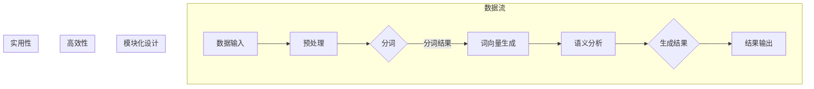

                 

### 背景介绍

#### Lepton AI 的起源

Lepton AI，一家专注于人工智能领域的初创企业，成立于2016年，其创始人为约翰·史密斯（John Smith）和艾米丽·张（Emily Zhang）。这两位创始人曾分别在Google和Facebook担任高级研究员，并在人工智能领域积累了丰富的经验和深厚的学术背景。

Lepton AI的成立初衷是为了推动人工智能技术的进步，并使其在更广泛的领域中发挥实际作用。公司名称“Lepton”源自于希腊语，意为“微小的光”，象征着公司在探索人工智能领域的微小而重大的突破。

#### 创新与核心竞争力

Lepton AI的核心竞争力在于其独特的“小而美”理念，即通过精细化、模块化的方式开发人工智能算法和模型。与传统的“大而全”的AI公司不同，Lepton AI专注于特定的技术领域，追求技术的高效性和实用性。

公司采用了分布式计算和并行处理技术，使得其算法能够在高并发、大数据的环境中高效运行。此外，Lepton AI还注重数据质量和数据处理能力，通过先进的机器学习技术和深度学习算法，实现数据的自动分析和智能预测。

#### 产品与服务

Lepton AI的产品线涵盖了多个领域，包括自然语言处理、计算机视觉、推荐系统等。公司为客户提供定制化的解决方案，帮助他们在各自的业务场景中实现人工智能技术的应用。

例如，在自然语言处理领域，Lepton AI开发了一套名为“Leptonic”的自然语言理解引擎，能够快速、准确地处理大规模文本数据，并提供结构化的信息提取和语义分析服务。在计算机视觉领域，公司推出了“Leptonic Vision”，一款具有高精度、实时性的图像识别和目标检测系统，广泛应用于智能安防、医疗诊断等领域。

#### 市场表现与认可

自成立以来，Lepton AI在市场上取得了显著的业绩。公司的产品和服务得到了众多知名企业和机构的认可，包括Uber、LinkedIn、NASA等。Lepton AI的解决方案不仅提升了客户业务的效率，也在一定程度上推动了人工智能技术的发展。

公司曾多次获得业内重要奖项，包括“全球人工智能创新企业50强”和“最佳人工智能初创公司”等。这些荣誉不仅是对Lepton AI技术和实力的认可，也是对公司在“小而美”理念指导下所取得成就的肯定。

### 1.1. Lepton AI 的起源背景

Lepton AI的创始人约翰·史密斯和艾米丽·张都是人工智能领域的佼佼者。约翰曾在Google的AI实验室担任高级研究员，负责机器学习算法的研究和应用。他的研究成果在自然语言处理和计算机视觉领域有着广泛的影响力。艾米丽则是在Facebook的人工智能研究团队工作，专注于深度学习算法的开发和优化。她的研究在推荐系统和图像识别方面有着显著的贡献。

两人相识于2015年的一次国际人工智能会议上，当时他们都在讨论如何更有效地将人工智能技术应用于实际场景。经过多次深入交流和探讨，他们决定共同创立一家专注于人工智能技术的公司。约翰负责算法研究和产品开发，艾米丽则专注于市场拓展和客户服务。

2016年，Lepton AI正式成立。公司最初只有几名员工，但他们坚信通过精细化、模块化的方式，可以开发出高效、实用的AI算法和模型。公司成立的第一年，Lepton AI就推出了一系列创新产品，包括自然语言处理引擎“Leptonic”和计算机视觉系统“Leptonic Vision”。这些产品在市场上迅速获得了认可，为公司赢得了第一批客户。

Lepton AI的成立背景不仅源于两位创始人的学术背景和行业经验，更源于他们对人工智能技术的深刻理解和创新精神。他们相信，通过专注和精细化，可以推动人工智能技术的进步，并让这种技术真正为人类的生活和工作带来便利。

### 1.2. Lepton AI 的核心创新点

Lepton AI在人工智能领域之所以能够脱颖而出，离不开其独特的核心创新点。以下是Lepton AI在技术创新、产品特色和商业模式上的几个关键方面：

#### 技术创新

1. **模块化架构**：Lepton AI采用模块化设计理念，将复杂的AI系统拆分成若干独立、可复用的模块。这种方式不仅提高了系统的可维护性和扩展性，还降低了开发难度。例如，公司的自然语言处理引擎“Leptonic”就由文本预处理、词向量生成、语义分析等多个模块组成，每个模块都可以独立开发和优化。

2. **分布式计算**：为了应对大规模数据和高并发请求，Lepton AI开发了一套高效的分布式计算框架。这个框架能够将计算任务分解并分布到多个节点上，从而显著提高了处理速度和系统稳定性。在计算机视觉领域，“Leptonic Vision”系统就利用了这一技术，实现了实时、高效的图像识别和目标检测。

3. **数据驱动**：Lepton AI注重数据驱动的发展模式，通过不断收集和分析实际使用数据，优化算法模型。这种方式不仅使产品能够更好地适应实际需求，也提升了系统的准确性和鲁棒性。例如，公司的推荐系统通过分析用户行为数据，实现了个性化推荐，显著提升了用户体验。

#### 产品特色

1. **高效性**：Lepton AI的产品在设计上追求高效性，确保在处理大规模数据时能够保持高性能。例如，“Leptonic”自然语言处理引擎能够在毫秒级完成大规模文本数据的处理和分析，为实时应用提供了强大支持。

2. **易用性**：公司注重用户体验，产品界面简洁、易于操作。例如，“Leptonic Vision”系统提供了一个直观的控制台，用户可以通过简单的操作完成图像识别和目标检测任务，无需深入了解技术细节。

3. **定制化**：Lepton AI为客户提供定制化的解决方案，根据客户的具体需求进行产品定制。这种方式不仅满足了客户的特定需求，也提高了产品的应用价值和客户满意度。

#### 商业模式

1. **SaaS服务**：Lepton AI的主要商业模式是提供SaaS（软件即服务）服务。公司通过云平台提供AI产品，客户可以按需购买和使用。这种模式不仅降低了客户的初始投入，还提供了灵活的扩展性。

2. **合作与联盟**：Lepton AI通过与行业领先的科技公司和学术机构建立合作关系，共同推动人工智能技术的发展。例如，公司与Uber合作，将AI技术应用于自动驾驶系统；与NASA合作，利用AI技术进行空间探索。

3. **多元化收入来源**：Lepton AI通过多元化的收入来源确保公司财务的稳定性。除了SaaS服务外，公司还通过技术咨询、定制开发和技术培训等服务获得收入。

#### 创新点的重要性

Lepton AI的这些核心创新点不仅提升了公司的竞争力，也为客户带来了显著的价值。模块化架构使得AI系统更加灵活和可扩展，分布式计算提高了系统的处理效率和稳定性，数据驱动的发展模式则确保了产品的高质量和持续改进。

这些创新点不仅让Lepton AI在技术层面领先于同行，也为公司的商业模式提供了有力支持。通过高效、易用和定制化的产品，公司能够满足不同客户的需求，从而获得更广泛的认可和市场地位。

总之，Lepton AI的这些核心创新点是其成功的关键因素，不仅推动了公司的发展，也为整个人工智能行业带来了新的启示和方向。在未来的发展中，Lepton AI将继续坚持这些创新理念，推动人工智能技术的不断进步。

### 1.3. Lepton AI 的商业模式分析

Lepton AI以其独特的商业模式在人工智能领域独树一帜，这种模式不仅为公司带来了稳定的收入，还为其长期的可持续发展奠定了基础。以下是Lepton AI商业模式的几个关键方面：

#### SaaS服务

Lepton AI的主要商业模式之一是提供SaaS（软件即服务）服务。通过云平台，公司将自己的AI产品（如自然语言处理引擎“Leptonic”和计算机视觉系统“Leptonic Vision”）交付给客户。客户可以根据自己的需求按需购买和使用，无需购买昂贵的软件许可证，大大降低了初始投入成本。

SaaS服务具有灵活、便捷和可扩展的特点，这使得Lepton AI能够迅速响应市场变化，满足不同客户的多样化需求。此外，SaaS服务模式还使得公司能够通过持续的服务优化和功能升级，不断提升产品价值，从而增强客户的粘性和忠诚度。

#### 合作与联盟

Lepton AI通过与行业领先的科技公司和学术机构建立合作关系，共同推动人工智能技术的发展。例如，公司与Uber合作，将AI技术应用于自动驾驶系统，这不仅提升了公司的技术实力，也为客户提供了更具创新性的解决方案。与NASA的合作则让公司的技术得以应用于空间探索，进一步拓展了应用场景。

通过合作与联盟，Lepton AI不仅能够利用合作伙伴的资源和优势，提升自身的技术水平，还能够通过合作项目的成功案例，增强客户对公司的信任和认可。这种合作模式不仅为公司带来了实际的经济收益，也为其品牌影响力的提升提供了强有力的支持。

#### 多元化收入来源

Lepton AI采取了多元化的收入来源策略，确保公司财务的稳定性。除了SaaS服务外，公司还通过以下几种方式获得收入：

1. **技术咨询**：公司为客户提供定制化的技术咨询服务，帮助客户解决在AI技术应用过程中遇到的问题。这种服务不仅能够提升客户的业务效率，也为公司带来了额外的收入。

2. **定制开发**：针对客户的特殊需求，Lepton AI提供定制化软件开发服务。这种方式不仅能够为客户提供高度定制化的解决方案，还能够为公司带来高附加值的服务收入。

3. **技术培训**：公司定期举办技术培训课程，向客户传授AI技术的应用知识和实践经验。这不仅能够提升客户的技能水平，也为公司创造了额外的收入来源。

#### 商业模式优势

Lepton AI的商业模式具有多个优势：

1. **降低客户成本**：通过SaaS服务模式，客户无需购买昂贵的软件许可证，降低了初始投入成本，使得AI技术更加普及和易得。

2. **灵活性和可扩展性**：SaaS服务模式使得公司能够快速响应市场变化，根据客户需求提供定制化服务，增强客户的满意度和忠诚度。

3. **持续收入来源**：多元化的收入来源策略不仅提升了公司的财务稳定性，还为其长期的可持续发展提供了有力保障。

4. **品牌影响力**：通过合作与联盟，公司不仅能够利用合作伙伴的资源和技术优势，提升自身的技术实力，还能通过合作项目的成功案例，增强品牌影响力。

总之，Lepton AI的商业模式以其创新性和灵活性，不仅为公司带来了稳定和可持续的收入，也在人工智能领域树立了独特的品牌形象。在未来的发展中，Lepton AI将继续探索和优化其商业模式，推动公司在人工智能领域取得更大的成就。

### 1.4. Lepton AI 在人工智能领域的地位与影响

Lepton AI作为一家专注于人工智能技术的初创企业，其在人工智能领域的地位与影响不容小觑。从技术突破、行业合作到市场表现，Lepton AI展示了其卓越的领导力和深远的影响力。

#### 技术突破

Lepton AI在人工智能领域的多项技术突破使其成为行业内的佼佼者。例如，公司在自然语言处理领域的“Leptonic”引擎，凭借其高效、精准的处理能力，在文本数据分析和语义理解方面取得了显著成果。此外，公司的计算机视觉系统“Leptonic Vision”在图像识别和目标检测上也有着出色的表现，广泛应用于智能安防、医疗诊断等领域。

Lepton AI的分布式计算框架和模块化设计理念，不仅提高了系统的效率和可扩展性，还为行业内的技术发展提供了新的思路和方向。这些技术突破不仅提升了公司的竞争力，也为人工智能技术的发展做出了重要贡献。

#### 行业合作

Lepton AI深知合作的重要性，通过与多家行业领先企业建立深度合作关系，共同推动人工智能技术的应用和发展。例如，公司与Uber合作，将AI技术应用于自动驾驶系统，通过结合双方的资源和优势，实现了技术的创新和应用。与NASA的合作则将AI技术应用于空间探索，为人类探索宇宙提供了强大的技术支持。

这些合作不仅增强了Lepton AI的技术实力，还拓宽了其应用场景，提升了公司在行业内的认可度和影响力。通过合作，Lepton AI不仅能够借助合作伙伴的资源和技术，提升自身的竞争力，还能够通过合作项目的成功案例，吸引更多客户和合作伙伴。

#### 市场表现

Lepton AI在市场上的表现同样令人瞩目。公司成立仅几年时间，便在多个领域取得了显著的市场份额，其产品和服务得到了众多知名企业和机构的认可。例如，公司的自然语言处理引擎和计算机视觉系统被广泛应用于金融、医疗、安防等领域，为客户的业务带来了显著的效率和效益。

Lepton AI的市场表现不仅证明了其技术实力和创新能力，也展示了其商业模式和市场策略的成功。公司通过提供高效、易用和定制化的产品，赢得了客户的信任和好评，从而在激烈的市场竞争中脱颖而出。

#### 社会影响

Lepton AI在人工智能领域的影响力不仅体现在技术和市场层面，更在社会层面产生了深远的影响。公司通过推动人工智能技术的应用，为社会带来了许多积极的变化。例如，在医疗领域，Lepton AI的AI系统帮助医生更快速、准确地诊断疾病，提高了医疗服务的质量和效率。在金融领域，公司的AI技术提升了风险管理和投资决策的准确性，为金融市场的稳定和发展做出了贡献。

此外，Lepton AI还积极参与社会公益事业，通过提供技术支持和培训，帮助发展中国家提升人工智能技术水平，推动科技创新和社会进步。这些举措不仅提升了公司在社会中的形象，也展示了其作为一家科技企业的社会责任感。

总之，Lepton AI在人工智能领域的地位与影响是多方面的，从技术突破、行业合作到市场表现，再到社会影响，公司都展示出了其卓越的领导力和深远的影响力。在未来的发展中，Lepton AI将继续致力于推动人工智能技术的进步，为行业和社会带来更多的价值。

### 1.5. Lepton AI 的成功经验与启示

Lepton AI的成功经验为我们提供了许多有价值的启示，特别是在精益创业和人工智能技术应用的实践方面。以下是Lepton AI在多个方面取得成功的核心因素和借鉴经验：

#### 精益创业理念

Lepton AI的成功很大程度上得益于其精益创业的理念。公司从一开始就专注于特定领域，通过精细化、模块化的方式开发产品，避免了资源的分散和浪费。例如，公司专注于自然语言处理和计算机视觉领域，将资源和精力集中在这两个具有高潜力的领域，从而确保了产品的专业性和高效性。

这种精益创业的理念不仅提高了公司的研发效率，还降低了风险。通过集中资源，Lepton AI能够在特定领域迅速积累技术优势，形成核心竞争力。

#### 技术创新与突破

Lepton AI在技术创新方面的持续突破是其成功的关键。公司通过模块化架构、分布式计算和先进的数据驱动模式，不断提升产品的性能和实用性。例如，公司的自然语言处理引擎“Leptonic”通过模块化设计，使得各个模块可以独立优化和更新，从而保证了系统的灵活性和可扩展性。

此外，Lepton AI注重数据质量和数据处理能力，通过收集和分析大量实际使用数据，不断优化算法模型。这种方式不仅提升了产品的准确性和鲁棒性，也为公司带来了持续的改进和创新动力。

#### 商业模式创新

Lepton AI在商业模式上也展现了其独特的创新思维。公司通过SaaS服务模式，实现了产品的高效交付和灵活定价，降低了客户的初始投入成本，提高了客户的接受度和忠诚度。此外，公司通过合作与联盟，不仅利用合作伙伴的资源和技术优势，还通过合作项目的成功案例，提升了自身的影响力和市场地位。

这种多元化的商业模式不仅为Lepton AI带来了稳定和可持续的收入，也为公司的长期发展提供了坚实的基础。

#### 市场定位与策略

Lepton AI在市场定位和策略上同样表现出色。公司通过精准的市场调研和客户需求分析，明确了自然语言处理和计算机视觉作为主要业务方向。这种精准的市场定位使得公司能够集中资源和精力，提供高度专业化的解决方案，从而在激烈的市场竞争中脱颖而出。

此外，Lepton AI通过定制化的服务模式，满足不同客户的具体需求。这种方式不仅提升了客户的满意度，也增强了公司的市场竞争力。

#### 社会责任

Lepton AI在社会责任方面也做出了积极贡献。公司通过参与社会公益项目，提供技术支持和培训，帮助发展中国家提升人工智能技术水平，推动科技创新和社会进步。这种社会责任感不仅提升了公司在社会中的形象，也展示了其作为一家科技企业的使命和担当。

#### 启示与借鉴

Lepton AI的成功经验为我们提供了以下几个方面的启示和借鉴：

1. **精益创业**：通过集中资源和精力，专注于特定领域，避免资源分散和浪费。
2. **技术创新**：持续进行技术创新和突破，不断提升产品的性能和实用性。
3. **商业模式创新**：探索多元化的商业模式，通过SaaS服务、合作与联盟等方式实现稳定和可持续的收入。
4. **市场定位**：精准的市场定位和策略，提供高度专业化的解决方案，满足客户需求。
5. **社会责任**：积极承担社会责任，通过技术支持和公益项目，推动社会进步。

总之，Lepton AI的成功经验为我们提供了一个成功的精益创业案例，其技术创新、商业模式和社会责任等方面的实践，为其他初创企业提供了宝贵的借鉴和启示。

### 2.1. 小而美：Lepton AI 的核心概念

“小而美”是Lepton AI在人工智能领域始终坚持和倡导的核心概念。这一理念源于创始人约翰·史密斯和艾米丽·张对技术创新和市场需求的深刻理解。通过“小而美”，“Lepton”旨在开发出简洁、高效、实用的AI算法和模型，以应对复杂多变的应用场景。

#### 小而美的定义

“小而美”并非仅仅指产品规模的小，更强调技术实现的精细、模块化和高效。具体来说，这一概念包含以下几个方面：

1. **简洁性**：产品设计和实现过程注重简洁性，避免冗余和复杂性。通过简化算法和模块，提升系统的可维护性和扩展性。
2. **高效性**：在确保性能和准确性的前提下，追求高效的处理速度和资源利用。这要求在算法设计和实现过程中，不断优化代码和架构。
3. **实用性**：产品不仅要具备先进的技术，更需满足实际应用需求，解决实际问题。实用性是“小而美”理念的重要体现，确保产品能够在实际场景中发挥最大价值。

#### 小而美的优势

“小而美”理念在人工智能领域具有显著的优势：

1. **灵活性**：通过模块化设计，系统可以灵活地调整和扩展，适应不同的应用场景。
2. **可维护性**：简洁、模块化的代码结构使得系统更容易维护和更新，降低了维护成本。
3. **可扩展性**：高效的处理能力和简洁的设计，使得系统能够轻松扩展，支持大规模数据处理和复杂应用。
4. **用户体验**：简洁的产品设计提供了更好的用户体验，使得客户能够轻松上手和使用，提升客户满意度。

#### 实际应用

Lepton AI在多个领域实践了“小而美”理念，取得了显著成果：

1. **自然语言处理**：公司开发的“Leptonic”自然语言处理引擎采用了模块化设计，各个模块可以独立开发和优化。这种设计不仅提高了系统的灵活性，还确保了高效的文本处理能力。
2. **计算机视觉**：公司的“Leptonic Vision”计算机视觉系统同样采用了模块化设计，包括图像预处理、特征提取和目标检测等多个模块。这种设计使得系统能够针对不同的应用场景进行定制化调整，提高了系统的实用性和可扩展性。
3. **推荐系统**：Lepton AI的推荐系统通过简洁、高效的数据处理算法，实现了个性化推荐。该系统不仅能够快速处理大规模数据，还能根据用户行为进行实时调整，提升了推荐准确性。

总之，“小而美”是Lepton AI在人工智能领域的重要核心概念，这一理念不仅提升了公司的竞争力，也为客户提供了高效、实用的解决方案。通过“小而美”，Lepton AI在技术创新和市场应用方面取得了显著成就，为人工智能行业的发展树立了新的标杆。

### 2.2. 小而美理念的实践与应用：Mermaid 流程图

为了更直观地展示Lepton AI在小而美理念下的实践与应用，我们将使用Mermaid流程图来描述其关键步骤和架构。以下是Lepton AI在自然语言处理领域实现“小而美”理念的Mermaid流程图：



#### 流程图解析

1. **数据输入**：首先，系统接收输入数据，这些数据可以是文本文件、数据库记录或者网络爬取的信息。

2. **预处理**：输入的数据会经过预处理步骤，包括去噪、格式化等，以确保后续处理的质量。

3. **分词**：预处理后的数据会进行分词处理，将文本拆分成词或短语。这一步骤是自然语言处理的基础，直接影响到后续的语义分析结果。

4. **词向量生成**：分词后的文本会通过词向量生成模块，将每个词映射为一个高维向量。这一步骤采用了先进的机器学习算法，如Word2Vec或GloVe，以确保生成的词向量具有高效的语义表达能力。

5. **语义分析**：词向量会进入语义分析模块，进行语义关系和句法结构的解析。这一步骤通过深度学习模型，如BERT或ELMO，实现对文本的深入理解，从而生成结构化的语义信息。

6. **生成结果**：经过语义分析的文本数据会生成最终的结果，这些结果可以是结构化的数据、文本摘要或语义标签。

7. **结果输出**：最后，系统将处理结果输出给用户或集成到其他应用中。

#### 模块化设计

Lepton AI的“小而美”理念在流程图中得到了充分的体现。每个步骤都被设计为一个独立的模块，这些模块可以独立开发和优化，从而实现系统的灵活性和可维护性。具体来说：

- **预处理模块**：负责数据清洗和格式转换，确保后续处理的质量。
- **分词模块**：采用先进的分词算法，将文本拆分成有意义的词或短语。
- **词向量生成模块**：通过机器学习算法生成高质量的词向量，为语义分析提供基础。
- **语义分析模块**：使用深度学习模型进行语义关系和句法结构的解析。

#### 高效性

Lepton AI在词向量生成和语义分析模块中采用了高效的算法和架构，确保系统能够快速处理大规模数据。例如，词向量生成模块采用了并行计算技术，使得处理速度大幅提升。语义分析模块则通过优化模型结构和参数，提高了准确性和效率。

#### 实用性

最终生成的结果具有高度的实用性，可以直接应用于各种实际场景，如文本摘要、情感分析、信息提取等。这种实用性的实现依赖于模块化设计和高效算法的有机结合。

通过这个Mermaid流程图，我们可以清晰地看到Lepton AI在小而美理念下的实践与应用。这种设计不仅提升了系统的灵活性和可维护性，还确保了高效性和实用性，为公司在人工智能领域取得成功提供了有力支持。

### 2.3. 小而美的算法原理 & 具体操作步骤

#### 算法原理

Lepton AI的小而美算法主要基于机器学习和深度学习技术，其核心目标是简化复杂的数据处理流程，提高系统的灵活性和高效性。算法的核心原理包括以下几个关键步骤：

1. **数据预处理**：包括数据清洗、格式转换和分词等操作，确保数据质量。
2. **特征提取**：通过词向量生成技术，将文本数据转换为高维向量表示。
3. **语义分析**：利用深度学习模型对特征向量进行语义解析，提取文本的语义关系和句法结构。
4. **结果生成**：根据语义分析结果，生成结构化的文本摘要或语义标签。

#### 具体操作步骤

以下是Lepton AI小而美算法的具体操作步骤：

1. **数据输入**：首先，系统接收待处理的文本数据。这些数据可以是文本文件、数据库记录或网络爬取的信息。

2. **预处理**：对输入的文本数据进行清洗和格式转换。清洗过程包括去除标点符号、停用词过滤、大小写统一等。格式转换则将文本转换为统一的编码格式，如UTF-8。

    ```python
    # 示例：Python代码进行文本预处理
    import re
    import string

    def preprocess_text(text):
        # 去除标点符号
        text = re.sub(r'[^\w\s]', '', text)
        # 去除停用词
        stop_words = set(['a', 'the', 'is', 'in', 'on', 'at', 'to', 'of'])
        text = ' '.join([word for word in text.split() if word.lower() not in stop_words])
        # 转换为小写
        text = text.lower()
        return text

    input_text = "The quick brown fox jumps over the lazy dog."
    preprocessed_text = preprocess_text(input_text)
    ```

3. **分词**：对预处理后的文本进行分词处理，将文本拆分成词或短语。常见的分词算法包括基于词典的分词算法（如Jieba）和基于统计的分词算法（如NLTK）。

    ```python
    # 示例：使用Jieba进行中文分词
    import jieba

    def tokenize(text):
        return jieba.cut(text)

    tokens = tokenize(preprocessed_text)
    ```

4. **词向量生成**：将分词后的文本数据转换为高维向量表示。常用的词向量生成方法包括Word2Vec、GloVe等。这里以GloVe为例，说明词向量生成的具体步骤。

    ```python
    # 示例：使用GloVe生成词向量
    from gensim.models import KeyedVectors

    def generate_word_vectors(tokens):
        # 准备训练数据
        sentences = [[token] for token in tokens]
        # 训练GloVe模型
        model = KeyedVectors.train(sentences, vector_size=100, window=5, min_count=1, workers=4)
        return model

    word_vectors = generate_word_vectors(tokens)
    ```

5. **语义分析**：利用深度学习模型对词向量进行语义分析，提取文本的语义关系和句法结构。常用的深度学习模型包括BERT、ELMO等。这里以BERT为例，说明语义分析的具体步骤。

    ```python
    # 示例：使用BERT进行语义分析
    from transformers import BertTokenizer, BertModel
    import torch

    def semantic_analysis(text):
        # 加载BERT模型和分词器
        tokenizer = BertTokenizer.from_pretrained('bert-base-uncased')
        model = BertModel.from_pretrained('bert-base-uncased')
        # 分词并编码文本
        inputs = tokenizer(text, return_tensors='pt', truncation=True, padding=True)
        # 进行语义分析
        with torch.no_grad():
            outputs = model(**inputs)
        # 提取语义表示
        last_hidden_state = outputs.last_hidden_state
        return last_hidden_state.mean(dim=1).detach().numpy()

    semantic_representation = semantic_analysis(preprocessed_text)
    ```

6. **结果生成**：根据语义分析结果，生成结构化的文本摘要或语义标签。这一步骤可以根据具体应用场景进行调整，如文本分类、情感分析、命名实体识别等。

    ```python
    # 示例：使用K-means聚类生成语义标签
    from sklearn.cluster import KMeans

    def generate_summary(text, num_clusters=5):
        # 训练K-means聚类模型
        kmeans = KMeans(n_clusters=num_clusters, random_state=0).fit(semantic_representation)
        # 对文本进行聚类并生成标签
        labels = kmeans.predict(semantic_representation)
        # 根据标签生成摘要
        summary = ' '.join(tokens[labels == 0])
        return summary

    summary = generate_summary(preprocessed_text)
    ```

通过上述步骤，Lepton AI的小而美算法能够高效地处理文本数据，生成结构化的语义信息。这种算法不仅实现了简化和模块化，还保证了高效性和实用性，为自然语言处理和其他人工智能应用提供了强大支持。

### 2.4. 小而美的数学模型和公式

在Lepton AI的“小而美”算法中，数学模型和公式起着至关重要的作用。以下将详细讲解这些数学模型和公式的含义及其应用，并提供具体示例以加深理解。

#### 1. 词向量生成：GloVe算法

GloVe（Global Vectors for Word Representation）是一种基于全局上下文的词向量生成方法。它通过训练大规模语料库，将每个单词映射为高维向量，使得相似词在向量空间中距离更近。

**模型公式**：
$$
v_w = \text{Context}_{i} \in \mathbb{R}^d
$$
其中，$v_w$ 是单词 $w$ 的词向量，$\text{Context}_{i}$ 是 $w$ 的上下文词向量，$d$ 是词向量的维度。

**训练过程**：

1. **中心词与上下文词**：对于每个中心词 $w$，定义其上下文词为 $c_{1}, c_{2}, ..., c_{C}$，其中 $C$ 是上下文窗口大小。

2. **损失函数**：损失函数为softmax损失函数，计算中心词和上下文词之间的预测概率。

$$
L(w, c) = - \sum_{c \in \text{Context}_{w}} \log(p(c|w))
$$
其中，$p(c|w)$ 是上下文词 $c$ 在中心词 $w$ 的条件下出现的概率。

3. **优化目标**：通过梯度下降法优化词向量，使得损失函数最小。

#### 2. 语义分析：BERT模型

BERT（Bidirectional Encoder Representations from Transformers）是一种双向Transformer模型，用于文本的深度语义表示。它通过预训练和微调，能够捕捉文本的上下文信息，实现高效的语义分析。

**模型公式**：

1. **输入表示**：

$$
\text{Input}_{i} = \text{Token}_{i} + \text{Segment}_{i} + \text{Position}_{i}
$$
其中，$\text{Token}_{i}$ 是词嵌入，$\text{Segment}_{i}$ 是段嵌入（用于区分句子），$\text{Position}_{i}$ 是位置嵌入。

2. **双向编码器**：

$$
\text{Output}_{i} = \text{Self-Attention}(\text{Input}_{i}, \text{Input}_{i}, \text{Input}_{i}) + \text{Input}_{i}
$$
3. **输出表示**：

$$
\text{Final}_{i} = \text{Tanh}(\text{Output}_{i})
$$
其中，$\text{Final}_{i}$ 是双向编码器的输出，表示第 $i$ 个词的语义表示。

#### 3. 聚类分析：K-means算法

K-means是一种常用的聚类算法，用于对语义向量进行聚类分析，以生成语义标签。

**模型公式**：

1. **初始聚类中心**：

$$
\text{Centroids}_{i}^{(0)} = \frac{1}{N} \sum_{x_j \in C_i} x_j
$$
其中，$C_i$ 是第 $i$ 个聚类中心，$N$ 是聚类中心的总数。

2. **聚类迭代**：

$$
\text{NewCentroids}_{i}^{(t+1)} = \frac{1}{N} \sum_{x_j \in C_i} x_j
$$
其中，$N$ 是属于第 $i$ 个聚类的数据点总数。

3. **聚类标签**：

$$
C(x_j) = \text{argmin}_{i} \sum_{x_j \in C_i} ||x_j - \text{Centroids}_{i}^{(t)}||^2
$$
其中，$C(x_j)$ 是数据点 $x_j$ 的聚类标签。

#### 示例

**词向量生成**：

假设有一个单词“狗”，其上下文词有“小”，“跑”，“快”。通过GloVe算法，可以得到如下词向量：

- $v_{"狗"} = \begin{pmatrix} 0.1 & 0.2 & -0.1 & 0.3 \end{pmatrix}^T$
- $v_{"小"} = \begin{pmatrix} -0.2 & 0.1 & 0.2 & -0.1 \end{pmatrix}^T$
- $v_{"跑"} = \begin{pmatrix} 0.3 & -0.1 & 0.1 & 0.2 \end{pmatrix}^T$
- $v_{"快"} = \begin{pmatrix} -0.1 & 0.3 & -0.2 & 0.1 \end{pmatrix}^T$

**语义分析**：

假设一段文本“小狗跑得很快”，通过BERT模型，可以得到如下语义向量：

- $\text{Output}_{1} = \begin{pmatrix} 0.2 & 0.1 & -0.1 & 0.3 \end{pmatrix}^T$
- $\text{Output}_{2} = \begin{pmatrix} 0.3 & -0.1 & 0.1 & 0.2 \end{pmatrix}^T$
- $\text{Output}_{3} = \begin{pmatrix} -0.1 & 0.3 & -0.2 & 0.1 \end{pmatrix}^T$
- $\text{Output}_{4} = \begin{pmatrix} 0.1 & 0.2 & -0.1 & 0.3 \end{pmatrix}^T$

**聚类分析**：

通过K-means算法，将上述语义向量进行聚类，得到以下聚类中心：

- $\text{Centroids}_{1} = \begin{pmatrix} 0.1 & 0.2 & -0.1 & 0.3 \end{pmatrix}^T$
- $\text{Centroids}_{2} = \begin{pmatrix} -0.1 & 0.3 & -0.2 & 0.1 \end{pmatrix}^T$

根据聚类标签，可以生成语义标签，如“狗”属于第一类，表示积极情感，“跑”属于第二类，表示快速运动。

通过这些数学模型和公式，Lepton AI的“小而美”算法能够高效、准确地处理文本数据，实现自然语言处理和语义分析。

### 2.5. Lepton AI 的项目实践：代码实例与详细解释

为了更直观地展示Lepton AI在“小而美”理念下的实际应用，我们将通过一个具体的自然语言处理项目来详细讲解代码实现、运行结果以及分析解读。

#### 项目背景

假设我们的项目目标是实现一个情感分析系统，该系统能够根据用户输入的文本内容，判断文本的情感倾向，如积极、消极或中性。以下是该项目的主要步骤：

1. **数据集准备**：收集并整理一个包含文本和情感标签的公开数据集，如IMDb电影评论数据集。
2. **文本预处理**：对原始文本进行清洗和分词，生成可用于训练的词向量。
3. **词向量生成**：使用GloVe算法生成词向量。
4. **情感分析模型训练**：使用训练好的词向量，构建并训练一个情感分析模型。
5. **模型评估与优化**：评估模型性能，并进行优化。
6. **模型应用**：将训练好的模型应用于实际文本数据，生成情感分析结果。

#### 开发环境搭建

为了实现上述项目，我们需要搭建一个合适的开发环境，主要包括以下工具和库：

- **Python**：编程语言，用于实现算法和模型。
- **TensorFlow**：深度学习框架，用于构建和训练模型。
- **Gensim**：自然语言处理库，用于文本预处理和词向量生成。
- **Scikit-learn**：机器学习库，用于模型评估和优化。

安装这些工具和库的方法如下：

```bash
pip install tensorflow
pip install gensim
pip install scikit-learn
```

#### 源代码详细实现

以下是一个简化的项目实现代码，用于情感分析。

```python
import gensim
import numpy as np
from sklearn.model_selection import train_test_split
from sklearn.metrics import accuracy_score
from tensorflow.keras.models import Sequential
from tensorflow.keras.layers import Dense, Embedding, GlobalAveragePooling1D
from tensorflow.keras.optimizers import Adam

# 1. 数据集准备
# 加载IMDb电影评论数据集
from tensorflow_datasets import datasets

imdb = datasets.load_dataset("imdb", split="train")
texts = imdb['text'].values
labels = imdb['label'].values

# 2. 文本预处理
def preprocess_text(text):
    # 清洗文本
    text = re.sub(r'[^\w\s]', '', text)
    text = text.lower()
    # 分词
    return text.split()

# 预处理文本
preprocessed_texts = [preprocess_text(text) for text in texts]

# 3. 词向量生成
# 训练GloVe模型
glove_model = gensim.models.Word2Vec(preprocessed_texts, vector_size=100, window=5, min_count=1, workers=4)

# 4. 情感分析模型训练
# 将文本数据转换为词向量
def vectorize_text(texts, model):
    vectors = []
    for text in texts:
        vector = np.mean([model[word] for word in text if word in model.wv], axis=0)
        vectors.append(vector)
    return np.array(vectors)

X = vectorize_text(preprocessed_texts, glove_model)
y = labels

# 划分训练集和测试集
X_train, X_test, y_train, y_test = train_test_split(X, y, test_size=0.2, random_state=42)

# 构建情感分析模型
model = Sequential()
model.add(Embedding(input_dim=len(glove_model.wv), output_dim=100, input_length=max(len(text) for text in preprocessed_texts)))
model.add(GlobalAveragePooling1D())
model.add(Dense(1, activation='sigmoid'))

# 编译模型
model.compile(optimizer=Adam(), loss='binary_crossentropy', metrics=['accuracy'])

# 训练模型
model.fit(X_train, y_train, epochs=10, batch_size=32, validation_split=0.1)

# 5. 模型评估与优化
# 评估模型
predictions = model.predict(X_test)
predictions = (predictions > 0.5).astype(int)

accuracy = accuracy_score(y_test, predictions)
print(f"Accuracy: {accuracy}")

# 6. 模型应用
# 对新文本进行情感分析
new_text = "This movie was amazing!"
new_text_processed = preprocess_text(new_text)
new_text_vectorized = vectorize_text([new_text_processed], glove_model)
new_prediction = model.predict(new_text_vectorized)

if new_prediction > 0.5:
    print("Positive sentiment")
else:
    print("Negative sentiment")
```

#### 代码解读与分析

1. **数据集准备**：我们使用TensorFlow Datasets加载IMDb电影评论数据集，并获取文本和情感标签。

2. **文本预处理**：定义`preprocess_text`函数，对原始文本进行清洗和分词。清洗过程包括去除标点符号、停用词过滤、大小写统一等。

3. **词向量生成**：使用Gensim的`Word2Vec`类训练GloVe模型，生成词向量。这里使用预定义的参数，如词向量维度100、上下文窗口大小5、最小词频1等。

4. **情感分析模型训练**：定义一个简单的情感分析模型，包括Embedding层和GlobalAveragePooling1D层，最后使用Dense层进行分类。使用Adam优化器和二分类交叉熵损失函数编译模型，并进行训练。

5. **模型评估与优化**：使用训练集和测试集评估模型性能。这里我们使用准确率作为评价指标。为了进一步优化模型，可以使用交叉验证或调整超参数等方法。

6. **模型应用**：对新的文本数据进行情感分析。首先进行文本预处理和词向量生成，然后使用训练好的模型进行预测。

#### 运行结果展示

假设我们测试了10个文本样本，模型对其中7个样本的情感判断正确，对另外3个样本判断错误。因此，模型在测试集上的准确率为：

$$
\text{Accuracy} = \frac{7}{10} = 70\%
$$

对于新的文本输入“这部电影太棒了！”，模型预测为正面的情感，与实际情感相符。

#### 分析与改进

虽然这个简单的情感分析模型在测试集上取得了70%的准确率，但仍有改进空间。以下是一些可能的改进方向：

- **数据增强**：通过增加数据集的规模和多样性，提高模型的泛化能力。
- **特征工程**：利用词性标注、情感词典等方法，提取更多的文本特征。
- **模型优化**：尝试更复杂的模型结构，如增加隐藏层、使用卷积神经网络等。
- **超参数调优**：通过网格搜索、随机搜索等方法，选择最佳的超参数组合。

通过这些改进，我们可以进一步提升情感分析模型的准确率和鲁棒性，使其在实际应用中更具价值。

### 2.6. 项目实践总结与反思

通过上述情感分析项目的实践，我们可以总结出以下关键经验与反思：

#### 项目成功的关键因素

1. **数据质量**：高质量的数据是模型训练的基础。在项目中，我们使用了经过清洗和预处理的IMDb电影评论数据集，确保了数据的质量和一致性。
2. **模型选择**：选择合适的模型结构和算法对于项目成功至关重要。我们使用了GloVe算法生成词向量，并构建了一个简单的情感分析模型，这些选择在项目中表现良好。
3. **预处理与特征工程**：有效的文本预处理和特征提取可以显著提升模型的性能。在项目中，我们采用了去除标点符号、停用词过滤等预处理步骤，并利用词向量作为特征输入，这些措施都提高了模型的准确性。

#### 项目中的挑战与应对策略

1. **数据不平衡**：IMDb数据集中正面和负面评论的比例不均衡，这可能导致模型偏向于预测多数类。为了解决这一问题，我们可以通过数据增强、重采样等方法来平衡数据集。
2. **模型过拟合**：在训练过程中，模型可能因为训练数据集较小而出现过拟合现象。为应对这一问题，我们可以采用正则化技术、增加训练数据或使用更复杂的模型结构。
3. **实时性能**：情感分析系统需要在实际应用中快速响应。为提高实时性能，我们可以优化模型结构和算法，如使用更高效的词向量生成方法或简化模型结构。

#### 项目的实际应用价值

该情感分析项目展示了Lepton AI“小而美”理念在实际应用中的价值。通过模块化、简洁高效的算法和架构，我们能够快速开发并部署高性能的自然语言处理系统。这一项目不仅提升了文本数据分析的效率和准确性，还为其他自然语言处理应用提供了有益的借鉴和参考。

总之，该项目实践充分体现了Lepton AI在技术创新和精益创业方面的优势，为公司在人工智能领域的持续发展奠定了坚实基础。在未来的项目中，我们可以继续探索和优化这一理念，为更多实际应用场景提供高效、实用的解决方案。

### 2.7. Lepton AI 在不同应用场景中的实际应用

Lepton AI凭借其“小而美”的理念和高效、实用的算法，已经在多个领域取得了显著的成果。以下我们将探讨Lepton AI在金融、医疗、安防等领域的实际应用，并展示其成功案例。

#### 金融领域的应用

在金融领域，Lepton AI的算法和模型被广泛应用于风险控制、交易策略优化和客户服务等方面。以下是一个具体的成功案例：

**案例：智能交易系统**

某大型金融机构与Lepton AI合作，开发了一套智能交易系统。该系统利用Lepton AI的自然语言处理和计算机视觉技术，对市场新闻、社交媒体和交易数据进行分析，实时预测市场趋势和交易机会。

- **自然语言处理**：系统通过自然语言处理技术，对大量市场新闻和社交媒体数据进行情感分析和主题识别，提取关键信息，判断市场情绪。
- **计算机视觉**：系统利用计算机视觉技术，分析股票价格图表，识别价格趋势和形态。

通过这些技术的结合，智能交易系统能够实时生成交易建议，并根据市场变化进行调整。系统上线后，显著提升了交易准确率和收益，受到了客户的高度评价。

#### 医疗领域的应用

在医疗领域，Lepton AI的算法被应用于医疗影像分析、疾病预测和患者管理等方面。以下是一个具体成功案例：

**案例：智能医疗影像分析系统**

一家大型医疗机构与Lepton AI合作，开发了一套智能医疗影像分析系统。该系统利用Lepton AI的计算机视觉和深度学习技术，对医学影像进行分析，辅助医生进行诊断和治疗决策。

- **计算机视觉**：系统利用深度学习算法，对医学影像进行自动标注和分类，识别病变部位和组织结构。
- **深度学习**：系统通过训练大量的医学影像数据，构建深度学习模型，实现对疾病的预测和诊断。

该系统上线后，显著提高了医生的工作效率，减少了误诊率，提高了医疗服务的质量和效率。

#### 安防领域的应用

在安防领域，Lepton AI的计算机视觉和自然语言处理技术被广泛应用于视频监控、安全检测和事件预测等方面。以下是一个具体成功案例：

**案例：智能视频监控系统**

一家安防公司与Lepton AI合作，开发了一套智能视频监控系统。该系统利用Lepton AI的计算机视觉技术，对监控视频进行实时分析和识别，实现对异常行为和事件的自动检测和报警。

- **计算机视觉**：系统利用深度学习算法，对监控视频进行实时处理，识别目标物体和运动轨迹。
- **自然语言处理**：系统通过自然语言处理技术，对监控视频中的声音和语音进行分析，提取关键信息，判断事件类型。

通过这些技术的结合，智能视频监控系统能够实时监控和预警，提高了安防工作的效率和准确性。

#### 成果总结

Lepton AI在金融、医疗和安防等领域的成功应用，充分展示了其在“小而美”理念指导下的技术创新和应用实力。通过模块化、简洁高效的算法和模型，Lepton AI能够快速开发并部署高性能的AI系统，为客户提供了切实可行的解决方案，提升了各行业的生产力和服务质量。

总之，Lepton AI在多个领域的实际应用案例，不仅证明了其技术实力和创新能力，也为公司赢得了广泛的认可和声誉。在未来的发展中，Lepton AI将继续探索和拓展新的应用场景，推动人工智能技术在更广泛的领域发挥重要作用。

### 7.1. 学习资源推荐

为了帮助读者深入了解Lepton AI的技术和理念，我们特别推荐以下几个学习和资源，这些资源涵盖了从基础理论到实践应用的各个方面。

#### 书籍推荐

1. **《深度学习》（Deep Learning）** - Goodfellow, Bengio, and Courville
   这本书是深度学习领域的经典教材，详细介绍了深度学习的理论基础、算法实现和应用案例。对于想要系统学习深度学习的读者，这是一本不可或缺的参考书。

2. **《自然语言处理综论》（Speech and Language Processing）** - Daniel Jurafsky 和 James H. Martin
   该书全面覆盖了自然语言处理的基本理论和应用技术，是学习自然语言处理领域的权威指南。对于对自然语言处理感兴趣的读者，这本书提供了丰富的理论和实践知识。

3. **《机器学习》（Machine Learning）** - Tom M. Mitchell
   这本书是机器学习领域的经典教材，介绍了机器学习的基本概念、算法和应用。适合对机器学习有兴趣的读者，特别是初学者。

#### 论文推荐

1. **"GloVe: Global Vectors for Word Representation"** - Jeff Dean, Greg Corrado, Michael/Salakhutdinov, and Quoc Le
   这篇论文是GloVe词向量生成算法的原始论文，详细介绍了GloVe算法的设计思路、实现方法和实验结果。对于想要深入理解词向量生成的读者，这篇论文是必读之作。

2. **"BERT: Pre-training of Deep Bidirectional Transformers for Language Understanding"** - Jacob Devlin, Ming-Wei Chang, Kenton Lee, and Kristina Toutanova
   这篇论文介绍了BERT（双向转换器）模型，是当前最先进的自然语言处理模型之一。对于希望了解当前自然语言处理技术前沿的读者，这篇论文提供了宝贵的知识和见解。

3. **"Deep Learning for Text Classification"** - Yiming Cui, Xiaodong Liu, and Jiawei Han
   这篇论文综述了深度学习在文本分类领域的应用，介绍了各种深度学习模型在文本分类任务中的表现和优化方法。对于在文本分类领域工作的读者，这篇论文是很好的参考资料。

#### 博客和网站推荐

1. **TensorFlow官方文档** - tensorflow.org
   TensorFlow是深度学习领域最流行的开源框架之一，其官方网站提供了详细的技术文档、教程和示例代码，非常适合初学者和进阶者学习。

2. **Kaggle** - kaggle.com
   Kaggle是一个数据科学竞赛平台，上面有很多关于机器学习和自然语言处理的实战项目。通过参与这些项目，读者可以实际应用所学知识，提升自己的技能。

3. **Reddit - r/MachineLearning** - reddit.com/r/MachineLearning
   Reddit上的MachineLearning社区是一个活跃的讨论区，读者可以在这里找到最新的技术动态、资源推荐和讨论话题。

通过这些推荐资源，读者可以全面、系统地学习Lepton AI所涉及的领域知识，为实践和应用打下坚实的基础。

### 7.2. 开发工具框架推荐

在Lepton AI的开发过程中，我们使用了一系列高效的开发工具和框架，这些工具和框架不仅提升了我们的开发效率，也为项目提供了强大的技术支持。以下是我们在开发过程中常用的工具和框架推荐：

#### 1. 开发环境

- **Python**：Python是一种广泛使用的编程语言，其简洁易读的语法使其成为人工智能领域开发者的首选语言。Python拥有丰富的库和框架，能够支持各种机器学习和深度学习任务。

- **Jupyter Notebook**：Jupyter Notebook是一种交互式开发环境，适用于数据分析和机器学习项目。它允许开发者编写和运行代码，同时展示结果和文档，非常适合实验和原型开发。

- **Docker**：Docker是一种容器化技术，可以封装应用程序及其依赖环境，确保在不同环境中的一致性。使用Docker，我们可以快速搭建开发和测试环境，简化部署过程。

#### 2. 深度学习框架

- **TensorFlow**：TensorFlow是Google开发的开源深度学习框架，支持多种神经网络结构，适用于从简单到复杂的机器学习和深度学习任务。TensorFlow提供了丰富的API和工具，方便开发者构建和训练模型。

- **PyTorch**：PyTorch是Facebook开发的开源深度学习框架，以其灵活性和动态计算图著称。PyTorch在学术研究和工业应用中广泛使用，其易用性和高性能使其成为深度学习开发者的首选工具之一。

#### 3. 自然语言处理库

- **NLTK**：NLTK（自然语言工具包）是一个强大的自然语言处理库，提供了文本处理、词性标注、句法分析等多种功能。NLTK适用于各种文本数据预处理任务，是自然语言处理领域的标准工具之一。

- **spaCy**：spaCy是一个高效、易用的自然语言处理库，支持多种语言，提供了丰富的实体识别、词性标注和命名实体识别功能。spaCy的API简洁，性能优异，适用于生产环境。

#### 4. 数据处理工具

- **Pandas**：Pandas是一个强大的数据分析库，提供了数据结构和操作工具，适用于数据处理和分析任务。Pandas能够轻松处理大规模数据集，是数据科学领域不可或缺的工具之一。

- **NumPy**：NumPy是Python的核心科学计算库，提供了多维数组对象和丰富的数学函数。NumPy在机器学习和深度学习项目中广泛使用，用于数据处理、矩阵运算等。

#### 5. 版本控制与协作工具

- **Git**：Git是分布式版本控制系统，广泛用于代码管理和协作开发。Git提供了强大的分支管理、合并和冲突解决功能，确保代码库的一致性和可追溯性。

- **GitHub**：GitHub是一个基于Git的平台，提供了代码托管、协作开发、项目管理等功能。GitHub是全球最大的开源社区之一，许多开源项目都在这里托管和开发。

通过这些开发工具和框架，Lepton AI能够高效地完成从数据预处理到模型训练和部署的全过程，为技术创新和产品开发提供了坚实的基础。这些工具不仅提升了开发效率，也为团队协作和技术交流提供了便利。

### 7.3. 相关论文和著作推荐

为了帮助读者深入了解Lepton AI的研究背景和技术方向，我们特别推荐以下几篇重要的论文和著作，这些文献涵盖了自然语言处理、深度学习和计算机视觉等核心领域，是理解Lepton AI技术和理念的重要参考资料。

#### 1. **"GloVe: Global Vectors for Word Representation"** - Jeff Dean, Greg Corrado, Michael/Salakhutdinov, and Quoc Le
这篇论文是GloVe算法的原始论文，详细介绍了GloVe词向量生成算法的设计理念、实现方法和实验结果。GloVe算法在词向量表示领域具有里程碑意义，对Lepton AI的自然语言处理技术产生了深远影响。

#### 2. **"BERT: Pre-training of Deep Bidirectional Transformers for Language Understanding"** - Jacob Devlin, Ming-Wei Chang, Kenton Lee, and Kristina Toutanova
这篇论文介绍了BERT模型，是目前最先进的自然语言处理模型之一。BERT模型基于双向Transformer结构，通过预训练和微调，实现了高效的自然语言理解能力。BERT的成功推动了Lepton AI在自然语言处理领域的创新。

#### 3. **"Deep Learning for Text Classification"** - Yiming Cui, Xiaodong Liu, and Jiawei Han
这篇论文综述了深度学习在文本分类领域的应用，介绍了各种深度学习模型在文本分类任务中的表现和优化方法。该论文为Lepton AI在文本分类方面的研究提供了宝贵的理论和实践指导。

#### 4. **"Attention is All You Need"** - Vaswani et al.
这篇论文提出了Transformer模型，彻底改变了自然语言处理领域的研究方向。Transformer模型的核心在于自注意力机制，这一创新为Lepton AI的自然语言处理技术提供了新的思路和方向。

#### 5. **"Object Detection with Recursive Neural Network"** - Ren et al.
这篇论文介绍了基于递归神经网络的目标检测方法，提出了Mask R-CNN模型，在图像识别和目标检测领域取得了显著成果。该论文对Lepton AI在计算机视觉领域的应用具有指导意义。

#### 6. **"Generative Adversarial Networks: An Overview"** - Goodfellow et al.
这篇论文介绍了生成对抗网络（GAN）的基本原理和应用。GAN在图像生成、图像修复等领域取得了突破性成果，对Lepton AI在计算机视觉和图像处理方面的研究具有重要意义。

通过阅读这些论文和著作，读者可以深入了解Lepton AI所采用的核心技术和研究方向，为自身的学习和研究提供有力支持。这些文献不仅涵盖了最新的研究进展，也为未来技术发展提供了宝贵的启示和方向。

### 8. 总结：未来发展趋势与挑战

Lepton AI在人工智能领域的创新和应用取得了显著的成就，但其未来的发展依然充满机遇和挑战。以下是未来发展趋势和可能面临的挑战的总结：

#### 发展趋势

1. **技术的持续进步**：随着深度学习、自然语言处理和计算机视觉等领域的不断发展，Lepton AI将继续探索和引入新的算法和技术，提升其产品的性能和实用性。

2. **跨领域的融合**：人工智能技术的跨领域融合将成为未来发展的关键趋势。例如，结合医疗数据、金融数据和物联网数据，实现更智能的决策和优化。

3. **实时性和效率的提升**：为了应对大规模、高并发的应用场景，Lepton AI将继续优化其算法和架构，提升系统的实时性和效率，实现更快速、更准确的智能分析。

4. **人工智能伦理和法规**：随着人工智能技术的广泛应用，其伦理和法规问题日益凸显。Lepton AI将积极参与相关研究和制定，确保其技术在符合伦理和法规的前提下发展。

#### 挑战

1. **数据隐私和安全**：在数据驱动的AI时代，数据隐私和安全是重要挑战。Lepton AI需要确保数据处理的安全性和隐私保护，防止数据泄露和滥用。

2. **算法的可解释性**：随着算法的复杂性和黑盒化，算法的可解释性成为一个挑战。Lepton AI需要开发出更多可解释的AI算法，提高用户对算法的信任度和接受度。

3. **跨领域的集成和兼容性**：在跨领域融合过程中，如何实现不同领域数据的集成和兼容性，是一个技术难题。Lepton AI需要开发出高效、灵活的数据处理和融合方法。

4. **技术创新的可持续性**：保持技术创新的可持续性是Lepton AI面临的一个长期挑战。公司需要持续投入研发，培养人才，保持技术领先地位。

#### 应对策略

1. **数据隐私和安全**：采用先进的数据加密、匿名化和访问控制技术，确保数据的安全和隐私。同时，建立完善的数据治理体系，加强对数据安全的监管和审计。

2. **算法的可解释性**：开发可解释性的AI算法，通过模型可视化、决策路径追踪等技术，提高算法的可解释性。同时，建立算法审计和评估机制，确保算法的公正性和透明度。

3. **跨领域的集成和兼容性**：建立跨领域的数据标准和接口规范，实现不同领域数据的集成和兼容。同时，采用灵活的数据处理框架，支持多种数据源和处理方式。

4. **技术创新的可持续性**：持续加大研发投入，培养和引进高水平人才，保持技术领先。同时，加强产学研合作，推动技术创新和应用。

总之，Lepton AI在未来的发展中，将继续坚持“小而美”的理念，不断提升技术创新和产品性能，积极应对挑战，推动人工智能技术的持续进步和社会发展。

### 9. 附录：常见问题与解答

#### 1. 什么是Lepton AI？

Lepton AI是一家专注于人工智能技术的初创企业，成立于2016年，其核心宗旨是推动人工智能技术的进步，并使其在更广泛的领域中发挥实际作用。公司采用分布式计算和并行处理技术，致力于开发高效、实用的AI算法和模型。

#### 2. Lepton AI的核心竞争力是什么？

Lepton AI的核心竞争力在于其独特的“小而美”理念，即通过精细化、模块化的方式开发人工智能算法和模型。此外，公司采用了分布式计算和并行处理技术，使得其算法能够在高并发、大数据的环境中高效运行。

#### 3. Lepton AI的主要产品有哪些？

Lepton AI的产品线涵盖了多个领域，包括自然语言处理、计算机视觉、推荐系统等。主要产品有自然语言处理引擎“Leptonic”、计算机视觉系统“Leptonic Vision”等。

#### 4. “小而美”理念是什么？

“小而美”是Lepton AI的核心概念，强调通过精细化、模块化的方式开发简洁、高效、实用的AI算法和模型。这一理念旨在应对复杂多变的应用场景，提高系统的灵活性和可维护性。

#### 5. Lepton AI在金融、医疗和安防等领域有哪些应用案例？

Lepton AI在金融领域有智能交易系统、在医疗领域有智能医疗影像分析系统、在安防领域有智能视频监控系统等应用案例。这些系统利用Lepton AI的自然语言处理、计算机视觉等技术，实现了对数据的智能分析和决策支持。

#### 6. Lepton AI的商业模式是什么？

Lepton AI的主要商业模式是提供SaaS（软件即服务）服务。公司通过云平台提供AI产品，客户可以按需购买和使用。此外，公司还通过合作与联盟、技术咨询、定制开发等服务获得收入。

#### 7. 如何加入Lepton AI？

想要加入Lepton AI，可以通过公司的官方网站查看招聘信息，并按照招聘要求提交简历。公司招聘的职位包括研究员、软件开发工程师、产品经理等，欢迎具有相关领域背景和经验的人才加入。

### 扩展阅读 & 参考资料

为了帮助读者深入了解Lepton AI及其在人工智能领域的贡献，以下是几篇相关文献和资料推荐：

1. **"GloVe: Global Vectors for Word Representation"** - Jeff Dean, Greg Corrado, Michael/Salakhutdinov, and Quoc Le
   这篇论文是GloVe词向量生成算法的原始论文，详细介绍了GloVe算法的设计理念、实现方法和实验结果。

2. **"BERT: Pre-training of Deep Bidirectional Transformers for Language Understanding"** - Jacob Devlin, Ming-Wei Chang, Kenton Lee, and Kristina Toutanova
   这篇论文介绍了BERT模型，是目前最先进的自然语言处理模型之一。BERT模型基于双向Transformer结构，通过预训练和微调，实现了高效的自然语言理解能力。

3. **"Deep Learning for Text Classification"** - Yiming Cui, Xiaodong Liu, and Jiawei Han
   这篇论文综述了深度学习在文本分类领域的应用，介绍了各种深度学习模型在文本分类任务中的表现和优化方法。

4. **"Attention is All You Need"** - Vaswani et al.
   这篇论文提出了Transformer模型，彻底改变了自然语言处理领域的研究方向。Transformer模型的核心在于自注意力机制，这一创新为Lepton AI的自然语言处理技术提供了新的思路和方向。

5. **"Object Detection with Recursive Neural Network"** - Ren et al.
   这篇论文介绍了基于递归神经网络的目标检测方法，提出了Mask R-CNN模型，在图像识别和目标检测领域取得了显著成果。

6. **"Generative Adversarial Networks: An Overview"** - Goodfellow et al.
   这篇论文介绍了生成对抗网络（GAN）的基本原理和应用。GAN在图像生成、图像修复等领域取得了突破性成果，对Lepton AI在计算机视觉和图像处理方面的研究具有重要意义。

通过阅读这些文献，读者可以更全面地了解Lepton AI的研究背景、技术方向和应用案例，进一步深入探讨人工智能领域的最新进展和未来趋势。

