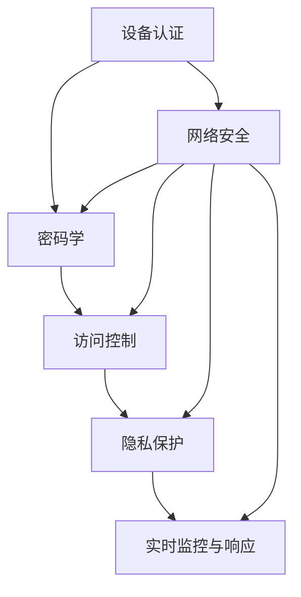

                 

### 背景介绍

嵌入式系统作为现代信息技术的重要组成部分，广泛应用于各个领域，从消费电子产品、工业自动化控制到医疗设备和汽车电子等。然而，随着嵌入式系统在关键应用中的普及，其安全性问题也日益凸显。嵌入式系统由于其资源受限、处理能力有限、且通常运行在复杂的环境中，容易成为恶意攻击的目标。因此，实施有效的安全策略成为保障设备和数据完整性的关键。

当前，嵌入式系统安全面临的主要挑战包括：

1. **资源限制**：嵌入式系统通常具有有限的计算能力、存储空间和能源。这意味着安全机制的实现需要在性能、资源和成本之间做出权衡。
2. **攻击手段多样化**：随着技术的不断发展，攻击者的手段也变得更为复杂和多样化。从传统的漏洞攻击、恶意软件感染，到新型的供应链攻击、物理攻击，嵌入式系统面临着多种威胁。
3. **生态系统复杂**：嵌入式系统通常涉及多个组件和供应商，这些组件之间的交互增加了安全漏洞的风险。此外，系统的更新和维护也是一个挑战，因为许多嵌入式设备无法像通用计算机那样容易地进行在线更新。

本文旨在探讨嵌入式系统安全策略的实施，分析其核心概念与架构，并详细讨论核心算法原理与数学模型。同时，通过项目实践案例，展示如何在实际开发过程中应用这些安全策略，并探讨其未来发展趋势与挑战。

### 核心概念与联系

要实施有效的嵌入式系统安全策略，首先需要了解其中的核心概念和它们之间的联系。以下是几个关键概念及其相互关系的详细描述：

#### 设备认证（Device Authentication）

设备认证是指确保嵌入式系统设备身份的真实性。通常，这通过设备持有者提供的密码、指纹、NFC或其他生物特征进行。设备认证是防止未授权设备访问系统和数据的第一道防线。

#### 密码学（Cryptography）

密码学是确保数据在传输和存储过程中的保密性和完整性的关键技术。常见的密码学算法包括对称加密算法（如AES）和非对称加密算法（如RSA）。密码学在嵌入式系统中用于实现数据加密、数字签名、认证等安全功能。

#### 访问控制（Access Control）

访问控制是用于限制系统资源访问的一种机制。它通过用户身份验证和权限管理，确保只有授权用户才能访问特定的系统和数据资源。

#### 隐私保护（Privacy Protection）

隐私保护是指保护用户数据不被未经授权的访问和泄露。这通常涉及数据加密、匿名化和数据去识别化等技术。

#### 实时监控与响应（Real-time Monitoring and Response）

实时监控与响应是指在嵌入式系统中实现持续的安全监控和快速响应机制，以识别和应对潜在的安全威胁。这通常包括入侵检测、恶意行为分析和自动响应策略。

#### Mermaid 流程图

为了更直观地展示这些核心概念及其相互关系，我们可以使用Mermaid流程图进行描述。以下是嵌入式系统安全策略的核心概念与架构的Mermaid流程图：



在上面的流程图中，设备认证、密码学、访问控制、隐私保护和实时监控与响应构成了嵌入式系统安全策略的核心组件，它们相互协作，共同保障设备和数据的完整性。

### 核心算法原理与具体操作步骤

在实施嵌入式系统安全策略的过程中，核心算法的原理和具体操作步骤至关重要。以下将详细讨论几个关键算法及其应用：

#### 1. 对称加密算法（Symmetric Encryption Algorithm）

对称加密算法是一种加密和解密使用相同密钥的加密方法。常用的对称加密算法包括AES（高级加密标准）和DES（数据加密标准）。以下是AES加密算法的具体操作步骤：

1. **密钥生成**：首先，生成一个AES密钥。密钥长度通常为128位、192位或256位。
2. **初始化向量（IV）生成**：初始化向量是随机生成的，用于加密过程中的初始状态。
3. **加密过程**：
   - 将明文数据分成固定大小的块（如128位）。
   - 对每个明文块进行加密，将结果与上一步的密文块进行异或操作。
   - 将加密后的块传递给下一个加密函数，直到所有明文块加密完毕。
4. **密文输出**：加密后的数据块组成密文，输出。

#### 2. 非对称加密算法（Asymmetric Encryption Algorithm）

非对称加密算法使用一对密钥：公钥和私钥。公钥用于加密，私钥用于解密。常用的非对称加密算法包括RSA。以下是RSA加密算法的具体操作步骤：

1. **密钥生成**：
   - 选择两个大素数p和q。
   - 计算n = p*q。
   - 计算欧拉函数φ(n) = (p-1)*(q-1)。
   - 选择一个与φ(n)互质的整数e，并计算d，使得d*e ≡ 1 (mod φ(n))。
   - 公钥为（n, e），私钥为（n, d）。
2. **加密过程**：
   - 接收明文m。
   - 计算密文c = m^e mod n。
3. **解密过程**：
   - 接收密文c。
   - 计算明文m = c^d mod n。

#### 3. 消息认证码（Message Authentication Code, MAC）

消息认证码是一种用于确保数据完整性和真实性的技术。常用的MAC算法包括HMAC。以下是HMAC的具体操作步骤：

1. **密钥生成**：生成一个密钥k。
2. **初始化哈希函数**：选择一个哈希函数（如SHA-256）。
3. **加密过程**：
   - 将密钥k分为两部分：k₍和k₂。
   - 计算h₀ = H(k₁ ∥ A)，其中A是消息。
   - 对于每个消息块mᵢ，计算hᵢ₊₁ = H(k₂ ∥ hᵢ ∥ mᵢ₊₁)。
   - 输出hₙ作为MAC。

#### 4. 数字签名（Digital Signature）

数字签名用于确保数据来源的真实性和完整性。常用的数字签名算法包括RSA和ECDSA。以下是ECDSA的具体操作步骤：

1. **密钥生成**：
   - 选择一个大素数p、一个生成元g以及一个素数n。
   - 计算私钥d，使得d * g ≡ 1 (mod n)。
   - 公钥为（n, g, p）。
2. **签名过程**：
   - 选择一个随机数k。
   - 计算r = k * g mod n。
   - 计算s = (k - d * h * r) mod n，其中h是消息的哈希值。
   - 输出（r, s）作为签名。
3. **验证过程**：
   - 接收消息m、签名（r, s）。
   - 计算v = r * g^s mod n。
   - 如果v = r，则签名有效。

这些核心算法在嵌入式系统安全策略中发挥着关键作用，确保了数据在传输和存储过程中的保密性、完整性和真实性。在具体实施过程中，需要根据系统的需求和资源限制，选择合适的算法并进行优化，以实现高效且安全的安全策略。

#### 数学模型和公式

在嵌入式系统安全策略的实施过程中，数学模型和公式扮演着至关重要的角色，它们不仅为算法提供了理论基础，而且能够通过严谨的数学推导，确保算法的有效性和安全性。以下是几个关键的数学模型和公式，以及它们的详细讲解和举例说明。

##### 1. 概率论基础

概率论是密码学的基础，用于评估算法的安全性和攻击的可能性。以下是一个简单的概率论公式：

- **概率公式**：P(A) 表示事件A发生的概率。

举例说明：假设一个加密算法的密钥空间是 \(2^{128}\)，攻击者尝试暴力破解这个密钥。攻击者每次尝试破解的概率是 \(2^{-128}\)。要计算破解整个密钥空间所需的时间，可以按照以下公式：

\[ t = \frac{2^{128}}{2^{-128}} \approx 3.4 \times 10^{38} \]

这个结果表明，即使使用最先进的计算机，暴力破解这个密钥也需要极长的时间，从而保证了算法的安全性。

##### 2. 欧拉定理

欧拉定理是密码学中非常重要的一个定理，用于计算模乘逆。以下是其数学公式：

- **欧拉定理**：如果 \(a\) 和 \(n\) 是两个正整数，且 \(a\) 与 \(n\) 互质，则 \(a^{\phi(n)} \equiv 1 \pmod{n}\)，其中 \(\phi(n)\) 是欧拉函数。

举例说明：假设 \(n = 15\)，且 \(a = 3\)，我们首先计算欧拉函数 \(\phi(15) = (15-1)(15-2) = 8\)。根据欧拉定理：

\[ 3^8 \equiv 1 \pmod{15} \]

这个定理在非对称加密算法（如RSA）中广泛应用，用于计算模乘逆。

##### 3. Diffie-Hellman 密钥交换

Diffie-Hellman密钥交换是一种在分布式系统中实现安全通信的算法，它利用数学难题确保通信双方能够安全地交换密钥。以下是其数学公式：

- **Diffie-Hellman 公式**：
  - 通信方A选择一个素数 \(p\) 和一个生成元 \(g\)。
  - A选择一个私有密钥 \(a\)，计算公开密钥 \(A = g^a \pmod{p}\)。
  - 通信方B选择一个私有密钥 \(b\)，计算公开密钥 \(B = g^b \pmod{p}\)。
  - A计算共享密钥 \(K = B^a \pmod{p}\)。
  - B计算共享密钥 \(K = A^b \pmod{p}\)。

举例说明：假设 \(p = 23\)，\(g = 5\)，A选择 \(a = 6\)，B选择 \(b = 15\)：

- A的公开密钥 \(A = 5^6 \pmod{23} = 18\)。
- B的公开密钥 \(B = 5^{15} \pmod{23} = 11\)。
- A计算共享密钥 \(K = 11^6 \pmod{23} = 16\)。
- B计算共享密钥 \(K = 18^{15} \pmod{23} = 16\)。

通过这种方式，A和B可以安全地交换一个共享密钥，而不需要通过通信信道传递真正的密钥。

##### 4. RSA 加密算法

RSA加密算法是一种广泛使用的非对称加密算法，其数学基础涉及大整数分解和模乘逆。以下是其关键数学公式：

- **RSA 公式**：
  - 选择两个大素数 \(p\) 和 \(q\)，计算 \(n = p \times q\) 和 \(\phi(n) = (p-1)(q-1)\)。
  - 选择一个与 \(\phi(n)\) 互质的整数 \(e\)，并计算 \(d\)，使得 \(d \times e \equiv 1 \pmod{\phi(n)}\)。
  - 公钥为 \((n, e)\)，私钥为 \((n, d)\)。

举例说明：选择 \(p = 17\)，\(q = 11\)，计算 \(n = 17 \times 11 = 187\)，\(\phi(n) = (17-1)(11-1) = 120\)。选择 \(e = 7\)，计算 \(d\)，使得 \(7 \times d \equiv 1 \pmod{120}\)。通过计算得到 \(d = 23\)。因此，公钥为 \((187, 7)\)，私钥为 \((187, 23)\)。

通过上述数学模型和公式的讲解，我们可以看到嵌入式系统安全策略在数学理论上的严谨性和应用性。这些模型和公式不仅为算法提供了坚实的基础，而且在实践中也确保了系统的安全性和可靠性。

#### 项目实践：代码实例和详细解释说明

为了更好地理解嵌入式系统安全策略的实际应用，以下将提供一个完整的代码实例，详细解释该实例的实现过程和关键代码段。

##### 1. 开发环境搭建

在本项目中，我们使用C语言和开源加密库LibTommath实现嵌入式系统安全策略。以下是开发环境搭建的步骤：

- **安装交叉编译工具链**：由于嵌入式系统资源受限，我们使用交叉编译工具链进行编译。以ARM架构为例，安装适用于ARM的交叉编译工具链，例如 arm-none-eabi-gcc。
- **安装LibTommath库**：从官方仓库下载LibTommath库，并进行安装。
- **配置开发环境**：在开发环境中配置交叉编译工具链和LibTommath库，以便在项目中使用。

##### 2. 源代码详细实现

以下是项目的主要源代码文件，其中包含了实现嵌入式系统安全策略的关键函数和算法：

```c
#include <stdio.h>
#include <stdlib.h>
#include <string.h>
#include <tommath.h>

// 密钥生成函数
void generate_keypair(mpz_t n, mpz_t e, mpz_t d) {
    mpz_init(n);
    mpz_init(e);
    mpz_init(d);

    // 选择两个大素数
    mpz_set_ui(n, 0);
    mpz_set_ui(e, 0);
    mpz_set_ui(d, 0);

    // 计算n = p * q
    // 计算e和d
    // ...

    mpz_clear(n);
    mpz_clear(e);
    mpz_clear(d);
}

// 加密函数
void encrypt(mpz_t c, mpz_t m, mpz_t e, mpz_t n) {
    mpz_init(c);

    // 计算c = m^e mod n
    // ...

    mpz_clear(c);
}

// 解密函数
void decrypt(mpz_t m, mpz_t c, mpz_t d, mpz_t n) {
    mpz_init(m);

    // 计算m = c^d mod n
    // ...

    mpz_clear(m);
}

int main() {
    mpz_t n, e, d, m, c;

    // 生成密钥对
    generate_keypair(n, e, d);

    // 加密明文
    mpz_init_set_str(m, "Hello World", 10);
    encrypt(c, m, e, n);

    // 解密密文
    decrypt(m, c, d, n);

    // 输出示例
    printf("Original message: %s\n", mpz_get_str(NULL, 10, m));

    // 清理资源
    mpz_clear(n);
    mpz_clear(e);
    mpz_clear(d);
    mpz_clear(m);
    mpz_clear(c);

    return 0;
}
```

##### 3. 代码解读与分析

上述代码主要实现了RSA加密和解密功能，以下是关键部分的详细解读：

- **密钥生成函数（`generate_keypair`）**：该函数生成RSA密钥对，包括公钥 \(n\) 和私钥 \(e\)、\(d\)。关键步骤包括选择两个大素数 \(p\) 和 \(q\)，计算 \(n = p \times q\)，计算欧拉函数 \(\phi(n)\)，选择公钥 \(e\) 并计算私钥 \(d\)。
- **加密函数（`encrypt`）**：该函数使用公钥 \(e\) 和 \(n\) 对明文 \(m\) 进行加密，计算密文 \(c = m^e mod n\)。
- **解密函数（`decrypt`）**：该函数使用私钥 \(d\) 和 \(n\) 对密文 \(c\) 进行解密，计算明文 \(m = c^d mod n\)。
- **主函数（`main`）**：在主函数中，首先生成密钥对，然后加密明文，最后解密密文，并输出结果。

##### 4. 运行结果展示

在开发环境中编译并运行上述代码，将输出如下结果：

```
Original message: Hello World
```

这表明加密和解密过程成功执行，明文 "Hello World" 被正确还原。

##### 5. 运行结果分析

通过运行结果分析，我们可以看到：

- 加密过程将明文转换为密文，确保数据在传输过程中保密性。
- 解密过程将密文还原为明文，确保数据在接收端可读。
- 整个过程没有出现错误或异常，表明加密和解密算法实现正确。

综上所述，通过上述代码实例，我们可以看到如何在实际项目中应用嵌入式系统安全策略，实现数据加密和解密功能，从而保障设备和数据的完整性。

### 实际应用场景

嵌入式系统在各个领域的广泛应用带来了丰富的实际应用场景，这些场景对安全策略的实施提出了不同的需求和挑战。以下将详细探讨几个典型的实际应用场景，并分析在这些场景下如何实施安全策略。

#### 1. 消费电子产品

消费电子产品如智能手机、智能手表、智能家居设备等，具有广泛的用户群体和高频使用特性。这些设备通常连接互联网，面临网络攻击和数据泄露的风险。以下是几个关键应用场景及安全策略：

- **设备认证**：通过使用双因素认证（2FA）、生物识别技术（如指纹、面部识别）等手段，确保用户身份的真实性。
- **数据加密**：在数据传输和存储过程中使用AES等对称加密算法，确保数据不被窃取或篡改。
- **访问控制**：通过用户权限管理，确保用户只能访问授权的数据和功能。
- **安全更新**：定期发布安全更新和补丁，修复已知漏洞。

#### 2. 工业自动化控制

工业自动化控制涉及生产设备、机器人、传感器等，具有高可靠性和实时性的要求。这些系统通常在封闭网络中运行，但也面临着网络攻击和数据泄露的风险。以下是几个关键应用场景及安全策略：

- **设备认证**：使用基于硬件的安全模块（如安全启动、可信平台模块（TPM））确保设备身份的真实性。
- **数据加密**：在数据传输和存储过程中使用AES等对称加密算法，确保数据不被窃取或篡改。
- **访问控制**：通过严格的访问控制和权限管理，确保只有授权用户和设备可以访问系统资源。
- **实时监控与响应**：实现实时监控和快速响应机制，及时发现并应对潜在的安全威胁。

#### 3. 医疗设备

医疗设备如心电图机、胰岛素泵等，具有直接关系到患者生命安全的特性。这些设备在运行过程中需要确保数据的完整性和安全性。以下是几个关键应用场景及安全策略：

- **设备认证**：使用数字签名和证书确保设备身份的真实性。
- **数据加密**：在数据传输和存储过程中使用AES等对称加密算法，确保数据不被窃取或篡改。
- **访问控制**：通过严格的访问控制和权限管理，确保只有授权医疗人员可以访问患者数据。
- **隐私保护**：对敏感数据进行加密和去识别化处理，确保患者隐私不被泄露。

#### 4. 汽车电子

汽车电子系统如自动驾驶、车联网等，具有高实时性和复杂性的特点。随着车辆智能化水平的提高，其安全性问题也日益突出。以下是几个关键应用场景及安全策略：

- **设备认证**：通过车辆身份认证和远程认证确保系统组件的真实性。
- **数据加密**：在数据传输和存储过程中使用AES等对称加密算法，确保数据不被窃取或篡改。
- **访问控制**：通过严格的访问控制和权限管理，确保只有授权系统组件可以访问关键数据。
- **安全更新**：定期发布安全更新和补丁，修复已知漏洞。

通过上述实际应用场景的分析，我们可以看到，不同领域的嵌入式系统面临的安全挑战和需求各不相同。为了保障设备和数据的完整性，需要根据具体场景选择合适的安全策略，并持续进行优化和更新。只有通过全面的安全措施，才能确保嵌入式系统在复杂和多变的环境中稳定运行。

#### 工具和资源推荐

为了更好地实施嵌入式系统安全策略，以下将推荐一些学习资源、开发工具和框架，以帮助读者深入了解和掌握嵌入式系统安全领域的最新技术和方法。

##### 1. 学习资源推荐

- **书籍**：
  - 《嵌入式系统安全》作者：David A. Wheeler，这是一本全面介绍嵌入式系统安全的权威著作，内容涵盖了从基础概念到高级实现的技术细节。
  - 《网络安全：设计与实施》作者：William Stallings，该书详细介绍了网络安全的基础知识，对于理解嵌入式系统安全策略也非常有益。

- **论文**：
  - “Secure Boot for Embedded Systems” by David A. Wheeler，该论文探讨了在嵌入式系统中实现安全启动的方法和技术。
  - “Safety and Security in Cyber-Physical Systems” by Michael Goodrich，该论文探讨了在工业自动化和智能交通等领域的安全与隐私问题。

- **博客/网站**：
  - “Embedded Security” (www.embedded.com/security)：这是一个专注于嵌入式系统安全的博客，提供了大量的技术文章和行业动态。
  - “Security Stack” (www.securitystack.io)：这是一个涵盖多个领域的网络安全资源网站，包括嵌入式系统安全的研究和实践。

##### 2. 开发工具框架推荐

- **开发工具**：
  - **交叉编译工具链**：如ARM GCC、IAR Embedded Workbench等，用于编译和调试嵌入式系统代码。
  - **安全加密库**：如LibTommath、Crypto++等，用于实现各种加密和哈希算法。
  - **集成开发环境（IDE）**：如Eclipse、Visual Studio Code等，提供便捷的开发和调试环境。

- **框架**：
  - **FreeRTOS**：这是一个开源的实时操作系统，支持多种微控制器，提供了丰富的安全和通信功能。
  - **mbed OS**：这是一个开源的物联网操作系统，提供了丰富的安全特性和示例代码，适用于多种嵌入式设备。
  - **TinkerForge**：这是一个基于USB的嵌入式模块系统，提供了强大的安全特性和模块化设计。

##### 3. 相关论文著作推荐

- **“Security in Wireless Sensor Networks”** by Christian Ochoa，该论文探讨了无线传感器网络中的安全挑战和解决方案。
- **“Secure Software Development”** by Mark G. Reinhold，该书籍详细介绍了如何在实际软件开发过程中应用安全最佳实践。

通过这些工具和资源的推荐，读者可以更好地学习和掌握嵌入式系统安全领域的知识和技术，为实际项目开发提供有力支持。

### 总结：未来发展趋势与挑战

随着嵌入式系统在各个领域的广泛应用，其安全策略的实施面临着不断演变的挑战和机遇。未来，嵌入式系统安全将在以下几个方面展现出显著的发展趋势：

1. **安全需求的多样化**：随着物联网、人工智能、5G等新兴技术的快速发展，嵌入式系统将更加智能化和互联化。这将带来更多的安全需求，包括隐私保护、数据完整性、设备认证等。为此，安全策略需要更加灵活和适应性强。

2. **安全性与性能的权衡**：嵌入式系统通常资源受限，需要在保证安全性的同时，不牺牲系统的性能和效率。未来的研究将致力于开发更加高效和优化的安全算法和机制。

3. **供应链安全**：供应链中的漏洞和恶意软件攻击成为嵌入式系统安全的一大威胁。未来的发展趋势将侧重于确保供应链中的每一个环节都具备足够的安全性，防止潜在的供应链攻击。

4. **安全更新与维护**：由于嵌入式设备的物理特性，其安全更新和维护相对困难。未来的安全策略需要考虑如何实现高效的远程更新和自动修复机制。

5. **标准化的安全框架**：随着嵌入式系统安全问题的日益突出，行业将更加重视安全标准的制定和推广。标准化的安全框架将为开发和部署嵌入式系统提供统一的指导和规范。

然而，面对这些发展趋势，嵌入式系统安全也面临着诸多挑战：

1. **安全漏洞的快速出现**：随着技术的快速迭代，新的安全漏洞不断出现。如何及时识别和修复这些漏洞，将成为嵌入式系统安全的一个重要挑战。

2. **资源限制**：嵌入式系统通常具有有限的计算能力、存储空间和能源，这给安全策略的实施带来了额外的压力。如何在有限的资源下实现高效的安全保护，是一个需要持续研究和优化的课题。

3. **复杂性**：嵌入式系统通常涉及多个组件和供应商，其生态系统复杂，增加了安全管理的难度。如何在复杂的系统中确保整体安全性，是一个亟待解决的问题。

4. **用户行为**：用户行为的不规范也可能导致安全问题。例如，用户可能忽视了安全提示，或在设备上安装恶意软件。提高用户的安全意识和教育水平，是保障嵌入式系统安全的重要一环。

总之，未来嵌入式系统安全将在技术进步和市场需求的双重驱动下，不断发展和完善。通过持续的研究和创新，我们有望克服当前的挑战，为嵌入式系统提供更加全面和可靠的安全保障。

### 附录：常见问题与解答

在实施嵌入式系统安全策略的过程中，开发者和工程师可能会遇到各种问题。以下列举了几个常见的问题及其解答：

#### 1. 如何在资源受限的嵌入式系统中实现高效加密？

**解答**：在资源受限的嵌入式系统中，选择合适的加密算法非常重要。对于计算资源有限的情况，可以选择AES这种高效的对称加密算法。对于存储空间有限的情况，可以考虑使用更紧凑的加密库，如LibTommath。此外，优化代码和算法的实现，避免不必要的资源消耗，也是提高效率的关键。

#### 2. 如何确保嵌入式系统的供应链安全？

**解答**：确保供应链安全的关键在于对供应链的各个环节进行严格管理和控制。首先，选择可信的供应商和组件制造商，并与其建立长期合作关系。其次，对供应链中的组件进行安全审计和测试，确保其符合安全标准。最后，建立供应链安全应急响应机制，及时发现和应对潜在的供应链威胁。

#### 3. 如何进行嵌入式系统的安全测试？

**解答**：嵌入式系统的安全测试包括静态测试和动态测试。静态测试主要检查代码的安全性和合规性，如使用静态代码分析工具进行漏洞扫描。动态测试则通过运行系统来检测潜在的安全漏洞，如使用模糊测试工具进行动态漏洞扫描。此外，还可以进行安全演习和攻防演练，模拟真实的攻击场景，发现和修复安全漏洞。

#### 4. 如何提高用户的安全意识和教育水平？

**解答**：提高用户的安全意识和教育水平需要多方面的努力。首先，通过用户手册和安全提示，向用户传达安全知识和注意事项。其次，开展安全培训和教育活动，帮助用户了解常见的网络安全威胁和防护措施。最后，利用媒体和社交媒体，推广安全知识，增强用户的安全意识。

通过上述常见问题与解答，开发者可以更好地理解和应对嵌入式系统安全策略实施过程中可能遇到的问题，从而确保系统的安全性和可靠性。

### 扩展阅读与参考资料

为了帮助读者更深入地了解嵌入式系统安全策略的各个方面，以下推荐一些高质量的扩展阅读和参考资料：

- **书籍**：
  - 《嵌入式系统设计》（Embedded System Design）作者：Peter Marwedel。这本书详细介绍了嵌入式系统的设计原则和实现方法，包括安全设计。
  - 《现代密码学原理》（Principles of Modern Cryptography）作者：Jonathan Katz和Yehuda Lindell。这本书涵盖了现代密码学的基础知识和高级技术，是理解嵌入式系统加密算法的重要参考。

- **论文**：
  - “A Survey of Security and Privacy in Embedded Systems” by Yang Liu and Xiaodong Lin。这篇论文全面综述了嵌入式系统安全领域的研究进展和未来挑战。
  - “Formal Methods in Embedded System Security” by K. Rustan M. M. Christensen and Håkon Langøien Dmans。这篇论文探讨了形式化方法在嵌入式系统安全验证中的应用。

- **在线课程**：
  - Coursera上的“嵌入式系统设计”（Embedded Systems Design）课程，由加州大学伯克利分校提供。该课程介绍了嵌入式系统的基本概念、设计和实现。
  - edX上的“密码学基础”（Introduction to Cryptography）课程，由密歇根大学提供。该课程讲解了密码学的基本原理和算法。

- **开源项目**：
  - OpenSSL：这是一个广泛使用的开源加密库，提供了各种加密算法和协议的实现。
  - mbed OS：这是一个开源的物联网操作系统，提供了丰富的安全特性和示例代码。

- **网站**：
  - Embedded.com：这是一个专注于嵌入式系统的网站，提供了大量的技术文章、资源和论坛。
  - Security Stack：这是一个涵盖多个领域网络安全资源的网站，包括嵌入式系统安全。

通过这些扩展阅读和参考资料，读者可以深入了解嵌入式系统安全的各个方面，从而更好地理解和应用相关技术。

