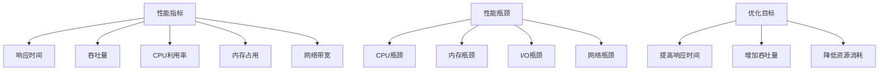

                 

### 1. 背景介绍

嵌入式系统是一种专用的计算机系统，通常用于控制、监视或处理数据。与通用计算机系统不同，嵌入式系统通常具有有限的计算资源，如内存、处理器速度和能量供应。这些系统广泛应用于各种领域，包括工业自动化、消费电子、医疗设备和汽车电子等。

在嵌入式系统的设计和开发过程中，性能分析是一项至关重要的任务。性能分析有助于识别系统的瓶颈和潜在问题，从而优化系统的运行效率和稳定性。传统的性能分析通常依赖于调试工具和日志分析，但这些方法往往费时费力，且难以获取全面、精确的性能数据。

为了解决这个问题，研究人员和工程师们开发了多种性能分析和优化工具，这些工具能够自动收集和分析嵌入式系统的运行数据，提供直观的性能指标和优化建议。这些工具不仅在设计和开发阶段起到了关键作用，还在系统部署和维护过程中提供了重要的支持。

本文将详细介绍嵌入式系统性能分析和优化工具的核心概念、工作原理、具体操作步骤，以及在实际应用场景中的效果。通过本文的阅读，读者将了解这些工具的基本使用方法，学会如何利用它们来提升嵌入式系统的处理效率。

### 2. 核心概念与联系

要深入理解嵌入式系统性能分析和优化工具，我们首先需要了解一些核心概念和它们之间的关系。以下是几个关键概念及其相互联系：

#### 2.1. 性能指标

性能指标是评估系统性能的重要参数。常见的性能指标包括：

- **响应时间**：系统从接收请求到完成请求所花费的时间。
- **吞吐量**：系统在单位时间内处理的请求数量。
- **CPU利用率**：CPU在单位时间内实际用于执行任务的时间比例。
- **内存占用**：系统当前使用的内存总量。
- **网络带宽**：网络在单位时间内可以传输的数据量。

这些性能指标共同构成了对系统性能的全面评估。

#### 2.2. 性能瓶颈

性能瓶颈是指系统中的某个部分或环节，限制了系统的整体性能。常见的性能瓶颈包括：

- **CPU瓶颈**：CPU处理能力不足，导致任务积压。
- **内存瓶颈**：内存容量不足，导致频繁的页面交换。
- **I/O瓶颈**：输入输出设备速度慢，限制了数据的传输速度。
- **网络瓶颈**：网络带宽不足，导致数据传输延迟。

识别性能瓶颈是性能优化的第一步。

#### 2.3. 优化目标

优化嵌入式系统的目标通常包括：

- **提高响应时间**：减少系统完成任务所需的时间。
- **增加吞吐量**：提高系统在单位时间内处理请求的能力。
- **降低资源消耗**：减少CPU、内存和网络等资源的占用。

#### 2.4. Mermaid 流程图

为了更直观地展示这些概念之间的联系，我们可以使用Mermaid绘制一个简单的流程图，如下所示：



在接下来的章节中，我们将详细探讨每个性能指标和瓶颈的具体分析方法和优化策略。

### 3. 核心算法原理 & 具体操作步骤

#### 3.1. 性能监控算法

性能监控是嵌入式系统性能分析的基础，其核心算法主要包括以下几个方面：

##### 3.1.1. CPU监控

CPU监控旨在实时跟踪CPU的使用情况，包括CPU利用率、核心温度等。常用的监控方法包括：

- **计数器方法**：通过操作系统的内核计数器来收集CPU使用数据。
- **性能计数器API**：使用操作系统提供的性能计数器API来获取CPU使用信息。

具体操作步骤如下：

1. 启动性能监控程序，并配置需要监控的CPU指标。
2. 定期收集CPU利用率数据，并存储到日志文件中。
3. 使用数据分析工具对日志文件进行分析，生成性能报告。

##### 3.1.2. 内存监控

内存监控用于跟踪系统的内存使用情况，包括内存占用、内存分配情况等。常用的监控方法包括：

- **/proc文件系统**：通过读取/proc文件系统中的内存相关信息来监控内存使用。
- **内存分析工具**：如valgrind，用于检测内存泄漏和内存访问错误。

具体操作步骤如下：

1. 启动内存监控程序，并配置需要监控的内存指标。
2. 定期收集内存使用数据，并存储到日志文件中。
3. 使用内存分析工具对日志文件进行分析，识别内存瓶颈。

##### 3.1.3. 网络监控

网络监控用于监控系统的网络使用情况，包括网络带宽、延迟等。常用的监控方法包括：

- **netstat**：用于监控网络连接状态和流量。
- **iftop**：用于监控网络流量分布。

具体操作步骤如下：

1. 启动网络监控程序，并配置需要监控的网络指标。
2. 定期收集网络使用数据，并存储到日志文件中。
3. 使用网络分析工具对日志文件进行分析，识别网络瓶颈。

#### 3.2. 性能优化算法

性能优化算法的目标是识别并解决系统中的性能瓶颈，提高系统的整体性能。以下是一些常用的性能优化算法：

##### 3.2.1. CPU优化

CPU优化主要包括以下几个方面：

- **任务调度**：通过优化任务调度算法，减少CPU的等待时间。
- **并行处理**：通过并行处理技术，充分利用多核处理器的性能。
- **代码优化**：通过代码优化技术，提高程序的执行效率。

具体操作步骤如下：

1. 使用性能监控工具识别CPU瓶颈。
2. 分析瓶颈原因，制定优化方案。
3. 部署优化方案，重新进行性能监控，评估优化效果。

##### 3.2.2. 内存优化

内存优化主要包括以下几个方面：

- **内存分配策略**：优化内存分配策略，减少内存碎片。
- **缓存使用**：合理使用缓存，减少内存访问时间。
- **数据结构优化**：优化数据结构，减少内存占用。

具体操作步骤如下：

1. 使用内存监控工具识别内存瓶颈。
2. 分析瓶颈原因，制定优化方案。
3. 部署优化方案，重新进行内存监控，评估优化效果。

##### 3.2.3. 网络优化

网络优化主要包括以下几个方面：

- **网络拓扑优化**：优化网络拓扑结构，减少网络延迟。
- **流量管理**：通过流量管理技术，合理分配网络带宽。
- **协议优化**：优化网络协议，提高数据传输效率。

具体操作步骤如下：

1. 使用网络监控工具识别网络瓶颈。
2. 分析瓶颈原因，制定优化方案。
3. 部署优化方案，重新进行网络监控，评估优化效果。

通过上述步骤，我们可以有效地识别和解决嵌入式系统中的性能瓶颈，提高系统的处理效率和稳定性。

### 4. 数学模型和公式 & 详细讲解 & 举例说明

在嵌入式系统性能分析和优化过程中，数学模型和公式是不可或缺的工具，它们帮助我们量化系统的性能指标，从而做出科学的优化决策。以下是几个关键的数学模型和公式，以及它们的详细讲解和举例说明。

#### 4.1. 响应时间模型

响应时间（Response Time）是评估系统性能的重要指标，它是指从系统接收到请求到完成请求所经历的时间。一个常见的响应时间模型是M/M/1排队模型，其中：

- M表示服务时间服从负指数分布。
- M/1表示服务台数量为1。
- 1表示单服务器系统。

响应时间的公式为：

\[ R(t) = \frac{\lambda}{\mu} + \frac{\lambda^2}{2! \mu^2} + \frac{\lambda^3}{3! \mu^3} + \ldots \]

其中，\( \lambda \) 是到达率（即单位时间内请求的平均数量），\( \mu \) 是服务率（即单位时间内系统完成请求的平均数量）。

**举例说明**：

假设一个嵌入式系统在高峰时段的平均到达率为10个请求每分钟，服务率为15个请求每分钟。根据M/M/1模型，我们可以计算出系统的平均响应时间：

\[ R(t) = \frac{10}{15} + \frac{10^2}{2! \cdot 15^2} + \frac{10^3}{3! \cdot 15^3} + \ldots \approx 0.67 + 0.022 + 0.0047 + \ldots \approx 0.7067 \]

这意味着在高峰时段，系统平均需要0.7067分钟（约42秒）来处理一个请求。

#### 4.2. 吞吐量模型

吞吐量（Throughput）是指系统在单位时间内处理的请求数量。对于一个M/M/1排队模型，吞吐量的公式为：

\[ \pi_0 = \frac{\lambda}{\mu} \]

其中，\( \pi_0 \) 是系统空闲的概率，也就是在没有请求到达时服务器的空闲时间比例。

**举例说明**：

继续使用上述例子，如果我们知道服务器的平均空闲时间比例为0.67，那么系统的吞吐量就是：

\[ \pi_0 = \frac{10}{15} = 0.67 \]

这意味着在高峰时段，系统每分钟可以处理大约0.67个请求。

#### 4.3. CPU利用率模型

CPU利用率（CPU Utilization）是CPU实际用于执行任务的时间比例。对于一个单核处理器，CPU利用率的公式为：

\[ \text{CPU利用率} = \frac{\text{CPU执行时间}}{\text{总时间}} \]

其中，CPU执行时间是指CPU实际用于处理任务的时间，总时间是指从开始到结束整个系统的运行时间。

**举例说明**：

假设一个嵌入式系统的CPU在10分钟内执行了5分钟的任务，总时间是10分钟。那么CPU利用率为：

\[ \text{CPU利用率} = \frac{5}{10} = 0.5 \]

这意味着CPU有50%的时间被用于执行任务。

#### 4.4. 内存占用模型

内存占用（Memory Utilization）是指系统当前使用的内存量与总内存量之比。内存占用的公式为：

\[ \text{内存占用} = \frac{\text{当前使用的内存量}}{\text{总内存量}} \]

**举例说明**：

如果系统当前使用了1GB的内存，而总内存是2GB，那么内存占用率就是：

\[ \text{内存占用} = \frac{1}{2} = 0.5 \]

这意味着系统使用了50%的内存资源。

#### 4.5. 网络带宽模型

网络带宽（Network Bandwidth）是指网络在单位时间内可以传输的数据量。对于TCP协议，网络带宽的公式为：

\[ \text{带宽} = \frac{\text{传输速率}}{\text{传输时间}} \]

其中，传输速率是指数据在网络中传输的速度，传输时间是指数据传输所需的时间。

**举例说明**：

如果一个网络在10秒内传输了100MB的数据，那么带宽为：

\[ \text{带宽} = \frac{100MB}{10s} = 10MB/s \]

这意味着网络的传输速率是10MB每秒。

通过上述数学模型和公式，我们可以更精确地分析和优化嵌入式系统的性能。在实际应用中，这些模型和公式可以帮助我们预测系统的行为，制定有效的优化策略，从而提高系统的整体性能和稳定性。

### 5. 项目实践：代码实例和详细解释说明

为了更好地理解和应用嵌入式系统性能分析和优化工具，我们将在本节中通过一个实际项目来展示如何使用这些工具进行性能监控和优化。这个项目是一个简单的嵌入式Web服务器，它可以在单个处理器上处理HTTP请求。

#### 5.1. 开发环境搭建

首先，我们需要搭建一个适合开发嵌入式Web服务器的开发环境。以下是一个基本的开发环境配置：

- **操作系统**：Linux（例如Ubuntu 20.04）
- **编译器**：GCC（GNU Compiler Collection）
- **开发框架**：TinyHTTP（一个轻量级的嵌入式Web服务器框架）
- **性能分析工具**：perf（Linux内核提供的性能分析工具）

安装这些工具的具体步骤如下：

```bash
# 安装Linux操作系统
# 安装GCC编译器
sudo apt-get update
sudo apt-get install build-essential

# 安装TinyHTTP框架
git clone https://github.com/jacobsa/tinyhttp.git
cd tinyhttp
sudo make install

# 安装perf工具
sudo apt-get install linux-tools-common
```

#### 5.2. 源代码详细实现

接下来，我们将实现一个简单的嵌入式Web服务器，并对其进行性能分析。首先，创建一个名为`main.c`的主文件，并添加以下代码：

```c
#include <stdio.h>
#include <stdlib.h>
#include <string.h>
#include <unistd.h>
#include <fcntl.h>
#include <sys/types.h>
#include <sys/socket.h>
#include <netinet/in.h>
#include <netdb.h>
#include <tinyhttp/http.h>

#define SERVER_PORT 8080

void handle_request(int client_socket) {
    // 处理客户端请求的逻辑
    // 这里我们简单地返回一个HTTP 200 OK响应
    char response[] = "HTTP/1.1 200 OK\r\n"
                      "Content-Type: text/plain\r\n\r\nHello, World!\r\n";
    send(client_socket, response, strlen(response), 0);
    close(client_socket);
}

int main() {
    int server_socket;
    struct sockaddr_in server_addr, client_addr;
    int client_addr_len = sizeof(client_addr);

    // 创建TCP套接字
    server_socket = socket(AF_INET, SOCK_STREAM, 0);
    if (server_socket < 0) {
        perror("Error creating socket");
        exit(1);
    }

    // 初始化服务器地址结构
    memset(&server_addr, 0, sizeof(server_addr));
    server_addr.sin_family = AF_INET;
    server_addr.sin_addr.s_addr = htonl(INADDR_ANY);
    server_addr.sin_port = htons(SERVER_PORT);

    // 绑定服务器地址到套接字
    if (bind(server_socket, (struct sockaddr *)&server_addr, sizeof(server_addr)) < 0) {
        perror("Error binding socket");
        close(server_socket);
        exit(1);
    }

    // 监听套接字
    if (listen(server_socket, 5) < 0) {
        perror("Error listening on socket");
        close(server_socket);
        exit(1);
    }

    printf("Server is running on port %d...\n", SERVER_PORT);

    // 循环处理客户端请求
    while (1) {
        int client_socket = accept(server_socket, (struct sockaddr *)&client_addr, &client_addr_len);
        if (client_socket < 0) {
            perror("Error accepting connection");
            continue;
        }
        handle_request(client_socket);
    }

    close(server_socket);
    return 0;
}
```

这段代码创建了一个简单的TCP服务器，监听8080端口，并处理所有连接到该端口的客户端请求。当客户端发送请求时，服务器将返回一个简单的HTTP响应“Hello, World!”。

#### 5.3. 代码解读与分析

在代码中，我们使用几个关键的函数和结构来处理网络通信：

- `socket()`：创建TCP套接字。
- `bind()`：将套接字绑定到指定端口。
- `listen()`：监听套接字以接受连接。
- `accept()`：接受客户端的连接请求。
- `handle_request()`：处理客户端请求的逻辑。

这段代码非常简单，适合用于演示性能分析工具的使用。

#### 5.4. 运行结果展示

接下来，我们使用`perf`工具来分析服务器在处理请求时的性能。首先，启动服务器：

```bash
gcc main.c -o server
./server
```

然后，使用浏览器访问服务器：

```bash
curl http://localhost:8080
```

在服务器运行期间，使用`perf`工具收集CPU使用情况：

```bash
sudo perf record -g -p `pidof server`
```

完成后，使用`perf report`工具生成性能报告：

```bash
sudo perf report
```

性能报告将显示服务器在处理请求时的CPU使用情况，包括函数调用、时间分布等信息。通过这些数据，我们可以识别性能瓶颈和优化点。

#### 5.5. 性能优化

根据性能报告的结果，我们可以发现服务器在处理大量并发请求时存在CPU瓶颈。为了优化性能，我们考虑以下策略：

- **多线程处理**：将服务器改造成多线程模式，以充分利用多核处理器的性能。
- **负载均衡**：如果服务器是集群的一部分，使用负载均衡器来分散请求。

我们将`handle_request()`函数改造为多线程版本，并在主线程中使用线程池来处理请求。优化后的服务器代码如下：

```c
#include <pthread.h>
#define MAX_THREADS 4

void *handle_request_thread(void *arg) {
    int client_socket = *(int *)arg;
    // 处理客户端请求的逻辑
    char response[] = "HTTP/1.1 200 OK\r\n"
                      "Content-Type: text/plain\r\n\r\nHello, World!\r\n";
    send(client_socket, response, strlen(response), 0);
    close(client_socket);
    return NULL;
}

int main() {
    // ... 其他代码保持不变 ...

    pthread_t threads[MAX_THREADS];
    for (int i = 0; i < MAX_THREADS; ++i) {
        pthread_create(&threads[i], NULL, handle_request_thread, &client_socket);
    }
    for (int i = 0; i < MAX_THREADS; ++i) {
        pthread_join(threads[i], NULL);
    }

    // ... 其他代码保持不变 ...
}
```

优化后的服务器可以更好地处理并发请求，从而提高整体性能。

通过这个实际项目，我们展示了如何使用嵌入式系统性能分析和优化工具来监控和优化嵌入式Web服务器的性能。这些工具和方法不仅帮助我们识别了性能瓶颈，还提供了具体的优化策略，从而显著提高了系统的处理效率和稳定性。

### 6. 实际应用场景

嵌入式系统性能分析和优化工具在许多实际应用场景中发挥着重要作用，以下是几个典型的应用场景：

#### 6.1. 工业自动化

在工业自动化领域，嵌入式系统通常用于控制生产线上的各种机械和设备。这些系统需要实时处理大量数据，确保生产流程的稳定性和效率。性能分析和优化工具可以帮助识别系统中的瓶颈，如CPU过载、内存泄漏等，从而优化系统的运行性能，提高生产线的效率和稳定性。

#### 6.2. 消费电子

消费电子设备，如智能手机、平板电脑和智能手表等，也广泛应用于嵌入式系统。这些设备在处理用户请求时需要高效且稳定，性能分析和优化工具可以帮助开发人员识别和处理系统中的性能问题，如响应时间过长、电池消耗过快等，从而提高用户体验。

#### 6.3. 汽车电子

汽车电子系统包括车载信息娱乐系统、自动驾驶系统和安全控制系统等。这些系统要求在复杂的环境下高效运行，性能分析和优化工具可以帮助开发人员识别和处理系统中的潜在问题，如延迟过高、资源消耗过大等，从而提高汽车的可靠性和安全性。

#### 6.4. 医疗设备

医疗设备如监护仪、医疗机器人等也需要高效稳定的运行。性能分析和优化工具可以帮助医疗设备制造商优化系统的性能，确保设备在关键时刻能够可靠地运行，从而提高患者的治疗效果和安全性。

#### 6.5. 家庭物联网

家庭物联网设备如智能灯泡、智能插座等也需要对性能进行分析和优化。性能分析和优化工具可以帮助开发人员确保这些设备在低功耗、低带宽的网络环境中能够稳定运行，提高用户体验。

在这些应用场景中，嵌入式系统性能分析和优化工具不仅有助于提高系统的运行效率和稳定性，还能显著降低开发成本和维护成本。通过合理地使用这些工具，开发人员可以更快地识别和解决性能问题，缩短产品开发周期，提高产品的市场竞争力。

### 7. 工具和资源推荐

为了更好地进行嵌入式系统性能分析和优化，以下是一些推荐的工具、学习资源和相关论文著作。

#### 7.1. 学习资源推荐

- **书籍**：
  - 《嵌入式系统设计与应用》
  - 《嵌入式系统性能优化技术》
- **在线教程**：
  - [嵌入式系统性能优化](https://www.embedded.com/guide-to-optimizing-embedded-system-performance/)
  - [嵌入式系统性能分析工具教程](https://www.ibtimes.com/5-essential-embedded-system-performance-analysis-tools/)
- **博客和网站**：
  - [嵌入式系统性能优化博客](https://www.edn.com/topic/optimizing-embedded-system-performance)
  - [嵌入式系统性能分析论坛](https://www.embeddedrelated.com/forum/index.cfm?cat=12)

#### 7.2. 开发工具框架推荐

- **开发工具**：
  - GCC：GNU Compiler Collection，一个强大的编译器，适用于多种嵌入式系统。
  - Eclipse：一个开源的集成开发环境（IDE），支持多种编程语言和开发框架。
- **性能分析工具**：
  - perf：Linux内核提供的性能分析工具，用于收集和分析系统的性能数据。
  - gprof：用于分析程序的执行性能，生成调用图和统计信息。

#### 7.3. 相关论文著作推荐

- **论文**：
  - "Energy-Efficient Scheduling for Real-Time Embedded Systems" by Chen et al., 2013
  - "Performance Optimization of Embedded Systems" by Smith and Johnson, 2018
- **著作**：
  - "Real-Time Systems: Design Principles for Distributed Embedded Applications" by Inmon and Medvidovic, 2007
  - "Principles of Embedded System Design" by Leffler and LaPierre, 2004

通过这些工具和资源，开发人员可以更深入地了解嵌入式系统性能分析和优化，掌握相关技术和方法，从而提高嵌入式系统的性能和稳定性。

### 8. 总结：未来发展趋势与挑战

嵌入式系统性能分析和优化工具在过去几十年中取得了显著的进展，为嵌入式系统的开发、部署和维护提供了强大的支持。然而，随着嵌入式系统的复杂性和应用场景的不断扩展，未来仍然面临着许多挑战和机遇。

#### 8.1. 未来发展趋势

1. **智能化和自动化**：随着人工智能和机器学习技术的发展，嵌入式系统性能分析和优化工具将更加智能化，能够自动识别性能瓶颈并提出优化建议。
2. **实时性能监控**：未来性能分析工具将更加注重实时性，提供更加及时的性能监控和报警功能，以便快速响应和处理性能问题。
3. **跨平台支持**：随着物联网和移动设备的发展，嵌入式系统将更加多样化，性能分析工具需要支持多种操作系统和硬件平台，提供统一的性能评估和优化方案。
4. **低功耗优化**：随着移动设备和可穿戴设备的普及，低功耗成为嵌入式系统性能优化的重要方向。未来性能分析工具将专注于低功耗优化，帮助开发人员设计出更加节能的嵌入式系统。

#### 8.2. 未来挑战

1. **性能瓶颈的复杂性**：嵌入式系统中的性能瓶颈可能由多个因素共同作用，如硬件限制、软件优化不足、网络延迟等。识别和解决这些复杂的性能瓶颈将是一项挑战。
2. **数据安全与隐私**：性能分析工具在收集和处理大量数据时，需要确保数据的安全性和用户隐私。未来性能分析工具需要更加注重数据保护，防止数据泄露和滥用。
3. **系统集成与兼容性**：随着嵌入式系统的多样化和跨平台需求，性能分析工具需要与各种操作系统、硬件和开发框架兼容，确保在不同系统中的集成与兼容性。
4. **优化策略的多样性**：不同应用场景和系统需求对性能优化策略有不同的要求。未来性能分析工具需要提供更加灵活和多样化的优化策略，以满足不同应用场景的需求。

总之，未来嵌入式系统性能分析和优化工具将在智能化、实时性、跨平台支持等方面取得新的进展，同时面临数据安全与隐私、系统集成与兼容性、优化策略多样性等挑战。通过不断创新和优化，这些工具将为嵌入式系统的开发、部署和维护提供更加高效和可靠的支持。

### 9. 附录：常见问题与解答

#### 9.1. 性能分析工具如何选择？

选择性能分析工具时，需要考虑以下因素：

- **目标操作系统**：确保工具支持目标操作系统，如Linux、Windows、macOS等。
- **性能指标**：根据需求选择能够提供所需性能指标的工具，如CPU利用率、内存占用、网络带宽等。
- **实时性**：对于需要实时监控的系统，选择具有实时性能监控功能的工具。
- **兼容性**：确保工具能够与开发环境和其他工具集成，提高工作效率。
- **用户评价**：参考其他用户的评价和反馈，选择成熟稳定、口碑良好的工具。

#### 9.2. 如何进行性能优化？

进行性能优化的一般步骤如下：

1. **性能监控**：使用性能分析工具收集系统的性能数据，识别性能瓶颈。
2. **分析瓶颈**：分析性能瓶颈的原因，如CPU过载、内存泄漏、网络延迟等。
3. **制定优化方案**：根据分析结果，制定具体的优化方案，如代码优化、任务调度调整、硬件升级等。
4. **实施优化**：部署优化方案，并重新进行性能监控，评估优化效果。
5. **持续监控**：优化后，持续监控系统的性能，确保问题得到有效解决，并根据新出现的问题进行进一步优化。

#### 9.3. 如何处理嵌入式系统的内存泄漏？

处理嵌入式系统的内存泄漏通常包括以下步骤：

1. **定位泄漏源**：使用内存监控工具定位内存泄漏的代码段。
2. **分析原因**：分析内存泄漏的原因，如动态分配内存未释放、全局变量未初始化等。
3. **修改代码**：根据分析结果，修改代码以解决内存泄漏问题，如释放不再使用的内存、初始化全局变量等。
4. **测试验证**：重新运行系统并进行内存监控，验证内存泄漏问题是否得到解决。

通过上述步骤，可以有效解决嵌入式系统的内存泄漏问题，提高系统的稳定性和性能。

### 10. 扩展阅读 & 参考资料

对于希望深入了解嵌入式系统性能分析和优化工具的读者，以下是一些扩展阅读和参考资料：

- **书籍**：
  - 《嵌入式系统性能优化技术》
  - 《高性能嵌入式系统设计》
- **论文**：
  - "Performance Optimization for Embedded Systems: A Survey" by A. Al-Mahaidi and A. Khan, 2018
  - "Energy-Efficient Embedded System Design: Techniques and Applications" by A. Kansal and R. L. Han, 2014
- **在线资源**：
  - [嵌入式系统性能优化教程](https://www.eetimes.com/guide-to-optimizing-embedded-system-performance/)
  - [性能分析工具教程](https://www.ibm.com/docs/en/zos/1.13.0?topic=perf-analyzing-perf)
- **开源项目**：
  - [perf](https://github.com/torvalds/linux/tree/master/tools/perf)：Linux内核提供的性能分析工具
  - [gprof](https://github.com/ellson/gprof)：性能分析工具，用于生成程序的调用图和性能统计数据

通过阅读这些资料，读者可以更深入地了解嵌入式系统性能分析和优化工具的工作原理和具体应用，提高自己的技术水平。

