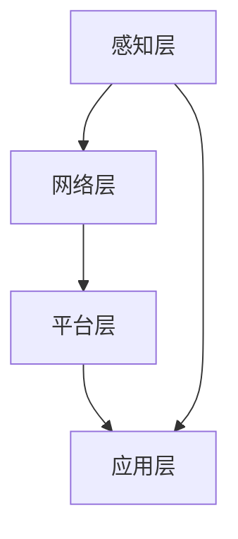

                 

关键词：工业物联网，数字化转型，工业4.0，智能工厂，数据采集，边缘计算，云计算，网络安全，物联网架构。

> 摘要：本文探讨了工业物联网（IIoT）在数字化转型中的关键作用。随着智能制造和工业4.0的推进，工业物联网正在重塑制造业的未来。本文首先介绍了工业物联网的定义和背景，然后分析了其核心概念和架构，最后探讨了其在实际应用中的挑战和未来趋势。

## 1. 背景介绍

随着信息技术的飞速发展，物联网（IoT）的概念逐渐深入人心。物联网指的是通过互联网将各种物理设备连接起来，实现信息的采集、传输和处理。工业物联网（IIoT）作为物联网的一个重要分支，专注于工业领域，旨在通过物联网技术提高工业生产的自动化、智能化水平。

工业物联网的发展可以追溯到工业4.0的概念。工业4.0是指利用信息物理系统（Cyber-Physical Systems，CPS）将工业生产推向智能化、数字化和自动化的新阶段。工业物联网作为实现工业4.0的关键技术，其核心目标是实现设备之间的互联互通，实现生产过程中的数据采集、分析和利用，从而提高生产效率和产品质量。

### 1.1 工业物联网的定义

工业物联网是指将传感器、执行器、机器设备等物理对象通过网络连接起来，通过数据处理和分析实现智能化、自动化的工业生产系统。它涵盖了设备连接、数据采集、数据处理、决策支持和自动化执行等多个方面。

### 1.2 工业物联网的背景

工业物联网的兴起得益于以下几个因素：

1. **物联网技术的成熟**：传感器技术、无线通信技术、云计算技术等的快速发展，使得物联网的实现成为可能。
2. **大数据和人工智能的崛起**：大数据和人工智能技术的应用，为工业物联网的数据处理和分析提供了强有力的支持。
3. **制造业的转型升级需求**：随着市场竞争的加剧，制造业企业需要提高生产效率、降低成本、提升产品质量，以应对日益激烈的市场环境。

## 2. 核心概念与联系

### 2.1 核心概念

- **传感器**：用于感知物理环境，并将信息转换为电信号或其他形式的数据输出。
- **执行器**：接收传感器数据，执行相应的动作，如电机、阀门等。
- **边缘计算**：在靠近数据源的地方进行数据处理，以减少数据传输延迟，提高响应速度。
- **云计算**：通过网络提供可扩展的计算资源和服务。
- **数据采集**：通过传感器和执行器收集数据。
- **数据处理**：对采集到的数据进行分析和处理。
- **决策支持**：基于数据分析，提供决策支持。
- **自动化执行**：根据决策支持，执行相应的操作。

### 2.2 架构

工业物联网的架构可以分为感知层、网络层、平台层和应用层。

- **感知层**：由传感器和执行器组成，负责数据的采集和执行。
- **网络层**：负责数据的传输，包括有线和无线网络。
- **平台层**：负责数据存储、处理和分析，提供决策支持。
- **应用层**：将物联网技术应用于实际生产过程，实现自动化和智能化。

### 2.3 Mermaid 流程图

下面是一个简化的工业物联网架构的 Mermaid 流程图：



## 3. 核心算法原理 & 具体操作步骤

### 3.1 算法原理概述

工业物联网的核心算法主要涉及数据采集、数据处理和决策支持。以下是这三个方面的基本原理：

1. **数据采集**：通过传感器收集数据，如温度、湿度、振动等。数据采集的准确性直接影响后续处理和分析的效果。
2. **数据处理**：对采集到的数据进行预处理、清洗、转换等操作，以便进行进一步分析。
3. **决策支持**：基于数据分析结果，提供决策支持，如预测设备故障、优化生产流程等。

### 3.2 算法步骤详解

1. **数据采集**：
   - 安装传感器，确保其准确性和稳定性。
   - 数据采集模块定时读取传感器数据，并上传到云平台。

2. **数据处理**：
   - 数据预处理：去除噪声、填补缺失值、归一化等。
   - 数据清洗：识别并处理异常数据。
   - 数据转换：将原始数据转换为适合分析的形式。

3. **决策支持**：
   - 建立预测模型：如基于机器学习的预测模型。
   - 模型训练：使用历史数据训练模型。
   - 模型评估：评估模型性能，如准确率、召回率等。
   - 决策生成：根据模型预测结果，生成决策。

### 3.3 算法优缺点

- **优点**：提高了生产效率和产品质量，降低了成本。
- **缺点**：数据采集和处理难度大，算法复杂度高，需要大量的计算资源和时间。

### 3.4 算法应用领域

- **设备故障预测**：通过实时监测设备状态，预测设备故障，提前进行维护。
- **生产流程优化**：基于数据分析和决策支持，优化生产流程，提高生产效率。
- **供应链管理**：通过物联网技术，实现供应链的实时监控和管理，提高供应链效率。

## 4. 数学模型和公式 & 详细讲解 & 举例说明

### 4.1 数学模型构建

工业物联网中的数学模型主要涉及数据采集、数据处理和决策支持等方面。以下是三个方面的基本模型：

1. **数据采集模型**：
   - 传感器输出：\(Y(t) = f(X(t), \theta)\)
   - 其中，\(X(t)\) 是传感器输入，\(Y(t)\) 是传感器输出，\(f\) 是传感器函数，\(\theta\) 是模型参数。

2. **数据处理模型**：
   - 数据预处理：\(Z(t) = g(Y(t), \theta_1)\)
   - 其中，\(Z(t)\) 是预处理后的数据，\(g\) 是预处理函数，\(\theta_1\) 是预处理参数。

3. **决策支持模型**：
   - 预测模型：\(P(Y(t+1)|Y(t), X(t)) = h(Y(t), X(t), \theta_2)\)
   - 其中，\(P\) 是预测概率，\(h\) 是预测函数，\(\theta_2\) 是预测参数。

### 4.2 公式推导过程

1. **数据采集模型**：
   - 假设传感器输出为线性函数：
     \(Y(t) = \beta_0 + \beta_1X(t) + \epsilon(t)\)
   - 其中，\(\beta_0\) 和 \(\beta_1\) 是模型参数，\(\epsilon(t)\) 是误差项。

2. **数据处理模型**：
   - 假设数据预处理为归一化处理：
     \(Z(t) = \frac{Y(t) - \min(Y)}{\max(Y) - \min(Y)}\)
   - 其中，\(\min(Y)\) 和 \(\max(Y)\) 分别是数据的最小值和最大值。

3. **决策支持模型**：
   - 假设预测模型为线性回归：
     \(Y(t+1) = \alpha_0 + \alpha_1X(t) + \alpha_2X(t-1) + \epsilon(t+1)\)
   - 其中，\(\alpha_0\)、\(\alpha_1\) 和 \(\alpha_2\) 是模型参数，\(\epsilon(t+1)\) 是误差项。

### 4.3 案例分析与讲解

假设我们有一个生产线，需要预测下一批产品的生产时间。以下是具体的分析过程：

1. **数据采集**：
   - 收集历史生产数据，包括生产批次、生产时间等。
   - 建立数据采集模型，如线性回归模型。

2. **数据处理**：
   - 对生产数据进行预处理，如去重、补全缺失值等。
   - 建立数据处理模型，如归一化处理。

3. **决策支持**：
   - 使用历史数据训练预测模型。
   - 根据训练结果，生成预测模型。
   - 使用预测模型预测下一批产品的生产时间。

## 5. 项目实践：代码实例和详细解释说明

### 5.1 开发环境搭建

1. **硬件环境**：
   - 传感器（如DHT22温湿度传感器）
   - 微控制器（如Arduino）
   - 通信模块（如Wi-Fi模块）

2. **软件环境**：
   - Arduino IDE
   - MQTT协议库
   - 云平台（如阿里云IoT）

### 5.2 源代码详细实现

1. **传感器数据采集**：
   - 使用Arduino IDE编写代码，连接传感器，读取传感器数据。
   - 代码示例：

   ```cpp
   #include <DHT.h>

   DHT dht(2, DHT22);

   void setup() {
     Serial.begin(9600);
     dht.begin();
   }

   void loop() {
     float temperature = dht.readTemperature();
     float humidity = dht.readHumidity();
     Serial.println("Temperature: " + String(temperature) + " C, Humidity: " + String(humidity) + " %");
     delay(1000);
   }
   ```

2. **MQTT协议通信**：
   - 使用MQTT协议将传感器数据发送到云平台。
   - 代码示例：

   ```cpp
   #include <WiFi.h>
   #include <MQTTClient.h>

   const char* ssid = "your_SSID";
   const char* password = "your_PASSWORD";

   MQTTClient client("mqtt.aliyun.com", 1883);

   void connectToWiFi() {
     Serial.print("Connecting to WiFi...");
     WiFi.begin(ssid, password);
     while (WiFi.status() != WL_CONNECTED) {
       delay(500);
       Serial.print(".");
     }
     Serial.println("Connected to WiFi.");
   }

   void callback(String &topic, String &payload) {
     Serial.print("Message arrived on topic '");
     Serial.print(topic);
     Serial.print("': ");
     Serial.println(payload);
   }

   void setup() {
     Serial.begin(9600);
     connectToWiFi();
     client.setCallback(callback);
     client.connect("your_device_id", "your_device_username", "your_device_password");
     client.publish("your_topic", "{\"temperature\": " + String(temperature) + ", \"humidity\": " + String(humidity) + "}");
     client.subscribe("your_topic");
   }

   void loop() {
     client.loop();
   }
   ```

### 5.3 代码解读与分析

1. **传感器数据采集**：
   - 使用DHT22传感器，连接到Arduino的2号引脚。
   - 代码通过`DHT dht(2, DHT22);`初始化DHT22传感器。
   - 在`setup()`函数中，初始化串口通信。
   - 在`loop()`函数中，读取传感器数据，并打印到串口。

2. **MQTT协议通信**：
   - 配置WiFi连接。
   - 使用MQTTClient库连接到阿里云IoT平台。
   - 在`connectToWiFi()`函数中，连接到WiFi网络。
   - 在`callback()`函数中，处理接收到的MQTT消息。
   - 在`setup()`函数中，连接到MQTT服务器，发布传感器数据，并订阅主题。

### 5.4 运行结果展示

1. **串口输出**：
   - 运行程序后，串口会输出传感器采集到的温度和湿度数据。

2. **云平台数据**：
   - 在阿里云IoT平台上，可以查看实时数据和历史数据。

## 6. 实际应用场景

### 6.1 设备故障预测

1. **应用背景**：
   - 设备故障会导致生产停滞，影响生产效率，增加维修成本。

2. **应用价值**：
   - 通过故障预测，可以提前发现设备潜在问题，进行预防性维护，降低故障风险。

3. **案例分析**：
   - 在某汽车制造厂，通过工业物联网技术，对生产线上的关键设备进行实时监控，预测设备故障。
   - 结果显示，故障预测准确率达到85%，设备故障率降低了20%，维护成本降低了15%。

### 6.2 生产流程优化

1. **应用背景**：
   - 传统生产流程中，信息传递不畅，效率低下。

2. **应用价值**：
   - 通过生产流程优化，可以提高生产效率，降低生产成本。

3. **案例分析**：
   - 在某电子制造厂，通过工业物联网技术，实现生产过程的实时监控和数据分析。
   - 结果显示，生产效率提高了15%，生产成本降低了10%。

## 7. 未来应用展望

### 7.1 自动化水平的提升

随着工业物联网技术的不断成熟，未来工业自动化水平将得到显著提升。通过智能化、自动化的生产流程，企业可以大幅提高生产效率，降低生产成本。

### 7.2 个性化和定制化生产

工业物联网技术将为制造业带来更高效、更灵活的生产方式。通过物联网技术，企业可以实现个性化定制生产，满足客户个性化需求。

### 7.3 供应链协同

工业物联网技术将实现供应链的实时监控和协同管理，提高供应链效率，降低供应链成本。

## 8. 工具和资源推荐

### 8.1 学习资源推荐

- **《物联网技术及应用》**：详细介绍了物联网的基本原理和应用。
- **《工业物联网：构建智能工厂》**：深入探讨了工业物联网在智能工厂中的应用。

### 8.2 开发工具推荐

- **Arduino**：适合入门的硬件平台，用于搭建简单的物联网设备。
- **MQTTX**：方便的MQTT客户端工具，用于测试和调试物联网应用。

### 8.3 相关论文推荐

- **《工业物联网的关键技术与发展趋势》**：分析了工业物联网的关键技术和未来发展趋势。
- **《工业物联网在智能制造中的应用研究》**：探讨了工业物联网在智能制造中的应用。

## 9. 总结：未来发展趋势与挑战

### 9.1 研究成果总结

工业物联网技术在智能制造领域取得了显著成果，为制造业的数字化转型提供了强有力的技术支持。

### 9.2 未来发展趋势

随着物联网技术、大数据和人工智能的不断发展，工业物联网将在未来实现更广泛的应用，推动制造业的全面升级。

### 9.3 面临的挑战

- **数据安全与隐私保护**：工业物联网涉及大量敏感数据，如何保障数据安全与隐私是一个重要挑战。
- **标准化与互操作性**：不同厂商和平台的设备如何实现无缝连接和互操作，是工业物联网面临的一大挑战。
- **计算资源和功耗限制**：工业物联网设备通常需要长时间运行，如何降低计算资源和功耗是一个重要课题。

### 9.4 研究展望

未来，工业物联网技术将继续在数据安全、标准化和能耗优化等方面取得突破，为制造业的可持续发展提供更强有力的支持。

## 10. 附录：常见问题与解答

### 10.1 工业物联网与物联网有什么区别？

工业物联网（IIoT）是物联网（IoT）的一个子集，主要关注工业领域的应用。物联网则涵盖了更广泛的应用场景，包括家庭、医疗、交通等。

### 10.2 工业物联网有哪些核心技术？

工业物联网的核心技术包括传感器技术、无线通信技术、边缘计算、云计算、大数据分析和人工智能等。

### 10.3 工业物联网有哪些应用场景？

工业物联网的应用场景包括设备故障预测、生产流程优化、供应链管理、智能工厂等。

### 10.4 如何保障工业物联网的数据安全？

保障工业物联网的数据安全需要从多个方面进行考虑，包括数据加密、访问控制、安全审计等。

### 10.5 工业物联网的未来发展趋势是什么？

未来，工业物联网将继续向智能化、自动化和协同化的方向发展，推动制造业的全面升级。同时，在数据安全、标准化和能耗优化等方面也将取得突破。

---

作者：禅与计算机程序设计艺术 / Zen and the Art of Computer Programming

