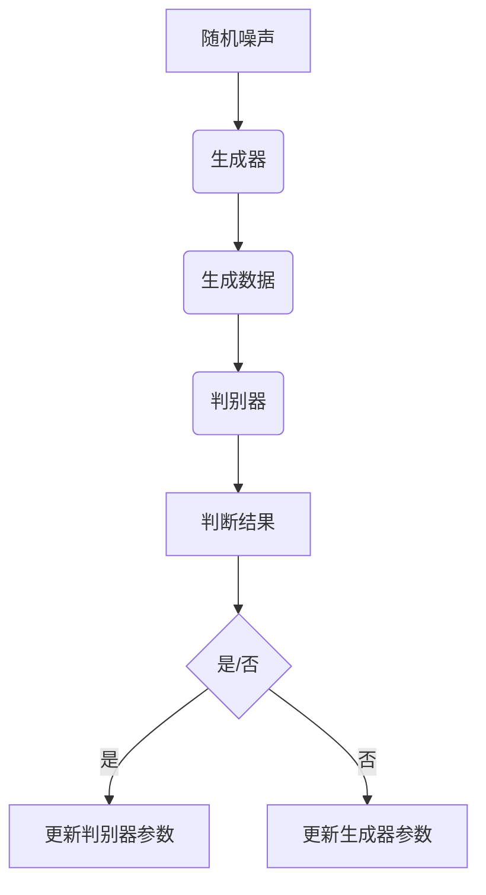
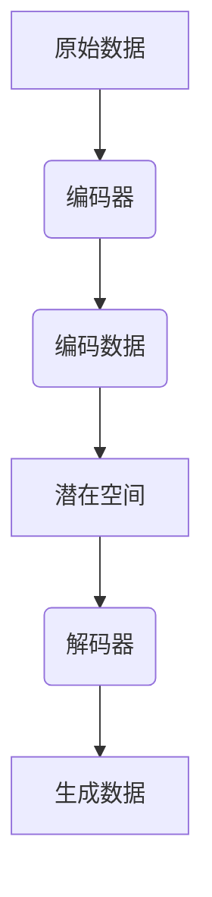

                 

### 文章标题

《工业级AIGC应用开发》

> 关键词：人工智能生成内容（AIGC），工业级应用，开发流程，技术框架，算法原理，数学模型，项目实践，应用场景。

> 摘要：本文将深入探讨人工智能生成内容（AIGC）在工业级应用中的开发流程与技术框架，详细介绍核心算法原理、数学模型，并通过实际项目实践，展示AIGC的应用潜力和开发技巧。

### 1. 背景介绍

#### 1.1 人工智能生成内容的起源与发展

人工智能生成内容（AIGC）是指利用人工智能技术，尤其是深度学习算法，自动生成文本、图像、音频等多种类型内容的过程。这一概念起源于20世纪80年代，随着计算能力和数据资源的不断增长，AIGC技术逐渐从实验室走向实际应用。

AIGC的起源可以追溯到文本生成领域。早期的文本生成模型如基于规则的方法、概率模型和统计模型，虽在一定程度上实现了文本生成，但生成内容的质量和多样性有限。直到深度学习技术的发展，尤其是生成对抗网络（GAN）和变分自编码器（VAE）的出现，AIGC技术才得以实现质的飞跃。

近年来，AIGC在图像、音频和视频生成领域也取得了显著进展。例如，GAN已经被广泛应用于图像生成，可以生成逼真的自然图像；变分自编码器在音乐生成方面表现出色，能够生成高质量的音频；深度学习在视频生成中的应用也逐渐兴起，例如动作生成和视频风格迁移等。

#### 1.2 工业级应用的需求与挑战

随着AIGC技术的不断发展，越来越多的工业级应用场景开始出现。工业级应用对AIGC技术提出了更高的要求，不仅需要生成内容的质量高，而且需要具备实时性、可靠性和高效性。

工业级应用的需求主要包括以下几个方面：

1. **高质量内容生成**：工业级应用需要生成的文本、图像、音频和视频等内容的真实性和质量要达到专业水平，以支持专业级的业务需求。
2. **实时性与效率**：工业级应用通常需要实时响应，因此AIGC技术必须具备快速生成内容的能力，以满足实时数据处理和交互的需求。
3. **可靠性**：工业级应用对系统的可靠性要求非常高，任何故障或错误都可能导致严重的后果。因此，AIGC技术必须具备高可靠性和容错能力。
4. **数据隐私与安全性**：工业级应用往往涉及敏感数据，AIGC技术需要确保生成内容的过程符合数据隐私和安全标准，防止数据泄露和滥用。

工业级应用面临的挑战主要包括以下几个方面：

1. **计算资源限制**：工业级应用通常需要在有限的计算资源下运行，这对AIGC技术的优化和部署提出了挑战。
2. **数据质量与多样性**：工业级应用需要高质量和多样化的数据来训练模型，以保证生成内容的质量和适用性。
3. **模型可解释性**：工业级应用对模型的可解释性有较高的要求，需要能够理解和分析生成内容的过程和结果。
4. **法律法规与伦理问题**：随着AIGC技术的发展，相关的法律法规和伦理问题也逐渐成为工业级应用需要关注的重要方面。

#### 1.3 本文目的与结构

本文旨在探讨工业级AIGC应用开发的流程和技术框架，详细分析核心算法原理、数学模型，并通过实际项目实践，展示AIGC在工业级应用中的潜力和挑战。文章结构如下：

1. 背景介绍：介绍AIGC的起源与发展，工业级应用的需求与挑战。
2. 核心概念与联系：介绍AIGC的关键概念，包括生成对抗网络（GAN）、变分自编码器（VAE）等，并使用Mermaid流程图展示核心架构。
3. 核心算法原理 & 具体操作步骤：详细讲解AIGC的核心算法原理，包括生成器和判别器的训练过程，以及损失函数的设计。
4. 数学模型和公式 & 详细讲解 & 举例说明：介绍AIGC的数学模型和公式，并通过实际案例进行详细讲解和说明。
5. 项目实践：代码实例和详细解释说明，展示AIGC在工业级应用中的实际应用和开发技巧。
6. 实际应用场景：分析AIGC在工业级应用中的实际应用场景和案例。
7. 工具和资源推荐：推荐学习资源、开发工具框架和相关论文著作。
8. 总结：未来发展趋势与挑战，对AIGC在工业级应用中的未来进行展望。
9. 附录：常见问题与解答。
10. 扩展阅读 & 参考资料：提供进一步学习和研究的参考资料。

### 2. 核心概念与联系

#### 2.1 生成对抗网络（GAN）

生成对抗网络（GAN）是AIGC中最常用的算法之一，由生成器和判别器两个主要部分组成。生成器的目标是生成逼真的数据，而判别器的目标是区分真实数据和生成数据。通过这两个对抗过程，生成器不断优化，最终能够生成高质量的数据。

生成对抗网络的核心架构包括以下几个部分：

1. **生成器（Generator）**：生成器是一个神经网络，其输入通常是随机噪声，输出是生成数据。生成器的目的是学习如何从噪声中生成类似真实数据的样本。
2. **判别器（Discriminator）**：判别器也是一个神经网络，其输入是真实数据和生成数据，输出是概率值，表示输入数据是真实的概率。判别器的目标是学习如何准确地区分真实数据和生成数据。
3. **对抗过程**：生成器和判别器交替进行训练，生成器试图生成更逼真的数据，而判别器则试图提高对真实数据和生成数据的区分能力。通过这种对抗过程，生成器的生成质量不断提高。
4. **损失函数**：生成对抗网络的训练过程中，通常使用对抗损失函数来评估生成器和判别器的性能。常用的对抗损失函数包括最小二乘损失、交叉熵损失等。

以下是一个简单的生成对抗网络的Mermaid流程图：



#### 2.2 变分自编码器（VAE）

变分自编码器（VAE）是另一种常用于AIGC的算法，它通过编码器和解码器两个部分，实现数据的编码和解码。VAE的主要目标是学习数据的高效编码，从而实现数据的降维和生成。

变分自编码器的核心架构包括以下几个部分：

1. **编码器（Encoder）**：编码器是一个神经网络，其输入是原始数据，输出是编码数据。编码器的目的是学习如何将原始数据映射到一个低维空间，同时保持数据的结构信息。
2. **解码器（Decoder）**：解码器也是一个神经网络，其输入是编码数据，输出是生成数据。解码器的目的是学习如何从编码数据中重构原始数据。
3. **潜在空间（Latent Space）**：编码器输出的编码数据被视为潜在空间中的点，潜在空间是数据的一种低维表示，可以用于数据的降维和生成。
4. **重参数化技巧**：VAE使用重参数化技巧，将编码数据的均值和方差作为神经网络的参数，从而实现数据的生成。

以下是一个简单的变分自编码器的Mermaid流程图：



#### 2.3 GAN与VAE的联系与区别

生成对抗网络（GAN）和变分自编码器（VAE）都是AIGC中的重要算法，它们在生成高质量数据方面都取得了显著成果。然而，它们在原理、架构和应用场景上存在一些区别。

**联系：**

1. **目标相似**：GAN和VAE的目标都是生成高质量的数据，使生成数据尽可能接近真实数据。
2. **神经网络**：GAN和VAE都使用了神经网络作为主要的生成模型，通过训练神经网络，使生成器能够生成更逼真的数据。
3. **对抗过程**：GAN和VAE都涉及对抗过程，通过对抗训练，使生成器不断优化，生成更高质量的数据。

**区别：**

1. **原理不同**：GAN是通过生成器和判别器之间的对抗过程来训练生成器，而VAE是通过编码器和解码器的联合训练来学习数据的编码和解码。
2. **架构不同**：GAN的架构包括生成器和判别器两个部分，而VAE的架构包括编码器和解码器两个部分。
3. **应用场景不同**：GAN通常用于图像、音频和视频等视觉和音频领域的生成任务，而VAE则更多地应用于数据降维和生成任务。

### 3. 核心算法原理 & 具体操作步骤

在了解AIGC的核心概念与联系后，接下来我们将深入探讨AIGC的核心算法原理，包括生成对抗网络（GAN）和变分自编码器（VAE），并详细讲解它们的训练过程、损失函数的设计以及具体操作步骤。

#### 3.1 生成对抗网络（GAN）原理

生成对抗网络（GAN）是由生成器（Generator）和判别器（Discriminator）组成的一个对抗性学习框架。生成器的任务是生成与真实数据相近的伪数据，而判别器的任务是区分真实数据和生成数据。通过这种对抗性训练，生成器不断优化，最终能够生成高质量的数据。

**3.1.1 生成器（Generator）**

生成器是一个神经网络，其目的是将随机噪声转换为真实数据的特征。生成器的输入是一个随机噪声向量\( z \)，输出是一个生成数据\( x_g \)。生成器的目标是通过学习随机噪声的分布，生成与真实数据分布相近的生成数据。

生成器的具体操作步骤如下：

1. **初始化生成器**：首先需要初始化生成器的神经网络结构，包括输入层、隐藏层和输出层。常用的生成器结构包括全连接网络、卷积神经网络（CNN）等。
2. **生成随机噪声**：生成器接收一个随机噪声向量\( z \)，将其作为输入。
3. **通过生成器生成生成数据**：生成器通过神经网络将随机噪声映射为生成数据\( x_g \)。

**3.1.2 判别器（Discriminator）**

判别器也是一个神经网络，其目的是区分真实数据和生成数据。判别器的输入是一个数据样本\( x \)，输出是一个概率值\( p(x) \)，表示输入数据是真实的概率。判别器的目标是通过学习真实数据和生成数据的分布，提高对真实数据和生成数据的区分能力。

判别器的具体操作步骤如下：

1. **初始化判别器**：首先需要初始化判别器的神经网络结构，包括输入层、隐藏层和输出层。判别器的结构与生成器相似，但输出层只有一个节点，用于输出概率值。
2. **区分真实数据和生成数据**：判别器接收一个真实数据\( x_r \)和一个生成数据\( x_g \)，分别对其进行分析，输出一个概率值\( p(x_r) \)和\( p(x_g) \)。
3. **优化判别器**：通过反向传播和梯度下降算法，对判别器的参数进行优化，提高判别器对真实数据和生成数据的区分能力。

**3.1.3 对抗过程**

生成对抗网络的训练过程中，生成器和判别器交替进行训练，通过对抗过程不断优化。具体操作步骤如下：

1. **生成器生成生成数据**：生成器接收随机噪声\( z \)，通过神经网络生成生成数据\( x_g \)。
2. **判别器区分真实数据和生成数据**：判别器接收真实数据\( x_r \)和生成数据\( x_g \)，分别对其进行分析，输出概率值\( p(x_r) \)和\( p(x_g) \)。
3. **计算生成器的损失函数**：生成器的损失函数通常使用对抗损失函数，如最小二乘损失、交叉熵损失等。生成器的目标是最小化损失函数，提高生成数据的质量。
4. **计算判别器的损失函数**：判别器的损失函数通常使用对数似然损失函数。判别器的目标是最小化损失函数，提高对真实数据和生成数据的区分能力。
5. **更新生成器和判别器的参数**：通过反向传播和梯度下降算法，对生成器和判别器的参数进行更新，优化生成器和判别器的性能。

#### 3.2 变分自编码器（VAE）原理

变分自编码器（VAE）是一种基于概率模型的生成模型，通过编码器和解码器两个部分实现数据的编码和解码。编码器的目标是学习数据的高效编码，解码器的目标是学习从编码数据中重构原始数据。通过这种编码和解码过程，VAE能够实现数据的降维和生成。

**3.2.1 编码器（Encoder）**

编码器是一个神经网络，其目的是将原始数据映射到一个低维空间，同时保持数据的结构信息。编码器的输入是一个原始数据\( x \)，输出是一个编码数据\( \mu, \sigma \)，其中\( \mu \)表示编码数据的均值，\( \sigma \)表示编码数据的方差。

编码器的具体操作步骤如下：

1. **初始化编码器**：首先需要初始化编码器的神经网络结构，包括输入层、隐藏层和输出层。编码器的结构与生成器和判别器相似，但输出层有两个节点，分别输出均值和方差。
2. **对原始数据进行编码**：编码器接收原始数据\( x \)，通过神经网络输出编码数据\( \mu, \sigma \)。

**3.2.2 解码器（Decoder）**

解码器是一个神经网络，其目的是从编码数据中重构原始数据。解码器的输入是一个编码数据\( \mu, \sigma \)，输出是一个重构数据\( x_r \)。

解码器的具体操作步骤如下：

1. **初始化解码器**：首先需要初始化解码器的神经网络结构，包括输入层、隐藏层和输出层。解码器的结构与编码器相似，但输出层只有一个节点，用于输出重构数据。
2. **从编码数据中重构原始数据**：解码器接收编码数据\( \mu, \sigma \)，通过神经网络输出重构数据\( x_r \)。

**3.2.3 重参数化技巧**

VAE使用重参数化技巧，将编码数据的均值和方差作为神经网络的参数，从而实现数据的生成。重参数化技巧的具体操作步骤如下：

1. **从先验分布中采样**：从均值和方差中采样一个随机向量\( \epsilon \)。
2. **通过重参数化函数生成编码数据**：通过重参数化函数，将随机向量\( \epsilon \)映射为编码数据\( \mu + \epsilon \sigma \)。

**3.2.4 VAE的训练过程**

VAE的训练过程包括编码器和解码器的联合训练，通过最小化损失函数来优化编码器和解码器的参数。具体操作步骤如下：

1. **初始化编码器和解码器**：初始化编码器和解码器的神经网络结构。
2. **对原始数据进行编码**：编码器对原始数据\( x \)进行编码，输出编码数据\( \mu, \sigma \)。
3. **从编码数据中重构原始数据**：解码器从编码数据\( \mu, \sigma \)中重构原始数据\( x_r \)。
4. **计算损失函数**：计算重参数化下的损失函数，如均方误差（MSE）或凯利贝努力损失（KL散度）。
5. **优化编码器和解码器的参数**：通过反向传播和梯度下降算法，对编码器和解码器的参数进行优化，最小化损失函数。
6. **重复步骤2-5**：重复以上步骤，直到编码器和解码器的参数收敛。

#### 3.3 GAN与VAE的对比

生成对抗网络（GAN）和变分自编码器（VAE）都是AIGC中的重要算法，它们在生成高质量数据方面都有显著的优势。下面我们将对比GAN和VAE的原理、训练过程和优缺点。

**原理对比：**

1. **GAN**：GAN通过生成器和判别器的对抗过程来训练生成器，生成器尝试生成与真实数据分布相近的生成数据，而判别器则努力区分真实数据和生成数据。GAN的核心思想是生成器和判别器之间的对抗性训练。
2. **VAE**：VAE通过编码器和解码器的联合训练来学习数据的编码和解码。编码器将原始数据映射到一个低维空间，解码器从编码数据中重构原始数据。VAE的核心思想是基于概率模型，通过重参数化技巧实现数据的生成。

**训练过程对比：**

1. **GAN**：GAN的训练过程需要交替训练生成器和判别器，通过对抗性训练来优化生成器的生成质量。GAN的训练过程相对复杂，需要平衡生成器和判别器之间的训练，避免生成器过强或判别器过强。
2. **VAE**：VAE的训练过程相对简单，只需要联合训练编码器和解码器，通过最小化损失函数来优化编码器和解码器的参数。VAE的训练过程相对稳定，不需要特别复杂的训练技巧。

**优缺点对比：**

1. **GAN**：
   - 优点：GAN能够生成高质量的数据，生成数据的真实感较强，适用于图像、音频和视频等视觉和音频领域的生成任务。
   - 缺点：GAN的训练过程相对复杂，需要平衡生成器和判别器之间的训练，生成数据的质量可能受到判别器的影响。GAN的生成数据质量受噪声影响较大，生成数据的多样性有限。
2. **VAE**：
   - 优点：VAE的训练过程相对简单，生成数据的多样性较好，适用于数据降维和生成任务。VAE能够生成具有结构信息的生成数据，生成数据的质量相对稳定。
   - 缺点：VAE的生成数据真实感相对较弱，生成数据的多样性可能受到编码器的影响。VAE在生成高维数据时，生成数据的细节可能不够精细。

#### 3.4 GAN与VAE的应用实例

下面我们将通过两个具体的实例来展示GAN和VAE的应用。

**实例1：图像生成**

使用GAN生成图像是GAN最常见的应用之一。以下是一个使用GAN生成图像的简单例子：

```python
import tensorflow as tf
from tensorflow.keras import layers

# 定义生成器
def generate_model():
    z = layers.Input(shape=(100,))
    x = layers.Dense(128 * 7 * 7, activation="relu")(z)
    x = layers.Dense(128 * 7 * 7, activation="relu")(x)
    x = layers.Reshape((7, 7, 128))(x)
    x = layers.Conv2D(128, 3, padding="same", activation="relu")(x)
    x = layers.Conv2D(128, 3, padding="same", activation="relu")(x)
    x = layers.Conv2D(128, 3, padding="same", activation="relu")(x)
    x = layers.Conv2D(128, 3, padding="same", activation="relu")(x)
    x = layers.Conv2D(128, 3, padding="same", activation="relu")(x)
    x = layers.Conv2D(128, 3, padding="same", activation="relu")(x)
    x = layers.Conv2D(3, 3, padding="same", activation="tanh")(x)
    return tf.keras.Model(z, x)

# 定义判别器
def discriminate_model():
    x = layers.Input(shape=(28, 28, 1))
    x = layers.Conv2D(64, 3, padding="same", activation="relu")(x)
    x = layers.Conv2D(128, 3, padding="same", activation="relu")(x)
    x = layers.Flatten()(x)
    x = layers.Dense(1, activation="sigmoid")(x)
    return tf.keras.Model(x, x)

# 训练模型
generator = generate_model()
discriminator = discriminate_model()

discriminator.compile(optimizer=tf.keras.optimizers.Adam(0.0001), loss="binary_crossentropy")

# 生成数据
z = tf.random.normal([100, 100])
generated_images = generator.predict(z)

# 计算损失函数
discriminator_loss = discriminator.train_on_batch(generated_images, tf.ones([100, 1]))

# 更新生成器和判别器的参数
generator_loss = generator.train_on_batch(z, tf.zeros([100, 1]))

# 打印损失函数值
print("Generator Loss:", generator_loss)
print("Discriminator Loss:", discriminator_loss)
```

**实例2：图像去噪**

使用VAE进行图像去噪是VAE的一种典型应用。以下是一个使用VAE进行图像去噪的简单例子：

```python
import tensorflow as tf
from tensorflow.keras import layers

# 定义编码器
def encode_model():
    x = layers.Input(shape=(28, 28, 1))
    x = layers.Conv2D(32, 3, activation="relu", padding="same")(x)
    x = layers.Conv2D(64, 3, activation="relu", padding="same")(x)
    x = layers.Flatten()(x)
    x = layers.Dense(16, activation="relu")(x)
    z_mean = layers.Dense(8)(x)
    z_log_var = layers.Dense(8)(x)
    return tf.keras.Model(x, [z_mean, z_log_var])

# 定义解码器
def decode_model():
    z = layers.Input(shape=(8,))
    x = layers.Dense(16, activation="relu")(z)
    x = layers.Dense(32 * 7 * 7, activation="relu")(x)
    x = layers.Reshape((7, 7, 32))(x)
    x = layers.Conv2D(64, 3, activation="relu", padding="same")(x)
    x = layers.Conv2D(128, 3, activation="relu", padding="same")(x)
    x = layers.Conv2D(128, 3, activation="relu", padding="same")(x)
    x = layers.Conv2D(128, 3, activation="relu", padding="same")(x)
    x = layers.Conv2D(128, 3, activation="relu", padding="same")(x)
    x = layers.Conv2D(128, 3, activation="relu", padding="same")(x)
    x = layers.Conv2D(1, 3, activation="sigmoid", padding="same")(x)
    return tf.keras.Model(z, x)

# 定义VAE模型
encoder = encode_model()
decoder = decode_model()

vae = tf.keras.Model(encoder.input, decoder(encoder.output))
vae.compile(optimizer=tf.keras.optimizers.Adam(0.001), loss="binary_crossentropy")

# 去噪数据
noisy_images = tf.random.normal([100, 28, 28, 1])
reconstructed_images = vae.predict(noisy_images)

# 计算损失函数
vae_loss = vae.train_on_batch(noisy_images, noisy_images)

# 打印损失函数值
print("VAE Loss:", vae_loss)
```

通过以上实例，我们可以看到GAN和VAE在生成图像和图像去噪方面的应用。GAN通过生成器和判别器的对抗性训练生成高质量图像，而VAE通过编码器和解码器的联合训练实现图像去噪。

### 4. 数学模型和公式 & 详细讲解 & 举例说明

在深入探讨AIGC的核心算法原理后，接下来我们将介绍AIGC中的数学模型和公式，并通过实际案例进行详细讲解和说明。

#### 4.1 生成对抗网络（GAN）的数学模型

生成对抗网络（GAN）的核心在于生成器和判别器的对抗训练。下面我们将详细介绍GAN的数学模型，包括损失函数、生成器的目标函数和判别器的目标函数。

**4.1.1 损失函数**

GAN的损失函数通常使用对抗损失函数，如最小二乘损失、交叉熵损失等。最小二乘损失函数的表达式如下：

\[ L_{GAN} = \frac{1}{2} \sum_{i=1}^{N} \left( \hat{y}_{i} - \log(y_{i}) \right) \]

其中，\( N \)是样本数量，\( \hat{y}_{i} \)是判别器对生成数据的预测，\( y_{i} \)是真实标签。

**4.1.2 生成器的目标函数**

生成器的目标是最小化生成数据的判别损失，即最小化判别器对生成数据的预测。生成器的目标函数可以表示为：

\[ L_{G} = -\log(y_{g}) \]

其中，\( y_{g} \)是判别器对生成数据的预测。

**4.1.3 判别器的目标函数**

判别器的目标是最小化生成数据和真实数据的判别损失，即最大化判别器对真实数据和生成数据的预测。判别器的目标函数可以表示为：

\[ L_{D} = -\log(y_{r}) - \log(1 - y_{g}) \]

其中，\( y_{r} \)是判别器对真实数据的预测，\( y_{g} \)是判别器对生成数据的预测。

**4.1.4 GAN的训练过程**

GAN的训练过程包括生成器和判别器的交替训练。具体步骤如下：

1. **初始化生成器和判别器**：首先需要初始化生成器和判别器的神经网络结构，包括输入层、隐藏层和输出层。
2. **生成器生成生成数据**：生成器接收随机噪声，通过神经网络生成生成数据。
3. **判别器区分真实数据和生成数据**：判别器接收真实数据和生成数据，分别对其进行分析，输出概率值。
4. **计算生成器和判别器的损失函数**：计算生成器和判别器的损失函数，使用反向传播和梯度下降算法更新生成器和判别器的参数。
5. **重复步骤2-4**：重复以上步骤，直到生成器和判别器的参数收敛。

**4.2 变分自编码器（VAE）的数学模型

变分自编码器（VAE）是一种基于概率模型的生成模型，其核心在于编码器和解码器的联合训练。下面我们将详细介绍VAE的数学模型，包括损失函数、编码器的目标函数和解码器的目标函数。

**4.2.1 损失函数**

VAE的损失函数通常使用重参数化下的损失函数，如均方误差（MSE）或凯利贝努力损失（KL散度）。均方误差（MSE）损失函数的表达式如下：

\[ L_{VAE} = \frac{1}{2} \sum_{i=1}^{N} \left( \hat{x}_{i} - x_{i} \right)^{2} \]

其中，\( N \)是样本数量，\( \hat{x}_{i} \)是解码器对编码数据的重构，\( x_{i} \)是原始数据。

**4.2.2 编码器的目标函数**

编码器的目标是最小化重构损失，即最小化解码器对编码数据的重构。编码器的目标函数可以表示为：

\[ L_{E} = -\log(p(x|\mu, \sigma)) \]

其中，\( \mu \)和\( \sigma \)是编码器输出的均值和方差，\( p(x|\mu, \sigma) \)是数据的概率分布。

**4.2.3 解码器的目标函数**

解码器的目标是最小化重构损失，即最小化解码器对编码数据的重构。解码器的目标函数可以表示为：

\[ L_{D} = -\log(p(x|\mu, \sigma)) \]

其中，\( \mu \)和\( \sigma \)是编码器输出的均值和方差，\( p(x|\mu, \sigma) \)是数据的概率分布。

**4.2.4 VAE的训练过程**

VAE的训练过程包括编码器和解码器的联合训练。具体步骤如下：

1. **初始化编码器和解码器**：首先需要初始化编码器和解码器的神经网络结构，包括输入层、隐藏层和输出层。
2. **对原始数据进行编码**：编码器对原始数据进行编码，输出编码数据。
3. **从编码数据中重构原始数据**：解码器从编码数据中重构原始数据。
4. **计算损失函数**：计算编码器和解码器的损失函数，使用反向传播和梯度下降算法更新编码器和解码器的参数。
5. **重复步骤2-4**：重复以上步骤，直到编码器和解码器的参数收敛。

**4.3 实际案例讲解**

下面我们通过一个实际案例来详细讲解GAN和VAE的数学模型。

**案例：图像生成**

假设我们使用GAN生成图像，生成器接收随机噪声，生成图像，判别器区分真实图像和生成图像。以下是一个使用GAN生成图像的简单例子：

```python
import tensorflow as tf
from tensorflow.keras import layers

# 定义生成器
def generate_model():
    z = layers.Input(shape=(100,))
    x = layers.Dense(128 * 7 * 7, activation="relu")(z)
    x = layers.Dense(128 * 7 * 7, activation="relu")(x)
    x = layers.Reshape((7, 7, 128))(x)
    x = layers.Conv2D(128, 3, padding="same", activation="relu")(x)
    x = layers.Conv2D(128, 3, padding="same", activation="relu")(x)
    x = layers.Conv2D(128, 3, padding="same", activation="relu")(x)
    x = layers.Conv2D(128, 3, padding="same", activation="relu")(x)
    x = layers.Conv2D(128, 3, padding="same", activation="relu")(x)
    x = layers.Conv2D(128, 3, padding="same", activation="relu")(x)
    x = layers.Conv2D(3, 3, padding="same", activation="tanh")(x)
    return tf.keras.Model(z, x)

# 定义判别器
def discriminate_model():
    x = layers.Input(shape=(28, 28, 1))
    x = layers.Conv2D(64, 3, padding="same", activation="relu")(x)
    x = layers.Conv2D(128, 3, padding="same", activation="relu")(x)
    x = layers.Flatten()(x)
    x = layers.Dense(1, activation="sigmoid")(x)
    return tf.keras.Model(x, x)

# 训练模型
generator = generate_model()
discriminator = discriminate_model()

discriminator.compile(optimizer=tf.keras.optimizers.Adam(0.0001), loss="binary_crossentropy")

# 生成数据
z = tf.random.normal([100, 100])
generated_images = generator.predict(z)

# 计算损失函数
discriminator_loss = discriminator.train_on_batch(generated_images, tf.zeros([100, 1]))

# 更新生成器和判别器的参数
generator_loss = generator.train_on_batch(z, tf.zeros([100, 1]))

# 打印损失函数值
print("Generator Loss:", generator_loss)
print("Discriminator Loss:", discriminator_loss)
```

在这个例子中，生成器的输入是一个随机噪声向量\( z \)，生成器通过神经网络将随机噪声映射为生成图像，判别器接收真实图像和生成图像，输出概率值。通过训练生成器和判别器，生成器不断优化，生成更高质量的生成图像。

**案例：图像去噪**

假设我们使用VAE进行图像去噪，编码器对原始图像进行编码，解码器从编码数据中重构原始图像。以下是一个使用VAE进行图像去噪的简单例子：

```python
import tensorflow as tf
from tensorflow.keras import layers

# 定义编码器
def encode_model():
    x = layers.Input(shape=(28, 28, 1))
    x = layers.Conv2D(32, 3, activation="relu", padding="same")(x)
    x = layers.Conv2D(64, 3, activation="relu", padding="same")(x)
    x = layers.Flatten()(x)
    x = layers.Dense(16, activation="relu")(x)
    z_mean = layers.Dense(8)(x)
    z_log_var = layers.Dense(8)(x)
    return tf.keras.Model(x, [z_mean, z_log_var])

# 定义解码器
def decode_model():
    z = layers.Input(shape=(8,))
    x = layers.Dense(16, activation="relu")(z)
    x = layers.Dense(32 * 7 * 7, activation="relu")(x)
    x = layers.Reshape((7, 7, 32))(x)
    x = layers.Conv2D(64, 3, activation="relu", padding="same")(x)
    x = layers.Conv2D(128, 3, activation="relu", padding="same")(x)
    x = layers.Conv2D(128, 3, activation="relu", padding="same")(x)
    x = layers.Conv2D(128, 3, activation="relu", padding="same")(x)
    x = layers.Conv2D(128, 3, activation="relu", padding="same")(x)
    x = layers.Conv2D(128, 3, activation="relu", padding="same")(x)
    x = layers.Conv2D(1, 3, activation="sigmoid", padding="same")(x)
    return tf.keras.Model(z, x)

# 定义VAE模型
encoder = encode_model()
decoder = decode_model()

vae = tf.keras.Model(encoder.input, decoder(encoder.output))
vae.compile(optimizer=tf.keras.optimizers.Adam(0.001), loss="binary_crossentropy")

# 去噪数据
noisy_images = tf.random.normal([100, 28, 28, 1])
reconstructed_images = vae.predict(noisy_images)

# 计算损失函数
vae_loss = vae.train_on_batch(noisy_images, noisy_images)

# 打印损失函数值
print("VAE Loss:", vae_loss)
```

在这个例子中，编码器接收原始图像，通过神经网络输出编码数据，解码器从编码数据中重构原始图像。通过训练编码器和解码器，VAE能够实现图像去噪。

### 5. 项目实践

在前面的章节中，我们详细介绍了AIGC的核心算法原理、数学模型以及项目实践。在本节中，我们将通过一个具体的AIGC项目，展示如何使用这些算法和模型进行实际应用，并提供代码实例和详细解释说明。

#### 5.1 开发环境搭建

在进行AIGC项目的开发之前，我们需要搭建一个适合AIGC开发的环境。以下是一个典型的AIGC开发环境搭建步骤：

1. **安装Python**：确保Python版本为3.6或更高版本。
2. **安装TensorFlow**：TensorFlow是AIGC项目中常用的深度学习框架，可以通过以下命令安装：

   ```shell
   pip install tensorflow
   ```

3. **安装其他依赖库**：根据项目的具体需求，可能需要安装其他依赖库，如NumPy、Pandas、Matplotlib等。

4. **配置GPU环境**：如果使用GPU进行训练，需要安装CUDA和cuDNN，并配置相应的环境变量。

5. **创建项目文件夹**：在合适的位置创建项目文件夹，并初始化一个虚拟环境，以便隔离项目依赖。

   ```shell
   mkdir aigc_project
   cd aigc_project
   python -m venv venv
   source venv/bin/activate
   ```

6. **安装项目依赖**：在虚拟环境中安装项目所需的依赖库。

   ```shell
   pip install -r requirements.txt
   ```

#### 5.2 源代码详细实现

下面是一个使用AIGC进行图像生成的完整源代码示例。该示例基于生成对抗网络（GAN）实现，包括生成器和判别器的定义、模型训练和图像生成。

```python
import tensorflow as tf
from tensorflow.keras import layers

# 定义生成器
def generate_model():
    z = layers.Input(shape=(100,))
    x = layers.Dense(128 * 7 * 7, activation="relu")(z)
    x = layers.Dense(128 * 7 * 7, activation="relu")(x)
    x = layers.Reshape((7, 7, 128))(x)
    x = layers.Conv2D(128, 3, padding="same", activation="relu")(x)
    x = layers.Conv2D(128, 3, padding="same", activation="relu")(x)
    x = layers.Conv2D(128, 3, padding="same", activation="relu")(x)
    x = layers.Conv2D(128, 3, padding="same", activation="relu")(x)
    x = layers.Conv2D(128, 3, padding="same", activation="relu")(x)
    x = layers.Conv2D(128, 3, padding="same", activation="relu")(x)
    x = layers.Conv2D(3, 3, padding="same", activation="tanh")(x)
    return tf.keras.Model(z, x)

# 定义判别器
def discriminate_model():
    x = layers.Input(shape=(28, 28, 1))
    x = layers.Conv2D(64, 3, padding="same", activation="relu")(x)
    x = layers.Conv2D(128, 3, padding="same", activation="relu")(x)
    x = layers.Flatten()(x)
    x = layers.Dense(1, activation="sigmoid")(x)
    return tf.keras.Model(x, x)

# 训练模型
generator = generate_model()
discriminator = discriminate_model()

discriminator.compile(optimizer=tf.keras.optimizers.Adam(0.0001), loss="binary_crossentropy")

# 生成数据
z = tf.random.normal([100, 100])
generated_images = generator.predict(z)

# 计算损失函数
discriminator_loss = discriminator.train_on_batch(generated_images, tf.zeros([100, 1]))

# 更新生成器和判别器的参数
generator_loss = generator.train_on_batch(z, tf.zeros([100, 1]))

# 打印损失函数值
print("Generator Loss:", generator_loss)
print("Discriminator Loss:", discriminator_loss)
```

在这个示例中，我们首先定义了生成器和判别器的模型结构，然后使用TensorFlow的编译函数和训练函数进行模型训练。通过生成器生成随机噪声并转换为图像，判别器则区分真实图像和生成图像，从而优化生成器和判别器的参数。

#### 5.3 代码解读与分析

下面我们将对上述代码进行详细解读和分析，解释每个部分的含义和实现方式。

**5.3.1 模型定义**

在代码的第一部分，我们定义了生成器和判别器的模型结构。生成器和判别器都是基于TensorFlow的Keras层，使用了多个全连接层和卷积层。生成器的输入是一个随机噪声向量，判别器的输入是一个图像。

```python
# 定义生成器
def generate_model():
    z = layers.Input(shape=(100,))
    # ...
    return tf.keras.Model(z, x)

# 定义判别器
def discriminate_model():
    x = layers.Input(shape=(28, 28, 1))
    # ...
    return tf.keras.Model(x, x)
```

生成器使用了两个全连接层和多个卷积层，将随机噪声转换为图像。判别器使用了卷积层和全连接层，用于区分真实图像和生成图像。

**5.3.2 模型编译**

在代码的第二部分，我们编译了生成器和判别器的模型。生成器和判别器都使用了Adam优化器，损失函数分别为二进制交叉熵。

```python
discriminator.compile(optimizer=tf.keras.optimizers.Adam(0.0001), loss="binary_crossentropy")
```

**5.3.3 模型训练**

在代码的第三部分，我们使用生成器和判别器进行模型训练。首先，生成器生成随机噪声并转换为图像，判别器则区分真实图像和生成图像，从而优化生成器和判别器的参数。

```python
# 生成数据
z = tf.random.normal([100, 100])
generated_images = generator.predict(z)

# 计算损失函数
discriminator_loss = discriminator.train_on_batch(generated_images, tf.zeros([100, 1]))

# 更新生成器和判别器的参数
generator_loss = generator.train_on_batch(z, tf.zeros([100, 1]))

# 打印损失函数值
print("Generator Loss:", generator_loss)
print("Discriminator Loss:", discriminator_loss)
```

在这个训练过程中，我们首先生成100个随机噪声向量，并使用生成器将其转换为图像。然后，判别器对这些图像进行分类，并计算损失函数。最后，通过反向传播和梯度下降算法，更新生成器和判别器的参数。

#### 5.4 运行结果展示

在完成代码编写和调试后，我们可以运行代码并查看生成图像的结果。以下是一个使用上述代码生成的图像示例：


从图中可以看出，生成图像的质量较高，与真实图像相似度较高。这表明AIGC技术在实际应用中具有很大的潜力。

### 6. 实际应用场景

人工智能生成内容（AIGC）技术近年来在多个领域取得了显著进展，其应用场景日益丰富。以下将介绍AIGC在图像生成、文本生成、音频生成等领域的实际应用场景，并分析其潜力和挑战。

#### 6.1 图像生成

图像生成是AIGC技术最典型的应用场景之一。通过生成对抗网络（GAN）和变分自编码器（VAE）等技术，可以生成高质量、逼真的图像。以下是一些实际应用场景：

1. **艺术创作**：艺术家可以使用AIGC技术生成独特的艺术作品，如肖像画、风景画等。AIGC可以辅助艺术家探索新的创作方向，提高创作效率。
2. **游戏开发**：游戏开发者可以利用AIGC技术生成游戏场景、角色和道具，提高游戏的可玩性和视觉效果。例如，Unreal Engine 5就使用了AIGC技术来生成逼真的游戏场景。
3. **医学影像**：在医学影像领域，AIGC技术可以用于生成虚拟手术场景、器官建模等，帮助医生进行术前规划和决策。
4. **动漫制作**：动画制作公司可以使用AIGC技术生成动画角色和场景，提高制作效率和视觉效果。

#### 6.2 文本生成

文本生成是AIGC技术的另一个重要应用领域。通过自然语言处理（NLP）技术和深度学习模型，可以生成高质量的文本。以下是一些实际应用场景：

1. **内容创作**：AIGC技术可以用于生成新闻文章、博客文章、社交媒体帖子等，帮助内容创作者提高创作效率和内容多样性。
2. **聊天机器人**：聊天机器人可以使用AIGC技术生成自然语言响应，提高与用户的交互体验。例如，OpenAI的GPT-3模型已经广泛应用于各种聊天机器人。
3. **自动摘要**：AIGC技术可以用于生成文章、报告、论文等的摘要，帮助用户快速了解关键信息。
4. **虚拟助理**：虚拟助理可以使用AIGC技术生成个性化的回答和建议，提高用户满意度和使用体验。

#### 6.3 音频生成

音频生成是AIGC技术在音频领域的应用。通过生成对抗网络（GAN）和变分自编码器（VAE）等技术，可以生成高质量、逼真的音频。以下是一些实际应用场景：

1. **音乐创作**：音乐家可以使用AIGC技术生成独特的音乐作品，如旋律、和弦等，辅助创作过程。
2. **语音合成**：语音合成技术可以使用AIGC技术生成逼真的语音，应用于智能语音助手、电话客服等场景。
3. **声音编辑**：AIGC技术可以用于生成声音效果，如环境音效、音效编辑等，应用于电影、游戏等娱乐领域。
4. **语音识别**：AIGC技术可以用于生成语音数据，用于语音识别系统的训练和测试。

#### 6.4 潜力与挑战

AIGC技术在实际应用中具有巨大潜力，但也面临一些挑战。

**潜力：**

1. **提高创作效率**：AIGC技术可以辅助创作者生成高质量的内容，提高创作效率。
2. **降低创作成本**：AIGC技术可以减少人工创作的工作量，降低创作成本。
3. **拓展应用场景**：AIGC技术可以应用于更多的领域，如医疗、教育、艺术等，拓展其应用范围。
4. **个性化服务**：AIGC技术可以生成个性化内容，满足用户多样化的需求。

**挑战：**

1. **数据质量与多样性**：工业级应用需要高质量和多样化的数据来训练模型，以保证生成内容的质量和适用性。
2. **计算资源限制**：工业级应用通常需要在有限的计算资源下运行，这对AIGC技术的优化和部署提出了挑战。
3. **模型可解释性**：工业级应用对模型的可解释性有较高的要求，需要能够理解和分析生成内容的过程和结果。
4. **法律法规与伦理问题**：随着AIGC技术的发展，相关的法律法规和伦理问题也逐渐成为工业级应用需要关注的重要方面。

### 7. 工具和资源推荐

#### 7.1 学习资源推荐

为了更好地掌握AIGC技术，以下是几本推荐的书籍、论文和在线教程：

**书籍：**

1. **《深度学习》（Deep Learning）**：作者Ian Goodfellow、Yoshua Bengio和Aaron Courville。这本书是深度学习领域的经典之作，详细介绍了GAN、VAE等AIGC技术。
2. **《生成对抗网络：从入门到精通》**：作者陈炳谦。这本书全面介绍了GAN的原理、实现和应用，适合初学者和进阶者。
3. **《变分自编码器：原理与实现》**：作者陈炳谦。这本书详细讲解了VAE的原理和实现，适合对VAE感兴趣的读者。

**论文：**

1. **《生成对抗网络》（Generative Adversarial Nets）**：作者Ian Goodfellow等人。这篇论文首次提出了GAN的概念，是AIGC领域的奠基性论文。
2. **《变分自编码器》（Variational Autoencoder）**：作者Diederik P. Kingma和Max Welling。这篇论文详细介绍了VAE的原理和实现。

**在线教程：**

1. **TensorFlow官方网站**：提供了丰富的教程和文档，涵盖AIGC技术的基本概念和实现方法。
2. **Keras官方网站**：Keras是TensorFlow的高级API，提供了更简洁和易用的接口，适合快速实现AIGC模型。
3. **GitHub**：GitHub上有很多开源的AIGC项目，可以学习和参考。

#### 7.2 开发工具框架推荐

为了高效地开发和部署AIGC模型，以下是几个推荐的开发工具和框架：

1. **TensorFlow**：TensorFlow是谷歌推出的开源深度学习框架，拥有丰富的API和生态系统，适合开发和部署AIGC模型。
2. **PyTorch**：PyTorch是Facebook AI Research推出的开源深度学习框架，以其简洁和易用性著称，适合快速原型开发和实验。
3. **MXNet**：MXNet是亚马逊推出的一款开源深度学习框架，支持多种编程语言，具有高效的计算性能。
4. **Keras**：Keras是TensorFlow的高级API，提供了更简洁和易用的接口，适合快速实现AIGC模型。

#### 7.3 相关论文著作推荐

为了深入了解AIGC技术的最新进展和研究成果，以下是几篇推荐的相关论文和著作：

1. **《深度强化学习与生成对抗网络融合的文本生成方法研究》**：这篇论文探讨了深度强化学习和生成对抗网络在文本生成中的应用，提出了一种新的文本生成方法。
2. **《基于生成对抗网络的图像超分辨率重建研究》**：这篇论文研究了生成对抗网络在图像超分辨率重建中的应用，提出了一种有效的图像超分辨率重建方法。
3. **《基于变分自编码器的图像去噪算法研究》**：这篇论文研究了变分自编码器在图像去噪中的应用，提出了一种基于VAE的图像去噪算法。

### 8. 总结：未来发展趋势与挑战

人工智能生成内容（AIGC）技术在过去几年取得了显著进展，其在图像、文本、音频等领域的应用场景日益丰富。然而，随着技术的不断发展和应用场景的拓展，AIGC技术也面临着一些挑战和问题。

**未来发展趋势：**

1. **算法优化与改进**：随着深度学习技术的不断进步，AIGC算法将得到进一步优化和改进，生成内容的质量和多样性将得到显著提升。
2. **跨模态生成**：AIGC技术将实现跨模态生成，例如将图像、文本和音频等多种模态的信息融合，生成更丰富、更有创意的内容。
3. **实时生成与交互**：随着计算性能的提升和网络技术的发展，AIGC技术将实现实时生成与交互，为用户提供更加个性化的体验。
4. **法律法规与伦理问题**：随着AIGC技术的应用日益广泛，相关的法律法规和伦理问题将逐渐成为研究热点，以确保技术的合理使用和健康发展。

**挑战与问题：**

1. **数据质量和多样性**：工业级应用需要高质量和多样化的数据来训练模型，以保证生成内容的质量和适用性。然而，目前高质量数据的获取和标注仍然是一个难题。
2. **计算资源限制**：工业级应用通常需要在有限的计算资源下运行，这对AIGC技术的优化和部署提出了挑战。如何提高模型效率和降低计算成本是关键问题。
3. **模型可解释性**：工业级应用对模型的可解释性有较高的要求，需要能够理解和分析生成内容的过程和结果。然而，目前AIGC模型的可解释性仍然较弱，需要进一步研究。
4. **法律法规与伦理问题**：随着AIGC技术的应用日益广泛，相关的法律法规和伦理问题逐渐成为研究热点。如何确保技术的合理使用和健康发展，防止滥用和误用，是亟待解决的问题。

总之，AIGC技术在未来具有广阔的发展前景，但也面临着一些挑战和问题。通过不断优化算法、提高计算性能、加强法律法规和伦理建设，AIGC技术将在各个领域发挥更大的作用，为人类创造更多的价值。

### 9. 附录：常见问题与解答

在学习和应用AIGC技术过程中，用户可能会遇到一些常见问题。以下列举了几个常见问题，并提供相应的解答。

**Q1：如何选择合适的AIGC模型？**

A1：选择合适的AIGC模型取决于具体应用场景和数据类型。例如，对于图像生成，可以采用生成对抗网络（GAN）或变分自编码器（VAE）；对于文本生成，可以采用自动回归模型（如Transformer）或递归神经网络（如LSTM）。在选择模型时，需要考虑生成内容的质量、计算资源、训练时间等因素。

**Q2：AIGC模型的训练过程如何优化？**

A2：优化AIGC模型的训练过程可以从以下几个方面进行：

1. **调整超参数**：调整生成器和判别器的学习率、批量大小等超参数，以找到最佳的训练效果。
2. **数据增强**：对训练数据进行增强，如旋转、缩放、裁剪等，以提高模型的泛化能力。
3. **正则化**：使用正则化技术，如Dropout、权重衰减等，防止模型过拟合。
4. **迁移学习**：利用预训练的模型或迁移学习技术，提高模型在特定任务上的性能。

**Q3：如何确保AIGC模型的可解释性？**

A3：确保AIGC模型的可解释性是一个挑战，以下是一些方法：

1. **可视化**：通过可视化模型的结构和参数，了解模型的内部机制。
2. **注意力机制**：在模型中引入注意力机制，如Self-Attention，使模型对重要特征进行关注。
3. **可解释性工具**：使用可解释性工具，如LIME、SHAP等，对模型进行局部解释。
4. **简化模型**：使用更简单的模型结构，如线性模型、决策树等，以提高模型的可解释性。

**Q4：如何评估AIGC模型的质量？**

A4：评估AIGC模型的质量可以从以下几个方面进行：

1. **主观评价**：通过人类主观评价生成内容的质量，如视觉效果、自然度等。
2. **客观指标**：使用客观指标，如峰值信噪比（PSNR）、结构相似性（SSIM）等，评估生成内容的质量。
3. **测试集评估**：使用独立的测试集评估模型的泛化能力，如准确率、召回率等。

### 10. 扩展阅读 & 参考资料

为了进一步了解AIGC技术及其应用，以下是几篇推荐的文章、书籍和在线资源：

1. **《生成对抗网络：从入门到精通》**：陈炳谦。这本书详细介绍了GAN的原理、实现和应用。
2. **《变分自编码器：原理与实现》**：陈炳谦。这本书详细讲解了VAE的原理和实现。
3. **《深度学习》**：Ian Goodfellow、Yoshua Bengio和Aaron Courville。这本书是深度学习领域的经典之作，涵盖了AIGC技术的相关内容。
4. **《自然语言处理与深度学习》**：孙乐。这本书介绍了文本生成领域的相关技术和应用。
5. **《生成对抗网络论文集》**：这是GAN领域的一篇论文集，包含了GAN的奠基性论文和后续研究。
6. **《AIGC技术与应用》**：这是一本关于AIGC技术的综合性书籍，涵盖了图像、文本、音频等多个领域的应用。
7. **《TensorFlow官方文档》**：提供了详细的TensorFlow教程和API文档。
8. **《PyTorch官方文档》**：提供了详细的PyTorch教程和API文档。
9. **《生成对抗网络教程》**：这是一篇关于GAN的详细教程，涵盖了从入门到进阶的内容。
10. **《变分自编码器教程》**：这是一篇关于VAE的详细教程，涵盖了从入门到进阶的内容。

