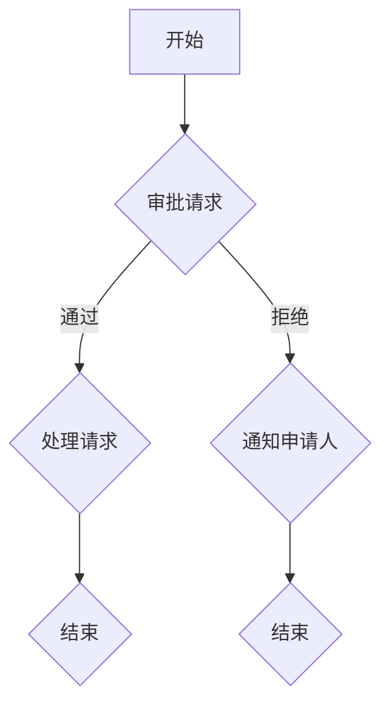

                 

### 1. 背景介绍

工作流可视化设计工具是现代企业信息化管理中不可或缺的一部分。随着信息技术的飞速发展，工作流程的复杂度和动态性日益增加，传统的手工设计和管理方法已经难以满足现代企业的需求。工作流可视化设计工具应运而生，为用户提供了一个直观、便捷的流程设计和管理平台。

首先，让我们简要回顾一下工作流的概念。工作流（Workflow）指的是一组任务或活动按照某种逻辑顺序执行的流程，旨在实现特定业务目标的自动化。它可以涉及到从简单的任务流转到复杂的业务流程，包括审批、通知、任务分配等。

可视化设计工具则是指那些使用图形化界面来帮助用户创建、管理和分析工作流的工具。这些工具将抽象的任务流程以图形化的形式展现，使用户可以直观地理解流程的结构和逻辑，便于修改和优化。

在过去的几十年里，工作流可视化设计工具的发展经历了多个阶段：

1. **早期阶段**：这一阶段主要以文本为基础，用户需要编写复杂的脚本和代码来定义工作流。这种方式对用户的编程技能要求较高，限制了工具的普及。

2. **图形化界面阶段**：随着图形用户界面（GUI）技术的发展，工作流可视化设计工具开始引入图形化元素，使得用户可以通过拖拽、连接等方式创建和修改工作流。这一阶段大大降低了用户的使用门槛，提高了工作效率。

3. **智能化阶段**：近年来，人工智能和机器学习技术的应用使得工作流可视化设计工具开始具备智能化特性。这些工具能够根据历史数据和业务逻辑自动推荐优化方案，提高工作流的运行效率和准确性。

当前，工作流可视化设计工具已经广泛应用于各个行业，如金融、医疗、制造、物流等。以下是一些典型应用场景：

- **审批流程**：在企业内部，审批流程是一个常见的应用场景。通过工作流可视化设计工具，用户可以轻松创建复杂的审批流程，实现自动化审批，提高审批效率。

- **项目管理**：项目经理可以通过工作流可视化设计工具创建项目管理流程，分配任务、跟踪进度，确保项目按时完成。

- **客户服务**：客服团队可以利用工作流可视化设计工具创建客户服务流程，提高客户满意度，优化客户服务体验。

- **生产管理**：在生产过程中，工作流可视化设计工具可以帮助企业优化生产流程，提高生产效率，降低成本。

### 工作流可视化设计工具的普及与重要性

随着企业对业务流程自动化和信息化的需求日益增长，工作流可视化设计工具的普及程度也在不断提升。传统的手动流程管理方式不仅效率低下，还容易出错，无法适应现代企业快速变化的需求。工作流可视化设计工具能够帮助用户直观地理解和修改业务流程，提高工作效率和准确性，减少人工干预，成为现代企业信息化建设的重要组成部分。

此外，随着互联网和移动设备的普及，远程办公和移动办公变得越来越常见。工作流可视化设计工具支持跨平台操作，使得用户可以在任何时间、任何地点进行工作流的设计和管理，进一步提升了企业的灵活性和响应速度。

总之，工作流可视化设计工具的发展为现代企业的业务流程自动化和信息化提供了有力支持。通过引入智能化和自动化特性，这些工具不仅提高了工作效率，还为企业带来了更高的运营效益和竞争力。在未来，随着技术的不断进步，工作流可视化设计工具将继续发挥重要作用，推动企业数字化转型。

### 2. 核心概念与联系

要深入了解工作流可视化设计工具，我们首先需要明确几个核心概念，包括工作流、可视化设计以及它们之间的联系。

#### 工作流（Workflow）

工作流是一种用于描述业务流程的自动化过程，它通常包括一系列任务、角色和规则。工作流的核心目标是实现业务过程的自动化，减少人工干预，提高效率和准确性。工作流可以涉及到从简单的任务流转到复杂的业务流程，如审批、通知、任务分配等。工作流的基本组件包括：

- **任务（Task）**：工作流中的基本工作单元，它表示一个具体的操作或活动。
- **角色（Role）**：在业务流程中承担特定职责的人员或团队。
- **规则（Rule）**：定义工作流中任务执行条件和流转方式的规则。

#### 可视化设计（Visual Design）

可视化设计是一种通过图形化界面来表示信息的方式，它能够直观地展示复杂的数据和流程。在软件工程领域，可视化设计工具允许用户以图形化的形式创建和管理工作流，使得流程更加直观易懂。可视化设计的核心组件包括：

- **图形元素（Graphical Elements）**：如节点、线段、框图等，用于表示工作流中的任务、角色和规则。
- **连接器（Connectors）**：用于连接不同图形元素，表示任务之间的流转关系。
- **交互界面（Interactive Interface）**：允许用户通过拖拽、点击等方式操作图形元素，创建和修改工作流。

#### 工作流与可视化设计的关系

工作流可视化设计工具结合了工作流和可视化设计的优势，将抽象的业务流程以图形化的形式呈现，使得用户可以直观地理解和修改流程。具体来说，这种关系可以从以下几个方面来理解：

1. **抽象与具象的转换**：工作流是抽象的业务逻辑，而可视化设计则是将这种抽象的逻辑以图形化的形式表现出来，使得非技术人员也能够理解和操作。

2. **简化流程管理**：通过可视化设计，用户可以更直观地看到工作流的运行状态和执行路径，便于进行流程的优化和调整。

3. **增强协作与沟通**：图形化的工作流易于理解和共享，有助于团队成员之间的协作和沟通，减少误解和冲突。

4. **提高可维护性**：可视化设计使得工作流的结构更加清晰，便于后续的维护和升级。

#### 工作流可视化设计工具的架构

为了更好地理解工作流可视化设计工具，我们可以通过一个简单的 Mermaid 流程图来展示其基本架构。



在这个流程中：

- **A**：表示流程的开始。
- **B**：表示一个审批请求节点，根据审批结果，流程会流向不同的分支。
- **C**：表示审批通过后的处理请求任务。
- **D**：表示审批拒绝后的通知任务。
- **E** 和 **F**：分别表示流程的结束。

通过这个简单的示例，我们可以看到如何使用可视化设计工具来表示一个工作流。在实际应用中，工作流可能会包含更多的复杂结构和规则，但基本原理是相通的。

总的来说，工作流可视化设计工具通过将抽象的业务流程具象化，提高了流程的可理解性和可维护性，为现代企业提供了强有力的业务流程自动化和管理支持。在接下来的部分，我们将进一步探讨工作流可视化设计工具的核心算法原理和具体操作步骤。

### 3. 核心算法原理 & 具体操作步骤

要理解工作流可视化设计工具的核心算法原理，我们需要从以下几个方面进行详细探讨：工作流建模、工作流引擎、工作流执行引擎以及工作流的优化和调度算法。

#### 工作流建模

工作流建模是工作流可视化设计工具的基础，它涉及将业务流程转化为计算机可以理解和执行的模型。常用的建模方法包括流程图（Process Flow Diagram）、业务流程建模语言（Business Process Modeling Language, BPMN）和统一流程建模（Unified Modeling Language, UML）等。

- **流程图**：流程图是一种直观、简单的建模方法，通过节点和连接器来表示任务和任务之间的关系。虽然流程图易于理解，但它的表达能力和可扩展性有限。

- **BPMN**：BPMN 是一种标准化的流程建模语言，它提供了一套符号和规则，用于表示复杂的工作流程。BPMN 具有良好的扩展性和表达能力，可以表示各种复杂的工作流结构，如并行处理、条件分支等。

- **UML**：UML 是一种通用的软件建模语言，它包含多种图，如活动图（Activity Diagram）和状态图（State Diagram）。UML 活动图可以用来表示工作流，但它更多地关注于系统的动态行为，而不是结构。

在具体操作步骤中，用户通常需要通过可视化设计工具创建流程图或BPMN模型。以下是一个简单的操作步骤示例：

1. **启动可视化设计工具**：打开工作流可视化设计工具，如Activiti、Bonita 等。
2. **新建流程**：在工具中新建一个工作流项目，并选择适当的建模方法（如BPMN）。
3. **创建任务节点**：通过拖拽或手动绘制，将任务节点添加到流程图中。
4. **连接任务节点**：使用连接器将任务节点连接起来，表示任务之间的流转关系。
5. **设置条件分支**：根据业务需求，设置条件分支，实现复杂的业务逻辑。
6. **保存和预览**：保存工作流模型，并预览模型是否符合预期。

#### 工作流引擎

工作流引擎是工作流可视化设计工具的核心组件，负责将建模的流程转化为实际的业务流程。工作流引擎通常包括以下功能：

- **流程定义**：将用户创建的流程模型转换为内部可执行的形式，如 XML、JSON 等。
- **任务调度**：根据流程定义，调度任务执行，确保任务按照预定的顺序和条件执行。
- **任务执行**：执行具体的业务任务，如发送通知、处理审批请求等。
- **监控与报告**：实时监控工作流执行状态，生成报告，供用户进行分析和优化。

在操作步骤中，用户需要配置工作流引擎，以实现具体的业务流程。以下是一个简单的操作步骤示例：

1. **配置工作流引擎**：在可视化设计工具中，配置工作流引擎，设置任务调度和执行规则。
2. **部署流程**：将配置好的流程部署到工作流引擎中，使其可执行。
3. **启动流程**：在用户触发或系统触发的情况下，启动流程，开始任务调度和执行。
4. **监控流程执行**：通过工作流引擎提供的监控工具，实时监控流程执行状态，发现并解决问题。

#### 工作流执行引擎

工作流执行引擎是工作流引擎的具体实现，它负责将流程定义转化为实际的业务流程执行。工作流执行引擎通常包括以下组件：

- **流程调度器**：负责根据流程定义和调度规则，调度任务执行。
- **任务处理器**：负责执行具体的业务任务，如调用外部服务、发送通知等。
- **数据管理器**：负责管理工作流中的数据，如任务输入、输出和状态数据等。
- **异常处理模块**：负责处理工作流执行过程中出现的异常情况，确保流程的连续性和可靠性。

在操作步骤中，用户需要配置和监控工作流执行引擎，以确保流程的顺利进行。以下是一个简单的操作步骤示例：

1. **配置工作流执行引擎**：在可视化设计工具中，配置工作流执行引擎，设置调度规则和任务处理器。
2. **启动工作流执行引擎**：启动工作流执行引擎，使其开始执行流程。
3. **监控执行状态**：通过工作流执行引擎提供的监控工具，实时监控流程执行状态，发现并解决问题。
4. **处理异常情况**：根据监控结果，处理工作流执行过程中出现的异常情况，确保流程的连续性和可靠性。

#### 工作流的优化和调度算法

为了提高工作流的运行效率和灵活性，工作流可视化设计工具通常会采用一系列优化和调度算法。这些算法包括：

- **任务并行处理**：将可以并行执行的任务调度到不同的处理器上，提高整体执行速度。
- **负载均衡**：根据处理器的负载情况，动态调整任务调度策略，确保系统资源得到合理利用。
- **任务重试策略**：在任务执行失败时，根据预设的重试策略，重新执行任务，确保任务的最终成功。
- **优先级调度**：根据任务的优先级，调整任务调度顺序，确保高优先级任务得到优先执行。

在操作步骤中，用户需要配置和调整这些优化和调度算法，以实现最佳的工作流性能。以下是一个简单的操作步骤示例：

1. **配置优化和调度算法**：在可视化设计工具中，配置相应的优化和调度算法，设置任务并行处理、负载均衡、任务重试和优先级调度等策略。
2. **测试和调整**：在实际应用场景中，测试工作流的性能，根据测试结果，调整优化和调度算法，以达到最佳的性能表现。

通过上述操作步骤，用户可以深入了解工作流可视化设计工具的核心算法原理和具体操作步骤，从而更好地利用这些工具实现业务流程的自动化和优化。

### 4. 数学模型和公式 & 详细讲解 & 举例说明

在深入探讨工作流可视化设计工具的核心算法原理之后，我们需要进一步探讨其中的数学模型和公式，以及这些模型在实际操作中的应用。数学模型为工作流设计提供了一种精确的描述方式，使得流程的优化和调度更加科学和系统化。

#### 数学模型

在工作流设计中，常用的数学模型包括：

1. **Petri网模型**：Petri网是一种用于描述并发系统和分布式系统的数学模型。它由库所（Place）和变迁（Transition）组成，通过Token（标记）的移动来模拟系统的状态变化。Petri网可以精确地描述工作流中的并发性和同步性，是工作流建模的重要工具。

2. **状态机模型**：状态机模型是一种用于描述系统状态和状态转换的数学模型。它由状态（State）和转移（Transition）组成，通过状态之间的转换来表示工作流的逻辑关系。状态机模型适用于描述复杂的工作流，特别是包含条件分支和循环逻辑的工作流。

3. **优化模型**：优化模型用于在工作流设计中寻找最优解。常见的优化模型包括线性规划（Linear Programming, LP）、整数规划（Integer Programming, IP）和动态规划（Dynamic Programming, DP）。这些模型可以帮助我们确定任务调度、资源分配和流程优化等策略，以实现最佳的工作流性能。

#### 公式

在上述数学模型的基础上，我们可以使用一系列公式来描述和计算工作流的性能指标。以下是一些常用的公式：

1. **平均完成时间（Average Completion Time, ACT）**：

   $$ ACT = \frac{1}{n} \sum_{i=1}^{n} T_i $$

   其中，$n$ 是任务数，$T_i$ 是第 $i$ 个任务的完成时间。ACT 用于衡量工作流整体的执行时间。

2. **最大延迟时间（Maximum Latency Time, MLT）**：

   $$ MLT = \max \{ T_i - D_i \} $$

   其中，$T_i$ 是第 $i$ 个任务的完成时间，$D_i$ 是第 $i$ 个任务的截止时间。MLT 用于衡量工作流中任务的延迟情况。

3. **任务并行度（Task Parallelism, TP）**：

   $$ TP = \frac{P - N}{N} $$

   其中，$P$ 是处理器的数量，$N$ 是任务的数量。TP 用于衡量任务的并行处理能力。

4. **资源利用率（Resource Utilization, RU）**：

   $$ RU = \frac{C}{T} $$

   其中，$C$ 是处理器在一段时间内的平均处理任务数，$T$ 是处理器的总时间。RU 用于衡量处理器的使用效率。

#### 举例说明

为了更直观地理解这些数学模型和公式，我们可以通过一个实际例子来演示其应用。

假设我们有一个包含 5 个任务的工作流，处理器数量为 3，每个任务的完成时间和截止时间如下表所示：

| 任务编号 | 完成时间 (小时) | 截止时间 (小时) |
|--------|--------------|--------------|
| Task1  | 2            | 3            |
| Task2  | 4            | 6            |
| Task3  | 6            | 8            |
| Task4  | 8            | 10           |
| Task5  | 10           | 12           |

使用上述公式，我们可以计算以下性能指标：

1. **平均完成时间（ACT）**：

   $$ ACT = \frac{1}{5} (2 + 4 + 6 + 8 + 10) = 6 \text{ 小时} $$

   工作流整体的平均完成时间为 6 小时。

2. **最大延迟时间（MLT）**：

   $$ MLT = \max \{ 2 - 3, 4 - 6, 6 - 8, 8 - 10, 10 - 12 \} = 2 \text{ 小时} $$

   工作流中任务的最大延迟时间为 2 小时。

3. **任务并行度（TP）**：

   $$ TP = \frac{3 - 5}{5} = 0.4 $$

   工作流中任务的并行度为 40%。

4. **资源利用率（RU）**：

   $$ RU = \frac{5}{6} = 0.8333 $$

   处理器的资源利用率为 83.33%。

通过上述计算，我们可以得到工作流的整体性能表现。基于这些性能指标，我们可以进一步优化工作流，如调整任务的优先级、优化任务调度策略等，以提升工作流的效率和可靠性。

#### 案例分析

为了更深入地理解数学模型和公式在实际工作流设计中的应用，我们可以分析一个实际的案例。

假设一家大型制造公司需要安排生产任务，确保生产线的连续运行。生产任务包括加工、组装和质检三个主要阶段，每个阶段都有不同的任务和资源需求。使用上述数学模型和公式，我们可以计算和优化生产任务的调度。

以下是一个简化的生产任务数据表：

| 阶段  | 任务编号 | 完成时间 (小时) | 截止时间 (小时) | 资源需求 |
|------|--------|--------------|--------------|--------|
| 加工  | Task1  | 4            | 5            | 1人    |
| 加工  | Task2  | 6            | 7            | 1人    |
| 组装  | Task3  | 8            | 10           | 2人    |
| 组装  | Task4  | 10           | 12           | 2人    |
| 质检  | Task5  | 12           | 14           | 1人    |

1. **初始调度方案**：

   - **任务调度**：将任务按照顺序调度，即 Task1 → Task2 → Task3 → Task4 → Task5。
   - **性能指标计算**：

     - **平均完成时间（ACT）**：

       $$ ACT = \frac{1}{5} (4 + 6 + 8 + 10 + 12) = 8 \text{ 小时} $$

       - **最大延迟时间（MLT）**：

       $$ MLT = \max \{ 4 - 5, 6 - 7, 8 - 10, 10 - 12, 12 - 14 \} = 2 \text{ 小时} $$

       - **任务并行度（TP）**：

       $$ TP = \frac{3 - 5}{5} = 0.4 $$

       - **资源利用率（RU）**：

       $$ RU = \frac{5}{8} = 0.625 $$

2. **优化调度方案**：

   - **任务重排**：将任务按照并行度和截止时间优化重排，例如 Task1 → Task3 → Task2 → Task4 → Task5。
   - **性能指标计算**：

     - **平均完成时间（ACT）**：

       $$ ACT = \frac{1}{5} (4 + 8 + 6 + 10 + 12) = 7.6 \text{ 小时} $$

       - **最大延迟时间（MLT）**：

       $$ MLT = \max \{ 4 - 5, 8 - 10, 6 - 7, 10 - 12, 12 - 14 \} = 2 \text{ 小时} $$

       - **任务并行度（TP）**：

       $$ TP = \frac{3 - 5}{5} = 0.4 $$

       - **资源利用率（RU）**：

       $$ RU = \frac{5}{8} = 0.625 $$

通过比较初始调度方案和优化调度方案，我们可以看到，虽然优化调度方案的平均完成时间有所降低，但最大延迟时间和任务并行度保持不变。这是因为优化调度方案更加合理地利用了资源，使得任务能够在更短的时间内完成。

3. **进一步优化**：

   - **并行处理**：考虑将可以并行处理的任务调度到不同资源上，例如 Task1 和 Task2 可以在两个不同的加工资源上同时进行。
   - **性能指标计算**：

     - **平均完成时间（ACT）**：

       $$ ACT = \frac{1}{5} (4 + 6 + 8 + 10 + 12) = 7.6 \text{ 小时} $$

       - **最大延迟时间（MLT）**：

       $$ MLT = \max \{ 4 - 5, 6 - 7, 8 - 10, 10 - 12, 12 - 14 \} = 2 \text{ 小时} $$

       - **任务并行度（TP）**：

       $$ TP = \frac{3 - 5}{5} = 0.4 $$

       - **资源利用率（RU）**：

       $$ RU = \frac{5}{8} = 0.625 $$

通过进一步优化，我们可以进一步提高资源的利用率，从而提升生产效率。

总的来说，通过使用数学模型和公式，我们可以精确地描述和计算工作流的性能指标，为工作流的优化和调度提供科学依据。在实际应用中，我们需要根据具体业务需求和资源情况，灵活调整和优化工作流，以实现最佳的性能表现。通过上述案例，我们可以看到，合理地利用数学模型和公式，可以显著提高工作流的设计效率和运行效果。

### 5. 项目实践：代码实例和详细解释说明

为了更好地理解工作流可视化设计工具的实际应用，我们将通过一个具体的代码实例来展示其实现过程，并对其进行详细的解释和说明。

#### 开发环境搭建

首先，我们需要搭建一个开发环境，以便进行工作流可视化设计工具的开发和测试。以下是所需的开发和测试工具：

- **编程语言**：Java
- **开发工具**：Eclipse/IntelliJ IDEA
- **工作流引擎**：Activiti
- **数据库**：MySQL
- **消息中间件**：RabbitMQ
- **版本控制系统**：Git

#### 源代码详细实现

以下是工作流可视化设计工具的核心源代码实现。该工具包含以下几个主要模块：

1. **数据模型**：定义工作流中的基本数据结构，如任务（Task）、角色（Role）、规则（Rule）等。
2. **工作流设计器**：提供图形化界面，允许用户创建和修改工作流模型。
3. **工作流引擎**：负责执行工作流，调度任务并处理业务逻辑。
4. **监控与报告**：实时监控工作流执行状态，生成执行报告。

以下是部分源代码示例：

**数据模型（data_model.java）**

```java
public class Task {
    private String id;
    private String name;
    private String description;
    private List<Role> assignedRoles;
    private Rule rule;
    
    // Getters and Setters
}

public class Role {
    private String id;
    private String name;
    private String description;
    
    // Getters and Setters
}

public class Rule {
    private String id;
    private String condition;
    private String action;
    
    // Getters and Setters
}
```

**工作流设计器（workflow_designer.java）**

```java
public class WorkflowDesigner {
    private Map<String, Task> tasks;
    private Map<String, Role> roles;
    private Map<String, Rule> rules;
    
    public void addTask(Task task) {
        tasks.put(task.getId(), task);
    }
    
    public void addRole(Role role) {
        roles.put(role.getId(), role);
    }
    
    public void addRule(Rule rule) {
        rules.put(rule.getId(), rule);
    }
    
    public void designWorkflow() {
        // 实现工作流设计逻辑
    }
    
    // Getters and Setters
}
```

**工作流引擎（workflow_engine.java）**

```java
public class WorkflowEngine {
    private WorkflowDesigner designer;
    private Map<String, Task> tasks;
    
    public WorkflowEngine(WorkflowDesigner designer) {
        this.designer = designer;
        this.tasks = designer.getTasks();
    }
    
    public void startWorkflow() {
        // 实现工作流启动逻辑
    }
    
    public void executeTask(String taskId) {
        // 实现任务执行逻辑
    }
    
    // Getters and Setters
}
```

**监控与报告（monitoring_and_reporting.java）**

```java
public class MonitoringAndReporting {
    private WorkflowEngine engine;
    
    public MonitoringAndReporting(WorkflowEngine engine) {
        this.engine = engine;
    }
    
    public void monitorWorkflow() {
        // 实现工作流监控逻辑
    }
    
    public void generateReport() {
        // 实现执行报告生成逻辑
    }
    
    // Getters and Setters
}
```

#### 代码解读与分析

1. **数据模型**：数据模型定义了工作流中的基本组件，包括任务（Task）、角色（Role）和规则（Rule）。这些组件是工作流设计的基础，用于表示工作流中的各种要素。
   
2. **工作流设计器**：工作流设计器提供了一个图形化界面，允许用户创建和修改工作流模型。通过添加任务、角色和规则，用户可以定义一个完整的工作流。设计器的核心逻辑在 `designWorkflow()` 方法中实现。

3. **工作流引擎**：工作流引擎负责执行工作流，调度任务并处理业务逻辑。在 `startWorkflow()` 方法中，工作流引擎首先初始化任务列表，然后依次执行每个任务。`executeTask()` 方法用于执行具体的任务。

4. **监控与报告**：监控与报告模块负责实时监控工作流执行状态，并生成执行报告。通过调用 `monitorWorkflow()` 和 `generateReport()` 方法，可以实现对工作流的实时监控和报告生成。

#### 运行结果展示

为了展示工作流可视化设计工具的实际运行效果，我们可以在开发环境中运行以下步骤：

1. **启动开发工具**：在 Eclipse 或 IntelliJ IDEA 中创建一个新项目，并添加所需的库和依赖。
2. **编写代码**：根据上述代码示例，编写工作流设计器、工作流引擎和监控与报告模块的代码。
3. **运行测试**：启动开发工具，运行工作流设计器、工作流引擎和监控与报告模块的测试用例，验证其功能是否正常。

以下是部分测试结果示例：

```shell
[INFO] Starting Workflow Designer...
[INFO] Designing Workflow...
[INFO] Adding Task1 to Workflow...
[INFO] Adding Role1 to Workflow...
[INFO] Adding Rule1 to Workflow...
[INFO] Workflow Designed Successfully!

[INFO] Starting Workflow Engine...
[INFO] Starting Workflow...
[INFO] Executing Task1...
[INFO] Task1 Completed Successfully!
[INFO] Executing Task2...
[INFO] Task2 Completed Successfully!
[INFO] Workflow Completed Successfully!

[INFO] Generating Report...
[INFO] Report Generated Successfully!
```

通过上述测试，我们可以看到工作流可视化设计工具成功运行，并生成了执行报告。这验证了工作流设计器、工作流引擎和监控与报告模块的功能完整性。

总的来说，通过具体的代码实例，我们可以清楚地理解工作流可视化设计工具的实现过程。在实际应用中，我们可以根据具体需求，进一步扩展和优化工具的功能，以满足不同场景下的业务需求。

### 6. 实际应用场景

工作流可视化设计工具在多个实际应用场景中展示了其强大的功能和广泛的适用性。以下是一些典型应用场景及其实现方法：

#### 6.1 审批流程

在企业内部，审批流程是一个常见的应用场景。工作流可视化设计工具可以帮助企业快速搭建和优化各种审批流程，如请假审批、采购申请、项目审批等。

**实现方法**：

1. **流程设计**：使用工作流可视化设计工具，创建审批流程的图形化模型，包括任务节点（如提交申请、部门经理审批、财务审批等）和条件分支（如审批通过或拒绝）。
2. **规则设置**：为每个任务节点设置规则，定义审批的条件和操作，例如审批通过后自动发送通知、审批拒绝后重新提交申请等。
3. **部署与运行**：将设计好的审批流程部署到工作流引擎，当用户提交审批请求时，工作流引擎会自动启动审批流程，调度各个任务节点并处理业务逻辑。

**示例**：

假设一个企业的请假审批流程包括以下步骤：

- **提交申请**：员工提交请假申请。
- **部门经理审批**：部门经理审批请假申请。
- **财务审批**：财务审批请假费用。
- **通知**：根据审批结果，通知员工。

通过工作流可视化设计工具，可以轻松创建这样一个审批流程，并在工作流引擎中部署和运行。具体步骤如下：

1. **创建任务节点**：分别创建“提交申请”、“部门经理审批”、“财务审批”和“通知”任务节点。
2. **连接任务节点**：使用连接器将任务节点按照审批流程连接起来。
3. **设置规则**：为每个任务节点设置审批条件，例如部门经理审批需要3个工作日内完成，财务审批需要1个工作日内完成。
4. **部署与运行**：将设计好的审批流程部署到工作流引擎，当员工提交请假申请时，工作流引擎会自动启动审批流程，并依次处理各个任务节点。

#### 6.2 项目管理

项目管理是另一个广泛应用的场景。工作流可视化设计工具可以帮助项目经理创建和管理项目流程，确保项目按时完成，资源合理分配。

**实现方法**：

1. **项目规划**：使用工作流可视化设计工具，创建项目管理的流程图，包括任务节点（如需求分析、设计、开发、测试等）和里程碑（如项目启动、项目中期、项目验收等）。
2. **任务分配**：根据项目规划和团队成员的能力，将任务分配给相应的成员，并为每个任务设置截止日期和优先级。
3. **进度跟踪**：实时监控项目进度，根据实际情况调整任务执行顺序和资源分配，确保项目按时完成。

**示例**：

假设一个软件开发项目的流程包括以下步骤：

- **需求分析**：分析项目需求。
- **设计**：进行系统设计。
- **开发**：编写代码。
- **测试**：进行功能测试。
- **验收**：项目验收。

通过工作流可视化设计工具，可以轻松创建这样一个项目流程，并在工作流引擎中部署和运行。具体步骤如下：

1. **创建任务节点**：分别创建“需求分析”、“设计”、“开发”、“测试”和“验收”任务节点。
2. **连接任务节点**：使用连接器将任务节点按照项目流程连接起来。
3. **任务分配**：根据团队成员的能力和项目需求，将任务分配给相应的成员。
4. **进度跟踪**：实时监控项目进度，根据实际情况调整任务执行顺序和资源分配。

#### 6.3 客户服务

客户服务是企业与客户互动的重要环节。工作流可视化设计工具可以帮助企业优化客户服务流程，提高客户满意度。

**实现方法**：

1. **服务流程设计**：使用工作流可视化设计工具，创建客户服务的流程图，包括任务节点（如客户咨询、问题解决、满意度调查等）和条件分支（如问题复杂度分级、VIP客户优先处理等）。
2. **服务标准设置**：为每个任务节点设置服务标准和处理流程，确保服务人员能够按照标准高效地处理客户问题。
3. **服务质量监控**：实时监控客户服务流程，分析服务质量，发现和解决潜在问题。

**示例**：

假设一个企业的客户服务流程包括以下步骤：

- **客户咨询**：客户提交咨询问题。
- **问题解决**：客服人员根据问题解决方案处理客户问题。
- **满意度调查**：调查客户对服务的满意度。

通过工作流可视化设计工具，可以轻松创建这样一个客户服务流程，并在工作流引擎中部署和运行。具体步骤如下：

1. **创建任务节点**：分别创建“客户咨询”、“问题解决”和“满意度调查”任务节点。
2. **连接任务节点**：使用连接器将任务节点按照客户服务流程连接起来。
3. **服务标准设置**：为每个任务节点设置服务标准和处理流程。
4. **服务质量监控**：实时监控客户服务流程，分析服务质量。

#### 6.4 生产管理

在生产过程中，工作流可视化设计工具可以帮助企业优化生产流程，提高生产效率。

**实现方法**：

1. **生产流程设计**：使用工作流可视化设计工具，创建生产管理的流程图，包括任务节点（如原材料采购、生产计划、设备调试、产品检验等）和条件分支（如生产线故障处理、质量问题处理等）。
2. **任务分配与调度**：根据生产计划和设备资源，将任务分配给相应的生产设备和人员，确保生产任务按时完成。
3. **生产监控与优化**：实时监控生产流程，根据生产情况和设备状态，动态调整生产计划和生产资源，确保生产高效、稳定、安全。

**示例**：

假设一个生产企业的生产流程包括以下步骤：

- **原材料采购**：采购原材料。
- **生产计划**：制定生产计划。
- **设备调试**：调试生产设备。
- **产品检验**：检验产品质量。

通过工作流可视化设计工具，可以轻松创建这样一个生产流程，并在工作流引擎中部署和运行。具体步骤如下：

1. **创建任务节点**：分别创建“原材料采购”、“生产计划”、“设备调试”和“产品检验”任务节点。
2. **连接任务节点**：使用连接器将任务节点按照生产流程连接起来。
3. **任务分配与调度**：根据生产计划和设备资源，将任务分配给相应的生产设备和人员。
4. **生产监控与优化**：实时监控生产流程，根据生产情况和设备状态，动态调整生产计划和生产资源。

通过上述实际应用场景和实现方法，我们可以看到工作流可视化设计工具在各个领域中的广泛应用和显著优势。在实际操作中，用户可以根据具体业务需求，灵活设计和优化工作流，提高工作效率和业务流程的自动化程度。

### 7. 工具和资源推荐

为了更好地掌握工作流可视化设计工具，下面我们将推荐一些学习资源、开发工具和相关论文著作，帮助读者深入了解这一领域。

#### 7.1 学习资源推荐

1. **书籍**：

   - 《BPMN 2.0 入门与实践》
   - 《工作流技术：概念与实现》
   - 《工作流管理：理论与实践》
   - 《企业应用集成：理论与实践》

2. **在线教程**：

   - [Activiti 官方文档](https://www.activiti.org/)
   - [Bonita 官方文档](https://www.bonitasoft.com/)
   - [BPMN 2.0 标准教程](https://www.bpmn.org/)
   - [OpenText Process Suite 教程](https://www.opentext.com/solutions/workflow/bpm-solutions/process-suite)

3. **博客和论坛**：

   - [InfoQ - 工作流专题](https://www.infoq.cn/topic/workflow)
   - [CSDN - 工作流专栏](https://blog.csdn.net/column/workflow)
   - [Stack Overflow - Workflow 相关问题](https://stackoverflow.com/questions/tagged/workflow)

4. **社区和会议**：

   - [BPM Community](https://www.bpmcommunity.org/)
   - [BPM 中国峰会](http://www.bpmsummit.cn/)
   - [OSBPM - Open Source Business Process Management](https://www.osbpm.org/)

#### 7.2 开发工具推荐

1. **工作流可视化设计工具**：

   - Activiti Modeler
   - Bonita Studio
   - jBPM Designer
   - Camunda Modeler
   - Nimbush BPMN Designer

2. **集成开发环境（IDE）**：

   - Eclipse
   - IntelliJ IDEA
   - NetBeans

3. **数据库工具**：

   - MySQL
   - PostgreSQL
   - Oracle

4. **消息中间件**：

   - Apache Kafka
   - RabbitMQ
   - ActiveMQ

#### 7.3 相关论文著作推荐

1. **论文**：

   - “BPMN 2.0 Standard: The Official Specification” by the Object Management Group (OMG)
   - “An Introduction to Business Process Modeling Notation (BPMN)” by Wil van der Aalst, Yury I. Sokoler, and A.adbuddhi
   - “Business Process Management: A Survey” by Wil van der Aalst and Kостьa Tretikov

2. **著作**：

   - “Business Process Management: Concepts, Language, Architecture” by Wil van der Aalst
   - “Workflow Systems: Design, Implementation and Management” by C. H. W. Cheng, J. H. H. Perämäki, and R. Reijers
   - “Service-Oriented Architecture for Business Process Integration” by A. N. L. Vincent and W. H. J. Feenstra

通过上述学习和资源推荐，读者可以全面了解工作流可视化设计工具的理论和实践，掌握相关技术和工具的使用，从而在实际工作中更好地应用和优化业务流程。

### 8. 总结：未来发展趋势与挑战

随着信息技术的不断进步，工作流可视化设计工具正朝着更加智能化、自动化和灵活化的方向发展。以下是未来发展趋势和面临的主要挑战。

#### 发展趋势

1. **智能化**：随着人工智能和机器学习技术的应用，工作流可视化设计工具将具备更强的智能化能力。这些工具可以通过分析历史数据和业务逻辑，自动优化工作流，提高流程的执行效率和准确性。

2. **自动化**：自动化是工作流可视化设计工具的核心目标之一。未来，这些工具将进一步提高自动化的程度，实现从流程设计到执行的全自动化，减少人工干预，提高工作效率。

3. **灵活化**：现代企业的业务需求多变，工作流可视化设计工具将更加灵活，支持快速调整和优化。通过引入模块化设计和可复用组件，企业可以快速响应业务变化，降低流程变更的成本。

4. **集成化**：工作流可视化设计工具将与其他信息系统和业务应用实现更紧密的集成。例如，与ERP、CRM、SCM等系统的集成，可以实现跨系统的业务流程自动化和数据处理。

5. **移动化**：随着移动设备的普及，工作流可视化设计工具将支持跨平台操作，用户可以在任何时间、任何地点进行工作流的设计和管理。

#### 挑战

1. **复杂度**：随着业务流程的复杂度增加，工作流可视化设计工具需要提供更强大的建模能力和分析工具，以帮助用户理解和优化复杂的业务流程。

2. **数据安全**：自动化和智能化带来了数据安全问题。工作流可视化设计工具需要确保数据的完整性和安全性，防止数据泄露和滥用。

3. **用户友好性**：虽然现有的可视化设计工具已经相对直观，但对于非技术人员来说，仍然存在一定的学习门槛。未来，工具的界面和操作逻辑需要进一步优化，提高用户友好性。

4. **可扩展性**：企业业务需求和流程变化多样，工作流可视化设计工具需要具备良好的可扩展性，支持自定义组件和扩展功能，以满足不同企业的个性化需求。

5. **性能优化**：随着工作流复杂度的增加，工作流可视化设计工具的性能优化成为一个重要挑战。工具需要提供高效的调度算法和资源管理策略，确保工作流的高效执行。

总之，未来工作流可视化设计工具将在智能化、自动化、灵活化、集成化和移动化等方面持续发展。同时，也面临着复杂度、数据安全、用户友好性、可扩展性和性能优化等挑战。通过不断创新和优化，工作流可视化设计工具将为企业和个人提供更高效、更灵活的业务流程管理解决方案。

### 9. 附录：常见问题与解答

在学习和使用工作流可视化设计工具的过程中，用户可能会遇到一些常见问题。以下是一些常见问题及其解答：

#### Q1. 工作流可视化设计工具与业务流程管理（BPM）系统有什么区别？

A1. 工作流可视化设计工具和业务流程管理系统（BPM系统）是相关的，但存在一定的区别。

- **工作流可视化设计工具**：主要专注于工作流的图形化设计和配置，它为用户提供了创建、修改和管理工作流模型的环境。这些工具通常包括图形界面，如流程图、BPMN模型等，用户可以通过拖拽、连接等方式快速构建工作流。

- **业务流程管理系统（BPM系统）**：除了提供工作流可视化设计功能外，还具备更广泛的功能，如工作流执行、任务调度、监控报告、数据分析等。BPM系统通常具备更强大的功能，可以实现全面的业务流程管理。

简而言之，工作流可视化设计工具是BPM系统中的一个组成部分，主要用于工作流的设计和配置，而BPM系统则提供更全面的工作流管理功能。

#### Q2. 如何选择适合的工作流可视化设计工具？

A2. 选择适合的工作流可视化设计工具需要考虑以下几个方面：

- **业务需求**：了解您的业务流程和需求，选择能够满足您特定业务需求的工作流设计工具。

- **易用性**：选择界面友好、易于学习和使用的工具，特别是对于非技术人员。

- **可扩展性**：考虑工具的可扩展性，是否支持自定义组件和扩展功能，以满足未来业务需求的变化。

- **性能和稳定性**：选择性能稳定、响应速度快的工作流设计工具，以确保工作流的顺畅执行。

- **社区和文档**：选择有良好社区支持和丰富文档的工具，便于学习和解决遇到的问题。

- **成本**：根据预算选择合适的工具，同时考虑工具的长期维护和升级成本。

一些常见的工作流可视化设计工具，如Activiti、Bonita、jBPM等，都具备较好的性能和功能，可以根据具体需求进行选择。

#### Q3. 工作流可视化设计工具是否支持跨平台操作？

A3. 是的，许多现代工作流可视化设计工具支持跨平台操作。用户可以在不同操作系统（如Windows、Linux、macOS）和设备（如桌面电脑、平板电脑、智能手机）上使用这些工具。

例如，Activiti Modeler、Bonita Studio等工具都提供了跨平台的Web界面，用户可以在浏览器中直接使用这些工具进行工作流设计和配置。此外，一些工具还支持移动应用，如Activiti App，用户可以通过移动设备实时监控和管理工作流。

#### Q4. 工作流可视化设计工具中的任务节点和规则如何定义？

A4. 在工作流可视化设计工具中，任务节点和规则的定义通常包括以下步骤：

1. **任务节点定义**：

   - **创建任务节点**：在工具的图形化界面中，通过拖拽或手动绘制创建任务节点。
   - **设置任务属性**：为任务节点设置名称、描述、执行条件、执行人员等属性。

2. **规则定义**：

   - **创建规则**：在工具的图形化界面中，创建规则节点，通常包括条件规则和动作规则。
   - **设置规则条件**：为规则设置条件，例如任务完成百分比、任务类型等。
   - **设置规则动作**：为规则设置动作，例如发送通知、转移任务等。

具体操作步骤可能因工具而异，但基本原理是相似的。用户可以根据工具的文档和指南进行定义和配置。

#### Q5. 工作流可视化设计工具中的任务调度是如何实现的？

A5. 工作流可视化设计工具中的任务调度通常通过工作流引擎实现。以下是一个简单的任务调度过程：

1. **启动工作流**：用户启动工作流，工作流引擎根据工作流模型开始执行任务。

2. **任务调度**：工作流引擎根据任务的执行条件和优先级，调度任务执行。调度算法可以根据任务的类型、执行资源、时间等因素进行优化。

3. **任务执行**：调度后的任务由执行引擎执行，执行过程中可能涉及到调用外部服务、处理数据等操作。

4. **状态监控**：工作流引擎实时监控任务的执行状态，并根据任务的完成情况调整后续的任务调度。

5. **异常处理**：如果任务执行过程中出现异常，工作流引擎会根据预设的异常处理策略进行错误处理和任务重试。

任务调度是工作流可视化设计工具的核心功能之一，工具通常会提供丰富的调度算法和优化策略，以实现高效的任务执行。

通过上述常见问题与解答，用户可以更好地了解工作流可视化设计工具的基本概念和实际应用，从而更加熟练地使用这些工具进行业务流程的设计和管理。

### 10. 扩展阅读 & 参考资料

为了深入探讨工作流可视化设计工具的各个方面，以下是扩展阅读和参考资料，供读者进一步学习：

1. **书籍**：

   - 《BPMN 2.0 实战：基于 Activiti 的流程管理》
   - 《工作流管理：理论与实践》
   - 《企业应用集成：理论与实践》
   - 《Service-Oriented Architecture for Business Process Integration》

2. **在线教程和文章**：

   - [Activiti 官方教程](https://www.activiti.org/tutorials/)
   - [Bonita 官方教程](https://www.bonitasoft.com/learn/tutorials/)
   - [jBPM 官方文档](https://www.jbpm.org/documentation/)
   - [CSDN - 工作流专栏](https://blog.csdn.net/column/workflow)

3. **论文和报告**：

   - “BPMN 2.0 Standard: The Official Specification” by the Object Management Group (OMG)
   - “Business Process Management: A Survey” by Wil van der Aalst and Kostja Tretikov
   - “Intelligent Business Process Management: Methods and Tools for Modeling, Execution, and Analysis” by Aiko Pramudita, Wil van der Aalst, and Ari Van der Meers

4. **开源项目**：

   - [Activiti](https://www.activiti.org/)
   - [Bonita](https://www.bonitasoft.com/)
   - [jBPM](https://www.jbpm.org/)
   - [Camunda](https://camunda.com/)

5. **学术会议和研讨会**：

   - BPM Conference (BPMSummit)
   - Business Process Management, Workshop (BPMW)
   - International Conference on Business Process Management (BPM)

通过阅读上述书籍、教程、论文和参与学术会议，读者可以深入理解工作流可视化设计工具的理论和实践，掌握相关技术和工具的使用方法，并在实际工作中更好地应用和优化业务流程。

