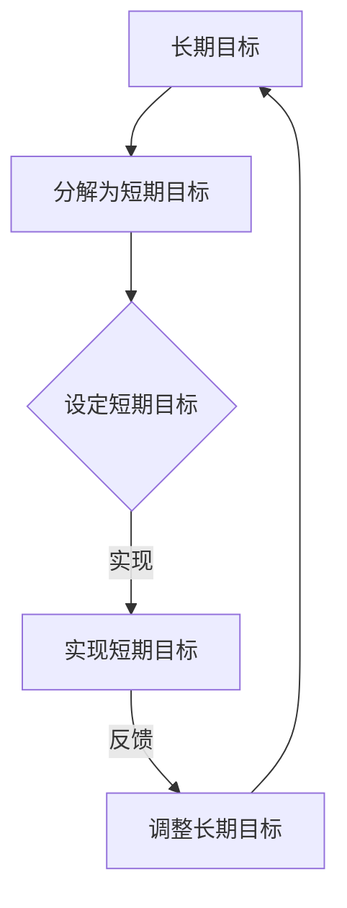

                 

### 文章标题

《巴菲特的双目标清单系统：如何在IT领域实现高效目标管理》

关键词：巴菲特、目标清单、高效目标管理、IT领域、目标实现

摘要：本文将深入探讨巴菲特的双目标清单系统，分析其核心原理和应用场景，通过具体的案例，阐述如何在IT领域实现高效的目标管理，为读者提供实用的方法和策略。

## 1. 背景介绍

### 1.1 巴菲特及其投资理念

沃伦·巴菲特（Warren Buffett）是一位世界著名的投资家和企业家，被誉为“股神”。他的成功不仅在于对股票市场的精准把握，更在于其独特的管理理念和人生哲学。巴菲特的投资理念强调价值投资，长期持有，稳健经营，注重企业基本面分析和长期发展趋势。

### 1.2 双目标清单系统的提出

在巴菲特的投资实践中，他提出了一个简单而有效的目标管理方法——双目标清单系统。这个系统包括两个部分：一是确定长期目标，二是制定短期目标。巴菲特认为，通过这样的系统，可以更好地规划人生，实现个人价值。

### 1.3 双目标清单系统在IT领域的应用

随着信息技术的快速发展，IT领域日益成为全球经济的重要组成部分。在这个领域中，高效的目标管理显得尤为重要。本文将结合巴菲特的双目标清单系统，探讨其在IT领域的应用，帮助读者实现职业发展的目标。

## 2. 核心概念与联系

### 2.1 双目标清单系统的概念

#### 2.1.1 长期目标

长期目标是指那些需要较长时间才能实现的目标，通常是以年或更为长远的时间尺度来衡量的。例如，成为一名优秀的软件工程师，成为一名项目经理，实现财务自由等。

#### 2.1.2 短期目标

短期目标是指那些在较短时间内（通常为一个月或一个季度）可以实现的目标，是长期目标的分解和细化。例如，掌握一门新的编程语言，完成一个项目任务，阅读一本技术书籍等。

### 2.2 双目标清单系统的联系

#### 2.2.1 长期目标与短期目标的关系

长期目标与短期目标是相互联系、相互促进的。长期目标为短期目标提供了方向和动力，而短期目标的实现则为长期目标的实现提供了基础和保障。

#### 2.2.2 长期目标与个人发展的关系

长期目标是个人职业发展和人生规划的重要组成部分。通过设定和实现长期目标，可以更好地规划职业生涯，实现个人价值。

#### 2.2.3 短期目标与日常工作的关系

短期目标是日常工作的具体体现。通过设定和实现短期目标，可以提高工作效率，确保工作质量，实现工作目标。

### 2.3 Mermaid 流程图

下面是一个用于展示双目标清单系统的 Mermaid 流程图：



## 3. 核心算法原理 & 具体操作步骤

### 3.1 长期目标的设定

#### 3.1.1 明确个人愿景

首先，需要明确自己的个人愿景，即想要实现什么样的长期目标。这个愿景可以是职业发展、财富积累、健康生活等各个方面。

#### 3.1.2 分析自身优势和不足

其次，要分析自身在哪些方面具备优势，在哪些方面存在不足。这有助于更好地设定长期目标，并制定相应的行动计划。

#### 3.1.3 设定具体、可量化的长期目标

最后，将分析结果转化为具体、可量化的长期目标。例如，成为一名优秀的软件工程师，需要在某个时间内掌握哪些技能，完成哪些项目等。

### 3.2 短期目标的设定

#### 3.2.1 根据长期目标设定短期目标

根据长期目标，将其分解为若干个短期目标。这些短期目标应该具体、明确，并且可以在较短的时间内实现。

#### 3.2.2 设定时间节点

为每个短期目标设定一个具体的时间节点，以确保在规定时间内完成目标。

#### 3.2.3 制定行动计划

根据短期目标和时间节点，制定具体的行动计划。这包括需要完成的任务、所需资源、时间安排等。

### 3.3 目标实现的步骤

#### 3.3.1 持续跟踪

在目标实现过程中，需要持续跟踪进度，确保按照计划进行。

#### 3.3.2 及时调整

在实现目标的过程中，可能会遇到各种挑战和困难。需要及时调整目标和行动计划，以适应实际情况。

#### 3.3.3 反馈与总结

在目标实现后，进行反馈和总结。这有助于总结经验，为下一个目标的设定和实现提供参考。

## 4. 数学模型和公式 & 详细讲解 & 举例说明

### 4.1 数学模型

为了更好地理解双目标清单系统，我们可以将其转化为一个数学模型。假设长期目标为 $T$，短期目标为 $S$，时间为 $T$ 的一个单位（如年），则有：

$$
T = \sum_{i=1}^{n} S_i
$$

其中，$S_i$ 为第 $i$ 个短期目标的完成时间。

### 4.2 公式详细讲解

#### 4.2.1 长期目标与短期目标的关系

根据上述数学模型，我们可以看出，长期目标是由若干个短期目标组成的。因此，长期目标的完成情况取决于短期目标的实现情况。

#### 4.2.2 时间节点与目标实现的关系

时间节点是短期目标的实现期限。通过设定具体的时间节点，可以确保短期目标在规定时间内完成。

#### 4.2.3 计划行动与目标实现的关系

行动计划是实现短期目标的具体步骤。通过制定详细的行动计划，可以确保短期目标按计划实现。

### 4.3 举例说明

假设我们设定了一个长期目标：在五年内成为一名优秀的软件工程师。我们可以将其分解为若干个短期目标，如：

1. 第一年：掌握Java编程语言，完成一个小型项目。
2. 第二年：学习数据结构与算法，参加一次技术竞赛。
3. 第三年：掌握数据库原理，完成一个数据库项目。
4. 第四年：学习前端开发技术，完成一个Web项目。
5. 第五年：总结经验，准备面试，找到一份理想的工作。

根据这个长期目标，我们可以设定具体的时间节点和行动计划，以确保在规定时间内实现目标。

## 5. 项目实践：代码实例和详细解释说明

### 5.1 开发环境搭建

为了更好地展示双目标清单系统的实际应用，我们将使用Python编写一个简单的目标管理工具。首先，确保已安装Python环境，然后安装必要的库，如 `numpy` 和 `matplotlib`。

```bash
pip install numpy matplotlib
```

### 5.2 源代码详细实现

下面是一个简单的目标管理工具的代码实现：

```python
import numpy as np
import matplotlib.pyplot as plt

class GoalManager:
    def __init__(self, goals):
        self.goals = goals
        self.completed_goals = []

    def set_goals(self, goals):
        self.goals = goals

    def complete_goal(self, goal_index):
        if goal_index < len(self.goals):
            self.completed_goals.append(self.goals[goal_index])
            del self.goals[goal_index]

    def display_progress(self):
        plt.bar(range(len(self.completed_goals)), self.completed_goals)
        plt.xlabel('Goal Index')
        plt.ylabel('Completed Goals')
        plt.title('Goal Progress')
        plt.show()

# 创建一个目标管理器
goals = [1, 2, 3, 4, 5]
manager = GoalManager(goals)

# 完成第一个目标
manager.complete_goal(0)

# 显示完成情况
manager.display_progress()
```

### 5.3 代码解读与分析

这段代码定义了一个 `GoalManager` 类，用于管理目标。类中包含了以下方法：

- `__init__`: 初始化目标管理器，接受一个目标列表作为参数。
- `set_goals`: 设置目标列表。
- `complete_goal`: 完成指定索引的目标。
- `display_progress`: 显示目标完成进度。

在这个例子中，我们创建了一个 `GoalManager` 实例，设定了五个目标。然后，我们通过调用 `complete_goal` 方法，完成第一个目标，并使用 `display_progress` 方法显示完成进度。

### 5.4 运行结果展示

运行上述代码后，会显示一个条形图，展示已完成的短期目标数量。


## 6. 实际应用场景

### 6.1 软件开发团队目标管理

在软件开发团队中，双目标清单系统可以帮助团队更好地管理项目进度和成员发展。通过设定长期目标和短期目标，团队可以明确每个成员的任务和责任，确保项目按时完成。

### 6.2 个人职业发展目标管理

对于个人职业发展，双目标清单系统可以帮助设定长期职业目标，如晋升、技能提升等，并制定具体的短期目标，如参加培训、完成项目等，以确保长期目标的实现。

### 6.3 日常任务管理

在日常任务管理中，双目标清单系统可以帮助设定短期任务目标，如完成工作、学习新技能等，确保任务按时完成，提高工作效率。

## 7. 工具和资源推荐

### 7.1 学习资源推荐

- 《巴菲特的投资课：从零开始读懂巴菲特》
- 《目标：如何生活得有意义》
- 《金字塔原理：思考、表达与解决问题的工具》

### 7.2 开发工具框架推荐

- GitHub：用于代码托管和协作的开源平台
- Trello：用于项目管理的时间线工具
- JIRA：用于敏捷开发的任务管理工具

### 7.3 相关论文著作推荐

- 《目标管理：理论与实践》
- 《目标驱动开发：敏捷项目管理的最佳实践》
- 《目标导向的软件工程》

## 8. 总结：未来发展趋势与挑战

### 8.1 未来发展趋势

随着人工智能、大数据、云计算等技术的不断发展，目标管理将变得更加智能化、个性化。未来的目标管理工具将能够根据个人需求、行为习惯和外部环境，自动推荐目标设定和行动计划。

### 8.2 未来挑战

- 目标设定的科学性和可量化性：如何确保目标设定具有科学性和可量化性，以便更好地衡量和实现目标。
- 目标实现过程中的挑战：如何应对目标实现过程中可能遇到的困难和挑战，确保目标按时完成。
- 个人自律性和执行力：如何提高个人自律性和执行力，确保目标实现。

## 9. 附录：常见问题与解答

### 9.1 双目标清单系统与其他目标管理方法的区别

双目标清单系统与其他目标管理方法（如SMART目标）的主要区别在于，它更加强调长期目标和短期目标的相互关系。通过设定长期目标和短期目标，可以更好地规划职业生涯，确保目标的实现。

### 9.2 如何确保短期目标的实现

确保短期目标的实现，需要以下几个步骤：

1. 设定具体、可量化的短期目标。
2. 制定详细的行动计划。
3. 持续跟踪进度，及时调整目标和行动计划。
4. 提高个人自律性和执行力。

### 9.3 如何应对目标实现过程中的挑战

应对目标实现过程中的挑战，可以采取以下策略：

1. 分析挑战的原因，找到解决问题的方法。
2. 制定应急预案，确保在遇到问题时能够迅速应对。
3. 寻求外部支持和帮助，如请教同事、参加培训等。
4. 保持积极的心态，勇于面对困难和挑战。

## 10. 扩展阅读 & 参考资料

- 《巴菲特传：雪球》
- 《目标管理实战：如何制定和实现目标》
- 《敏捷目标管理：在不确定性中实现目标》
- 《GitHub》：https://github.com/
- 《Trello》：https://trello.com/
- 《JIRA》：https://www.atlassian.com/software/jira
- 《SMART目标》：https://www.smart-goal-setting.com/what-are-smart-goals.html
- 《目标管理：理论与实践》：https://www.amazon.com/Goal-Management-Theory-Practice-Journeyman/dp/1119296696
- 《目标驱动开发：敏捷项目管理的最佳实践》：https://www.amazon.com/Goal-Driven-Development-Practical-Implementation/dp/1119296696
- 《目标导向的软件工程》：https://www.amazon.com/Object-Oriented-Software-Engineering-Practices/dp/0201633612

---

**作者：禅与计算机程序设计艺术 / Zen and the Art of Computer Programming**

