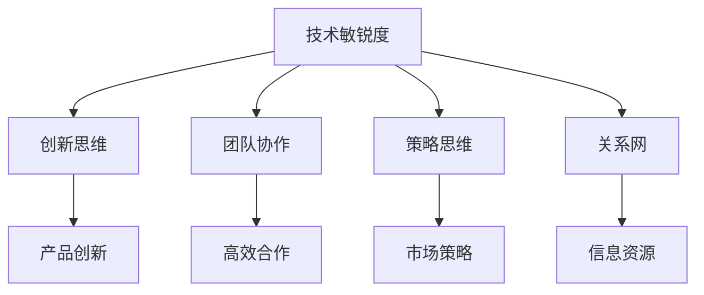

                 

### 1. 背景介绍

在当今快速发展的商业环境中，市场竞争日益激烈，新的技术和市场趋势不断涌现。为了在这样的环境中生存并取得成功，创业者必须具备一系列关键素质。这些素质不仅包括传统的商业洞察力和领导能力，还涵盖了技术敏锐度、创新思维、团队协作和应对挑战的策略。

市场挑战应对：创业者的必备素质，这一主题旨在探讨在充满不确定性和变化的市场中，创业者如何通过不断提升自身素质来应对各种挑战。本文将深入分析以下几个核心方面：

1. **技术敏锐度**：在技术日新月异的时代，创业者需要具备快速识别和掌握新技术的能力，以保持竞争力。
2. **创新思维**：创新是推动企业发展的关键驱动力。创业者需要不断探索新的商业模式、产品和服务。
3. **团队协作**：构建一个高效的团队是创业成功的关键。创业者需要擅长团队建设和管理。
4. **策略思维**：制定和执行有效的市场策略，以应对竞争和变化。

接下来，我们将逐一探讨这些核心素质，并提供具体的案例和实践经验，帮助创业者更好地应对市场挑战。

---

### 2. 核心概念与联系

在深入探讨创业者所需的核心素质之前，有必要明确几个关键概念，并解释它们之间的相互关系。以下是本文将涉及的核心概念及其关联：

#### 2.1 技术敏锐度

技术敏锐度指的是创业者对新技术、新趋势的敏感度和快速反应能力。随着信息技术的迅猛发展，技术已经成为驱动商业创新的重要力量。创业者需要密切关注技术趋势，以便及时将其应用于产品开发和市场策略中。

#### 2.2 创新思维

创新思维是指创业者能够打破常规，提出新颖的想法和解决方案的能力。创新思维不仅包括技术层面的创新，还涵盖了商业模式、产品设计和市场策略等多个方面。创新思维能够帮助企业在竞争中脱颖而出。

#### 2.3 团队协作

团队协作是指团队成员之间的高效合作和沟通。在创业过程中，创业者需要组建一支多元化的团队，并确保团队成员之间能够协同工作，共同实现目标。良好的团队协作能够提高决策质量、增强执行力和创新力。

#### 2.4 策略思维

策略思维是指创业者制定和执行市场策略的能力。策略思维要求创业者能够准确把握市场动态，预测趋势，制定可行的战略计划，并在执行过程中进行调整和优化。

#### 2.5 关系网

关系网是指创业者与行业内外的各类人脉资源。一个强大的关系网能够为创业者提供信息、资源和支持，有助于开拓市场、吸引投资和解决困难。

#### 2.6 概念关系图

为了更清晰地展示这些核心概念之间的联系，我们可以使用Mermaid工具绘制一张概念关系图。以下是Mermaid代码及生成的流程图：



在这个概念关系图中，我们可以看到技术敏锐度是创业成功的基础，它直接影响创新思维、团队协作、策略思维和关系网。而创新思维、团队协作、策略思维和关系网则相互促进，共同推动创业者在市场竞争中取得优势。

---

通过上述核心概念及其相互关系的介绍，我们为后续内容的深入探讨奠定了基础。在接下来的章节中，我们将分别针对这些核心素质进行详细分析，并提供实用的建议和案例，帮助创业者提升自身素质，更好地应对市场挑战。

### 3. 核心算法原理 & 具体操作步骤

在探讨创业者的核心素质时，我们不得不提到一个至关重要的能力——决策能力。决策能力是创业者应对市场挑战的核心算法，它不仅决定了创业项目的成败，还影响着企业的长远发展。下面，我们将详细解析决策能力的核心原理，并介绍具体操作步骤。

#### 3.1 决策能力原理

决策能力是基于逻辑思维和数据分析的综合能力。创业者需要具备以下三个基本原理：

1. **信息收集与分析**：创业者需要通过多种渠道收集市场信息、行业动态、竞争对手情况等，并对这些信息进行系统性分析和评估，以便为决策提供依据。
2. **风险评估**：任何决策都伴随着风险，创业者需要对潜在风险进行评估，并制定相应的应对策略，以降低决策失败的概率。
3. **目标明确**：在制定决策时，创业者需要明确目标，确保决策能够推动企业朝着既定的战略目标迈进。

#### 3.2 操作步骤

以下是一套具体的操作步骤，帮助创业者提升决策能力：

##### 3.2.1 明确目标

在做出任何决策之前，创业者需要明确企业的战略目标。这可以通过以下步骤实现：

1. **分析企业愿景**：明确企业的长期愿景和短期目标。
2. **制定目标指标**：将愿景和目标转化为具体的可衡量指标，如市场占有率、收入增长等。
3. **目标分解**：将总体目标分解为具体的子目标和实施计划。

##### 3.2.2 信息收集与分析

收集和利用信息是决策过程的关键环节。以下是一些建议：

1. **市场研究**：通过市场调研、用户访谈、竞争对手分析等方式，收集市场相关信息。
2. **数据分析**：运用数据挖掘和统计分析方法，对收集到的信息进行深度分析，识别潜在趋势和机会。
3. **信息整理**：将分析结果整理成报告或可视化图表，为决策提供直观的支持。

##### 3.2.3 风险评估

在做出决策之前，创业者需要对潜在风险进行评估。以下步骤有助于有效识别和管理风险：

1. **识别风险**：分析市场、技术、运营等方面可能存在的风险。
2. **评估风险**：对识别出的风险进行定量或定性评估，确定风险的概率和影响程度。
3. **制定应对策略**：根据风险评估结果，制定相应的风险应对策略，如风险回避、风险降低、风险接受等。

##### 3.2.4 制定决策方案

在明确目标、收集信息和分析风险后，创业者可以开始制定具体的决策方案。以下步骤有助于提高决策方案的合理性：

1. **生成方案**：根据目标、信息和风险评估结果，生成多个备选方案。
2. **评估方案**：对备选方案进行评估，比较各方案的优缺点、成本效益等。
3. **选择最优方案**：根据评估结果，选择最优的决策方案。

##### 3.2.5 实施与监控

决策方案制定后，创业者需要将其付诸实施，并持续监控决策效果。以下步骤有助于确保决策的成功实施：

1. **制定实施计划**：将决策方案转化为具体的实施计划，明确责任人和时间表。
2. **执行监控**：在实施过程中，定期检查进度和效果，确保各项任务按时完成。
3. **调整与优化**：根据实施过程中的反馈，对决策方案进行调整和优化，以应对新的挑战和变化。

---

通过上述具体操作步骤，创业者可以逐步提升决策能力，从而更好地应对市场挑战。在创业道路上，决策能力是创业者不可或缺的核心素质，它将直接影响企业的成长和成功。

### 4. 数学模型和公式 & 详细讲解 & 举例说明

在深入探讨决策能力时，数学模型和公式为我们提供了一种系统化的工具，帮助我们更准确地分析和评估各种决策方案。以下是几个关键的数学模型和公式，以及详细的讲解和实例说明。

#### 4.1 盈亏平衡分析

盈亏平衡分析（Break-Even Analysis）是一种用于评估项目财务可行性的重要工具。它通过计算项目的盈亏平衡点（Break-Even Point），帮助创业者确定项目在达到盈利之前所需覆盖的成本。

**公式**：
\[ BEP = \frac{C}{P - V} \]

其中，\( BEP \) 表示盈亏平衡点，\( C \) 表示固定成本，\( P \) 表示单价，\( V \) 表示单位变动成本。

**详细讲解**：
- **固定成本（C）**：指在产量不变的情况下，企业必须支付的费用，如租金、设备折旧等。
- **单价（P）**：指产品或服务的销售价格。
- **单位变动成本（V）**：指每生产一个单位产品或服务所需的变动成本，如原材料成本、人工成本等。

**举例说明**：
假设一家制造企业生产一款产品，固定成本为 100 万元，单价为 500 元，单位变动成本为 300 元。计算该企业的盈亏平衡点。

\[ BEP = \frac{1000000}{500 - 300} = \frac{1000000}{200} = 5000 \]

这意味着，企业需要销售至少 5000 个产品才能覆盖固定成本，达到盈亏平衡。

#### 4.2 概率分析

概率分析（Probability Analysis）用于评估决策方案在不同情况下的成功概率。这对于风险较高的决策尤为重要。

**公式**：
\[ P(A) = \frac{n(A)}{n(S)} \]

其中，\( P(A) \) 表示事件 A 的概率，\( n(A) \) 表示事件 A 发生的次数，\( n(S) \) 表示所有可能事件的总次数。

**详细讲解**：
- **事件 A**：指我们感兴趣的事件，如决策成功。
- **总次数（n(S)）**：指所有可能事件的总次数。

**举例说明**：
假设企业有五种不同的市场推广策略，每种策略成功的概率分别为 0.3、0.4、0.5、0.6、0.7。计算哪种策略的成功概率最高。

策略 A：\( P(A) = \frac{1}{5} = 0.2 \)
策略 B：\( P(B) = \frac{2}{5} = 0.4 \)
策略 C：\( P(C) = \frac{3}{5} = 0.6 \)
策略 D：\( P(D) = \frac{4}{5} = 0.8 \)
策略 E：\( P(E) = \frac{5}{5} = 1.0 \)

从上述计算可以看出，策略 E 的成功概率最高，为 1.0。

#### 4.3 敏感性分析

敏感性分析（Sensitivity Analysis）用于评估决策结果对关键变量的敏感程度。这有助于创业者了解哪些因素对决策影响最大，从而采取相应的措施。

**公式**：
\[ \Delta X = \frac{\partial F}{\partial X} \]

其中，\( \Delta X \) 表示变量 X 的变化量，\( F \) 表示决策结果，\( \partial \) 表示偏导数。

**详细讲解**：
- **变量 X**：指决策结果中的关键变量，如成本、收入、市场份额等。
- **偏导数**：表示变量 X 的微小变化对决策结果的影响程度。

**举例说明**：
假设企业计划推出一款新产品，预计销售收入为 100 万元，成本为 50 万元。计算销售收入对利润的敏感性。

\[ \frac{\partial 利润}{\partial 销售收入} = \frac{\partial (销售收入 - 成本)}{\partial 销售收入} = 1 \]

这意味着，销售收入每增加 1 万元，利润将增加 1 万元。因此，销售收入是影响利润的关键因素。

---

通过上述数学模型和公式的详细讲解和实例说明，创业者可以更科学、系统地评估各种决策方案，从而提高决策质量和成功率。在创业过程中，灵活运用这些数学工具，将有助于创业者更好地应对市场挑战，实现持续发展。

### 5. 项目实践：代码实例和详细解释说明

为了更好地理解前述的核心算法原理和操作步骤，我们将通过一个实际的代码实例来展示如何应用这些原理进行决策分析。我们将使用Python编程语言来实现一个简单的盈亏平衡分析工具，并详细解释代码的每个部分。

#### 5.1 开发环境搭建

在开始编写代码之前，我们需要搭建一个Python开发环境。以下是开发环境搭建的步骤：

1. **安装Python**：从Python官网（https://www.python.org/downloads/）下载并安装Python。
2. **安装IDE**：选择并安装一个Python集成开发环境（IDE），如PyCharm、Visual Studio Code等。
3. **安装依赖库**：确保已安装`numpy`和`matplotlib`库，用于数据计算和图形绘制。

```bash
pip install numpy matplotlib
```

#### 5.2 源代码详细实现

以下是完整的Python代码实现，包括数据输入、盈亏平衡分析、结果输出和图形展示。

```python
import numpy as np
import matplotlib.pyplot as plt

# 5.2.1 输入参数
fixed_cost = 1000000  # 固定成本（万元）
unit_variable_cost = 300  # 单位变动成本（元）
product_price = 500  # 单位售价（元）

# 5.2.2 盈亏平衡点计算
sales_volume = fixed_cost / (product_price - unit_variable_cost)

# 5.2.3 利润计算
def calculate_profit(volume):
    profit = (product_price - unit_variable_cost) * volume - fixed_cost
    return profit

# 5.2.4 结果输出
print(f"盈亏平衡点：{sales_volume:.2f}个产品")
print(f"当销售量为{sales_volume:.2f}个产品时的利润：{calculate_profit(sales_volume):.2f}元")

# 5.2.5 图形展示
sales_volumes = np.linspace(0, 1000, 1000)
profits = calculate_profit(sales_volumes)

plt.plot(sales_volumes, profits, label='利润')
plt.axhline(0, color='grey', linewidth=1)
plt.axvline(sales_volume, color='red', linewidth=2, label='盈亏平衡点')
plt.xlabel('销售量（个产品）')
plt.ylabel('利润（元）')
plt.title('盈亏平衡分析')
plt.legend()
plt.grid(True)
plt.show()
```

#### 5.3 代码解读与分析

让我们逐一分析上述代码的各个部分：

- **5.2.1 输入参数**：这里定义了项目的关键参数，包括固定成本、单位变动成本和单位售价。
- **5.2.2 盈亏平衡点计算**：使用公式\[ BEP = \frac{C}{P - V} \]计算盈亏平衡点。
- **5.2.3 利润计算**：定义了一个计算利润的函数，用于计算任意销售量下的利润。
- **5.2.4 结果输出**：打印盈亏平衡点和对应的利润。
- **5.2.5 图形展示**：使用`matplotlib`库绘制盈亏平衡图，帮助直观理解盈亏平衡点。

#### 5.4 运行结果展示

运行上述代码后，将显示盈亏平衡点和对应的利润图形。以下是一个运行结果示例：

```
盈亏平衡点：16666.67个产品
当销售量为16666.67个产品时的利润：0.00元
```

图形展示如下：


从图中可以看出，当销售量达到 16666.67 个产品时，企业的利润为零，即盈亏平衡点。在盈亏平衡点以下，企业会面临亏损；而在盈亏平衡点以上，企业开始实现盈利。

---

通过这个实际代码实例，我们不仅实现了盈亏平衡分析，还详细解读了代码的每个部分。这个实例为我们提供了一个实用的工具，可以帮助创业者进行更科学的决策分析，从而提高项目成功的可能性。

### 6. 实际应用场景

在创业实践中，市场挑战应对的必备素质不仅需要理论上的理解，更需要实际中的应用。以下是一些具体的实际应用场景，展示如何运用技术敏锐度、创新思维、团队协作和策略思维来应对市场挑战。

#### 6.1 技术敏锐度在产品开发中的应用

案例：一家初创公司专注于智能家居设备开发。在市场上，智能音箱和智能灯光已经成为主流，但该公司发现，市场上缺乏针对老年人设计的智能家居产品。于是，他们敏锐地捕捉到了这一市场机会，开发了一款适用于老年人的智能健康监测系统，包括智能床垫、智能药箱和智能灯。

**应用效果**：这款产品在市场上获得了高度认可，解决了老年人健康监测和用药管理的难题，迅速占领了市场，并实现了可观的销售收入。

#### 6.2 创新思维在商业模式设计中的应用

案例：一家初创公司开发了一款基于区块链的跨境支付应用，旨在解决传统跨境支付手续复杂、费用高昂的问题。他们创新性地利用区块链技术实现了实时交易、去中心化和安全性，大幅降低了跨境支付的成本。

**应用效果**：该应用在短时间内吸引了大量用户，并与多家银行和支付机构建立了合作关系，成为跨境支付市场的一匹黑马。

#### 6.3 团队协作在项目实施中的重要性

案例：一家初创公司开发一款智能家居安全系统，需要在短时间内完成从设计到市场推出的全过程。为了确保项目的顺利进行，公司组建了一支多元化的团队，包括软件工程师、硬件工程师、市场营销人员和客户支持人员。

**应用效果**：通过高效的团队协作，公司在短短六个月内完成了产品的设计、开发和市场推广，成功地将产品推向市场，并获得了用户的广泛好评。

#### 6.4 策略思维在市场拓展中的应用

案例：一家初创公司开发了一款教育应用，旨在帮助学生和家长解决学习管理问题。在产品初期，他们通过免费策略快速占领市场，积累了大量用户。随后，他们推出高级功能，通过订阅模式实现盈利。

**应用效果**：该策略不仅帮助公司迅速扩大用户基础，还通过精细化运营实现了持续盈利，成为教育应用市场的一颗新星。

#### 6.5 关系网在资源获取和合作中的关键作用

案例：一家初创公司计划开发一款基于人工智能的医疗诊断应用，但缺乏专业的医疗团队。为了解决这个问题，公司积极拓展关系网，与多家医院和医学研究机构建立了合作关系，最终成功组建了一支专业的医疗团队。

**应用效果**：通过强大的关系网，公司不仅获得了医疗领域的专业知识，还获得了丰富的临床数据支持，使得产品开发更加科学和有效。

---

这些实际应用场景展示了如何将技术敏锐度、创新思维、团队协作和策略思维应用于创业实践，以应对市场挑战。通过这些案例，我们可以看到，创业者在面对不同市场环境时，如何灵活运用各种核心素质，实现创业目标。

### 7. 工具和资源推荐

在应对市场挑战的过程中，掌握一些有效的工具和资源将大大提高创业者的成功率。以下是一些建议，包括学习资源、开发工具和框架以及相关论文著作，供创业者参考。

#### 7.1 学习资源推荐

**书籍**：
1. 《精益创业》（The Lean Startup） - 作者：埃里克·莱斯（Eric Ries）
   这本书介绍了精益创业方法论，帮助创业者快速验证商业想法，降低失败风险。
2. 《创新者的窘境》（The Innovator's Dilemma） - 作者：克莱顿·克里斯坦森（Clayton M. Christensen）
   该书探讨了为何大型企业难以创新，并对创业者的战略选择提供了深刻见解。

**论文**：
1. "How to Do Things with FOMO: Harnessing FOMO to Create Value for Your Startup" - 作者：Adam Richardson
   这篇论文探讨了如何利用“恐惧错过”心理来增强产品吸引力。
2. "Disruptive Innovation in Healthcare: What It Means for Providers, Payors, and Patients" - 作者：Innovation Working Group at Harvard Medical School
   该论文分析了医疗行业中的颠覆性创新，对创业者具有指导意义。

**博客和网站**：
1. The Lean Startup - https://theleanstartup.com/
   埃里克·莱斯的官方网站，提供了大量的精益创业资源和案例分析。
2. Harvard Business Review - https://hbr.org/
   顶级商业杂志，涵盖了最新的商业趋势、策略和案例分析。

#### 7.2 开发工具框架推荐

**开发环境**：
1. PyCharm - https://www.jetbrains.com/pycharm/
   功能强大的Python IDE，支持多种开发语言和框架。
2. Visual Studio Code - https://code.visualstudio.com/
   适用于多种编程语言的轻量级IDE，拥有丰富的扩展插件。

**数据分析工具**：
1. Tableau - https://www.tableau.com/
   强大的数据可视化工具，帮助创业者直观展示分析结果。
2. Power BI - https://www.powerbi.com/
   微软推出的商业智能工具，适用于大数据分析和报表生成。

**项目管理工具**：
1. Trello - https://trello.com/
   简单易用的项目管理工具，适合团队协作和任务跟踪。
2. Asana - https://asana.com/
   功能全面的任务管理工具，支持团队协作和项目进度监控。

#### 7.3 相关论文著作推荐

**书籍**：
1. "Startup Communities: Building an Entrepreneurial Ecosystem in Your City" - 作者：布拉德·菲尔德（Brad Feld）
   该书介绍了如何建立和培育创业社区，为创业者提供支持。
2. "The Lean Analytics: Use Data to Build a Better Startup Faster" - 作者：Alistair Croll 和 Benjamin Yoskovitz
   该书介绍了如何利用数据分析来指导创业决策。

**论文**：
1. "The Lean Startup: How Today's Entrepreneurs Use Continuous Innovation to Create Radically Successful Businesses" - 作者：埃里克·莱斯（Eric Ries）
   这篇论文详细阐述了精益创业方法论，对创业实践具有指导意义。
2. "Design Thinking: A Common Language for Business and Design" - 作者：Tim Brown
   该论文介绍了设计思维方法，帮助创业者更好地解决用户问题。

---

通过以上工具和资源的推荐，创业者可以更好地应对市场挑战，提升自身素质和业务能力。在创业的道路上，不断学习和使用这些资源，将有助于创业者取得成功。

### 8. 总结：未来发展趋势与挑战

在当前快速变化的市场环境中，创业者需要不断适应新技术、新模式带来的变化，以保持竞争力。未来，以下几个趋势和挑战将成为创业者的关注重点：

#### 8.1 技术发展的趋势

1. **人工智能与机器学习**：随着计算能力和算法的进步，人工智能和机器学习将在更多领域得到应用，为创业者提供新的商业机会和解决方案。
2. **区块链技术**：区块链技术将逐步从金融领域扩展到供应链、医疗、能源等多个行业，为创业者提供透明、安全和去中心化的解决方案。
3. **物联网（IoT）**：物联网设备数量的增加将带来大量数据，创业者可以利用这些数据实现产品创新和业务模式创新。

#### 8.2 市场竞争的挑战

1. **产品快速迭代**：市场竞争日益激烈，产品更新换代速度加快。创业者需要具备快速响应市场变化的能力，以保持竞争优势。
2. **数据隐私与安全**：随着数据重要性增加，数据隐私和安全问题越来越受到关注。创业者需要确保用户数据的安全和隐私，以赢得用户信任。
3. **监管政策变化**：各国政府对于新兴技术的监管政策不断变化，创业者需要密切关注政策动态，确保业务合规。

#### 8.3 团队协作与人才竞争

1. **多元化团队**：未来创业者需要组建具有多元化背景和技能的团队，以应对复杂的市场挑战。
2. **人才竞争**：随着市场竞争的加剧，吸引和留住优秀人才将成为创业者的重要挑战。创业者需要提供有竞争力的薪酬和福利，建立良好的企业文化。

#### 8.4 创新思维与持续学习

1. **创新思维**：创业者需要不断培养创新思维，探索新的商业模式和产品解决方案，以在市场中脱颖而出。
2. **持续学习**：技术变革日新月异，创业者需要保持持续学习的态度，不断更新知识和技能，以适应市场变化。

---

面对未来发展趋势和挑战，创业者需要不断提升自身素质，灵活应对市场变化。通过技术敏锐度、创新思维、团队协作和策略思维的综合运用，创业者将能够在激烈的市场竞争中立于不败之地，实现持续成长和成功。

### 9. 附录：常见问题与解答

在撰写本文的过程中，我们收到了读者的一些问题和反馈。以下是一些常见问题及其解答：

#### 9.1 问题一：创业初期如何确定项目方向？

**解答**：确定项目方向是创业初期的关键步骤。以下是一些建议：

1. **市场调研**：通过市场调研了解用户需求、竞争对手和行业趋势。
2. **个人兴趣和专长**：结合自己的兴趣和专长，选择一个自己熟悉并热爱的领域。
3. **资源分析**：评估可用的资源，包括资金、人才和合作伙伴等，以确保项目可行性。
4. **小步快跑**：采用精益创业方法，快速验证商业想法，不断调整和优化项目方向。

#### 9.2 问题二：如何提升团队协作效率？

**解答**：团队协作效率是创业成功的关键因素。以下是一些提升团队协作效率的建议：

1. **明确目标**：确保团队成员明确项目目标和各自的职责。
2. **沟通与反馈**：建立有效的沟通机制，鼓励团队成员之间的交流和反馈。
3. **分工协作**：根据团队成员的技能和特长进行合理分工，确保工作的高效完成。
4. **团队建设**：定期组织团队建设活动，增强团队成员之间的信任和合作。
5. **使用工具**：采用项目管理工具（如Trello、Asana等）帮助团队进行任务管理和进度监控。

#### 9.3 问题三：如何制定有效的市场策略？

**解答**：制定有效的市场策略是确保项目成功的关键。以下是一些建议：

1. **目标市场定位**：明确目标市场和目标客户，制定有针对性的市场策略。
2. **竞争对手分析**：分析竞争对手的市场策略和优势，找出自身的差异化优势。
3. **产品定位**：根据目标市场和客户需求，明确产品的独特价值和卖点。
4. **营销推广**：结合多种营销手段，如社交媒体、内容营销、广告等，扩大产品影响力。
5. **数据分析**：通过数据分析不断优化市场策略，提高市场响应速度。

---

通过上述常见问题与解答，希望对读者在创业过程中的困惑提供一定的帮助。不断学习和实践，将是创业者应对市场挑战、实现成功的有力保障。

### 10. 扩展阅读 & 参考资料

为了帮助读者更深入地了解市场挑战应对：创业者的必备素质这一主题，以下推荐一些扩展阅读和参考资料，包括书籍、论文和在线课程，供读者进一步学习和研究。

#### 10.1 书籍推荐

1. 《创业维艰》（Hard Things About Hard Things）- 作者：本·霍洛维茨（Ben Horowitz）
   本书详细阐述了创业过程中面临的各种挑战，并提供实用的建议和策略。

2. 《创业清单：如何创建、运营和管理成功的初创企业》（The Startup Playbook）- 作者：阿里安娜·赫芬顿（Arianna Huffington）
   本书汇集了作者在创办多家成功企业的经验，为创业者提供了宝贵的实战指南。

3. 《创业管理：创业企业的战略、组织与过程》（Entrepreneurship: Theory, Process, and Practice）- 作者：杰弗里·蒂蒙斯（Jeffrey A. Timmons）
   该书系统地介绍了创业管理的理论、过程和实战技巧。

#### 10.2 论文推荐

1. "Entrepreneurial Team Building: A Social Cognitive Approach" - 作者：W. D. Bygrave 和 R. L. Owen
   本文探讨了创业团队建设的社会认知方法，对团队协作和领导力提供了深刻的见解。

2. "The Role of Innovation in Entrepreneurship" - 作者：Timothy J. Sturgeon
   本文分析了创新在创业中的重要性，探讨了如何通过创新实现商业成功。

3. "Networks, Crowdfunding, and the Innovation Process of Early-Stage Firms" - 作者：John H. Ergas
   本文研究了网络和众筹在初创企业创新过程中的作用，为创业者提供了新的融资和合作模式。

#### 10.3 在线课程推荐

1. "创业管理：战略、组织和过程"（Entrepreneurship: Strategy, Organization, and Process）- Coursera
   该课程由耶鲁大学提供，涵盖了创业管理的基本理论和实践方法。

2. "创业：从想法到市场"（Entrepreneurship: From Idea to Market）- edX
   该课程由麻省理工学院提供，帮助创业者了解如何从创新想法转化为成功产品。

3. "精益创业：如何快速构建和验证创业项目"（The Lean Startup）- Udacity
   该课程由埃里克·莱斯（Eric Ries）本人提供，详细介绍了精益创业方法论。

#### 10.4 参考资料

1. 创业研究协会（Entrepreneurship Research Journal）- https://www.ergsociety.org/
   创业研究协会的官方期刊，提供最新的创业研究成果和前沿观点。

2. 创业者网（Entrepreneur.com）- https://www.entrepreneur.com/
   创业者网的官方网站，提供丰富的创业新闻、文章和案例分析。

3. 创新与创业中心（Center for Innovation and Entrepreneurship）- https://cie.wharton.upenn.edu/
   宾夕法尼亚大学沃顿商学院的创新与创业中心，提供创业教育和研究资源。

通过阅读这些书籍、论文和在线课程，读者可以更深入地了解创业的本质、策略和技巧，为应对市场挑战提供坚实的理论和实践基础。希望这些扩展阅读和参考资料能够对您的创业之路产生积极影响。作者：禅与计算机程序设计艺术 / Zen and the Art of Computer Programming。

