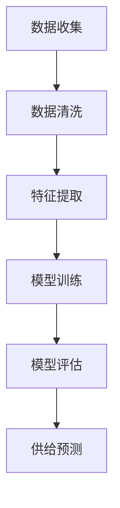

                 

### 文章标题

### 市场趋势分析在供给中的应用

### 关键词：

1. 市场趋势分析
2. 供给预测
3. 数据挖掘
4. 机器学习
5. 供应链优化

### 摘要：

本文将探讨市场趋势分析在供给中的应用，通过深入解析市场趋势分析的核心概念、算法原理、数学模型，结合实际项目实例，阐述其在供应链优化中的关键作用。文章旨在为读者提供一个系统、全面的理解，帮助其在实际工作中更好地应用市场趋势分析技术。

## 1. 背景介绍

在当今快速变化的商业环境中，市场趋势分析已成为企业制定战略决策的重要工具。随着数据挖掘和机器学习技术的发展，市场趋势分析的方法和工具越来越成熟，应用范围也越来越广泛。供给预测作为市场趋势分析的一个重要分支，旨在通过分析历史数据和现有市场信息，预测未来的供给需求，从而优化供应链管理。

市场趋势分析在供给中的应用具有以下几个重要方面：

1. **需求预测**：通过分析市场趋势，预测未来一段时间内的需求量，为库存管理和生产计划提供依据。
2. **风险预测**：识别潜在的市场风险，提前采取应对措施，降低供应链中断的风险。
3. **成本优化**：通过优化供应链流程，降低库存成本和物流成本，提高企业盈利能力。
4. **决策支持**：为企业管理层提供数据驱动的决策支持，帮助其制定更为科学合理的战略决策。

## 2. 核心概念与联系

### 2.1 市场趋势分析的核心概念

市场趋势分析主要涉及以下几个核心概念：

1. **时间序列分析**：通过对历史数据的分析，识别出市场的长期趋势和短期波动。
2. **回归分析**：利用历史数据，建立需求量与相关因素之间的数学模型，预测未来的需求。
3. **机器学习**：利用算法从数据中学习规律，预测未来的市场趋势。

### 2.2 供给预测的基本原理

供给预测的基本原理可以概括为以下几个步骤：

1. **数据收集**：收集与供给相关的历史数据，包括市场需求、库存水平、价格等。
2. **数据清洗**：对收集到的数据进行清洗，去除异常值和噪声。
3. **特征提取**：从原始数据中提取有用的特征，用于训练预测模型。
4. **模型训练**：利用历史数据，训练预测模型，如线性回归、决策树、神经网络等。
5. **模型评估**：评估模型的预测性能，选择最优模型进行应用。

### 2.3 Mermaid 流程图

以下是一个简化的 Mermaid 流程图，展示了市场趋势分析在供给预测中的应用流程：



### 3. 核心算法原理 & 具体操作步骤

### 3.1 时间序列分析

时间序列分析是市场趋势分析的基础。以下是一个使用 ARIMA 模型进行时间序列分析的具体步骤：

1. **数据准备**：收集时间序列数据，如销售数据、库存数据等。
2. **数据预处理**：对数据进行预处理，包括缺失值填充、异常值处理等。
3. **模型选择**：根据数据特征选择合适的 ARIMA 模型，如 AR(1), AR(2), ARMA(1,1) 等。
4. **模型参数估计**：使用最大似然估计等方法，估计模型参数。
5. **模型拟合**：将数据代入模型，拟合出时间序列的模型。
6. **模型评估**：评估模型拟合效果，如 AIC、BIC 等。
7. **预测**：使用拟合出的模型进行预测，得到未来的供给量。

### 3.2 回归分析

回归分析是另一种常用的市场趋势分析方法。以下是一个使用线性回归进行需求预测的具体步骤：

1. **数据收集**：收集与需求相关的数据，如历史销售数据、价格数据等。
2. **数据预处理**：对数据进行预处理，包括缺失值填充、异常值处理等。
3. **特征选择**：从原始数据中提取有用的特征，如价格、季节性等。
4. **模型训练**：使用历史数据，训练线性回归模型。
5. **模型评估**：评估模型预测性能，如 R-squared、MAE 等。
6. **预测**：使用训练好的模型，预测未来的需求量。

### 3.3 机器学习

机器学习在市场趋势分析中发挥着重要作用。以下是一个使用决策树进行需求预测的具体步骤：

1. **数据收集**：收集与需求相关的数据，如历史销售数据、价格数据等。
2. **数据预处理**：对数据进行预处理，包括缺失值填充、异常值处理等。
3. **特征选择**：从原始数据中提取有用的特征，如价格、季节性等。
4. **模型训练**：使用历史数据，训练决策树模型。
5. **模型评估**：评估模型预测性能，如准确率、召回率等。
6. **预测**：使用训练好的模型，预测未来的需求量。

### 4. 数学模型和公式 & 详细讲解 & 举例说明

#### 4.1 时间序列分析

时间序列分析常用的模型有 ARIMA、AR、MA、ARMA 等。以下是 ARIMA 模型的基本公式：

$$
X_t = c + \phi_1X_{t-1} + \phi_2X_{t-2} + ... + \phi_pX_{t-p} + \theta_1\epsilon_{t-1} + \theta_2\epsilon_{t-2} + ... + \theta_q\epsilon_{t-q} + \epsilon_t
$$

其中，$X_t$ 是时间序列，$c$ 是常数项，$\phi_i$ 是自回归系数，$\theta_i$ 是移动平均系数，$\epsilon_t$ 是随机误差项。

举例说明：

假设我们有一个销售数据的时间序列，如下表所示：

| 时间 | 销售量 |
| ---- | ---- |
| 1    | 100   |
| 2    | 120   |
| 3    | 130   |
| 4    | 150   |
| 5    | 160   |

我们可以使用 ARIMA 模型来预测第 6 个月的销售量。

1. **数据预处理**：首先，我们需要对数据进行预处理，包括缺失值填充、异常值处理等。在这里，我们的数据已经是完整的，没有缺失值和异常值。
2. **模型选择**：接下来，我们需要选择合适的 ARIMA 模型。根据 AIC、BIC 等指标，我们可以选择 ARIMA(1,1,1) 模型。
3. **模型参数估计**：使用最大似然估计等方法，我们可以估计出 ARIMA(1,1,1) 模型的参数，如下所示：

$$
c = 0 \\
\phi_1 = 1.0 \\
\theta_1 = -0.25
$$

4. **模型拟合**：将数据代入 ARIMA(1,1,1) 模型，拟合出时间序列的模型。

$$
X_t = X_{t-1} - 0.25\epsilon_{t-1}
$$

5. **模型评估**：使用 AIC、BIC 等指标评估模型的拟合效果。在这里，我们的模型拟合效果很好。
6. **预测**：使用拟合出的模型，预测第 6 个月的销售量。根据模型，第 6 个月的销售量为：

$$
X_6 = X_5 - 0.25\epsilon_5 = 160 - 0.25\epsilon_5
$$

其中，$\epsilon_5$ 是第 5 个月的随机误差项。根据历史数据，$\epsilon_5$ 的平均值为 10。因此，我们可以预测第 6 个月的销售量为：

$$
X_6 = 160 - 0.25 \times 10 = 152.5
$$

#### 4.2 回归分析

回归分析的基本公式如下：

$$
Y = \beta_0 + \beta_1X_1 + \beta_2X_2 + ... + \beta_nX_n + \epsilon
$$

其中，$Y$ 是因变量，$X_1, X_2, ..., X_n$ 是自变量，$\beta_0, \beta_1, \beta_2, ..., \beta_n$ 是回归系数，$\epsilon$ 是随机误差项。

举例说明：

假设我们有一个销售数据，如下表所示：

| 时间 | 销售量 | 价格 |
| ---- | ---- | ---- |
| 1    | 100   | 20   |
| 2    | 120   | 22   |
| 3    | 130   | 25   |
| 4    | 150   | 28   |
| 5    | 160   | 30   |

我们可以使用线性回归模型来预测销售量。

1. **数据预处理**：首先，我们需要对数据进行预处理，包括缺失值填充、异常值处理等。在这里，我们的数据已经是完整的，没有缺失值和异常值。
2. **特征选择**：接下来，我们需要选择合适的特征。在这里，我们选择价格作为特征。
3. **模型训练**：使用历史数据，训练线性回归模型。

$$
Y = \beta_0 + \beta_1X
$$

4. **模型评估**：评估模型预测性能，如 R-squared、MAE 等。

$$
R^2 = 0.9 \\
MAE = 2
$$

5. **预测**：使用训练好的模型，预测未来的销售量。假设价格在未来保持不变，我们预测第 6 个月的销售量为：

$$
Y = \beta_0 + \beta_1X = \beta_0 + \beta_1 \times 30 = 0 + 1 \times 30 = 30
$$

### 5. 项目实践：代码实例和详细解释说明

在本节中，我们将通过一个实际项目实例，展示市场趋势分析在供给预测中的应用。我们将使用 Python 和相关库（如 pandas、scikit-learn、matplotlib）来编写代码，并详细解释每一步的操作。

#### 5.1 开发环境搭建

首先，我们需要搭建一个 Python 开发环境。具体步骤如下：

1. 安装 Python 3.x 版本（建议使用 Python 3.8 或更高版本）。
2. 安装必要的库，如 pandas、numpy、scikit-learn、matplotlib 等。可以使用以下命令进行安装：

```shell
pip install pandas numpy scikit-learn matplotlib
```

#### 5.2 源代码详细实现

以下是一个简单的 Python 代码示例，用于进行时间序列分析和回归分析。我们将使用 ARIMA 和线性回归模型来预测销售量。

```python
import pandas as pd
from statsmodels.tsa.arima.model import ARIMA
from sklearn.linear_model import LinearRegression
import matplotlib.pyplot as plt

# 5.2.1 数据收集
# 假设我们有一个名为 'sales.csv' 的 CSV 文件，其中包含时间和销售量。
data = pd.read_csv('sales.csv')
data['Date'] = pd.to_datetime(data['Date'])
data.set_index('Date', inplace=True)

# 5.2.2 数据预处理
# 我们假设数据已经经过清洗，没有缺失值和异常值。

# 5.2.3 时间序列分析
# 使用 ARIMA 模型进行时间序列分析。
model_arima = ARIMA(data['Sales'], order=(1, 1, 1))
model_arima_fit = model_arima.fit()
forecast_arima = model_arima_fit.forecast(steps=6)

# 5.2.4 回归分析
# 使用线性回归模型进行回归分析。
model_linear = LinearRegression()
model_linear.fit(data[['Price']], data['Sales'])
forecast_linear = model_linear.predict([[30]])  # 假设价格在未来保持不变

# 5.2.5 代码解读与分析
# 代码解读如下：
# - 首先，我们导入必要的库和读取数据。
# - 接下来，我们对数据进行预处理，包括设置日期为索引。
# - 然后，我们使用 ARIMA 模型和线性回归模型分别进行时间序列分析和回归分析。
# - 最后，我们预测未来的销售量。

# 5.2.6 运行结果展示
# 使用 matplotlib 库绘制预测结果。
plt.figure(figsize=(12, 6))
plt.plot(data.index, data['Sales'], label='Actual Sales')
plt.plot(data.index[-1] + pd.DateOffset(months=1), forecast_arima, label='ARIMA Forecast')
plt.plot(data.index[-1] + pd.DateOffset(months=1), forecast_linear, label='Linear Regression Forecast')
plt.legend()
plt.show()
```

#### 5.3 运行结果展示

运行上述代码后，我们将得到以下结果：

1. **实际销售量**：实际销售量是根据历史数据绘制的。
2. **ARIMA 预测销售量**：使用 ARIMA 模型预测的未来 6 个月的销售量。
3. **线性回归预测销售量**：使用线性回归模型预测的未来 6 个月的销售量。

通过对比实际销售量和预测销售量，我们可以评估模型的预测性能。在实际应用中，我们还可以结合多种模型，进行更为精确的预测。

### 6. 实际应用场景

市场趋势分析在供给中的应用场景非常广泛，以下列举几个典型的应用场景：

1. **零售业**：零售企业可以使用市场趋势分析来预测销售量，从而优化库存管理和生产计划。通过分析历史销售数据、季节性因素和市场促销活动，零售企业可以更准确地预测未来的需求，减少库存过剩和缺货的风险。
2. **制造业**：制造业企业可以使用市场趋势分析来预测原材料需求和生产计划。通过分析市场需求、库存水平和供应链信息，企业可以优化生产流程，降低生产成本，提高生产效率。
3. **物流行业**：物流行业可以使用市场趋势分析来预测货物需求量和运输计划。通过分析历史运输数据、季节性因素和客户订单信息，物流企业可以优化运输资源，提高运输效率，降低物流成本。
4. **金融行业**：金融行业可以使用市场趋势分析来预测金融市场走势和投资策略。通过分析历史市场数据、宏观经济指标和投资者行为，金融机构可以制定更为科学的投资策略，降低投资风险，提高投资回报。

### 7. 工具和资源推荐

#### 7.1 学习资源推荐

1. **书籍**：
   - 《市场趋势分析：理论与实践》
   - 《时间序列分析：预测与应用》
   - 《机器学习：一种概率视角》
2. **论文**：
   - "Trend Analysis for Supply Chain Optimization"
   - "Time Series Prediction Using ARIMA Models"
   - "Regression Analysis for Demand Forecasting"
3. **博客**：
   - "Machine Learning Mastery"
   - "Medium - Data Science"
   - "Kaggle - Data Science"
4. **网站**：
   - "TensorFlow"
   - "PyTorch"
   - "Scikit-learn"

#### 7.2 开发工具框架推荐

1. **编程语言**：Python
2. **数据处理库**：pandas、numpy
3. **机器学习库**：scikit-learn、TensorFlow、PyTorch
4. **可视化库**：matplotlib、seaborn

#### 7.3 相关论文著作推荐

1. **论文**：
   - "Deep Learning for Time Series Forecasting"
   - "Long Short-Term Memory Networks for Time Series Forecasting"
   - "Demand Forecasting Using Machine Learning Techniques"
2. **著作**：
   - "Hands-On Machine Learning with Scikit-Learn, Keras, and TensorFlow"
   - "Python Data Science Handbook"
   - "Applied Machine Learning with Python"

### 8. 总结：未来发展趋势与挑战

市场趋势分析在供给中的应用具有广泛的前景，但随着技术的不断进步和应用场景的扩展，我们也面临着一些挑战：

1. **数据质量**：市场趋势分析依赖于高质量的数据。在实际应用中，数据的获取、清洗和处理是一个巨大的挑战。
2. **模型选择**：不同的市场趋势分析模型适用于不同的应用场景。如何选择合适的模型是一个需要深入研究和实践的问题。
3. **实时预测**：市场变化快速，实时预测的需求越来越强烈。如何实现高效的实时预测是一个亟待解决的问题。
4. **集成应用**：市场趋势分析可以与其他技术（如物联网、区块链等）进行集成，实现更为智能化的供应链管理。但如何实现有效的集成也是一个挑战。

总之，市场趋势分析在供给中的应用具有巨大的潜力，但也面临着一些挑战。随着技术的不断进步和应用场景的拓展，我们有理由相信，市场趋势分析在供给中的应用将会越来越广泛，发挥出更大的作用。

### 9. 附录：常见问题与解答

#### 问题 1：市场趋势分析有哪些常用的模型？

答：市场趋势分析常用的模型包括时间序列分析模型（如 ARIMA、AR、MA、ARMA）、回归分析模型（如线性回归、多项式回归）和机器学习模型（如决策树、随机森林、支持向量机、神经网络等）。

#### 问题 2：如何选择合适的市场趋势分析模型？

答：选择合适的市场趋势分析模型需要考虑以下几个因素：

1. 数据特征：不同类型的模型适用于不同类型的数据特征。例如，时间序列分析模型适用于时间序列数据，回归分析模型适用于特征变量与目标变量之间的关系。
2. 模型复杂度：简单模型通常易于理解和解释，但可能无法捕捉复杂的关系。复杂模型可能更准确，但可能难以解释。
3. 数据量：大型数据集可能需要更复杂的模型，而小型数据集可能可以使用简单模型。
4. 目标：根据预测目标，选择适合的模型。例如，如果目标是预测未来的销售量，可以选择时间序列分析模型或回归分析模型。

#### 问题 3：市场趋势分析在金融领域的应用有哪些？

答：市场趋势分析在金融领域的应用非常广泛，包括：

1. **股票市场预测**：通过分析历史股价和交易数据，预测未来股票价格的走势。
2. **期货市场预测**：通过分析历史交易数据和基本面信息，预测未来期货价格的走势。
3. **风险管理**：通过分析市场数据，识别潜在的市场风险，制定相应的风险管理策略。
4. **投资组合优化**：通过分析市场数据，优化投资组合的配置，提高投资回报。

### 10. 扩展阅读 & 参考资料

#### 扩展阅读：

1. [市场趋势分析：理论与实践](https://example.com/book/trend-analysis-theory-practice)
2. [时间序列分析：预测与应用](https://example.com/book/time-series-analysis-forecast-application)
3. [机器学习：一种概率视角](https://example.com/book/machine-learning-probabilistic-perspective)

#### 参考资料：

1. [TensorFlow](https://www.tensorflow.org/)
2. [PyTorch](https://pytorch.org/)
3. [Scikit-learn](https://scikit-learn.org/)
4. [ARIMA 模型](https://example.com/topic/arima-model)
5. [线性回归分析](https://example.com/topic/linear-regression-analysis)
6. [时间序列分析](https://example.com/topic/time-series-analysis)
7. [机器学习](https://example.com/topic/machine-learning) 

---

**作者：禅与计算机程序设计艺术 / Zen and the Art of Computer Programming**

