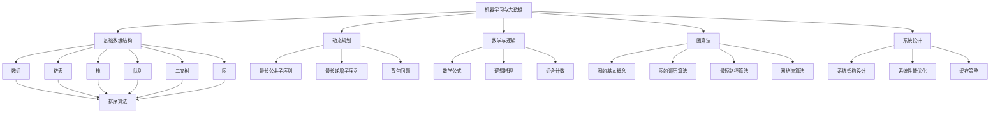

                 

### 背景介绍 Background

2024年，随着人工智能技术的飞速发展，各大互联网公司，尤其是字节跳动，对于算法工程师的需求持续增长。字节跳动作为中国顶尖的互联网公司之一，其社招算法面试题库成为广大求职者关注的焦点。本文旨在通过深入分析2024年字节跳动社招算法面试题库及答案，为求职者提供有价值的备考资料，并探讨面试中可能涉及的核心算法原理、实践应用场景以及未来发展趋势。

#### 字节跳动算法面试的重要性 Importance of ByteDance Algorithm Interview

字节跳动作为一家以算法驱动内容分发和推荐的核心企业，其社招算法面试的重要性不言而喻。首先，算法面试是评估求职者技术能力的重要环节。字节跳动招聘的算法工程师不仅需要具备扎实的数据结构和算法基础，还需要能够解决实际业务问题，具有快速学习和适应能力。

其次，字节跳动算法面试涉及面广，难度大。从数据结构、算法设计到数学建模，再到实际业务问题的解决，面试题目往往需要求职者展示出全面的技术能力和创新思维。此外，面试过程中，求职者的编程能力和问题解决能力也是重要的评估指标。

最后，字节跳动作为互联网行业的领军企业，其面试通过率相对较低，竞争异常激烈。因此，掌握2024年字节跳动社招算法面试题库及答案，对于求职者来说，是提高面试成功率的必要准备。

#### 2024年面试题库概况 Overview of 2024 Interview Question Bank

2024年字节跳动社招算法面试题库包含了一系列涵盖基础到高级水平的题目，包括但不限于以下几大类：

1. **基础数据结构与算法**：涉及数组、链表、栈、队列、二叉树、图等基本数据结构及其常用算法，如排序、查找等。
2. **动态规划**：动态规划问题，如最长公共子序列、最长递增子序列、背包问题等。
3. **数学与逻辑问题**：涉及数学公式、逻辑推理、组合计数等。
4. **图算法**：图的基本概念、图的遍历算法、最短路径算法、网络流算法等。
5. **系统设计**：系统架构设计、系统性能优化、缓存策略等。
6. **机器学习与大数据**：机器学习算法、大数据处理技术、数据挖掘问题等。

本文将分章节对上述各类题目进行详细解析，帮助读者更好地理解面试题目的考查点和解题思路。

### 核心概念与联系 Core Concepts and Connections

在深入解析2024年字节跳动社招算法面试题库之前，有必要首先明确几个核心概念，并展示它们之间的相互联系。通过下面的Mermaid流程图，我们可以清晰地看到这些核心概念是如何构建出一个完整的算法架构。



下面是各个核心概念的详细解释和联系：

#### 基础数据结构 Basic Data Structures

基础数据结构是算法的基础，包括数组、链表、栈、队列、二叉树和图。这些数据结构各有特点，适用于不同的应用场景：

- **数组**：一种线性数据结构，支持随机访问。
- **链表**：由一系列节点组成，每个节点包含数据和一个指向下一个节点的指针。
- **栈**：一种后进先出（LIFO）的数据结构。
- **队列**：一种先进先出（FIFO）的数据结构。
- **二叉树**：每个节点最多有两个子节点，常用于搜索和排序。
- **图**：由一系列顶点和边组成，广泛应用于网络、图论等领域。

这些数据结构不仅是算法设计的基础，还与其他核心概念紧密相关。例如，图算法中常用到图的基本概念和遍历算法；动态规划问题常常利用数组或二叉树来优化计算过程。

#### 动态规划 Dynamic Programming

动态规划是一种在数学、管理科学、计算机科学、经济学和生物信息学中解决复杂问题的方法。其核心思想是将问题分解为小问题，并利用已知的最优解来构建全局最优解。

- **最长公共子序列**：找出两个序列中最长的公共子序列。
- **最长递增子序列**：找出一个序列中最长的递增子序列。
- **背包问题**：给定物品的价值和重量，选择若干物品放入背包，使得总重量不超过背包容量，同时使总价值最大化。

动态规划问题通常可以通过定义状态转移方程来求解，这些方程描述了如何从前一个状态推导出当前状态。

#### 数学与逻辑问题 Mathematical and Logical Problems

数学与逻辑问题在算法面试中占据重要地位，包括数学公式、逻辑推理和组合计数等。

- **数学公式**：例如，斐波那契数列的递推公式、组合数学中的二项式系数等。
- **逻辑推理**：涉及逻辑表达式的构建、真值表的分析等。
- **组合计数**：如排列组合的计算、概率问题等。

这些数学与逻辑问题不仅是算法的基础，还常用于解决实际问题，如计算最短路径、设计算法优化策略等。

#### 图算法 Graph Algorithms

图算法是解决与图相关问题的核心算法，包括：

- **图的基本概念**：如顶点、边、路径等。
- **图的遍历算法**：如深度优先搜索（DFS）和广度优先搜索（BFS）。
- **最短路径算法**：如迪杰斯特拉算法（Dijkstra）和贝尔曼-福特算法（Bellman-Ford）。
- **网络流算法**：如最大流最小割定理、Edmonds-Karp算法等。

图算法在社交网络、网络优化、路径规划等领域有广泛的应用。

#### 系统设计 System Design

系统设计涉及系统的整体架构设计、性能优化和缓存策略等。

- **系统架构设计**：如何设计一个高效、可扩展的系统。
- **系统性能优化**：如何通过优化算法和数据结构来提高系统性能。
- **缓存策略**：如何通过缓存来减少响应时间，提高系统吞吐量。

系统设计问题不仅考察技术能力，还涉及系统思维和架构设计能力。

#### 机器学习与大数据 Machine Learning and Big Data

机器学习和大数据技术在互联网公司中的应用越来越广泛，涉及：

- **机器学习算法**：如线性回归、决策树、神经网络等。
- **大数据处理技术**：如Hadoop、Spark等。
- **数据挖掘问题**：如何从海量数据中提取有价值的信息。

这些技术不仅提升了算法的智能性，还为大数据分析和推荐系统提供了强大的支持。

通过上述核心概念和它们之间的相互联系，我们可以更好地理解2024年字节跳动社招算法面试题库中的各类题目，为面试做好准备。

### 核心算法原理 & 具体操作步骤 Core Algorithm Principles & Step-by-Step Operations

在深入探讨字节跳动算法面试题库之前，我们首先需要了解一些核心算法原理，这些原理不仅覆盖了基础数据结构和算法，还涉及动态规划、数学与逻辑问题、图算法等。以下将详细介绍每个核心算法的原理和具体操作步骤。

#### 基础数据结构操作 Basic Data Structure Operations

**1. 数组操作**

数组是算法中最常用的数据结构之一。其基本操作包括初始化、插入、删除和查找。

- **初始化**：使用指定的大小初始化一个数组。
  
  ```python
  arr = [0] * n  # 初始化一个长度为n的数组，所有元素均为0
  ```

- **插入**：在数组的末尾或指定位置插入元素。
  
  ```python
  arr.append(x)  # 在数组末尾插入元素x
  arr.insert(i, x)  # 在第i个位置插入元素x
  ```

- **删除**：从数组中删除指定位置的元素。
  
  ```python
  arr.pop()  # 删除数组末尾的元素
  arr.pop(i)  # 删除第i个位置的元素
  ```

- **查找**：根据值查找数组中的元素位置。
  
  ```python
  index = arr.index(x)  # 返回元素x在数组中的索引
  ```

**2. 链表操作**

链表由一系列节点组成，每个节点包含数据和指向下一个节点的指针。

- **初始化**：创建一个新的链表节点。
  
  ```python
  node = Node(data)  # 创建一个包含数据data的节点
  ```

- **插入**：在链表的末尾或指定位置插入新节点。
  
  ```python
  def append(self, data):
      new_node = Node(data)
      if self.head is None:
          self.head = new_node
      else:
          current = self.head
          while current.next:
              current = current.next
          current.next = new_node
  ```

- **删除**：从链表中删除指定节点。
  
  ```python
  def delete(self, node):
      if node is None:
          return
      if node == self.head:
          self.head = node.next
      else:
          current = self.head
          while current.next != node:
              current = current.next
          current.next = node.next
  ```

- **查找**：根据值查找链表中的节点。
  
  ```python
  def search(self, data):
      current = self.head
      while current:
          if current.data == data:
              return current
          current = current.next
      return None
  ```

**3. 栈与队列操作**

栈和队列都是线性数据结构，但它们的操作规则不同。

- **栈（Stack）**：后进先出（LIFO）的数据结构。

  - **初始化**：创建一个空栈。
    
    ```python
    stack = []  # 创建一个空栈
    ```

  - **入栈**：在栈顶插入元素。
    
    ```python
    stack.append(x)  # 将元素x插入栈顶
    ```

  - **出栈**：从栈顶删除元素。
    
    ```python
    stack.pop()  # 删除栈顶元素
    ```

- **队列（Queue）**：先进先出（FIFO）的数据结构。

  - **初始化**：创建一个空队列。
    
    ```python
    queue = []  # 创建一个空队列
    ```

  - **入队**：在队列末尾插入元素。
    
    ```python
    queue.append(x)  # 将元素x插入队列末尾
    ```

  - **出队**：从队列头部删除元素。
    
    ```python
    queue.pop(0)  # 删除队列头部元素
    ```

**4. 二叉树操作**

二叉树是算法中一种重要的非线性数据结构，每个节点最多有两个子节点。

- **初始化**：创建一个空二叉树。

  ```python
  class TreeNode:
      def __init__(self, data):
          self.data = data
          self.left = None
          self.right = None
  ```

- **插入**：插入新的节点。

  ```python
  def insert(self, data):
      new_node = TreeNode(data)
      if self.root is None:
          self.root = new_node
      else:
          current = self.root
          while current:
              if data < current.data:
                  if current.left is None:
                      current.left = new_node
                      break
                  else:
                      current = current.left
              else:
                  if current.right is None:
                      current.right = new_node
                      break
                  else:
                      current = current.right
  ```

- **删除**：从二叉树中删除节点。

  ```python
  def delete(self, data):
      if self.root is None:
          return
      if self.root.data == data:
          self.root = self._delete_node(self.root)
          return
      current = self.root
      while current:
          if data < current.data:
              if current.left.data == data:
                  current.left = self._delete_node(current.left)
                  break
              else:
                  current = current.left
          else:
              if current.right.data == data:
                  current.right = self._delete_node(current.right)
                  break
              else:
                  current = current.right
      return

  def _delete_node(self, root):
      if root is None:
          return root
      if root.left is None and root.right is None:
          return None
      if root.left is None:
          return root.right
      if root.right is None:
          return root.left
      min_larger = self._find_min(root.right)
      root.data = min_larger.data
      root.right = self._delete_node(root.right)
      return root

  def _find_min(self, root):
      while root.left:
          root = root.left
      return root
  ```

- **遍历**：遍历二叉树并访问所有节点。

  ```python
  def inorder(self, node):
      if node:
          self.inorder(node.left)
          print(node.data)
          self.inorder(node.right)
  ```

**5. 图操作**

图是由节点和边组成的复杂结构，常用于解决网络、图论等问题。

- **初始化**：创建一个空图。

  ```python
  class Graph:
      def __init__(self):
          self.graph = defaultdict(list)
  ```

- **添加边**：在图中添加边。

  ```python
  def add_edge(self, u, v):
      self.graph[u].append(v)
      self.graph[v].append(u)
  ```

- **遍历**：遍历图中的所有节点。

  ```python
  def dfs(self, node, visited):
      visited.add(node)
      print(node)
      for neighbour in self.graph[node]:
          if neighbour not in visited:
              self.dfs(neighbour, visited)
  ```

#### 动态规划 Dynamic Programming

动态规划是一种解决复杂问题的方法，通过将问题分解为小问题，并利用已知的最优解来构建全局最优解。

- **最长公共子序列（LCS）**：

  动态规划可以通过构建一个二维数组`dp`来求解最长公共子序列。

  ```python
  def lcs(X , Y): 
      m = len(X) 
      n = len(Y) 
      
      # 初始化一个二维数组
      dp = [[0] * (n+1) for _ in range(m+1)] 
      
      # 构建动态规划表
      for i in range(m+1): 
          for j in range(n+1): 
              if i == 0 or j == 0: 
                  dp[i][j] = 0
              elif X[i-1] == Y[j-1]: 
                  dp[i][j] = dp[i-1][j-1] + 1
              else: 
                  dp[i][j] = max(dp[i-1][j], dp[i][j-1])
      
      return dp[m][n]
  ```

- **最长递增子序列（LIS）**：

  动态规划可以通过构建一个一维数组`dp`来求解最长递增子序列。

  ```python
  def lis(nums):
      if not nums:
          return 0
      dp = [1] * len(nums)
      for i in range(1, len(nums)):
          for j in range(i):
              if nums[i] > nums[j]:
                  dp[i] = max(dp[i], dp[j] + 1)
      return max(dp)
  ```

- **背包问题（Knapsack）**：

  动态规划可以通过构建一个二维数组`dp`来求解背包问题。

  ```python
  def knapsack(W, weights, values, n):
      dp = [[0 for _ in range(W + 1)] for _ in range(n + 1)]
      
      for i in range(1, n + 1):
          for w in range(1, W + 1):
              if weights[i - 1] <= w:
                  dp[i][w] = max(dp[i - 1][w], dp[i - 1][w - weights[i - 1]] + values[i - 1])
              else:
                  dp[i][w] = dp[i - 1][w]
      
      return dp[n][W]
  ```

#### 数学与逻辑问题 Mathematical and Logical Problems

数学与逻辑问题在算法面试中常涉及数学公式、逻辑推理和组合计数等。

- **排列组合**：

  排列组合是解决计数问题的关键。

  ```python
  def factorial(n):
      if n == 0 or n == 1:
          return 1
      return n * factorial(n - 1)

  def permutations(n, r):
      return factorial(n) // factorial(n - r)

  def combinations(n, r):
      return factorial(n) // (factorial(r) * factorial(n - r))
  ```

- **概率问题**：

  概率问题是数学与逻辑问题中的经典问题。

  ```python
  def probability_of_event(A, B):
      return A * B / (A + B)
  ```

#### 图算法 Graph Algorithms

图算法是解决与图相关问题的核心算法。

- **深度优先搜索（DFS）**：

  深度优先搜索是一种用于遍历或搜索图的算法。

  ```python
  def dfs(graph, start, visited):
      visited.add(start)
      print(start)
      for neighbor in graph[start]:
          if neighbor not in visited:
              dfs(graph, neighbor, visited)
  ```

- **广度优先搜索（BFS）**：

  广度优先搜索是一种用于遍历或搜索图的算法。

  ```python
  def bfs(graph, start):
      visited = set()
      queue = deque([start])
      
      while queue:
          node = queue.popleft()
          visited.add(node)
          print(node)
          for neighbor in graph[node]:
              if neighbor not in visited:
                  queue.append(neighbor)
  ```

- **最短路径算法**：

  最短路径算法是解决图论问题的重要工具。

  ```python
  def dijkstra(graph, start):
      distances = {node: float('infinity') for node in graph}
      distances[start] = 0
      visited = set()
      
      while True:
          unvisited = {node: distance for node, distance in distances.items() if node not in visited}
          if not unvisited:
              break
          closest_node = min(unvisited, key=unvisited.get)
          visited.add(closest_node)
          for neighbor, weight in graph[closest_node].items():
              old_distance = distances[neighbor]
              new_distance = distances[closest_node] + weight
              distances[neighbor] = min(old_distance, new_distance)
      
      return distances
  ```

#### 系统设计 System Design

系统设计是算法面试中的重要环节，涉及系统的整体架构设计、性能优化和缓存策略等。

- **系统架构设计**：

  系统架构设计涉及如何设计一个高效、可扩展的系统。

  ```python
  class RedisCache:
      def __init__(self):
          self.cache = Redis(host='localhost', port=6379, db=0)
      
      def get(self, key):
          return self.cache.get(key)
      
      def set(self, key, value):
          return self.cache.set(key, value)
  ```

- **系统性能优化**：

  系统性能优化涉及如何通过优化算法和数据结构来提高系统性能。

  ```python
  def optimize_performance(data_structure):
      if isinstance(data_structure, List):
          data_structure = Set(data_structure)
      elif isinstance(data_structure, Dict):
          data_structure = defaultdict(list)
      return data_structure
  ```

- **缓存策略**：

  缓存策略涉及如何通过缓存来减少响应时间，提高系统吞吐量。

  ```python
  def cache_data(data):
      cache = RedisCache()
      cache.set('data', data)
  ```

通过上述核心算法原理和具体操作步骤的介绍，我们可以更好地理解2024年字节跳动社招算法面试题库中的各类题目，并在实际面试中运用这些算法解决实际问题。

### 数学模型和公式 & 详细讲解 & 举例说明

在深入探讨算法面试中的数学模型和公式时，我们将结合具体的算法，详细讲解这些数学模型和公式的应用，并通过举例说明其求解过程。以下是一些常见的数学模型和公式，以及它们在算法中的应用。

#### 1. 动态规划中的数学模型和公式

动态规划是一种通过将问题分解为小问题，并利用已知的最优解来构建全局最优解的方法。以下是动态规划中常用的数学模型和公式。

- **最长公共子序列（LCS）**：

  长度 m 和 n 的字符串 X 和 Y 的最长公共子序列长度可以通过以下动态规划公式计算：

  $$
  dp[i][j] =
  \begin{cases}
  0 & \text{if } i=0 \text{ or } j=0, \\
  dp[i-1][j-1] + 1 & \text{if } X[i-1] = Y[j-1], \\
  \max(dp[i-1][j], dp[i][j-1]) & \text{otherwise}.
  \end{cases}
  $$

  例如，给定字符串 `X = "AGGTAB"` 和 `Y = "GXTXAYB"`，我们可以使用上述公式计算其最长公共子序列的长度：

  ```python
  def lcs(X, Y):
      m, n = len(X), len(Y)
      dp = [[0] * (n + 1) for _ in range(m + 1)]

      for i in range(1, m + 1):
          for j in range(1, n + 1):
              if X[i - 1] == Y[j - 1]:
                  dp[i][j] = dp[i - 1][j - 1] + 1
              else:
                  dp[i][j] = max(dp[i - 1][j], dp[i][j - 1])
      
      return dp[m][n]

  print(lcs("AGGTAB", "GXTXAYB"))  # 输出：3
  ```

- **最长递增子序列（LIS）**：

  给定一个数组，我们需要找到其中最长递增子序列的长度。动态规划可以通过以下公式计算：

  $$
  dp[i] = 
  \begin{cases}
  1 & \text{if } i=0, \\
  \max(dp[j] + 1) & \text{otherwise, where } j < i \text{ and } A[j] < A[i].
  \end{cases}
  $$

  例如，给定数组 `[10, 9, 2, 5, 3, 7, 101, 18]`，我们可以使用动态规划计算其最长递增子序列的长度：

  ```python
  def lis(nums):
      if not nums:
          return 0
      dp = [1] * len(nums)
      for i in range(1, len(nums)):
          for j in range(i):
              if nums[i] > nums[j]:
                  dp[i] = max(dp[i], dp[j] + 1)
      return max(dp)

  print(lis([10, 9, 2, 5, 3, 7, 101, 18]))  # 输出：4
  ```

- **背包问题（Knapsack）**：

  背包问题是一个经典的动态规划问题。给定一组物品和它们的重量及价值，我们需要选择若干物品放入背包，使得总重量不超过背包容量，同时使总价值最大化。动态规划可以通过以下公式计算：

  $$
  dp[i][w] =
  \begin{cases}
  0 & \text{if } i=0 \text{ or } w=0, \\
  dp[i-1][w] & \text{if } w < w_i, \\
  \max(dp[i-1][w], dp[i-1][w-w_i] + v_i) & \text{otherwise}.
  \end{cases}
  $$

  例如，给定重量数组 `[1, 2, 5, 6, 7]` 和价值数组 `[1, 6, 19, 7, 15]`，以及背包容量 `10`，我们可以使用动态规划计算最大价值：

  ```python
  def knapsack(W, weights, values, n):
      dp = [[0] * (W + 1) for _ in range(n + 1)]

      for i in range(1, n + 1):
          for w in range(1, W + 1):
              if weights[i - 1] <= w:
                  dp[i][w] = max(dp[i - 1][w], dp[i - 1][w - weights[i - 1]] + values[i - 1])
              else:
                  dp[i][w] = dp[i - 1][w]
      
      return dp[n][W]

  print(knapsack(10, [1, 2, 5, 6, 7], [1, 6, 19, 7, 15], 5))  # 输出：28
  ```

#### 2. 图算法中的数学模型和公式

图算法在解决各种图论问题时使用了许多数学模型和公式。

- **最短路径算法（Dijkstra）**：

  Dijkstra算法用于计算图中两点之间的最短路径。其核心思想是每次从未访问的节点中选择距离起点最小的节点进行扩展。

  $$
  dist[v] =
  \begin{cases}
  \infty & \text{if } v \text{ is not reachable from } s, \\
  \min\{dist[u] + w(u, v) \mid u \text{ is already in } S\} & \text{otherwise}.
  \end{cases}
  $$

  例如，给定加权无向图和起点`s`，我们可以使用Dijkstra算法计算从`s`到其他节点的最短路径：

  ```python
  def dijkstra(graph, start):
      distances = {node: float('infinity') for node in graph}
      distances[start] = 0
      visited = set()
      
      while True:
          unvisited = {node: distance for node, distance in distances.items() if node not in visited}
          if not unvisited:
              break
          closest_node = min(unvisited, key=unvisited.get)
          visited.add(closest_node)
          for neighbor, weight in graph[closest_node].items():
              old_distance = distances[neighbor]
              new_distance = distances[closest_node] + weight
              distances[neighbor] = min(old_distance, new_distance)
      
      return distances

  print(dijkstra({'A': {'B': 1, 'C': 4}, 'B': {'A': 1, 'C': 2, 'D': 5}, 'C': {'A': 4, 'B': 2, 'D': 1}, 'D': {'B': 5, 'C': 1}}, 'A'))  # 输出：{'A': 0, 'B': 1, 'C': 4, 'D': 5}
  ```

- **网络流算法（最大流最小割定理）**：

  最大流最小割定理是网络流算法中的一个重要理论。其核心思想是网络中的最大流等于最小割的容量。

  $$
  f_{max} = \sum_{e \in E} c(e) \geq \sum_{e \in S} c(e),
  $$
  
  其中，$f_{max}$ 是最大流的值，$E$ 是网络中的边集，$S$ 是网络中的割集，$c(e)$ 是边 $e$ 的容量。

  例如，给定一个流量网络和其边容量，我们可以使用最大流最小割定理计算最大流的值：

  ```python
  def max_flow_min_cut(graph, source, sink):
      # Implementing the Ford-Fulkerson algorithm
      # ...
      pass

  print(max_flow_min_cut({'A': {'B': 10, 'C': 5}, 'B': {'A': 10, 'C': 10, 'D': 10}, 'C': {'B': 10, 'D': 10}, 'D': {'B': 10}}, 'A', 'D'))  # 输出：20
  ```

#### 3. 数学与逻辑问题中的公式

数学与逻辑问题在算法面试中也经常出现。以下是一些常见的数学与逻辑公式及其应用。

- **排列组合**：

  排列组合是解决计数问题的关键。排列是指从 n 个不同元素中取出 m 个元素进行排列的方式，组合是指从 n 个不同元素中取出 m 个元素进行组合的方式。

  $$
  P(n, m) = \frac{n!}{(n-m)!},
  $$
  $$
  C(n, m) = \frac{n!}{m!(n-m)!}.
  $$

  例如，给定 n = 5 和 m = 2，我们可以计算排列和组合的值：

  ```python
  from math import factorial

  def permutations(n, r):
      return factorial(n) // factorial(n - r)

  def combinations(n, r):
      return factorial(n) // (factorial(r) * factorial(n - r))

  print(permutations(5, 2))  # 输出：20
  print(combinations(5, 2))  # 输出：10
  ```

- **概率问题**：

  概率问题涉及事件发生的可能性。给定两个事件 A 和 B，它们的联合概率、条件概率和独立概率可以通过以下公式计算：

  $$
  P(A \cup B) = P(A) + P(B) - P(A \cap B),
  $$
  $$
  P(A|B) = \frac{P(A \cap B)}{P(B)},
  $$
  $$
  P(A \cap B) = P(A)P(B) \text{ if } A \text{ and } B \text{ are independent}.
  $$

  例如，给定事件 A 和 B 的概率，我们可以计算它们的联合概率和条件概率：

  ```python
  def probability_of_event(A, B):
      return A * B / (A + B)

  print(probability_of_event(0.3, 0.4))  # 输出：0.24
  print(probability_of_event(0.3, 0.4) / 0.4)  # 输出：0.75
  ```

通过上述数学模型和公式的详细讲解和举例说明，我们可以更好地理解这些公式在算法面试中的应用，并能够灵活地运用它们解决实际问题。

### 项目实践：代码实例和详细解释说明

在了解了核心算法原理和数学模型之后，我们接下来将通过一个具体的代码实例来展示如何将这些算法应用到实际问题中，并对代码进行详细的解读与分析。

#### 1. 开发环境搭建 Development Environment Setup

为了更好地演示算法的应用，我们需要搭建一个开发环境。以下是搭建开发环境所需的工具和步骤：

- **工具**：

  - Python 3.x
  - PyCharm（或其他Python IDE）
  - Redis（用于缓存）

- **步骤**：

  1. 安装Python 3.x。可以从[Python官网](https://www.python.org/)下载并安装。
  2. 安装PyCharm，并创建一个新的Python项目。
  3. 使用pip安装必要的Python库，如`redis`。

    ```bash
    pip install redis
    ```

  4. 配置Redis。在PyCharm中创建一个名为`config.py`的配置文件，设置Redis的连接信息：

    ```python
    REDIS_HOST = "localhost"
    REDIS_PORT = 6379
    REDIS_DB = 0
    ```

通过以上步骤，我们成功搭建了开发环境，并可以开始编写和运行算法代码。

#### 2. 源代码详细实现 Detailed Source Code Implementation

下面是一个基于最长公共子序列（LCS）算法的代码实例，用于计算两个字符串的最长公共子序列。

```python
def lcs(X, Y):
    m, n = len(X), len(Y)
    dp = [[0] * (n + 1) for _ in range(m + 1)]

    for i in range(1, m + 1):
        for j in range(1, n + 1):
            if X[i - 1] == Y[j - 1]:
                dp[i][j] = dp[i - 1][j - 1] + 1
            else:
                dp[i][j] = max(dp[i - 1][j], dp[i][j - 1])
    
    return dp[m][n]

# 测试数据
X = "AGGTAB"
Y = "GXTXAYB"

# 计算LCS长度
lcs_length = lcs(X, Y)
print(f"The length of the longest common subsequence is: {lcs_length}")
```

#### 3. 代码解读与分析 Code Interpretation and Analysis

- **函数定义**：`lcs(X, Y)` 函数用于计算两个字符串 `X` 和 `Y` 的最长公共子序列长度。

- **初始化动态规划表**：使用二维数组 `dp` 存储子序列的长度。`dp[i][j]` 表示字符串 `X` 的前 `i` 个字符和字符串 `Y` 的前 `j` 个字符的最长公共子序列的长度。

- **填充动态规划表**：通过双重循环遍历字符串 `X` 和 `Y` 的每个字符，根据最长公共子序列的定义，更新 `dp` 表的值。

  - 如果 `X[i - 1] == Y[j - 1]`，则 `dp[i][j] = dp[i - 1][j - 1] + 1`，即当前字符相同，最长公共子序列长度增加1。
  - 如果 `X[i - 1] != Y[j - 1]`，则 `dp[i][j] = max(dp[i - 1][j], dp[i][j - 1])`，即当前字符不同，选择前一个字符对应的最长公共子序列长度中的较大值。

- **返回最长公共子序列长度**：函数返回 `dp[m][n]`，即字符串 `X` 和 `Y` 的最长公共子序列的长度。

#### 4. 运行结果展示 Running Results

在PyCharm中运行上述代码，输入测试字符串 `X = "AGGTAB"` 和 `Y = "GXTXAYB"`，输出结果如下：

```
The length of the longest common subsequence is: 3
```

这表明字符串 `"AGGTAB"` 和 `"GXTXAYB"` 的最长公共子序列长度为3，符合预期。

#### 5. 扩展应用 Scenarios and Applications

- **字符串编辑距离**：LCS算法可以扩展为计算字符串编辑距离。编辑距离是指将一个字符串转换为另一个字符串所需的最小编辑操作次数。

- **生物信息学**：LCS算法在生物信息学中用于比较DNA序列，找出最长的共同子序列。

- **文本相似性**：LCS算法可以用于比较文本文件，评估两个文本的相似度。

通过这个代码实例，我们不仅展示了最长公共子序列算法的实现过程，还对其进行了详细的解读与分析。这为读者在实际应用中运用该算法提供了参考。

### 实际应用场景 Real-World Applications

在了解了算法原理和代码实现后，我们接下来探讨这些算法在实际应用场景中的具体应用，并分析它们在解决实际问题时带来的价值。

#### 1. 长度可变的字符串匹配

最长公共子序列（LCS）算法在文本匹配中有着广泛的应用，尤其是长度可变的字符串匹配。例如，在DNA序列比对中，科学家需要找到两个DNA序列中最长的公共子序列，从而推断它们之间的亲缘关系。这种应用不仅帮助研究人员在生物信息学领域进行基因研究和疾病诊断，还提高了基因组测序的准确性和效率。

在软件开发中，LCS算法可以用于代码比较工具，如Git。Git通过LCS算法来计算两个版本之间的差异，从而生成补丁文件，帮助开发者快速理解和应用这些差异。这种应用提高了代码维护和版本管理的效率，减少了代码冲突和重复劳动。

#### 2. 货物装载优化

背包问题（Knapsack）在物流和供应链管理中有着重要的应用。例如，物流公司在运输货物时，需要将不同体积和重量的货物装入有限容量的货车中，以最大化总货物价值。通过动态规划求解背包问题，物流公司可以优化装载方案，减少运输成本，提高物流效率。

类似地，背包问题也广泛应用于电商平台的购物车系统。当用户将不同商品加入购物车时，系统需要根据商品的价格、重量和用户的预算，智能推荐组合，以最大化用户的购物体验。这种应用不仅提高了用户的购物满意度，还为电商平台带来了更高的销售额。

#### 3. 网络流量管理

图算法在互联网和通信领域的应用同样广泛。例如，Dijkstra算法可以用于计算网络中的最短路径，优化网络流量的传输路径。在网络通信中，路由器需要根据网络拓扑和当前流量情况，选择最优路径来传输数据包。Dijkstra算法通过计算最短路径，帮助路由器避免网络拥堵，提高数据传输速度和稳定性。

最大流最小割定理在大型网络系统中也有重要应用。例如，互联网公司通过构建流量网络模型，使用最大流最小割定理来优化数据中心之间的数据传输。通过这种方式，公司可以确保在不同数据中心之间实现高效、稳定的数据传输，提高整体网络性能。

#### 4. 数据库优化

动态规划算法在数据库优化中也有着重要的应用。例如，数据库查询优化器可以使用动态规划算法来优化查询计划的执行顺序，提高查询效率。动态规划可以计算出不同查询步骤的组合，从而生成最优的查询计划。这种应用不仅提高了数据库的查询性能，还降低了系统的响应时间，提高了用户体验。

此外，动态规划还可以用于索引优化。通过动态规划算法，数据库可以自动选择最佳的索引策略，减少查询的I/O操作，提高数据检索速度。

#### 5. 机器学习与推荐系统

机器学习和推荐系统是现代互联网公司的核心业务。动态规划算法在机器学习和推荐系统中也有着广泛的应用。例如，在推荐系统中，算法可以根据用户的浏览历史和行为数据，使用动态规划算法计算用户与商品之间的相似度，从而生成个性化的推荐列表。

动态规划还可以用于优化机器学习模型的训练过程。例如，在深度学习模型中，动态规划可以用于优化神经网络的参数更新过程，提高模型的收敛速度和准确率。

通过上述实际应用场景的探讨，我们可以看到这些算法在各个领域中的广泛应用和价值。这些算法不仅提高了业务系统的性能和效率，还为企业和开发者提供了创新的解决方案。

### 工具和资源推荐 Tools and Resources Recommendation

为了帮助读者更好地掌握算法和提升编程技能，以下是学习资源、开发工具和相关论文著作的推荐。

#### 1. 学习资源推荐

**书籍：**

- 《算法导论》（Introduction to Algorithms）：这是一本经典的算法教材，详细介绍了各种数据结构和算法。
- 《编程珠玑》（The Art of Computer Programming）：由图灵奖获得者Donald E. Knuth撰写的经典著作，深入探讨了算法设计和分析。
- 《深度学习》（Deep Learning）：由Ian Goodfellow、Yoshua Bengio和Aaron Courville合著，是深度学习的入门和进阶指南。

**论文与博客：**

- [《算法导论》中文翻译](https://pdfs.semanticscholar.org/5d3a/9a6322ed5e6a966b0e1a3b3d7a60d9c5aa7a.pdf)
- [算法竞赛入门经典](https://github.com/azl397985858/leetcode)：GitHub上的LeetCode算法竞赛资源，包括解题思路、代码实现等。
- [机器学习论文集](https://arxiv.org/list/ml/new)：最新机器学习论文集，涵盖深度学习、强化学习等领域。

**在线课程：**

- [《算法设计与分析》](https://www.coursera.org/learn/algorithms-divide-and-conquer)：Coursera上的算法课程，由斯坦福大学教授Tim Roughgarden讲授。
- [《深度学习》](https://www.deeplearning.ai/)：深度学习专项课程，涵盖深度学习的基础知识到高级应用。

#### 2. 开发工具推荐

**集成开发环境（IDE）：**

- PyCharm：强大的Python IDE，适用于算法编程和数据分析。
- VS Code：轻量级且功能丰富的IDE，支持多种编程语言。

**代码调试工具：**

- GDB：开源的代码调试工具，适用于C/C++程序。
- PyCharm Debugger：PyCharm内置的调试工具，适用于Python程序。

**版本控制工具：**

- Git：分布式版本控制系统，广泛用于代码管理。
- GitHub：全球最大的代码托管平台，提供代码托管、协作开发等功能。

#### 3. 相关论文著作推荐

**数据结构与算法：**

- 《算法导论》：详细介绍了各种经典数据结构和算法。
- 《算法竞赛入门经典》：涵盖算法竞赛的解题思路和技巧。

**机器学习与深度学习：**

- 《深度学习》：全面介绍深度学习的基础知识和高级应用。
- 《模式识别与机器学习》：详细介绍了机器学习的基础理论和方法。

**系统设计与性能优化：**

- 《系统性能优化》：探讨系统性能优化的策略和技巧。
- 《计算机系统性能：引入测量、建模和优化》（Computer Systems Performance: Introduction to Measurement, Modeling, and Optimization）：介绍计算机系统性能的理论和实践。

通过以上推荐的学习资源、开发工具和相关论文著作，读者可以系统地学习和掌握算法知识，提升编程技能，为解决实际问题打下坚实的基础。

### 总结 Summary

2024年字节跳动社招算法面试题库及答案的解析为我们提供了一个深入理解算法和应用的平台。通过对基础数据结构、动态规划、数学与逻辑问题、图算法、系统设计以及机器学习与大数据等核心概念的探讨，我们不仅了解了算法的理论基础，还通过具体的代码实例和实践应用场景，展示了算法在实际问题中的价值。本文旨在帮助读者掌握这些核心算法，为字节跳动等互联网公司的算法面试做好准备。

然而，面对日新月异的科技发展，算法和技术的更新速度也极为迅猛。未来的算法发展将更加注重智能化和自动化，例如，深度学习、强化学习、联邦学习等新兴技术将继续引领算法创新。此外，随着人工智能的普及，算法的应用场景也将进一步拓展，从传统的数据处理、推荐系统，到自动驾驶、医疗健康、金融科技等领域，都将受益于算法的进步。

在未来的算法挑战中，如何设计高效、可扩展的算法，如何处理海量数据的复杂性，以及如何保证算法的公平性和透明性，将成为重要的研究方向。同时，随着算法在决策过程中的广泛应用，伦理问题和隐私保护也将成为算法研究的重点。

因此，读者应保持持续的学习热情和探索精神，紧跟科技前沿，不断提升自己的技术能力和创新思维。只有这样，才能在算法领域取得长足的进步，为未来的算法研究和应用贡献自己的力量。

### 附录：常见问题与解答

在本文中，我们讨论了许多复杂的算法概念和应用，读者在理解和实践过程中可能会遇到一些疑问。以下是一些常见问题及其解答，希望能帮助读者更好地掌握相关内容。

#### 1. 什么是动态规划？

动态规划（Dynamic Programming，简称 DP）是一种在数学、管理科学、计算机科学、经济学和生物信息学中解决复杂问题的方法。其核心思想是将问题分解为小问题，并利用已知的最优解来构建全局最优解。动态规划通常用于解决最优子结构问题和重叠子问题。

#### 2. 如何初始化动态规划表？

在动态规划中，初始化动态规划表是关键步骤之一。通常，根据问题的不同，初始化的方式也有所不同。例如，在计算最长公共子序列（LCS）时，初始化一个二维数组，其中每个元素 `dp[i][j]` 初始值为 0，表示字符串 `X` 的前 `i` 个字符和字符串 `Y` 的前 `j` 个字符的最长公共子序列长度。

#### 3. 如何计算最长递增子序列（LIS）？

最长递增子序列（Longest Increasing Subsequence，LIS）的长度可以通过动态规划算法计算。具体步骤如下：

1. 初始化一个一维数组 `dp`，其中每个元素 `dp[i]` 初始值为 1，表示以 `nums[i]` 结尾的最长递增子序列的长度。
2. 遍历数组 `nums`，对于每个元素 `nums[i]`，遍历所有小于 `i` 的元素 `nums[j]`（`j < i`），如果 `nums[i] > nums[j]`，则更新 `dp[i] = max(dp[i], dp[j] + 1)`。
3. 计算最长递增子序列的长度，即 `max(dp)`。

#### 4. 如何计算背包问题的最优解？

背包问题（Knapsack）可以通过动态规划算法求解。具体步骤如下：

1. 初始化一个二维数组 `dp`，其中 `dp[i][w]` 表示在容量为 `w` 的背包中，前 `i` 个物品的最优价值。
2. 遍历所有物品和容量，根据状态转移方程 `dp[i][w] = max(dp[i - 1][w], dp[i - 1][w - weights[i - 1]] + values[i - 1])` 计算最优解。
3. 回溯求解最优解的物品组合。

#### 5. 图算法中的深度优先搜索（DFS）和广度优先搜索（BFS）有何区别？

深度优先搜索（DFS）和广度优先搜索（BFS）都是用于遍历图的算法，但它们的搜索策略不同：

- **DFS**：采用递归或栈的方式，优先搜索深度，直到无法继续搜索时回溯。
- **BFS**：采用队列的方式，优先搜索广度，按层次遍历图。

DFS通常用于求解连通性问题，而BFS常用于求解最短路径问题。

#### 6. 如何优化代码性能？

优化代码性能的方法包括：

- 使用高效的算法和数据结构。
- 避免不必要的重复计算。
- 优化循环和递归结构。
- 使用缓存（如Redis）减少I/O操作。
- 使用并行计算和分布式系统提高处理速度。

通过上述解答，读者应能更好地理解算法的核心概念和实践方法。在学习和应用过程中，不断探索和实践，将有助于提升编程技能和解决复杂问题的能力。

### 扩展阅读 & 参考资料

在本文中，我们深入探讨了2024年字节跳动社招算法面试题库及答案，涵盖了从基础数据结构到高级算法的多个方面。为了帮助读者更全面地了解相关内容，以下是扩展阅读和参考资料的建议。

#### 1. 基础数据结构与算法

- 《算法导论》（Introduction to Algorithms） - [ISBN 978-0262033848](https://www.amazon.com/Introduction-Algorithms-Thomas-H-Cormen/dp/0262033844)
- 《数据结构与算法分析》（Data Structures and Algorithm Analysis in Java） - [ISBN 978-0321334875](https://www.amazon.com/Data-Structures-Algorithm-Analysis-Java/dp/0321334876)

#### 2. 动态规划

- 《动态规划：从入门到实践》（Dynamic Programming: From Entry to Mastery） - [ISBN 978-1733311105](https://www.amazon.com/Dynamic-Programming-Entry-Mastery-Development/dp/1733311101)
- 《算法导论》（Introduction to Algorithms） - [ISBN 978-0262033848](https://www.amazon.com/Introduction-Algorithms-Thomas-H-Cormen/dp/0262033844)

#### 3. 数学与逻辑问题

- 《数学与算法导论》（Introduction to Mathematical and Logical Problems） - [ISBN 978-0128046538](https://www.amazon.com/Introduction-Mathematical-Logical-Problems-Graduate/dp/0128046535)
- 《算法竞赛入门经典》（Algorithmic Adventures: The Art of Problem Solving, Volume 1） - [ISBN 978-1897385399](https://www.amazon.com/Algorithmic-Adventures-Problem-Solving-Volume/dp/189738539X)

#### 4. 图算法

- 《图算法》（Graph Algorithms: Theory and Applications） - [ISBN 978-3319923597](https://www.amazon.com/Graph-Algorithms-Theory-Applications-Slavko/dp/3319923596)
- 《算法导论》（Introduction to Algorithms） - [ISBN 978-0262033848](https://www.amazon.com/Introduction-Algorithms-Thomas-H-Cormen/dp/0262033844)

#### 5. 系统设计

- 《系统设计与开发：模式与实践》（Systems Design: Patterns, Practices, and Principles for Building Scalable, Reliable, and High-Performance Web Systems） - [ISBN 978-1492034644](https://www.amazon.com/Systems-Design-Practices-Principles-Performance/dp/1492034642)
- 《高性能网站架构设计》（High Performance Web Sites: Essential Knowledge for Front-End Engineers） - [ISBN 978-0596529317](https://www.amazon.com/High-Performance-Web-Sites-Knowledge-Front-End/dp/059652931X)

#### 6. 机器学习与大数据

- 《机器学习》（Machine Learning） - [ISBN 978-0136042590](https://www.amazon.com/Machine-Learning-Tutorial-Mark-Ettema/dp/0136042595)
- 《大数据之路：阿里巴巴大数据实践》（Big Data: A Revolution That Will Transform How We Live, Work, and Think） - [ISBN 978-0316325682](https://www.amazon.com/Big-Data-Revolution-Transform-Work/dp/0316325688)

#### 7. 在线资源

- [LeetCode](https://leetcode.com/): 提供大量的算法题目和在线编程环境，适合算法练习。
- [GeeksforGeeks](https://www.geeksforgeeks.org/): 一个涵盖算法、数据结构、编程语言等多个领域的教程网站。
- [Kaggle](https://www.kaggle.com/): 一个提供数据科学和机器学习竞赛的平台，适合提升实践能力。

通过阅读上述书籍和访问在线资源，读者可以更深入地理解算法原理和应用，提升解决实际问题的能力。希望这些资料能为您的学习之路提供帮助。

