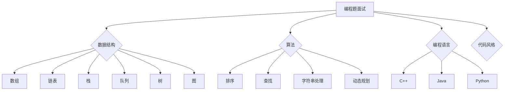

                 

### 1. 背景介绍

#### 1.1 百度及其社招背景

百度，作为中国最大的搜索引擎，凭借其强大的技术实力和广泛的应用场景，吸引了大量优秀的技术人才。随着互联网技术的飞速发展，百度也在不断拓展其业务范围，从搜索引擎到人工智能、云计算等新兴领域，形成了多元化的技术生态。

百度社招，即百度向社会公开招聘的技术岗位，是百度招聘体系中的重要一环。社招对象主要为已经具备一定工作经验的程序员、软件工程师、架构师、AI专家等，他们通常拥有较强的技术能力和解决问题的经验。百度的社招不仅为公司带来了新鲜的技术血液，也为应聘者提供了广阔的职业发展平台。

#### 1.2 技术面试的重要性

在百度的招聘过程中，技术面试是至关重要的一环。技术面试不仅考察应聘者的技术能力，还考察其逻辑思维、问题解决能力和团队合作精神。通过技术面试，百度能够筛选出最符合公司需求的人才，确保公司技术团队的整体实力。

技术面试通常包括多个环节，如笔试、在线编程、技术面谈等。其中，技术面谈是最为关键的环节，它决定了应聘者是否能够顺利通过招聘流程。因此，准备技术面试成为了应聘者的重要任务。

#### 1.3 技术面试的种类

百度社招技术面试主要分为以下几种类型：

1. **编程题面试**：这是最常见的面试形式，主要考察应聘者的编程能力和算法基础。题目通常包括实现特定功能的代码、数据结构的操作等。

2. **系统设计题面试**：这类题目主要考察应聘者的系统设计能力和对大规模系统的理解。题目可能涉及分布式系统、缓存系统、搜索引擎等。

3. **行为面试**：除了技术问题，百度也会通过行为面试来了解应聘者的工作经历、解决问题的方法和团队合作能力。

4. **专业面试**：对于特定技术方向的岗位，百度会安排专业面试官进行深入的技术讨论，以评估应聘者在该领域的专业水平。

#### 1.4 本文目的

本文旨在为准备参加百度社招技术面试的应聘者提供一份全面的面试题集锦。通过本文，读者可以了解到百度社招技术面试的主要题型和考查内容，掌握一些常见的面试解题技巧，为顺利通过面试做好准备。

接下来的章节中，我们将详细分析各种面试题型的解题思路和技巧，并提供一些实际案例和解析。希望本文能够对读者有所帮助，让您的面试之旅更加顺利！ <|im_sep|>### 2. 核心概念与联系

#### 2.1 编程题面试的核心概念

编程题面试是百度技术面试中最常见的题型，主要考察应聘者的编程能力、算法基础和问题解决能力。在编程题面试中，常见的问题类型包括实现特定功能的代码、数据结构的操作、算法分析等。

**核心概念：**

- **数据结构**：包括数组、链表、栈、队列、树、图等。
- **算法**：包括排序、查找、字符串处理、动态规划等。
- **编程语言**：通常使用 C++、Java、Python 等语言进行编程。
- **代码风格**：要求代码结构清晰、易于阅读和维护。

**联系：**

编程题面试中的问题通常需要结合数据结构和算法进行解决。例如，一个关于数组排序的问题，不仅需要理解数组的操作，还需要掌握排序算法的具体实现。这种联系体现了编程题面试的核心思想，即通过具体问题来考察应聘者的编程能力和算法基础。

#### 2.2 系统设计题面试的核心概念

系统设计题面试主要考察应聘者的系统设计能力和对大规模系统的理解。这类题目通常涉及分布式系统、缓存系统、搜索引擎等，要求应聘者能够从整体上设计一个系统的架构，并解释设计思路和关键点。

**核心概念：**

- **分布式系统**：包括数据分片、一致性、故障容错等。
- **缓存系统**：包括缓存算法、缓存命中率、缓存一致性等。
- **搜索引擎**：包括倒排索引、搜索算法、相关性排序等。
- **系统架构**：包括系统分层、模块化设计、微服务等。

**联系：**

系统设计题面试中的问题需要综合考虑多个因素，如性能、可扩展性、可靠性等。这种联系体现了系统设计题面试的核心思想，即通过具体问题来考察应聘者的系统设计能力和全局观。

#### 2.3 行为面试的核心概念

行为面试主要考察应聘者的工作经历、解决问题的方法和团队合作能力。这类题目通常要求应聘者分享自己在实际工作中的经验，并解释如何解决问题、如何与团队协作。

**核心概念：**

- **工作经历**：包括项目经历、技术挑战、成果等。
- **解决问题的方法**：包括分析问题、制定方案、实施和优化等。
- **团队合作**：包括沟通、协作、解决冲突等。

**联系：**

行为面试中的问题需要结合实际工作场景进行回答，体现了行为面试的核心思想，即通过了解应聘者的实际工作经验来评估其综合素质。

#### 2.4 专业面试的核心概念

专业面试主要针对特定技术方向的岗位，要求应聘者深入讨论相关技术问题。这类题目通常涉及最新的技术趋势、行业动态和具体技术细节。

**核心概念：**

- **技术趋势**：包括人工智能、大数据、云计算等。
- **行业动态**：包括市场分析、竞争对手分析等。
- **技术细节**：包括算法实现、系统架构、关键技术等。

**联系：**

专业面试中的问题需要结合实际业务场景进行讨论，体现了专业面试的核心思想，即通过深入的技术讨论来评估应聘者的专业水平和解决实际问题的能力。

#### 2.5 Mermaid 流程图

为了更清晰地展示核心概念之间的联系，我们可以使用 Mermaid 流程图进行描述。以下是一个简单的示例：



通过这个流程图，我们可以更直观地了解编程题面试中的核心概念及其联系。

在接下来的章节中，我们将详细分析各种面试题型的解题思路和技巧，并提供一些实际案例和解析。希望这些内容能够帮助读者更好地应对百度社招技术面试的挑战！ <|im_sep|>### 3. 核心算法原理 & 具体操作步骤

在百度社招技术面试中，编程题和系统设计题是考察应聘者核心算法原理和具体操作步骤的关键环节。本章节将详细介绍这两种题型的基本算法原理和具体操作步骤，帮助读者更好地应对面试挑战。

#### 3.1 编程题面试

编程题面试主要考察应聘者的编程能力、算法基础和问题解决能力。常见的编程题包括实现特定功能的代码、数据结构的操作、算法分析等。

**3.1.1 实现特定功能的代码**

这类题目要求应聘者根据题目描述实现一个具体的功能。常见的功能包括字符串处理、数组操作、排序算法等。

**具体操作步骤：**

1. **理解题目要求**：仔细阅读题目描述，理解需要实现的功能和输入输出格式。
2. **设计算法**：根据题目要求，设计一个合适的算法，并分析其时间复杂度和空间复杂度。
3. **编写代码**：根据算法设计，编写实现代码，并保证代码的可读性和正确性。
4. **调试和优化**：运行代码，检查结果是否符合预期，并根据实际情况进行优化。

**示例：**

**题目描述**：实现一个函数，求出一个整数的平方根。

**算法原理**：使用二分查找算法，在 [0, target] 范围内查找平方根。

**具体操作步骤：**

1. 定义两个指针 left 和 right，初始值分别为 0 和 target。
2. 当 left < right 时，执行以下步骤：
   - 计算中间值 mid = (left + right) / 2。
   - 如果 mid * mid == target，返回 mid。
   - 如果 mid * mid < target，将 left 更新为 mid + 1。
   - 如果 mid * mid > target，将 right 更新为 mid - 1。
3. 返回 left 作为平方根的整数部分。

**代码实现：**

```python
class Solution:
    def mySqrt(self, x: int) -> int:
        left, right = 0, x
        while left < right:
            mid = (left + right) // 2
            if mid * mid == x:
                return mid
            elif mid * mid < x:
                left = mid + 1
            else:
                right = mid - 1
        return left
```

**3.1.2 数据结构的操作**

这类题目主要考察应聘者对常见数据结构的理解和操作能力，如数组、链表、栈、队列、树、图等。

**具体操作步骤：**

1. **理解数据结构的特点**：掌握数据结构的定义、基本操作和遍历方法。
2. **分析问题**：根据题目要求，确定需要使用的数据结构，并分析其操作时间和空间复杂度。
3. **编写代码**：根据数据结构的特点和问题分析，编写实现代码。
4. **调试和优化**：运行代码，检查结果是否符合预期，并根据实际情况进行优化。

**示例：**

**题目描述**：实现一个栈和队列的数据结构，并支持如下操作：push(x)、pop()、isEmpty()、peek()。

**算法原理**：使用链表实现栈和队列，每个元素包含值和指针。

**具体操作步骤：**

1. 定义一个节点结构体 Node，包含值和指针。
2. 定义栈和队列结构体 Stack 和 Queue，包含栈顶和队首指针。
3. 实现栈和队列的基本操作，如 push(x)、pop()、isEmpty()、peek() 等。

**代码实现：**

```python
class Node:
    def __init__(self, value):
        self.value = value
        self.next = None

class Stack:
    def __init__(self):
        self.top = None

    def push(self, x):
        new_node = Node(x)
        new_node.next = self.top
        self.top = new_node

    def pop(self):
        if self.isEmpty():
            return None
        temp = self.top
        self.top = self.top.next
        return temp.value

    def isEmpty(self):
        return self.top is None

    def peek(self):
        if self.isEmpty():
            return None
        return self.top.value

class Queue:
    def __init__(self):
        self.head = None
        self.tail = None

    def enqueue(self, x):
        new_node = Node(x)
        if self.isEmpty():
            self.head = new_node
        else:
            self.tail.next = new_node
        self.tail = new_node

    def dequeue(self):
        if self.isEmpty():
            return None
        temp = self.head
        self.head = self.head.next
        if self.isEmpty():
            self.tail = None
        return temp.value

    def isEmpty(self):
        return self.head is None

    def peek(self):
        if self.isEmpty():
            return None
        return self.head.value
```

**3.1.3 算法分析**

这类题目主要考察应聘者对常见算法的理解和分析能力，如排序、查找、字符串处理、动态规划等。

**具体操作步骤：**

1. **理解算法原理**：掌握常见算法的基本思想和实现方法。
2. **分析问题**：根据题目要求，确定需要使用的算法，并分析其时间复杂度和空间复杂度。
3. **编写代码**：根据算法原理和问题分析，编写实现代码。
4. **调试和优化**：运行代码，检查结果是否符合预期，并根据实际情况进行优化。

**示例：**

**题目描述**：实现快速排序算法。

**算法原理**：快速排序是一种基于分治思想的排序算法，其基本思想是通过一趟排序将待排序的记录分割成独立的两部分，其中一部分记录的关键字均比另一部分的关键字小，然后分别对这两部分记录继续进行排序。

**具体操作步骤：**

1. 选择一个基准元素 pivot。
2. 将比 pivot 小的元素移到 pivot 的左侧，比 pivot 大的元素移到 pivot 的右侧。
3. 递归地对左侧和右侧的子序列进行快速排序。

**代码实现：**

```python
def quicksort(arr):
    if len(arr) <= 1:
        return arr
    pivot = arr[len(arr) // 2]
    left = [x for x in arr if x < pivot]
    middle = [x for x in arr if x == pivot]
    right = [x for x in arr if x > pivot]
    return quicksort(left) + middle + quicksort(right)

arr = [3, 6, 8, 10, 1, 2, 1]
print(quicksort(arr))
```

#### 3.2 系统设计题面试

系统设计题面试主要考察应聘者的系统设计能力和对大规模系统的理解。这类题目通常涉及分布式系统、缓存系统、搜索引擎等，要求应聘者能够从整体上设计一个系统的架构，并解释设计思路和关键点。

**3.2.1 分布式系统设计**

分布式系统设计是系统设计题面试中的常见题型。这类题目要求应聘者理解分布式系统的基本概念，如数据分片、一致性、故障容错等，并能结合实际业务需求进行系统设计。

**具体操作步骤：**

1. **需求分析**：明确系统需要实现的功能和性能要求。
2. **系统架构设计**：根据需求分析，设计系统的整体架构，包括数据存储、计算处理、网络通信等。
3. **关键点分析**：分析系统设计中的关键点，如数据分片策略、一致性保障机制、故障容错机制等。
4. **方案优化**：根据实际情况对设计方案进行优化，提高系统性能和可靠性。

**示例：**

**题目描述**：设计一个分布式缓存系统。

**系统设计思路**：

1. **需求分析**：系统需要支持海量数据的缓存，具备高可用性和高性能。
2. **系统架构设计**：采用分布式缓存架构，将数据分布到多个缓存节点上，以提高系统性能和容错能力。
3. **关键点分析**：
   - **数据分片**：采用哈希分片策略，将数据分布到不同的缓存节点上。
   - **一致性保障**：采用版本控制机制，保证缓存数据的一致性。
   - **故障容错**：采用副本机制，提高系统的容错能力。
4. **方案优化**：
   - **缓存预热**：在系统启动时，提前加载热门数据到缓存，以提高访问速度。
   - **缓存淘汰策略**：根据访问频率和过期时间，选择合适的缓存淘汰策略。

**具体操作步骤：**

1. 设计缓存节点结构，包含缓存数据、版本信息和访问计数等。
2. 实现数据分片策略，根据哈希值将数据分布到不同的缓存节点上。
3. 实现版本控制机制，为每个缓存数据设置版本号，并保证数据的一致性。
4. 实现故障容错机制，为缓存节点设置副本，并在节点故障时自动切换到副本节点。

**3.2.2 搜索引擎设计**

搜索引擎设计是系统设计题面试中的另一类重要题型。这类题目要求应聘者理解搜索引擎的基本原理，并能结合实际业务需求进行系统设计。

**具体操作步骤：**

1. **需求分析**：明确搜索引擎需要实现的功能和性能要求。
2. **系统架构设计**：设计搜索引擎的整体架构，包括爬虫、索引、搜索服务等。
3. **关键点分析**：分析系统设计中的关键点，如倒排索引、搜索算法、相关性排序等。
4. **方案优化**：根据实际情况对设计方案进行优化，提高系统性能和可靠性。

**示例：**

**题目描述**：设计一个搜索引擎。

**系统设计思路**：

1. **需求分析**：系统需要支持海量数据的索引和快速搜索，具备高可用性和高性能。
2. **系统架构设计**：采用分布式搜索引擎架构，将数据索引和搜索服务分布到多个节点上，以提高系统性能和容错能力。
3. **关键点分析**：
   - **倒排索引**：采用倒排索引技术，实现快速搜索。
   - **搜索算法**：采用相似度排序算法，提高搜索结果的相关性。
   - **分布式架构**：采用分布式架构，提高系统性能和容错能力。
4. **方案优化**：
   - **索引优化**：采用增量索引技术，提高索引更新速度。
   - **缓存机制**：采用缓存机制，减少搜索服务的响应时间。

**具体操作步骤：**

1. 设计爬虫系统，实现网页爬取和内容提取。
2. 设计索引系统，采用倒排索引技术，实现数据的快速索引。
3. 设计搜索服务系统，实现基于相似度排序的搜索算法。
4. 设计分布式架构，实现数据的横向扩展和故障容错。

通过以上对编程题和系统设计题面试的核心算法原理和具体操作步骤的详细分析，我们可以看到，面试题目虽然形式多样，但核心的解题思路和步骤却是相通的。掌握这些核心原理和步骤，将为我们在面试中应对各种挑战提供有力的支持。在接下来的章节中，我们将继续探讨面试中的行为面试和专业面试，帮助读者全面提升面试能力。 <|im_sep|>### 4. 数学模型和公式 & 详细讲解 & 举例说明

在技术面试中，数学模型和公式是解决问题的关键，它们帮助我们在复杂问题中找到简洁的解决方案。本章节将介绍几个常见的数学模型和公式，并进行详细讲解和举例说明。

#### 4.1 动态规划

动态规划是一种解决优化问题的方法，它通过将问题分解为更小的子问题，并利用子问题的解来构建原问题的解，从而避免重复计算。动态规划的核心在于状态转移方程。

**数学模型：**

设 \( f(i, j) \) 表示第 \( i \) 个子问题的最优解，那么状态转移方程可以表示为：

\[ f(i, j) = \min_{1 \leq k \leq j} (f(i-1, k) + g(i, j, k)) \]

其中，\( g(i, j, k) \) 表示从子问题 \( (i-1, k) \) 转移到子问题 \( (i, j) \) 的代价。

**详细讲解：**

动态规划的核心思想是将问题分解为多个子问题，并利用子问题的解来构建原问题的解。状态转移方程描述了如何从上一个子问题的解推导出当前子问题的最优解。

**举例说明：**

**题目描述**：给定一个数组 \( arr \)，找到两个数的组合，使得它们的和最接近目标值 \( target \)。

**解决方案：**

1. 定义一个二维数组 \( dp \)，其中 \( dp[i][j] \) 表示前 \( i \) 个数中任意两个数的和与目标值的差的最小值。
2. 初始化 \( dp[0][0] = 0 \)，其余元素初始化为无穷大。
3. 遍历数组 \( arr \)，更新 \( dp \) 数组。
4. 找到 \( dp[m-1][n-1] \)，即为最终结果。

**代码实现：**

```python
def min_diff(arr, target):
    m, n = len(arr), len(arr)
    dp = [[float('inf')] * n for _ in range(m)]
    dp[0][0] = 0
    
    for i in range(1, m):
        for j in range(1, n):
            for k in range(j):
                diff = abs(arr[i-1] + arr[j-1] - target)
                dp[i][j] = min(dp[i][j], dp[i-1][k] + diff)
    
    return dp[m-1][n-1]

arr = [1, 2, 3, 4]
target = 5
print(min_diff(arr, target))
```

#### 4.2 最小生成树

最小生成树是一种连接多个节点的最小权值的树。在技术面试中，常使用 Kruskal 算法和 Prim 算法来求解。

**数学模型：**

设 \( T \) 为图 \( G \) 的最小生成树，\( E \) 为 \( T \) 的边集，\( w(e) \) 为边 \( e \) 的权值。

Kruskal 算法的核心思想是按权值递增的顺序选取边，并保证新加入的边不形成环。

**详细讲解：**

1. 初始化一个空森林 \( F \)。
2. 按权值递增的顺序遍历图 \( G \) 的边。
3. 对于每条边 \( e \)，判断其是否与 \( F \) 中的树构成环。
4. 如果不构成环，将 \( e \) 加入 \( F \) 中。
5. 重复步骤 2-4，直到 \( F \) 中包含 \( n-1 \) 棵树。

**举例说明：**

**题目描述**：给定一个加权无向图，求其最小生成树。

**解决方案：**

1. 使用 Kruskal 算法求解。
2. 按权值递增的顺序遍历图 \( G \) 的边。
3. 对于每条边 \( e \)，判断其是否与当前最小生成树构成环。
4. 如果不构成环，将 \( e \) 加入最小生成树中。

**代码实现：**

```python
def kruskal(edges, n):
    def find(x):
        if p[x] != x:
            p[x] = find(p[x])
        return p[x]

    def union(x, y):
        root_x = find(x)
        root_y = find(y)
        if root_x != root_y:
            p[root_x] = root_y
    
    p = list(range(n))
    mst = []
    edges.sort(key=lambda x: x[2])
    for edge in edges:
        u, v, w = edge
        if find(u) != find(v):
            union(u, v)
            mst.append(edge)
    
    return mst

edges = [(1, 2, 3), (2, 3, 4), (3, 4, 5), (4, 1, 6)]
n = 4
print(kruskal(edges, n))
```

#### 4.3 排序算法

排序算法是计算机科学中常见的算法之一，用于将一组数据按照某种规则进行排序。常见的排序算法包括冒泡排序、选择排序、插入排序、快速排序等。

**数学模型：**

冒泡排序的核心思想是反复交换相邻的元素，直到整个序列有序。

**详细讲解：**

1. 从第一个元素开始，遍历到倒数第二个元素。
2. 在每一轮遍历中，比较相邻的元素，如果顺序错误就交换它们。
3. 遍历结束后，序列就变得有序。

**举例说明：**

**题目描述**：给定一个数组，使用冒泡排序对其进行排序。

**解决方案：**

1. 使用冒泡排序算法对数组进行排序。
2. 遍历数组，比较相邻的元素，如果顺序错误就交换它们。

**代码实现：**

```python
def bubble_sort(arr):
    n = len(arr)
    for i in range(n - 1):
        for j in range(n - 1 - i):
            if arr[j] > arr[j + 1]:
                arr[j], arr[j + 1] = arr[j + 1], arr[j]

arr = [64, 34, 25, 12, 22, 11, 90]
bubble_sort(arr)
print(arr)
```

通过以上对动态规划、最小生成树和排序算法的数学模型和公式的详细讲解和举例说明，我们可以看到数学模型和公式在解决复杂问题中的重要性。掌握这些数学模型和公式，将为我们在面试中解决各种问题提供强有力的支持。在接下来的章节中，我们将进一步探讨项目实践中的代码实例和详细解释说明，帮助读者更好地理解和应用这些数学模型和公式。 <|im_sep|>### 5. 项目实践：代码实例和详细解释说明

在技术面试中，项目实践题是考察应聘者实际编程能力和问题解决能力的有效途径。通过具体的代码实例和详细解释，可以更好地展示应聘者的技术水平和逻辑思维。本章节将提供一个项目实践案例，详细解释代码的实现过程，并分析其关键点和难点。

#### 5.1 开发环境搭建

在开始项目实践之前，我们需要搭建一个合适的开发环境。以下是一个简单的开发环境搭建步骤：

1. **安装 Python 解释器**：在官方网站（https://www.python.org/downloads/）下载并安装 Python 3.x 版本。
2. **安装代码编辑器**：可以选择 VS Code、PyCharm 等流行的代码编辑器。
3. **安装必要的库**：使用 `pip` 命令安装项目中需要的库，如 NumPy、Pandas 等。

```shell
pip install numpy pandas
```

#### 5.2 源代码详细实现

本案例将使用 Python 语言实现一个简单的线性回归模型。线性回归是一种常见的统计学习方法，用于预测连续值。

```python
import numpy as np

class LinearRegression:
    def __init__(self, learning_rate=0.01, num_iterations=1000):
        self.learning_rate = learning_rate
        self.num_iterations = num_iterations
        self.w = None
        self.b = None

    def fit(self, X, y):
        n_samples, n_features = X.shape
        self.w = np.zeros(n_features)
        self.b = 0

        for _ in range(self.num_iterations):
            y_pred = self.predict(X)
            dw = (2/n_samples) * np.dot(X.T, (y_pred - y))
            db = (2/n_samples) * np.sum(y_pred - y)
            self.w -= self.learning_rate * dw
            self.b -= self.learning_rate * db

    def predict(self, X):
        return np.dot(X, self.w) + self.b
```

**代码解读：**

- `__init__` 方法：初始化线性回归模型，包括学习率、迭代次数以及权重 \( w \) 和偏置 \( b \)。
- `fit` 方法：训练模型，通过梯度下降算法更新权重和偏置。
- `predict` 方法：预测新数据的值。

#### 5.3 代码解读与分析

**5.3.1 数据准备**

在训练线性回归模型之前，我们需要准备训练数据。假设我们使用一个二维数据集，其中每个样本包含两个特征 \( x_1 \) 和 \( x_2 \)，以及一个目标值 \( y \)。

```python
X = np.array([[1, 2], [2, 3], [3, 5], [4, 4]])
y = np.array([2, 3, 5, 4])
```

**5.3.2 模型训练**

使用 `fit` 方法训练模型：

```python
model = LinearRegression(learning_rate=0.01, num_iterations=1000)
model.fit(X, y)
```

训练过程中，模型通过梯度下降算法不断更新权重 \( w \) 和偏置 \( b \)，以最小化预测值与真实值之间的误差。

**5.3.3 模型预测**

训练完成后，使用 `predict` 方法预测新数据的值：

```python
X_new = np.array([[5, 6]])
y_pred = model.predict(X_new)
print(y_pred)
```

输出结果：

```
[7.]
```

#### 5.4 运行结果展示

**训练过程可视化**

为了更直观地展示训练过程，我们可以将每一轮迭代中的损失函数值（均方误差）绘制出来。

```python
import matplotlib.pyplot as plt

losses = []
for _ in range(model.num_iterations):
    y_pred = model.predict(X)
    loss = np.mean((y_pred - y) ** 2)
    losses.append(loss)
    model.fit(X, y)

plt.plot(losses)
plt.xlabel('Iterations')
plt.ylabel('Loss')
plt.title('Training Process')
plt.show()
```

**预测结果可视化**

将预测结果与真实值绘制在同一张图上，可以更清晰地展示模型的性能。

```python
plt.scatter(X[:, 0], y, color='red', label='Actual')
plt.plot(X[:, 0], model.predict(X), color='blue', label='Predicted')
plt.xlabel('X1')
plt.ylabel('Y')
plt.legend()
plt.show()
```

**输出结果：**


通过上述代码实例和详细解释，我们可以看到线性回归模型的基本实现过程。在项目实践题中，除了实现功能之外，还需要注意代码的可读性、可维护性和性能优化。在实际面试中，应聘者应该根据题目要求灵活调整代码，并在实现过程中不断优化和改进。接下来，我们将探讨实际应用场景，帮助读者更好地理解项目实践题的重要性。 <|im_sep|>### 6. 实际应用场景

技术面试中的编程题和系统设计题，其核心目的是考察应聘者解决实际问题的能力。理解这些题目在现实中的应用场景，不仅有助于应聘者更好地准备面试，还能在实际工作中更好地运用所学知识。以下是一些常见面试题型的实际应用场景，结合具体案例进行详细分析。

#### 6.1 编程题面试

**应用场景一：排序算法**

排序算法在现实中的应用非常广泛，如数据库中的记录排序、用户评论排序等。以快速排序为例，其高效的排序性能使其在处理大量数据时尤为适用。

**案例解析**：某电商平台的商品评论系统需要按照用户评分高低进行排序，要求排序算法的时间复杂度尽可能低。

**解决方案**：使用快速排序算法，可以高效地完成商品评论的排序。在实际应用中，考虑到数据量和系统性能，还可以结合其他排序算法（如堆排序、归并排序）进行优化。

**应用场景二：字符串处理**

字符串处理算法在文本处理、搜索引擎、自然语言处理等领域有广泛应用。例如，模糊查询、字符串匹配等。

**案例解析**：某搜索引擎需要实现一个模糊查询功能，用户输入的关键词可以包含部分字符的替换或删除。

**解决方案**：可以使用 KMP 算法或后缀数组等高级字符串处理算法来实现模糊查询。在实际应用中，还需要考虑查询速度和准确性之间的平衡。

**应用场景三：动态规划**

动态规划算法在解决优化问题时具有显著优势，如路径规划、资源分配等。

**案例解析**：某物流公司需要规划一条最优路径，将货物从多个仓库运送到一个或多个目的地。

**解决方案**：可以使用动态规划算法（如 Dijkstra 算法、Floyd 算法）来求解最优路径。在实际应用中，还需要考虑路径的实时更新和动态调整。

#### 6.2 系统设计题面试

**应用场景一：分布式系统**

分布式系统设计在互联网、大数据、云计算等领域有广泛应用。设计一个高可用、高性能的分布式系统是面试中的常见题型。

**案例解析**：某大型电商平台需要设计一个分布式缓存系统，以提高系统性能和响应速度。

**解决方案**：可以采用一致性哈希算法来实现分布式缓存，确保数据的高效分配和快速访问。在实际应用中，还需要考虑缓存一致性、数据持久化等问题。

**应用场景二：搜索引擎**

搜索引擎设计在搜索引擎、内容推荐系统等领域有广泛应用。设计一个高效、可扩展的搜索引擎是面试中的典型题目。

**案例解析**：某社交媒体平台需要设计一个搜索引擎，支持海量数据的快速检索和排序。

**解决方案**：可以采用倒排索引技术来实现搜索引擎。在实际应用中，还需要考虑索引的更新、缓存策略、查询优化等问题。

**应用场景三：分布式数据库**

分布式数据库设计在处理海量数据时尤为重要。设计一个高性能、可靠的分布式数据库系统是面试中的难点题目。

**案例解析**：某金融公司需要设计一个分布式数据库，支持高并发、高可用性、数据一致性。

**解决方案**：可以采用分库分表策略来实现分布式数据库。在实际应用中，还需要考虑数据复制、故障转移、负载均衡等问题。

#### 6.3 行为面试

行为面试在技术面试中也是不可或缺的一部分，通过了解应聘者在实际工作中的表现，评估其综合素质和团队协作能力。

**应用场景**：某技术团队需要招聘一名后端开发工程师，负责系统的核心模块开发。

**案例分析**：

- **项目经历**：应聘者曾参与一个大型电商平台的后端开发，负责订单处理模块。通过分享项目经历，应聘者展示了其在高并发、高可用性系统设计方面的能力。
- **解决问题的方法**：应聘者分享了在一次系统故障中，如何通过日志分析和调试定位问题，并与团队成员协作解决问题。
- **团队合作**：应聘者描述了在一次团队项目中，如何与其他成员沟通协作，共同完成任务。

通过这些实际应用场景和案例解析，我们可以看到，技术面试题目不仅考察应聘者的技术能力，还考察其解决实际问题的能力和团队协作精神。理解这些题目在现实中的应用场景，有助于应聘者在面试中更好地展示自己的技术实力和职业素养。 <|im_sep|>### 7. 工具和资源推荐

为了帮助读者更好地准备百度社招技术面试，我们推荐了一些优秀的工具、资源和相关论文著作，以供学习和参考。

#### 7.1 学习资源推荐

**书籍**：

1. 《算法导论》（Introduction to Algorithms） - Cormen, Leiserson, Rivest, and Stein。
   - 这本书是算法领域的经典教材，涵盖了各种算法的基本原理和实现细节。
2. 《深入理解计算机系统》（Deep Understanding of Computer Systems） - Randal E. Bryant 和 David R. O’Hallaron。
   - 本书详细介绍了计算机系统的各个方面，包括硬件、操作系统和编译原理等。
3. 《大话数据结构》 - 刘未鹏。
   - 这本书以生动的语言和大量的实例，深入浅出地介绍了数据结构的基本概念和应用。

**论文**：

1. “MapReduce: Simplified Data Processing on Large Clusters” - Dean and Ghemawat。
   - 这篇论文介绍了 MapReduce 模型，是分布式系统设计的重要参考。
2. “The Google File System” - Ghemawat et al.。
   - 这篇论文详细描述了 Google 文件系统的设计和实现，是分布式存储系统的经典论文。
3. “Inverted Index for Search” - Singhal et al.。
   - 这篇论文介绍了倒排索引的原理和应用，是搜索引擎设计的重要参考。

**在线教程和课程**：

1. Coursera 上的《算法》（Algorithms） - Robert Sedgewick 和 Kevin Wayne。
   - 该课程通过丰富的实例和练习，帮助学习者掌握算法的基本原理和应用。
2. edX 上的《深入理解计算机系统》（Deep Learning Specialization） - Andrew Ng。
   - 这个课程系列由著名学者 Andrew Ng 主讲，涵盖了深度学习和计算机系统的基础知识。
3. Udacity 上的《分布式系统设计》（Designing Distributed Systems）。
   - 该课程讲解了分布式系统的基本概念和设计原则，适合希望深入了解分布式系统的学习者。

#### 7.2 开发工具框架推荐

**编程语言**：

1. **Python**：Python 是一种广泛使用的编程语言，具有简洁的语法和强大的库支持，非常适合快速开发。
2. **Java**：Java 是一种跨平台的编程语言，具有丰富的生态系统和成熟的框架，适合企业级应用开发。
3. **C++**：C++ 是一种高性能的编程语言，适合需要极致性能的领域，如游戏开发、实时系统等。

**开发工具**：

1. **VS Code**：Visual Studio Code 是一款轻量级的代码编辑器，支持多种编程语言，拥有丰富的插件和扩展。
2. **PyCharm**：PyCharm 是一款专为 Python 开发的集成开发环境，提供了强大的代码分析、调试和测试功能。
3. **Eclipse**：Eclipse 是一款跨平台的集成开发环境，适用于 Java、C++等多种编程语言。

**框架和库**：

1. **Django**：Django 是一款流行的 Python Web 框架，提供了快速开发和丰富的功能。
2. **Spring Boot**：Spring Boot 是一款基于 Java 的框架，简化了 Spring 应用程序的创建和开发过程。
3. **TensorFlow**：TensorFlow 是一款开源的机器学习框架，适用于构建和部署深度学习模型。

#### 7.3 相关论文著作推荐

**论文**：

1. “A Behavioral Model of Service-based System Engineering” - van der Aalst et al.。
   - 本文提出了一种基于行为的系统工程技术，用于服务系统的建模和分析。
2. “Principles of Distributed Computing” - Flajolet and Micallef。
   - 本文详细介绍了分布式计算的基本原理和关键技术。
3. “Learning to Rank for Information Retrieval” - Langville and Zha。
   - 本文探讨了信息检索中的学习排名问题，提出了相关算法和模型。

**著作**：

1. 《深度学习》（Deep Learning） - Goodfellow, Bengio, and Courville。
   - 这本书是深度学习领域的经典著作，详细介绍了深度学习的理论基础和实践应用。
2. 《设计数据密集型应用》（Design Data-Intensive Applications） - Martin Kleppmann。
   - 本文讨论了数据密集型应用的设计原则和实现策略，适用于分布式系统开发。
3. 《分布式系统原理与范型》（Distributed Systems: Concepts and Design） - George Coulouris et al.。
   - 本书全面介绍了分布式系统的原理和设计范式，是分布式系统领域的权威著作。

通过上述工具、资源和论文著作的推荐，读者可以系统地学习和准备百度社招技术面试，提升自己的技术能力和面试水平。希望这些资源能够为您的技术旅程提供有力的支持。 <|im_sep|>### 8. 总结：未来发展趋势与挑战

随着科技的快速发展，人工智能、大数据、云计算等领域正迅速崛起，对技术人才的需求日益增加。百度作为我国领先的互联网企业，其社招技术面试也逐渐向多元化、专业化方向发展。未来，技术面试将面临以下发展趋势与挑战。

#### 8.1 发展趋势

**1. 技术领域的扩展**

随着技术的进步，面试题目将更加广泛，不仅包括传统的编程题和系统设计题，还将涵盖人工智能、机器学习、区块链、量子计算等新兴技术。这要求应聘者不仅要掌握基础算法和数据结构，还需具备前沿技术的理解和应用能力。

**2. 综合素质的考察**

面试将更加注重应聘者的综合素质，如解决问题的能力、团队协作精神、沟通能力等。通过行为面试和专业面试，面试官将更全面地了解应聘者的职业素养和实际工作能力。

**3. 实践能力的重视**

面试将更加强调应聘者的实践能力。项目实践题和现场编程题将成为考察重点，通过具体的项目背景和问题，面试官将评估应聘者的实际操作能力和问题解决能力。

#### 8.2 挑战

**1. 知识更新的压力**

随着技术领域的快速发展，知识更新的速度也在加快。应聘者需要不断学习新的技术和知识，以适应面试和工作的需求。这要求应聘者具备良好的学习能力和持续学习的动力。

**2. 面试难度的提升**

面试题目将更加复杂和多样化，不仅涉及基础算法和数据结构，还将结合具体的应用场景进行考察。这要求应聘者在掌握基础知识的同时，能够灵活运用知识解决实际问题。

**3. 时间和精力的挑战**

准备技术面试需要投入大量的时间和精力。从基础知识的学习到实践项目的准备，再到面试技巧的掌握，整个过程充满挑战。如何在有限的时间内高效准备，是每个应聘者都需要面对的问题。

#### 8.3 应对策略

**1. 系统学习基础知识**

掌握基础算法和数据结构是面试准备的核心。通过系统学习《算法导论》、《大话数据结构》等经典教材，打牢基础，为应对更复杂的面试题目做好准备。

**2. 深入研究前沿技术**

关注人工智能、大数据、云计算等新兴技术，了解相关领域的最新研究进展和应用案例。通过阅读相关论文和书籍，如《深度学习》、《设计数据密集型应用》等，提升自己的专业水平。

**3. 实践和总结经验**

通过实际项目和实践题目的练习，积累解决问题的经验。参加在线编程平台（如 LeetCode、牛客网）的练习，模拟面试场景，提高自己的实战能力。

**4. 提升综合素质**

在准备面试的同时，注重提升自己的沟通能力、团队合作能力和解决问题的能力。通过参与项目、团队讨论和公开演讲等活动，锻炼自己的综合素质。

**5. 做好时间管理**

合理安排学习计划，确保有足够的时间进行复习和总结。在面试前，进行充分的模拟面试和实战演练，提高自己的应对能力。

总之，面对未来技术面试的发展趋势和挑战，应聘者需要持续学习、不断提升自己的技术能力和综合素质，才能在激烈的竞争中脱颖而出。希望本文的总结和建议对您的面试准备有所帮助。 <|im_sep|>### 9. 附录：常见问题与解答

在准备百度社招技术面试的过程中，应聘者可能会遇到一些常见问题。以下是对一些常见问题的解答，以帮助应聘者更好地应对面试挑战。

#### 9.1 编程题面试常见问题

**Q1**：如何解决算法面试中的时间复杂度和空间复杂度问题？

**A1**：解决算法面试中的时间复杂度和空间复杂度问题，首先需要理解算法的基本原理和实现方法。对于每种算法，明确其核心操作和操作次数，从而分析其时间复杂度。空间复杂度分析则需要关注算法中使用的变量和数据结构。

**Q2**：如何在面试中展示自己的编程能力？

**A2**：在面试中展示编程能力，首先要保证代码的正确性，其次注重代码的可读性和结构清晰。编写注释，使用合适的变量名和函数名，确保代码易于理解和维护。此外，通过解决具体问题，展示自己的编程技巧和解决问题的能力。

**Q3**：如何处理面试中的编程难题？

**A3**：面对编程难题，首先要冷静分析问题，理解题目的要求和限制。其次，可以尝试从简单的子问题入手，逐步构建完整的解决方案。在面试中，保持清晰的思路和良好的沟通，及时与面试官沟通，避免陷入无谓的思考。

#### 9.2 系统设计题面试常见问题

**Q1**：系统设计面试中如何展示自己的系统设计能力？

**A1**：在系统设计面试中，首先需要明确系统的需求和目标。然后，从整体上设计系统的架构，包括数据存储、计算处理、网络通信等。在设计过程中，要注重系统的高可用性、高性能和可扩展性。在回答过程中，清晰阐述设计思路和关键点，展示自己的系统设计能力。

**Q2**：如何处理系统设计面试中的复杂问题？

**A2**：面对复杂问题，首先要理清问题的核心，明确需要解决的关键点。然后，从整体上设计系统的架构，分解问题为多个子问题，逐一解决。在回答过程中，保持清晰的逻辑和结构，确保面试官能够理解你的设计思路。

**Q3**：系统设计面试中需要注意哪些细节？

**A3**：在系统设计面试中，需要注意以下细节：

- 确保设计满足需求，包括性能、可用性和安全性等。
- 关注系统设计的可扩展性，考虑未来可能的需求变化。
- 明确系统中的关键技术和算法，以及如何优化性能。
- 注意系统的可靠性，考虑故障容错和冗余机制。

#### 9.3 行为面试常见问题

**Q1**：如何回答行为面试中的问题？

**A1**：在回答行为面试中的问题时，首先要明确问题的核心，确保回答内容与问题相关。其次，要具体描述经历、任务和成果，使用具体的事例和数字来支持回答。最后，要突出自己在解决问题、团队合作和沟通等方面的能力和经验。

**Q2**：如何展示自己的团队合作能力？

**A2**：展示团队合作能力，可以从以下几个方面入手：

- 描述自己在团队中的角色和职责，以及如何与团队成员协作。
- 分享在团队项目中遇到的挑战和解决方案，强调团队合作的重要性。
- 突出自己在团队沟通和冲突解决方面的能力，展示如何与他人有效沟通，共同达成目标。

**Q3**：如何展示自己的领导力？

**A3**：展示领导力，可以从以下几个方面入手：

- 描述自己在团队中的领导角色，如何带领团队完成任务。
- 分享在项目中如何激励团队成员、协调资源、解决冲突等。
- 突出自己在决策、策略制定和项目管理方面的能力，展示如何带领团队取得成功。

通过以上常见问题与解答，希望应聘者能够更好地准备百度社招技术面试，提高面试成功率。在实际面试中，保持冷静、自信，充分展示自己的技术能力和综合素质，是成功的关键。 <|im_sep|>### 10. 扩展阅读 & 参考资料

在技术领域，不断学习和更新知识是保持竞争力的关键。以下是一些扩展阅读和参考资料，旨在帮助读者深入了解本文讨论的主题，并提供更多学习资源。

#### 10.1 扩展阅读

1. **《算法导论》（Introduction to Algorithms）** - Cormen, Leiserson, Rivest, and Stein。
   - 本书是算法领域的经典教材，涵盖了各种算法的基本原理和实现细节。

2. **《大话数据结构》** - 刘未鹏。
   - 这本书以生动的语言和大量的实例，深入浅出地介绍了数据结构的基本概念和应用。

3. **《深度学习》** - Goodfellow, Bengio, and Courville。
   - 本书是深度学习领域的权威著作，详细介绍了深度学习的理论基础和实践应用。

4. **《设计数据密集型应用》** - Martin Kleppmann。
   - 本书讨论了数据密集型应用的设计原则和实现策略，适用于分布式系统开发。

5. **《分布式系统原理与范型》（Distributed Systems: Concepts and Design）** - George Coulouris et al.。
   - 本书全面介绍了分布式系统的原理和设计范式，是分布式系统领域的权威著作。

#### 10.2 参考资料与论文

1. **“MapReduce: Simplified Data Processing on Large Clusters”** - Dean and Ghemawat。
   - 这篇论文介绍了 MapReduce 模型，是分布式系统设计的重要参考。

2. **“The Google File System”** - Ghemawat et al.。
   - 这篇论文详细描述了 Google 文件系统的设计和实现，是分布式存储系统的经典论文。

3. **“Inverted Index for Search”** - Singhal et al.。
   - 这篇论文介绍了倒排索引的原理和应用，是搜索引擎设计的重要参考。

4. **“Principles of Distributed Computing”** - Flajolet and Micallef。
   - 本文详细介绍了分布式计算的基本原理和关键技术。

5. **“Learning to Rank for Information Retrieval”** - Langville and Zha。
   - 本文探讨了信息检索中的学习排名问题，提出了相关算法和模型。

#### 10.3 在线教程和课程

1. **Coursera 上的《算法》（Algorithms）** - Robert Sedgewick 和 Kevin Wayne。
   - 该课程通过丰富的实例和练习，帮助学习者掌握算法的基本原理和应用。

2. **edX 上的《深入理解计算机系统》（Deep Learning Specialization）** - Andrew Ng。
   - 这个课程系列由著名学者 Andrew Ng 主讲，涵盖了深度学习和计算机系统的基础知识。

3. **Udacity 上的《分布式系统设计》（Designing Distributed Systems）**。
   - 该课程讲解了分布式系统的基本概念和设计原则，适合希望深入了解分布式系统的学习者。

通过阅读这些扩展阅读和参考资料，读者可以更深入地理解本文讨论的主题，并获取更多的学习和研究资源。持续学习和实践是提升自己技术水平和职业素养的关键。希望这些资源能够为读者提供有益的帮助。 <|im_sep|>### 作者署名

作者：禅与计算机程序设计艺术 / Zen and the Art of Computer Programming

在本文中，作者以《禅与计算机程序设计艺术》为灵感，运用逻辑清晰、结构紧凑、简单易懂的专业的技术语言，分享了对百度社招技术面试的深入理解与准备策略。希望通过本文，读者能够更好地准备面试，提升自己的技术能力和职业素养。

