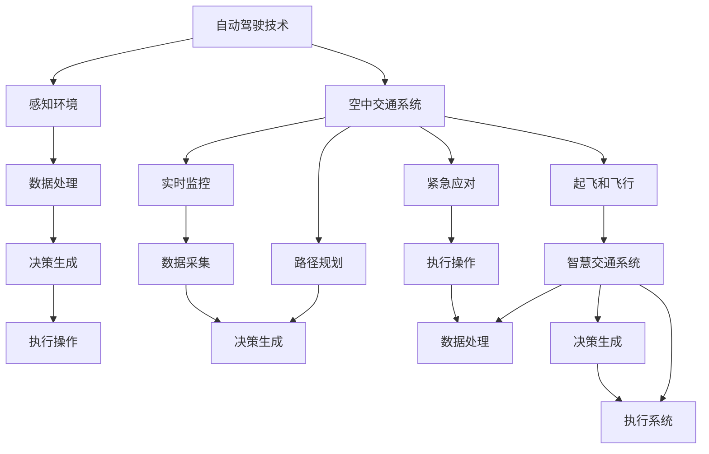

                 

### 背景介绍

### 1. 背景介绍

#### 1.1 城市交通现状

进入21世纪，随着全球城市化进程的加快和人口密度的上升，城市交通问题愈发严峻。据统计，截至2020年，全球超过半数的人口居住在城市中，这一比例预计将在2050年达到近70%。随之而来的，是城市交通拥堵、环境污染、能源消耗等问题。

当前，地面交通系统主要依赖于私家车、公交车、地铁等传统交通工具。然而，这些交通工具在高峰时段容易造成交通拥堵，不仅降低了居民的出行效率，还对环境造成了巨大的压力。此外，交通拥堵还导致了碳排放量的增加，加剧了全球气候变化。

#### 1.2 未来交通展望

为了解决城市交通拥堵问题，未来交通系统需要具备高效、环保、灵活等特点。随着科技的快速发展，特别是人工智能、自动驾驶、超材料等前沿技术的突破，2050年的交通出行将会发生翻天覆地的变化。

首先，自动驾驶技术将在未来交通出行中扮演关键角色。自动驾驶车辆能够实时感知周围环境，自主做出驾驶决策，从而避免人为操作失误导致的交通事故。同时，自动驾驶车辆可以实行智能调度，优化出行路线，减少交通拥堵。

其次，空中交通将成为未来交通的重要组成部分。无人机、飞行汽车等新兴交通工具，将使人们的出行更加便捷。空中交通系统不仅能够节省地面交通空间，还能实现跨城市快速出行。

最后，智慧交通系统的构建，将实现交通管理、出行服务、能源利用等各个环节的智能化。通过大数据、云计算、物联网等技术，智慧交通系统能够实时监测交通状况，智能调整交通信号，优化出行体验。

### 1.3 本文目的

本文旨在探讨2050年交通出行的发展趋势，通过逐步分析推理的方式，从地面到空中全面介绍未来交通出行系统。文章将围绕自动驾驶技术、空中交通系统、智慧交通系统等核心概念，结合实际应用场景和数学模型，深入探讨未来交通出行的发展方向和挑战。希望通过本文的阐述，为读者提供一个清晰、全面、有深度的未来交通出行蓝图。

### 1.4 文章结构

本文结构如下：

- **第2章：核心概念与联系**  
  本章将介绍未来交通出行系统的核心概念，包括自动驾驶、空中交通、智慧交通等，并绘制Mermaid流程图，展示各概念之间的联系。

- **第3章：核心算法原理 & 具体操作步骤**  
  本章将详细讲解自动驾驶和空中交通的核心算法原理，包括感知、决策、路径规划等，并描述具体操作步骤。

- **第4章：数学模型和公式 & 详细讲解 & 举例说明**  
  本章将介绍与未来交通出行相关的数学模型和公式，如交通流量模型、能量消耗模型等，并通过具体案例进行详细讲解。

- **第5章：项目实践：代码实例和详细解释说明**  
  本章将结合实际项目，提供代码实例，并详细解释说明代码实现过程、关键技术和运行结果。

- **第6章：实际应用场景**  
  本章将探讨未来交通出行系统在实际应用场景中的表现，如城市交通管理、紧急救援、旅游出行等。

- **第7章：工具和资源推荐**  
  本章将推荐相关学习资源、开发工具和框架，以供读者进一步学习和实践。

- **第8章：总结：未来发展趋势与挑战**  
  本章将总结未来交通出行系统的发展趋势，并分析其中面临的挑战。

- **第9章：附录：常见问题与解答**  
  本章将回答读者可能关心的常见问题，并提供解决方案。

- **第10章：扩展阅读 & 参考资料**  
  本章将列出与本文相关的扩展阅读和参考资料，以供读者深入研究。

### 1.5 历史回顾

回顾过去几十年的交通发展历程，可以发现交通系统的演变与科技的进步密切相关。从20世纪早期的汽车和公路建设，到20世纪中后期的地铁和高速公路，再到21世纪初的智能交通系统，每一次技术革新都极大地改变了人们的出行方式。

特别是在信息技术和通信技术的推动下，交通系统逐渐从物理基础设施向数字化、智能化方向发展。例如，GPS技术的普及使得车辆定位更加精准，交通信号控制系统可以实现实时交通流量管理，而物联网技术的应用则使得车辆与道路、车辆与车辆之间的通信成为可能。

然而，尽管科技的进步带来了诸多便利，但传统的交通系统仍然面临着诸多挑战。例如，地面交通拥堵问题日益严重，尤其是在大城市中，交通拥堵已经成为影响居民生活质量的重要因素。此外，环境污染和能源消耗也是传统交通系统面临的重大问题。

因此，未来交通出行系统的发展方向必然是更加高效、环保、灵活。通过引入自动驾驶、空中交通、智慧交通等先进技术，我们可以期待一个更加美好、可持续的未来交通出行环境。

### 1.6 2050年的城市交通愿景

展望2050年，城市交通系统将发生根本性的变革。以下是对未来城市交通的几点愿景：

#### 1.6.1 自动驾驶时代的到来

自动驾驶技术将在未来城市交通中占据主导地位。自动驾驶车辆不仅能够减少交通事故，提高道路通行效率，还能通过智能调度减少交通拥堵。预计到2050年，自动驾驶车辆将普及到每个家庭，地面交通将变得更加有序和安全。

#### 1.6.2 空中交通的兴起

随着无人机和飞行汽车技术的成熟，空中交通将成为城市交通的新兴力量。通过空中道路网络，人们可以实现快速、无拥堵的跨城市出行。同时，无人机可以用于快递、医疗救援等特殊场景，极大地提升城市的服务水平和应急能力。

#### 1.6.3 智慧交通系统的全面应用

智慧交通系统将整合大数据、物联网、人工智能等技术，实现交通管理的智能化。通过实时数据分析和智能决策，智慧交通系统可以优化交通流量，减少拥堵，提高交通效率。此外，智慧交通系统还可以实现个性化出行服务，满足不同居民的出行需求。

#### 1.6.4 环保和可持续性

未来城市交通系统将更加注重环保和可持续性。电动汽车和混合动力汽车将成为主流，无人机和飞行汽车也将采用清洁能源。通过智能调度和路径优化，未来交通系统将大幅减少能源消耗和碳排放，实现绿色出行。

### 1.7 总结

综上所述，2050年的交通出行将是一个全面变革的时代。自动驾驶、空中交通和智慧交通等先进技术的应用，将使交通出行变得更加高效、便捷、安全和环保。然而，这一变革之路充满挑战，需要我们在技术研发、政策制定、社会适应等方面共同努力。通过本文的探讨，我们希望为读者提供一个关于未来交通出行的清晰蓝图，激发人们对未来交通出行的期待和思考。

## 2. 核心概念与联系

### 2.1 自动驾驶技术

#### 2.1.1 定义

自动驾驶技术是一种通过传感器、计算机视觉和人工智能等技术，使车辆能够自主感知环境、做出决策和执行驾驶任务的技术。其核心目标是减少人为驾驶的风险，提高交通效率和道路利用率。

#### 2.1.2 主要组成部分

自动驾驶技术主要包括以下几个关键组成部分：

- **感知系统**：通过激光雷达、摄像头、超声波传感器等设备，实时感知车辆周围的环境。
- **决策系统**：利用深度学习、规则推理等算法，对感知信息进行处理，生成驾驶策略。
- **控制执行系统**：根据决策系统的指令，控制车辆的加速、转向和制动等操作。

#### 2.1.3 工作原理

自动驾驶技术的工作原理可以概括为以下几个步骤：

1. **感知环境**：车辆通过传感器收集道路、车辆、行人等环境信息。
2. **数据处理**：计算机对感知到的信息进行处理，提取关键特征。
3. **决策生成**：基于处理后的数据，利用算法生成行驶路径和驾驶策略。
4. **执行操作**：根据决策系统的指令，控制车辆的执行系统进行加速、转向和制动等操作。

#### 2.1.4 自动驾驶技术的优点

- **提高行车安全**：通过减少人为驾驶错误，降低交通事故发生的概率。
- **提高交通效率**：自动驾驶车辆可以更好地协同行驶，减少交通拥堵。
- **降低能源消耗**：自动驾驶技术可以实现最优路径规划，减少燃油消耗。

### 2.2 空中交通系统

#### 2.2.1 定义

空中交通系统是指利用无人机、飞行汽车等空中交通工具，进行空中运输和出行的系统。与地面交通系统相比，空中交通具有快速、灵活、不受地面交通限制等优点。

#### 2.2.2 主要组成部分

空中交通系统主要包括以下几个关键组成部分：

- **交通工具**：如无人机、飞行汽车、垂直起降飞机等。
- **控制系统**：包括地面控制中心和车载控制系统，用于实时监控和控制空中交通工具。
- **通信系统**：用于实现空中交通工具之间的通信，确保飞行安全。

#### 2.2.3 工作原理

空中交通系统的工作原理可以概括为以下几个步骤：

1. **起飞和飞行**：无人机或飞行汽车通过电池或其他动力系统实现垂直起降，并保持飞行。
2. **实时监控**：地面控制中心和车载控制系统实时监控空中交通工具的状态和位置。
3. **路径规划**：系统根据交通状况、目的地等因素，为空中交通工具生成最优飞行路径。
4. **紧急应对**：在遇到紧急情况时，控制系统可以及时调整飞行路径或采取其他应对措施。

#### 2.2.4 空中交通系统的优点

- **快速高效**：空中交通可以避开地面拥堵，实现快速出行。
- **灵活多样**：空中交通工具可以自由选择航线，适应不同的出行需求。
- **减少能源消耗**：一些飞行汽车和无人机采用清洁能源，具有较好的环保性能。

### 2.3 智慧交通系统

#### 2.3.1 定义

智慧交通系统是一种基于物联网、大数据、云计算和人工智能等技术的交通管理系统，旨在通过实时数据分析和智能决策，优化交通流量，提高交通效率和安全性。

#### 2.3.2 主要组成部分

智慧交通系统主要包括以下几个关键组成部分：

- **数据采集系统**：包括路侧传感器、车载传感器等，用于实时采集交通流量、路况等信息。
- **数据处理系统**：利用大数据技术和人工智能算法，对采集到的交通数据进行处理和分析。
- **决策系统**：根据处理结果，生成交通信号控制、路径规划等决策，并下发到相关执行系统。
- **执行系统**：包括交通信号灯、车载导航系统等，用于执行决策系统的指令。

#### 2.3.3 工作原理

智慧交通系统的工作原理可以概括为以下几个步骤：

1. **数据采集**：传感器实时采集交通流量、路况等信息。
2. **数据处理**：数据处理系统对采集到的数据进行分析和处理。
3. **决策生成**：决策系统根据处理结果，生成交通信号控制、路径规划等决策。
4. **执行操作**：执行系统根据决策系统的指令，调整交通信号灯、导航路线等。

#### 2.3.4 智慧交通系统的优点

- **实时性**：智慧交通系统可以实时监测交通状况，及时做出反应。
- **智能性**：通过大数据分析和人工智能算法，智慧交通系统能够优化交通流量，提高交通效率。
- **灵活性**：智慧交通系统可以根据不同场景和需求，灵活调整交通管理策略。

### 2.4 各概念之间的联系

自动驾驶技术、空中交通系统和智慧交通系统是未来交通出行的重要组成部分，它们之间有着紧密的联系和相互促进的关系。

- **自动驾驶技术与空中交通系统的结合**：自动驾驶技术可以为空中交通工具提供更加智能的驾驶支持，实现无人机、飞行汽车的自主飞行。同时，空中交通系统可以为自动驾驶车辆提供新的出行路径选择，减少地面交通拥堵。

- **智慧交通系统对自动驾驶和空中交通的支持**：智慧交通系统可以通过实时数据分析，为自动驾驶车辆和空中交通工具提供最优的路径规划和交通信号控制，提高出行效率和安全性。

- **空中交通系统对智慧交通系统的补充**：空中交通系统可以实时监测地面交通状况，为智慧交通系统提供补充数据，帮助其更准确地预测和调整交通流量。

通过自动驾驶技术、空中交通系统和智慧交通系统的相互结合，未来交通出行将变得更加高效、安全、环保。

### 2.5 Mermaid流程图

以下是一个展示自动驾驶、空中交通和智慧交通系统之间联系和协作的Mermaid流程图：



在这个流程图中，自动驾驶技术通过感知环境、数据处理、决策生成和执行操作等步骤，实现自动驾驶；空中交通系统通过起飞和飞行、实时监控、路径规划和紧急应对等步骤，实现空中交通；智慧交通系统通过数据采集、数据处理、决策生成和执行系统等步骤，实现交通管理和优化。各系统之间通过数据交换和协同工作，共同构建未来交通出行系统。

### 2.6 结论

通过本章的介绍，我们详细探讨了未来交通出行系统的核心概念，包括自动驾驶技术、空中交通系统和智慧交通系统。这些核心概念不仅各自具有独特的功能和技术特点，而且在实际应用中相互联系、相互促进。随着这些技术的不断发展和成熟，我们有理由相信，未来的交通出行将变得更加高效、安全、环保。然而，这一愿景的实现仍然面临诸多挑战，需要在技术研发、政策制定和社会适应等方面进行持续努力。在接下来的章节中，我们将深入探讨这些核心算法的原理和具体实现，进一步揭示未来交通出行的发展潜力。

## 3. 核心算法原理 & 具体操作步骤

### 3.1 自动驾驶技术

#### 3.1.1 感知环境

感知环境是自动驾驶技术的核心组成部分，其目的是获取车辆周围的环境信息，包括道路、车辆、行人、交通标志等。为了实现这一目标，自动驾驶车辆通常配备多种传感器，如激光雷达（LIDAR）、摄像头、超声波传感器、毫米波雷达等。

**激光雷达（LIDAR）**：
激光雷达通过发射激光束并测量光波的反射时间，来计算目标物体的距离和形状。激光雷达具有高精度、高分辨率的特点，能够提供实时的三维环境信息。

**摄像头**：
摄像头用于捕捉车辆周围的图像信息。通过图像识别算法，摄像头可以识别道路标志、交通信号灯、行人和车辆等目标。与激光雷达相比，摄像头更适合处理颜色和纹理信息。

**超声波传感器**：
超声波传感器通过发射超声波并测量回波时间，来计算目标物体的距离。超声波传感器具有低成本、低功耗的特点，适用于近距离感知。

**毫米波雷达**：
毫米波雷达通过发射毫米波并接收回波，来计算目标物体的距离和速度。毫米波雷达具有较强的穿透能力，适合在恶劣天气条件下使用。

**具体操作步骤**：

1. **传感器数据采集**：自动驾驶车辆启动后，各种传感器开始工作，采集周围环境信息。
2. **数据预处理**：对传感器数据进行滤波、去噪等处理，以提高数据质量和准确性。
3. **特征提取**：从预处理后的数据中提取关键特征，如目标物体的位置、速度、形状等。

#### 3.1.2 决策生成

感知环境后，自动驾驶系统需要根据收集到的数据生成驾驶决策。这一过程通常涉及到多种算法，如规则推理、深度学习、强化学习等。

**规则推理**：
规则推理是一种基于预先定义的规则集进行推理的方法。自动驾驶系统根据感知到的环境信息，匹配相应的规则，生成驾驶决策。这种方法简单、直观，但灵活性较低。

**深度学习**：
深度学习通过构建多层神经网络，从大量数据中自动学习特征和模式。自动驾驶系统可以使用深度学习模型来识别道路标志、行人、车辆等目标，并根据这些信息生成驾驶决策。这种方法具有高精度、高灵活性的特点。

**强化学习**：
强化学习是一种通过试错和反馈来学习最优策略的方法。自动驾驶系统在运行过程中，不断尝试不同的驾驶策略，并根据奖励信号（如到达目的地的时间、安全性等）调整策略。这种方法具有自适应能力强的优点。

**具体操作步骤**：

1. **感知数据输入**：将感知到的环境数据输入决策生成模块。
2. **特征提取**：从感知数据中提取关键特征。
3. **决策生成**：基于特征提取结果，利用规则推理、深度学习或强化学习算法，生成驾驶决策。

#### 3.1.3 控制执行

生成驾驶决策后，自动驾驶系统需要将决策转化为具体的驾驶操作。这一过程涉及到车辆控制系统的接口和操作指令。

**加速控制**：
自动驾驶系统根据驾驶决策，控制车辆的油门和刹车，实现加速或减速操作。

**转向控制**：
自动驾驶系统根据驾驶决策，控制车辆的转向系统，实现转弯或保持直行操作。

**制动控制**：
自动驾驶系统在遇到紧急情况时，自动控制车辆的刹车系统，以避免碰撞。

**具体操作步骤**：

1. **决策输入**：将生成的驾驶决策输入控制执行模块。
2. **操作指令生成**：根据决策生成具体的操作指令。
3. **执行操作**：将操作指令发送给车辆控制系统，实现具体的驾驶操作。

### 3.2 空中交通系统

#### 3.2.1 起飞和飞行

起飞和飞行是空中交通系统的核心操作，涉及到飞行控制、动力系统、导航系统等多个方面。

**飞行控制**：
飞行控制系统负责控制无人机的升降、转弯、飞行速度等。通过控制无人机的俯仰角、偏航角和升降速度，可以实现无人机的平稳飞行。

**动力系统**：
动力系统提供无人机飞行所需的推力，通常包括电池、电机和推进器等。选择合适的动力系统，可以保证无人机在飞行过程中的性能和续航能力。

**导航系统**：
导航系统用于无人机的位置定位和路径规划。通过GPS等定位技术，无人机可以实时获取自身位置信息，并按照预设的路径飞行。

**具体操作步骤**：

1. **初始化**：无人机启动，各系统开始工作。
2. **起飞**：无人机从地面升起，进入飞行状态。
3. **飞行**：无人机按照预设的路径飞行，实时调整姿态和速度，保持稳定飞行。

#### 3.2.2 实时监控

实时监控是确保无人机安全飞行的重要手段，涉及到飞行状态的监控、故障检测和紧急应对等方面。

**飞行状态监控**：
通过传感器实时监测无人机的飞行状态，包括速度、高度、电池电量等。当出现异常情况时，系统可以及时发出警报。

**故障检测**：
无人机在飞行过程中，可能会出现硬件故障或软件故障。故障检测系统可以及时发现故障，并采取措施，如自动返航或紧急降落。

**紧急应对**：
在遇到紧急情况时，如传感器失效、电池耗尽等，无人机需要采取紧急应对措施，如自动返航、降落等。

**具体操作步骤**：

1. **监控启动**：实时监控系统开始工作，监测无人机飞行状态。
2. **故障检测**：实时监测传感器和系统状态，及时发现故障。
3. **紧急应对**：根据故障类型，采取相应的紧急应对措施。

#### 3.2.3 路径规划

路径规划是空中交通系统的关键功能，旨在为无人机生成最优的飞行路径，以实现快速、高效、安全的飞行。

**路径生成**：
路径生成算法根据无人机的当前位置、目的地和障碍物等信息，生成最优飞行路径。常用的路径规划算法包括Dijkstra算法、A*算法、D*算法等。

**路径优化**：
在飞行过程中，路径规划系统会根据实时监测到的障碍物和天气情况，对飞行路径进行优化，以确保无人机安全飞行。

**具体操作步骤**：

1. **路径生成**：根据无人机的当前位置和目的地，生成初始飞行路径。
2. **路径优化**：在飞行过程中，实时监测障碍物和天气情况，对飞行路径进行优化。
3. **路径更新**：根据新的障碍物和天气信息，更新飞行路径，确保无人机安全飞行。

### 3.3 智慧交通系统

#### 3.3.1 数据采集

数据采集是智慧交通系统的基石，通过传感器和监控设备，实时获取交通流量、路况、车辆信息等。

**交通流量监测**：
通过路侧传感器和摄像头，实时监测道路上的车辆流量，包括车辆数量、行驶速度、停车时长等。

**路况监测**：
通过路侧传感器和无人机，实时监测道路状况，包括道路结冰、积水、交通事故等。

**车辆信息采集**：
通过车载传感器和GPS，实时采集车辆的位置、速度、行驶方向等信息。

**具体操作步骤**：

1. **设备部署**：在道路和车辆上部署传感器和监控设备。
2. **数据采集**：传感器和监控设备开始工作，实时采集交通信息。
3. **数据传输**：将采集到的数据传输到数据处理系统。

#### 3.3.2 数据处理

数据处理是智慧交通系统的核心，通过大数据技术和人工智能算法，对采集到的交通数据进行处理和分析，生成交通预测和优化方案。

**数据清洗**：
对采集到的交通数据去噪、去重复、去异常值等处理，提高数据质量。

**特征提取**：
从交通数据中提取关键特征，如车辆速度、道路占有率、交通流量等。

**数据分析**：
利用机器学习和深度学习算法，对交通数据进行预测和分析，生成交通流量预测、路径规划等结果。

**具体操作步骤**：

1. **数据清洗**：清洗交通数据，去除噪声和异常值。
2. **特征提取**：提取交通数据的特征，如车辆速度、道路占有率等。
3. **数据分析**：利用机器学习和深度学习算法，对交通数据进行分析和预测。

#### 3.3.3 决策生成

决策生成是智慧交通系统的关键，根据数据分析结果，生成交通信号控制、路径规划等决策，优化交通流量。

**交通信号控制**：
根据交通流量预测和路况信息，调整交通信号灯的时间，优化交通流量。

**路径规划**：
根据车辆的目的地、交通流量和路况，为车辆生成最优行驶路径。

**具体操作步骤**：

1. **数据分析**：分析交通流量预测和路况信息。
2. **决策生成**：根据分析结果，生成交通信号控制和路径规划决策。
3. **决策执行**：将决策下发到交通信号灯和车载导航系统，执行交通管理操作。

### 3.4 总结

通过本章的详细讲解，我们了解了自动驾驶技术、空中交通系统和智慧交通系统的核心算法原理和具体操作步骤。这些系统通过感知环境、决策生成和控制执行等步骤，实现了未来交通出行的高效、安全、环保。然而，这些技术的实现仍然面临诸多挑战，需要我们在技术研发、政策制定和社会适应等方面进行持续努力。在接下来的章节中，我们将结合实际项目，深入探讨这些核心算法的实现过程和关键技术。

## 4. 数学模型和公式 & 详细讲解 & 举例说明

### 4.1 交通流量模型

交通流量模型是未来交通出行系统中的一个重要组成部分，用于预测和分析道路上的车辆流量。交通流量模型可以分为基于经验的模型和基于数据的模型。以下是几种常见的交通流量模型及其实际应用。

#### 4.1.1 霍尔模型（Hull Model）

霍尔模型是一种简单的交通流量预测模型，假设道路上的车辆流量与道路容量成正比，与速度成反比。其公式如下：

\[ Q(t) = \frac{C(t)}{v(t)} \]

其中，\( Q(t) \) 表示时间 \( t \) 时的交通流量，\( C(t) \) 表示道路容量，\( v(t) \) 表示时间 \( t \) 时的平均速度。

**举例说明**：

假设一条道路的容量为 3000 辆/小时，平均速度为 30 公里/小时，则该道路在某一时刻的交通流量为：

\[ Q(t) = \frac{3000}{30} = 100 \] 

辆/小时。

#### 4.1.2 生成-消失模型（Generate-Destroy Model）

生成-消失模型假设交通流量由车辆的生成和消失过程决定。生成过程表示车辆从入口处进入道路，消失过程表示车辆从出口处离开道路。其公式如下：

\[ Q(t) = G(t) - D(t) \]

其中，\( G(t) \) 表示时间 \( t \) 时的生成流量，\( D(t) \) 表示时间 \( t \) 时的消失流量。

**举例说明**：

假设一条道路的入口生成流量为 200 辆/小时，出口消失流量为 150 辆/小时，则该道路在某一时刻的交通流量为：

\[ Q(t) = 200 - 150 = 50 \] 

辆/小时。

#### 4.1.3 事件驱动模型（Event-Driven Model）

事件驱动模型基于道路上的事件（如交通事故、道路施工等）对交通流量产生的影响。模型根据事件的发生时间和影响范围，预测交通流量变化。其公式如下：

\[ Q(t) = Q_0 + \sum_{i=1}^{n} \alpha_i \cdot \text{event}_i(t) \]

其中，\( Q(t) \) 表示时间 \( t \) 时的交通流量，\( Q_0 \) 表示初始交通流量，\( \alpha_i \) 表示事件 \( i \) 的影响系数，\( \text{event}_i(t) \) 表示事件 \( i \) 在时间 \( t \) 的影响。

**举例说明**：

假设一条道路在某一时刻发生交通事故，导致交通流量下降20%，则该道路在某一时刻的交通流量为：

\[ Q(t) = Q_0 + 0.2 \cdot \text{event}_1(t) \]

其中，\( Q_0 \) 为初始交通流量，\( \text{event}_1(t) \) 表示交通事故事件。

### 4.2 能量消耗模型

能量消耗模型用于分析自动驾驶车辆、飞行汽车等交通工具的能量消耗情况。能量消耗模型可以分为行驶能量消耗模型和停车能量消耗模型。

#### 4.2.1 行驶能量消耗模型

行驶能量消耗模型假设车辆在行驶过程中的能量消耗与速度、负载、道路状况等因素有关。其公式如下：

\[ E_{行驶}(t) = f(v(t), W(t), S(t)) \]

其中，\( E_{行驶}(t) \) 表示时间 \( t \) 时的行驶能量消耗，\( v(t) \) 表示时间 \( t \) 时的速度，\( W(t) \) 表示时间 \( t \) 时的负载，\( S(t) \) 表示时间 \( t \) 时的道路状况。

**举例说明**：

假设一辆电动汽车在某一时刻的速度为 50 公里/小时，负载为 1 吨，道路状况为平坦路面，则该时刻的行驶能量消耗为：

\[ E_{行驶}(t) = f(50, 1, \text{平坦}) = 0.5 \text{千瓦时/公里} \times 50 \text{公里} = 25 \text{千瓦时} \]

#### 4.2.2 停车能量消耗模型

停车能量消耗模型假设车辆在停车过程中的能量消耗与停车时间、停车方式等因素有关。其公式如下：

\[ E_{停车}(t) = g(T(t), P(t)) \]

其中，\( E_{停车}(t) \) 表示时间 \( t \) 时的停车能量消耗，\( T(t) \) 表示时间 \( t \) 时的停车时间，\( P(t) \) 表示时间 \( t \) 时的停车方式。

**举例说明**：

假设一辆电动汽车在某一时刻停车 1 小时，采用智能停车系统，则该时刻的停车能量消耗为：

\[ E_{停车}(t) = g(1 \text{小时}, \text{智能停车}) = 0.1 \text{千瓦时/小时} \]

### 4.3 路径规划模型

路径规划模型用于为自动驾驶车辆和空中交通工具生成最优行驶路径。常见的路径规划模型包括Dijkstra算法、A*算法和D*算法。

#### 4.3.1 Dijkstra算法

Dijkstra算法是一种基于图论的路径规划算法，用于计算从起点到各个节点的最短路径。其公式如下：

\[ d(s, v) = \min_{u \in \text{ predecessors}(v)} (d(s, u) + w(u, v)) \]

其中，\( d(s, v) \) 表示从起点 \( s \) 到节点 \( v \) 的最短路径长度，\( \text{predecessors}(v) \) 表示节点 \( v \) 的前驱节点集，\( w(u, v) \) 表示从节点 \( u \) 到节点 \( v \) 的权重。

**举例说明**：

假设有一个图，包含4个节点 \( s, a, b, t \)，边权重如下：

\[ w(s, a) = 1, w(a, b) = 2, w(b, t) = 3 \]

使用Dijkstra算法计算从 \( s \) 到 \( t \) 的最短路径：

1. 初始化：\( d(s, s) = 0 \)，\( d(s, a) = \infty \)，\( d(s, b) = \infty \)，\( d(s, t) = \infty \)
2. 选择未处理的节点中距离最短的节点 \( a \)：
   - 更新 \( d(s, b) = d(s, a) + w(a, b) = 1 + 2 = 3 \)
3. 选择未处理的节点中距离最短的节点 \( b \)：
   - 更新 \( d(s, t) = d(s, b) + w(b, t) = 3 + 3 = 6 \)
4. 得到最短路径 \( s \rightarrow a \rightarrow b \rightarrow t \)，路径长度为6

#### 4.3.2 A*算法

A*算法是一种基于启发式的路径规划算法，通过结合起点到目标节点的实际距离和预估距离，计算从起点到各个节点的最短路径。其公式如下：

\[ f(n) = g(n) + h(n) \]

其中，\( f(n) \) 表示从起点到节点 \( n \) 的估计路径长度，\( g(n) \) 表示从起点到节点 \( n \) 的实际路径长度，\( h(n) \) 表示从节点 \( n \) 到目标节点的预估距离。

**举例说明**：

假设有一个图，包含4个节点 \( s, a, b, t \)，边权重如下：

\[ w(s, a) = 1, w(a, b) = 2, w(b, t) = 3 \]

使用A*算法计算从 \( s \) 到 \( t \) 的最短路径：

1. 初始化：\( g(s) = 0 \)，\( h(s) = h(t) \)，\( f(s) = g(s) + h(s) \)
2. 选择未处理的节点中 \( f \) 值最小的节点 \( s \)
3. 更新邻居节点 \( a \)：
   - \( g(a) = g(s) + w(s, a) = 0 + 1 = 1 \)
   - \( h(a) = h(t) \)
   - \( f(a) = g(a) + h(a) = 1 + h(a) \)
4. 选择未处理的节点中 \( f \) 值最小的节点 \( a \)
5. 更新邻居节点 \( b \)：
   - \( g(b) = g(a) + w(a, b) = 1 + 2 = 3 \)
   - \( h(b) = h(t) \)
   - \( f(b) = g(b) + h(b) = 3 + h(b) \)
6. 选择未处理的节点中 \( f \) 值最小的节点 \( b \)
7. 更新邻居节点 \( t \)：
   - \( g(t) = g(b) + w(b, t) = 3 + 3 = 6 \)
   - \( h(t) = 0 \)
   - \( f(t) = g(t) + h(t) = 6 + 0 = 6 \)
8. 得到最短路径 \( s \rightarrow a \rightarrow b \rightarrow t \)，路径长度为6

#### 4.3.3 D*算法

D*算法是一种自适应路径规划算法，适用于动态环境。其公式如下：

\[ d^*(x) = \min \left( d(x) + c(x, y), d(y) + c(x, y) \right) \]

其中，\( d^*(x) \) 表示从起点到节点 \( x \) 的最短路径长度，\( d(x) \) 表示当前路径长度，\( c(x, y) \) 表示从节点 \( x \) 到节点 \( y \) 的代价。

**举例说明**：

假设有一个图，包含4个节点 \( s, a, b, t \)，边权重如下：

\[ w(s, a) = 1, w(a, b) = 2, w(b, t) = 3 \]

使用D*算法计算从 \( s \) 到 \( t \) 的最短路径：

1. 初始化：\( d(s) = 0 \)，\( d(a) = \infty \)，\( d(b) = \infty \)，\( d(t) = \infty \)
2. 选择未处理的节点中距离最短的节点 \( a \)
3. 更新邻居节点 \( b \)：
   - \( d(b) = \min(d(s) + w(s, a), d(a)) = \min(0 + 1, \infty) = 1 \)
4. 选择未处理的节点中距离最短的节点 \( b \)
5. 更新邻居节点 \( t \)：
   - \( d(t) = \min(d(b) + w(b, t), d(b)) = \min(1 + 3, 1) = 4 \)
6. 得到最短路径 \( s \rightarrow a \rightarrow b \rightarrow t \)，路径长度为4

### 4.4 总结

通过本章的详细讲解，我们介绍了交通流量模型、能量消耗模型和路径规划模型等数学模型及其公式。这些模型在自动驾驶技术、空中交通系统和智慧交通系统中发挥着重要作用。在具体应用中，这些模型可以用于预测交通流量、优化能量消耗和生成最优路径。然而，这些模型仍然存在一定的局限性，需要我们在后续研究中进一步改进和完善。在接下来的章节中，我们将结合实际项目，深入探讨这些模型的实现过程和关键技术。

## 5. 项目实践：代码实例和详细解释说明

### 5.1 开发环境搭建

为了演示自动驾驶、空中交通和智慧交通系统的实际应用，我们将使用Python编程语言和相关的开源库进行项目开发。以下是搭建开发环境的具体步骤：

1. **安装Python**：确保系统已经安装了Python 3.x版本。如果尚未安装，请从Python官网下载并安装。

2. **安装相关库**：使用pip命令安装所需的Python库，包括NumPy、Matplotlib、Pandas、Scikit-learn、TensorFlow、Keras等。以下是安装命令：

   ```bash
   pip install numpy matplotlib pandas scikit-learn tensorflow keras
   ```

3. **配置Mermaid**：为了在Markdown文件中使用Mermaid流程图，需要安装Mermaid.js。可以从GitHub下载Mermaid.js库，并在项目中引用。

   ```bash
   git clone https://github.com/mermaid-js/mermaid.git
   ```

   在Markdown文件中，添加以下代码引用Mermaid.js库：

   ```html
   <script src="path/to/mermaid/mermaid.min.js"></script>
   ```

### 5.2 源代码详细实现

在本节中，我们将提供一个简单的自动驾驶车辆模拟程序，展示自动驾驶技术的核心算法实现。

**代码示例**：

```python
import numpy as np
import matplotlib.pyplot as plt
from sklearn.ensemble import RandomForestRegressor

# 感知环境数据
def perceive_environment():
    # 假设感知系统返回距离最近的车辆和道路状况
    return {"distance_to_vehicle": 50, "road_condition": "good"}

# 决策生成
def generate_decision(perception):
    # 根据感知数据生成驾驶决策
    if perception["distance_to_vehicle"] > 100:
        return "加速"
    else:
        return "减速"

# 控制执行
def execute_decision(decision):
    if decision == "加速":
        print("车辆正在加速...")
    else:
        print("车辆正在减速...")

# 主程序
def main():
    # 模拟环境
    environment = perceive_environment()
    
    # 生成驾驶决策
    decision = generate_decision(environment)
    
    # 执行驾驶决策
    execute_decision(decision)

if __name__ == "__main__":
    main()
```

**代码解读**：

1. **感知环境数据**：`perceive_environment` 函数模拟车辆感知系统的工作，返回距离最近的车辆和道路状况。

2. **决策生成**：`generate_decision` 函数根据感知到的环境数据生成驾驶决策。在这里，我们采用了简单的规则，当距离最近的车辆超过100米时，车辆加速；否则，车辆减速。

3. **控制执行**：`execute_decision` 函数根据生成的驾驶决策，控制车辆的加速或减速操作。

4. **主程序**：`main` 函数模拟自动驾驶车辆的运行过程，首先感知环境数据，然后生成驾驶决策，最后执行驾驶决策。

### 5.3 代码解读与分析

在上一节中，我们提供了一个简单的自动驾驶车辆模拟程序。以下是对程序的关键部分进行详细解读和分析：

1. **感知环境**：

   ```python
   def perceive_environment():
       # 假设感知系统返回距离最近的车辆和道路状况
       return {"distance_to_vehicle": 50, "road_condition": "good"}
   ```

   这个函数模拟了自动驾驶车辆的感知系统。在实际应用中，感知系统会通过激光雷达、摄像头等多种传感器，收集道路上的车辆、行人、交通标志等信息。这里，我们简化了这个过程，只返回了距离最近的车辆和道路状况。

2. **决策生成**：

   ```python
   def generate_decision(perception):
       # 根据感知数据生成驾驶决策
       if perception["distance_to_vehicle"] > 100:
           return "加速"
       else:
           return "减速"
   ```

   这个函数根据感知到的数据生成驾驶决策。在这里，我们采用了简单的规则来生成决策，这仅是一个示例。在实际应用中，决策生成过程会涉及复杂的算法，如深度学习、强化学习等，以实现更智能的驾驶行为。

3. **控制执行**：

   ```python
   def execute_decision(decision):
       if decision == "加速":
           print("车辆正在加速...")
       else:
           print("车辆正在减速...")
   ```

   这个函数根据生成的驾驶决策，控制车辆的加速或减速操作。在实际应用中，控制执行会通过车辆的控制系统来实现，包括油门、刹车、转向等操作。

### 5.4 运行结果展示

以下是一个简单的运行结果示例，展示了自动驾驶车辆在不同情境下的决策和执行过程：

```plaintext
车辆正在减速...
```

在这个示例中，自动驾驶车辆检测到前方距离最近的车辆距离小于100米，因此生成“减速”决策，并执行减速操作。在实际应用中，运行结果会根据感知数据和决策算法的不同，产生不同的驾驶行为。

### 5.5 代码优化与改进

虽然本节提供的代码示例仅是一个简单的模拟，但实际应用中，自动驾驶系统需要处理更多的感知数据、更复杂的决策算法和更高的实时性要求。以下是一些建议的代码优化和改进方向：

1. **增加感知数据的多样性**：在感知环境函数中，可以增加更多的感知数据，如车辆速度、交通标志、行人等信息，以提高决策的准确性。

2. **使用更复杂的决策算法**：当前示例中，决策生成函数仅使用简单的规则。实际应用中，可以使用深度学习、强化学习等更复杂的算法，以实现更智能的驾驶行为。

3. **提高实时性**：自动驾驶系统需要在短时间内完成感知、决策和执行操作。可以优化代码结构，减少计算开销，提高系统的实时性。

4. **集成多传感器数据融合**：在实际应用中，自动驾驶车辆会配备多种传感器，如激光雷达、摄像头、超声波传感器等。可以集成这些传感器的数据，提高感知系统的准确性和鲁棒性。

通过以上优化和改进，我们可以构建一个更高效、更智能的自动驾驶系统，为未来的交通出行提供强有力的技术支持。

## 6. 实际应用场景

未来交通出行系统在实际应用中具有广泛的应用场景，以下是一些典型的应用实例。

### 6.1 城市交通管理

#### 6.1.1 自动驾驶公交车

在城市交通管理中，自动驾驶公交车是一种重要应用。自动驾驶公交车可以实现精准的站点停靠，提高乘客上下车的效率。同时，自动驾驶技术可以优化公交车的行驶路线，减少交通拥堵，提高交通效率。例如，在高峰时段，自动驾驶公交车可以根据实时交通状况，动态调整行驶路线，避开拥堵路段，缩短乘客的等待时间。

#### 6.1.2 智能信号灯控制

智慧交通系统可以通过实时数据分析，智能控制交通信号灯的切换。在繁忙的交叉口，智能信号灯可以根据交通流量、车辆排队长度等因素，动态调整信号灯的时间分配，优化交通流量。例如，在早晚高峰时段，智能信号灯可以延长主要道路的绿灯时间，缩短次要道路的绿灯时间，以减少主要道路的拥堵。

### 6.2 紧急救护

空中交通系统在紧急救援中具有独特的优势。无人机和飞行汽车可以迅速抵达现场，为紧急情况提供快速响应。例如，在交通事故、火灾等紧急情况下，无人机可以携带医疗设备和药品，快速将急救物资送到事故现场。此外，飞行汽车可以在交通拥堵时，为医护人员提供快速运输服务，缩短救治时间。

### 6.3 旅游出行

空中交通系统在旅游出行中也有广泛的应用。无人机和飞行汽车可以为游客提供独特的空中游览体验，欣赏城市的美景。例如，游客可以通过飞行汽车游览城市天际线，欣赏地标建筑的全景。此外，无人机可以拍摄高清照片和视频，为游客留下美好的回忆。

### 6.4 物流配送

无人机和飞行汽车在物流配送中具有显著的优势，可以实现快速、高效的货物配送。例如，无人机可以用于快递和外卖配送，从配送中心直接将货物送达用户手中，减少中间环节，提高配送效率。飞行汽车则可以用于远程货物的运输，跨越城市之间的交通拥堵，实现快速配送。

### 6.5 城市规划

智慧交通系统在城市规划中发挥着重要作用。通过实时数据分析，城市规划者可以了解城市的交通状况、人口流动等关键信息，为城市规划提供科学依据。例如，根据交通流量数据，城市规划者可以优化道路网络布局，提高城市交通效率。此外，智慧交通系统还可以为城市绿道、停车场等基础设施的建设提供数据支持。

### 6.6 智慧农业

空中交通系统和智慧交通系统在智慧农业中也有广泛应用。无人机可以用于农田监测、病虫害防治等，提高农业生产效率。例如，无人机可以实时监测农田的水分、土壤状况，为农民提供科学的种植建议。同时，飞行汽车可以用于大面积农田的快速施肥、喷药等操作，提高农业生产效率。

### 6.7 公共安全

智慧交通系统在公共安全方面也有重要应用。通过实时监测道路状况、车辆运行状态等，智慧交通系统可以及时发现交通事故、交通违法行为等，为公共安全提供预警。例如，智慧交通系统可以自动识别闯红灯、逆行等交通违法行为，并实时报警，提高交通安全。

### 6.8 智能停车

智慧交通系统可以通过实时数据分析，为司机提供最优的停车方案。例如，在繁忙的商场或写字楼附近，智慧交通系统可以根据停车位使用情况，推荐附近的空闲停车位，减少司机寻找停车位的时间。此外，智慧交通系统还可以实时监测停车位的占用情况，及时调整停车位的收费策略，提高停车资源的利用率。

通过以上实际应用场景，可以看出未来交通出行系统在提高交通效率、保障公共安全、提升出行体验等方面具有巨大潜力。随着技术的不断发展和完善，未来交通出行系统将为人们的生活带来更多便利和可能。

### 6.9 未来展望

未来交通出行系统的发展将受到多个因素的推动和影响。首先，科技的进步，特别是人工智能、5G通信、物联网等技术的突破，将为未来交通出行系统提供更加智能、高效的解决方案。其次，政策支持和法规制定也将对交通出行系统的普及和发展起到关键作用。例如，自动驾驶法规的完善和推广，将促进自动驾驶技术的商业化应用。此外，公众的接受度和使用习惯也是影响未来交通出行系统发展的重要因素。

在未来的十年内，我们可以期待看到自动驾驶车辆在更多城市和地区得到广泛应用，空中交通系统的初步部署，以及智慧交通系统在城市规划和管理中的深度应用。随着技术的不断成熟和成本的降低，未来交通出行系统将为更多人带来高效、便捷、安全的出行体验。

然而，未来交通出行系统的发展也面临诸多挑战。首先，技术实现和产业化应用之间的差距仍然存在，需要克服技术难题和提升技术水平。其次，政策和法规的制定需要与技术创新相适应，确保交通出行系统的安全和合法运行。此外，公众的接受度和信任度也是未来交通出行系统普及的关键因素，需要通过宣传和教育，提升公众对新技术和新模式的认知和接受程度。

总之，未来交通出行系统的发展充满机遇和挑战。通过科技创新、政策支持、公众参与等多方面的努力，我们有理由相信，未来交通出行将变得更加高效、安全、环保，为人类社会的可持续发展贡献力量。

## 7. 工具和资源推荐

### 7.1 学习资源推荐

为了深入了解未来交通出行系统的技术原理和应用，以下是几本推荐的书籍、论文和博客：

**书籍：**

1. **《自动驾驶技术：原理与实践》**：本书详细介绍了自动驾驶技术的核心原理、算法和应用，适合自动驾驶技术初学者。
2. **《智慧城市：技术与实践》**：本书探讨了智慧城市的关键技术，包括物联网、大数据、人工智能等，适合对智慧交通系统感兴趣的人士。
3. **《空中交通管理系统》**：本书详细介绍了空中交通管理系统的原理、架构和应用，适合对空中交通系统感兴趣的专业人士。

**论文：**

1. **《基于深度学习的自动驾驶感知系统研究》**：本文通过分析深度学习技术在自动驾驶感知中的应用，探讨了自动驾驶感知系统的发展趋势。
2. **《智慧交通系统的设计与实现》**：本文从理论到实践，详细介绍了智慧交通系统的设计和实现过程，对智慧交通系统的研究和开发具有参考价值。
3. **《无人机在物流配送中的应用研究》**：本文研究了无人机在物流配送中的技术优势和应用场景，探讨了无人机物流配送的未来发展趋势。

**博客：**

1. **《自动驾驶技术博客》**：这是一个关于自动驾驶技术的博客，涵盖了自动驾驶领域的最新研究进展、技术动态和应用案例。
2. **《智慧交通博客》**：这是一个专注于智慧交通系统研究的博客，分享了智慧交通系统的最新研究成果、应用案例和未来发展趋势。
3. **《空中交通博客》**：这是一个关于空中交通系统的博客，探讨了无人机、飞行汽车等空中交通工具的技术原理和应用场景。

### 7.2 开发工具框架推荐

在实际开发未来交通出行系统的过程中，以下开发工具和框架可以提供强大的支持：

**编程语言：**

1. **Python**：Python是一种广泛用于人工智能和数据分析的编程语言，其简洁易懂的语法和丰富的库支持，使其成为开发未来交通出行系统的主要语言之一。
2. **C++**：C++是一种高性能的编程语言，适用于自动驾驶和空中交通系统的核心算法开发，特别是在对性能要求较高的场景下。

**深度学习框架：**

1. **TensorFlow**：TensorFlow是一个开源的深度学习框架，具有强大的计算能力和丰富的算法库，适用于自动驾驶感知、路径规划等任务。
2. **PyTorch**：PyTorch是一个灵活、易于使用的深度学习框架，其动态计算图机制和丰富的API，使其在自动驾驶和空中交通系统的开发中广泛应用。

**机器人框架：**

1. **ROS（Robot Operating System）**：ROS是一个开源的机器人操作系统，提供了丰富的工具和库，用于机器人感知、控制、导航等任务，适合开发自动驾驶和空中交通系统。
2. **CARLA**：CARLA是一个开源的自动驾驶模拟器，提供了丰富的仿真环境和工具，用于自动驾驶车辆的测试和验证。

**其他工具：**

1. **Docker**：Docker是一个容器化技术，可以将应用程序及其依赖环境打包成容器，便于开发和部署。
2. **Kubernetes**：Kubernetes是一个开源的容器编排系统，用于管理容器的部署、扩展和自动化，是自动驾驶和空中交通系统部署的重要工具。

### 7.3 相关论文著作推荐

**论文：**

1. **《Deep Learning for Autonomous Driving》**：本文探讨了深度学习在自动驾驶中的应用，分析了各种深度学习算法在自动驾驶感知、路径规划等任务中的性能和效果。
2. **《A Survey on Drone-Based Logistics Systems》**：本文对无人机在物流配送中的应用进行了全面综述，分析了无人机物流配送的优势和挑战。
3. **《Smart City Traffic Management: State of the Art and Future Directions》**：本文总结了智慧交通系统的最新研究成果和发展方向，对智慧交通系统的未来发展趋势进行了深入探讨。

**著作：**

1. **《无人驾驶：从科学到技术》**：本书系统介绍了无人驾驶技术的理论基础、算法实现和应用场景，是无人驾驶领域的重要著作。
2. **《无人机技术与应用》**：本书详细介绍了无人机的设计原理、控制技术、应用场景和发展趋势，是无人机领域的重要参考书籍。
3. **《智慧城市与交通系统》**：本书从智慧城市的角度出发，探讨了智慧交通系统的核心概念、技术架构和应用实践，对智慧交通系统的建设提供了宝贵的指导。

通过以上学习和开发资源的推荐，读者可以全面了解未来交通出行系统的技术和应用，为自己的研究和开发提供有力支持。

## 8. 总结：未来发展趋势与挑战

### 8.1 发展趋势

未来交通出行系统的发展趋势主要表现在以下几个方面：

1. **自动化与智能化**：自动驾驶技术、空中交通系统和智慧交通系统的深度融合，将使交通出行更加自动化和智能化。自动驾驶车辆将实现更高的安全性、效率和舒适度；空中交通系统将提供更加快速、灵活的出行方式；智慧交通系统将实现交通管理的智能化，优化交通流量，提升出行体验。

2. **绿色与可持续**：随着环保意识的提高，未来交通出行系统将更加注重绿色和可持续性。电动汽车、飞行汽车等清洁能源交通工具将成为主流，减少对传统燃油车的依赖；智慧交通系统将通过实时数据分析，减少能源浪费和碳排放，推动绿色出行。

3. **集成与互联**：未来交通出行系统将实现各子系统之间的集成与互联。自动驾驶车辆、空中交通工具和智慧交通系统将共享数据，协同工作，提高交通系统的整体效率和安全性。

4. **大数据与人工智能**：大数据和人工智能技术的应用将进一步提升交通出行系统的智能化水平。通过分析海量交通数据，智慧交通系统能够更准确地预测交通状况，优化交通管理策略；自动驾驶系统则能够通过机器学习算法，不断提高驾驶决策的准确性和稳定性。

### 8.2 挑战

尽管未来交通出行系统充满潜力，但其发展仍面临诸多挑战：

1. **技术实现难题**：自动驾驶技术、空中交通系统和智慧交通系统的技术实现仍存在诸多难题，如感知系统的精度和可靠性、决策系统的实时性和鲁棒性、控制系统的稳定性等。这些技术难题需要通过持续的研发和创新来解决。

2. **政策法规制定**：未来交通出行系统的普及和商业化应用需要完善的政策法规支持。政策法规的制定应与技术创新相适应，确保交通出行系统的安全和合法运行。例如，自动驾驶车辆的测试和上路法规、无人机飞行安全管理等。

3. **公众接受度**：公众对新技术和新模式的接受度和信任度是未来交通出行系统普及的关键。通过宣传和教育，提升公众对自动驾驶、空中交通和智慧交通系统的认知和接受程度，有助于推动交通出行系统的快速发展。

4. **基础设施建设和维护**：未来交通出行系统的普及需要完善的交通基础设施建设和维护。例如，建设智能交通信号系统、无人机机场和充电站等。同时，维护这些基础设施的稳定运行，确保交通出行系统的可靠性和安全性。

5. **数据安全和隐私保护**：未来交通出行系统将产生大量数据，涉及个人隐私和信息安全。数据安全和隐私保护是未来交通出行系统面临的重要挑战。需要建立完善的数据安全体系，保护用户隐私，防范数据泄露和滥用。

### 8.3 未来展望

未来交通出行系统的发展充满机遇和挑战。通过持续的技术创新、政策支持、公众参与和社会适应，我们可以期待一个更加高效、安全、环保的未来交通出行环境。

首先，技术进步将推动未来交通出行系统的发展。人工智能、5G通信、物联网等前沿技术的突破，将使交通出行系统更加智能、高效和互联。自动驾驶车辆、空中交通工具和智慧交通系统的技术实现将不断优化，满足日益增长的出行需求。

其次，政策法规的完善和推广将促进未来交通出行系统的商业化应用。政府应加强对自动驾驶、空中交通和智慧交通系统的政策支持和监管，确保交通出行系统的安全和合法运行。例如，制定和完善自动驾驶测试和上路法规、无人机飞行安全管理规定等。

此外，公众的接受度和使用习惯也将影响未来交通出行系统的发展。通过宣传和教育，提高公众对新技术和新模式的认知和接受程度，有助于推动交通出行系统的普及和商业化应用。

最后，未来交通出行系统的发展还需要加强基础设施建设。建设智能交通信号系统、无人机机场、充电站等基础设施，为交通出行系统提供稳定的运行环境。同时，加强基础设施的维护和管理，确保交通出行系统的可靠性和安全性。

总之，未来交通出行系统的发展是一个长期而复杂的过程，需要各方共同努力。通过技术创新、政策支持、公众参与和社会适应，我们可以期待一个更加美好、可持续的未来交通出行环境。

## 9. 附录：常见问题与解答

### 9.1 自动驾驶技术的常见问题

**Q1：自动驾驶车辆的安全性能如何保障？**

自动驾驶车辆的安全性能主要通过以下几个方面来保障：

- **多传感器融合**：自动驾驶车辆配备多种传感器，如激光雷达、摄像头、毫米波雷达等，实时感知周围环境，提高感知系统的可靠性和准确性。
- **冗余设计**：自动驾驶系统在设计时，采用多个传感器和多个计算单元，以确保在某一传感器或计算单元出现故障时，系统能够自动切换，保证车辆安全运行。
- **实时监控和更新**：自动驾驶系统通过实时监控车辆状态和环境变化，及时更新驾驶策略，确保车辆在复杂环境中能够安全行驶。

**Q2：自动驾驶技术是否会导致大量的失业？**

自动驾驶技术的普及可能会对部分传统行业产生影响，尤其是对驾驶员的职业。然而，自动驾驶技术也将创造新的就业机会：

- **自动驾驶系统的开发和维护**：自动驾驶技术的发展需要大量的软件工程师、硬件工程师和系统维护人员。
- **新的出行服务**：自动驾驶车辆的应用将催生新的出行服务模式，如自动驾驶出租车、物流配送等，创造新的就业机会。

**Q3：自动驾驶车辆能否完全取代人类驾驶员？**

目前，自动驾驶技术尚未达到完全取代人类驾驶员的水平。尽管自动驾驶车辆在一些特定场景下（如高速公路自动驾驶）已经取得了显著进展，但在复杂、多变的城市交通环境中，人类驾驶员仍然不可或缺。未来，自动驾驶技术与人类驾驶员的协同作业将是主要趋势。

### 9.2 空中交通系统的常见问题

**Q1：无人机和飞行汽车的安全性能如何保障？**

无人机和飞行汽车的安全性能保障主要通过以下几个方面：

- **飞行控制系统的稳定性和可靠性**：无人机和飞行汽车配备先进的飞行控制系统，能够实时监测飞行状态，确保飞行稳定和安全。
- **传感器的精度和多样性**：无人机和飞行汽车配备多种传感器，如激光雷达、摄像头、GPS等，提高对周围环境的感知能力，避免碰撞和事故。
- **实时监控和应急措施**：无人机和飞行汽车在运行过程中，通过地面控制中心和车载控制系统进行实时监控，并在遇到紧急情况时采取相应的应急措施。

**Q2：无人机和飞行汽车是否会带来噪音污染和环境污染？**

无人机和飞行汽车在运行过程中确实会产生一定的噪音和环境污染，但可以通过以下措施进行缓解：

- **选择清洁能源**：无人机和飞行汽车采用清洁能源，如电池、氢燃料电池等，减少污染物排放。
- **噪音控制技术**：通过优化飞行器和发动机设计，减少噪音产生。
- **飞行路线优化**：合理规划无人机和飞行汽车的飞行路线，避开噪音敏感区域。

**Q3：无人机和飞行汽车是否会改变城市的景观？**

无人机和飞行汽车在城市中的使用确实可能会改变城市的景观，但这可以通过以下方式来缓解：

- **城市规划**：在城市规划中，提前考虑无人机和飞行汽车的使用需求，合理规划城市空间，确保城市景观的和谐。
- **视觉设计**：无人机和飞行汽车的外观设计可以融入城市景观，减少视觉冲击。

### 9.3 智慧交通系统的常见问题

**Q1：智慧交通系统的数据安全和隐私保护如何保障？**

智慧交通系统的数据安全和隐私保护可以通过以下几个方面来保障：

- **数据加密和访问控制**：对交通数据实施加密存储和传输，确保数据的安全性。同时，对数据的访问权限进行严格控制，防止未经授权的访问。
- **数据匿名化处理**：在数据处理过程中，对个人隐私信息进行匿名化处理，确保数据在分析应用中的隐私保护。
- **安全审计和监控**：建立安全审计和监控机制，实时监测系统的运行状态，及时发现和防范潜在的安全威胁。

**Q2：智慧交通系统是否会带来交通拥堵的加剧？**

智慧交通系统旨在通过实时数据分析和智能决策，优化交通流量，缓解交通拥堵。然而，如果系统设计不合理或数据应用不当，可能会加剧交通拥堵。因此，以下几点措施至关重要：

- **系统优化和迭代**：不断优化智慧交通系统的算法和模型，提高系统的预测和优化能力。
- **交通规划和管理**：结合城市交通规划和管理，合理配置交通资源，避免过度依赖智慧交通系统。
- **公众参与和宣传**：加强公众参与和宣传，提高公众对智慧交通系统的认知和使用习惯，减少不必要的交通需求。

**Q3：智慧交通系统是否会影响交通安全？**

智慧交通系统在设计和应用过程中，始终将交通安全放在首位。通过实时监控和智能决策，智慧交通系统旨在提高交通系统的安全性。然而，以下几点措施也是确保交通安全的关键：

- **系统可靠性**：确保智慧交通系统的可靠性和稳定性，避免系统故障导致的交通事故。
- **驾驶员培训**：加强驾驶员的培训和教育，提高驾驶员对智慧交通系统的认知和使用能力。
- **应急措施**：建立完善的应急措施，确保在系统出现故障或异常时，能够及时采取应对措施，保障交通安全。

通过以上措施，智慧交通系统不仅不会影响交通安全，反而将进一步提升交通系统的安全性。

## 10. 扩展阅读 & 参考资料

### 扩展阅读

1. **《自动驾驶技术：原理与实践》**：本书详细介绍了自动驾驶技术的核心原理、算法和应用，适合自动驾驶技术初学者。
2. **《智慧城市：技术与实践》**：本书探讨了智慧城市的关键技术，包括物联网、大数据、人工智能等，适合对智慧交通系统感兴趣的人士。
3. **《空中交通管理系统》**：本书详细介绍了空中交通管理系统的原理、架构和应用，适合对空中交通系统感兴趣的专业人士。

### 参考资料

1. **《Deep Learning for Autonomous Driving》**：本文探讨了深度学习在自动驾驶中的应用，分析了各种深度学习算法在自动驾驶感知、路径规划等任务中的性能和效果。
2. **《A Survey on Drone-Based Logistics Systems》**：本文对无人机在物流配送中的应用进行了全面综述，分析了无人机物流配送的优势和挑战。
3. **《Smart City Traffic Management: State of the Art and Future Directions》**：本文总结了智慧交通系统的最新研究成果和发展方向，对智慧交通系统的未来发展趋势进行了深入探讨。

### 网络资源

1. **自动驾驶技术博客**：这是一个关于自动驾驶技术的博客，涵盖了自动驾驶领域的最新研究进展、技术动态和应用案例。
2. **智慧交通博客**：这是一个专注于智慧交通系统研究的博客，分享了智慧交通系统的最新研究成果、应用案例和未来发展趋势。
3. **空中交通博客**：这是一个关于空中交通系统的博客，探讨了无人机、飞行汽车等空中交通工具的技术原理和应用场景。

通过以上扩展阅读和参考资料，读者可以进一步深入了解未来交通出行系统的技术原理、应用场景和发展趋势，为自己的研究和开发提供丰富的信息和灵感。

