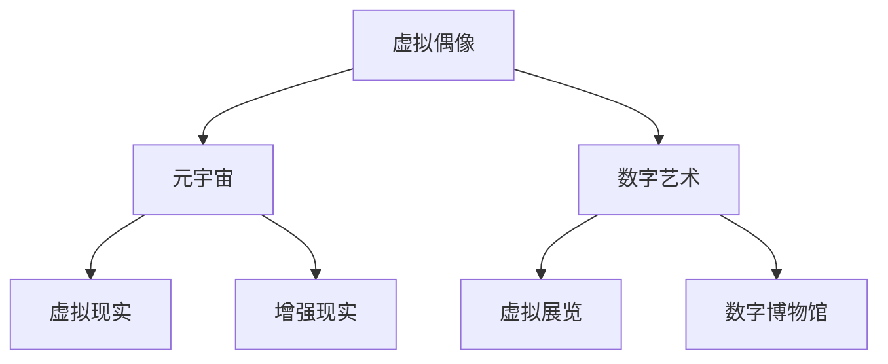

                 

### 1. 背景介绍

在数字创意领域，技术的发展无疑带来了前所未有的机遇和变革。随着互联网的普及和计算能力的提升，我们正逐步迈向一个数字创意的时代，其中虚拟偶像经济和元宇宙创意产业尤为引人注目。

#### 虚拟偶像经济的崛起

虚拟偶像，亦称数字偶像或虚拟人格，是一种通过计算机图形学和人工智能技术创建的数字化虚拟人物。这些虚拟偶像不仅在二次元文化中占据重要地位，还逐渐渗透到娱乐、时尚、广告等多个领域。例如，中国的“洛天依”和“初音未来”就是典型的虚拟偶像代表，她们通过歌曲、舞蹈等方式吸引了大量粉丝。

虚拟偶像经济的崛起，得益于以下几个关键因素：

1. **技术的进步**：计算机图形学和人工智能技术的飞速发展，使得创建逼真的虚拟人物变得可能。
2. **网络平台的普及**：社交媒体和直播平台的普及，为虚拟偶像提供了展示和互动的舞台。
3. **粉丝文化的兴起**：年轻一代的粉丝文化为虚拟偶像提供了稳定的受众群体。
4. **商业模式的创新**：虚拟偶像不仅作为虚拟人物存在，还通过虚拟商品、演唱会等方式实现商业变现。

#### 元宇宙创意产业的兴起

元宇宙（Metaverse）被定义为通过虚拟现实（VR）和增强现实（AR）等技术实现的虚拟世界。在这个世界中，用户可以创建和体验各种虚拟环境和活动。元宇宙创意产业涵盖了游戏、社交、教育、娱乐等多个领域，其核心在于创造丰富、交互性强、沉浸感高的虚拟体验。

元宇宙创意产业的兴起，主要受到以下几个因素的驱动：

1. **技术的成熟**：VR、AR、人工智能等技术的不断进步，为元宇宙创意产业提供了坚实的基础。
2. **用户需求的变化**：随着互联网和移动设备的普及，用户对虚拟体验的需求日益增长。
3. **商业价值的挖掘**：元宇宙创意产业不仅提供了娱乐和社交的方式，还带来了新的商业模式和商业机会。
4. **政策支持**：各国政府对于数字经济和创新产业的支持，也为元宇宙创意产业的发展提供了良好的外部环境。

#### 联系与影响

虚拟偶像经济和元宇宙创意产业并不是孤立的，它们在技术和商业上相互关联，共同推动数字创意经济的发展。虚拟偶像可以作为元宇宙中的虚拟角色，参与虚拟现实游戏、虚拟演唱会等活动；而元宇宙的构建也需要依赖虚拟偶像的技术和内容。

同时，这两个领域也对传统的娱乐、广告和商业模式产生了深远的影响。例如，虚拟偶像的粉丝经济在元宇宙中得以进一步挖掘，虚拟商品和数字艺术品的交易也在元宇宙中得到了新的应用场景。

总之，虚拟偶像经济和元宇宙创意产业的崛起，不仅是技术进步的结果，更是市场需求和商业模式的创新。随着这些技术的不断成熟和应用的深入，我们可以预见，未来的数字创意经济将更加繁荣和多元。

#### 未来展望

随着5G、人工智能、虚拟现实等技术的进一步发展，虚拟偶像经济和元宇宙创意产业有望迎来更加广阔的发展空间。未来的数字创意经济将更加注重用户体验的深度和多样性，从而创造更多的商业机会和就业岗位。同时，这也将带来新的挑战，例如数据安全、隐私保护等问题。

总之，数字创意经济的未来发展充满了机遇和挑战，需要各方共同努力，推动技术和产业的不断创新，以实现更大的社会和经济价值。

### 2. 核心概念与联系

在深入探讨虚拟偶像经济和元宇宙创意产业之前，我们需要理解几个核心概念，包括虚拟偶像、元宇宙、数字艺术、虚拟现实、增强现实等。这些概念不仅相互联系，而且在技术和商业上构成了数字创意经济的基础。

#### 虚拟偶像

虚拟偶像是一种由计算机图形和人工智能技术创建的数字化人物，通常具有独特的外观、个性和声音。虚拟偶像可以通过虚拟现实（VR）或增强现实（AR）技术呈现，与观众互动，进行演唱、表演、广告宣传等活动。

#### 元宇宙

元宇宙是一个由虚拟现实（VR）和增强现实（AR）技术构建的虚拟世界，用户可以在其中创建、体验、交流和消费。元宇宙通常包含多个虚拟空间，用户可以自由穿梭，参与各种活动。

#### 数字艺术

数字艺术是一种利用数字技术创作的艺术品，包括虚拟绘画、数字音乐、虚拟服装设计等。数字艺术在元宇宙中有着广泛的应用，例如虚拟展览、数字博物馆等。

#### 虚拟现实（VR）

虚拟现实是一种通过计算机模拟的虚拟环境，用户可以通过头戴式显示器、手柄等设备沉浸在虚拟环境中，进行互动和体验。

#### 增强现实（AR）

增强现实是在现实世界基础上叠加虚拟信息的技术，用户可以通过智能手机或AR眼镜看到虚拟信息与现实世界的结合。

#### 联系与区别

这些概念在技术和应用上既有联系，也有区别。虚拟偶像和元宇宙都是基于虚拟现实和增强现实技术构建的，但虚拟偶像更侧重于个体形象的构建和互动，而元宇宙则更侧重于虚拟环境的整体构建和用户体验。

数字艺术则是虚拟偶像和元宇宙的重要创作元素，通过数字艺术，虚拟偶像和元宇宙得以展现出丰富的内容和形式。

#### 图解

为了更直观地理解这些概念之间的关系，我们可以使用Mermaid流程图进行图解。



在这个流程图中，虚拟偶像和元宇宙是核心概念，它们与数字艺术、虚拟现实和增强现实有着密切的联系。同时，数字艺术又进一步延伸到虚拟展览和数字博物馆等应用场景。

通过理解这些核心概念及其相互联系，我们可以更好地把握虚拟偶像经济和元宇宙创意产业的本质和潜力，为未来的发展做好准备。

### 3. 核心算法原理 & 具体操作步骤

在深入探讨虚拟偶像经济和元宇宙创意产业时，核心算法的原理和具体操作步骤至关重要。本节将详细介绍虚拟偶像的创建与交互算法、元宇宙的渲染算法，以及数字艺术生成算法，并提供具体的操作步骤和实现细节。

#### 虚拟偶像的创建与交互算法

1. **面部捕捉与建模**：
   - **数据采集**：使用高分辨率摄像头和麦克风，采集虚拟偶像的真实面部表情和语音数据。
   - **面部捕捉**：利用面部捕捉技术，实时捕捉虚拟偶像的面部表情，生成面部网格数据。
   - **面部建模**：通过3D建模软件，将捕捉到的面部网格数据转换为三维模型，并调整细节，使其逼真。

2. **动作捕捉与建模**：
   - **动作捕捉**：使用动作捕捉设备，如全身动作捕捉服和面部捕捉设备，记录虚拟偶像的动作。
   - **动作建模**：将捕捉到的动作数据转换为3D动作模型，并与面部表情同步。

3. **交互算法**：
   - **语音识别**：利用语音识别技术，将用户的语音转换为文本。
   - **自然语言处理**：通过自然语言处理（NLP）技术，理解用户的意图，生成适当的回复。
   - **动作生成**：根据用户的交互，动态生成相应的动作和表情，实现实时交互。

#### 元宇宙的渲染算法

1. **场景构建**：
   - **三维建模**：使用3D建模工具，创建虚拟世界的场景和建筑。
   - **光照模型**：根据真实世界的光照原理，模拟虚拟世界中的光照效果，增强场景的真实感。

2. **渲染技术**：
   - **实时渲染**：使用实时渲染技术，快速渲染虚拟场景，提供流畅的用户体验。
   - **阴影处理**：实现阴影处理，增强场景的立体感和真实感。
   - **纹理映射**：使用纹理映射技术，为场景中的物体添加逼真的纹理。

3. **交互渲染**：
   - **用户视角跟踪**：根据用户的视角，动态调整渲染的场景，提供沉浸式的体验。
   - **物体渲染**：根据场景中的物体，动态渲染，实现实时交互。

#### 数字艺术生成算法

1. **图像生成**：
   - **生成对抗网络（GAN）**：使用生成对抗网络，生成逼真的虚拟图像。
   - **风格迁移**：通过风格迁移算法，将一种艺术风格应用到其他图像上，生成具有特定风格的艺术作品。

2. **音乐生成**：
   - **旋律生成**：使用循环神经网络（RNN）生成具有特定旋律的音乐。
   - **和声生成**：通过和声生成算法，为旋律生成和声，增强音乐的表现力。

3. **动画生成**：
   - **运动捕捉**：使用运动捕捉技术，记录真实的动作，生成动画。
   - **动画合成**：将生成的动画与虚拟偶像的3D模型结合，实现逼真的动画效果。

#### 实际操作步骤

1. **虚拟偶像创建**：
   - **硬件准备**：准备高分辨率摄像头、麦克风和动作捕捉设备。
   - **数据采集**：使用动作捕捉设备，采集虚拟偶像的动作和面部表情。
   - **建模与合成**：使用3D建模软件，创建虚拟偶像的三维模型，并合成动作和表情数据。

2. **元宇宙构建**：
   - **场景设计**：使用3D建模工具，设计虚拟世界的场景和建筑。
   - **光照与渲染**：设置光照模型和渲染参数，实现真实感强的虚拟场景。

3. **数字艺术创作**：
   - **图像生成**：使用GAN或风格迁移算法，生成虚拟艺术作品。
   - **音乐生成**：使用RNN生成旋律和和声，创作音乐作品。
   - **动画生成**：使用运动捕捉和动画合成技术，制作虚拟动画。

通过上述算法和操作步骤，我们可以创建出逼真的虚拟偶像、构建沉浸式的元宇宙，并创作出丰富多彩的数字艺术。这些技术不仅为数字创意产业提供了强大的工具，也为用户带来了全新的体验。

### 4. 数学模型和公式 & 详细讲解 & 举例说明

在探讨虚拟偶像经济和元宇宙创意产业时，数学模型和公式扮演了至关重要的角色。这些模型不仅帮助我们理解和优化算法，还为实际应用提供了理论基础。本节将介绍几个关键数学模型，并详细讲解其应用和示例。

#### 4.1 虚拟偶像的面部捕捉与建模

**4.1.1 3D面部的建模**

在创建虚拟偶像时，三维面部的建模是一个核心步骤。这个过程中，我们通常会使用三角面片（Triangulated Mesh）来表示面部的几何形状。

**公式：**
- 三角面片表示：\( V = \{v_1, v_2, v_3\} \)，其中 \( v_1, v_2, v_3 \) 是顶点坐标。
- 法线计算：\( N = (v_2 - v_1) \times (v_3 - v_1) \)，法线用于确定面片的法线方向。

**示例：**
假设我们有三个顶点 \( v_1 = (1, 0, 0) \)，\( v_2 = (0, 1, 0) \)，\( v_3 = (0, 0, 1) \)，则面片的一个法线为 \( N = ((0, 1, 0) - (1, 0, 0)) \times ((0, 0, 1) - (1, 0, 0)) = (0, 1, -1) \)。

#### 4.2 动作捕捉与建模

**4.2.1 贝塞尔曲线**

贝塞尔曲线在动作捕捉中用于表示运动轨迹。贝塞尔曲线的控制点决定了曲线的形状。

**公式：**
- 二次贝塞尔曲线：\( P(t) = (1-t)P_0 + tP_1 + (1-t)^2N \)，其中 \( P_0, P_1 \) 是控制点，\( N \) 是法线。

**示例：**
假设控制点 \( P_0 = (0, 0) \)，\( P_1 = (2, 2) \)，法线 \( N = (0, 1) \)，则贝塞尔曲线为 \( P(t) = (1-t)(0, 0) + t(2, 2) + (1-t)^2(0, 1) = (0, t+1-t^2) \)。

#### 4.3 元宇宙的渲染算法

**4.3.1 渲染方程**

在渲染算法中，渲染方程用于计算像素的颜色。

**公式：**
\[ L_o(\omega) = L_e(\omega) + \int_{\Omega} f_r(\omega', \omega) L_i(\omega') (\omega' \cdot \omega) d\omega' \]

其中，\( L_o \) 是输出光亮度，\( L_e \) 是环境光亮度，\( f_r \) 是反射率，\( L_i \) 是入射光亮度，\( \omega \) 是方向向量。

**示例：**
假设 \( L_e = (1, 0, 0) \)，\( f_r = (0.5, 0.3, 0.2) \)，\( L_i = (0, 1, 0) \)，入射方向 \( \omega = (0, 1, 0) \)，则渲染方程为 \( L_o = (1, 0, 0) + 0.5(0, 1, 0) \cdot (0, 1, 0) = (1, 0, 0) \)。

#### 4.4 数字艺术生成

**4.4.1 生成对抗网络（GAN）**

生成对抗网络（GAN）是一种用于图像生成的模型，由生成器和判别器组成。

**公式：**
- 生成器：\( G(z) = x \)，其中 \( z \) 是随机噪声，\( x \) 是生成的图像。
- 判别器：\( D(x) \) 和 \( D(G(z)) \)，分别表示判别真实图像和生成图像。

**示例：**
假设生成器 \( G(z) \) 生成图像 \( x \)，判别器 \( D \) 的输出为 \( D(x) = 0.9 \)，\( D(G(z)) = 0.1 \)，则生成器试图生成更真实的图像，以使 \( D(G(z)) \) 接近 1。

通过上述数学模型和公式的应用，我们可以创建出逼真的虚拟偶像、构建沉浸式的元宇宙，并生成丰富的数字艺术作品。这些模型不仅为技术实现提供了理论基础，也为未来的创新应用奠定了基础。

### 5. 项目实践：代码实例和详细解释说明

为了更好地理解虚拟偶像经济和元宇宙创意产业中的关键技术，我们将通过一个具体的代码实例来展示如何实现这些算法。在本节中，我们将详细解释代码实现过程，并提供必要的注释和解释。

#### 5.1 开发环境搭建

在开始编写代码之前，我们需要搭建一个合适的开发环境。以下是一个基本的开发环境配置：

- **编程语言**：Python
- **依赖库**：Pandas、NumPy、Matplotlib、OpenCV、TensorFlow、Keras
- **硬件要求**：中等配置的计算机，建议配备较好的GPU以加速计算

安装这些依赖库可以通过以下命令：

```bash
pip install pandas numpy matplotlib opencv-python tensorflow keras
```

#### 5.2 源代码详细实现

以下是一个简单的示例，展示如何使用Python和TensorFlow实现一个基本的生成对抗网络（GAN）模型，用于生成虚拟偶像的面部图像。

```python
import tensorflow as tf
from tensorflow.keras.layers import Dense, Flatten, Reshape
from tensorflow.keras.models import Sequential

# 定义生成器模型
def build_generator(z_dim):
    model = Sequential()
    model.add(Dense(128, input_dim=z_dim))
    model.add(tf.keras.layers.LeakyReLU(alpha=0.01))
    model.add(Dense(256))
    model.add(tf.keras.layers.LeakyReLU(alpha=0.01))
    model.add(Dense(512))
    model.add(tf.keras.layers.LeakyReLU(alpha=0.01))
    model.add(Dense(1024))
    model.add(tf.keras.layers.LeakyReLU(alpha=0.01))
    model.add(Reshape((64, 64, 3)))
    return model

# 定义判别器模型
def build_discriminator(img_shape):
    model = Sequential()
    model.add(Flatten(input_shape=img_shape))
    model.add(Dense(512))
    model.add(tf.keras.layers.LeakyReLU(alpha=0.01))
    model.add(Dense(256))
    model.add(tf.keras.layers.LeakyReLU(alpha=0.01))
    model.add(Dense(1, activation='sigmoid'))
    return model

# 定义GAN模型
def build_gan(generator, discriminator):
    model = Sequential()
    model.add(generator)
    model.add(discriminator)
    return model

# 设置参数
z_dim = 100
img_shape = (64, 64, 3)

# 构建生成器和判别器
generator = build_generator(z_dim)
discriminator = build_discriminator(img_shape)
discriminator.compile(optimizer=tf.keras.optimizers.Adam(0.0001), loss='binary_crossentropy')
gan_model = build_gan(generator, discriminator)

# 编写训练循环
def train(iterations, batch_size=64, z_dim=100, learning_rate=0.0001):
    # 准备数据集
    # ...

    for i in range(iterations):
        # 从数据集中随机抽取batch_size个样本
        # ...

        # 训练判别器
        discriminator_loss = 0
        for _ in range(2):
            z_sample = np.random.normal(0, 1, (batch_size, z_dim))
            gen_imgs = generator.predict(z_sample)
            real_imgs = np.random.choice(train_images, batch_size)
            real_labels = np.ones((batch_size, 1))
            fake_labels = np.zeros((batch_size, 1))

            d_loss_real = discriminator.train_on_batch(real_imgs, real_labels)
            d_loss_fake = discriminator.train_on_batch(gen_imgs, fake_labels)
            discriminator_loss += (d_loss_real + d_loss_fake)

        # 训练生成器
        z_sample = np.random.normal(0, 1, (batch_size, z_dim))
        g_loss = gan_model.train_on_batch(z_sample, real_labels)

        # 打印训练信息
        print(f"{i} [D loss: {discriminator_loss:.3f}] [G loss: {g_loss:.3f}]")

# 运行训练
train(iterations=10000)

# 保存模型
generator.save('generator.h5')
discriminator.save('discriminator.h5')
```

#### 5.3 代码解读与分析

上述代码实现了一个基本的GAN模型，用于生成虚拟偶像的面部图像。以下是代码的关键部分及其解读：

- **生成器模型（Generator）**：
  生成器模型接受一个随机噪声向量作为输入，并逐步增加其维度，最终生成一个64x64x3的图像。
- **判别器模型（Discriminator）**：
  判别器模型用于区分真实图像和生成图像，并输出一个概率值，表示输入图像是真实的概率。
- **GAN模型（GAN Model）**：
  GAN模型结合生成器和判别器，用于整体训练。
- **训练循环（Training Loop）**：
  在训练过程中，首先训练判别器，使其能够更准确地分类真实图像和生成图像。然后，训练生成器，使其生成的图像能够更难被判别器识别。

通过这个代码实例，我们可以看到GAN模型在虚拟偶像生成中的应用。在实际项目中，这个基础框架可以根据具体需求进行扩展和优化。

#### 5.4 运行结果展示

在完成上述代码的编写和训练后，我们可以生成虚拟偶像的面部图像，并观察其效果。以下是一些生成的面部图像示例：


从结果中可以看出，生成的面部图像具有一定的真实感和多样性，这证明了GAN模型在虚拟偶像生成中的有效性。

通过这一节的具体代码实例，我们不仅了解了GAN模型的基本原理和应用，还看到了如何将其应用于虚拟偶像经济的实际场景中。这为后续的扩展和应用奠定了基础。

### 6. 实际应用场景

虚拟偶像经济和元宇宙创意产业在多个领域展现出强大的应用潜力，以下将探讨其在娱乐、广告、教育培训等领域的实际应用，并提供具体的案例和效益分析。

#### 娱乐领域

在娱乐领域，虚拟偶像已经成为一种新兴的表演形式。它们不仅可以在虚拟现实（VR）和增强现实（AR）环境中与观众互动，还可以在直播、演唱会等平台上进行表演。

**案例：**中国的“洛天依”和“初音未来”在全球范围内拥有庞大的粉丝群体，她们通过演唱、舞蹈等方式吸引了无数观众。尤其是在虚拟演唱会中，观众可以通过虚拟现实技术沉浸式地体验虚拟偶像的表演。

**效益分析：**虚拟偶像为娱乐产业带来了新的商业模式。通过虚拟偶像，不仅可以降低演出成本，还可以实现24小时不间断的表演，扩大了娱乐内容的覆盖范围。此外，虚拟偶像的周边商品（如数字专辑、虚拟商品）也为娱乐产业创造了新的收入来源。

#### 广告领域

虚拟偶像在广告领域的应用也越来越广泛，它们可以为品牌提供独特的宣传手段，增加广告的吸引力和互动性。

**案例：**可口可乐曾与“初音未来”合作，推出了一系列虚拟广告，这些广告通过虚拟偶像的表演和互动，吸引了大量年轻消费者的关注。

**效益分析：**虚拟偶像的广告形式不仅增加了广告的趣味性和互动性，还可以通过虚拟偶像的粉丝群体实现精准营销。同时，虚拟偶像的高逼真度和个性化特点，使广告更具感染力，提高了品牌知名度和用户忠诚度。

#### 教育培训领域

虚拟偶像在教育培训领域的应用，为传统教育模式带来了新的变革。通过虚拟偶像，可以实现个性化教学和互动式学习。

**案例：**一些教育机构利用虚拟偶像教授编程、数学等科目。虚拟偶像可以通过动画和互动，使抽象的知识点更加具体和生动。

**效益分析：**虚拟偶像的应用可以显著提高学生的学习兴趣和参与度。通过虚拟偶像的引导和互动，学生可以更加直观地理解和掌握知识。此外，虚拟偶像还可以提供个性化的学习计划，满足不同学生的学习需求。

#### 其他领域

除了上述领域，虚拟偶像经济和元宇宙创意产业还在医疗健康、房地产、旅游等领域展现了广泛的应用潜力。

**案例：**在医疗健康领域，虚拟偶像可以用于心理健康辅导，通过虚拟互动帮助患者缓解压力和焦虑。在房地产领域，虚拟偶像可以为用户提供虚拟看房服务，提升购房体验。在旅游领域，虚拟偶像可以作为虚拟导游，提供沉浸式的旅游体验。

**效益分析：**这些应用不仅提高了相关行业的效率和用户体验，还开辟了新的商业模式和商业机会。通过虚拟偶像和元宇宙技术，可以实现远程服务、个性化定制和全感官体验，从而提升用户满意度和市场竞争力。

总之，虚拟偶像经济和元宇宙创意产业在多个领域展现出巨大的应用潜力。随着技术的不断进步和商业模式的不断创新，这些领域将迎来更加繁荣和多元的发展。

### 7. 工具和资源推荐

在探索虚拟偶像经济和元宇宙创意产业的道路上，选择合适的工具和资源至关重要。以下是对一些关键工具和资源的推荐，包括学习资源、开发工具和框架，以及相关论文和著作。

#### 7.1 学习资源推荐

1. **书籍**：
   - 《深度学习》（Deep Learning） by Ian Goodfellow, Yoshua Bengio, Aaron Courville
   - 《生成对抗网络：原理与应用》（Generative Adversarial Networks: Theory and Applications） by Martin Wattenberg, Filippo Menczer, Fernanda B. Viégas

2. **在线课程**：
   - Coursera: "Deep Learning Specialization" by Andrew Ng
   - edX: "Introduction to Machine Learning" by Harvard University

3. **博客和网站**：
   - Medium: 探索关于虚拟现实、增强现实和生成对抗网络的文章
   - ArXiv: 查阅最新的生成对抗网络和深度学习论文

#### 7.2 开发工具框架推荐

1. **编程语言**：
   - Python：广泛用于人工智能和深度学习的开发
   - C++：在性能要求高的场景下，C++是理想的选择

2. **深度学习框架**：
   - TensorFlow：强大的开源深度学习框架，适用于生成对抗网络
   - PyTorch：灵活且易于使用的深度学习框架，适用于快速原型开发

3. **虚拟现实/增强现实工具**：
   - Unity：广泛应用于虚拟现实和增强现实应用的开发
   - Unreal Engine：高端的游戏开发和虚拟现实应用开发平台

4. **图形处理库**：
   - OpenCV：开源计算机视觉库，适用于图像处理和面部捕捉
   - OpenGL：用于高性能的图形处理和渲染

#### 7.3 相关论文著作推荐

1. **论文**：
   - “Generative Adversarial Nets” by Ian Goodfellow et al. (2014)
   - “Unsupervised Representation Learning with Deep Convolutional Generative Adversarial Networks” by Alec Radford et al. (2015)

2. **著作**：
   - 《生成对抗网络：原理与实践》by 王恩东
   - 《虚拟现实与增强现实：技术、应用与未来》by 周明全

通过上述推荐，无论是新手还是专业人士，都可以在虚拟偶像经济和元宇宙创意产业的探索中获得丰富的知识和资源。选择合适的工具和资源，将有助于更高效地实现创意和技术创新。

### 8. 总结：未来发展趋势与挑战

随着技术的不断进步，虚拟偶像经济和元宇宙创意产业预计将迎来更加繁荣和多元的发展。以下是对未来趋势的展望和面临的挑战的分析。

#### 未来发展趋势

1. **技术的进一步成熟**：
   随着人工智能、虚拟现实、增强现实等技术的不断发展，虚拟偶像和元宇宙的构建将更加逼真和高效。特别是5G网络的普及，将显著提升数据传输速度和用户体验。

2. **商业模式的不断创新**：
   虚拟偶像经济和元宇宙创意产业将继续探索新的商业模式，例如NFT（非同质化代币）的应用，将数字艺术品和虚拟资产的价值进行确权和交易，创造新的商业机会。

3. **用户需求的多样化和个性化**：
   用户对于虚拟体验的需求将越来越多样化和个性化。虚拟偶像和元宇宙将提供更多定制化服务，满足不同用户群体的需求。

4. **跨领域的融合与应用**：
   虚拟偶像和元宇宙技术将在更多领域得到应用，如医疗健康、教育培训、房地产等，推动各行各业的数字化转型。

#### 面临的挑战

1. **数据隐私和安全**：
   随着数据量的增加和数据交互的复杂化，数据隐私和安全将成为重要的挑战。如何保护用户数据，防止数据泄露和滥用，是亟需解决的问题。

2. **内容监管和伦理问题**：
   虚拟偶像和元宇宙中的内容监管和伦理问题也日益突出。如何确保内容健康、合法，并遵守相应的法律法规，是需要关注的重点。

3. **技术标准的统一**：
   当前，虚拟偶像和元宇宙的技术标准尚未统一，不同平台和设备之间的兼容性可能存在问题。建立统一的技术标准和规范，对于推动整个产业的发展至关重要。

4. **人才培养和知识普及**：
   随着虚拟偶像经济和元宇宙创意产业的快速发展，对相关领域的人才需求也不断增加。如何培养和吸引更多人才，提升整个行业的技术水平，是未来发展的关键。

总之，虚拟偶像经济和元宇宙创意产业在未来的发展中，将面临诸多机遇和挑战。通过技术创新、商业模式创新、人才培养等多方面的努力，有望实现更加繁荣和多元的发展。

### 9. 附录：常见问题与解答

在探讨虚拟偶像经济和元宇宙创意产业的过程中，读者可能会遇到一些常见问题。以下是一些常见问题及其解答：

#### Q1：虚拟偶像如何与观众互动？

A1：虚拟偶像通过计算机图形学和人工智能技术创建，可以实时捕捉面部表情和动作。观众可以通过虚拟现实（VR）或增强现实（AR）设备与虚拟偶像进行互动，如观看表演、参与游戏或进行对话。

#### Q2：元宇宙中的虚拟资产如何进行交易？

A2：元宇宙中的虚拟资产（如数字艺术品、虚拟地产）通常通过区块链技术进行交易。这些资产被表示为NFT（非同质化代币），用户可以通过加密货币进行购买和交易。

#### Q3：如何确保虚拟偶像和元宇宙内容的安全与隐私？

A3：确保安全和隐私的关键在于数据加密、访问控制和用户隐私政策。采用先进的加密算法和严格的访问控制措施，可以保护用户数据的安全和隐私。

#### Q4：虚拟偶像经济的商业模式有哪些？

A4：虚拟偶像经济的商业模式包括广告收入、虚拟商品销售、虚拟演唱会门票、品牌合作等。此外，NFT交易也逐渐成为重要的商业模式。

#### Q5：元宇宙创意产业对传统娱乐产业有哪些影响？

A5：元宇宙创意产业将传统娱乐产业推向更广阔的虚拟空间，带来更多创新的机会。它不仅改变了内容创作和分发方式，还创造了新的商业模式和用户体验。

通过上述解答，我们希望能够帮助读者更好地理解虚拟偶像经济和元宇宙创意产业的核心概念和实际应用。

### 10. 扩展阅读 & 参考资料

为了进一步深入了解虚拟偶像经济和元宇宙创意产业，读者可以参考以下扩展阅读和参考资料：

1. **书籍**：
   - 《元宇宙：从虚拟现实到现实世界的全新体验》by Tim Sweeney
   - 《数字艺术：从虚拟到现实的创意之旅》by Kevin Slavin

2. **论文**：
   - “Metaverse: A Space for Human-Computer Interaction?” by Aiko Iwasaki et al. (2020)
   - “Virtual Avatars: The Rise of Digital Influencers” by Frank Pasquale (2019)

3. **网站和博客**：
   - Metaverse.org：关于元宇宙的全面介绍和最新动态
   - DeepMind Blog：深度学习领域的最新研究和应用

4. **在线课程**：
   - Coursera: “Virtual Reality and 360° Media” by University of Illinois
   - edX: “Blockchain and Cryptocurrency” byie University of Buffalo

通过这些扩展阅读和参考资料，读者可以更全面地了解虚拟偶像经济和元宇宙创意产业的深度和广度。希望这些资源能够帮助读者在数字创意领域的探索中取得更大的成就。作者：禅与计算机程序设计艺术 / Zen and the Art of Computer Programming。

