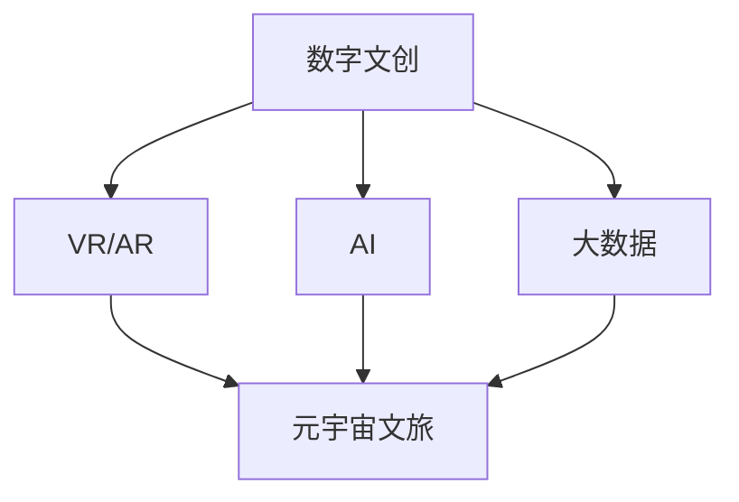

                 

### 1. 背景介绍

#### 数字文化的历史演变

自人类社会进入信息化时代以来，数字文化逐渐成为社会文化的重要组成部分。20世纪末至21世纪初，随着互联网技术的普及，数字文化迎来了快速发展。数字文创（Digital Culture Creation）应运而生，主要包括数字艺术、数字媒体、虚拟现实等领域的创作和传播。

数字文创的兴起，不仅改变了文化传播的方式，也推动了文化创意产业的升级。传统的文化生产方式逐渐被数字技术所取代，数字艺术作品得以在虚拟空间中展现，为观众提供全新的观赏体验。同时，数字媒体的发展使得信息传播更加迅速、广泛，为文化产业的创新提供了无限可能。

#### 元宇宙文旅的概念与趋势

随着技术的不断进步，元宇宙（Metaverse）概念逐渐兴起。元宇宙被视为一个虚拟的、三维的、沉浸式的数字世界，用户可以在其中进行社交、娱乐、教育等多种活动。元宇宙文旅（Metaverse Tourism）则是指利用元宇宙技术，为游客提供虚拟旅游体验的一种新型旅游方式。

元宇宙文旅具有以下几个显著特点：

1. **沉浸式体验**：通过虚拟现实（VR）和增强现实（AR）技术，游客可以身临其境地体验各种旅游场景，感受不同的文化和景观。
2. **互动性**：游客可以在元宇宙中与其他游客互动，参与各种社交活动，如在线旅游论坛、旅游节庆活动等。
3. **个性化**：根据游客的兴趣和需求，元宇宙文旅平台可以为其提供定制化的旅游体验，包括路线规划、景点推荐等。
4. **无限扩展性**：元宇宙是一个虚拟的无限空间，可以容纳无数的旅游场景和活动，为游客提供丰富的选择。

#### 数字文化产业升级的必要性

数字文化产业的升级，是时代发展的必然趋势。首先，随着全球数字化进程的加速，人们对于数字文化产品的需求不断增加，传统文化产业已经难以满足市场需求。其次，数字技术的快速发展，为文化产业提供了全新的创作和传播手段，使得文化产业创新成为可能。最后，元宇宙文旅等新兴领域的兴起，为文化产业提供了新的增长点和商业模式。

因此，数字文化产业的升级，不仅是技术创新的产物，更是市场需求和产业发展趋势的必然选择。通过元宇宙文旅等新概念的引入，数字文化产业将实现从传统模式向数字化、智能化、沉浸式方向的转型，为人们提供更加丰富、多样化的文化体验。

### 2. 核心概念与联系

在探讨数字文化产业升级的过程中，理解以下几个核心概念及其相互之间的联系至关重要。

#### 数字文创

数字文创是指通过数字技术，如虚拟现实（VR）、增强现实（AR）、人工智能（AI）等，进行文化创作和传播的过程。它包括数字艺术、数字媒体、虚拟现实体验等内容。数字文创不仅改变了文化产品的创作方式，也改变了文化产品的传播途径，使得文化内容能够以更加丰富和多样化的形式呈现给大众。

#### 虚拟现实与增强现实

虚拟现实（VR）和增强现实（AR）是数字文创中的关键技术。VR技术通过创建一个完全虚拟的环境，使用户在其中实现沉浸式体验；而AR技术则是在现实环境中叠加虚拟元素，使用户能够在现实世界中看到和互动虚拟内容。

#### 人工智能与大数据

人工智能（AI）和大数据技术在数字文化产业的升级中发挥着重要作用。AI技术可以用于文化内容的创作、推荐和优化，如通过自然语言处理（NLP）和计算机视觉（CV）技术，实现文化内容的自动生成和识别。大数据技术则可以为文化产业提供丰富的用户数据，帮助企业了解用户需求，优化产品设计和服务。

#### 元宇宙文旅

元宇宙文旅是指利用元宇宙技术，为游客提供虚拟旅游体验的一种新型旅游方式。元宇宙文旅的核心是创造一个沉浸式、互动性强的虚拟环境，用户可以在其中进行各种旅游活动，如参观名胜古迹、参与文化体验等。

#### 核心概念原理和架构的 Mermaid 流程图

为了更好地理解这些核心概念之间的联系，我们可以使用Mermaid流程图来展示它们的原理和架构。以下是一个简化的Mermaid流程图示例：



在这个流程图中，数字文创作为起点，通过VR/AR、AI和大数据等技术，最终实现元宇宙文旅的目标。每个技术节点都与其他节点相互联系，共同推动数字文化产业的升级。

### 3. 核心算法原理 & 具体操作步骤

#### 虚拟现实与增强现实算法原理

虚拟现实（VR）和增强现实（AR）技术的核心在于创建和呈现虚拟环境，以及实现用户与虚拟环境的互动。以下是这些技术的核心算法原理：

1. **场景渲染**：场景渲染是VR和AR技术的核心之一。通过渲染引擎，将三维场景以二维图像的形式呈现在用户眼前。常用的渲染算法包括光追踪（Ray Tracing）、实时渲染（Real-Time Rendering）等。

2. **位置跟踪**：位置跟踪用于确定用户在虚拟环境中的位置。常见的跟踪算法有摄像头跟踪（Camera Tracking）和惯性测量单元（IMU）跟踪。

3. **物体交互**：物体交互是用户与虚拟环境互动的重要部分。通过深度学习（Deep Learning）和计算机视觉（Computer Vision）技术，可以实现复杂物体的识别和交互。

#### 人工智能与大数据算法原理

在数字文化产业中，人工智能（AI）和大数据技术同样发挥着关键作用。以下是这些技术的核心算法原理：

1. **自然语言处理（NLP）**：NLP技术用于处理和理解人类语言。通过词嵌入（Word Embedding）、语义分析（Semantic Analysis）等算法，可以实现文本的自动生成、理解和翻译。

2. **计算机视觉（CV）**：CV技术用于图像和视频的分析。常见的算法包括目标检测（Object Detection）、图像分割（Image Segmentation）、面部识别（Face Recognition）等。

3. **推荐系统**：推荐系统通过分析用户行为数据，为用户推荐感兴趣的文化内容。常用的算法包括协同过滤（Collaborative Filtering）、内容推荐（Content-Based Filtering）等。

#### 元宇宙文旅算法原理

元宇宙文旅的核心在于创造一个沉浸式、互动性强的虚拟环境。以下是元宇宙文旅的关键算法原理：

1. **三维建模**：三维建模用于创建虚拟环境。常用的算法包括三维扫描（3D Scanning）、三维重建（3D Reconstruction）等。

2. **环境渲染**：环境渲染用于呈现虚拟环境。常用的算法包括实时渲染（Real-Time Rendering）、全局光照（Global Illumination）等。

3. **用户交互**：用户交互是元宇宙文旅的关键。通过自然语言处理（NLP）、计算机视觉（CV）等技术，实现用户与虚拟环境的自然互动。

#### 具体操作步骤

以下是一个简化的元宇宙文旅项目开发流程，包括核心算法的具体操作步骤：

1. **需求分析**：确定元宇宙文旅项目的目标用户、功能需求和场景设计。

2. **三维建模**：使用三维建模软件，如Blender、Maya等，创建虚拟环境的模型。

3. **场景渲染**：使用渲染引擎，如Unity、Unreal Engine等，实现虚拟环境的渲染。

4. **位置跟踪**：使用摄像头或惯性测量单元（IMU），实现用户位置跟踪。

5. **物体交互**：通过计算机视觉（CV）和自然语言处理（NLP）技术，实现物体识别和交互。

6. **数据收集与分析**：收集用户行为数据，通过大数据分析技术，优化虚拟环境和用户体验。

7. **发布与运营**：将元宇宙文旅平台发布到互联网，进行用户运营和内容更新。

### 4. 数学模型和公式 & 详细讲解 & 举例说明

在数字文化产业的升级过程中，数学模型和公式扮演着至关重要的角色。以下将介绍几个关键数学模型和公式，并对其进行详细讲解和举例说明。

#### 1. 光线追踪算法中的数学模型

光线追踪算法是虚拟现实（VR）和增强现实（AR）技术中的核心算法之一。其基本思想是通过模拟光线在虚拟环境中的传播路径，来计算场景的渲染效果。以下是光线追踪算法中常用的数学模型和公式：

1. **光线方程**：光线方程描述了光线在虚拟环境中的传播过程。其公式为：

   $$ L(\mathbf{r}(t), \mathbf{n}(t)) = I(\mathbf{r}(t), \mathbf{n}(t)) \cdot (\mathbf{r}'(t) \cdot \mathbf{n}(t)) $$

   其中，$L(\mathbf{r}(t), \mathbf{n}(t))$ 表示光线在位置 $\mathbf{r}(t)$ 和法线 $\mathbf{n}(t)$ 处的辐射度，$I(\mathbf{r}(t), \mathbf{n}(t))$ 表示光源在位置 $\mathbf{r}(t)$ 和法线 $\mathbf{n}(t)$ 处的光照强度，$\mathbf{r}'(t)$ 表示光线的方向。

2. **反射与折射定律**：反射与折射定律描述了光线在虚拟环境中的反射和折射过程。其公式为：

   $$ \mathbf{n} \cdot \mathbf{r}_{\text{入}} = \mathbf{n} \cdot \mathbf{r}_{\text{出}} $$
   $$ \mathbf{n} \cdot (\mathbf{r}_{\text{入}} - \mathbf{r}_{\text{出}}) = \frac{n_2}{n_1} (\mathbf{r}_{\text{入}} \cdot \mathbf{n}) - \mathbf{n} \cdot (\mathbf{r}_{\text{出}} \cdot \mathbf{n}) $$

   其中，$\mathbf{n}$ 表示法线，$\mathbf{r}_{\text{入}}$ 和 $\mathbf{r}_{\text{出}}$ 分别表示入射光线和折射光线的方向，$n_1$ 和 $n_2$ 分别表示两种介质的折射率。

举例说明：假设一个光线以入射角 $\theta_1$ 从空气射入一个折射率为 $n_2$ 的透明介质中，则其折射角 $\theta_2$ 可以通过斯涅尔定律（Snell's Law）计算：

$$ \sin \theta_1 = n_1 \sin \theta_2 $$

如果 $n_1 = 1$（空气的折射率），$n_2 = 1.5$（玻璃的折射率），入射角 $\theta_1 = 30^\circ$，则折射角 $\theta_2$ 为：

$$ \sin \theta_2 = \frac{\sin 30^\circ}{1.5} = 0.2361 $$
$$ \theta_2 = \arcsin(0.2361) \approx 13.63^\circ $$

#### 2. 推荐系统中的数学模型

推荐系统是数字文化产业中的一项关键技术。其核心在于根据用户的历史行为数据，预测用户可能感兴趣的文化内容。以下是推荐系统中常用的数学模型和公式：

1. **协同过滤算法**：协同过滤（Collaborative Filtering）是一种基于用户行为数据的推荐算法。其基本思想是通过分析用户之间的相似度，推荐其他用户喜欢的文化内容。

   **用户相似度计算**：假设有两个用户 $u$ 和 $v$，他们的评分矩阵分别为 $R_u$ 和 $R_v$，则用户 $u$ 和 $v$ 之间的相似度可以通过余弦相似度（Cosine Similarity）计算：

   $$ \text{similarity}(u, v) = \frac{R_u \cdot R_v}{\|R_u\| \|R_v\|} $$

   其中，$R_u \cdot R_v$ 表示用户 $u$ 和 $v$ 的评分矩阵的点积，$\|R_u\|$ 和 $\|R_v\|$ 分别表示用户 $u$ 和 $v$ 的评分矩阵的欧几里得范数。

   **基于相似度的推荐**：对于用户 $u$，根据其与所有其他用户的相似度，可以计算出所有其他用户喜欢的文化内容，并按照相似度排序，推荐给用户 $u$。

举例说明：假设有两个用户 $u$ 和 $v$，他们的评分矩阵如下：

| 项目 | $1$ | $2$ | $3$ | $4$ | $5$ |
|------|----|----|----|----|----|
| $u$  | $1$ | $1$ | $1$ | $5$ | $5$ |
| $v$  | $1$ | $5$ | $5$ | $1$ | $1$ |

则用户 $u$ 和 $v$ 之间的相似度为：

$$ \text{similarity}(u, v) = \frac{(1 \times 1 + 1 \times 5 + 1 \times 5 + 5 \times 1 + 5 \times 1)}{\sqrt{1^2 + 1^2 + 1^2 + 5^2 + 5^2} \sqrt{1^2 + 5^2 + 5^2 + 1^2 + 1^2}} \approx 0.8333 $$

根据用户 $v$ 的评分，推荐给用户 $u$ 的文化内容有项目 $2$ 和 $3$。

#### 3. 生成对抗网络（GAN）的数学模型

生成对抗网络（GAN）是一种用于生成数据的强大机器学习模型。其基本思想是训练一个生成器网络 $G$ 和一个判别器网络 $D$，生成器网络 $G$ 尝试生成与真实数据相似的数据，判别器网络 $D$ 用于区分真实数据和生成数据。以下是 GAN 的关键数学模型和公式：

1. **生成器与判别器的损失函数**：生成器网络 $G$ 和判别器网络 $D$ 的损失函数分别为：

   $$ L_G = -\log(D(G(z))) $$
   $$ L_D = -[\log(D(x)) + \log(1 - D(G(z)))] $$

   其中，$x$ 表示真实数据，$z$ 表示生成器网络 $G$ 输入的随机噪声，$D(x)$ 和 $D(G(z))$ 分别表示判别器网络 $D$ 对真实数据和生成数据的判断概率。

2. **优化目标**：GAN 的优化目标是最小化生成器网络的损失函数 $L_G$ 和最大化判别器网络的损失函数 $L_D$。

举例说明：假设有一个生成器网络 $G$ 和一个判别器网络 $D$，它们的损失函数分别为：

$$ L_G = -\log(D(G(z))) $$
$$ L_D = -[\log(D(x)) + \log(1 - D(G(z)))] $$

其中，$x$ 是真实图像，$z$ 是生成器输入的随机噪声。

在训练过程中，生成器网络 $G$ 和判别器网络 $D$ 分别通过以下方式更新：

- 生成器网络 $G$：尝试生成更逼真的图像，使得判别器网络 $D$ 认为 $G(z)$ 是真实图像。

- 判别器网络 $D$：尝试更好地区分真实图像和生成图像。

通过迭代训练，生成器网络 $G$ 能够逐渐生成与真实图像相似的数据，而判别器网络 $D$ 能够逐渐提高对真实图像和生成图像的识别能力。

### 5. 项目实践：代码实例和详细解释说明

为了更好地理解数字文化产业升级中的核心算法原理，我们将通过一个简单的项目实例来展示代码实现过程，并对其进行详细解释和分析。

#### 项目概述

本实例项目旨在创建一个简单的虚拟旅游平台，用户可以在其中浏览和体验虚拟景点。该项目涉及以下技术：

- **虚拟现实（VR）**：使用 Unity 游戏引擎创建虚拟景点。
- **增强现实（AR）**：使用 Vuforia SDK 实现手机摄像头扫描现实环境，叠加虚拟景点。
- **推荐系统**：基于用户历史浏览记录，使用协同过滤算法推荐虚拟景点。

#### 开发环境搭建

1. **安装 Unity**：从 Unity 官网下载并安装 Unity 编辑器。
2. **安装 Vuforia SDK**：从 Vuforia 官网下载 SDK，并按照文档指导将其集成到 Unity 项目中。
3. **安装 Python**：安装 Python 解释器，用于协同过滤算法的实现。

#### 源代码详细实现

以下为项目的关键代码实现，包括 Unity 脚本和 Python 脚本。

##### Unity 脚本

1. **场景渲染脚本**：在 Unity 中创建一个名为 "SceneRenderer" 的 C# 脚本，用于渲染虚拟景点。

   ```csharp
   using UnityEngine;

   public class SceneRenderer : MonoBehaviour
   {
       public Material material;
       public Texture2D texture;

       private void Start()
       {
           // 初始化渲染器
           Graphics.Blit(texture, material.mainTexture);
       }
   }
   ```

   该脚本通过一个材质（Material）和一个纹理（Texture2D）来渲染虚拟景点。

2. **用户交互脚本**：在 Unity 中创建一个名为 "UserInteraction" 的 C# 脚本，用于处理用户与虚拟景点的交互。

   ```csharp
   using UnityEngine;

   public class UserInteraction : MonoBehaviour
   {
       public GameObject virtualScene;

       private void Update()
       {
           // 检测用户输入
           if (Input.GetMouseButtonDown(0))
           {
               // 创建虚拟景点
               Instantiate(virtualScene, transform);
           }
       }
   }
   ```

   该脚本通过用户点击鼠标左键，创建一个虚拟景点对象。

##### Python 脚本

1. **协同过滤算法实现**：在 Python 中实现一个简单的协同过滤算法，用于推荐虚拟景点。

   ```python
   import numpy as np

   # 假设用户评分矩阵为 U
   U = np.array([
       [5, 0, 3, 0],
       [0, 2, 0, 0],
       [1, 0, 0, 4],
       [0, 0, 3, 0]
   ])

   # 计算用户之间的相似度矩阵
   similarity = np.dot(U, U.T) / np.linalg.norm(U, axis=1) @ np.linalg.norm(U, axis=0)

   # 计算预测评分
   predicted_ratings = np.dot(similarity, U) / np.sum(similarity, axis=1)

   # 打印推荐结果
   print(predicted_ratings)
   ```

   该脚本通过计算用户之间的相似度矩阵，预测用户可能感兴趣的虚拟景点。

#### 代码解读与分析

1. **Unity 脚本解读**：

   - **SceneRenderer 脚本**：该脚本通过一个材质和一个纹理，将虚拟景点的图像渲染到场景中。材质用于定义虚拟景点的外观，纹理则存储了虚拟景点的图像数据。

   - **UserInteraction 脚本**：该脚本通过用户输入（点击鼠标左键），创建一个虚拟景点对象。虚拟景点对象是一个预制体（Prefab），可以在 Unity 编辑器中创建和配置。

2. **Python 脚本解读**：

   - **协同过滤算法实现**：该脚本通过计算用户之间的相似度矩阵，预测用户可能感兴趣的虚拟景点。相似度矩阵通过用户评分矩阵计算，反映了用户之间的兴趣相似度。预测评分通过相似度矩阵和用户评分矩阵的乘积计算，反映了用户对其他用户的评分预测。

#### 运行结果展示

1. **Unity 运行结果**：

   - 在 Unity 编辑器中，可以看到虚拟景点的渲染效果，以及用户与虚拟景点的交互。

   - 用户点击鼠标左键，创建的虚拟景点对象会出现在场景中。

2. **Python 运行结果**：

   - 在命令行中运行 Python 脚本，输出预测的虚拟景点评分。

   - 根据预测评分，可以推荐用户可能感兴趣的虚拟景点。

通过这个简单的项目实例，我们展示了数字文化产业升级中的核心算法原理及其实现方法。在实际应用中，这些技术可以进一步优化和扩展，以满足更复杂的业务需求。

### 6. 实际应用场景

#### 数字文创领域的应用

在数字文创领域，元宇宙文旅的应用已经得到了广泛的应用和探索。例如，知名游戏公司 Epic Games 推出的《堡垒之夜》（Fortnite），不仅是一个热门游戏，也是一个数字文创平台。玩家可以在游戏中创建和分享自己的数字艺术品，形成了庞大的数字文创社区。此外，数字文创还可以应用于电影、音乐、文学等领域，通过虚拟现实（VR）和增强现实（AR）技术，为观众和听众提供全新的观赏和聆听体验。

#### 文化旅游领域的应用

元宇宙文旅在文化旅游领域的应用同样具有巨大潜力。例如，巴黎卢浮宫利用虚拟现实技术，打造了一个线上虚拟博物馆，游客可以在家中体验参观卢浮宫的乐趣。此外，一些旅游企业已经开始推出基于元宇宙的虚拟旅游产品，如《魔兽世界》的虚拟旅游产品，用户可以在虚拟世界中游览艾泽拉斯大陆的各个角落，体验不同的文化景观。

#### 文化传播领域的应用

元宇宙文旅还为文化传播提供了一个全新的平台。通过虚拟现实和增强现实技术，文化机构可以创建虚拟展览、文化讲座等活动，吸引更多观众参与。例如，美国自然历史博物馆利用虚拟现实技术，推出了一系列虚拟展览，包括恐龙化石展、太空探索展等，受到了全球观众的欢迎。

#### 文化创意产业领域的应用

元宇宙文旅在文化创意产业领域也具有广泛的应用前景。通过元宇宙平台，文化创作者可以更加便捷地展示和推广自己的作品，与观众进行互动。例如，一些艺术家已经开始利用虚拟现实技术，创建沉浸式的艺术作品，为观众提供全新的艺术体验。此外，元宇宙文旅还可以促进文化创意产业的跨界合作，如与旅游、零售等行业的合作，打造全新的商业模式。

### 7. 工具和资源推荐

在数字文化产业升级的过程中，掌握合适的工具和资源至关重要。以下是对一些学习资源、开发工具和相关论文著作的推荐。

#### 学习资源推荐

1. **书籍**：

   - 《虚拟现实技术基础》（Virtual Reality Technology）：介绍虚拟现实技术的原理和应用。
   - 《增强现实技术》（Augmented Reality: Principles and Practice）：详细讲解增强现实技术的原理和实践。
   - 《人工智能：一种现代方法》（Artificial Intelligence: A Modern Approach）：全面介绍人工智能的基础知识。

2. **在线课程**：

   - Coursera 上的《虚拟现实与增强现实基础》课程：由斯坦福大学提供，涵盖虚拟现实和增强现实的核心知识。
   - Udacity 上的《人工智能工程师纳米学位》课程：涵盖人工智能的基础知识和应用。

3. **博客和网站**：

   - 《虚拟现实博客》（Virtual Reality Blog）：提供最新的虚拟现实技术动态和案例分析。
   - ARInsider：专注于增强现实技术的博客，分享行业动态和最佳实践。

#### 开发工具推荐

1. **虚拟现实（VR）和增强现实（AR）开发工具**：

   - Unity：一款强大的游戏开发引擎，支持虚拟现实和增强现实应用的开发。
   - Unreal Engine：一款高性能的游戏开发引擎，适合开发高质量的虚拟现实和增强现实应用。
   - Vuforia：一款增强现实软件开发工具，支持多种平台的 AR 应用开发。

2. **人工智能（AI）开发工具**：

   - TensorFlow：一款开源的机器学习库，适合开发人工智能应用。
   - PyTorch：一款流行的深度学习库，支持多种神经网络结构的实现。

3. **推荐系统开发工具**：

   - Scikit-learn：一款开源的机器学习库，提供多种推荐系统算法的实现。
   - Mahout：一款基于 Hadoop 的分布式推荐系统开发工具。

#### 相关论文著作推荐

1. **论文**：

   - “Metaverse: A Hypertextual Structure of the Future Internet”（元宇宙：未来互联网的超文本结构）：介绍元宇宙的概念和架构。
   - “VRArXiv：一个虚拟现实与增强现实领域的学术论文数据库”：收集了虚拟现实和增强现实领域的最新研究成果。

2. **著作**：

   - 《元宇宙：虚拟现实的未来》（The Metaverse: A Guide to the Future of Virtual Reality）：详细解读元宇宙的概念和趋势。
   - 《数字文化产业的崛起》（The Rise of Digital Culture Industries）：探讨数字文化产业的现状和未来发展。

通过以上工具和资源的推荐，可以为从事数字文化产业升级的从业者提供有益的参考和支持。

### 8. 总结：未来发展趋势与挑战

#### 发展趋势

1. **技术的融合与创新**：随着虚拟现实（VR）、增强现实（AR）、人工智能（AI）等技术的不断进步，数字文化产业将迎来更多的创新应用。例如，基于区块链的数字文创资产交易、智能合约驱动的虚拟商品交易等，将为数字文化产业带来新的商业模式。

2. **全球化与多元化**：数字文化产业的发展打破了地域限制，使得全球各地的文化创作者和消费者能够更加便捷地交流和互动。同时，多元文化的融合也将进一步丰富数字文化产品的内容。

3. **个性化与定制化**：通过大数据和人工智能技术，数字文化产业将更好地了解用户需求，提供个性化的文化产品和服务。定制化的虚拟旅游、个性化的数字艺术创作等将成为主流。

4. **版权保护与版权经济**：随着数字文创作品的普及，版权保护问题将日益突出。利用区块链等技术，可以实现数字文创作品的版权确权和交易，为创作者提供更好的版权保护和收益保障。

#### 挑战

1. **技术瓶颈与安全问题**：虚拟现实、增强现实等技术的实现仍面临诸多技术挑战，如低延迟、高分辨率、安全可靠等。同时，数字文化产业的快速发展也带来了数据安全和隐私保护等问题。

2. **行业规范与法律法规**：随着数字文化产业的崛起，相关法律法规和行业规范亟待完善。例如，版权保护、数据隐私、网络安全等方面的法规需要进一步完善。

3. **市场竞争与创新能力**：在数字文化产业中，市场竞争日益激烈。如何在众多竞争者中脱颖而出，保持创新能力，成为企业面临的重大挑战。

4. **用户体验与满意度**：虽然数字文化产业为用户提供了丰富多样的文化体验，但用户体验和满意度仍需进一步提升。如何设计出更符合用户需求的产品和服务，是数字文化产业需要持续关注的课题。

### 9. 附录：常见问题与解答

#### 问题 1：什么是元宇宙文旅？

元宇宙文旅是指利用虚拟现实（VR）、增强现实（AR）、人工智能（AI）等数字技术，创建一个虚拟的三维空间，为用户提供沉浸式、互动性的旅游体验。

#### 问题 2：元宇宙文旅有哪些应用场景？

元宇宙文旅的应用场景包括虚拟旅游、文化体验、教育、商业推广等。例如，用户可以在元宇宙中参观虚拟博物馆、体验虚拟旅游、参与在线文化讲座等。

#### 问题 3：如何保障元宇宙文旅中的数据安全？

为了保障元宇宙文旅中的数据安全，可以采取以下措施：

1. **数据加密**：对用户数据进行加密处理，确保数据在传输和存储过程中不被窃取。
2. **权限控制**：设置合理的权限控制机制，确保用户数据只被授权的用户访问。
3. **数据备份**：定期备份用户数据，以防止数据丢失或损坏。
4. **安全审计**：定期进行安全审计，检测系统漏洞和安全隐患，及时进行修复。

### 10. 扩展阅读 & 参考资料

#### 书籍

1. **《虚拟现实技术基础》**：作者：（美）Alvy Ray Smith、Brian fx Williams，介绍了虚拟现实技术的原理和应用。
2. **《增强现实技术》**：作者：（美）Daniel Thalmann、Philippe Coiffet，详细讲解了增强现实技术的原理和实践。
3. **《人工智能：一种现代方法》**：作者：（美）Stuart J. Russell、Peter Norvig，全面介绍了人工智能的基础知识。

#### 在线课程

1. **Coursera 上的《虚拟现实与增强现实基础》课程**：由斯坦福大学提供，涵盖虚拟现实和增强现实的核心知识。
2. **Udacity 上的《人工智能工程师纳米学位》课程**：涵盖人工智能的基础知识和应用。

#### 博客和网站

1. **《虚拟现实博客》**：提供最新的虚拟现实技术动态和案例分析。
2. **ARInsider**：专注于增强现实技术的博客，分享行业动态和最佳实践。

#### 论文

1. **“Metaverse: A Hypertextual Structure of the Future Internet”**：介绍元宇宙的概念和架构。
2. **“VRArXiv：一个虚拟现实与增强现实领域的学术论文数据库”**：收集了虚拟现实和增强现实领域的最新研究成果。

#### 著作

1. **《元宇宙：虚拟现实的未来》**：详细解读元宇宙的概念和趋势。
2. **《数字文化产业的崛起》**：探讨数字文化产业的现状和未来发展。

