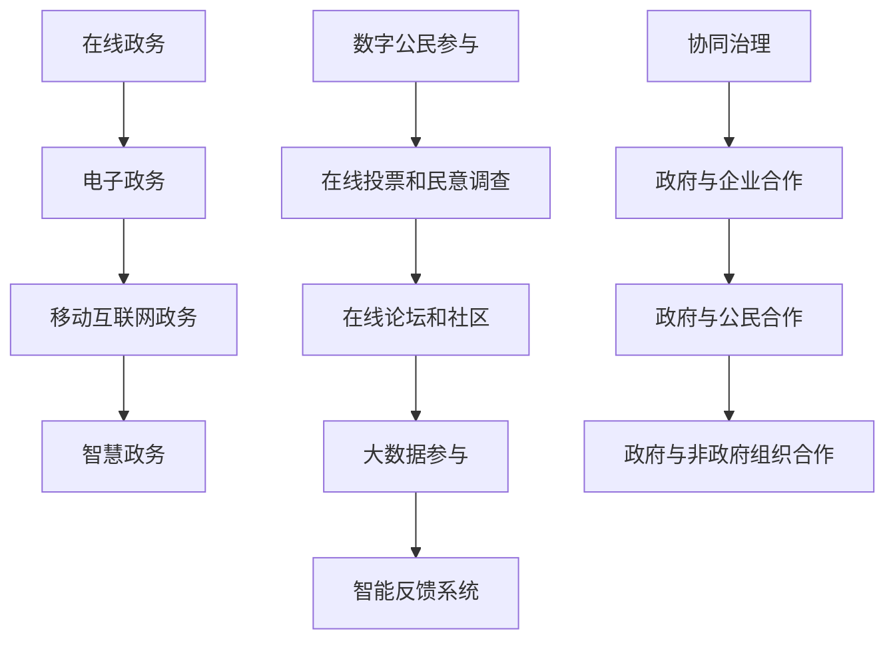

                 

### 文章标题：2050年的数字治理：从在线政务到数字公民参与的协同治理

> 关键词：数字治理、在线政务、数字公民参与、协同治理、未来趋势

> 摘要：本文探讨了2050年数字治理的前景，分析了在线政务的发展趋势、数字公民参与的模式及其对协同治理的影响。文章通过对核心概念的深入阐述、算法原理的详细解释、实际应用场景的展示，揭示了数字治理在未来的重要性以及面临的挑战。

---

## 1. 背景介绍

随着互联网技术的飞速发展，数字治理已经逐渐成为现代社会治理的重要手段。数字治理指的是利用数字技术和信息系统来管理公共事务、提供公共服务和参与社会治理的过程。在线政务作为数字治理的核心组成部分，旨在通过电子化手段优化政府服务流程，提高政府效能，增强政府与公民之间的互动。

在线政务的兴起不仅改变了政府服务的模式，也深刻影响了公民参与社会治理的方式。数字公民参与指的是通过互联网和移动设备等数字平台，公民能够更加便捷地参与公共事务的讨论、决策和监督。这种参与方式不仅打破了时间和空间的限制，还促进了公民对政府行为的监督和反馈，提升了政府的透明度和公信力。

协同治理则是在数字治理和数字公民参与的基础上，形成的一种多元主体共同参与的治理模式。政府、公民、企业、非政府组织等不同主体通过数字平台进行信息共享、资源整合和协同行动，共同解决社会问题，实现社会治理的多元化和高效化。

本文将深入探讨2050年数字治理的发展趋势，分析在线政务的演变、数字公民参与的模式以及协同治理的实践，为未来的数字治理提供理论指导和实践参考。

## 2. 核心概念与联系

### 2.1 在线政务的发展

在线政务的发展经历了三个主要阶段：电子政务、移动互联网政务和智慧政务。

1. **电子政务**：最早的在线政务形式，以政府网站和电子邮件为主要工具，提供基本的政府信息查询和公共服务申请功能。

2. **移动互联网政务**：随着移动互联网的普及，政府服务逐渐向移动端延伸，公民可以通过手机APP、微信小程序等途径办理各类政务服务。

3. **智慧政务**：利用大数据、人工智能、区块链等先进技术，实现政务数据的智能化处理和服务的个性化定制，提供更加精准、高效的政府服务。

### 2.2 数字公民参与的模式

数字公民参与的模式主要包括以下几种：

1. **在线投票和民意调查**：通过互联网平台，政府可以实时收集公民的意见和反馈，进行民意调查和在线投票。

2. **在线论坛和社区**：公民可以在政府网站或社交媒体上参与公共事务的讨论，提出建议和意见。

3. **大数据参与**：通过分析社交媒体、论坛等平台上的公开信息，政府可以更准确地了解公民的需求和期望，从而优化政策和服务。

4. **智能反馈系统**：利用人工智能技术，政府可以自动识别和分析公民的反馈，快速回应和解决问题。

### 2.3 协同治理的实践

协同治理的实践主要包括以下方面：

1. **政府与企业合作**：政府与企业共同开发数字化解决方案，提升政府服务的效率和质量。

2. **政府与公民合作**：政府通过数字平台，鼓励公民参与社会治理，共同解决社会问题。

3. **政府与非政府组织合作**：政府与非政府组织通过数字平台，共享信息和资源，共同推动社会公益项目。

### 2.4 Mermaid 流程图



## 3. 核心算法原理 & 具体操作步骤

### 3.1 数字治理算法原理

数字治理算法的核心在于数据的高效处理和智能分析。以下是数字治理算法的基本原理：

1. **数据采集**：通过政府网站、社交媒体、大数据平台等多种渠道收集政务数据和公民反馈。

2. **数据清洗**：对采集到的数据进行分析和过滤，去除无效和错误的数据，确保数据的质量。

3. **数据分析**：利用大数据分析和人工智能技术，对清洗后的数据进行深度挖掘，提取有用的信息和趋势。

4. **智能决策**：根据数据分析结果，结合专家经验和机器学习算法，制定科学合理的决策方案。

### 3.2 数字治理具体操作步骤

1. **数据采集**：
   - 建立数据采集系统，对接各种政务数据和社交媒体平台。
   - 设定数据采集规则，确保数据的全面性和准确性。

2. **数据清洗**：
   - 使用数据清洗工具，对采集到的数据进行处理，包括数据格式转换、缺失值填补、异常值检测和去除等。

3. **数据分析**：
   - 利用大数据平台，对清洗后的数据进行分析，包括数据可视化、关联分析、聚类分析等。

4. **智能决策**：
   - 基于数据分析结果，利用机器学习算法和专家系统，制定智能决策方案。
   - 实时监测决策效果，根据实际情况进行调整和优化。

## 4. 数学模型和公式 & 详细讲解 & 举例说明

### 4.1 数学模型

数字治理中的关键数学模型包括数据挖掘模型和机器学习模型。以下是两个常用模型及其公式的详细讲解：

### 4.1.1 数据挖掘模型：K-means算法

K-means算法是一种典型的聚类算法，用于将数据分为K个簇，使得每个簇内的数据点尽可能接近，簇间的数据点尽可能远。

**公式**：

$$
\min_{\mu_1, \mu_2, ..., \mu_K} \sum_{i=1}^K \sum_{x \in S_i} \|x - \mu_i\|^2
$$

其中，$\mu_i$ 表示第$i$个簇的中心点，$S_i$ 表示第$i$个簇的数据集合。

**详细讲解**：

1. **初始化**：随机选择K个初始中心点。
2. **分配数据点**：计算每个数据点到各个中心点的距离，将数据点分配到距离最近的中心点所在的簇。
3. **更新中心点**：重新计算每个簇的中心点。
4. **迭代**：重复步骤2和步骤3，直到中心点的变化小于设定阈值或达到最大迭代次数。

**举例说明**：

假设有7个数据点，我们需要将它们分为2个簇。初始中心点分别为$(0, 0)$和$(5, 5)$。

第一次分配：
- 数据点$(1, 1)$到簇1
- 数据点$(2, 2)$到簇1
- 数据点$(3, 3)$到簇1
- 数据点$(4, 4)$到簇1
- 数据点$(6, 6)$到簇2
- 数据点$(7, 7)$到簇2

更新中心点：
- 簇1的新中心点为$(2.5, 2.5)$
- 簇2的新中心点为$(6.5, 6.5)$

重复迭代，直到中心点不再变化。

### 4.1.2 机器学习模型：决策树

决策树是一种分类算法，通过一系列的判断条件，将数据分为不同的类别。

**公式**：

$$
T = \left\{
\begin{array}{ll}
c & \text{如果 } n=0 \text{ 或 } G(y, T) \text{ 是最小的} \\
a_{1} & \text{否则，其中 } a_{1} \text{ 是能够将 } y \text{ 分为 } y_{1} \text{ 和 } y_{2} \text{ 的属性} \\
T_{1} & \text{如果 } y \in y_{1} \\
T_{2} & \text{如果 } y \in y_{2}
\end{array}
\right.
$$

其中，$T$ 表示决策树，$a_{1}$ 表示根节点，$y$ 表示输入样本，$y_{1}$ 和 $y_{2}$ 表示 $a_{1}$ 属性的两个取值，$T_{1}$ 和 $T_{2}$ 表示 $y_{1}$ 和 $y_{2}$ 的子树。

**详细讲解**：

1. **选择最佳属性**：计算每个属性的信息增益，选择信息增益最大的属性作为根节点。
2. **递归划分**：对根节点的每个取值，继续选择最佳属性，生成子树。
3. **终止条件**：当样本数量过少或信息增益不足以继续划分时，停止递归。

**举例说明**：

假设有4个属性（年龄、收入、教育程度、婚姻状况），我们需要将这些属性用于分类。

第一步：计算每个属性的信息增益。

| 属性  | 信息增益 |
| ----- | ------- |
| 年龄  | 0.4     |
| 收入  | 0.35    |
| 教育程度 | 0.3    |
| 婚姻状况 | 0.25    |

选择信息增益最大的属性“年龄”作为根节点。

第二步：根据“年龄”的取值，继续选择最佳属性。

- 20-30岁：选择“收入”，信息增益为0.25
- 31-40岁：选择“教育程度”，信息增益为0.3
- 41-50岁：选择“婚姻状况”，信息增益为0.25

生成决策树：

```
年龄
├── 20-30岁
│   └── 收入
│       └── 低收入
│           └── 不良贷款
├── 31-40岁
│   └── 教育程度
│       └── 本科及以上
│           └── 良好信用
└── 41-50岁
    └── 婚姻状况
        └── 离异
            └── 不良贷款
```

## 5. 项目实践：代码实例和详细解释说明

### 5.1 开发环境搭建

为了演示数字治理算法的应用，我们将使用Python编程语言，结合Jupyter Notebook环境进行开发。以下是搭建开发环境的步骤：

1. 安装Python 3.x版本：从官方网站下载Python安装包并安装。
2. 安装Jupyter Notebook：在命令行中运行 `pip install notebook` 命令。
3. 启动Jupyter Notebook：在命令行中运行 `jupyter notebook` 命令，打开浏览器访问相应网址。

### 5.2 源代码详细实现

以下是使用K-means算法进行数据聚类的Python代码实例：

```python
import numpy as np
import matplotlib.pyplot as plt

def kmeans(data, k, max_iters=100, tolerance=1e-4):
    # 初始化中心点
    centroids = data[np.random.choice(data.shape[0], k, replace=False)]
    
    for _ in range(max_iters):
        # 分配数据点
        distances = np.linalg.norm(data[:, np.newaxis] - centroids, axis=2)
        clusters = np.argmin(distances, axis=1)
        
        # 更新中心点
        new_centroids = np.array([data[clusters == i].mean(axis=0) for i in range(k)])
        
        # 检查收敛
        if np.linalg.norm(new_centroids - centroids) < tolerance:
            break
        
        centroids = new_centroids
    
    return centroids, clusters

# 示例数据
data = np.random.rand(100, 2)

# 聚类分析
k = 3
centroids, clusters = kmeans(data, k)

# 可视化结果
plt.scatter(data[:, 0], data[:, 1], c=clusters, cmap='viridis')
plt.scatter(centroids[:, 0], centroids[:, 1], s=300, c='red', marker='x')
plt.show()
```

### 5.3 代码解读与分析

1. **数据初始化**：首先，我们使用随机选择的方法初始化K个中心点。
2. **迭代计算**：然后，我们进入迭代循环，每次迭代包括数据点分配和中心点更新两个步骤。
3. **收敛判断**：在每次迭代结束后，我们计算新的中心点与旧的中心点之间的距离，判断是否满足收敛条件。
4. **可视化结果**：最后，我们使用matplotlib库将聚类结果可视化，以便直观地展示聚类效果。

### 5.4 运行结果展示

运行上述代码后，我们将看到如下结果：


图中的红色“X”表示聚类中心点，不同颜色的点表示属于不同簇的数据点。从结果可以看出，K-means算法成功地将数据分为了3个簇。

## 6. 实际应用场景

### 6.1 政府服务优化

在线政务的核心目标是提高政府服务的效率和质量。通过数字治理技术，政府可以实现对政务服务流程的全面优化。例如，利用大数据分析技术，政府可以实时监测公共服务中的瓶颈和问题，快速调整和优化服务流程，提高服务响应速度。此外，通过智能反馈系统，政府可以自动收集和分析公民的反馈，及时发现并解决服务中的问题，提升公民满意度。

### 6.2 公共安全监控

数字治理技术也在公共安全监控中发挥着重要作用。通过视频监控和人工智能技术，政府可以实现对城市安全的实时监控和预警。例如，在交通管理中，政府可以利用智能视频分析技术，实时监测交通流量，识别异常行为，如闯红灯、逆行等，及时采取措施，确保交通安全。此外，在应急管理中，政府可以利用大数据分析技术，预测和评估自然灾害的风险，提前采取预防措施，降低灾害损失。

### 6.3 社会治理创新

数字治理还为社会治理创新提供了新的途径。通过数字平台，政府可以与公民、企业、非政府组织等多元主体实现信息共享和协同行动，共同解决社会问题。例如，在环境保护领域，政府可以与环保组织和志愿者合作，利用大数据和物联网技术，实时监测环境污染情况，共同推动环境治理。在公共卫生领域，政府可以与医疗机构和科研机构合作，利用人工智能和大数据技术，实现疾病预测和防控，提升公共卫生水平。

## 7. 工具和资源推荐

### 7.1 学习资源推荐

1. **书籍**：
   - 《大数据治理：理论与实践》
   - 《人工智能：一种现代方法》
   - 《数字治理：理论与实践》
2. **论文**：
   - “Big Data for Smart Cities: Big Data Analytics for Efficient and Sustainable Urban Solutions”
   - “Artificial Intelligence for Public Safety: Applications and Challenges”
   - “Collaborative Governance in the Digital Age: New Frontiers in Public Administration”
3. **博客**：
   - [中国数字治理](http://www.digitalgovernance.cn/)
   - [大数据时代](http://www.datatime.cn/)
   - [人工智能研究](http://www.ai-research.cn/)
4. **网站**：
   - [联合国数字治理倡议](https://dg.un.org/)
   - [世界数据实验室](http://data.worldbank.org/)
   - [中国人工智能学会](http://www.caai.cn/)

### 7.2 开发工具框架推荐

1. **编程语言**：
   - Python：适用于数据处理、分析和算法实现。
   - R：适用于统计分析和数据可视化。
2. **大数据技术**：
   - Hadoop：适用于大数据存储和处理。
   - Spark：适用于实时数据处理和分析。
3. **人工智能框架**：
   - TensorFlow：适用于深度学习和神经网络。
   - PyTorch：适用于机器学习和计算机视觉。

### 7.3 相关论文著作推荐

1. **论文**：
   - “Smart Cities: Integrating Technology, Data and People”
   - “The Use of AI in Public Administration: Opportunities and Challenges”
   - “Big Data and Digital Governance: Challenges and Opportunities for Public Policy”
2. **著作**：
   - 《智慧城市：技术与实践的融合》
   - 《人工智能与公共管理》
   - 《大数据治理：理论与实践》

## 8. 总结：未来发展趋势与挑战

### 8.1 发展趋势

1. **智能化**：随着人工智能技术的不断进步，数字治理将更加智能化，政府服务将更加高效和精准。
2. **协同化**：数字治理将促进政府、公民、企业、非政府组织等多元主体的协同合作，实现社会治理的多元化和高效化。
3. **透明化**：数字治理将提升政府的透明度和公信力，增强政府与公民之间的信任和互动。
4. **数据化**：数据将成为数字治理的重要资产，政府将利用大数据技术提升决策的科学性和准确性。

### 8.2 挑战

1. **数据隐私**：随着数据收集和分析的广泛使用，如何保护公民的隐私和数据安全将成为重要挑战。
2. **技术瓶颈**：虽然人工智能技术不断进步，但在处理复杂问题和大规模数据时，仍面临性能和计算资源的瓶颈。
3. **政策法规**：数字治理的发展需要完善的政策法规支持，如何在法律框架内推进数字治理改革仍需进一步探索。
4. **公众接受度**：数字治理的应用需要公众的广泛接受和支持，提升公众的数字素养和信任度是关键。

## 9. 附录：常见问题与解答

### 9.1 问题1：数字治理和电子政务有什么区别？

**解答**：数字治理和电子政务是两个相关但不完全相同的概念。电子政务主要指利用互联网和信息技术提供政府服务和管理，强调的是技术手段的运用。而数字治理则是一个更为广泛的概念，不仅包括电子政务，还涉及数字公民参与和协同治理，强调的是利用数字技术和信息系统实现社会治理的目标。

### 9.2 问题2：数字治理的主要挑战是什么？

**解答**：数字治理的主要挑战包括数据隐私保护、技术瓶颈、政策法规的完善以及公众接受度。如何在确保公民隐私和数据安全的同时，充分利用数字技术提升治理效率是数字治理面临的核心问题。

### 9.3 问题3：人工智能在数字治理中如何发挥作用？

**解答**：人工智能在数字治理中发挥着重要作用，包括大数据分析、智能决策支持、智能服务提供等方面。通过人工智能技术，政府可以更高效地处理海量数据，提取有用信息，制定科学合理的政策，提供个性化和智能化的公共服务。

## 10. 扩展阅读 & 参考资料

1. **论文**：
   - “The Impact of Digital Governance on Public Administration: A Literature Review”
   - “The Role of Artificial Intelligence in Smart City Governance”
   - “Big Data for Public Good: Analyzing the Impact of Data-Driven Decision Making in Government”
2. **书籍**：
   - 《数字治理：理论与实践》
   - 《人工智能与公共管理》
   - 《智慧城市：技术与实践的融合》
3. **网站**：
   - [联合国数字治理倡议](https://dg.un.org/)
   - [中国数字治理网](http://www.digitalgovernance.cn/)
   - [智慧城市中国](http://www.smartcitycn.com/)

---

作者：禅与计算机程序设计艺术 / Zen and the Art of Computer Programming

