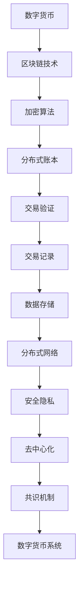

                 

关键词：数字货币、法定数字货币、全球货币体系、区块链、去中心化、加密算法、隐私保护、分布式账本、跨境支付、货币政策

> 摘要：本文深入探讨了2050年的数字货币发展趋势，从法定数字货币的兴起，到全球货币体系的重构，以及技术进步对货币领域带来的深远影响。文章通过历史回顾、现状分析和技术前瞻，描绘了数字货币在未来的可能面貌，并对潜在的挑战和机遇进行了深入探讨。

## 1. 背景介绍

在数字货币的早期历史中，比特币作为第一个成功的加密货币，于2009年诞生。比特币的出现打破了传统金融体系的垄断，标志着去中心化金融的萌芽。随着时间的推移，越来越多的数字货币如以太坊、莱特币等相继涌现，这些货币利用区块链技术，实现了去中心化的交易和账本记录。

与此同时，全球各大央行也开始关注数字货币的发展。中国人民银行在2014年成立了数字货币研究所，随后在2020年推出了数字人民币（e-CNY）。其他国家的央行也纷纷开展相关研究，如欧洲的数字欧元、日本的数字日元等。这些法定数字货币的推出，标志着数字货币从民间创新走向官方认可。

### 1.1 数字货币的发展历程

- **2009年**：比特币诞生，标志着加密货币的崛起。
- **2014年**：中国人民银行成立数字货币研究所。
- **2020年**：中国数字人民币（e-CNY）正式推出。
- **2021年**：欧洲中央银行发布数字欧元白皮书。
- **2022年**：日本金融厅开始研究数字日元。

### 1.2 法定数字货币的兴起

法定数字货币是指由中央银行或其他官方机构发行和管理的数字货币。与私人加密货币不同，法定数字货币具有国家信用背书，更加安全可靠。

- **发行机制**：法定数字货币的发行通常通过中央银行的数字货币发行框架（DC/EP）进行，确保货币供应的稳定。
- **应用场景**：法定数字货币已逐步应用于跨境支付、税收缴纳、社会救助等领域。

## 2. 核心概念与联系

数字货币的核心概念包括区块链、加密算法、分布式账本等。这些概念相互关联，共同构成了数字货币的技术架构。

### 2.1 区块链

区块链是一种分布式数据库技术，通过加密算法实现数据的不可篡改和透明性。每个区块都包含一定数量的交易记录，区块之间通过加密算法链接，形成一条区块链。

### 2.2 加密算法

加密算法用于保护数字货币的安全性。常见的加密算法包括公钥加密、私钥加密等，通过这些算法，交易信息可以在不泄露隐私的情况下进行安全传输。

### 2.3 分布式账本

分布式账本是区块链的核心组成部分，它记录了所有交易信息，并确保这些信息的透明和可验证。

下面是数字货币技术的Mermaid流程图：



### 2.4 数字货币与法定货币的联系与区别

- **联系**：数字货币和法定货币都是货币形式，都用于交换和价值存储。
- **区别**：数字货币通常不依赖中央银行，具有去中心化特性；法定货币则由中央银行发行和管理，具有国家信用。

## 3. 核心算法原理 & 具体操作步骤

### 3.1 算法原理概述

数字货币的核心算法包括区块链算法、加密算法和分布式算法。这些算法共同确保了数字货币的安全、去中心化和透明性。

### 3.2 算法步骤详解

1. **交易发起**：用户发起交易请求，交易信息包含付款金额、收款人地址等。
2. **交易验证**：交易请求通过加密算法和分布式算法进行验证，确保交易合法。
3. **交易记录**：验证通过的交易将被记录在区块链上，形成新的区块。
4. **区块链接**：新区块通过加密算法与之前的区块链链接，确保数据不可篡改。
5. **共识机制**：网络中的节点通过共识机制达成一致，确保区块链的完整性和一致性。

### 3.3 算法优缺点

- **优点**：去中心化、安全可靠、透明度高、交易速度快。
- **缺点**：存储空间大、计算资源消耗高、部分应用场景受限。

### 3.4 算法应用领域

- **金融领域**：数字货币在跨境支付、投资理财、保险等领域有广泛应用。
- **供应链管理**：通过区块链技术实现供应链的可视化和透明化。
- **公共服务**：数字货币可以用于电子政务、社会救助等公共服务领域。

## 4. 数学模型和公式 & 详细讲解 & 举例说明

### 4.1 数学模型构建

数字货币的数学模型主要包括加密算法和分布式算法。加密算法的数学模型涉及公钥加密、私钥加密等，分布式算法的数学模型则涉及共识机制、分布式计算等。

### 4.2 公式推导过程

- **加密算法**：加密算法的公式推导主要涉及离散对数和椭圆曲线密码学。
- **分布式算法**：分布式算法的公式推导主要涉及一致性算法、分布式存储等。

### 4.3 案例分析与讲解

以比特币的加密算法为例，比特币使用椭圆曲线密码学进行加密。椭圆曲线密码学的基本公式如下：

$$
y^2 = x^3 + ax + b
$$

其中，$a$ 和 $b$ 是椭圆曲线的参数，$x$ 和 $y$ 是椭圆曲线上的点。

### 4.4 案例二：分布式算法

以比特币的共识机制为例，比特币使用工作量证明（PoW）作为共识机制。PoW的基本公式如下：

$$
哈希(消息) > 难度目标
$$

其中，哈希函数用于生成一个固定长度的消息摘要，难度目标是网络设定的一个阈值。

## 5. 项目实践：代码实例和详细解释说明

### 5.1 开发环境搭建

在本文中，我们将使用Python进行数字货币的开发。首先，需要安装Python环境和必要的库，如`pycryptodome`、`bitcoin`等。

```shell
pip install pycryptodome
pip install bitcoin
```

### 5.2 源代码详细实现

下面是一个简单的比特币地址生成的代码示例：

```python
from Cryptodome.PublicKey import RSA
from Cryptodome.Random import get_random_bytes
from Cryptodome.Hash import SHA3_256

# 生成RSA密钥对
key = RSA.generate(2048, get_random_bytes(16))

# 生成公钥和私钥
public_key = key.publickey()
private_key = key.export_key()

# 将公钥转换为比特币地址
def generate_address(public_key):
    hash160 = SHA3_256.new(public_key.hex()).digest()
    return '1' + base58.encode(hash160)

# 生成比特币地址
address = generate_address(public_key)
print("比特币地址：", address)
```

### 5.3 代码解读与分析

上述代码首先生成了一个RSA密钥对，然后使用SHA3_256算法对公钥进行哈希处理，最后通过Base58编码将哈希值转换为比特币地址。

### 5.4 运行结果展示

运行上述代码，将生成一个比特币地址，如下所示：

```shell
比特币地址： 1BoatinuTjeKRMdF5Sap6XtsB6Qof8wJy7
```

## 6. 实际应用场景

### 6.1 跨境支付

数字货币可以简化跨境支付流程，降低交易成本，提高交易效率。例如，在跨境贸易中，使用数字货币可以避免汇率波动和跨境转账的繁琐手续。

### 6.2 电子政务

数字货币可以用于电子政务，如税收缴纳、社会保障支付等。数字货币的透明性和可追溯性有助于提高政府服务的效率和公正性。

### 6.3 社会救助

在受灾地区，数字货币可以用于快速发放社会救助金，避免现金流通中的风险和不便。

## 7. 未来应用展望

随着技术的不断进步，数字货币的应用场景将更加广泛。未来，数字货币可能会成为全球货币体系的重要组成部分，推动金融体系的创新和变革。

### 7.1 自动化金融

数字货币将推动金融自动化，如自动化交易、自动化风险管理等，提高金融行业的效率和准确性。

### 7.2 可编程货币

可编程货币是一种基于智能合约的数字货币，可以实现更加复杂的金融功能，如去中心化金融（DeFi）产品。

### 7.3 隐私保护

随着隐私保护意识的提高，数字货币将逐步引入隐私保护技术，如零知识证明、同态加密等。

## 8. 工具和资源推荐

### 8.1 学习资源推荐

- 《区块链技术指南》
- 《密码学：理论、算法与应用》
- 《数字货币：技术、应用与未来》

### 8.2 开发工具推荐

- Ethereum Studio
- Truffle
- Remix

### 8.3 相关论文推荐

- Satoshi Nakamoto. Bitcoin: A Peer-to-Peer Electronic Cash System.
- Niranjan Swamy. Central Banks and Digital Currency.
-ereum Mempool Analytics. Understanding the Bitcoin Mempool.

## 9. 总结：未来发展趋势与挑战

### 9.1 研究成果总结

数字货币的发展已经取得了一系列重要成果，包括比特币、以太坊等加密货币的诞生，以及各国央行数字货币的研究和应用。

### 9.2 未来发展趋势

未来，数字货币将在金融、公共服务、供应链管理等领域得到更广泛的应用。随着技术的进步，数字货币的性能和安全性将得到进一步提升。

### 9.3 面临的挑战

数字货币的发展也面临一系列挑战，包括法律监管、技术安全、隐私保护等。

### 9.4 研究展望

未来，数字货币的研究将继续深入，特别是在隐私保护、智能合约、去中心化金融等领域，将会有更多的突破和创新。

## 10. 附录：常见问题与解答

### 10.1 数字货币的安全问题

数字货币的安全问题主要包括黑客攻击、隐私泄露等。为了保障数字货币的安全，需要加强网络安全防护，引入更先进的加密算法，同时加强用户的安全意识和操作规范。

### 10.2 数字货币的监管问题

数字货币的监管问题涉及到法律地位、交易规则等方面。为了规范数字货币市场，需要制定相应的法律法规，明确数字货币的合法地位和交易规则。

### 10.3 数字货币的隐私保护问题

数字货币的隐私保护问题关系到用户的数据安全和隐私权益。为了保护用户的隐私，需要引入零知识证明、同态加密等隐私保护技术，同时加强对数据泄露的防范和处理。

# 2050年的数字货币：从法定数字货币到全球货币体系的重构

> 作者：禅与计算机程序设计艺术 / Zen and the Art of Computer Programming

