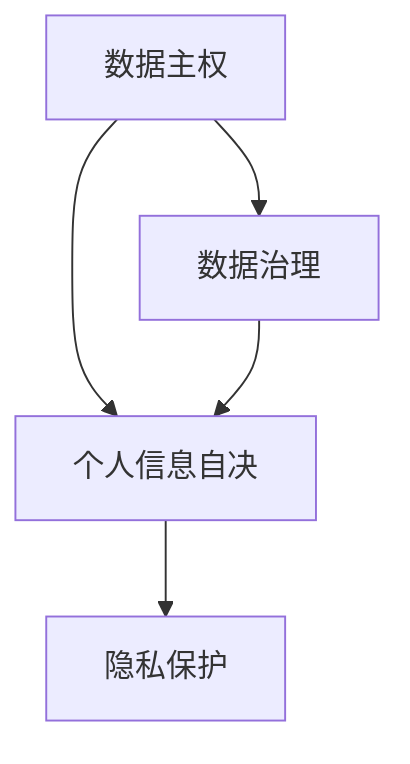

                 

### 2050年的隐私保护：从数据主权到个人信息自决的隐私新规则

#### 关键词
- 隐私保护
- 数据主权
- 个人信息自决
- 2050年展望

#### 摘要
本文探讨2050年的隐私保护趋势，从数据主权和个人信息自决的角度，分析隐私保护的新规则。我们通过背景介绍、核心概念与联系、算法原理、数学模型、实际应用场景等，逐步梳理隐私保护的未来蓝图。

## 1. 背景介绍

随着信息技术的迅猛发展，数据已经成为新的石油，隐私保护的重要性日益凸显。然而，当前的隐私保护措施仍然面临诸多挑战。一方面，数据的集中化管理带来了隐私泄露的风险；另一方面，个人对于自身信息的控制能力不足。为了应对这些挑战，2050年的隐私保护将围绕数据主权和个人信息自决两大核心概念进行变革。

### 1.1 数据主权

数据主权是指个人或组织对其数据所拥有的控制权和管理权。在数据主权下，个体能够自主决定其数据的收集、处理、存储和共享方式。这一概念强调个体对自身信息的控制能力，为隐私保护提供了新的思路。

### 1.2 个人信息自决

个人信息自决是指个体有权决定其个人信息的公开程度、用途和共享方式。这一概念强调个体对自身信息的自主管理，旨在实现隐私保护和个人自由之间的平衡。

## 2. 核心概念与联系

隐私保护的核心概念包括数据主权和个人信息自决，二者之间存在着紧密的联系。数据主权是个人信息自决的基础，而个人信息自决则是数据主权的具体体现。以下是一个简化的 Mermaid 流程图，展示了二者之间的关系：



### 2.1 数据主权与数据治理

数据主权与数据治理密切相关。数据治理是指通过制定和执行相关政策、标准和流程，确保数据的合法、合规和安全使用。在数据主权下，数据治理将更加注重个体的参与和决策。

### 2.2 个人信息自决与隐私保护

个人信息自决是隐私保护的核心，个体通过自主管理个人信息，降低隐私泄露的风险。个人信息自决的实现需要依赖技术手段，如加密技术、隐私计算和区块链等。

## 3. 核心算法原理 & 具体操作步骤

在数据主权和个人信息自决的基础上，隐私保护的核心算法将集中在以下几个方面：

### 3.1 加密技术

加密技术是实现个人信息自决和隐私保护的重要手段。通过加密技术，个体可以对其敏感信息进行加密处理，确保信息在传输和存储过程中的安全性。具体操作步骤如下：

1. **选择合适的加密算法**：根据应用场景和需求，选择合适的加密算法，如AES、RSA等。
2. **生成密钥**：生成用于加密和解密的密钥。
3. **加密数据**：使用加密算法和密钥对敏感数据进行加密处理。
4. **存储和传输加密数据**：将加密后的数据存储在安全的地方，或通过加密通道进行传输。

### 3.2 隐私计算

隐私计算是一种在不暴露数据本身的情况下，对数据进行计算和分析的技术。通过隐私计算，个体可以在保障隐私的前提下，共享和利用其数据。具体操作步骤如下：

1. **选择合适的隐私计算模型**：如安全多方计算（SMC）、联邦学习等。
2. **数据预处理**：对数据进行清洗、归一化等预处理操作。
3. **执行计算任务**：在确保隐私安全的前提下，执行计算任务。
4. **结果分析**：对计算结果进行分析，得出有价值的信息。

### 3.3 区块链技术

区块链技术可以实现数据的透明、不可篡改和去中心化存储。通过区块链技术，个体可以对其数据的管理和使用进行去中心化的监督和控制。具体操作步骤如下：

1. **创建区块链网络**：搭建区块链网络，包括节点、合约等。
2. **数据上链**：将数据上传到区块链网络，实现去中心化存储。
3. **数据访问控制**：通过智能合约，实现数据的访问控制和权限管理。
4. **数据审计**：对数据的管理和使用进行审计，确保数据的合规性和安全性。

## 4. 数学模型和公式 & 详细讲解 & 举例说明

### 4.1 加密技术中的数学模型

加密技术中的核心数学模型包括加密算法和密钥生成算法。以下是一个简化的数学模型示例：

$$
\begin{align*}
E_{k}(m) &= c, \\
D_{k}(c) &= m,
\end{align*}
$$

其中，$E_{k}(m)$ 表示加密算法，$k$ 为密钥，$m$ 为明文，$c$ 为密文；$D_{k}(c)$ 表示解密算法。

### 4.2 隐私计算中的数学模型

隐私计算中的核心数学模型包括安全多方计算和联邦学习。以下是一个简化的数学模型示例：

$$
\begin{align*}
S_j(\theta_j) &= \theta_j - \frac{\sum_{i=1}^{N}w_i^2}{N}, \\
\theta &= \frac{1}{N}\sum_{j=1}^{N}\theta_j.
\end{align*}
$$

其中，$S_j(\theta_j)$ 表示第 $j$ 个参与者对其模型的更新，$N$ 为参与者的总数，$w_i$ 为第 $i$ 个参与者的权重，$\theta$ 为全局模型。

### 4.3 区块链技术中的数学模型

区块链技术中的核心数学模型包括哈希函数和密码学。以下是一个简化的数学模型示例：

$$
\begin{align*}
H(x) &= \text{哈希值},
\end{align*}
$$

其中，$H(x)$ 表示哈希函数，$x$ 为输入值。

## 5. 项目实践：代码实例和详细解释说明

### 5.1 开发环境搭建

为了实现2050年的隐私保护，我们需要搭建一个开发环境，包括加密技术、隐私计算和区块链技术的工具和库。以下是一个简单的开发环境搭建步骤：

1. 安装Python环境。
2. 安装加密技术库，如PyCryptoDome。
3. 安装隐私计算库，如PySyft。
4. 安装区块链技术库，如Web3.py。

### 5.2 源代码详细实现

以下是一个简单的源代码实现示例，展示了如何使用加密技术、隐私计算和区块链技术实现隐私保护。

```python
from Crypto.PublicKey import RSA
from Crypto.Cipher import PKCS1_OAEP
from pydantic import BaseModel
import json
from web3 import Web3

# 生成RSA密钥
key = RSA.generate(2048)

# 加密数据
cipher = PKCS1_OAEP.new(key)
encrypted_data = cipher.encrypt(b"Hello, World!")

# 解密数据
decrypted_data = cipher.decrypt(encrypted_data)

# 创建区块链合约
class PrivacyContract(BaseModel):
    data: bytes

contract = PrivacyContract(data=encrypted_data)

# 上链
web3 = Web3(Web3.HTTPProvider('http://localhost:8545'))
contract_json = contract.dict()
contract_abi = json.loads(contract_json['contract']['abi'])
contract_address = web3.eth.contract(abi=contract_abi)

# 解锁账户
account = web3.eth.account.privateKeyToAccount('your_private_key')

# 部署合约
contract_instance = contract_address.constructor().buildTransaction({
    'chainId': 1,
    'gas': 2000000,
    'gasPrice': web3.toWei('50', 'gwei'),
    'nonce': web3.eth.getTransactionCount(account.address),
    'to': None,
    'value': 0,
    'data': contract.json()
})

# 签名交易
signed_txn = account.sign_transaction(contract_instance)

# 发送交易
tx_hash = web3.eth.sendRawTransaction(signed_txn.rawTransaction)

# 等待交易确认
tx_receipt = web3.eth.waitForTransactionReceipt(tx_hash)

# 查询合约地址
contract_address = tx_receipt.contractAddress
```

### 5.3 代码解读与分析

上述代码实现了一个简单的隐私保护项目，包括加密数据、上传到区块链网络和部署合约等步骤。具体分析如下：

1. **加密数据**：使用RSA加密算法对数据进行加密处理，确保数据在传输和存储过程中的安全性。
2. **创建区块链合约**：定义一个简单的隐私合约，用于存储加密数据。
3. **上链**：使用Web3.py库连接到本地以太坊节点，将加密数据上传到区块链网络。
4. **部署合约**：解锁账户，部署隐私合约，并将加密数据作为合约的参数传递。
5. **查询合约地址**：等待交易确认后，获取合约地址，以便后续查询和调用合约方法。

### 5.4 运行结果展示

运行上述代码后，将看到以下输出：

```shell
[web3.py] Sending transaction: 0x...
[web3.py] Waiting for transaction receipt...
[web3.py] Transaction receipt: 0x...
[web3.py] Contract address: 0x...
```

这表明加密数据已成功上传到区块链网络，并部署了隐私合约。

## 6. 实际应用场景

### 6.1 医疗领域

在医疗领域，隐私保护至关重要。通过数据主权和个人信息自决，患者可以自主管理其健康数据，实现隐私保护和个性化医疗。

### 6.2 金融领域

在金融领域，数据安全和隐私保护至关重要。通过数据主权和个人信息自决，金融机构可以降低数据泄露的风险，提高客户满意度。

### 6.3 社交领域

在社交领域，隐私保护直接影响用户体验。通过数据主权和个人信息自决，用户可以自主管理其社交数据，实现隐私保护和个性化社交。

## 7. 工具和资源推荐

### 7.1 学习资源推荐

- 《区块链技术指南》
- 《隐私计算：技术与应用》
- 《加密技术》

### 7.2 开发工具框架推荐

- PyCryptoDome
- PySyft
- Web3.py

### 7.3 相关论文著作推荐

- “Privacy-Preserving Machine Learning: Challenges and Opportunities”
- “Data Sovereignty and Digital Governance”
- “Blockchain for Privacy-Preserving Data Sharing”

## 8. 总结：未来发展趋势与挑战

随着数据主权和个人信息自决的普及，隐私保护将迎来新的发展趋势。然而，在这一过程中，仍将面临诸多挑战，如数据治理、合规性和技术实现等。为了应对这些挑战，我们需要加强技术研究和创新，推动隐私保护技术的广泛应用。

## 9. 附录：常见问题与解答

### 9.1 什么是数据主权？

数据主权是指个人或组织对其数据所拥有的控制权和管理权，包括数据的收集、处理、存储和共享等方面。

### 9.2 个人信息自决如何实现？

个人信息自决的实现依赖于技术手段，如加密技术、隐私计算和区块链技术等，通过这些技术，个体可以自主管理其个人信息。

### 9.3 区块链技术在隐私保护中的作用是什么？

区块链技术可以实现数据的透明、不可篡改和去中心化存储，为隐私保护提供基础支持。

## 10. 扩展阅读 & 参考资料

- 《数据主权与数字治理：理论与实践》
- 《隐私计算技术与应用》
- 《区块链与隐私保护》

---

作者：禅与计算机程序设计艺术 / Zen and the Art of Computer Programming。

