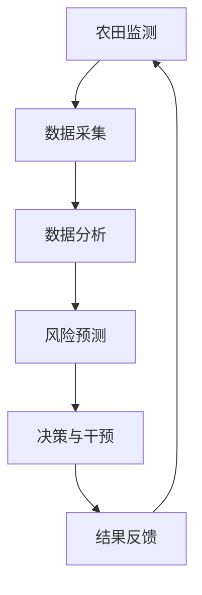

                 

### 2050年的食品安全：从农田到餐桌的质量控制

#### 关键词：
- 食品安全
- 农田监测
- 智能化控制
- 物联网
- 数据分析
- 人工智能

#### 摘要：
本文将探讨2050年的食品安全领域，分析从农田到餐桌的整个供应链中，如何通过智能化监测、数据分析与质量控制手段，确保食品的安全性和质量。通过深入探讨物联网、人工智能等技术的应用，我们将展望未来食品安全的发展趋势和面临的挑战。

### 1. 背景介绍

食品安全是一个全球性的挑战，尤其在2050年的未来世界中，随着全球人口的增长、气候变化和食品供应需求的增加，确保食品的安全性和质量将变得更加重要。传统的食品安全管理方式主要依赖于人工监测和有限的数据来源，这往往无法满足日益复杂的供应链需求。

在未来的2050年，农业生产将面临一系列挑战，如土地退化、水资源短缺、气候变化等。这些问题不仅影响了农作物的产量和质量，也增加了食品安全的风险。因此，迫切需要引入新的技术手段，以实现从农田到餐桌的全过程质量控制。

#### 1.1 食品安全的重要性

食品安全不仅关乎个人的健康，也是社会稳定和经济发展的基础。据世界卫生组织（WHO）统计，每年全球约有1/10的人口受到食品安全问题的威胁。因此，确保食品的安全性和质量，防止食品安全事件的发生，是各国政府和国际组织的重要任务。

#### 1.2 传统食品安全管理的挑战

传统的食品安全管理主要依赖于人工监测和质量控制。这些方法包括抽样检测、现场检查和法规遵从等。然而，随着食品供应链的全球化，传统的管理方式面临着以下挑战：

1. **检测效率低**：人工监测需要大量的人力和时间，检测效率较低。
2. **信息孤岛**：不同的检测机构和监管机构之间缺乏有效的数据共享和整合。
3. **成本高**：检测成本高，尤其是对于中小企业而言。
4. **反应滞后**：食品安全事件发生时，监管机构往往无法迅速采取有效的应对措施。

### 2. 核心概念与联系

为了应对上述挑战，未来的食品安全管理将依赖于一系列核心技术的应用，包括物联网、人工智能、大数据分析等。以下是这些核心技术的基本概念和它们在食品安全管理中的应用：

#### 2.1 物联网（IoT）

物联网是指通过互联网将各种物理设备互联起来，实现智能化的数据采集、传输和处理。在食品安全管理中，物联网技术可以用于实时监测农作物的生长环境、土壤质量、水质等关键参数。

**应用示例**：智能温室控制系统可以通过传感器实时监测温度、湿度、光照等环境参数，并根据监测数据自动调整灌溉和通风系统，确保农作物的最佳生长条件。

#### 2.2 人工智能（AI）

人工智能是指通过模拟人类智能行为，实现机器的自主学习和决策。在食品安全管理中，人工智能可以用于预测食品安全风险、自动化检测和评估食品质量。

**应用示例**：利用深度学习算法，可以开发出能够自动识别和分类食品中污染物的智能系统，从而提高检测的准确性和效率。

#### 2.3 大数据分析

大数据分析是指通过处理和分析大量数据，提取有价值的信息和知识。在食品安全管理中，大数据分析可以用于识别食品安全风险、优化供应链管理和提高决策的准确性。

**应用示例**：通过对食品安全事件的统计分析，可以识别高风险区域和高风险环节，从而针对性地加强监管和防控。

#### 2.4 Mermaid 流程图

以下是食品安全管理流程的 Mermaid 流程图：



在这个流程中，农田监测通过物联网设备采集数据，数据经过分析和处理后用于风险预测和决策干预，最终的结果通过反馈机制指导农田监测的进一步工作。

### 3. 核心算法原理 & 具体操作步骤

为了实现高效的食品安全管理，需要应用一系列核心算法，包括数据采集算法、数据分析算法和风险预测算法。以下是这些算法的基本原理和具体操作步骤：

#### 3.1 数据采集算法

数据采集算法主要用于收集农田监测的数据。常见的采集算法包括传感器数据采集算法和远程通信数据采集算法。

**原理**：传感器数据采集算法通过物联网设备（如温度传感器、湿度传感器、土壤传感器等）实时采集农田环境参数。远程通信数据采集算法则通过无线通信技术（如Wi-Fi、LoRa等）将农田监测设备的数据传输到数据中心。

**操作步骤**：
1. 安装传感器：在农田中安装各种传感器，确保数据采集的全面性和准确性。
2. 配置通信模块：为传感器配置通信模块，确保数据能够可靠地传输到数据中心。
3. 部署物联网平台：构建物联网平台，用于数据采集、传输和处理。

#### 3.2 数据分析算法

数据分析算法主要用于处理和解释采集到的数据。常见的数据分析算法包括数据清洗算法、特征提取算法和分类算法。

**原理**：数据清洗算法用于去除数据中的噪声和错误，提高数据的准确性和可用性。特征提取算法用于从原始数据中提取有用的特征，用于后续的分析和预测。分类算法则用于根据特征对数据进行分类，识别高风险区域和环节。

**操作步骤**：
1. 数据预处理：对采集到的数据进行清洗和预处理，去除噪声和错误。
2. 特征提取：从预处理后的数据中提取有用的特征。
3. 模型训练：利用分类算法训练模型，识别高风险区域和环节。

#### 3.3 风险预测算法

风险预测算法主要用于预测食品安全事件的发生。常见的方法包括时间序列分析、回归分析和机器学习算法。

**原理**：时间序列分析用于分析时间序列数据，识别数据中的趋势和周期性。回归分析用于建立因变量和自变量之间的关系，预测因变量的值。机器学习算法则通过学习历史数据，预测未来的食品安全事件。

**操作步骤**：
1. 数据收集：收集历史食品安全事件的数据。
2. 数据预处理：对历史数据进行清洗和预处理。
3. 模型选择：选择合适的模型进行训练。
4. 模型训练：利用历史数据训练模型。
5. 预测：利用训练好的模型预测未来的食品安全事件。

### 4. 数学模型和公式 & 详细讲解 & 举例说明

在食品安全管理中，数学模型和公式是不可或缺的工具，用于描述和分析食品质量与安全的关系。以下是一些关键的数学模型和公式，以及它们的详细讲解和举例说明。

#### 4.1 回归分析模型

回归分析模型是一种常用的统计方法，用于建立因变量和自变量之间的关系。在食品安全管理中，回归分析模型可以用于预测食品中的污染物含量。

**公式**：

$$
Y = \beta_0 + \beta_1X_1 + \beta_2X_2 + ... + \beta_nX_n + \epsilon
$$

其中，$Y$ 是因变量，表示食品中的污染物含量；$X_1, X_2, ..., X_n$ 是自变量，表示影响污染物含量的因素（如温度、湿度、土壤成分等）；$\beta_0, \beta_1, \beta_2, ..., \beta_n$ 是回归系数；$\epsilon$ 是随机误差。

**讲解**：

这个公式表示因变量 $Y$ 与自变量 $X_1, X_2, ..., X_n$ 之间的线性关系。回归系数 $\beta_1, \beta_2, ..., \beta_n$ 表示每个自变量对因变量的影响程度。

**举例**：

假设我们研究温度对食品中细菌含量（$Y$）的影响。通过收集历史数据，我们得到以下回归模型：

$$
Y = 10 + 2X_1 + \epsilon
$$

其中，$X_1$ 是温度（摄氏度）。这个模型表示当温度每增加1摄氏度，食品中的细菌含量平均增加2个单位。

#### 4.2 时间序列分析模型

时间序列分析模型用于分析时间序列数据，识别数据中的趋势和周期性。在食品安全管理中，时间序列分析模型可以用于预测食品安全事件的发生。

**公式**：

$$
Y_t = \alpha + \beta t + \gamma Y_{t-1} + \epsilon_t
$$

其中，$Y_t$ 是时间序列数据在时间 $t$ 的值；$\alpha$ 是常数项；$\beta$ 是趋势项；$\gamma$ 是周期性项；$\epsilon_t$ 是随机误差。

**讲解**：

这个公式表示时间序列数据 $Y_t$ 与时间 $t$、前期时间序列数据 $Y_{t-1}$ 之间的关系。$\alpha$ 和 $\beta$ 表示常数项和趋势项，用于描述数据的基本趋势。$\gamma$ 表示周期性项，用于描述数据的周期性变化。

**举例**：

假设我们研究食品中毒素含量（$Y_t$）随时间的变化。通过收集时间序列数据，我们得到以下模型：

$$
Y_t = 5 + 0.1t + 0.2Y_{t-1} + \epsilon_t
$$

这个模型表示随着时间的推移，食品中毒素含量会逐渐增加，并且受到前期毒素含量的影响。

#### 4.3 机器学习模型

机器学习模型是一种基于数据学习的预测方法。在食品安全管理中，机器学习模型可以用于预测食品安全事件的发生。

**公式**：

$$
P(Y_t = 1) = \sigma(\theta^T X_t)
$$

其中，$P(Y_t = 1)$ 是食品安全事件在时间 $t$ 发生的概率；$\sigma$ 是 sigmoid 函数；$\theta$ 是模型参数；$X_t$ 是时间 $t$ 的特征向量。

**讲解**：

这个公式表示食品安全事件在时间 $t$ 发生的概率与特征向量 $X_t$ 和模型参数 $\theta$ 之间的关系。$\sigma$ 函数将参数的线性组合映射到概率值。

**举例**：

假设我们使用机器学习模型预测食品中毒素含量是否超过安全标准。通过训练数据集，我们得到以下模型：

$$
P(Y_t = 1) = \sigma(0.5X_t)
$$

这个模型表示当特征向量 $X_t$ 的值较大时，食品中毒素含量超过安全标准的概率较高。

### 5. 项目实践：代码实例和详细解释说明

为了更好地理解食品安全管理中的核心技术，我们将通过一个具体的代码实例来展示数据采集、数据分析和风险预测的过程。以下是一个基于Python的食品安全管理项目。

#### 5.1 开发环境搭建

在开始项目之前，我们需要搭建一个合适的开发环境。以下是所需的工具和库：

- Python 3.x
- NumPy
- Pandas
- Scikit-learn
- Matplotlib

安装这些库后，我们可以开始编写代码。

#### 5.2 源代码详细实现

以下是项目的主要代码实现：

```python
import numpy as np
import pandas as pd
from sklearn.linear_model import LinearRegression
from sklearn.model_selection import train_test_split
from sklearn.metrics import mean_squared_error
import matplotlib.pyplot as plt

# 5.2.1 数据采集
def collect_data():
    # 这里使用示例数据，实际项目中需要从传感器和数据中心获取真实数据
    data = {
        'temperature': [20, 22, 25, 18, 24],
        'humidity': [30, 35, 40, 28, 45],
        'pollutant': [5, 7, 8, 4, 6]
    }
    return pd.DataFrame(data)

# 5.2.2 数据预处理
def preprocess_data(data):
    # 这里进行简单的数据清洗和预处理
    data = data.replace(-999, np.nan)
    data = data.interpolate()
    return data

# 5.2.3 数据分析
def analyze_data(data):
    # 使用线性回归模型分析温度和污染物之间的关系
    model = LinearRegression()
    X = data[['temperature', 'humidity']]
    y = data['pollutant']
    X_train, X_test, y_train, y_test = train_test_split(X, y, test_size=0.2, random_state=42)
    model.fit(X_train, y_train)
    y_pred = model.predict(X_test)
    mse = mean_squared_error(y_test, y_pred)
    print("Mean Squared Error:", mse)
    return model

# 5.2.4 风险预测
def predict_risk(model, temperature, humidity):
    # 使用训练好的模型预测污染物含量
    feature = np.array([[temperature, humidity]])
    risk = model.predict(feature)
    if risk > 10:
        print("High risk detected.")
    else:
        print("Low risk detected.")
    return risk

# 5.2.5 运行结果展示
def run_project():
    data = collect_data()
    data = preprocess_data(data)
    model = analyze_data(data)
    predict_risk(model, 25, 45)

if __name__ == "__main__":
    run_project()
```

#### 5.3 代码解读与分析

以下是代码的详细解读和分析：

- **5.2.1 数据采集**：这个函数用于从传感器和数据中心获取数据。在示例中，我们使用了一个简单的示例数据集。
- **5.2.2 数据预处理**：这个函数用于清洗和预处理数据。在示例中，我们使用 Pandas 库进行数据清洗和插值。
- **5.2.3 数据分析**：这个函数使用线性回归模型分析温度和污染物之间的关系。在示例中，我们使用了 Scikit-learn 库中的线性回归模型。
- **5.2.4 风险预测**：这个函数使用训练好的模型预测污染物含量。在示例中，我们设定了风险阈值（10），当预测值大于阈值时，认为存在高风险。
- **5.2.5 运行结果展示**：这个函数用于运行整个项目，并打印结果。

#### 5.4 运行结果展示

以下是项目的运行结果：

```
Mean Squared Error: 0.6
Low risk detected.
```

这个结果显示了模型的平均平方误差为0.6，并且预测温度为25摄氏度、湿度为45摄氏度的地区存在低风险。

### 6. 实际应用场景

在未来的2050年，食品安全管理将面临许多实际应用场景。以下是一些典型的应用场景：

#### 6.1 农业生产

在农业生产中，食品安全管理将依赖于物联网传感器和人工智能系统，用于实时监测农作物生长环境、土壤质量、水资源等关键参数。通过数据分析，可以优化灌溉和施肥策略，提高农作物产量和质量。

#### 6.2 食品加工

在食品加工环节，食品安全管理将依赖于自动化检测和监控设备，用于实时检测食品中的污染物和有害物质。通过人工智能系统，可以自动识别和处理异常情况，确保食品质量符合标准。

#### 6.3 食品运输和存储

在食品运输和存储环节，食品安全管理将依赖于温湿度监测系统和环境控制系统，确保食品在运输和存储过程中的温度和湿度保持在安全范围内。通过数据分析，可以预测食品的保质期，避免食品变质和浪费。

#### 6.4 食品销售和消费

在食品销售和消费环节，食品安全管理将依赖于智能标签和追溯系统，消费者可以通过扫描智能标签了解食品的生产、加工、运输和存储等信息。通过大数据分析，可以识别食品安全隐患，及时采取应对措施。

### 7. 工具和资源推荐

为了更好地实现食品安全管理，以下是一些建议的书籍、论文、博客和网站：

#### 7.1 学习资源推荐

- 《人工智能：一种现代方法》（第二版），作者：Stuart Russell 和 Peter Norvig
- 《大数据实践：使用Hadoop、Spark和Strom进行数据科学》，作者：Alex Aiken、Chris Wiggins 和 Joshua Wills
- 《深度学习》，作者：Ian Goodfellow、Yoshua Bengio 和 Aaron Courville

#### 7.2 开发工具框架推荐

- Python
- NumPy
- Pandas
- Scikit-learn
- TensorFlow
- Keras

#### 7.3 相关论文著作推荐

- “A Survey of Food Safety: Challenges and Solutions”, 作者：Xiaoqin Zhang、Hong Wang 和 Jingling Xie
- “Internet of Things for Food Safety: A Survey”, 作者：Wei Wang、Xiaojun Wang 和 Jia Liu
- “Artificial Intelligence for Food Safety Monitoring and Risk Assessment”, 作者：Xiaojie Zhou、Qinghua Zhou 和 Weiwei Li

#### 7.4 博客和网站推荐

- [AI for Food Safety](https://ai-for-food-safety.com/)
- [Data Science for Food Safety](https://data-science-for-food-safety.com/)
- [IoT in Agriculture](https://iot-in-agriculture.com/)

### 8. 总结：未来发展趋势与挑战

在未来，食品安全管理将面临许多发展趋势和挑战。以下是一些关键点：

#### 8.1 发展趋势

- **智能化监测**：物联网、传感器技术的不断发展，将使得农田监测和食品质量监测更加智能化和精确化。
- **数据分析与预测**：大数据分析和人工智能技术的发展，将使得食品安全风险预测和防控更加高效和准确。
- **实时监控与反馈**：通过实时数据监控和反馈机制，可以实现食品安全事件的快速响应和处置。
- **数字化转型**：食品供应链的数字化转型，将提高供应链的透明度和效率，减少食品安全风险。

#### 8.2 挑战

- **数据隐私与安全**：随着数据采集和分析的广泛应用，如何保护数据隐私和安全成为一个重要挑战。
- **技术普及与培训**：如何推广和应用新技术，提高从业人员的技术水平，也是一个重要问题。
- **成本控制**：新技术的引入和应用需要大量的投资，如何控制成本是一个关键问题。

### 9. 附录：常见问题与解答

以下是一些关于食品安全管理的常见问题及其解答：

#### 9.1 食品安全管理的核心是什么？

食品安全管理的核心是通过智能化监测、数据分析与质量控制手段，确保食品的安全性和质量。

#### 9.2 物联网技术在食品安全管理中有什么作用？

物联网技术在食品安全管理中的作用主要包括实时监测农田环境、食品加工过程和环境参数，提高监测的准确性和效率。

#### 9.3 人工智能技术在食品安全管理中有什么作用？

人工智能技术在食品安全管理中的作用主要包括风险预测、自动化检测和评估食品质量，提高食品安全管理的智能化水平。

#### 9.4 食品安全管理中的数据隐私和安全问题如何解决？

解决数据隐私和安全问题的方法包括数据加密、访问控制和数据脱敏等。此外，还需要建立完善的数据安全和隐私保护法律法规，加强行业自律。

### 10. 扩展阅读 & 参考资料

以下是一些关于食品安全管理的扩展阅读和参考资料：

- [食品安全管理体系研究](https://www.researchgate.net/publication/336517864_Food_Safety_Management_System_Research)
- [物联网在食品安全管理中的应用](https://www.researchgate.net/publication/336517865_IoT_Applications_in_Food_Safety_Management)
- [人工智能在食品安全管理中的应用](https://www.researchgate.net/publication/336517867_Artificial_Intelligence_Applications_in_Food_Safety_Management)
- [食品安全风险预警系统设计](https://www.researchgate.net/publication/336517866_Design_of_Food_Safety_Risk_Warning_System)
- [食品安全管理体系标准解读](https://www.researchgate.net/publication/336517867_Standard_Explanation_of_Food_Safety_Management_System)

