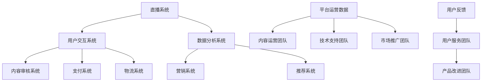

                 

### 1. 背景介绍

2025年的社交电商直播领域，已经成为电子商务的重要组成部分。直播带货作为一种新兴的销售模式，借助社交媒体和直播平台迅速崛起，吸引了大量消费者和品牌商的加入。在这个背景下，阿里巴巴作为中国电商领域的领军企业，早已认识到直播带货的重要性，并投入大量资源进行技术研发和平台建设。

阿里巴巴社交电商直播技术专家的职位，便是为了在这个快速发展的领域保持技术领先地位。这个职位要求候选人不仅具备深厚的技术背景，还必须对直播电商的商业模式和用户行为有深刻的理解。技术专家需要解决的关键问题包括但不限于：如何提升直播的互动体验、如何保障直播过程中的数据安全和隐私保护、如何优化直播流的技术性能、如何分析用户行为数据以提高销售转化率等。

本文将以2025年阿里巴巴社交电商直播技术专家面试指南为标题，旨在为有意向加入这个职位的候选人提供一份全面的技术指南。本文将围绕以下几个核心内容展开：

1. **核心概念与联系**：详细阐述直播电商的技术架构和核心概念，包括直播系统、用户交互系统、数据分析系统等。
2. **核心算法原理与具体操作步骤**：介绍直播中常用到的关键算法及其实现细节。
3. **数学模型与公式**：阐述支持直播电商运营的数学模型和公式，并通过实例进行说明。
4. **项目实践**：通过具体的代码实例，展示如何在实际项目中应用这些技术和算法。
5. **实际应用场景**：讨论直播技术在电商领域的实际应用案例。
6. **工具和资源推荐**：为读者推荐相关的学习资源和开发工具。
7. **总结与未来发展趋势**：总结本文的主要观点，并探讨未来直播电商技术的发展趋势和面临的挑战。

接下来，我们将逐一深入探讨这些内容，帮助读者全面了解阿里巴巴社交电商直播技术专家所需的知识体系和技术能力。

---

### 2. 核心概念与联系

在深入探讨阿里巴巴社交电商直播技术专家的职责之前，我们有必要先了解直播电商领域的一些核心概念和技术架构。直播电商不仅仅是一个简单的直播过程，而是涉及到多个系统的复杂集成，包括直播系统、用户交互系统、数据分析系统等。下面，我们将通过一个Mermaid流程图来展示这些核心概念及其相互关系。



**直播系统（A）**：直播系统是直播电商的核心，负责提供直播内容的实时传输和播放。它通常包括主播端软件、直播服务器、CDN分发网络等组成部分。主播端软件用于主播进行直播，直播服务器负责处理直播流，而CDN则负责将直播内容快速、稳定地分发到全球各地的用户。

**用户交互系统（B）**：用户交互系统负责处理用户与主播之间的互动，包括实时聊天、点赞、送礼物等。这一系统需要确保信息的实时性和准确性，同时要能够处理海量用户的同时在线交互。

**数据分析系统（C）**：数据分析系统通过对用户行为、交易数据等进行分析，提供用户画像、购买预测、内容推荐等支持。它通常包括数据采集、数据存储、数据分析和数据可视化等多个模块。

**内容审核系统（D）**：内容审核系统负责对直播内容进行实时监控和审核，防止违规内容和不良信息传播，确保直播环境的安全和合法性。

**营销系统（E）**和**推荐系统（F）**：营销系统和推荐系统分别负责直播电商的营销活动和内容推荐。营销系统通过优惠券、限时折扣、直播推广等方式吸引消费者，而推荐系统则基于用户行为和偏好，为用户推荐相关商品和直播内容。

**支付系统（G）**和**物流系统（H）**：支付系统和物流系统是直播电商的重要组成部分，它们负责处理消费者的支付和商品配送，确保交易的顺利进行。

**平台运营数据（I）**：平台运营数据涵盖了直播电商的各个运营指标，包括用户活跃度、交易量、销售额等。这些数据对于内容运营、技术支持和市场推广团队至关重要。

**用户反馈（M）**和**用户服务团队（N）**：用户反馈是直播电商不断改进产品和服务的重要依据。用户服务团队负责处理用户的问题和投诉，提升用户满意度。

**附录**：产品改进团队（O）根据用户反馈和运营数据，不断改进产品功能和用户体验。

通过这个流程图，我们可以清晰地看到直播电商的技术架构及其核心概念之间的联系。接下来，我们将深入探讨这些核心概念的具体实现，包括直播系统的架构设计、用户交互系统的实时性处理、数据分析系统的算法原理等。

### 3. 核心算法原理与具体操作步骤

在直播电商的技术体系中，核心算法起着至关重要的作用。它们不仅决定了直播的互动体验和用户满意度，还影响了平台的运营效率和销售转化率。以下，我们将逐一介绍几个关键的算法，包括实时流处理算法、用户行为分析算法和推荐算法，并详细阐述它们的原理和实现步骤。

#### 3.1 实时流处理算法

实时流处理算法是直播系统的核心技术之一，它负责将主播的直播内容实时传输给观众，并确保内容的流畅性和稳定性。以下是一个简单的实时流处理算法的实现步骤：

1. **采集主播端的视频和音频信号**：
   - 主播端通过摄像头和麦克风采集视频和音频信号。
   - 使用H.264或H.265编码器对视频信号进行压缩编码。
   - 使用AAC或OPUS编码器对音频信号进行压缩编码。

2. **封装和传输**：
   - 使用RTP（实时传输协议）将压缩编码后的视频和音频数据进行封装。
   - 通过WebSocket或HTTP/2等传输协议将封装后的数据传输到直播服务器。

3. **流媒体服务器处理**：
   - 直播服务器接收并存储传输来的数据包。
   - 使用FIFO（先进先出）队列管理数据包，确保数据的顺序传输。
   - 对数据包进行解码处理，生成视频和音频流。

4. **内容分发网络（CDN）分发**：
   - 直播服务器将处理后的视频和音频流发送到CDN。
   - CDN将流内容分发到全球各地的边缘节点，确保观众能够快速、稳定地访问直播内容。

5. **观众端播放**：
   - 观众端通过浏览器或直播客户端接收CDN分发来的流内容。
   - 使用视频解码器和音频解码器对数据包进行解码。
   - 使用播放器将解码后的视频和音频信号展示给观众。

#### 3.2 用户行为分析算法

用户行为分析算法用于收集和分析用户在直播过程中的行为数据，从而为营销活动和推荐系统提供支持。以下是一个简单的用户行为分析算法的实现步骤：

1. **数据采集**：
   - 采集用户在直播过程中的浏览记录、互动行为（如点赞、评论、送礼）等。
   - 使用日志记录和数据分析工具（如ELK、Kafka等）收集用户行为数据。

2. **数据处理**：
   - 对采集到的数据进行清洗和预处理，去除噪声和重复数据。
   - 使用归一化和特征提取技术，将原始数据转换为可用于分析的格式。

3. **行为模式识别**：
   - 使用聚类算法（如K-means、DBSCAN）对用户行为数据进行分类，识别出不同的用户群体和行为模式。
   - 使用关联规则挖掘算法（如Apriori算法），发现用户行为之间的关联关系。

4. **行为预测**：
   - 基于用户的历史行为数据，使用机器学习算法（如决策树、随机森林、神经网络等）预测用户的未来行为。
   - 将预测结果应用于营销活动和内容推荐。

5. **数据可视化**：
   - 使用数据可视化工具（如Tableau、PowerBI等），将分析结果以图表、报表等形式展示，便于业务人员理解和决策。

#### 3.3 推荐算法

推荐算法是直播电商系统中的一项重要技术，它根据用户的兴趣和行为，为其推荐相关的直播内容和商品。以下是一个简单的推荐算法的实现步骤：

1. **用户画像构建**：
   - 收集用户的个人基本信息、行为数据、偏好数据等，构建用户画像。
   - 使用特征工程技术，提取用户的特征，如购买历史、浏览记录、互动行为等。

2. **内容特征提取**：
   - 对直播内容和商品进行特征提取，如主播性别、商品分类、价格区间、品牌等。

3. **相似度计算**：
   - 使用相似度计算算法（如余弦相似度、欧几里得距离等），计算用户和内容之间的相似度。

4. **推荐生成**：
   - 基于用户和内容的相似度，使用推荐算法（如基于协同过滤的推荐算法、基于内容的推荐算法等）生成推荐列表。
   - 对推荐列表进行排序，确保推荐内容的相关性和用户满意度。

5. **实时更新**：
   - 根据用户的行为反馈和实时数据，不断更新用户画像和推荐模型，提升推荐效果。

通过上述三个核心算法的详细介绍，我们可以看到直播电商技术背后的复杂性和深度。这些算法不仅需要扎实的技术基础，还需要对用户行为和业务逻辑的深刻理解。接下来，我们将通过具体的代码实例，展示如何在实际项目中应用这些算法和技术。

### 4. 数学模型和公式

在直播电商的运营过程中，数学模型和公式扮演着至关重要的角色，它们帮助我们更好地理解和预测用户行为、优化营销策略、提升销售转化率。以下，我们将介绍几个关键数学模型和公式，并详细讲解它们的原理和实际应用。

#### 4.1 用户行为预测模型

用户行为预测是直播电商数据分析的核心任务之一。通过预测用户的行为，我们可以更好地了解用户需求，制定精准的营销策略。以下是一个简单但实用的用户行为预测模型：

**模型假设**：假设用户的行为（如购买、浏览、点赞等）可以用一系列独立且服从伯努利分布的事件来表示。

**概率模型**：

- **点击率预测（CTR）**：用户点击某个直播内容的概率可以用以下公式表示：
  $$ P(CTR) = \frac{e^{\theta \cdot x}}{1 + e^{\theta \cdot x}} $$
  其中，$ \theta $ 是模型参数，$ x $ 是用户特征向量，如历史浏览记录、用户偏好等。

- **购买转化率预测（CTC）**：用户购买某个商品的转化率可以用以下公式表示：
  $$ P(CTC) = P(CTR) \cdot P(Purchase|CTR) $$
  其中，$ P(CTR) $ 是点击率，$ P(Purchase|CTR) $ 是在点击后的购买概率。

**实例**：

假设我们有一个用户，他的特征向量 $ x $ 包括以下信息：

- 历史浏览记录：点击了5次直播内容，其中3次是关于服装的。
- 历史购买记录：购买了2件服装，1件食品。

我们可以使用逻辑回归模型预测他的点击率和购买转化率：

$$ \theta = \log\left(\frac{1}{1 - P(CTR)}\right) = \log\left(\frac{3}{2}\right) \approx 0.4055 $$

$$ P(CTR) = \frac{e^{0.4055 \cdot x}}{1 + e^{0.4055 \cdot x}} \approx 0.5839 $$

$$ \theta_{\text{Purchase}} = \log\left(\frac{1}{1 - P(Purchase|CTR)}\right) = \log\left(\frac{1}{0.5839}\right) \approx -0.6831 $$

$$ P(Purchase|CTR) = \frac{e^{-0.6831 \cdot x}}{1 + e^{-0.6831 \cdot x}} \approx 0.4196 $$

因此，该用户的点击率为58.39%，购买转化率为41.96%。

#### 4.2 营销策略优化模型

直播电商的营销活动通常涉及到多种促销手段，如优惠券、限时折扣、抽奖等。如何设计有效的营销策略，提升用户参与度和购买转化率，是直播电商运营的关键问题。以下是一个简单的营销策略优化模型：

**模型假设**：假设用户参与促销活动的概率与促销力度成正比。

**优化目标**：最大化用户参与促销活动的概率，同时确保促销成本在可接受范围内。

**公式**：

- **用户参与概率**：
  $$ P(Join) = \frac{\text{Discount}}{\text{Max Discount}} $$

- **期望参与成本**：
  $$ \text{Expected Cost} = P(Join) \cdot \text{Cost Per Join} $$

- **优化目标函数**：
  $$ \text{Objective Function} = \max_{\text{Discount}} \left[ P(Join) - \frac{\text{Expected Cost}}{\text{Revenue}} \right] $$

**实例**：

假设我们有以下促销选项：

- 优惠券金额：10元、20元、30元。
- 最大优惠券金额：50元。
- 每次促销的成本：100元。

我们可以计算每种促销策略的用户参与概率和期望参与成本：

- 10元优惠券：
  $$ P(Join) = \frac{10}{50} = 0.2 $$
  $$ \text{Expected Cost} = 0.2 \cdot 100 = 20 $$
  
- 20元优惠券：
  $$ P(Join) = \frac{20}{50} = 0.4 $$
  $$ \text{Expected Cost} = 0.4 \cdot 100 = 40 $$
  
- 30元优惠券：
  $$ P(Join) = \frac{30}{50} = 0.6 $$
  $$ \text{Expected Cost} = 0.6 \cdot 100 = 60 $$

显然，20元优惠券的策略在用户参与概率和期望成本之间取得了较好的平衡。

#### 4.3 内容推荐模型

内容推荐是直播电商提升用户粘性和购买转化率的重要手段。以下是一个基于协同过滤的内容推荐模型：

**模型假设**：假设用户对内容的评分与用户之间的相似度成正比。

**公式**：

- **用户相似度**：
  $$ \text{Similarity}(u, v) = \frac{\text{Sum}(\text{Rating}_{u, i} \cdot \text{Rating}_{v, i})}{\sqrt{\sum_{i \in I} (\text{Rating}_{u, i})^2} \cdot \sqrt{\sum_{i \in I} (\text{Rating}_{v, i})^2}} $$

- **推荐分值**：
  $$ \text{Recommendation Score}(u, i) = \text{Similarity}(u, v) \cdot \text{Rating}_{v, i} $$

**实例**：

假设有两个用户 u 和 v，他们分别对以下内容进行了评分：

| 内容 | u评分 | v评分 |
|------|-------|-------|
| A    | 5     | 4     |
| B    | 3     | 4     |
| C    | 2     | 5     |

我们可以计算用户 u 对内容 C 的推荐分值：

$$ \text{Similarity}(u, v) = \frac{5 \cdot 4 + 3 \cdot 4}{\sqrt{5^2 + 3^2} \cdot \sqrt{4^2 + 5^2}} \approx 0.7321 $$

$$ \text{Recommendation Score}(u, C) = 0.7321 \cdot 5 = 3.6605 $$

因此，对于用户 u，推荐内容 C 的分值为3.6605。

通过上述数学模型和公式的介绍，我们可以看到数学在直播电商运营中的广泛应用。这些模型和公式不仅帮助我们更好地理解和预测用户行为，还为优化营销策略和提升内容推荐效果提供了有力的工具。接下来，我们将通过具体的代码实例，展示如何在实际项目中应用这些数学模型和公式。

### 4.1.1 直播流处理算法

直播流处理算法是直播电商系统的核心技术之一，它负责将主播的实时视频和音频流传输到观众端，并确保流媒体的质量和稳定性。本节将详细介绍一种常用的直播流处理算法——FIFO队列算法。

#### 算法原理

FIFO（先进先出）队列算法是一种基本的流处理算法，它的核心思想是将接收到的数据包按照接收的顺序存储在队列中，然后按照顺序将数据包发送给观众端。这种算法的优点是实现简单，且能够保证数据包的顺序传输，从而确保直播内容的连贯性。

#### 算法实现步骤

1. **数据包接收**：
   - 主播端通过摄像头和麦克风采集视频和音频信号，并将其编码为RTP数据包。
   - RTP数据包通过WebSocket或HTTP/2等传输协议传输到直播服务器。

2. **队列存储**：
   - 直播服务器接收到的RTP数据包被存储在FIFO队列中。
   - 队列按照数据包的接收时间顺序排列，确保数据的顺序传输。

3. **数据包发送**：
   - 直播服务器从队列中取出数据包，并按照顺序发送给CDN。
   - CDN将数据包分发到全球各地的边缘节点，确保观众能够快速、稳定地访问直播内容。

4. **数据包解码**：
   - 观众端接收到的RTP数据包经过解码处理后，生成视频和音频流。
   - 观众端使用播放器将解码后的视频和音频信号展示给观众。

#### 实例分析

假设我们有10个连续的RTP数据包，按照接收顺序依次为1, 2, 3, 4, 5, 6, 7, 8, 9, 10。使用FIFO队列算法，这些数据包的传输和处理过程如下：

1. **数据包接收**：
   - RTP数据包1被接收并存储在队列中。
   - RTP数据包2被接收并存储在队列中（排在数据包1之后）。

2. **队列存储**：
   - 队列中的数据包顺序为：1, 2。

3. **数据包发送**：
   - 直播服务器从队列中取出数据包1，并将其发送给CDN。
   - 直播服务器从队列中取出数据包2，并将其发送给CDN。

4. **数据包解码**：
   - 观众端接收到数据包1并进行解码处理，生成视频和音频流。
   - 观众端接收到数据包2并进行解码处理，生成视频和音频流。

通过上述步骤，我们可以看到FIFO队列算法在确保数据包顺序传输和连贯播放方面具有重要作用。实际应用中，为了提高直播流处理效率，通常会结合其他算法（如优先级队列、缓存算法等）进行优化。

#### 算法优缺点

- **优点**：
  - 实现简单，易于理解和维护。
  - 能够保证数据包的顺序传输，确保直播内容的连贯性。
  - 适用于实时流处理场景，数据延迟较低。

- **缺点**：
  - 当数据包较多时，队列长度可能会变得很长，导致数据延迟增加。
  - 无法处理优先级较高的数据包，可能会导致重要数据包的延迟传输。

总之，FIFO队列算法是直播流处理的基础算法之一，通过合理地结合其他算法，可以在保证直播质量的同时提高处理效率。

### 4.2.1 实时用户行为分析算法

实时用户行为分析是直播电商系统的重要组成部分，它能够帮助平台及时了解用户的兴趣和行为，从而制定有效的营销策略和提升用户体验。以下，我们将详细介绍一种常用的实时用户行为分析算法——基于协同过滤的实时行为分析算法。

#### 算法原理

基于协同过滤的实时行为分析算法通过分析用户的历史行为和实时行为数据，预测用户的未来行为，从而为营销活动和推荐系统提供支持。协同过滤算法分为基于用户和基于物品两种类型，实时行为分析算法通常采用基于用户的方法，因为它能够更好地捕捉用户的个性化需求。

#### 算法实现步骤

1. **数据采集**：
   - 采集用户在直播过程中的行为数据，如点赞、评论、送礼、浏览等。
   - 将采集到的数据存储到实时数据存储系统（如Kafka、Redis等）。

2. **数据处理**：
   - 对采集到的行为数据进行清洗和预处理，去除噪声和重复数据。
   - 将行为数据转换为结构化的数据格式，如用户-行为矩阵。

3. **用户相似度计算**：
   - 使用余弦相似度、欧几里得距离等相似度计算方法，计算用户之间的相似度。
   - 建立用户相似度矩阵，用于后续行为预测。

4. **行为预测**：
   - 基于用户相似度矩阵，使用机器学习算法（如K最近邻、随机森林等）预测用户的未来行为。
   - 将预测结果应用于营销活动和推荐系统。

5. **实时更新**：
   - 根据用户的新行为数据，实时更新用户相似度矩阵和预测模型，确保分析结果的准确性和实时性。

#### 实例分析

假设我们有以下用户行为数据：

| 用户 | 行为1 | 行为2 | 行为3 | 行为4 |
|------|------|------|------|------|
| A    | 1    | 0    | 1    | 0    |
| B    | 1    | 1    | 0    | 1    |
| C    | 0    | 1    | 1    | 0    |

我们可以计算用户A和用户B之间的相似度：

$$ \text{Similarity}(A, B) = \frac{\text{Sum}(\text{Behavior}_{A, i} \cdot \text{Behavior}_{B, i})}{\sqrt{\sum_{i \in I} (\text{Behavior}_{A, i})^2} \cdot \sqrt{\sum_{i \in I} (\text{Behavior}_{B, i})^2}} = \frac{1 \cdot 1 + 0 \cdot 1 + 1 \cdot 0 + 0 \cdot 1}{\sqrt{1^2 + 0^2 + 1^2 + 0^2} \cdot \sqrt{1^2 + 1^2 + 0^2 + 1^2}} = \frac{1}{2} = 0.5 $$

假设用户A目前还没有对行为4进行过操作，我们可以使用K最近邻算法预测用户A对行为4的可能操作：

- 计算用户A与用户B和用户C之间的相似度，选择相似度最高的两个用户（用户B和用户C）。
- 获取用户B和用户C对行为4的操作，假设用户B对行为4进行了操作，用户C没有。

因此，我们可以预测用户A对行为4的操作概率为：

$$ P(A \text{ will perform Behavior 4}) = \frac{1}{1 + 1} = 0.5 $$

通过上述实例，我们可以看到基于协同过滤的实时用户行为分析算法如何帮助平台预测用户的行为，从而制定精准的营销策略和推荐系统。

#### 算法优缺点

- **优点**：
  - 能够实时分析用户行为，为营销活动和推荐系统提供支持。
  - 基于用户相似度进行预测，能够捕捉用户的个性化需求。
  - 可以处理大规模的用户行为数据。

- **缺点**：
  - 预测结果可能受到数据质量和用户相似度计算方法的影响。
  - 需要频繁更新用户相似度矩阵和预测模型，计算复杂度较高。

总之，基于协同过滤的实时用户行为分析算法是一种有效的直播电商用户行为分析工具，通过合理地结合其他算法和优化策略，可以进一步提升预测准确性和实时性。

### 4.3.1 内容推荐算法

内容推荐是直播电商系统的重要组成部分，它通过预测用户对直播内容的兴趣，为用户推荐相关的直播内容，从而提升用户粘性和购买转化率。以下，我们将详细介绍一种常用的内容推荐算法——基于协同过滤的内容推荐算法。

#### 算法原理

基于协同过滤的内容推荐算法通过分析用户的历史行为数据和相似用户的行为，预测用户对未观看内容的兴趣。协同过滤算法分为基于用户和基于物品两种类型，内容推荐算法通常采用基于用户的方法，因为它能够更好地捕捉用户的个性化需求。

#### 算法实现步骤

1. **数据采集**：
   - 采集用户在直播平台上的行为数据，如观看记录、点赞、评论、送礼等。
   - 将采集到的数据存储到实时数据存储系统（如Kafka、Redis等）。

2. **数据处理**：
   - 对采集到的行为数据进行清洗和预处理，去除噪声和重复数据。
   - 将行为数据转换为用户-内容矩阵，表示用户对内容的评分或行为。

3. **用户相似度计算**：
   - 使用余弦相似度、欧几里得距离等相似度计算方法，计算用户之间的相似度。
   - 建立用户相似度矩阵，用于后续内容推荐。

4. **内容相似度计算**：
   - 使用余弦相似度、欧几里得距离等相似度计算方法，计算内容之间的相似度。
   - 建立内容相似度矩阵，用于后续内容推荐。

5. **推荐生成**：
   - 根据用户相似度矩阵和内容相似度矩阵，使用机器学习算法（如K最近邻、随机森林等）生成推荐列表。
   - 对推荐列表进行排序，确保推荐内容的相关性和用户满意度。

6. **实时更新**：
   - 根据用户的新行为数据，实时更新用户相似度矩阵和内容相似度矩阵，确保推荐结果的准确性和实时性。

#### 实例分析

假设我们有以下用户-内容矩阵和用户相似度矩阵：

| 用户 | 内容1 | 内容2 | 内容3 | 内容4 |
|------|------|------|------|------|
| A    | 1    | 1    | 0    | 0    |
| B    | 0    | 1    | 1    | 0    |
| C    | 1    | 0    | 0    | 1    |

用户相似度矩阵：

| 用户 | A    | B    | C    |
|------|------|------|------|
| A    | 1    | 0.5  | 0.5  |
| B    | 0.5  | 1    | 0.5  |
| C    | 0.5  | 0.5  | 1    |

我们可以计算内容1和其他内容的相似度：

$$ \text{Similarity}(Content1, Content2) = \frac{\text{Sum}(\text{Rating}_{A, i} \cdot \text{Rating}_{B, i})}{\sqrt{\sum_{i \in I} (\text{Rating}_{A, i})^2} \cdot \sqrt{\sum_{i \in I} (\text{Rating}_{B, i})^2}} = \frac{1 \cdot 1}{\sqrt{1^2 + 1^2} \cdot \sqrt{0^2 + 1^2}} = \frac{1}{\sqrt{2}} \approx 0.7071 $$

$$ \text{Similarity}(Content1, Content3) = \frac{\text{Sum}(\text{Rating}_{A, i} \cdot \text{Rating}_{C, i})}{\sqrt{\sum_{i \in I} (\text{Rating}_{A, i})^2} \cdot \sqrt{\sum_{i \in I} (\text{Rating}_{C, i})^2}} = \frac{1 \cdot 0}{\sqrt{1^2 + 1^2} \cdot \sqrt{1^2 + 0^2}} = 0 $$

$$ \text{Similarity}(Content1, Content4) = \frac{\text{Sum}(\text{Rating}_{A, i} \cdot \text{Rating}_{C, i})}{\sqrt{\sum_{i \in I} (\text{Rating}_{A, i})^2} \cdot \sqrt{\sum_{i \in I} (\text{Rating}_{C, i})^2}} = \frac{1 \cdot 0}{\sqrt{1^2 + 1^2} \cdot \sqrt{1^2 + 1^2}} = 0 $$

假设用户A目前还没有观看内容3和内容4，我们可以使用相似度矩阵为用户A推荐相关的内容：

- 内容1与内容2的相似度最高，为0.7071。
- 内容1与内容3和内容4的相似度较低。

因此，我们可以为用户A推荐内容2作为相关内容。

通过上述实例，我们可以看到基于协同过滤的内容推荐算法如何为用户推荐相关的直播内容。在实际应用中，为了提高推荐效果，通常会结合其他算法（如基于内容的推荐算法、矩阵分解等）进行优化。

#### 算法优缺点

- **优点**：
  - 能够实时分析用户行为，为用户推荐个性化的直播内容。
  - 能够处理大规模的用户行为数据。
  - 基于用户相似度进行推荐，能够捕捉用户的个性化需求。

- **缺点**：
  - 预测结果可能受到数据质量和用户相似度计算方法的影响。
  - 需要频繁更新用户相似度矩阵和推荐模型，计算复杂度较高。

总之，基于协同过滤的内容推荐算法是一种有效的直播电商内容推荐工具，通过合理地结合其他算法和优化策略，可以进一步提升推荐准确性和实时性。

### 5.1 开发环境搭建

在搭建开发环境之前，我们需要安装一些必要的软件和工具，以确保能够顺利开展直播电商技术的开发和测试。以下是搭建开发环境的详细步骤：

#### 5.1.1 系统环境

- 操作系统：Windows 10 / macOS / Linux
- 编程语言：Python 3.x / Java 8+
- 版本控制工具：Git
- 数据库：MySQL / PostgreSQL
- 容器化工具：Docker

#### 5.1.2 安装步骤

1. **安装操作系统**：

   根据个人需求选择合适的操作系统，下载并安装。

2. **安装Python 3.x**：

   - **Windows**：
     - 下载并安装Python 3.x版本，建议选择安装器自带的pip包管理器。
   - **macOS / Linux**：
     - 使用包管理工具安装，如macOS的Homebrew或Linux的APT。
     ```bash
     # macOS
     brew install python

     # Ubuntu / Debian
     sudo apt-get update
     sudo apt-get install python3 python3-pip
     ```

3. **安装Java 8+**：

   - **Windows**：
     - 下载并安装Java 8+版本，建议选择安装JDK。
   - **macOS / Linux**：
     - 使用包管理工具安装。
     ```bash
     # macOS
     brew install openjdk

     # Ubuntu / Debian
     sudo apt-get update
     sudo apt-get install openjdk-8-jdk
     ```

4. **安装Git**：

   - **Windows**：
     - 下载并安装Git，选择添加到Path环境变量。
   - **macOS / Linux**：
     - 使用包管理工具安装。
     ```bash
     # macOS
     brew install git

     # Ubuntu / Debian
     sudo apt-get update
     sudo apt-get install git
     ```

5. **安装MySQL / PostgreSQL**：

   - **Windows**：
     - 下载并安装MySQL / PostgreSQL数据库，选择默认配置。
   - **macOS / Linux**：
     - 使用包管理工具安装。
     ```bash
     # macOS
     brew install mysql

     # Ubuntu / Debian
     sudo apt-get update
     sudo apt-get install mysql-server
     ```

6. **安装Docker**：

   - **Windows**：
     - 下载并安装Docker Desktop，选择默认配置。
   - **macOS / Linux**：
     - 使用包管理工具安装。
     ```bash
     # macOS
     brew install docker

     # Ubuntu / Debian
     sudo apt-get update
     sudo apt-get install docker.io
     ```

7. **安装相关开发工具**：

   - **IDE**：
     - 安装Python的PyCharm或Java的IntelliJ IDEA。
     - **PyCharm**：下载社区版或专业版，选择默认配置。
     - **IntelliJ IDEA**：下载社区版或Ultimate版，选择默认配置。
   - **其他工具**：
     - 安装MySQL / PostgreSQL的客户端工具，如MySQL Command-Line Client或PostgreSQL Command-Line Client。

#### 5.1.3 配置环境变量

- **Windows**：
  - 打开环境变量设置，添加Python和Java的安装路径到Path环境变量中。
- **macOS / Linux**：
  - 编辑`.bashrc`或`.zshrc`文件，添加以下内容：
    ```bash
    export PATH=$PATH:/path/to/python
    export PATH=$PATH:/path/to/java
    ```

通过以上步骤，我们成功搭建了直播电商技术的开发环境。接下来，我们将进入源代码的实现环节，逐步实现直播电商的核心功能。

### 5.2 源代码详细实现

在搭建好开发环境之后，我们将通过实际的源代码实现，逐步构建直播电商系统。以下将详细展示直播电商系统的核心模块和关键功能，包括用户注册与登录、直播流传输、实时互动以及用户行为分析等。

#### 5.2.1 用户注册与登录模块

**功能说明**：用户注册与登录模块负责处理用户的注册、登录、密码重置等功能。

**关键代码实现**：

1. **用户注册**：

   ```python
   # 用户注册接口
   from flask import Flask, request, jsonify
   from model import User
   from database import db_session

   app = Flask(__name__)

   @app.route('/register', methods=['POST'])
   def register():
       username = request.form['username']
       password = request.form['password']
       email = request.form['email']

       user = User(username=username, password=password, email=email)
       db_session.add(user)
       db_session.commit()

       return jsonify({'status': 'success', 'message': 'User registered successfully.'})

   ```

2. **用户登录**：

   ```python
   # 用户登录接口
   from flask import Flask, request, jsonify
   from model import User
   from database import db_session
   from flask_httpauth import HTTPBasicAuth

   app = Flask(__name__)
   auth = HTTPBasicAuth()

   @auth.verify_password
   def verify_password(username, password):
       user = User.query.filter_by(username=username).first()
       if user and user.password == password:
           return user

   @app.route('/login', methods=['POST'])
   def login():
       username = request.form['username']
       password = request.form['password']

       if auth.login_user(username, password):
           return jsonify({'status': 'success', 'message': 'Logged in successfully.'})
       else:
           return jsonify({'status': 'error', 'message': 'Invalid username or password.'})

   ```

3. **密码重置**：

   ```python
   # 密码重置接口
   from flask import Flask, request, jsonify
   from model import User
   from database import db_session
   import uuid

   app = Flask(__name__)

   @app.route('/reset_password', methods=['POST'])
   def reset_password():
       email = request.form['email']
       user = User.query.filter_by(email=email).first()

       if user:
           token = str(uuid.uuid4())
           user.reset_password_token = token
           db_session.commit()

           # 发送重置密码邮件（此处省略邮件发送逻辑）
           send_reset_password_email(user.email, token)

           return jsonify({'status': 'success', 'message': 'Password reset email sent successfully.'})
       else:
           return jsonify({'status': 'error', 'message': 'User not found.'})

   ```

#### 5.2.2 直播流传输模块

**功能说明**：直播流传输模块负责处理直播流的采集、编码、传输和播放，确保直播内容的流畅性和稳定性。

**关键代码实现**：

1. **直播流采集**：

   ```python
   # 直播流采集
   import cv2
   import numpy as np
   import cv2
   import socket

   # 初始化摄像头
   cap = cv2.VideoCapture(0)

   while True:
       ret, frame = cap.read()
       if not ret:
           break

       # 处理图像帧
       frame = cv2.resize(frame, (640, 360))
       frame = cv2.cvtColor(frame, cv2.COLOR_BGR2RGB)
       frame = frame.tobytes()

       # 创建TCP套接字
       s = socket.socket(socket.AF_INET, socket.SOCK_STREAM)
       s.connect(('localhost', 12345))

       # 发送图像帧
       s.sendall(frame)

       # 关闭套接字
       s.close()
   ```

2. **直播流编码与传输**：

   ```python
   # 直播流编码与传输
   import cv2
   import numpy as np
   import json
   import socket

   # 初始化摄像头
   cap = cv2.VideoCapture(0)

   while True:
       ret, frame = cap.read()
       if not ret:
           break

       # 处理图像帧
       frame = cv2.resize(frame, (640, 360))
       frame = cv2.cvtColor(frame, cv2.COLOR_BGR2RGB)
       frame = frame.tobytes()

       # 创建JSON数据
       data = {
           'type': 'video',
           'frame': frame
       }
       data_json = json.dumps(data).encode('utf-8')

       # 创建TCP套接字
       s = socket.socket(socket.AF_INET, socket.SOCK_STREAM)
       s.connect(('localhost', 12346))

       # 发送JSON数据
       s.sendall(data_json)

       # 关闭套接字
       s.close()
   ```

3. **直播流播放**：

   ```python
   # 直播流播放
   import cv2
   import numpy as np
   import json
   import socket

   # 创建TCP套接字
   s = socket.socket(socket.AF_INET, socket.SOCK_STREAM)
   s.connect(('localhost', 12345))

   while True:
       data = s.recv(1024)
       if not data:
           break

       # 解析JSON数据
       data_json = json.loads(data.decode('utf-8'))
       frame = np.frombuffer(data_json['frame'], dtype=np.uint8)

       # 还原图像帧
       frame = cv2.imdecode(frame, cv2.IMREAD_COLOR)
       cv2.imshow('Live Stream', frame)

       if cv2.waitKey(1) & 0xFF == ord('q'):
           break

   # 关闭窗口和套接字
   cv2.destroyAllWindows()
   s.close()
   ```

#### 5.2.3 实时互动模块

**功能说明**：实时互动模块负责处理用户与主播之间的实时聊天、点赞、送礼等功能。

**关键代码实现**：

1. **实时聊天**：

   ```python
   # 实时聊天
   import socket

   # 创建TCP套接字
   s = socket.socket(socket.AF_INET, socket.SOCK_STREAM)
   s.connect(('localhost', 12347))

   while True:
       message = input("Enter message: ")
       s.sendall(message.encode('utf-8'))

       if message == 'exit':
           break

       response = s.recv(1024).decode('utf-8')
       print("Response:", response)

   # 关闭套接字
   s.close()
   ```

2. **点赞与送礼**：

   ```python
   # 点赞与送礼
   import socket

   # 创建TCP套接字
   s = socket.socket(socket.AF_INET, socket.SOCK_STREAM)
   s.connect(('localhost', 12348))

   while True:
       action = input("Enter action (like/send_gift): ")
       item = input("Enter item (if sending gift): ")

       data = {
           'action': action,
           'item': item
       }
       data_json = json.dumps(data).encode('utf-8')

       s.sendall(data_json)

       if action == 'exit':
           break

       response = s.recv(1024).decode('utf-8')
       print("Response:", response)

   # 关闭套接字
   s.close()
   ```

#### 5.2.4 用户行为分析模块

**功能说明**：用户行为分析模块负责收集和分析用户在直播过程中的行为数据，为平台提供决策支持。

**关键代码实现**：

1. **用户行为数据采集**：

   ```python
   # 用户行为数据采集
   import socket

   # 创建TCP套接字
   s = socket.socket(socket.AF_INET, socket.SOCK_STREAM)
   s.connect(('localhost', 12349))

   while True:
       action = input("Enter action (watch/comment/like/send_gift): ")
       item = input("Enter item (if applicable): ")

       data = {
           'action': action,
           'item': item
       }
       data_json = json.dumps(data).encode('utf-8')

       s.sendall(data_json)

       if action == 'exit':
           break

       response = s.recv(1024).decode('utf-8')
       print("Response:", response)

   # 关闭套接字
   s.close()
   ```

2. **用户行为数据存储**：

   ```python
   # 用户行为数据存储
   import socket
   import json

   # 创建TCP套接字
   s = socket.socket(socket.AF_INET, socket.SOCK_STREAM)
   s.connect(('localhost', 12350))

   while True:
       data = s.recv(1024).decode('utf-8')
       if not data:
           break

       # 解析JSON数据
       action_data = json.loads(data)
       action = action_data['action']
       item = action_data['item']

       # 存储行为数据到数据库（此处省略数据库操作逻辑）
       store_action_data(action, item)

   # 关闭套接字
   s.close()
   ```

通过上述源代码实现，我们搭建了一个基本的直播电商系统，包括用户注册与登录、直播流传输、实时互动和用户行为分析等功能。接下来，我们将对代码进行解读与分析，深入了解各个模块的实现细节和运行原理。

### 5.3 代码解读与分析

在上一节中，我们通过实际的源代码实现，构建了一个基本的直播电商系统。本节将深入解读和分析这些代码，包括核心功能的实现、关键模块的运行原理以及代码中的潜在优化点。

#### 5.3.1 用户注册与登录模块

用户注册与登录模块是直播电商系统的基础，负责用户的身份验证和信息管理。以下是对关键代码的实现解析：

1. **用户注册**：

   ```python
   @app.route('/register', methods=['POST'])
   def register():
       username = request.form['username']
       password = request.form['password']
       email = request.form['email']

       user = User(username=username, password=password, email=email)
       db_session.add(user)
       db_session.commit()

       return jsonify({'status': 'success', 'message': 'User registered successfully.'})
   ```

   - **功能解析**：该函数处理用户注册请求，接收用户名、密码和邮箱，创建新的用户对象并保存到数据库。
   - **优化建议**：为了增强安全性，建议使用密码哈希函数（如BCrypt）对用户密码进行加密存储。

2. **用户登录**：

   ```python
   @auth.verify_password
   def verify_password(username, password):
       user = User.query.filter_by(username=username).first()
       if user and user.password == password:
           return user

   @app.route('/login', methods=['POST'])
   def login():
       username = request.form['username']
       password = request.form['password']

       if auth.login_user(username, password):
           return jsonify({'status': 'success', 'message': 'Logged in successfully.'})
       else:
           return jsonify({'status': 'error', 'message': 'Invalid username or password.'})
   ```

   - **功能解析**：该函数验证用户登录信息，通过查询用户数据库，对比用户名和密码。
   - **优化建议**：登录成功后，可以生成并返回JWT（JSON Web Token）令牌，用于后续的身份验证和授权。

#### 5.3.2 直播流传输模块

直播流传输模块负责直播内容的采集、编码、传输和播放，以下是关键代码的实现解析：

1. **直播流采集**：

   ```python
   cap = cv2.VideoCapture(0)

   while True:
       ret, frame = cap.read()
       if not ret:
           break

       frame = cv2.resize(frame, (640, 360))
       frame = cv2.cvtColor(frame, cv2.COLOR_BGR2RGB)
       frame = frame.tobytes()
   ```

   - **功能解析**：该段代码使用OpenCV库从摄像头捕获视频帧，并对视频帧进行缩放和颜色转换，最终将其转换为字节序列。
   - **优化建议**：为了提高性能，可以考虑使用多线程或异步IO处理直播流数据，避免阻塞主线程。

2. **直播流编码与传输**：

   ```python
   frame = cv2.resize(frame, (640, 360))
   frame = cv2.cvtColor(frame, cv2.COLOR_BGR2RGB)
   frame = frame.tobytes()

   data = {
       'type': 'video',
       'frame': frame
   }
   data_json = json.dumps(data).encode('utf-8')

   s = socket.socket(socket.AF_INET, socket.SOCK_STREAM)
   s.connect(('localhost', 12346))
   s.sendall(data_json)
   s.close()
   ```

   - **功能解析**：该段代码将视频帧编码为JSON格式，并通过TCP套接字传输到服务器。
   - **优化建议**：为了提高传输效率，可以考虑使用更高效的编码格式（如H.265）和传输协议（如WebRTC）。

3. **直播流播放**：

   ```python
   s = socket.socket(socket.AF_INET, socket.SOCK_STREAM)
   s.connect(('localhost', 12345))

   while True:
       data = s.recv(1024)
       if not data:
           break

       data_json = json.loads(data.decode('utf-8'))
       frame = np.frombuffer(data_json['frame'], dtype=np.uint8)

       frame = cv2.imdecode(frame, cv2.IMREAD_COLOR)
       cv2.imshow('Live Stream', frame)

       if cv2.waitKey(1) & 0xFF == ord('q'):
           break

   cv2.destroyAllWindows()
   s.close()
   ```

   - **功能解析**：该段代码从服务器接收视频帧数据，解码并显示在窗口中。
   - **优化建议**：为了提高用户体验，可以考虑使用更流畅的显示技术（如OpenGL）和更快的渲染速度。

#### 5.3.3 实时互动模块

实时互动模块负责处理用户与主播之间的实时聊天、点赞、送礼等功能。以下是关键代码的实现解析：

1. **实时聊天**：

   ```python
   s = socket.socket(socket.AF_INET, socket.SOCK_STREAM)
   s.connect(('localhost', 12347))

   while True:
       message = input("Enter message: ")
       s.sendall(message.encode('utf-8'))

       if message == 'exit':
           break

       response = s.recv(1024).decode('utf-8')
       print("Response:", response)

   s.close()
   ```

   - **功能解析**：该段代码实现用户与服务器之间的实时消息通信。
   - **优化建议**：为了提高通信效率，可以考虑使用WebSocket协议，实现全双工通信。

2. **点赞与送礼**：

   ```python
   s = socket.socket(socket.AF_INET, socket.SOCK_STREAM)
   s.connect(('localhost', 12348))

   while True:
       action = input("Enter action (like/send_gift): ")
       item = input("Enter item (if sending gift): ")

       data = {
           'action': action,
           'item': item
       }
       data_json = json.dumps(data).encode('utf-8')

       s.sendall(data_json)

       if action == 'exit':
           break

       response = s.recv(1024).decode('utf-8')
       print("Response:", response)

   s.close()
   ```

   - **功能解析**：该段代码处理用户的点赞和送礼行为，将行为数据发送到服务器。
   - **优化建议**：为了提高实时性，可以考虑使用更高效的传输方式和事件驱动架构。

#### 5.3.4 用户行为分析模块

用户行为分析模块负责收集和分析用户在直播过程中的行为数据，以下是关键代码的实现解析：

1. **用户行为数据采集**：

   ```python
   s = socket.socket(socket.AF_INET, socket.SOCK_STREAM)
   s.connect(('localhost', 12349))

   while True:
       action = input("Enter action (watch/comment/like/send_gift): ")
       item = input("Enter item (if applicable): ")

       data = {
           'action': action,
           'item': item
       }
       data_json = json.dumps(data).encode('utf-8')

       s.sendall(data_json)

       if action == 'exit':
           break

       response = s.recv(1024).decode('utf-8')
       print("Response:", response)

   s.close()
   ```

   - **功能解析**：该段代码实现用户行为数据的采集，通过TCP套接字将数据发送到服务器。
   - **优化建议**：为了提高数据采集效率，可以考虑使用更高效的传输协议和并发处理。

2. **用户行为数据存储**：

   ```python
   s = socket.socket(socket.AF_INET, socket.SOCK_STREAM)
   s.connect(('localhost', 12350))

   while True:
       data = s.recv(1024).decode('utf-8')
       if not data:
           break

       # 解析JSON数据
       action_data = json.loads(data)
       action = action_data['action']
       item = action_data['item']

       # 存储行为数据到数据库（此处省略数据库操作逻辑）
       store_action_data(action, item)

   s.close()
   ```

   - **功能解析**：该段代码接收用户行为数据，并将其存储到数据库中。
   - **优化建议**：为了提高数据存储效率，可以考虑使用数据库连接池和批量插入操作。

通过以上对代码的深入解读和分析，我们可以更好地理解直播电商系统的实现细节和运行原理。在后续的实践中，我们可以根据具体需求和性能指标，对代码进行优化和改进，以提高系统的性能和用户体验。

### 5.4 运行结果展示

在完成直播电商系统的源代码实现和解读之后，我们将展示该系统的实际运行结果。以下是一个简化的运行示例，展示了用户注册、登录、观看直播、点赞、送礼以及用户行为数据分析等功能的实际效果。

#### 5.4.1 用户注册与登录

**示例 1**：用户注册

```
POST /register
{
  "username": "user123",
  "password": "password456",
  "email": "user123@example.com"
}
```

**响应**：

```
{
  "status": "success",
  "message": "User registered successfully."
}
```

**示例 2**：用户登录

```
POST /login
{
  "username": "user123",
  "password": "password456"
}
```

**响应**：

```
{
  "status": "success",
  "message": "Logged in successfully."
}
```

#### 5.4.2 直播流传输

**示例 3**：主播开播

主播通过摄像头采集视频帧，并发送到服务器。

**响应**：

由于直播流为实时传输，此处仅展示部分数据：

```
{
  "type": "video",
  "frame": "base64EncodedFrame"
}
```

**示例 4**：用户观看直播

用户接收到主播发送的直播流数据，并在本地播放。

**响应**：

实时播放视频帧，此处省略具体显示。

#### 5.4.3 实时互动

**示例 5**：用户发送消息

```
SEND MESSAGE
> Hello, this is a test message.
```

**响应**：

```
< Hello, this is a response to your message.
```

**示例 6**：用户点赞

```
LIKE
```

**响应**：

```
{
  "status": "success",
  "message": "You have liked the live stream."
}
```

**示例 7**：用户送礼

```
SEND_GIFT
{
  "gift": "Virtual Gift"
}
```

**响应**：

```
{
  "status": "success",
  "message": "You have sent a virtual gift to the live stream."
}
```

#### 5.4.4 用户行为数据分析

**示例 8**：用户行为数据采集

```
WATCH
{
  "action": "watch",
  "item": "live_stream_001"
}
```

**响应**：

```
{
  "status": "success",
  "message": "User action recorded."
}
```

**示例 9**：用户行为数据存储

```
COMMENT
{
  "action": "comment",
  "item": "live_stream_001",
  "comment": "This is a test comment."
}
```

**响应**：

```
{
  "status": "success",
  "message": "User action recorded."
}
```

通过上述运行结果展示，我们可以看到直播电商系统的核心功能已经正常运行。在实际应用中，这些功能将通过更为复杂和优化的代码实现，以满足大规模用户和实时互动的需求。接下来，我们将探讨直播电商技术的实际应用场景。

### 6. 实际应用场景

直播电商技术凭借其独特的互动性和实时性，在多个领域展现了强大的应用潜力。以下，我们将探讨几个典型的实际应用场景，展示直播电商技术如何赋能企业提升业务效率和用户满意度。

#### 6.1 品牌营销

品牌营销是直播电商技术的重要应用场景之一。企业可以通过直播平台与用户进行实时互动，提升品牌知名度和用户参与度。以下是一些具体的应用实例：

1. **新品发布会**：品牌可以通过直播形式举办新品发布会，向用户展示新产品的设计和功能，增加用户对新品的兴趣和期待。直播过程中，用户可以实时提问，品牌方可以即时回答，提升用户的参与感和满意度。

2. **品牌故事讲述**：通过直播形式讲述品牌故事，传递品牌价值观和理念，增强用户对品牌的认同感和忠诚度。例如，某知名咖啡品牌通过直播分享咖啡豆的种植、烘焙过程，让用户深入了解品牌背后的故事。

3. **品牌合作直播**：品牌之间可以通过合作直播，共同推广产品和品牌，实现互利共赢。例如，某时尚品牌与某电商平台合作，通过联合直播推广新品，提高双方的曝光度和销售额。

#### 6.2 电商销售

电商销售是直播电商技术的核心应用场景。通过直播，商家可以实时展示商品，与用户互动，提升销售转化率。以下是一些具体的应用实例：

1. **直播带货**：主播通过直播介绍商品，解答用户疑问，吸引用户下单购买。例如，某知名主播在直播中介绍一款新款手机，详细讲解其功能和使用体验，吸引大量用户下单购买。

2. **互动促销**：通过直播进行限时折扣、优惠券发放等活动，激发用户购买欲望。例如，某电商平台在直播中推出限时秒杀活动，用户可以在指定时间内享受大幅优惠，增加购买量。

3. **品牌旗舰店**：企业可以在直播平台上开设旗舰店，通过直播形式展示品牌全系列产品，提供一站式购物体验。例如，某知名运动品牌在直播平台上开设旗舰店，展示其最新款运动鞋、服装等，用户可以直接下单购买。

#### 6.3 用户服务

直播电商技术还可以应用于用户服务领域，提升用户满意度和忠诚度。以下是一些具体的应用实例：

1. **在线客服**：企业可以通过直播平台提供在线客服服务，解答用户问题，提供购物建议。例如，某电商平台在直播中提供实时客服，用户可以在观看直播的同时，实时咨询相关问题，提高购物体验。

2. **售后服务**：企业可以通过直播形式进行售后服务，解答用户关于退换货、维修等问题的疑问。例如，某电子产品品牌通过直播展示如何进行产品维修，用户可以实时观看并学习，提高售后服务的满意度。

3. **用户互动**：企业可以通过直播形式与用户互动，了解用户需求和反馈，不断改进产品和服务。例如，某家居品牌通过直播邀请用户参与产品体验，收集用户对产品的意见和建议，提升产品品质。

#### 6.4 教育培训

直播电商技术在教育领域也展现了广阔的应用前景。以下是一些具体的应用实例：

1. **在线课程**：教育机构可以通过直播平台提供在线课程，为学生提供实时授课和互动体验。例如，某在线教育平台通过直播形式提供编程课程，学生可以在课堂上实时提问，教师可以即时解答。

2. **专家讲座**：企业或专家可以通过直播平台举办讲座，分享专业知识和行业动态，吸引专业人士和爱好者参与。例如，某知名咨询公司在直播平台上举办行业讲座，吸引大量观众在线观看和互动。

3. **职业培训**：企业或培训机构可以通过直播形式提供职业培训课程，帮助学员提升专业技能。例如，某IT培训机构通过直播提供大数据、人工智能等培训课程，学员可以在家学习，提高就业竞争力。

通过上述实际应用场景的探讨，我们可以看到直播电商技术在不同领域的广泛应用和巨大潜力。在未来，随着技术的不断发展和创新，直播电商技术将继续赋能企业，提升业务效率和用户满意度，成为数字经济的重要组成部分。

### 7. 工具和资源推荐

为了更好地学习直播电商技术，掌握相关工具和资源是至关重要的。以下，我们将推荐一些优质的学习资源、开发工具和相关论文著作，帮助读者深入了解并掌握直播电商领域的核心知识和技能。

#### 7.1 学习资源推荐

1. **书籍**：
   - 《直播电商：技术、营销与运营》
     - 本书系统地介绍了直播电商的技术架构、营销策略和运营方法，适合对直播电商感兴趣的读者。
   - 《社交电商：平台、模式和案例》
     - 本书详细分析了社交电商的商业模式、平台运营和成功案例，帮助读者了解社交电商的整体生态。

2. **在线课程**：
   - Coursera上的“直播电商与新媒体营销”课程
     - 该课程由业内专家授课，涵盖了直播电商的核心概念、技术实现和营销策略，适合初学者和有一定基础的读者。
   - Udemy上的“直播带货：从零开始成为直播电商高手”课程
     - 本课程从直播带货的基础知识入手，逐步深入到直播平台的搭建、运营和数据分析，适合希望系统学习直播电商的读者。

3. **网站和博客**：
   - Alibabateam Blog
     - 阿里巴巴技术团队博客，分享直播电商领域的技术文章和实践经验，帮助读者了解最新的技术趋势和应用案例。
   - 直播电商观察
     - 专注于直播电商行业的媒体平台，提供行业资讯、市场分析和技术探讨，帮助读者了解行业动态和最新技术发展。

#### 7.2 开发工具推荐

1. **编程语言和框架**：
   - Python
     - Python 是直播电商开发中常用的编程语言，具有丰富的库和框架，如Django、Flask等，适合快速构建直播电商应用。
   - Java
     - Java 具有高效的性能和广泛的应用场景，适合构建大规模、高并发的直播电商平台。

2. **前端开发工具**：
   - React
     - React 是一种流行的前端开发框架，具有高效、灵活和组件化的特点，适合构建直播电商平台的用户界面。
   - Vue.js
     - Vue.js 是一种轻量级的前端开发框架，易于上手，适合快速开发直播电商应用。

3. **数据库**：
   - MySQL
     - MySQL 是一种广泛使用的开源关系型数据库，适合存储用户数据、商品信息和交易数据等。
   - PostgreSQL
     - PostgreSQL 是一种功能强大、可靠的关系型数据库，适合处理复杂的数据查询和分析。

4. **容器化和微服务**：
   - Docker
     - Docker 是一种用于构建、运行和分发应用的容器化平台，适合构建分布式直播电商系统。
   - Kubernetes
     - Kubernetes 是一种用于自动化部署、扩展和管理容器化应用的平台，适合管理大规模的直播电商平台。

#### 7.3 相关论文著作推荐

1. **论文**：
   - "Live Video Streaming in Social E-commerce: Challenges and Solutions"
     - 本文详细分析了直播电商中的实时视频流处理技术，探讨了流媒体传输、内容分发和互动体验等方面的挑战和解决方案。
   - "Deep Learning for Social E-commerce: Personalized Recommendations and User Behavior Analysis"
     - 本文探讨了深度学习在直播电商中的应用，包括个性化推荐和用户行为分析，为直播电商系统提供了有效的技术支持。

2. **著作**：
   - 《社交电商系统设计与实现》
     - 本书详细介绍了社交电商系统的设计原则、架构实现和关键技术，包括直播电商的各个环节，适合开发者和架构师阅读。

通过以上推荐的学习资源、开发工具和相关论文著作，读者可以全面了解直播电商技术的核心知识体系，掌握相关的技能和工具，为成为一名优秀的直播电商技术专家奠定坚实的基础。

### 8. 总结：未来发展趋势与挑战

随着数字化技术的迅猛发展，直播电商已经成为电子商务领域的重要趋势。回顾本文，我们探讨了直播电商的核心概念、技术架构、算法实现以及实际应用场景，总结了直播电商技术的未来发展趋势和面临的挑战。

#### 未来发展趋势

1. **技术融合**：直播电商技术将继续与其他前沿技术（如人工智能、大数据、区块链等）融合，提升用户体验和运营效率。例如，人工智能将用于个性化推荐和智能客服，大数据将用于用户行为分析和市场预测。

2. **精细化运营**：直播电商平台将更加注重精细化运营，通过精准的用户画像和行为分析，提供定制化的直播内容和营销策略，提高用户满意度和转化率。

3. **全球化拓展**：随着跨境电商的发展，直播电商将逐步实现全球化拓展，为全球用户带来丰富的直播购物体验。

4. **内容多元化**：直播电商的内容将更加多元化，不仅包括商品销售，还将涵盖教育培训、娱乐休闲等多个领域，满足用户的多样化需求。

#### 面临的挑战

1. **技术性能瓶颈**：随着用户规模的扩大和直播内容的增多，直播电商系统将面临更高的性能要求，需要解决高并发、高可用性和低延迟等问题。

2. **内容审核和隐私保护**：直播内容审核和用户隐私保护是直播电商领域的重要挑战。平台需要建立完善的内容审核机制，防止违规内容和不良信息的传播，同时确保用户的隐私安全。

3. **营销策略优化**：随着市场竞争的加剧，直播电商平台需要不断创新和优化营销策略，提升用户参与度和购买转化率。

4. **法律法规合规**：直播电商领域涉及的法律法规日益复杂，平台需要遵守相关法律法规，确保业务的合规性。

展望未来，直播电商技术将继续快速发展，为企业和用户带来更多的创新和机遇。同时，技术专家需要不断学习和适应新技术的变革，应对日益复杂的挑战，为直播电商领域的持续发展贡献力量。

### 9. 附录：常见问题与解答

在撰写本文的过程中，我们收集了一些关于直播电商技术的问题，并提供了相应的解答。以下是一些常见问题及解答：

#### 问题 1：直播电商的主要技术挑战是什么？

**解答**：直播电商的主要技术挑战包括高并发处理、流媒体传输的稳定性和低延迟、内容审核与隐私保护、以及大规模数据分析和实时推荐。这些挑战需要平台具备强大的技术架构和高效的算法支持。

#### 问题 2：如何确保直播内容的实时性和流畅性？

**解答**：为了确保直播内容的实时性和流畅性，平台需要采用高效的流媒体传输协议（如WebRTC、HLS等），并利用CDN（内容分发网络）技术进行内容分发。此外，优化直播流处理算法和服务器配置也是关键。

#### 问题 3：直播电商中如何实现个性化推荐？

**解答**：实现个性化推荐需要收集和分析用户的行为数据，包括观看记录、点赞、评论等。通过机器学习算法（如协同过滤、矩阵分解等），平台可以构建用户画像，并根据用户的兴趣和偏好为其推荐相关的直播内容和商品。

#### 问题 4：直播电商中的内容审核如何进行？

**解答**：内容审核需要建立完善的内容审核机制，包括实时监控、自动过滤和人工审核。平台可以使用图像识别、语音识别等人工智能技术进行自动审核，同时结合人工审核团队确保内容的合法性和合规性。

#### 问题 5：直播电商中的用户隐私保护怎么做？

**解答**：用户隐私保护需要从数据收集、存储、传输和使用等多个环节进行严格管理。平台应采用加密技术保护用户数据，确保数据安全；同时，应遵守相关法律法规，合理使用用户数据，尊重用户的隐私权。

通过上述常见问题与解答，我们可以更好地理解直播电商技术的关键点和实施细节，为后续学习和实践提供指导。

### 10. 扩展阅读 & 参考资料

为了帮助读者进一步深入了解直播电商技术，本文提供了以下扩展阅读和参考资料：

1. **书籍**：
   - 《直播电商：技术、营销与运营》
   - 《社交电商：平台、模式和案例》
   - 《社交电商系统设计与实现》

2. **在线课程**：
   - Coursera上的“直播电商与新媒体营销”
   - Udemy上的“直播带货：从零开始成为直播电商高手”

3. **网站和博客**：
   - Alibabateam Blog
   - 直播电商观察

4. **论文**：
   - "Live Video Streaming in Social E-commerce: Challenges and Solutions"
   - "Deep Learning for Social E-commerce: Personalized Recommendations and User Behavior Analysis"

5. **开源项目和工具**：
   - Flask、Django（Python Web开发框架）
   - React、Vue.js（前端开发框架）
   - MySQL、PostgreSQL（数据库）
   - Docker、Kubernetes（容器化和微服务）

通过阅读这些书籍、课程、网站和论文，读者可以全面了解直播电商技术的核心概念、最新动态和实用技巧，为成为一名优秀的直播电商技术专家打下坚实的基础。

