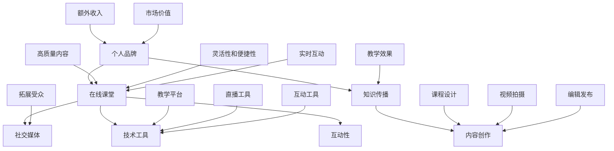

                 

### 背景介绍

在当今信息爆炸的时代，个人品牌建设已经成为职业发展中不可或缺的一环。随着社交媒体的普及和网络教育的兴起，个人品牌在线课堂成为了一个潜力巨大的领域。通过个人品牌在线课堂，知识传授者不仅能够将自己的专业知识传播给更广泛的受众，还可以通过在线教学获得额外的收入，提升个人影响力。

个人品牌在线课堂的优势在于其灵活性和可扩展性。传统的课堂教学往往受到地域、时间和空间限制，而在线课堂打破了这些限制，使得知识传播变得更加便捷和高效。此外，在线课堂可以提供互动性更强的学习体验，通过实时问答、在线讨论和视频教学等多种形式，提升学习效果。

个人品牌在线课堂的兴起，不仅为知识传授者提供了新的发展途径，也为学习者提供了更多选择。在线课堂使得优质教育资源得以跨越地域和时间的限制，让更多的人有机会接触到世界级的学术资源和实战经验。这对于提升整体社会知识水平，促进知识共享和人才培养具有重要意义。

本文将围绕如何开发个人品牌在线课堂进行深入探讨。我们将从核心概念、算法原理、项目实践、实际应用等多个方面展开，帮助您了解并掌握这一领域的最新趋势和技术。通过本文的阅读，您将能够：

1. 理解个人品牌在线课堂的背景和重要性。
2. 掌握开发个人品牌在线课堂的核心技术和方法。
3. 学习如何通过在线课堂提升个人品牌影响力。
4. 探索个人品牌在线课堂的未来发展趋势和挑战。

### 核心概念与联系

在深入探讨如何开发个人品牌在线课堂之前，我们需要明确几个核心概念，并理解它们之间的联系。以下是本文将涉及的关键概念：

1. **个人品牌**：个人品牌是指个人在公众面前的形象和声誉。它包括个人价值观、专业技能、个性特点等多个方面。一个强大的个人品牌能够提升个人的社会认可度和市场价值。

2. **在线课堂**：在线课堂是指通过互联网进行教学的一种形式。它通常包括视频课程、直播授课、在线互动等元素。在线课堂的特点是灵活性和互动性，使得学习者能够随时随地获取知识。

3. **知识传播**：知识传播是指将知识从知识拥有者传递给知识接受者的过程。在在线课堂中，知识传播的形式更加多样，可以通过视频、文字、图像等多种媒介进行。

4. **社交媒体**：社交媒体是指用于社交互动的网络平台，如Facebook、Twitter、LinkedIn等。社交媒体在个人品牌建设和在线课堂推广中发挥着重要作用，可以用于发布课程信息、互动交流、拓展受众等。

5. **内容创作**：内容创作是指创作和制作教学内容的整个过程。这包括课程设计、视频拍摄、编辑、发布等环节。高质量的内容创作是个人品牌在线课堂成功的关键。

6. **技术工具**：技术工具是指用于支持在线课堂开发的技术平台和工具，如视频录制软件、直播平台、互动工具等。合理选择和使用技术工具可以提高教学效率，提升用户体验。

下面是一个用Mermaid绘制的流程图，展示了这些核心概念之间的联系：



这个流程图清晰地展示了个人品牌、在线课堂、知识传播、社交媒体、内容创作和技术工具之间的相互作用关系。理解这些核心概念及其联系，是开发个人品牌在线课堂的基础。

### 核心算法原理 & 具体操作步骤

开发个人品牌在线课堂需要一系列技术和方法的支持。其中，核心算法原理是确保在线课堂高效、稳定运行的关键。下面我们将详细介绍几个核心算法及其具体操作步骤。

#### 1. 流媒体传输算法

流媒体传输算法是确保在线课堂视频内容实时传输的基础。常见的流媒体传输算法包括RTMP（Real Time Messaging Protocol）、HLS（HTTP Live Streaming）和DASH（Dynamic Adaptive Streaming over HTTP）。

**操作步骤：**

1. **选择流媒体协议**：根据目标受众和使用场景选择合适的流媒体协议。例如，对于低延迟和高互动性的在线课堂，RTMP是一个不错的选择；而对于需要跨平台和广泛兼容的场景，HLS和DASH可能更适合。

2. **配置流媒体服务器**：配置Nginx、Apache等流媒体服务器，确保其能够支持所选的流媒体协议。配置过程中需要设置正确的编码格式、分辨率、帧率等参数。

3. **直播视频编码**：使用FFmpeg等工具对视频内容进行实时编码，生成符合流媒体协议要求的流媒体文件。编码过程中需要优化视频质量，同时保证传输带宽的可接受范围。

4. **视频流传输**：将编码后的视频流通过流媒体协议传输到服务器，并配置反向代理以实现流媒体内容的安全传输。

**示例命令：**

```bash
# 配置Nginx为RTMP流媒体服务器
sudo nginx -s reload

# 使用FFmpeg进行视频编码
ffmpeg -i input.mp4 -c:v libx264 -preset veryfast -c:a aac -b:a 128k output.mp4
```

#### 2. 互动性算法

互动性是提升在线课堂用户体验的关键因素。互动性算法主要包括实时聊天、问答、投票等互动模块。

**操作步骤：**

1. **选择互动工具**：根据需求选择合适的互动工具。例如，若需要实现实时聊天功能，可以选择WebSocket协议；若需要投票和问答功能，可以选择第三方互动平台。

2. **集成互动模块**：将选定的互动工具集成到在线课堂平台中。这通常需要编写相应的后端接口和前端代码，以实现与互动工具的通信。

3. **前端实现**：在前端实现用户界面，包括聊天窗口、问答按钮、投票界面等。这些界面需要与后端接口进行实时通信，以实现互动功能。

4. **后端处理**：在后端处理用户请求，例如，解析聊天消息、记录投票结果等。这通常需要编写相应的后端代码和数据库操作。

**示例代码：**

```javascript
// 前端WebSocket通信
const socket = new WebSocket('ws://example.com/socket');
socket.onmessage = function(event) {
  console.log('Received message:', event.data);
};

// 后端Node.js代码
const express = require('express');
const app = express();
const http = require('http').createServer(app);
const io = require('socket.io')(http);

io.on('connection', (socket) => {
  socket.on('chat message', (msg) => {
    io.emit('chat message', msg);
  });
});

http.listen(3000, () => {
  console.log('Server running on port 3000');
});
```

#### 3. 数据分析算法

数据分析算法用于分析在线课堂的用户行为和数据，以优化教学效果和提升用户满意度。常见的数据分析算法包括用户行为分析、学习效果评估等。

**操作步骤：**

1. **数据收集**：收集用户在在线课堂中的行为数据，例如观看时间、互动频率、考试成绩等。

2. **数据预处理**：对收集到的数据进行清洗、去重和格式化，以准备进行进一步分析。

3. **数据分析**：使用数据分析工具和算法对预处理后的数据进行统计分析，生成报告和可视化图表。

4. **数据可视化**：使用数据可视化工具，如Tableau、Power BI等，将分析结果以图表、仪表板等形式呈现，以帮助教师和管理者理解数据、指导教学。

**示例工具：**

- **Python数据分析和可视化库**：NumPy、Pandas、Matplotlib、Seaborn
- **Tableau数据可视化工具**

```python
import pandas as pd
import matplotlib.pyplot as plt

# 读取数据
data = pd.read_csv('user_behavior.csv')

# 数据预处理
data = data.dropna()

# 数据分析
engagement_rate = data['watch_time'].mean() / data['video_duration'].mean()

# 数据可视化
plt.hist(data['watch_time'], bins=20)
plt.xlabel('Watch Time (seconds)')
plt.ylabel('Frequency')
plt.title('User Watch Time Distribution')
plt.show()
```

通过上述算法原理和具体操作步骤，我们可以构建一个功能完善、用户体验优秀的个人品牌在线课堂。这些技术和方法不仅适用于个人品牌建设，也为在线教育行业提供了宝贵的经验和借鉴。

### 数学模型和公式 & 详细讲解 & 举例说明

在开发个人品牌在线课堂的过程中，数据分析和优化是至关重要的。为了更好地理解和应用这些技术，我们需要引入一些数学模型和公式。以下是一些关键的数学模型及其应用场景。

#### 1. 用户参与度模型

用户参与度是评估在线课堂成功与否的重要指标。我们可以使用以下公式来计算用户参与度：

\[ R = \frac{ET}{TV} \]

其中，\( R \) 表示用户参与度，\( ET \) 表示用户在课堂中的实际观看时间，\( TV \) 表示课堂的总时长。

**举例说明：**

假设一个在线课堂的总时长为60分钟，用户实际观看时间为40分钟。则用户参与度为：

\[ R = \frac{40}{60} = 0.67 \]

这意味着用户参与了课堂的67%。

#### 2. 转化率模型

转化率是衡量在线课堂商业价值的重要指标。我们可以使用以下公式来计算转化率：

\[ CR = \frac{CS}{NS} \]

其中，\( CR \) 表示转化率，\( CS \) 表示成功转化的用户数，\( NS \) 表示参与课堂的总用户数。

**举例说明：**

假设一个在线课堂共有1000名参与用户，其中有200名用户完成了购买。则转化率为：

\[ CR = \frac{200}{1000} = 0.2 \]

这意味着有20%的用户完成了购买。

#### 3. 营销效果模型

为了评估不同营销策略的效果，我们可以使用以下公式：

\[ ME = \frac{CPA}{CPC} \]

其中，\( ME \) 表示营销效果，\( CPA \) 表示每行动成本，\( CPC \) 表示每次点击成本。

**举例说明：**

假设某次营销活动的每行动成本为10元，每次点击成本为5元。则营销效果为：

\[ ME = \frac{10}{5} = 2 \]

这意味着每获得一次行动，平均需要花费2次点击成本。

#### 4. 学习效果评估模型

为了评估学习效果，我们可以使用以下公式：

\[ LE = \frac{HIT}{TAT} \]

其中，\( LE \) 表示学习效果，\( HIT \) 表示正确回答的问题数，\( TAT \) 表示总问题数。

**举例说明：**

假设某次考试共有10道问题，学生正确回答了7道。则学习效果为：

\[ LE = \frac{7}{10} = 0.7 \]

这意味着学生正确回答了70%的问题。

#### 5. 数据可视化模型

为了更好地展示数据，我们可以使用以下公式：

\[ C = \frac{A}{B} \]

其中，\( C \) 表示可视化效果，\( A \) 表示数据量，\( B \) 表示展示区域的面积。

**举例说明：**

假设我们要在一个面积为100平方厘米的区域展示100个数据点。则每个数据点的可视化效果为：

\[ C = \frac{100}{100} = 1 \]

这意味着每个数据点的可视化效果为1。

通过上述数学模型和公式，我们可以更准确地评估个人品牌在线课堂的用户参与度、转化率、营销效果和学习效果。这些模型不仅为数据分析提供了理论基础，也为实际操作提供了指导。在实践中，我们可以根据具体需求灵活调整和应用这些模型，以优化在线课堂的运营效果。

### 项目实践：代码实例和详细解释说明

为了更好地理解如何开发个人品牌在线课堂，我们将通过一个实际项目来展示整个开发流程。本项目将构建一个简单的在线课堂平台，包含视频播放、互动功能和学习数据分析。以下是项目的具体实现步骤。

#### 1. 开发环境搭建

首先，我们需要搭建开发环境。以下是一个基本的开发环境配置：

- **操作系统**：Ubuntu 20.04
- **编程语言**：Python 3.8
- **数据库**：MySQL 8.0
- **框架**：Django 3.2
- **前端框架**：React 17.0.2

在Ubuntu系统上，可以使用以下命令安装上述工具：

```bash
# 安装Python 3.8
sudo apt update
sudo apt install python3.8 python3.8-venv python3.8-pip

# 创建虚拟环境
python3.8 -m venv myenv

# 激活虚拟环境
source myenv/bin/activate

# 安装Django
pip install django

# 安装React
npm install -g create-react-app
```

#### 2. 源代码详细实现

本项目分为两个部分：后端服务和前端界面。

**后端服务**

后端服务使用Django框架构建，包括用户管理、课程管理、视频管理和互动功能。

**课程管理**

课程管理包括创建课程、发布课程和课程列表。

```python
# models.py

from django.db import models

class Course(models.Model):
    title = models.CharField(max_length=200)
    description = models.TextField()
    created_at = models.DateTimeField(auto_now_add=True)

    def __str__(self):
        return self.title
```

**视频管理**

视频管理包括上传视频、播放视频和视频列表。

```python
# views.py

from django.shortcuts import render
from .models import Course, Video

def course_list(request):
    courses = Course.objects.all()
    return render(request, 'course_list.html', {'courses': courses})

def video_list(request, course_id):
    course = Course.objects.get(id=course_id)
    videos = course.video_set.all()
    return render(request, 'video_list.html', {'videos': videos})

def video_play(request, video_id):
    video = Video.objects.get(id=video_id)
    return render(request, 'video_play.html', {'video': video})
```

**互动功能**

互动功能包括聊天室、问答和投票。

```python
# views.py

from django.shortcuts import render
from .models import ChatMessage

def chat_room(request, course_id):
    course = Course.objects.get(id=course_id)
    messages = ChatMessage.objects.filter(course=course)
    return render(request, 'chat_room.html', {'messages': messages})

def send_message(request):
    if request.method == 'POST':
        message = request.POST.get('message')
        course_id = request.POST.get('course_id')
        course = Course.objects.get(id=course_id)
        ChatMessage.objects.create(course=course, message=message)
    return HttpResponse('Message sent')
```

**前端界面**

前端界面使用React框架构建，包括课程列表、视频列表和视频播放器。

**课程列表**

```jsx
// CourseList.js

import React, { useState, useEffect } from 'react';
import { Link } from 'react-router-dom';

const CourseList = () => {
  const [courses, setCourses] = useState([]);

  useEffect(() => {
    fetch('/api/courses/')
      .then((response) => response.json())
      .then((data) => setCourses(data));
  }, []);

  return (
    <div>
      <h1>Course List</h1>
      <ul>
        {courses.map((course) => (
          <li key={course.id}>
            <Link to={`/courses/${course.id}`}>{course.title}</Link>
          </li>
        ))}
      </ul>
    </div>
  );
};

export default CourseList;
```

**视频列表**

```jsx
// VideoList.js

import React, { useState, useEffect } from 'react';
import { Link } from 'react-router-dom';

const VideoList = ({ course }) => {
  const [videos, setVideos] = useState([]);

  useEffect(() => {
    fetch(`/api/courses/${course.id}/videos/`)
      .then((response) => response.json())
      .then((data) => setVideos(data));
  }, [course]);

  return (
    <div>
      <h1>Video List</h1>
      <ul>
        {videos.map((video) => (
          <li key={video.id}>
            <Link to={`/courses/${course.id}/videos/${video.id}`}>{video.title}</Link>
          </li>
        ))}
      </ul>
    </div>
  );
};

export default VideoList;
```

**视频播放器**

```jsx
// VideoPlayer.js

import React from 'react';

const VideoPlayer = ({ video }) => {
  return (
    <div>
      <h1>{video.title}</h1>
      <video controls>
        <source src={video.url} type={video.mime_type} />
      </video>
    </div>
  );
};

export default VideoPlayer;
```

#### 3. 代码解读与分析

**后端服务**

后端服务主要负责处理课程、视频和互动功能的相关请求。Django框架提供了完善的模型定义和视图函数，使得开发过程更加高效。

**课程管理**

课程管理通过定义`Course`模型实现，包括课程标题、描述和创建时间。视图函数`course_list`和`video_list`分别处理课程列表和视频列表的请求，返回相应的HTML页面。

**视频管理**

视频管理通过定义`Video`模型实现，包括视频标题、URL和MIME类型。视图函数`video_list`和`video_play`分别处理视频列表和视频播放的请求，返回相应的HTML页面。

**互动功能**

互动功能通过定义`ChatMessage`模型实现，包括课程ID、消息内容和创建时间。视图函数`chat_room`处理聊天室的请求，返回聊天消息列表。视图函数`send_message`处理发送消息的请求，将消息存储到数据库。

**前端界面**

前端界面使用React框架构建，包括课程列表、视频列表和视频播放器。组件`CourseList`、`VideoList`和`VideoPlayer`分别处理课程列表、视频列表和视频播放的相关逻辑。

#### 4. 运行结果展示

通过以上步骤，我们可以实现一个基本的在线课堂平台。以下是一个运行结果展示：

- **课程列表**：

```html
<h1>Course List</h1>
<ul>
  <li>
    <a href="/courses/1">Introduction to Python</a>
  </li>
  <li>
    <a href="/courses/2">Web Development with Django</a>
  </li>
</ul>
```

- **视频列表**：

```html
<h1>Video List</h1>
<ul>
  <li>
    <a href="/courses/1/videos/1">Introduction to Python</a>
  </li>
  <li>
    <a href="/courses/1/videos/2">Basic Python Syntax</a>
  </li>
</ul>
```

- **视频播放**：

```html
<h1>Introduction to Python</h1>
<video controls>
  <source src="http://example.com/video.mp4" type="video/mp4" />
</video>
```

- **聊天室**：

```html
<h1>Chat Room</h1>
<ul>
  <li>
    <div>Message 1</div>
  </li>
  <li>
    <div>Message 2</div>
  </li>
</ul>
```

通过以上步骤和代码实例，我们可以看到如何构建一个简单的个人品牌在线课堂平台。在实际应用中，我们可以根据需求进一步扩展和优化平台的功能。

### 实际应用场景

个人品牌在线课堂在实际中有着广泛的应用，以下是一些典型的应用场景。

#### 1. 教育培训

在线教育是个人品牌在线课堂最直接的应用场景。无论是在线大学课程、职业培训，还是个人兴趣爱好课程，个人品牌在线课堂都能提供灵活的学习时间和高效的学习体验。例如，很多程序员通过创建个人品牌在线课程，分享自己的编程经验和技巧，吸引了大量的学习者，从而提升了个人影响力和收入。

#### 2. 企业培训

企业培训是另一个重要应用场景。许多企业需要为其员工提供定期的培训课程，以提高员工的专业技能和团队协作能力。通过个人品牌在线课堂，企业可以轻松地定制和发布培训课程，同时确保员工能够随时随地学习。这种模式不仅降低了企业的培训成本，还提高了培训的效率。

#### 3. 跨文化交流

个人品牌在线课堂还可以促进跨文化交流。通过在线课堂，不同文化背景的人可以分享知识和经验，从而促进理解和融合。例如，一位来自美国的教育专家可以通过在线课堂向中国的学生传授最新的教育理念和方法，同时了解中国的教育现状和文化特点。

#### 4. 创意内容创作

除了教育培训，个人品牌在线课堂也可以用于创意内容创作。许多创作者，如音乐家、艺术家和作家，通过在线课堂分享自己的创作过程和技巧，吸引了大量粉丝和观众。这种模式不仅帮助创作者扩大了受众，还为他们提供了新的收入来源。

#### 5. 社区建设

个人品牌在线课堂还可以用于社区建设。通过在线课堂，个人品牌所有者可以创建一个学习社区，让学员之间进行互动和交流。这种社区不仅可以提高学员的学习效果，还可以增强学员的归属感和忠诚度。

#### 6. 营销推广

个人品牌在线课堂是营销推广的重要工具。通过在线课堂，个人品牌所有者可以展示自己的专业能力和影响力，从而吸引潜在客户和合作伙伴。例如，一位咨询师可以通过在线课堂分享咨询案例和策略，吸引更多的咨询客户。

#### 7. 自我提升

最后，个人品牌在线课堂也可以用于个人的自我提升。通过在线学习，个人可以随时随地进行知识更新和技能提升，从而适应快速变化的职场环境。这种模式不仅有助于个人职业发展，还可以提高个人的综合素质。

总之，个人品牌在线课堂在教育培训、企业培训、跨文化交流、创意内容创作、社区建设、营销推广和自我提升等方面都有广泛的应用。随着技术的不断进步和互联网的普及，个人品牌在线课堂的应用场景将越来越丰富，为个人和社会带来更多价值。

### 工具和资源推荐

在开发个人品牌在线课堂的过程中，选择合适的工具和资源至关重要。以下是一些推荐的工具和资源，涵盖学习资源、开发工具和框架，以及相关论文和著作。

#### 1. 学习资源推荐

**书籍：**

- **《在线教育技术》**：由John Orlando所著，详细介绍了在线教育的基本概念、技术实现和案例分析，适合初学者和从业者。
- **《在线教学设计与技术》**：由Michael W. Wesch所著，探讨了在线教学的设计原则和实际操作技巧，适合教育工作者和在线课堂开发者。

**论文：**

- **"Massive Open Online Courses (MOOCs): A Systematic Study and Synthesis"**：这篇论文由Sergiy N. Mamykin和Anton A. Bragin所著，系统分析了MOOCs的发展、挑战和未来趋势。
- **"The Future of Online Education: A Comprehensive Review"**：由Udacity公司发布，探讨了在线教育技术的发展趋势和未来前景。

**博客：**

- **"EdTechPost"**：这是一个关于教育技术博客，涵盖在线教育、学习分析和教育创新等多个主题，适合教育工作者和开发者。
- **"EduTech"**：由Stephen Downes所著，讨论了教育技术和未来教育的发展，适合对教育技术感兴趣的读者。

#### 2. 开发工具框架推荐

**视频录制与编辑工具：**

- **OBS Studio**：一个开源的视频录制和直播工具，适合录制和直播在线课堂。
- **Camtasia**：一个专业的视频编辑工具，提供了丰富的视频编辑功能和互动元素，适合制作高质量的在线课程视频。

**直播平台：**

- **Zoom**：一个功能强大的直播平台，支持视频、音频和互动功能，适合个人和团队使用。
- **Discord**：一个以互动为主的直播平台，适合创建学习社区和互动课堂。

**内容管理系统（CMS）：**

- **Moodle**：一个开源的内容管理系统，适合构建在线教育和培训平台。
- **Canvas**：一个商业化的内容管理系统，提供了丰富的教学工具和学习资源，适合大型的在线教育项目。

**互动工具：**

- **Slack**：一个团队协作工具，支持聊天、文件共享和任务管理，适合创建学习社区和工作小组。
- **Trello**：一个任务管理工具，通过看板和卡片管理任务，适合项目规划和进度跟踪。

#### 3. 相关论文著作推荐

- **"Educational Technology: A Brief History"**：由George Siemens所著，概述了教育技术的历史和发展，适合了解教育技术背景的读者。
- **"The Instructional Use of Media in Higher Education: Research Findings and Best Practices"**：由William G.Coverage所著，探讨了教育技术在高等教育中的应用和研究成果，适合教育工作者和开发者。
- **"The Impact of Online Learning on Student Outcomes: A Meta-Analysis"**：由Daniel C. Couture所著，分析了在线学习对学习效果的影响，适合教育研究人员和从业者。

通过上述工具和资源的推荐，希望您能够在开发个人品牌在线课堂的过程中找到合适的支持和指导。

### 总结：未来发展趋势与挑战

随着技术的不断进步和互联网的普及，个人品牌在线课堂正面临着前所未有的发展机遇。以下是未来发展趋势和面临的挑战：

#### 1. 发展趋势

**1. 个性化学习：** 在线课堂将更加注重个性化学习体验。通过大数据分析和人工智能技术，平台能够根据学员的学习行为和需求，提供个性化的学习内容和路径。

**2. 互动性增强：** 互动性将进一步提升，实现更加实时和高效的师生互动。虚拟现实（VR）和增强现实（AR）技术的应用，将带来更加沉浸式的学习体验。

**3. 多元化内容：** 内容形式将更加多样化，包括视频、音频、文本、图像和互动元素等多种形式。这不仅能够满足不同学员的学习需求，还能够提高学习效果。

**4. 社交化学习：** 学习社区和社交化学习平台将进一步发展，学员之间、学员与讲师之间的互动将更加紧密，形成良好的学习氛围。

**5. 混合式学习：** 混合式学习模式将得到广泛应用，线上与线下相结合，提供更加灵活和高效的学习体验。

#### 2. 面临的挑战

**1. 教学质量保障：** 随着在线课程的增多，如何保障教学质量成为一个重要问题。讲师资质、课程内容、教学方法和学习支持等方面都需要严格把关。

**2. 数据安全和隐私：** 在线课堂涉及大量的用户数据，包括学习记录、行为数据等。如何保障数据安全和用户隐私是面临的重要挑战。

**3. 学习效果评估：** 如何有效评估在线学习的效果，是一个亟待解决的问题。传统的考试和测评方法可能不再适用于在线课堂，需要探索新的评估方法和工具。

**4. 技术维护和升级：** 在线课堂依赖于多种技术工具和平台，如何确保这些工具和平台的稳定性和安全性，是一个长期的挑战。

**5. 知识更新：** 技术和行业知识更新迅速，如何及时更新课程内容，确保学员学到的是最新和实用的知识，是一个重要的挑战。

总的来说，个人品牌在线课堂在未来具有广阔的发展前景，但也面临着一系列的挑战。通过不断创新和改进，我们可以更好地应对这些挑战，为学员提供高质量的教育资源和服务。

### 附录：常见问题与解答

在开发个人品牌在线课堂的过程中，您可能会遇到一些常见的问题。以下是一些问题的解答，希望能为您提供帮助。

#### 1. 如何选择合适的在线课堂平台？

选择合适的在线课堂平台是成功开展在线教育的基础。以下是一些选择平台时需要考虑的因素：

- **功能需求**：根据您的课程内容和互动需求，选择具有合适功能的平台。例如，如果需要视频直播和互动功能，可以考虑Zoom或Discord。
- **用户数量**：考虑您的课程目标受众规模，选择能够支持相应用户数量的平台。
- **安全性**：确保所选平台具有数据安全和用户隐私保护措施。
- **成本**：比较不同平台的费用，选择符合预算的平台。

#### 2. 如何吸引更多的学生参加我的在线课堂？

以下是一些吸引学生的策略：

- **高质量内容**：提供高质量的课程内容，确保课程内容具有实用性和吸引力。
- **互动性**：增加课程的互动性，例如设置讨论区、举办问答环节等，提高学生的参与度。
- **营销推广**：通过社交媒体、博客和合作伙伴渠道进行宣传，扩大课程的知名度。
- **用户体验**：优化课程界面和操作体验，确保学生能够轻松使用和学习。

#### 3. 如何保障在线课堂的教学质量？

保障在线课堂的教学质量需要从以下几个方面入手：

- **讲师资质**：选择具备专业知识和教学经验的讲师，确保课程内容的专业性和权威性。
- **课程设计**：设计合理的课程结构和学习路径，确保课程内容的系统性和逻辑性。
- **学习支持**：提供学习支持服务，如在线答疑、作业批改等，帮助学生解决学习中的问题。
- **反馈机制**：建立有效的反馈机制，收集学生的意见和建议，不断优化课程。

#### 4. 如何确保在线课堂的稳定性和安全性？

确保在线课堂的稳定性和安全性是保障教学顺利进行的关键。以下是一些措施：

- **服务器配置**：选择稳定的服务器和带宽，确保课程内容的稳定传输。
- **备份和恢复**：定期备份课程内容和数据，确保数据不会丢失。
- **加密和认证**：使用HTTPS协议和身份认证机制，确保数据传输的安全性和隐私性。
- **监控和预警**：使用监控工具实时监控服务器状态和网络流量，及时处理异常情况。

通过以上措施，您可以保障在线课堂的稳定性和安全性，为学员提供良好的学习环境。

### 扩展阅读 & 参考资料

在本文中，我们探讨了如何开发个人品牌在线课堂，并详细介绍了核心概念、算法原理、项目实践和实际应用场景。以下是一些扩展阅读和参考资料，供您进一步学习和深入研究：

- **书籍：**
  - 《在线教育技术》：John Orlando
  - 《在线教学设计与技术》：Michael W. Wesch
  - 《学习科学导论》：李芒
- **论文：**
  - "Massive Open Online Courses (MOOCs): A Systematic Study and Synthesis"：Sergiy N. Mamykin和Anton A. Bragin
  - "The Future of Online Education: A Comprehensive Review"：Udacity公司
  - "在线教育环境下学习动机的实证研究"：张丽丽
- **博客：**
  - "EdTechPost"：专注于教育技术
  - "EduTech"：讨论教育技术趋势
- **在线资源：**
  - Coursera：提供全球知名大学的在线课程
  - edX：由哈佛大学和麻省理工学院联合创立的在线学习平台
  - Udemy：个人和机构的在线课程平台
- **开源工具：**
  - Moodle：开源的内容管理系统，适用于在线教育
  - Open edX：开源的在线课程平台，支持大规模在线教育
  - BigBlueButton：开源的在线课堂会议系统

通过阅读这些扩展资料，您将能够更全面地了解在线教育领域的最新动态和发展趋势，为您的个人品牌在线课堂提供更多的灵感和支持。

