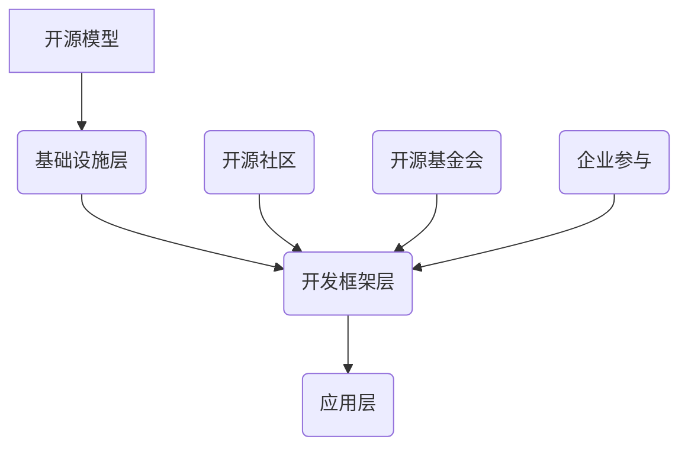

                 

## 1. 背景介绍

开源模型的发展始于上世纪90年代，随着互联网的兴起，全球各地的开发者开始共享代码，推动了软件技术的进步。这一过程不仅促进了技术创新，也推动了开源文化的形成。开源模型的核心理念是开放、共享和协作，它允许任何人查看、修改和分发代码，这种模式在软件、硬件和人工智能等领域都取得了显著的成果。

在人工智能领域，开源模型的发展尤为迅速。以深度学习为例，大量的算法和工具通过开源社区得以传播，使得更多的人能够参与到人工智能的研究和开发中。这种开放性不仅加速了技术的传播，也促进了全球范围内的创新。

贾扬清，作为一位世界级的人工智能专家和开源模型的坚定支持者，对于开源模型的发展有着深刻的见解。他在多篇论文和演讲中，多次强调开源模型在推动技术进步和产业创新中的重要作用。

本文旨在探讨贾扬清对于开源模型发展的观点，分析开源模型在定制化方面的优势，并探讨其在未来可能面临的挑战。

## 2. 核心概念与联系

### 2.1 开源模型的定义与核心原则

开源模型（Open Source Model）是一种软件开发和分发的方式，其核心原则包括：

- **开放性**：任何人都可以查看、修改和分发代码。
- **共享**：开发者可以自由地分享自己的代码和经验。
- **协作**：通过全球范围内的协作，提升代码的质量和功能。

开源模型与传统的封闭模型（Closed Source Model）不同，后者通常由单个公司或团队控制，用户只能使用预定的功能，无法查看或修改代码。

### 2.2 开源模型的发展历程

- **90年代**：Linux的出现标志着开源模型的崛起。
- **2000年代**：随着互联网的发展，更多的开源软件和项目涌现。
- **2010年代**：开源模型在人工智能领域的应用逐渐增多。
- **2020年代**：开源模型已经成为技术发展的重要驱动力。

### 2.3 开源模型的关键角色

- **开源社区**：是开源模型的核心，由全球的开发者组成，共同维护和改进代码。
- **开源基金会**：如Apache、Mozilla等，为开源项目提供法律、财务和技术支持。
- **企业参与**：越来越多的企业开始积极参与开源项目，以降低开发成本和加速创新。

### 2.4 开源模型的架构

开源模型的架构通常包括以下层次：

- **基础设施层**：包括版本控制系统、代码托管平台等。
- **开发框架层**：如TensorFlow、PyTorch等，提供算法和工具支持。
- **应用层**：各种基于开源框架的应用程序。

### 2.5 Mermaid 流程图



### 2.6 开源模型的优势与挑战

- **优势**：
  - **快速迭代**：全球开发者可以实时反馈和改进代码。
  - **降低成本**：企业和开发者可以共享资源和经验，降低开发成本。
  - **技术扩散**：开源模型促进了技术的普及和传播。

- **挑战**：
  - **安全性**：开源代码可能存在漏洞和安全隐患。
  - **版权问题**：开源项目可能涉及复杂的版权问题。
  - **协调困难**：多人协作可能导致协调困难。

## 3. 核心算法原理 & 具体操作步骤

### 3.1 核心算法原理

开源模型的核心在于其算法的开放性和可定制性。以深度学习为例，开源模型提供了大量的算法和工具，开发者可以根据自己的需求进行选择和定制。

- **卷积神经网络（CNN）**：用于图像处理和识别。
- **循环神经网络（RNN）**：用于序列数据处理。
- **生成对抗网络（GAN）**：用于生成式模型。

### 3.2 具体操作步骤

以安装和使用PyTorch为例，具体操作步骤如下：

1. **安装Python环境**：确保系统中安装了Python 3.6或更高版本。
2. **安装PyTorch**：使用pip命令安装：
   ```bash
   pip install torch torchvision
   ```
3. **编写代码**：创建一个新的Python文件，编写深度学习模型代码。
4. **运行代码**：执行Python脚本，训练和测试模型。

### 3.3 示例代码

```python
import torch
import torchvision
import torchvision.transforms as transforms

# 数据预处理
transform = transforms.Compose(
    [transforms.ToTensor(),
     transforms.Normalize((0.5, 0.5, 0.5), (0.5, 0.5, 0.5))])

# 下载并加载数据集
trainset = torchvision.datasets.CIFAR10(root='./data', train=True,
                                        download=True, transform=transform)
trainloader = torch.utils.data.DataLoader(trainset, batch_size=4,
                                          shuffle=True, num_workers=2)

# 创建网络结构
net = Network()
net = net.cuda()
net.train()

# 损失函数和优化器
criterion = nn.CrossEntropyLoss()
optimizer = optim.SGD(net.parameters(), lr=0.001, momentum=0.9)

# 训练模型
for epoch in range(2):  # loop over the dataset multiple times

    running_loss = 0.0
    for i, data in enumerate(trainloader, 0):
        # get the inputs; data is a list of [inputs, labels]
        inputs, labels = data

        # 集合参数到GPU
        if torch.cuda.is_available():
            inputs = inputs.cuda()
            labels = labels.cuda()

        # 梯度清零
        optimizer.zero_grad()

        # 前向传播 + 反向传播 + 优化
        outputs = net(inputs)
        loss = criterion(outputs, labels)
        loss.backward()
        optimizer.step()

        # 打印状态信息
        running_loss += loss.item()
        if i % 2000 == 1999:    # 每2000个批量打印一次
            print('[%d, %5d] loss: %.3f' %
                  (epoch + 1, i + 1, running_loss / 2000))
            running_loss = 0.0

print('Finished Training')
```

### 3.4 运行结果

训练完成后，可以使用验证集对模型进行评估，并输出准确率等信息。

```python
# 验证模型
correct = 0
total = 0
with torch.no_grad():
    for data in testloader:
        images, labels = data
        if torch.cuda.is_available():
            images = images.cuda()
        outputs = net(images)
        _, predicted = torch.max(outputs.data, 1)
        total += labels.size(0)
        correct += (predicted == labels).sum().item()

print('Accuracy of the network on the 10000 test images: %d %%' % (
    100 * correct / total))
```

## 4. 数学模型和公式 & 详细讲解 & 举例说明

### 4.1 深度学习中的数学模型

深度学习中的数学模型主要包括：

- **神经网络**：用于模拟人脑的工作方式。
- **损失函数**：用于衡量模型预测值与实际值之间的差异。
- **优化算法**：用于调整模型的参数，以最小化损失函数。

### 4.2 损失函数的详细讲解

以交叉熵损失函数（Cross Entropy Loss）为例，其公式如下：

$$
L = -\frac{1}{N}\sum_{i=1}^{N} y_i \log(p_i)
$$

其中，$N$是样本数量，$y_i$是实际标签，$p_i$是模型预测的概率。

### 4.3 举例说明

假设我们有5个样本，实际标签为$[1, 0, 1, 0, 1]$，模型预测的概率为$[0.2, 0.8, 0.6, 0.4, 0.3]$，则交叉熵损失为：

$$
L = -\frac{1}{5}\sum_{i=1}^{5} y_i \log(p_i) \\
= -\frac{1}{5} \left(1 \cdot \log(0.2) + 0 \cdot \log(0.8) + 1 \cdot \log(0.6) + 0 \cdot \log(0.4) + 1 \cdot \log(0.3)\right) \\
\approx 1.6094
$$

### 4.4 优化算法的详细讲解

以随机梯度下降（Stochastic Gradient Descent，SGD）为例，其公式如下：

$$
\theta_{t+1} = \theta_{t} - \alpha \nabla_{\theta}L(\theta)
$$

其中，$\theta$是模型的参数，$L(\theta)$是损失函数，$\alpha$是学习率。

### 4.5 举例说明

假设我们有模型参数$\theta = [1, 2]$，损失函数的梯度为$\nabla_{\theta}L(\theta) = [-1, -2]$，学习率为$\alpha = 0.1$，则更新后的参数为：

$$
\theta_{t+1} = \theta_{t} - \alpha \nabla_{\theta}L(\theta) \\
= [1, 2] - 0.1 \cdot [-1, -2] \\
= [1.1, 1.8]
$$

## 5. 项目实践：代码实例和详细解释说明

### 5.1 项目背景

本项目是一个基于深度学习的图像分类项目，旨在使用开源框架PyTorch训练一个卷积神经网络（CNN）模型，实现对CIFAR-10数据集的图像分类。

### 5.2 数据集介绍

CIFAR-10是一个包含60000张32x32彩色图像的数据集，分为10个类别，每类6000张图像。训练集包含50000张图像，测试集包含10000张图像。

### 5.3 代码实例

以下是一个简单的PyTorch代码实例，用于训练CNN模型：

```python
import torch
import torchvision
import torchvision.transforms as transforms
import torch.nn as nn
import torch.optim as optim

# 数据预处理
transform = transforms.Compose(
    [transforms.ToTensor(),
     transforms.Normalize((0.5, 0.5, 0.5), (0.5, 0.5, 0.5))])

# 下载并加载数据集
trainset = torchvision.datasets.CIFAR10(root='./data', train=True,
                                        download=True, transform=transform)
trainloader = torch.utils.data.DataLoader(trainset, batch_size=4,
                                          shuffle=True, num_workers=2)

testset = torchvision.datasets.CIFAR10(root='./data', train=False,
                                       download=True, transform=transform)
testloader = torch.utils.data.DataLoader(testset, batch_size=4,
                                         shuffle=False, num_workers=2)

# 创建网络结构
class Net(nn.Module):
    def __init__(self):
        super(Net, self).__init__()
        self.conv1 = nn.Conv2d(3, 6, 5)
        self.pool = nn.MaxPool2d(2, 2)
        self.conv2 = nn.Conv2d(6, 16, 5)
        self.fc1 = nn.Linear(16 * 5 * 5, 120)
        self.fc2 = nn.Linear(120, 84)
        self.fc3 = nn.Linear(84, 10)

    def forward(self, x):
        x = self.pool(nn.functional.relu(self.conv1(x)))
        x = self.pool(nn.functional.relu(self.conv2(x)))
        x = x.view(-1, 16 * 5 * 5)
        x = nn.functional.relu(self.fc1(x))
        x = nn.functional.relu(self.fc2(x))
        x = self.fc3(x)
        return x

net = Net()

# 损失函数和优化器
criterion = nn.CrossEntropyLoss()
optimizer = optim.SGD(net.parameters(), lr=0.001, momentum=0.9)

# 训练模型
for epoch in range(2):  # loop over the dataset multiple times

    running_loss = 0.0
    for i, data in enumerate(trainloader, 0):
        # get the inputs; data is a list of [inputs, labels]
        inputs, labels = data

        # 集合参数到GPU
        if torch.cuda.is_available():
            inputs = inputs.cuda()
            labels = labels.cuda()

        # 梯度清零
        optimizer.zero_grad()

        # 前向传播 + 反向传播 + 优化
        outputs = net(inputs)
        loss = criterion(outputs, labels)
        loss.backward()
        optimizer.step()

        # 打印状态信息
        running_loss += loss.item()
        if i % 2000 == 1999:    # 每2000个批量打印一次
            print('[%d, %5d] loss: %.3f' %
                  (epoch + 1, i + 1, running_loss / 2000))
            running_loss = 0.0

print('Finished Training')

# 验证模型
correct = 0
total = 0
with torch.no_grad():
    for data in testloader:
        images, labels = data
        if torch.cuda.is_available():
            images = images.cuda()
        outputs = net(images)
        _, predicted = torch.max(outputs.data, 1)
        total += labels.size(0)
        correct += (predicted == labels).sum().item()

print('Accuracy of the network on the 10000 test images: %d %%' % (
    100 * correct / total))
```

### 5.4 详细解释说明

- **数据预处理**：将图像转换为Tensor，并归一化。
- **网络结构**：定义一个简单的卷积神经网络，包括两个卷积层、两个全连接层和一个输出层。
- **损失函数和优化器**：使用交叉熵损失函数和随机梯度下降优化器。
- **训练模型**：通过遍历训练集，计算损失函数，并更新模型参数。
- **验证模型**：使用测试集评估模型的准确率。

## 6. 实际应用场景

### 6.1 人工智能领域

开源模型在人工智能领域的应用极为广泛，涵盖了图像识别、自然语言处理、推荐系统等多个方面。以下是一些具体的应用场景：

- **图像识别**：开源模型如TensorFlow、PyTorch提供了丰富的预训练模型，可以快速部署到各种图像识别任务中。
- **自然语言处理**：开源模型如BERT、GPT-3在自然语言处理领域取得了显著的成果，被广泛应用于文本分类、情感分析等任务。
- **推荐系统**：开源模型如LightGCN、DIN等在推荐系统领域展现了强大的能力，帮助企业实现精准推荐。

### 6.2 工业领域

开源模型在工业领域的应用也越来越广泛，以下是一些具体的应用场景：

- **质量控制**：使用深度学习模型进行产品质量检测，提高生产效率。
- **故障预测**：通过时序数据预测设备故障，实现预防性维护。
- **供应链优化**：利用优化算法和预测模型优化供应链管理，降低成本。

### 6.3 医疗领域

开源模型在医疗领域的应用也在逐步扩大，以下是一些具体的应用场景：

- **疾病诊断**：使用深度学习模型辅助医生进行疾病诊断，提高诊断准确率。
- **药物研发**：利用生成对抗网络（GAN）加速新药研发。
- **健康监测**：通过时序数据预测患者健康状况，提供个性化健康建议。

### 6.4 金融领域

开源模型在金融领域的应用也日益增多，以下是一些具体的应用场景：

- **风险评估**：利用深度学习模型预测金融风险，提高风险管理能力。
- **智能投顾**：通过分析用户数据和市场数据，为用户提供个性化投资建议。
- **欺诈检测**：使用开源模型快速检测金融交易中的欺诈行为。

## 7. 工具和资源推荐

### 7.1 开源框架

- **PyTorch**：一款灵活的深度学习框架，适合快速原型设计和模型开发。
- **TensorFlow**：由Google开发的一款广泛使用的深度学习框架，支持多种编程语言。
- **Keras**：一个高层神经网络API，兼容TensorFlow和Theano，易于使用。

### 7.2 开源工具

- **Jupyter Notebook**：一款交互式的计算环境，适合编写和分享代码。
- **Git**：一款版本控制系统，用于代码的版本管理和协作开发。
- **Docker**：一款容器化技术，用于部署和管理应用程序。

### 7.3 在线资源

- **Kaggle**：一个数据科学竞赛平台，提供丰富的数据集和问题。
- **Coursera**：一个在线学习平台，提供大量的机器学习和深度学习课程。
- **GitHub**：一个代码托管平台，汇集了大量的开源项目和代码。

## 8. 总结：未来发展趋势与挑战

### 8.1 发展趋势

- **开源模型的普及**：随着技术的不断进步，开源模型将越来越普及，成为人工智能和软件开发的主流。
- **定制化需求的增加**：企业将更加注重定制化的开源模型，以满足特定的业务需求。
- **社区协作的深化**：开源社区的合作将更加紧密，通过共享资源和经验，推动技术的快速进步。

### 8.2 挑战

- **安全风险**：开源模型可能存在漏洞和安全隐患，需要加强安全管理和审查。
- **版权问题**：开源项目可能涉及复杂的版权问题，需要制定合理的版权政策。
- **协调困难**：多人协作可能导致协调困难，需要建立有效的沟通和协作机制。

## 9. 附录：常见问题与解答

### 9.1 开源模型的优点是什么？

- **快速迭代**：全球开发者可以实时反馈和改进代码，加速技术的进步。
- **降低成本**：企业和开发者可以共享资源和经验，降低开发成本。
- **技术扩散**：开源模型促进了技术的普及和传播。

### 9.2 开源模型存在哪些挑战？

- **安全风险**：开源代码可能存在漏洞和安全隐患。
- **版权问题**：开源项目可能涉及复杂的版权问题。
- **协调困难**：多人协作可能导致协调困难。

### 9.3 如何参与开源项目？

- **学习相关技术**：了解开源项目所使用的技术和工具。
- **贡献代码**：为开源项目编写或优化代码。
- **参与讨论**：在开源社区中参与讨论和交流。

## 10. 扩展阅读 & 参考资料

- [贾扬清](https://www.jiayangqing.com/)
- [PyTorch官方文档](https://pytorch.org/docs/stable/)
- [TensorFlow官方文档](https://www.tensorflow.org/)
- [Kaggle](https://www.kaggle.com/)
- [Coursera](https://www.coursera.org/)

---

**作者：禅与计算机程序设计艺术 / Zen and the Art of Computer Programming**

