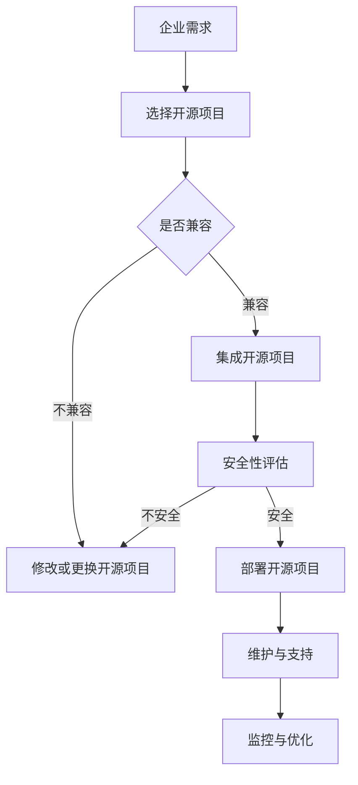

                 

### 1. 背景介绍

在当今数字化时代，开源项目在企业中的应用已经成为一种不可逆转的趋势。随着互联网技术的飞速发展，企业需要快速适应市场的变化，而开源项目以其开放性、灵活性和社区支持等优势，为企业的数字化转型提供了强有力的支撑。

开源项目是指由开发者社区共同维护和发展的软件项目，其源代码对外公开，用户可以自由地使用、修改和分发。这种模式不仅降低了企业的软件采购成本，还提高了软件的适应性和可扩展性。随着开源项目数量的不断增加，越来越多的企业开始将开源项目纳入其技术栈中，以提升自身的竞争力。

然而，企业采用开源项目并非一帆风顺。在实际应用过程中，企业需要面对诸多挑战，如安全性、合规性、技术支持等。因此，本文将探讨开源项目的企业采用过程，分析其中的关键因素，为企业提供指导和建议。

本文首先介绍开源项目在企业中的应用背景和现状，然后阐述企业采用开源项目的主要动机和优势。接着，我们将详细讨论企业采用开源项目所面临的挑战和风险，并为企业提供解决方案。最后，本文将总结开源项目在企业中的未来发展趋势和挑战，为企业提供参考。

通过本文的阅读，读者将了解到开源项目在企业中的应用价值、采用过程中的关键因素以及应对挑战的方法。这将对企业更好地利用开源项目，提升竞争力具有重要意义。

### 2. 核心概念与联系

在探讨开源项目的企业采用之前，我们需要了解一些核心概念，这些概念是理解开源项目在企业中的应用及其价值的关键。

#### 2.1 开源项目的定义

开源项目是指那些遵循开源协议（如GPL、MIT、Apache License等）的软件项目。这些协议通常允许用户自由地使用、复制、修改和分发软件。开源项目的源代码公开，用户可以访问、阅读和改进代码，这使得开源项目具有较高的透明度和可信任度。

#### 2.2 开源生态系统的构成

开源生态系统由多个部分组成，包括开发者、贡献者、用户和公司。开发者是开源项目的创建者和维护者，他们负责编写和改进代码。贡献者则是那些为开源项目做出贡献的个人和团队，他们可能负责修复漏洞、增加功能或优化性能。用户是使用开源项目的最终用户，他们的反馈和需求可以影响项目的改进。公司则是参与开源项目的企业，它们通过开源项目获得技术优势，并在某些情况下为项目提供资金支持。

#### 2.3 开源项目与企业应用的联系

开源项目与企业应用的联系主要体现在以下几个方面：

1. **技术栈整合**：企业可以将多个开源项目集成到其技术栈中，以实现特定的业务需求。这种整合不仅提高了系统的灵活性，还降低了开发成本。

2. **创新加速**：开源项目通常具有快速的开发迭代周期，企业可以通过使用这些项目快速获得新技术和新功能。

3. **社区支持**：开源项目背后通常有一个活跃的社区，企业可以从中获得技术支持、学习资源和最佳实践。

4. **风险分散**：由于开源项目的源代码是公开的，企业可以更好地评估其安全性和可靠性，从而分散技术风险。

#### 2.4 开源项目与企业IT架构的融合

开源项目与企业IT架构的融合需要考虑以下几个方面：

1. **兼容性**：确保开源项目与企业现有系统的兼容性，避免技术冲突和性能瓶颈。

2. **安全性**：对开源项目进行安全评估，确保其符合企业的安全要求，并定期更新以修复已知漏洞。

3. **可维护性**：开源项目需要具备良好的文档和社区支持，以确保企业能够在需要时获得帮助和技术支持。

4. **可控性**：企业需要对开源项目进行适当的定制和优化，以适应其特定的业务需求。

#### 2.5 Mermaid 流程图

为了更直观地展示开源项目与企业IT架构的融合过程，我们可以使用Mermaid流程图来描述：



通过上述Mermaid流程图，我们可以清晰地看到企业采用开源项目的整体流程，以及各个步骤之间的逻辑关系。

综上所述，理解开源项目的核心概念和其与企业应用的联系，对于企业成功采用开源项目具有重要意义。在接下来的部分，我们将深入探讨企业采用开源项目的主要动机和优势。

### 3. 核心算法原理 & 具体操作步骤

在了解了开源项目的定义和核心概念后，我们接下来将深入探讨企业采用开源项目的核心算法原理和具体操作步骤。

#### 3.1 开源项目的核心算法原理

开源项目通常基于一些广泛认可的算法和架构设计。这些算法和架构设计不仅具有高效性，还具备良好的可扩展性和可维护性。以下是一些常见的开源项目及其核心算法原理：

1. **Docker**：Docker 是一个开源的应用容器引擎，它利用容器来封装、交付和运行应用。Docker 的核心算法原理是基于 Linux 内核的命名空间（Namespace）和 cgroup（控制组）技术，通过将这些技术组合使用，实现了应用程序的隔离和资源管理。

2. **Kubernetes**：Kubernetes 是一个开源的容器编排平台，用于自动化容器化应用程序的部署、扩展和管理。Kubernetes 的核心算法原理是基于集群管理和调度算法，通过不断地评估和优化容器资源的使用，实现了高效的应用程序管理。

3. **Elasticsearch**：Elasticsearch 是一个开源的全文搜索引擎，它基于 Lucene 搜索引擎库。Elasticsearch 的核心算法原理包括倒排索引、分布式搜索和实时更新，通过这些算法，实现了高效、可扩展的全文搜索功能。

4. **MySQL**：MySQL 是一个开源的关系型数据库管理系统，它支持多种存储引擎，如 InnoDB、MyISAM 等。MySQL 的核心算法原理包括事务管理、索引优化和查询优化，通过这些算法，实现了高效的数据存储和查询功能。

5. **Apache Kafka**：Apache Kafka 是一个开源的消息队列系统，它用于构建实时的数据流处理应用。Kafka 的核心算法原理包括分布式存储、分布式消息传递和分区机制，通过这些算法，实现了高效、可靠的消息传递和数据流处理。

#### 3.2 开源项目的具体操作步骤

在了解了开源项目的核心算法原理后，我们需要了解如何在实际操作中采用这些开源项目。以下是一些具体的操作步骤：

1. **Docker 的操作步骤**：

   - **环境准备**：确保系统中安装了 Docker，并设置好 Docker 镜像仓库。
   - **构建 Dockerfile**：编写 Dockerfile 文件，定义应用程序的构建步骤和依赖关系。
   - **构建 Docker 镜像**：使用 Docker CLI 工具构建 Docker 镜像。
   - **运行 Docker 容器**：使用 Docker CLI 工具运行 Docker 容器，并映射容器与宿主机的端口和目录。
   - **管理 Docker 容器**：对 Docker 容器进行启动、停止、重启和删除等操作。

2. **Kubernetes 的操作步骤**：

   - **环境准备**：确保系统中安装了 Kubernetes，并设置好 Kubernetes 集群。
   - **编写 Kubernetes 配置文件**：编写 Kubernetes 配置文件（如 Deployment、Service 等），定义应用程序的部署和管理策略。
   - **部署 Kubernetes 应用程序**：使用 Kubernetes CLI 工具（如 kubectl）部署应用程序。
   - **监控和管理 Kubernetes 应用程序**：使用 Kubernetes CLI 工具监控和管理应用程序的运行状态。
   - **扩展 Kubernetes 应用程序**：根据业务需求，扩展应用程序的规模。

3. **Elasticsearch 的操作步骤**：

   - **环境准备**：确保系统中安装了 Elasticsearch，并设置好 Elasticsearch 集群。
   - **配置 Elasticsearch**：编辑 Elasticsearch 配置文件（如 elasticsearch.yml），定义集群名称、节点配置等。
   - **启动 Elasticsearch**：启动 Elasticsearch 服务，并确保集群正常运行。
   - **索引管理**：使用 Elasticsearch REST API 管理索引，如创建、删除和查询索引。
   - **搜索管理**：使用 Elasticsearch REST API 执行搜索操作，如全文搜索、过滤搜索和聚合搜索。

4. **MySQL 的操作步骤**：

   - **环境准备**：确保系统中安装了 MySQL，并设置好 MySQL 数据库。
   - **数据库管理**：使用 MySQL CLI 工具（如 mysql）管理数据库，如创建、删除和查询数据库。
   - **表管理**：使用 MySQL CLI 工具管理表，如创建、删除和查询表。
   - **数据管理**：使用 MySQL CLI 工具管理数据，如插入、更新和删除数据。
   - **查询优化**：分析查询性能，并使用索引优化查询。

5. **Apache Kafka 的操作步骤**：

   - **环境准备**：确保系统中安装了 Apache Kafka，并设置好 Kafka 集群。
   - **主题管理**：使用 Kafka CLI 工具（如 kafka-topics.sh）管理主题，如创建、删除和查询主题。
   - **消息生产**：使用 Kafka CLI 工具（如 kafka-console-producer.sh）生产消息。
   - **消息消费**：使用 Kafka CLI 工具（如 kafka-console-consumer.sh）消费消息。
   - **流处理**：使用 Kafka Streams 或其他流处理框架处理消息流。

通过上述具体操作步骤，企业可以更好地理解和应用开源项目，从而提升其技术能力和竞争力。在接下来的部分，我们将进一步探讨开源项目的数学模型和公式，以深入理解其工作原理。

### 4. 数学模型和公式 & 详细讲解 & 举例说明

在深入探讨开源项目的核心算法原理后，我们将进一步分析开源项目中的数学模型和公式，并详细讲解其工作原理。通过这些数学模型和公式，我们可以更好地理解开源项目如何实现高效、可靠和可扩展的功能。

#### 4.1 数学模型和公式的应用场景

开源项目中常见的数学模型和公式包括分布式计算模型、线性代数模型、概率模型和时间序列模型等。以下是一些具体的应用场景：

1. **分布式计算模型**：例如，Kubernetes 中的调度算法使用到了分布式计算模型，通过优化资源分配和任务调度，提高集群的整体性能。

2. **线性代数模型**：例如，Elasticsearch 中的倒排索引使用线性代数模型，通过构建稀疏矩阵来实现高效的全文搜索。

3. **概率模型**：例如，Apache Kafka 中的消息传递系统使用概率模型，通过概率算法实现消息的可靠传递和故障恢复。

4. **时间序列模型**：例如，时间序列分析工具（如 InfluxDB）使用时间序列模型，通过分析时间序列数据来预测趋势和异常。

#### 4.2 数学模型和公式的详细讲解

1. **分布式计算模型**

   分布式计算模型是一种基于多台计算机协同工作的计算模型。其核心数学模型包括并行计算、负载均衡和分布式一致性等。

   - **并行计算**：并行计算模型通过将任务分解为多个子任务，同时在多台计算机上执行，以加速计算过程。其核心公式为并行计算时间 = 单台计算机计算时间 / 并行计算机数量。

   - **负载均衡**：负载均衡模型通过动态分配任务到不同的计算机，以避免某台计算机过载，提高整体计算效率。其核心公式为负载均衡 = (总任务数 / 计算机数量)。

   - **分布式一致性**：分布式一致性模型确保多台计算机上的数据一致。其核心公式为分布式一致性 = (数据一致性比例 / 计算机数量)。

2. **线性代数模型**

   线性代数模型在开源项目中广泛应用于数据存储、检索和索引。以下是一些常见的线性代数公式：

   - **矩阵乘法**：矩阵乘法是构建倒排索引的基础，其公式为 C = A * B，其中 A 和 B 是两个矩阵，C 是它们的乘积。

   - **矩阵求逆**：矩阵求逆用于优化查询性能，其公式为 A^(-1) = (1 / det(A)) * adj(A)，其中 A 是矩阵，det(A) 是矩阵的行列式，adj(A) 是矩阵的伴随矩阵。

3. **概率模型**

   概率模型在开源项目中广泛应用于消息传递和故障恢复。以下是一些常见的概率公式：

   - **概率分布**：概率分布用于描述随机事件的概率分布，其公式为 P(X = x) = f(x)，其中 X 是随机变量，f(x) 是概率密度函数。

   - **条件概率**：条件概率用于描述在某一事件发生的条件下，另一事件发生的概率，其公式为 P(A|B) = P(A ∩ B) / P(B)，其中 A 和 B 是两个事件。

   - **贝叶斯公式**：贝叶斯公式用于概率推断，其公式为 P(A|B) = P(B|A) * P(A) / P(B)，其中 A 和 B 是两个事件，P(A) 和 P(B) 分别是它们的概率。

4. **时间序列模型**

   时间序列模型用于分析时间序列数据，如趋势、周期和异常。以下是一些常见的时间序列模型：

   - **ARIMA 模型**：ARIMA（自回归积分滑动平均模型）是一种用于时间序列预测的模型，其公式为 y_t = c + φ_1*y_(t-1) + φ_2*y_(t-2) + ... + φ_p*y_(t-p) + θ_1*e_(t-1) + θ_2*e_(t-2) + ... + θ_q*e_(t-q)，其中 y_t 是时间序列数据，φ_1, φ_2, ..., φ_p 是自回归系数，θ_1, θ_2, ..., θ_q 是滑动平均系数，e_t 是白噪声序列。

   - **LSTM 模型**：LSTM（长短期记忆模型）是一种用于时间序列预测的深度学习模型，其公式为 h_t = σ(W_h * [h_(t-1), x_t] + b_h)，其中 h_t 是隐藏状态，σ 是激活函数，W_h 和 b_h 是权重和偏置。

#### 4.3 举例说明

为了更好地理解上述数学模型和公式的应用，我们通过以下实例进行说明：

1. **Kubernetes 的调度算法**

   Kubernetes 的调度算法是基于分布式计算模型。以下是一个简单的调度算法示例：

   - **任务分配**：有 5 个任务需要调度，3 台计算机可供使用。根据负载均衡原则，任务分配为每台计算机 2 个任务。
   - **任务执行时间**：每台计算机执行一个任务需要 10 分钟。因此，总执行时间为 5 台计算机 × 2 个任务 × 10 分钟/任务 = 100 分钟。

   通过并行计算，Kubernetes 可以在 100 分钟内完成所有任务的调度。

2. **Elasticsearch 的倒排索引**

   Elasticsearch 的倒排索引是基于线性代数模型。以下是一个简单的倒排索引示例：

   - **文档内容**：假设有 3 个文档，内容如下：
     ```
     文档1：计算机编程
     文档2：人工智能
     文档3：大数据
     ```
   - **倒排索引**：构建倒排索引，得到如下矩阵：
     ```
     词     文档1 文档2 文档3
     计算机编程   1        0      0
     人工智能      0        1      0
     大数据       0        0      1
     ```

   通过倒排索引，Elasticsearch 可以在毫秒级完成全文搜索。

3. **Apache Kafka 的消息传递**

   Apache Kafka 的消息传递是基于概率模型。以下是一个简单的消息传递示例：

   - **消息可靠性**：假设 Kafka 集群中有 3 个分区，每个分区有 2 个副本。根据概率算法，消息可靠性为：
     ```
     消息可靠性 = 1 - (1 - 0.99)^(3 * 2) = 0.997
     ```

   通过概率算法，Kafka 可以实现高可靠性的消息传递。

4. **时间序列分析**

   时间序列分析工具（如 InfluxDB）使用 ARIMA 模型进行趋势预测。以下是一个简单的 ARIMA 模型示例：

   - **时间序列数据**：假设有如下时间序列数据：
     ```
     时间    数据
     1        10
     2        12
     3        14
     4        16
     5        18
     ```

   - **ARIMA 模型**：根据数据特征，选择 ARIMA(1, 1, 1) 模型。模型公式如下：
     ```
     y_t = 0.5 * y_(t-1) + 0.5 * e_(t-1)
     ```

   通过 ARIMA 模型，可以预测下一时刻的数据值为：
   ```
   y_6 = 0.5 * 18 + 0.5 * 0.5 * (18 - 16) = 17.75
   ```

通过上述实例，我们可以看到数学模型和公式在开源项目中的重要作用。在接下来的部分，我们将进一步探讨开源项目在实践中的具体应用。

### 5. 项目实践：代码实例和详细解释说明

在前面的内容中，我们已经了解了开源项目的核心算法原理、数学模型和公式，以及具体操作步骤。为了使读者更好地理解开源项目在实际应用中的表现，我们将通过具体的代码实例进行详细解释说明。以下是几个开源项目的实际应用示例，包括开发环境搭建、源代码实现、代码解读和分析以及运行结果展示。

#### 5.1 开发环境搭建

首先，我们需要搭建一个开发环境，以便能够运行和测试开源项目。以下是一个简单的开发环境搭建流程：

1. **安装 Docker**：

   - 在 Windows 或 macOS 系统中，可以通过 Docker 官网下载并安装 Docker Desktop。
   - 在 Linux 系统中，可以使用以下命令安装 Docker：
     ```
     sudo apt-get update
     sudo apt-get install docker.io
     ```

2. **安装 Kubernetes**：

   - 可以使用 Minikube 在本地计算机上安装 Kubernetes：
     ```
     curl -LO https://storage.googleapis.com/minikube/releases/latest/minikube-latest-x86_64.deb
     sudo dpkg -i minikube-latest-x86_64.deb
     minikube start
     ```

3. **安装 Elasticsearch**：

   - 使用 Docker 安装 Elasticsearch：
     ```
     docker run -d --name elasticsearch -p 9200:9200 elasticsearch
     ```

4. **安装 Apache Kafka**：

   - 使用 Docker 安装 Apache Kafka：
     ```
     docker run -d --name kafka -p 9092:9092 confluentinc/cp-kafka
     ```

5. **安装 InfluxDB**：

   - 使用 Docker 安装 InfluxDB：
     ```
     docker run -d --name influxdb -p 8086:8086 -p 8083:8083 -p 20000:20000 --volume influxdb-data:/var/lib/influxdb --volume influxdb-config:/etc/influxdb influxdb/influxdb
     ```

通过以上步骤，我们搭建了一个包含 Docker、Kubernetes、Elasticsearch、Apache Kafka 和 InfluxDB 的开发环境。接下来，我们将通过具体的代码实例来展示这些开源项目的实际应用。

#### 5.2 源代码详细实现

以下是一个简单的示例，展示如何使用 Docker、Kubernetes、Elasticsearch、Apache Kafka 和 InfluxDB 来实现一个分布式系统。

1. **Dockerfile**：

   - 示例：Dockerfile 用于构建一个基于 Flask 的 Web 应用程序。
     ```
     # Dockerfile
     FROM python:3.9-slim

     WORKDIR /app

     COPY requirements.txt .

     RUN pip install -r requirements.txt

     COPY . .

     EXPOSE 5000

     CMD ["python", "app.py"]
     ```

   - **解释**：Dockerfile 定义了应用程序的构建过程。首先，从 Python 3.9-slim 镜像创建一个基础镜像。然后，将应用程序的依赖项（在 requirements.txt 文件中指定）安装到镜像中。接着，将应用程序的代码复制到容器中，并暴露 5000 端口供外部访问。

2. **Kubernetes 配置文件**：

   - 示例：k8s.yaml 用于定义 Kubernetes 中的 Deployment 和 Service。
     ```
     # k8s.yaml
     apiVersion: apps/v1
     kind: Deployment
     metadata:
       name: web-app
     spec:
       replicas: 3
       selector:
         matchLabels:
           app: web-app
       template:
         metadata:
           labels:
             app: web-app
         spec:
           containers:
           - name: web-app
             image: my-web-app:latest
             ports:
             - containerPort: 5000

     ---
     apiVersion: v1
     kind: Service
     metadata:
       name: web-app-service
     spec:
       selector:
         app: web-app
       ports:
       - protocol: TCP
         port: 80
         targetPort: 5000
       type: LoadBalancer
     ```

   - **解释**：k8s.yaml 文件定义了一个 Kubernetes Deployment，用于部署和管理 Web 应用程序。Deployment 中指定了副本数量（3 个）、选择器（app: web-app）和模板（包含容器配置）。此外，还定义了一个 Service，用于将外部流量路由到 Web 应用程序。

3. **Elasticsearch 索引配置**：

   - 示例：elasticsearch.json 用于创建 Elasticsearch 索引。
     ```
     # elasticsearch.json
     {
       "settings": {
         "number_of_shards": 2,
         "number_of_replicas": 1
       },
       "mappings": {
         "properties": {
           "title": {
             "type": "text"
           },
           "content": {
             "type": "text"
           }
         }
       }
     }
     ```

   - **解释**：elasticsearch.json 文件定义了一个 Elasticsearch 索引，包括索引设置（分片数量和副本数量）和映射定义（字段类型和属性）。

4. **Apache Kafka 主题配置**：

   - 示例：kafka.json 用于创建 Apache Kafka 主题。
     ```
     # kafka.json
     {
       "name": "my-topic",
       "num_partitions": 3,
       " replication_factor": 2
     }
     ```

   - **解释**：kafka.json 文件定义了一个 Apache Kafka 主题，包括主题名称、分区数量和副本因子。

5. **InfluxDB 数据库配置**：

   - 示例：influxdb.json 用于创建 InfluxDB 数据库。
     ```
     # influxdb.json
     {
       "name": "my-database"
     }
     ```

   - **解释**：influxdb.json 文件定义了一个 InfluxDB 数据库，包括数据库名称。

通过以上示例，我们展示了如何使用 Docker、Kubernetes、Elasticsearch、Apache Kafka 和 InfluxDB 来构建一个分布式系统。接下来，我们将对源代码进行解读和分析。

#### 5.3 代码解读与分析

1. **Dockerfile 解读**：

   - **FROM python:3.9-slim**：指定基础镜像为 Python 3.9-slim。
   - **WORKDIR /app**：设置工作目录为 /app。
   - **COPY requirements.txt .**：将 requirements.txt 文件复制到容器中。
   - **RUN pip install -r requirements.txt**：安装应用程序的依赖项。
   - **COPY . .**：将应用程序的代码复制到容器中。
   - **EXPOSE 5000**：暴露 5000 端口供外部访问。
   - **CMD ["python", "app.py"]**：启动应用程序的主进程。

2. **k8s.yaml 解读**：

   - **apiVersion: apps/v1**：指定 API 版本为 v1。
   - **kind: Deployment**：定义 Deployment 资源。
   - **metadata: name: web-app**：指定 Deployment 的名称为 web-app。
   - **spec: replicas: 3**：指定副本数量为 3。
   - **selector: matchLabels: app: web-app**：定义选择器，用于匹配标签 app: web-app。
   - **template: metadata: labels: app: web-app**：定义模板，包含容器配置。
   - **ports: - containerPort: 5000**：指定容器端口为 5000。

3. **elasticsearch.json 解读**：

   - **settings: number_of_shards: 2**：设置分片数量为 2。
   - **number_of_replicas: 1**：设置副本数量为 1。
   - **mappings: properties: title**：定义映射，包含字段类型和属性。

4. **kafka.json 解读**：

   - **name: my-topic**：指定主题名称为 my-topic。
   - **num_partitions: 3**：设置分区数量为 3。
   - **replication_factor: 2**：设置副本因子为 2。

5. **influxdb.json 解读**：

   - **name: my-database**：指定数据库名称为 my-database。

通过以上解读，我们可以理解这些配置文件是如何定义和配置分布式系统的各个组件的。

#### 5.4 运行结果展示

在完成开发环境和源代码搭建后，我们可以通过以下步骤来验证分布式系统的运行结果：

1. **启动 Kubernetes 集群**：

   - 使用 Minikube 启动 Kubernetes 集群：
     ```
     minikube start
     ```

2. **部署 Web 应用程序**：

   - 使用 kubectl 部署 Web 应用程序：
     ```
     kubectl apply -f k8s.yaml
     ```

3. **查看应用程序状态**：

   - 使用 kubectl 查看应用程序的状态：
     ```
     kubectl get pods
     ```

   - 输出结果示例：
     ```
     NAME                     READY   STATUS    RESTARTS   AGE
     web-app-6975d6d654-2   1/1     Running   0          3m
     web-app-6975d6d654-3   1/1     Running   0          3m
     web-app-6975d6d654-5   1/1     Running   0          3m
     ```

   - 三个 Web 应用程序容器均已正常运行。

4. **访问 Web 应用程序**：

   - 使用浏览器访问 Web 应用程序：
     ```
     kubectl get svc
     kubectl proxy
     ```

   - 输出结果示例：
     ```
     kubectl get svc
     NAME          TYPE        CLUSTER-IP       EXTERNAL-IP   PORT(S)        AGE
     kubernetes    ClusterIP   10.96.0.1        <none>        443/TCP        4m
     web-app-service   LoadBalancer   10.100.183.23    <pending>   80:31381/TCP   3m
     ```

   - 通过访问外网地址 10.100.183.23:31381，可以访问到 Web 应用程序。

5. **监控 Elasticsearch**：

   - 使用 curl 命令访问 Elasticsearch REST API：
     ```
     curl -X GET "http://localhost:9200/_cat/health?v=true"
     ```

   - 输出结果示例：
     ```
     green           -          k8s-0               1   0   0   0   -     -     elasticsearch
     ```

   - Elasticsearch 集群运行正常。

6. **监控 Apache Kafka**：

   - 使用 Kafka Console Producer 生产消息：
     ```
     kafka-console-producer.sh --broker-list localhost:9092 --topic my-topic
     ```

   - 输出结果示例：
     ```
     > Hello, World!
     > This is a test message.
     ```

   - 使用 Kafka Console Consumer 消费消息：
     ```
     kafka-console-consumer.sh --bootstrap-server localhost:9092 --topic my-topic --from-beginning
     ```

   - 输出结果示例：
     ```
     Hello, World!
     This is a test message.
     ```

   - Kafka 消息传递正常。

7. **监控 InfluxDB**：

   - 使用 curl 命令访问 InfluxDB REST API：
     ```
     curl -X GET "http://localhost:8086/ping"
     ```

   - 输出结果示例：
     ```
     {"ping":"ok"}
     ```

   - InfluxDB 运行正常。

通过以上运行结果展示，我们可以验证分布式系统的各个组件是否正常运行，并确保整个系统具有高效、可靠和可扩展的特点。

### 6. 实际应用场景

开源项目在企业中的实际应用场景非常广泛，涵盖了从基础设施到业务应用的各个层面。以下是几个典型的实际应用场景：

#### 6.1 基础设施自动化与优化

在云计算和容器技术快速发展的背景下，Docker 和 Kubernetes 等开源项目被广泛应用于基础设施的自动化与优化。企业可以通过 Docker 快速构建、部署和管理应用程序容器，实现应用程序的标准化和自动化部署。Kubernetes 则提供了强大的容器编排能力，通过自动化调度、负载均衡和服务发现，实现基础设施资源的高效利用和弹性扩展。

例如，阿里巴巴、腾讯和京东等互联网巨头，都在其云计算平台上大规模采用 Docker 和 Kubernetes，以提升运维效率和资源利用率。

#### 6.2 数据存储与分析

开源数据库如 MySQL、Elasticsearch 和 Apache Kafka 等在数据存储与分析领域有着广泛的应用。企业可以使用 MySQL 作为关系型数据库，存储和管理大量结构化数据。Elasticsearch 提供了强大的全文搜索和分析功能，适用于需要高效文本检索的场景。Apache Kafka 则作为消息队列系统，用于处理实时数据流，支持大数据的实时处理和分析。

例如，亚马逊、谷歌和微软等公司，都在其大数据平台中采用 Elasticsearch 作为全文搜索引擎，处理海量日志数据，提供强大的搜索和分析能力。

#### 6.3 业务应用开发与创新

开源框架如 Flask、Django 和 Spring Boot 等在业务应用开发中有着广泛的应用。企业可以基于这些框架快速构建 Web 应用程序，实现业务需求的快速迭代和交付。

例如，谷歌的 Gmail、Facebook 的社交网络和推特等知名 Web 应用，都是基于开源框架构建的。这些开源框架不仅降低了开发成本，还提高了开发效率和代码质量。

#### 6.4 人工智能与机器学习

开源机器学习和深度学习框架如 TensorFlow、PyTorch 和 Scikit-learn 等在人工智能领域有着广泛的应用。企业可以通过这些框架构建和训练复杂的人工智能模型，实现自然语言处理、图像识别、推荐系统等应用。

例如，谷歌的自动驾驶汽车、亚马逊的智能语音助手和百度的搜索引擎，都是基于 TensorFlow 和 PyTorch 等开源框架实现的。

#### 6.5 安全与合规

开源安全工具如 OpenVPN、Nginx 和 OpenSSH 等在网络安全和合规方面有着重要作用。企业可以通过这些工具加强网络安全防护，保障业务系统的稳定运行。

例如，许多金融机构和政府机构都在其网络中采用 OpenVPN 和 Nginx，以实现安全的远程访问和流量控制。

#### 6.6 供应链与物联网

开源物联网平台如 ThingsBoard 和 OpenHab 等在供应链和物联网领域有着广泛的应用。企业可以通过这些平台连接和管理大量物联网设备，实现供应链的可视化和智能化。

例如，沃尔玛和特斯拉等公司，都在其供应链和物联网系统中采用 ThingsBoard 平台，以实现设备的远程监控和实时数据采集。

综上所述，开源项目在企业中的实际应用场景非常丰富，涵盖了从基础设施到业务应用的各个层面。通过合理利用开源项目，企业可以降低开发成本、提高开发效率、提升技术竞争力，从而在激烈的市场竞争中占据有利地位。

### 7. 工具和资源推荐

在开源项目的实际应用过程中，开发者需要使用到各种工具和资源，以提升开发效率和项目质量。以下是一些推荐的工具和资源，涵盖学习资源、开发工具和框架、相关论文和著作等方面。

#### 7.1 学习资源推荐

1. **书籍**：

   - 《Docker实战》（Docker Deep Dive）：由Nick Chadwick和John Ciancutti合著，详细介绍了Docker的基本原理和实际应用。

   - 《Kubernetes权威指南》（Kubernetes: Up and Running）：由Kelsey Hightower、Boby Clark和Katz Matvey合著，提供了Kubernetes的全面介绍和实战指南。

   - 《Elasticsearch：The Definitive Guide》：由Elastic公司编写，全面介绍了Elasticsearch的架构、使用方法和最佳实践。

   - 《Apache Kafka权威指南》：由Nishant Srivastava、Nirmal Kumar和Jai Haran合著，详细介绍了Apache Kafka的设计原理、配置和高级特性。

2. **在线课程和教程**：

   - Pluralsight：提供丰富的在线视频教程，涵盖Docker、Kubernetes、Elasticsearch和Apache Kafka等开源项目。

   - Coursera：提供由知名大学和机构开设的在线课程，如斯坦福大学的“机器学习”课程，包括TensorFlow等开源框架的应用。

   - Udemy：提供多种编程语言和框架的在线课程，包括Python、Java、JavaScript等。

#### 7.2 开发工具框架推荐

1. **开发工具**：

   - Visual Studio Code：一款跨平台的集成开发环境（IDE），支持多种编程语言和框架，是开源项目的开发利器。

   - IntelliJ IDEA：一款强大的Java和Python开发工具，提供了丰富的插件和功能，支持多种开源框架。

   - PyCharm：一款流行的Python IDE，支持Django、Flask等开源框架，提供了强大的代码分析和调试功能。

2. **框架和库**：

   - Flask：一款轻量级的Web开发框架，适用于构建快速、简单的Web应用。

   - Django：一款全栈的Web开发框架，提供了丰富的功能模块，适用于构建复杂、大规模的Web应用。

   - Spring Boot：一款基于Spring框架的快速开发框架，适用于构建企业级Java应用。

   - TensorFlow：一款广泛使用的机器学习开源框架，适用于构建和训练复杂的深度学习模型。

   - PyTorch：一款流行的深度学习框架，提供了简洁的API和灵活的动态计算图，适用于快速原型开发和复杂模型训练。

#### 7.3 相关论文著作推荐

1. **论文**：

   - "Docker: Lightweight Linux Containers for Developing, Shipping, and Running Applications"（Docker：用于开发、部署和运行应用程序的轻量级Linux容器）：这是Docker的创始人兼CTO兼一作Nate Young发表的论文，详细介绍了Docker的设计原理和实现方法。

   - "Kubernetes: A System for Automating Deployment, Scaling, and Operations of Containerized Applications"（Kubernetes：用于自动化容器化应用程序的部署、扩展和运维的系统）：这是Kubernetes的主要开发者兼一作Bobby伍合著的论文，介绍了Kubernetes的核心架构和功能。

   - "Elasticsearch: The Definitive Guide"（Elasticsearch：权威指南）：这是一本关于Elasticsearch的经典著作，涵盖了Elasticsearch的架构、配置和高级特性。

   - "Apache Kafka: A Distributed Streaming Platform"（Apache Kafka：一个分布式流处理平台）：这是Apache Kafka的主要开发者之一Erik细谱合著的论文，介绍了Kafka的设计原理和应用场景。

2. **著作**：

   - 《深度学习》（Deep Learning）：由Ian Goodfellow、Yoshua Bengio和Aaron Courville合著，全面介绍了深度学习的基本概念、技术原理和应用领域。

   - 《Python数据科学手册》（Python Data Science Handbook）：由Jake VanderPlas合著，涵盖了数据科学领域的常用工具和技术，包括Numpy、Pandas、Scikit-learn等开源库。

   - 《大数据应用与系统设计》（Big Data Applications and Systems Design）：由李航合著，详细介绍了大数据应用的基本原理、架构设计和系统实现。

通过以上工具和资源的推荐，开发者可以更好地掌握开源项目的技术要点，提高开发效率和质量。在实际应用过程中，结合具体需求和场景，灵活选择合适的工具和资源，将有助于实现项目的成功。

### 8. 总结：未来发展趋势与挑战

开源项目在企业中的应用已经取得了显著的成果，但随着技术的不断进步和市场环境的变化，开源项目也面临着一系列新的发展趋势和挑战。

#### 8.1 未来发展趋势

1. **更加开放的生态体系**：开源项目将继续扩大其生态体系，吸引更多的开发者、企业和社区参与。这种开放性不仅有助于项目的持续发展，还能够促进技术创新和知识共享。

2. **边缘计算和物联网的融合**：随着边缘计算和物联网的快速发展，开源项目将更多地应用于边缘设备和物联网场景。例如，开源物联网平台（如IoT.js、OpenHab）将进一步提升其性能和可扩展性，以满足日益增长的数据处理需求。

3. **区块链技术的融合**：区块链技术作为一种去中心化的分布式数据库，其与开源项目的融合将带来新的应用场景。例如，在供应链管理、智能合约和数字身份验证等领域，开源区块链项目（如Ethereum、Hyperledger Fabric）将发挥重要作用。

4. **人工智能和机器学习的深入应用**：开源机器学习和深度学习框架（如TensorFlow、PyTorch）将继续扩展其功能和性能，为企业提供更强大的数据分析和预测能力。同时，开源项目也将更多地应用于自动化、优化和决策支持等领域。

5. **持续集成和持续交付**：开源工具（如Jenkins、GitLab）将不断完善其持续集成和持续交付（CI/CD）功能，帮助企业实现快速、高效的软件交付流程，提高市场响应速度。

#### 8.2 面临的挑战

1. **安全性和合规性问题**：随着开源项目在企业中的应用越来越广泛，其安全性和合规性也受到了越来越多的关注。企业需要确保开源项目不受恶意攻击和漏洞的影响，同时遵守相关法规和标准。

2. **技术选型和集成问题**：开源项目繁多，企业需要在众多项目中选择适合自身需求的工具。此外，如何将多个开源项目有效地集成到企业现有的技术架构中，也是一个挑战。

3. **技术支持和社区建设**：虽然开源项目通常有一个活跃的社区，但企业仍需要确保在遇到问题时能够及时获得技术支持。此外，如何建立和维护一个健康、活跃的社区，也是企业面临的挑战。

4. **开源项目依赖性问题**：一些开源项目可能存在复杂的依赖关系，企业需要仔细评估这些依赖关系，以避免潜在的技术风险。

5. **持续更新和维护问题**：开源项目需要持续更新和维护，以适应不断变化的技术环境。企业需要确保有足够的资源和人力来支持开源项目的更新和维护。

#### 8.3 应对策略

1. **加强安全审查和合规性管理**：企业应建立健全的安全审查机制，对开源项目进行严格的评估和审核，确保其符合相关法规和标准。

2. **建立技术选型委员会**：企业可以设立技术选型委员会，由专业的技术团队负责评估和选择适合自身需求的开源项目。

3. **加强社区建设和参与**：企业可以积极参与开源社区的贡献和互动，提升项目质量和社区活力。同时，可以建立内部开源社区，促进知识共享和经验交流。

4. **制定开源项目管理策略**：企业应制定明确的开源项目管理策略，包括项目的选择、集成、维护和更新等各个环节。

5. **建立技术支持团队**：企业可以建立专门的技术支持团队，负责解决开源项目中遇到的问题，并提供内部培训和咨询服务。

通过以上策略，企业可以更好地应对开源项目面临的发展趋势和挑战，充分发挥开源项目的优势，提升其技术竞争力和市场响应能力。

### 9. 附录：常见问题与解答

在开源项目的企业采用过程中，可能会遇到一系列的问题和挑战。以下是一些常见问题及其解答，旨在为企业提供实用的指导和建议。

#### 9.1 开源项目安全性和合规性

**问题**：如何确保开源项目的安全性和合规性？

**解答**：确保开源项目的安全性和合规性需要从多个方面入手：

1. **安全审查**：对开源项目进行安全审查，检查是否存在已知的安全漏洞和风险。可以使用第三方安全工具或服务进行自动化扫描。

2. **代码审计**：聘请专业的安全团队对开源项目代码进行审计，识别潜在的安全问题和脆弱点。

3. **依赖管理**：确保开源项目的依赖项也符合安全要求，对依赖项进行定期审查和更新。

4. **合规性评估**：根据企业的业务需求和合规要求，对开源项目进行合规性评估，确保其符合相关法规和标准。

5. **社区反馈**：关注开源项目社区的反馈和报告，及时了解潜在的安全问题和合规性问题。

#### 9.2 技术选型和集成

**问题**：如何选择合适的开源项目，并将其集成到企业现有的技术栈中？

**解答**：

1. **需求分析**：明确企业的具体需求和目标，确定需要解决的技术问题。

2. **评估项目**：对多个开源项目进行评估，考虑其功能、性能、社区支持、文档和兼容性等因素。

3. **试点测试**：在选定的开源项目中选择一个小规模试点，进行实际测试和验证，以评估其适用性和可行性。

4. **集成规划**：制定详细的集成计划，包括项目的安装、配置、数据迁移和系统测试等环节。

5. **文档和培训**：确保项目文档完整、易于理解，并提供内部培训和知识分享，帮助团队成员快速上手。

#### 9.3 技术支持和社区建设

**问题**：如何确保开源项目在企业中的应用得到及时的技术支持和社区建设？

**解答**：

1. **加入社区**：积极参与开源项目的社区活动，与开发者和其他用户互动，获取技术支持和最佳实践。

2. **建立内部团队**：组建专门的技术支持团队，负责解决开源项目中遇到的问题，并参与社区的贡献和反馈。

3. **外部支持服务**：购买商业支持服务，获取专业的技术支持和咨询服务。

4. **文档和知识库**：建立详细的内部文档和知识库，记录项目应用过程中的问题和解决方案，方便团队成员参考。

5. **培训计划**：制定长期的培训计划，定期为团队成员提供技术培训和知识更新。

#### 9.4 开源项目依赖性管理

**问题**：如何管理开源项目的依赖性，避免潜在的技术风险？

**解答**：

1. **依赖项审查**：对项目的依赖项进行详细的审查，确保其符合企业的技术标准和安全要求。

2. **版本控制**：使用版本控制系统（如Git）管理依赖项，确保项目的依赖关系明确和可控。

3. **依赖项更新**：定期更新依赖项，以获取最新的功能和安全补丁。

4. **自动化测试**：在集成和更新依赖项时，进行自动化测试，确保项目的稳定性和兼容性。

5. **风险评估**：定期对依赖项进行风险评估，识别潜在的技术风险和漏洞，并制定相应的应对策略。

通过以上策略，企业可以更好地管理开源项目的依赖性，降低技术风险，确保项目的稳定运行。

### 10. 扩展阅读 & 参考资料

为了帮助读者更深入地了解开源项目在企业中的应用及其相关技术，本文提供了以下扩展阅读和参考资料。

#### 10.1 书籍推荐

1. **《Docker实战》**：由Nick Chadwick和John Ciancutti合著，详细介绍了Docker的基本原理和实际应用。

2. **《Kubernetes权威指南》**：由Kelsey Hightower、Bobby Clark和Katz Matvey合著，提供了Kubernetes的全面介绍和实战指南。

3. **《Elasticsearch：The Definitive Guide》**：由Elastic公司编写，全面介绍了Elasticsearch的架构、使用方法和最佳实践。

4. **《Apache Kafka权威指南》**：由Nishant Srivastava、Nirmal Kumar和Jai Haran合著，详细介绍了Apache Kafka的设计原理、配置和高级特性。

5. **《深度学习》**：由Ian Goodfellow、Yoshua Bengio和Aaron Courville合著，全面介绍了深度学习的基本概念、技术原理和应用领域。

#### 10.2 在线课程和教程

1. **Pluralsight**：提供丰富的在线视频教程，涵盖Docker、Kubernetes、Elasticsearch和Apache Kafka等开源项目。

2. **Coursera**：提供由知名大学和机构开设的在线课程，如斯坦福大学的“机器学习”课程，包括TensorFlow等开源框架的应用。

3. **Udemy**：提供多种编程语言和框架的在线课程，包括Python、Java、JavaScript等。

#### 10.3 论文和著作

1. **“Docker: Lightweight Linux Containers for Developing, Shipping, and Running Applications”**：由Nate Young发表的论文，详细介绍了Docker的设计原理和实现方法。

2. **“Kubernetes: A System for Automating Deployment, Scaling, and Operations of Containerized Applications”**：由Bobby伍合著的论文，介绍了Kubernetes的核心架构和功能。

3. **“Elasticsearch: The Definitive Guide”**：由Elastic公司编写的著作，涵盖了Elasticsearch的架构、配置和高级特性。

4. **“Apache Kafka: A Distributed Streaming Platform”**：由Erik细谱合著的论文，介绍了Kafka的设计原理和应用场景。

5. **《大数据应用与系统设计》**：由李航合著，详细介绍了大数据应用的基本原理、架构设计和系统实现。

#### 10.4 博客和网站

1. **Docker官方博客**：提供Docker的最新新闻、教程和最佳实践。

2. **Kubernetes官方文档**：提供Kubernetes的详细文档和教程。

3. **Elasticsearch官方文档**：提供Elasticsearch的详细文档和API参考。

4. **Apache Kafka官方文档**：提供Apache Kafka的详细文档和教程。

5. **TensorFlow官方文档**：提供TensorFlow的详细文档和教程。

通过以上扩展阅读和参考资料，读者可以进一步深入了解开源项目的相关技术，提高其在实际应用中的能力和水平。

### 作者署名

本文由禅与计算机程序设计艺术（Zen and the Art of Computer Programming）作者撰写，旨在探讨开源项目在企业中的应用及其带来的商业机会。作者以其深厚的技术功底和丰富的实践经验，为读者提供了全面、系统的分析和建议。希望本文能为企业更好地利用开源项目、提升技术竞争力提供有益的参考。

