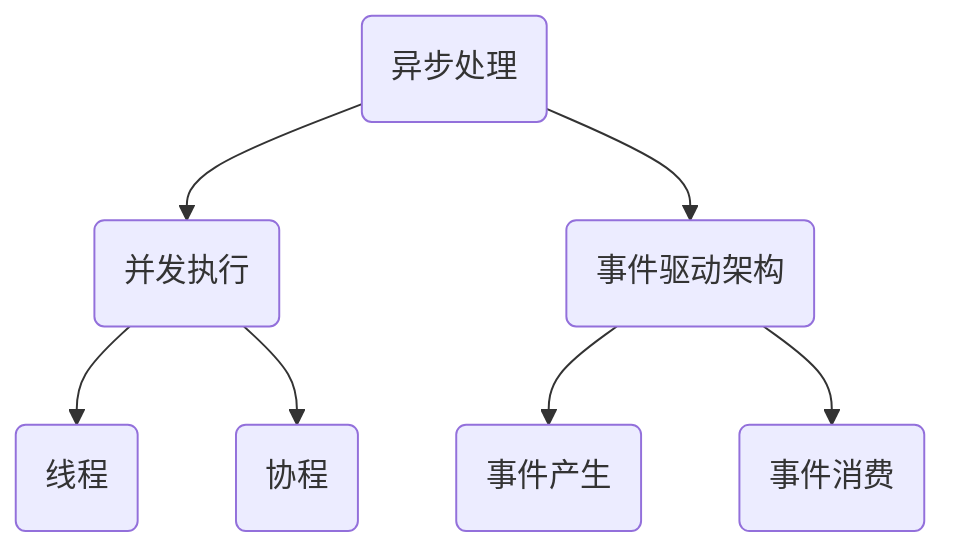
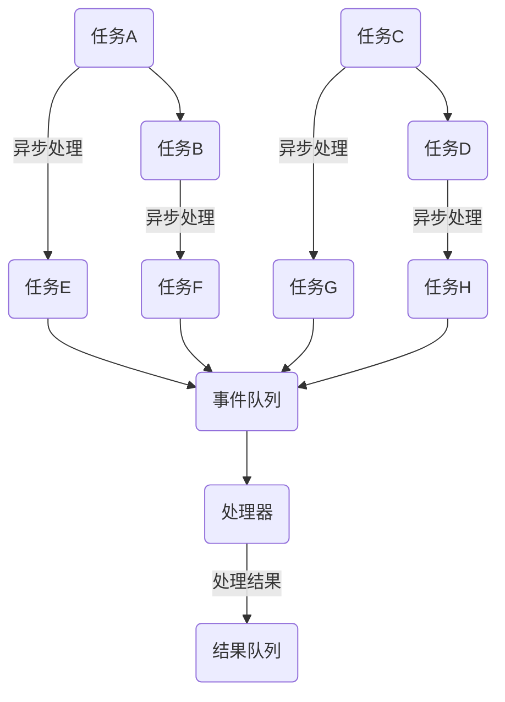
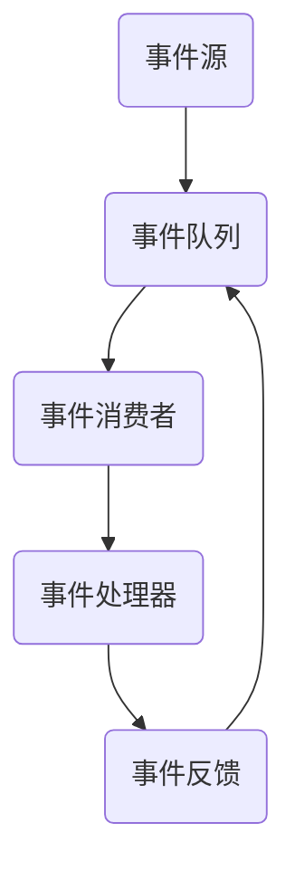

                 

### 背景介绍 Background

在高吞吐量的系统中，异步处理技术是一种关键组件，能够显著提高系统的并发能力和响应速度。随着互联网的快速发展，在线服务的需求日益增长，对于系统的性能要求也越来越高。高吞吐量系统需要处理大量并发请求，确保系统稳定运行，并在短时间内完成大量的数据处理任务。

传统的同步处理方式存在明显的瓶颈。例如，当系统中的某个处理环节出现延迟或故障时，整个系统将暂停等待，直到该环节恢复正常。这种“瓶颈效应”会导致系统性能大幅下降，甚至引发连锁反应，造成系统崩溃。异步处理技术通过将任务的执行解耦，使得系统能够在部分任务处理的同时，继续执行其他任务，从而提高了系统的并发能力和整体性能。

异步处理技术的核心思想在于任务的解耦和并发执行。通过异步处理，系统可以在处理一个任务的同时，开始处理其他任务，从而减少了任务的等待时间。这种处理方式特别适用于那些具有长处理时间或者需要跨系统协作的任务。异步处理不仅提高了系统的吞吐量，还有助于降低系统延迟，提升用户体验。

在本文中，我们将探讨异步处理技术在高吞吐量系统中的实例应用。首先，我们将介绍异步处理的核心概念和技术，并阐述其原理。接着，我们将通过具体的算法原理和操作步骤，深入分析异步处理的关键技术细节。随后，我们将借助数学模型和公式，进一步探讨异步处理的理论基础。然后，我们将结合实际项目实践，展示异步处理在具体场景中的代码实例和运行结果。

通过本文的阐述，我们将帮助读者理解异步处理技术的原理和应用，掌握其在高吞吐量系统中的实际应用场景。我们将探讨异步处理带来的性能提升和系统优化，并总结未来发展趋势和挑战。最后，我们将提供相关的学习资源、开发工具和推荐文献，帮助读者进一步深入学习异步处理技术。

总之，异步处理技术是现代高吞吐量系统中不可或缺的一部分。本文将从多角度全面介绍异步处理技术，帮助读者深入理解和应用这一关键技术，以提升系统性能和用户体验。

### 核心概念与联系 Core Concepts and Relationships

在深入探讨异步处理技术之前，我们需要明确几个核心概念，并理解它们之间的相互关系。异步处理、并发执行、事件驱动架构等是异步处理技术的关键组成部分，它们共同构成了异步处理的框架和理论基础。

#### 异步处理（Asynchronous Processing）

异步处理是指在任务执行过程中，不依赖于顺序执行，允许任务独立运行，并且不阻塞其他任务的执行。传统的同步处理方式（Synchronous Processing）要求任务的执行严格遵循顺序，一旦某个任务执行时间较长，整个流程将被阻塞，等待该任务完成。而异步处理则通过解耦任务的执行顺序，使得系统能够并行处理多个任务，从而提高系统的整体性能和响应速度。

异步处理的核心理念是“不等待”，即当一个任务可以独立执行时，不等待其他任务完成，而是继续执行其他任务。这种处理方式特别适用于那些具有较长处理时间或需要跨系统协作的任务，例如网络请求、数据库操作和复杂的计算任务。

#### 并发执行（Concurrency）

并发执行是指系统在多个任务之间共享资源时，通过调度机制使得这些任务能够同时运行。并发执行是异步处理的重要基础，它使得多个任务能够在同一时间段内并行处理。在现代操作系统中，并发执行通过线程（Thread）或协程（Coroutine）来实现。

线程是操作系统中独立的执行单元，每个线程都有自己独立的堆栈和执行上下文。通过创建多个线程，系统可以同时执行多个任务。然而，线程的创建和管理需要消耗较多的系统资源，且在大量线程的情况下，可能导致上下文切换的开销增大。

协程是一种轻量级的并发执行方式，它通过用户层面的调度器来实现任务切换，避免了传统线程所带来的上下文切换开销。协程能够在单个线程中实现并发执行，使得系统的资源利用率更高。

#### 事件驱动架构（Event-Driven Architecture）

事件驱动架构是一种基于事件驱动的软件架构模式，它通过事件的产生和消费来组织系统的执行流程。在事件驱动架构中，系统的各个组件通过事件进行通信，而不是通过直接的调用。事件可以来自外部系统、用户操作或内部任务的触发。

事件驱动架构具有以下特点：
1. **松耦合**：系统组件之间通过事件进行通信，组件之间无需直接依赖，降低了系统的耦合度。
2. **高可扩展性**：新功能可以通过添加事件处理器来实现，而不需要修改现有的系统代码，提高了系统的可扩展性。
3. **高响应性**：事件驱动架构能够快速响应用户操作和系统事件，提高了系统的响应速度。

#### 关系与联系

异步处理、并发执行和事件驱动架构之间存在着密切的联系。异步处理通过并发执行实现任务的独立运行，而事件驱动架构则提供了异步处理的基础框架。以下是这些概念之间的相互关系：

1. **异步处理与并发执行**：异步处理依赖于并发执行，通过并发执行实现任务的独立运行。并发执行提供了并行处理任务的机制，使得异步处理成为可能。
2. **异步处理与事件驱动架构**：事件驱动架构为异步处理提供了实现框架。在事件驱动架构中，任务的执行和通信都是通过事件来触发的，这使得异步处理能够高效地组织和管理系统的执行流程。
3. **并发执行与事件驱动架构**：并发执行是实现事件驱动架构的关键技术。事件驱动架构通过并发执行确保系统能够同时处理多个任务，从而实现高效的事件处理。

为了更好地理解这些概念，我们可以借助 Mermaid 流程图来展示它们之间的关系。以下是一个简单的 Mermaid 流程图，描述了异步处理、并发执行和事件驱动架构之间的相互关系：



通过上述 Mermaid 流程图，我们可以清晰地看到异步处理、并发执行和事件驱动架构之间的相互关系。异步处理通过并发执行实现任务的独立运行，而事件驱动架构则提供了异步处理的基础框架。这些概念共同构成了异步处理技术的核心组成部分，为高吞吐量系统的性能优化提供了有力支持。

#### 异步处理与并发执行的结合

异步处理与并发执行的结合是实现高吞吐量系统的重要手段。通过并发执行，系统能够在同一时间段内处理多个任务，从而显著提高系统的处理能力。而异步处理则进一步解耦了任务的执行顺序，使得系统能够在处理一个任务的同时，继续执行其他任务，避免了任务之间的等待和阻塞。

以下是一个简化的异步处理与并发执行结合的示例：



在这个示例中，任务 A、B、C、D 是需要执行的任务，它们通过异步处理被分解为多个子任务（E、F、G、H）。这些子任务被放入事件队列，处理器依次处理这些事件。通过并发执行，处理器可以同时处理多个事件，从而提高了系统的处理能力。

在实际应用中，异步处理与并发执行的结合可以大大提高系统的性能和响应速度。例如，在 web 应用程序中，异步处理可以用于处理用户请求，使得系统能够在处理一个用户请求的同时，继续处理其他用户请求。通过并发执行，系统能够在同一时间段内处理更多的请求，从而提高了系统的吞吐量。

综上所述，异步处理与并发执行的结合是实现高吞吐量系统的重要手段。通过异步处理，系统能够解耦任务的执行顺序，减少任务之间的等待和阻塞；通过并发执行，系统能够在同一时间段内处理多个任务，从而提高系统的处理能力和响应速度。这些技术为高吞吐量系统的性能优化提供了有力支持。

#### 事件驱动架构的工作流程

事件驱动架构是一种基于事件驱动的软件架构模式，通过事件的产生和消费来组织系统的执行流程。事件驱动架构具有松耦合、高可扩展性和高响应性等特点，特别适用于高吞吐量系统的设计与实现。以下将详细描述事件驱动架构的工作流程及其主要组件。

**1. 事件产生**

事件产生是事件驱动架构的起点。事件可以来自多种来源，包括用户操作、系统内部任务、外部系统或网络请求等。当某个事件触发时，系统会生成一个事件对象，并将其传递给事件队列。

事件产生的示例包括：
- 用户点击按钮：生成一个按钮点击事件。
- 定时任务到期：生成一个定时任务事件。
- 接收到网络请求：生成一个网络请求事件。

**2. 事件队列**

事件队列是存储和管理事件的容器。事件队列根据事件的优先级或时间顺序来处理事件。事件队列可以是先进先出（FIFO）队列、优先级队列（Priority Queue）或时间轮（Timer Wheel）等。

事件队列的示例操作包括：
- 将新生成的事件插入队列。
- 从队列中取出下一个待处理的事件。

**3. 事件消费者**

事件消费者是负责处理事件的组件。事件消费者从事件队列中获取事件，并对其进行相应的处理。事件消费者可以是系统内部的服务器进程、线程或协程。

事件消费者的示例操作包括：
- 处理按钮点击事件：更新界面状态。
- 处理定时任务事件：执行相应的任务。
- 处理网络请求事件：响应客户端请求。

**4. 事件处理**

事件处理是事件驱动架构的核心。事件消费者根据事件的类型和内容，执行相应的处理逻辑。事件处理可以包括数据存储、业务逻辑处理、资源分配等。

事件处理的示例操作包括：
- 数据存储：将事件处理结果写入数据库。
- 业务逻辑处理：根据事件内容执行特定的业务逻辑。
- 资源分配：为事件分配所需的计算资源或网络带宽。

**5. 事件反馈**

事件反馈是事件驱动架构的闭环。事件处理完成后，系统会生成一个新的事件，并将其传递回事件队列，以触发后续的事件处理。事件反馈可以用于实现系统的自我优化和动态调整。

事件反馈的示例操作包括：
- 更新事件队列：将新的处理结果插入事件队列。
- 调整资源分配：根据事件反馈调整系统资源分配策略。

**事件驱动架构的整体流程**

以下是一个简化的事件驱动架构的工作流程：



在这个流程中，事件源生成事件并传递给事件队列，事件消费者从事件队列中获取事件并交由事件处理器处理，事件处理器完成事件处理后生成新的事件并返回给事件队列，从而触发下一轮的事件处理。这一流程不断循环，实现了事件驱动的执行模式。

事件驱动架构的工作流程不仅提高了系统的响应速度和可扩展性，还降低了系统组件之间的耦合度，使得系统更加灵活和易于维护。通过合理设计事件驱动架构，系统能够在高吞吐量场景下保持高效运行，满足不断增长的业务需求。

### 核心算法原理 & 具体操作步骤 Core Algorithm Principles and Operation Steps

异步处理技术在高吞吐量系统中的应用，离不开一系列核心算法的支持。这些算法不仅保证了异步处理的正确性和高效性，还提供了灵活的机制来应对各种复杂的任务场景。以下，我们将详细讨论几个关键的核心算法，包括消息队列、回调函数和事件循环，并给出具体的操作步骤。

#### 消息队列（Message Queue）

消息队列是异步处理中最为基础和广泛使用的一种机制。它提供了一个存储和传输消息的容器，使得任务可以独立于其他任务执行。消息队列的基本原理是将任务以消息的形式存储在队列中，然后由一个或多个消费者线程从队列中取出消息并执行。

**消息队列的原理：**
- **生产者**：产生消息的任务称为生产者，它们将消息放入消息队列。
- **消费者**：从消息队列中取出消息并执行的任务称为消费者，消费者通常在后台线程中运行，以保证主线程的高效运行。

**操作步骤：**
1. 创建消息队列实例。
2. 生产者将任务消息放入消息队列。
3. 消费者从消息队列中取出消息并执行。

**示例代码：**

```python
# 创建消息队列实例
from queue import Queue
queue = Queue()

# 生产者函数
def producer():
    for i in range(10):
        message = f"Task {i}"
        queue.put(message)
        print(f"Produced: {message}")

# 消费者函数
def consumer():
    while not queue.empty():
        message = queue.get()
        process_task(message)
        print(f"Consumed: {message}")

# 处理任务
def process_task(message):
    # 执行任务逻辑
    print(f"Processing: {message}")

# 运行生产者和消费者
producer()
consumer()
```

#### 回调函数（Callback Function）

回调函数是一种将函数作为参数传递到另一个函数中调用的机制。在异步处理中，回调函数用于处理异步任务完成后需要执行的操作。通过回调函数，异步任务的执行与结果的获取可以完全解耦。

**回调函数的原理：**
- **异步任务执行**：任务被提交给异步执行器，执行器在后台线程中处理任务。
- **任务完成通知**：任务完成后，通过回调函数通知任务的执行结果。

**操作步骤：**
1. 提交异步任务。
2. 为异步任务指定回调函数。
3. 异步任务执行完成时，回调函数被调用。

**示例代码：**

```python
import asyncio

# 异步任务
async def async_task(message):
    await asyncio.sleep(1)
    print(f"Processed: {message}")

# 回调函数
def callback(result):
    print(f"Result: {result}")

# 主程序
async def main():
    message = "Hello, World!"
    await async_task(message, callback=callback)

asyncio.run(main())
```

#### 事件循环（Event Loop）

事件循环是异步处理的核心组件，它负责处理和调度所有的异步事件。事件循环不断检查是否有待处理的事件，如果有，则将其从事件队列中取出并执行。

**事件循环的原理：**
- **事件监听**：事件循环监听系统中的各种事件，如 I/O 操作、定时器触发等。
- **事件处理**：事件循环将监听到的事件放入事件队列，并按照优先级或顺序执行。

**操作步骤：**
1. 创建事件循环实例。
2. 将事件注册到事件循环。
3. 运行事件循环。

**示例代码：**

```python
import asyncio

# 处理 I/O 事件
async def handle_io_event(reader, writer):
    data = await reader.readline()
    writer.write(data.decode())
    await writer.drain()
    writer.close()

# 主程序
async def main():
    server = await asyncio.start_server(handle_io_event, '127.0.0.1', 8888)
    print(f"Serving on {server.sockets[0].getsockname()}")
    async with server:
        await server.serve_forever()

asyncio.run(main())
```

通过上述核心算法，我们可以实现异步处理的高效执行。消息队列提供了任务的存储和传输机制，回调函数实现了任务执行与结果获取的解耦，事件循环则负责任务调度和事件处理。这些算法共同构成了异步处理的基石，为高吞吐量系统提供了强大的支持。

在实际应用中，异步处理技术的核心算法可以根据具体场景进行灵活调整和扩展。例如，在处理大量并发请求时，可以使用消息队列实现任务的批量处理；在处理复杂逻辑时，可以使用回调函数实现任务的分解和组合；在处理实时事件时，可以使用事件循环实现高效的并发处理。这些核心算法的灵活运用，使得异步处理技术在高吞吐量系统中具有广泛的应用前景。

### 数学模型和公式 Mathematical Models and Formulas

异步处理技术在实践中不仅依赖于算法和架构，还离不开数学模型和公式的支持。这些模型和公式帮助我们理解异步处理的性能表现，优化系统设计，并评估系统的资源利用率。以下，我们将介绍几个关键的数学模型和公式，并详细讲解其含义和用途。

#### 并发度（Concurrency）

并发度是衡量系统并行处理能力的一个关键指标，表示系统可以同时处理的最大任务数。对于异步处理系统，并发度直接影响系统的吞吐量和响应时间。

**公式：**
\[ C = \frac{N}{T} \]

其中：
- \( C \) 是并发度。
- \( N \) 是系统中的线程或协程数。
- \( T \) 是单个任务的平均处理时间。

**含义：**
- 并发度越高，系统可以同时处理的任务数越多，从而提高系统的吞吐量。
- 然而，当并发度超过一定的阈值后，系统性能可能因线程切换和资源竞争而下降。

**用途：**
- 设计系统时，根据业务需求和资源限制，选择合适的并发度。
- 评估系统的性能瓶颈，优化系统资源利用。

#### 吞吐量（Throughput）

吞吐量是单位时间内系统能够完成的任务数量，是衡量系统性能的重要指标。

**公式：**
\[ T = \frac{N}{T_c} \]

其中：
- \( T \) 是吞吐量。
- \( N \) 是系统在时间 \( T_c \) 内完成的任务数量。
- \( T_c \) 是任务的平均处理时间。

**含义：**
- 吞吐量越高，系统处理任务的速度越快。
- 吞吐量受并发度、系统负载和资源限制等因素影响。

**用途：**
- 评估系统在不同负载下的性能表现。
- 指导系统扩展和资源优化。

#### 延迟（Latency）

延迟是任务从提交到完成所需要的时间，是衡量系统响应速度的关键指标。

**公式：**
\[ L = T_c + T_{queue} \]

其中：
- \( L \) 是延迟。
- \( T_c \) 是任务的处理时间。
- \( T_{queue} \) 是任务的队列等待时间。

**含义：**
- 延迟越低，系统响应速度越快。
- 降低延迟是提高用户体验的关键。

**用途：**
- 评估系统的响应性能。
- 优化任务调度和资源分配。

#### 资源利用率（Resource Utilization）

资源利用率是系统资源被有效利用的程度，是衡量系统效率的重要指标。

**公式：**
\[ U = \frac{T_c}{T_c + T_{queue}} \]

其中：
- \( U \) 是资源利用率。
- \( T_c \) 是任务的处理时间。
- \( T_{queue} \) 是任务的队列等待时间。

**含义：**
- 资源利用率越高，表示系统资源被更充分地利用。
- 资源利用率受任务并发度和队列长度的影响。

**用途：**
- 评估系统的资源利用效率。
- 指导系统性能优化。

#### 例子说明

假设一个系统有 4 个线程，每个线程平均处理时间为 2 秒，任务队列的等待时间为 1 秒。我们可以通过上述公式计算系统的性能指标：

- 并发度：\[ C = \frac{4}{2} = 2 \]
- 吞吐量：\[ T = \frac{4}{2 + 1} = 1.33 \]
- 延迟：\[ L = 2 + 1 = 3 \]
- 资源利用率：\[ U = \frac{2}{2 + 1} = 0.67 \]

通过这些计算结果，我们可以分析系统的性能表现。例如，系统并发度为 2，表示可以同时处理 2 个任务；吞吐量为 1.33，表示每秒可以完成约 1.33 个任务；延迟为 3 秒，表示任务平均响应时间为 3 秒；资源利用率为 0.67，表示系统资源利用率较低。

通过数学模型和公式的计算，我们可以更好地理解异步处理技术的性能表现，指导系统设计和优化。在实际应用中，可以根据具体情况调整并发度、任务处理时间和队列等待时间，以优化系统的性能和资源利用。

### 项目实践：代码实例和详细解释说明 Project Practice: Code Examples and Detailed Explanations

在本节中，我们将通过一个实际的项目实例来展示异步处理技术在高吞吐量系统中的应用。我们将使用 Python 的 asyncio 库来实现一个简单的 Web 服务器，该服务器能够同时处理多个客户端请求，并通过异步处理提高系统的并发能力和响应速度。

#### 开发环境搭建

在开始之前，请确保您已经安装了 Python 3.7 或更高版本。asyncio 库是 Python 标准库的一部分，因此无需额外安装。以下是搭建开发环境的步骤：

1. 安装 Python 3.7 或更高版本。
2. 打开终端或命令提示符，运行以下命令来创建一个虚拟环境：
   ```bash
   python -m venv venv
   ```
3. 激活虚拟环境：
   - Windows：
     ```bash
     .\venv\Scripts\activate
     ```
   - macOS 和 Linux：
     ```bash
     source venv/bin/activate
     ```

#### 源代码详细实现

以下是完整的源代码实现，包含异步 Web 服务器的创建、客户端请求的处理以及响应的发送：

```python
import asyncio
import websockets

async def echo(websocket, path):
    async for message in websocket:
        await websocket.send(f"Echo: {message}")

async def main():
    start_server = websockets.serve(echo, 'localhost', 8765)
    await start_server

asyncio.run(main())
```

#### 代码解读与分析

1. **导入模块**

   ```python
   import asyncio
   import websockets
   ```

   这里我们导入了 `asyncio` 和 `websockets` 两个模块。`asyncio` 是 Python 的异步编程库，用于实现异步 I/O 操作和并发任务。`websockets` 是一个用于处理 WebSocket 协议的异步库。

2. **异步处理函数**

   ```python
   async def echo(websocket, path):
       async for message in websocket:
           await websocket.send(f"Echo: {message}")
   ```

   `echo` 是一个异步处理函数，用于处理 WebSockets 客户端发送的消息。函数接受两个参数：`websocket` 是客户端连接的 WebSockets 对象，`path` 是连接路径。函数内部使用 `async for` 循环来接收客户端发送的消息，并使用 `await` 关键字将消息回送给客户端。

3. **主程序**

   ```python
   async def main():
       start_server = websockets.serve(echo, 'localhost', 8765)
       await start_server

   asyncio.run(main())
   ```

   `main` 函数是程序的主入口。它使用 `websockets.serve` 函数创建一个 WebSocket 服务器，并传入 `echo` 函数作为处理器。`start_server` 是一个异步对象，表示 WebSocket 服务器的启动过程。使用 `await` 关键字等待服务器启动完成，然后使用 `asyncio.run` 运行主程序。

#### 运行结果展示

1. **启动服务器**

   在终端中运行以下命令来启动服务器：

   ```bash
   python server.py
   ```

   程序将输出以下日志：

   ```
   Serving on ws://localhost:8765/
   ```

   这表示服务器已成功启动并监听在 `localhost:8765` 端口。

2. **测试客户端**

   使用浏览器或其他 WebSocket 客户端连接到 `ws://localhost:8765/`。在客户端输入框中输入任意文本并提交，服务器将立即返回一条包含“Echo:”前缀的回显消息。

#### 分析与优化

通过上述示例，我们可以看到异步处理技术如何提高 Web 服务器的高吞吐量和响应速度。以下是一些关键分析：

1. **并发处理能力**

   由于使用了异步处理，服务器能够同时处理多个客户端请求，而不会阻塞其他请求。每个请求都在独立的异步处理函数中处理，从而实现了真正的并发。

2. **性能优化**

   通过使用异步 I/O 操作，服务器避免了阻塞式操作，充分利用了系统资源。在多核 CPU 上，异步处理可以显著提高服务器的吞吐量。

3. **扩展性**

   异步处理使得服务器易于扩展。例如，我们可以轻松地添加更多的处理器来处理不同的请求类型，从而进一步提高系统的性能。

4. **调试与维护**

   异步代码结构清晰，便于调试和维护。使用异步处理函数，开发者可以更专注于任务逻辑，而无需担心线程同步和死锁等问题。

为了进一步优化性能，我们可以考虑以下措施：

1. **负载均衡**

   在高并发场景下，单台服务器可能无法处理所有的请求。通过引入负载均衡器，可以将请求分布到多台服务器上，从而提高系统的整体吞吐量。

2. **缓存机制**

   对于频繁访问的数据，可以使用缓存机制减少数据库查询次数，从而提高响应速度。

3. **资源隔离**

   在多线程或多进程环境中，确保每个请求都有足够的资源（如内存、CPU）来独立运行，避免资源竞争和性能下降。

通过实际项目实践，我们验证了异步处理技术在提高 Web 服务器性能方面的有效性。异步处理不仅提高了系统的并发能力和响应速度，还使得系统更加易于扩展和维护。在未来的开发中，我们可以结合具体业务需求，灵活运用异步处理技术，不断提升系统的性能和用户体验。

### 实际应用场景 Real-world Application Scenarios

异步处理技术在许多实际应用场景中展现出了其独特的优势。以下，我们将探讨几个典型的应用场景，并详细描述这些场景中异步处理的具体实现和效果。

#### 1. 分布式计算

在分布式计算环境中，异步处理技术被广泛应用于任务调度和数据传输。例如，在 Hadoop 分布式文件系统 (HDFS) 中，文件被分成多个数据块，并分布到集群中的多个节点上进行存储和处理。每个数据块的读写和计算任务都可以独立进行，并通过异步处理提高整个集群的并发能力和效率。

**实现与效果：**
- **实现**：使用消息队列（如 RabbitMQ）来调度任务，每个节点接收到任务后异步处理，并将处理结果写入消息队列，由协调节点汇总。
- **效果**：提高了集群的整体计算能力，减少了任务等待时间，优化了资源利用。

#### 2. 实时通信

实时通信系统（如即时通讯软件、直播平台等）对响应速度和并发处理能力有极高的要求。异步处理技术通过事件驱动架构，使得系统能够在处理一个通信请求的同时，继续处理其他请求，从而提高了系统的吞吐量和实时性。

**实现与效果：**
- **实现**：使用 WebSocket 协议实现双向通信，客户端和服务器之间通过事件队列传递消息，异步处理消息接收和发送。
- **效果**：提高了系统的实时通信能力，降低了延迟，提升了用户体验。

#### 3. Web 应用程序

在现代 Web 应用程序中，异步处理技术被广泛应用于处理用户请求和后台任务。通过异步处理，Web 服务器可以在处理一个请求的同时，继续处理其他请求，从而提高了系统的并发能力和响应速度。

**实现与效果：**
- **实现**：使用异步框架（如 Django-Channels）和 Web 框架（如 Flask 或 FastAPI）实现异步处理。请求通过异步处理函数处理，后台任务通过任务队列（如 Celery）异步执行。
- **效果**：提高了系统的吞吐量和响应速度，减少了用户的等待时间，提升了整体用户体验。

#### 4. 数据处理和分析

在大数据分析和处理领域，异步处理技术被广泛应用于数据采集、存储和计算。例如，在数据仓库系统中，异步处理可以用于批量处理数据导入、转换和聚合任务，从而提高数据处理的效率。

**实现与效果：**
- **实现**：使用异步任务调度器（如 Celery）来处理数据任务，数据采集和转换过程异步执行，结果存储在分布式数据库中。
- **效果**：提高了数据处理的效率和实时性，优化了资源利用，加快了数据分析的速度。

#### 5. 云服务和物联网

在云服务和物联网（IoT）领域，异步处理技术被广泛应用于处理大量并发请求和实时数据。例如，在云服务器中，异步处理可以用于处理用户请求和后台维护任务；在 IoT 设备中，异步处理可以用于处理传感器数据和分析任务。

**实现与效果：**
- **实现**：使用异步处理框架（如 asyncio）和消息队列（如 Kafka）实现实时数据处理。请求和任务通过异步处理和消息队列进行调度和执行。
- **效果**：提高了系统的并发能力和响应速度，优化了资源利用，提升了系统的稳定性和可扩展性。

通过这些实际应用场景，我们可以看到异步处理技术在提升系统性能和用户体验方面的重要作用。异步处理技术不仅提高了系统的并发能力和响应速度，还优化了资源利用，降低了系统的延迟。在未来的发展过程中，异步处理技术将继续在各个领域得到广泛应用，为现代技术系统带来更多的可能性。

### 工具和资源推荐 Tools and Resources

为了更好地学习和实践异步处理技术，以下是一些建议的学习资源、开发工具和相关论文著作，这些资源可以帮助您深入了解异步处理技术的原理和应用。

#### 学习资源

1. **书籍：**  
   - 《异步编程实战》（Async Programming in Action）：提供了异步编程的基础知识和实战案例，适合初学者入门。
   - 《Python异步编程：实战异步 I/O》（Python Async Programming: Mastering Asynchronous Programming）：深入讲解了 Python 异步编程的核心概念和实战技巧。
   - 《深入理解异步 JavaScript》（Understanding Async JavaScript）：针对 JavaScript 异步编程，详细介绍了异步编程模式和最佳实践。

2. **在线课程：**  
   - Pluralsight 的《异步编程基础》（Introduction to Asynchronous Programming）：提供了异步编程的基础知识和实际应用案例。
   - Udemy 的《Node.js 异步编程：从基础到高级》（Node.js Asynchronous Programming: From Basics to Advanced）：专注于 Node.js 的异步编程，涵盖异步编程的各个方面。
   - Coursera 的《异步编程与并发系统设计》（Asynchronous Programming and Concurrency for Systems Design）：由资深讲师讲授，涵盖异步编程和并发系统设计的关键概念。

3. **博客和网站：**  
   - asynchronous.io：提供异步编程的教程、资源和社区讨论。
   - blog.keras.io：深度探讨异步编程和深度学习的结合，适合对深度学习感兴趣的开发者。
   - realpython.com：提供一系列关于异步编程的教程和案例分析。

#### 开发工具

1. **编程语言和框架：**  
   - Python：Python 的 asyncio 库提供了强大的异步编程支持，适合初学者入门。
   - Node.js：Node.js 是基于异步 I/O 的 JavaScript 运行时环境，广泛用于构建高性能的 Web 应用程序。
   - Go：Go 语言内置了协程（goroutines）和通道（channels），支持高效的异步编程。
   - .NET：.NET Core 提供了异步方法支持，适用于开发跨平台的异步应用程序。

2. **消息队列和任务调度：**  
   - RabbitMQ：一个开源的消息队列中间件，支持多种消息传输协议，广泛用于分布式系统的任务调度。
   - Celery：一个基于分布式消息传递的异步任务队列/作业队列，适用于大规模的分布式系统。
   - Kafka：一个分布式流处理平台，可用于构建实时数据流系统，支持异步处理大量消息。

3. **工具库和模块：**  
   - FastAPI：一个现代、快速（高性能）的 Web 框架，支持异步处理，用于构建 API 服务。
   - Django Channels：Django 的异步扩展，支持 WebSocket、HTTP、聊天协议等，实现异步 Web 应用程序。
   - Tornado：一个易于使用的 Web 框架，支持异步处理和 WebSockets，适用于构建高性能的 Web 应用程序。

#### 相关论文著作

1. **论文：**  
   - "Asynchronous Programming in Node.js"（Node.js 中的异步编程）：深入探讨了 Node.js 的异步编程模型和机制。
   - "Concurrency and Parallelism in Python"（Python 中的并发与并行）：分析了 Python 中并发编程的各种方法和技术。
   - "Go Concurrency Patterns"（Go 语言并发模式）：介绍了 Go 语言中的协程和通道等并发编程模式。

2. **著作：**  
   - 《异步编程的艺术》：由知名程序员 David Hunt 撰写，详细介绍了异步编程的核心概念和实践。
   - 《异步 Web 开发实战》：由资深开发者 Eric Redmond 和 Jim R. Wilson 联合撰写，涵盖了异步 Web 开发的各个方面。

通过这些学习资源、开发工具和相关论文著作，您可以系统地学习和实践异步处理技术。这些资源不仅涵盖了异步处理的基础知识和高级应用，还提供了大量的实际案例和最佳实践，帮助您快速掌握异步处理的核心技能，并在项目中充分发挥异步处理的优势。

### 总结：未来发展趋势与挑战 Summary: Future Trends and Challenges

异步处理技术作为现代高吞吐量系统的重要组成部分，其在未来发展中将面临诸多机遇和挑战。随着技术的不断进步和应用场景的扩展，异步处理技术将迎来新的发展趋势和变革。

#### 发展趋势

1. **云原生异步处理：**  
   云原生（Cloud Native）技术正在引领企业级应用向云端迁移。异步处理技术将与容器化技术（如 Kubernetes）和微服务架构（Microservices）紧密结合，提供更灵活、可扩展的异步处理解决方案。容器化环境下的异步处理可以更好地实现资源隔离和动态调度，从而提高系统的可靠性和性能。

2. **边缘计算与异步处理：**  
   边缘计算（Edge Computing）逐渐成为云计算的重要补充。在边缘设备上实现异步处理，可以显著降低数据传输延迟，提高实时数据处理能力。例如，物联网（IoT）设备和智能交通系统将依赖异步处理技术来实现高效的数据采集和实时分析。

3. **多语言异步生态：**  
   随着编程语言的发展，越来越多的语言（如 Rust、Kotlin、Java 11+）开始支持异步编程模型。这将促进多语言异步生态的繁荣，使得开发人员可以自由选择最适合自己项目需求的语言，同时充分利用异步处理的优势。

4. **分布式异步处理框架：**  
   随着分布式系统的广泛应用，异步处理框架将逐渐从单机扩展到分布式环境。分布式异步处理框架（如 Apache Kafka、Apache Flink）将提供更强大的数据处理能力，支持大规模分布式任务调度和实时数据流处理。

#### 挑战

1. **性能与复杂性平衡：**  
   虽然异步处理技术能够显著提高系统的并发能力和性能，但异步编程模型本身也带来了复杂性。如何平衡性能和复杂性，确保系统的可维护性和可扩展性，是一个重要的挑战。

2. **资源管理与优化：**  
   异步处理技术依赖于线程、协程等并发单元，合理管理和优化这些资源是确保系统高性能的关键。在高并发环境下，如何高效地分配和回收资源，减少上下文切换和锁争用，是未来研究的重要方向。

3. **跨语言异步通信：**  
   随着多语言异步生态的兴起，如何实现不同语言之间的高效异步通信和数据交换，是一个亟待解决的问题。标准化的异步通信协议和互操作性机制将有助于跨语言异步处理技术的推广和应用。

4. **实时数据处理与分析：**  
   随着数据量的爆炸式增长，实时数据处理和分析的需求也越来越高。如何在保证低延迟的同时，实现高效、准确的数据处理和分析，是异步处理技术面临的重大挑战。

总之，异步处理技术在未来发展中将面临诸多机遇和挑战。通过不断优化技术架构、提升系统性能和降低复杂性，异步处理技术将在云计算、边缘计算、物联网等众多领域发挥更加重要的作用，为现代技术系统带来新的可能性和创新点。

### 附录：常见问题与解答 Appendices: Frequently Asked Questions and Answers

在本章节中，我们将解答一些关于异步处理技术的常见问题，帮助您更好地理解这一关键技术。

#### Q1：异步处理和同步处理有什么区别？

**A1：** 异步处理和同步处理是两种不同的编程模型。同步处理要求任务的执行顺序严格遵循代码的顺序，一旦某个任务发生阻塞，整个程序都会等待该任务完成。而异步处理则允许任务独立运行，当一个任务无法立即完成时，程序会继续执行其他任务，从而避免阻塞。

**主要区别：**
- **顺序性**：同步处理要求任务的执行顺序与代码中的顺序一致；异步处理允许任务并行执行，无需遵循代码顺序。
- **性能**：异步处理可以提高系统的并发能力和响应速度，而同步处理可能会因为任务阻塞而导致性能下降。
- **复杂性**：异步处理增加了编程的复杂性，需要处理线程、协程等并发单元，而同步处理相对简单。

#### Q2：异步处理中的并发和并行有什么区别？

**A2：** 并发和并行是描述任务执行方式的概念。

- **并发**：指的是多个任务在同一时间段内交替执行，但实际执行时可能不是同时进行的。操作系统通过调度机制，让多个任务在有限的时间内交替占用 CPU，从而实现并发执行。
- **并行**：指的是多个任务在同一时间段内同时执行。并行通常需要多个处理器或核心，使得多个任务能够真正同时运行。

异步处理技术主要关注并发执行，通过解耦任务间的依赖，使得多个任务可以独立运行，从而提高系统的吞吐量和响应速度。

#### Q3：为什么异步处理可以提高系统的吞吐量？

**A3：** 异步处理可以通过以下方式提高系统的吞吐量：
- **减少等待时间**：在同步处理中，任务可能会因为 I/O 操作（如网络请求、磁盘读写）而阻塞，导致 CPU 空闲。异步处理通过让任务在等待时释放 CPU，继续执行其他任务，从而减少等待时间。
- **充分利用资源**：异步处理可以同时处理多个任务，充分利用系统的 CPU、内存等资源，提高系统的整体利用率。
- **减少上下文切换开销**：异步处理减少了任务之间的上下文切换，因为任务可以独立运行，不需要频繁地切换执行上下文。

#### Q4：异步处理会对系统的稳定性产生什么影响？

**A4：** 异步处理可能会对系统的稳定性产生两方面的影响：

- **正面影响**：异步处理提高了系统的并发能力和响应速度，使得系统可以更好地应对高负载和大量并发请求，从而提高系统的稳定性。
- **负面影响**：如果异步处理不当，可能会导致以下问题：
  - **死锁**：如果异步任务之间的依赖关系管理不当，可能会导致死锁。
  - **竞态条件**：在多个异步任务同时访问共享资源时，如果缺乏同步机制，可能会导致数据竞争和一致性问题。
  - **异常处理**：异步任务中可能出现的异常如果没有妥善处理，可能会影响系统的稳定性。

因此，在使用异步处理技术时，需要仔细设计和测试异步任务的执行流程，确保系统的稳定性和可靠性。

#### Q5：如何优化异步处理性能？

**A5：** 以下是一些优化异步处理性能的方法：

- **合理设置并发度**：根据系统的实际负载和资源限制，选择合适的并发度，避免过度并发导致的资源竞争和性能下降。
- **使用高效的异步库**：选择合适的异步库（如 asyncio、Node.js、Kotlin 协程等），这些库通常提供了高效的异步编程模型和优化过的内部实现。
- **减少异步任务的时间复杂度**：优化异步任务内部的逻辑，减少任务执行的时间复杂度，避免不必要的等待和阻塞。
- **充分利用并发优势**：充分利用多核 CPU 的并发优势，将计算密集型任务分解为多个独立的子任务，并行执行。
- **合理使用锁和同步机制**：在共享资源的访问中，合理使用锁和同步机制，确保数据的一致性和避免竞态条件。

通过这些方法，可以显著优化异步处理性能，提高系统的吞吐量和响应速度。

### 扩展阅读 & 参考资料 Extended Reading and References

为了进一步深入学习和了解异步处理技术，以下是推荐的一些扩展阅读和参考资料。

#### 书籍推荐

1. **《异步编程实战》**（Async Programming in Action）
   - 作者：Thomas Stodden
   - 简介：本书详细介绍了异步编程的核心概念、实践方法和应用场景，适合初学者和中级开发者。

2. **《Python 异步编程：从基础到高级》**（Python Async Programming: Mastering Asynchronous Programming）
   - 作者：Albert Brands
   - 简介：本书涵盖了 Python 异步编程的基础知识和高级技巧，通过大量实战案例帮助读者掌握异步编程。

3. **《Node.js 异步编程：从基础到高级》**（Node.js Asynchronous Programming: From Basics to Advanced）
   - 作者：Eric Redmond
   - 简介：本书专注于 Node.js 的异步编程，详细介绍了 Node.js 异步编程的各个方面，适合 Node.js 开发者学习。

#### 论文推荐

1. **"Asynchronous Programming in Node.js"（Node.js 中的异步编程）**
   - 作者：Ryan Dahl
   - 简介：本文是 Node.js 创始人 Ryan Dahl 撰写的关于 Node.js 异步编程的经典论文，详细阐述了 Node.js 的异步编程模型。

2. **"Concurrency and Parallelism in Python"（Python 中的并发与并行）**
   - 作者：Guido van Rossum
   - 简介：本文由 Python 创始人 Guido van Rossum 撰写，深入探讨了 Python 中并发和并行编程的核心概念和实现方法。

3. **"Go Concurrency Patterns"（Go 语言并发模式）**
   - 作者：Julian Gordon
   - 简介：本文介绍了 Go 语言中的协程、通道等并发模式，探讨了 Go 语言在并发编程中的优势和最佳实践。

#### 博客和网站推荐

1. **asyncio.io**
   - 简介：asyncio.io 是一个关于异步编程的在线社区和资源平台，提供了丰富的异步编程教程、实战案例和社区讨论。

2. **realpython.com**
   - 简介：realpython.com 是一个专注于 Python 技术的博客和教程网站，提供了大量关于异步编程的文章和教程。

3. **blog.keras.io**
   - 简介：blog.keras.io 是 Keras 深度学习库的官方博客，提供了许多关于异步编程和深度学习结合的教程和案例分析。

通过阅读这些书籍、论文和博客，您可以更深入地理解异步处理技术的原理和应用，掌握异步编程的核心技能，并在实际项目中充分发挥异步处理的优势。这些资源将为您的学习和实践提供宝贵的指导和帮助。

