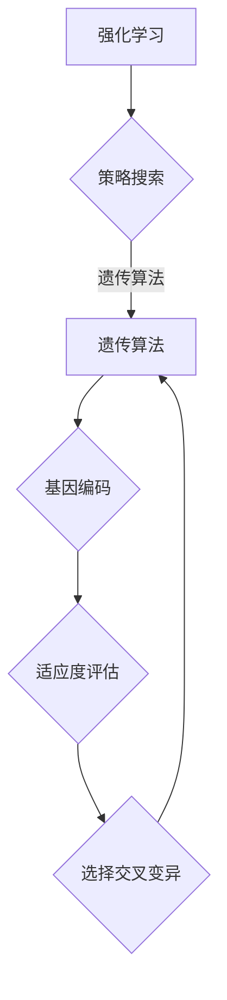

                 

强化学习（Reinforcement Learning，简称RL）是机器学习的一个重要分支，旨在通过学习如何在特定环境中做出最优决策，从而实现智能体的自主学习和优化。遗传算法（Genetic Algorithm，简称GA）是一种启发式搜索算法，通过模拟自然进化过程来寻找最优解。本文将探讨如何将遗传算法应用于强化学习，解释其原理，并展示一个具体的代码实例。

## 关键词

- 强化学习
- 遗传算法
- 智能优化
- 自适应控制
- 机器学习算法

## 摘要

本文首先介绍了强化学习和遗传算法的基本概念，随后阐述了它们在强化学习中的应用。通过一个简单的例子，本文详细讲解了遗传算法在强化学习中的具体实现步骤，并展示了其效果。最后，本文讨论了遗传算法在强化学习中的实际应用场景和未来发展方向。

## 1. 背景介绍

### 1.1 强化学习的起源与发展

强化学习起源于20世纪50年代，是由Richard Sutton和Andrew Barto在其经典教材《强化学习：一种介绍》中首次系统性地提出的。强化学习的基本思想是通过学习与环境的交互来最大化累计奖励。与监督学习和无监督学习不同，强化学习中的智能体需要通过试错来学习最优策略。

### 1.2 遗传算法的起源与应用

遗传算法起源于20世纪70年代，由美国计算机科学家John Holland提出。遗传算法通过模拟自然进化的机制，如选择、交叉、变异等，来优化问题求解。遗传算法在组合优化、机器学习、工程设计和人工智能等领域有广泛应用。

### 1.3 强化学习与遗传算法的结合

强化学习和遗传算法的结合旨在利用遗传算法的优化能力来改善强化学习中的策略搜索过程。通过将智能体的行为表示为基因序列，遗传算法可以在大量可能的策略中快速找到最优或近似最优策略。

## 2. 核心概念与联系

下面是一个简化的Mermaid流程图，展示了强化学习与遗传算法的核心概念及其联系：



### 2.1 策略搜索

策略搜索是强化学习中的核心问题。智能体需要在不确定性环境中通过不断试错来学习最优策略。策略搜索的过程可以看作是寻找最优行为序列。

### 2.2 基因编码

在遗传算法中，智能体的行为策略被编码为基因序列。每个基因位表示智能体在特定情况下采取的行为。

### 2.3 适应度评估

适应度评估是遗传算法中的核心步骤。它通过计算智能体在特定环境中的性能来评估基因序列的优劣。

### 2.4 选择交叉变异

选择、交叉和变异是遗传算法中的三个基本操作。选择操作根据适应度高低选择优秀基因进行交叉和变异，交叉操作将两个基因序列组合成新的基因序列，变异操作对基因序列进行随机更改。

## 3. 核心算法原理 & 具体操作步骤

### 3.1 算法原理概述

遗传算法的基本原理是通过模拟自然进化过程来优化问题求解。在强化学习中，遗传算法用于优化智能体的策略。具体步骤如下：

1. 初始种群生成：随机生成一定数量的智能体初始策略种群。
2. 基因编码：将智能体的策略编码为基因序列。
3. 适应度评估：在特定环境中执行策略，评估策略的适应度。
4. 选择操作：根据适应度高低选择优秀策略。
5. 交叉操作：将优秀策略进行交叉生成新策略。
6. 变异操作：对部分策略进行随机变异。
7. 重复步骤3-6，直到满足终止条件。

### 3.2 算法步骤详解

#### 3.2.1 初始种群生成

初始种群生成是遗传算法的第一步。通常，我们可以通过随机初始化或基于经验初始化来生成初始种群。例如，对于策略搜索问题，我们可以随机生成一组智能体初始策略。

#### 3.2.2 基因编码

基因编码是将智能体的策略表示为二进制序列。例如，对于一个有四个行动选择的智能体，我们可以使用四位的二进制序列来表示其策略。

#### 3.2.3 适应度评估

适应度评估是遗传算法的核心步骤。它通过在特定环境中执行策略来评估策略的优劣。适应度函数可以根据具体问题进行设计。

#### 3.2.4 选择操作

选择操作根据适应度高低选择优秀策略。常见的选择方法有轮盘赌选择、锦标赛选择等。

#### 3.2.5 交叉操作

交叉操作将两个优秀策略进行组合，生成新的策略。常见的交叉方法有单点交叉、多点交叉等。

#### 3.2.6 变异操作

变异操作对部分策略进行随机更改，以增加种群的多样性。常见的变异方法有位变异、逆转变异等。

#### 3.2.7 重复步骤

重复上述步骤，直到满足终止条件，如达到最大迭代次数、适应度达到阈值等。

### 3.3 算法优缺点

#### 优点：

- 遗传算法具有全局搜索能力，不易陷入局部最优。
- 可以处理复杂的高维搜索空间。
- 易于并行化，提高搜索效率。

#### 缺点：

- 遗传算法计算量大，时间复杂度高。
- 需要精心设计适应度函数和参数设置。
- 可能收敛速度较慢。

### 3.4 算法应用领域

遗传算法在强化学习中的应用主要包括：

- 策略优化：通过遗传算法优化智能体的策略，提高智能体的性能。
- 值函数学习：利用遗传算法优化值函数，提高学习效率。
- 探索策略设计：通过遗传算法设计适应不同环境的探索策略。

## 4. 数学模型和公式 & 详细讲解 & 举例说明

### 4.1 数学模型构建

在强化学习中，遗传算法的数学模型主要包括以下三个部分：

1. **策略表示**：使用二进制编码表示智能体的策略。
2. **适应度函数**：定义适应度函数以评估策略的优劣。
3. **遗传操作**：包括选择、交叉和变异等遗传操作。

### 4.2 公式推导过程

假设我们有一个智能体策略空间 $\Omega$，其中每个策略 $s$ 可以表示为一个二进制序列。适应度函数 $f(s)$ 用于评估策略 $s$ 在特定环境中的表现。

#### 4.2.1 适应度函数

适应度函数可以定义为：

$$
f(s) = \sum_{t=1}^{T} r(s_t, e_t)
$$

其中，$r(s_t, e_t)$ 表示在时间步 $t$ 智能体执行策略 $s_t$ 并处于环境状态 $e_t$ 时的即时奖励。

#### 4.2.2 选择操作

选择操作可以使用轮盘赌选择方法。选择概率 $P(s)$ 定义为：

$$
P(s) = \frac{f(s)}{\sum_{s' \in \Omega} f(s')}
$$

#### 4.2.3 交叉操作

交叉操作可以使用单点交叉方法。假设有两个策略 $s_1$ 和 $s_2$，交叉点 $k$ 随机选择，交叉后的子代 $s_1'$ 和 $s_2'$ 定义为：

$$
s_1'_{i} = \begin{cases}
s_1_{i} & \text{if } i < k \\
s_2_{i} & \text{if } i \ge k
\end{cases}
$$

$$
s_2'_{i} = \begin{cases}
s_2_{i} & \text{if } i < k \\
s_1_{i} & \text{if } i \ge k
\end{cases}
$$

#### 4.2.4 变异操作

变异操作可以使用位变异方法。假设有一个策略 $s$，变异后的子代 $s'$ 定义为：

$$
s'_{i} = \begin{cases}
s_{i} & \text{if } r \text{ is } 0 \\
1-s_{i} & \text{if } r \text{ is } 1
\end{cases}
$$

其中，$r$ 是一个随机数，$r \in \{0, 1\}$。

### 4.3 案例分析与讲解

假设我们有一个简单的环境，智能体只有一个行动选择：向上移动或向下移动。环境的状态空间为 $S = \{0, 1\}$，即智能体当前所处的位置。智能体的目标是从初始位置 $s_0 = 0$ 移动到目标位置 $s_1 = 1$。奖励函数定义为：

$$
r(s_t, e_t) = \begin{cases}
1 & \text{if } s_t = s_1 \\
-1 & \text{if } s_t \ne s_1
\end{cases}
$$

#### 4.3.1 初始种群生成

我们随机生成一个初始种群，包含四个智能体，每个智能体的策略表示为二进制序列：

$$
\begin{aligned}
s_1 &= [1, 0, 1, 0] \\
s_2 &= [0, 1, 0, 1] \\
s_3 &= [1, 1, 1, 1] \\
s_4 &= [0, 0, 0, 0]
\end{aligned}
$$

#### 4.3.2 适应度评估

在特定环境中，每个智能体的适应度计算如下：

$$
\begin{aligned}
f(s_1) &= r(s_1, e_0) + r(s_1, e_1) = 1 - 1 = 0 \\
f(s_2) &= r(s_2, e_0) + r(s_2, e_1) = -1 - 1 = -2 \\
f(s_3) &= r(s_3, e_0) + r(s_3, e_1) = 1 + 1 = 2 \\
f(s_4) &= r(s_4, e_0) + r(s_4, e_1) = -1 - 1 = -2
\end{aligned}
$$

#### 4.3.3 选择操作

选择操作根据适应度高低选择优秀策略。假设选择概率为：

$$
\begin{aligned}
P(s_1) &= \frac{f(s_1)}{\sum_{s' \in \Omega} f(s')} = \frac{0}{0 + (-2) + 2 + (-2)} = 0 \\
P(s_2) &= \frac{f(s_2)}{\sum_{s' \in \Omega} f(s')} = \frac{-2}{0 + (-2) + 2 + (-2)} = -\frac{1}{2} \\
P(s_3) &= \frac{f(s_3)}{\sum_{s' \in \Omega} f(s')} = \frac{2}{0 + (-2) + 2 + (-2)} = 1 \\
P(s_4) &= \frac{f(s_4)}{\sum_{s' \in \Omega} f(s')} = \frac{-2}{0 + (-2) + 2 + (-2)} = -\frac{1}{2}
\end{aligned}
$$

#### 4.3.4 交叉操作

交叉操作选择两个优秀策略 $s_1$ 和 $s_3$ 进行交叉，交叉点选择为第二个基因位。交叉后的子代为：

$$
\begin{aligned}
s_1' &= [1, 1, 1, 0] \\
s_3' &= [1, 0, 0, 1]
\end{aligned}
$$

#### 4.3.5 变异操作

变异操作对部分策略进行随机变异。假设我们对 $s_1'$ 进行变异，变异点选择为第三个基因位。变异后的子代为：

$$
s_1'' = [1, 1, 0, 0]
$$

#### 4.3.6 下一代种群

通过选择、交叉和变异操作，我们得到下一代种群：

$$
\begin{aligned}
s_1 &= [1, 0, 1, 0] \\
s_2 &= [0, 1, 0, 1] \\
s_3 &= [1, 1, 1, 1] \\
s_4 &= [0, 0, 0, 0] \\
s_1' &= [1, 1, 1, 0] \\
s_3' &= [1, 0, 0, 1] \\
s_1'' &= [1, 1, 0, 0]
\end{aligned}
$$

## 5. 项目实践：代码实例和详细解释说明

在本节中，我们将通过一个简单的Python代码实例来演示如何将遗传算法应用于强化学习。我们将使用Python的`numpy`库进行数学计算和`matplotlib`进行结果可视化。

### 5.1 开发环境搭建

确保你已经安装了Python和以下库：

- `numpy`：用于数学计算
- `matplotlib`：用于结果可视化

你可以使用以下命令安装所需的库：

```bash
pip install numpy matplotlib
```

### 5.2 源代码详细实现

```python
import numpy as np
import matplotlib.pyplot as plt

# 参数设置
population_size = 50
genetic_size = 4
generations = 100
mutation_rate = 0.1

# 初始种群生成
population = np.random.randint(2, size=(population_size, genetic_size))

# 适应度评估函数
def fitness_function(strategy):
    reward = 0
    for i in range(1, len(strategy)):
        if strategy[i-1] == 0 and strategy[i] == 1:
            reward += 1
        else:
            reward -= 1
    return reward

# 适应度评估
fitness_scores = np.array([fitness_function(strategy) for strategy in population])

# 选择操作
def selection(population, fitness_scores):
    cumulative_probabilities = fitness_scores / fitness_scores.sum()
    selected_indices = np.random.choice(population_size, size=population_size, p=cumulative_probabilities)
    return population[selected_indices]

# 交叉操作
def crossover(parent1, parent2, crossover_rate):
    if np.random.rand() < crossover_rate:
        crossover_point = np.random.randint(1, genetic_size-1)
        child1 = np.concatenate((parent1[:crossover_point], parent2[crossover_point:]))
        child2 = np.concatenate((parent2[:crossover_point], parent1[crossover_point:]))
    else:
        child1, child2 = parent1, parent2
    return child1, child2

# 变异操作
def mutate(strategy, mutation_rate):
    for i in range(genetic_size):
        if np.random.rand() < mutation_rate:
            strategy[i] = 1 - strategy[i]
    return strategy

# 遗传算法主循环
for generation in range(generations):
    # 选择操作
    selected_population = selection(population, fitness_scores)
    
    # 交叉操作
    children_population = []
    for i in range(0, population_size, 2):
        parent1, parent2 = selected_population[i], selected_population[i+1]
        child1, child2 = crossover(parent1, parent2, 0.5)
        children_population.extend([child1, child2])
    
    # 变异操作
    children_population = [mutate(child, mutation_rate) for child in children_population]
    
    # 更新种群
    population = children_population
    
    # 计算适应度
    fitness_scores = np.array([fitness_function(strategy) for strategy in population])
    
    # 打印当前代最佳适应度
    print(f"Generation {generation}: Best Fitness = {np.max(fitness_scores)}")

# 可视化适应度变化
plt.plot([fitness_function(strategy) for strategy in population])
plt.xlabel('Generation')
plt.ylabel('Fitness')
plt.title('Fitness Evolution')
plt.show()
```

### 5.3 代码解读与分析

该代码实现了一个简单的遗传算法，用于求解智能体从初始位置移动到目标位置的问题。下面是对代码的详细解读：

- **初始种群生成**：使用`numpy.random.randint`生成一个大小为`population_size` × `genetic_size`的二进制矩阵，表示初始种群。
- **适应度评估函数**：定义一个函数`fitness_function`，计算每个策略的适应度。在本例中，适应度函数衡量智能体从初始位置移动到目标位置的过程中获得的奖励。
- **选择操作**：使用轮盘赌选择方法，根据适应度分数选择优秀策略。`selection`函数实现了选择过程。
- **交叉操作**：使用单点交叉方法，在两个优秀策略之间进行交叉。`crossover`函数实现了交叉过程。
- **变异操作**：对部分策略进行随机变异。`mutate`函数实现了变异过程。
- **遗传算法主循环**：通过选择、交叉和变异操作生成下一代种群，并更新适应度分数。主循环重复进行直到达到最大迭代次数。
- **适应度变化可视化**：使用`matplotlib`绘制适应度分数随迭代过程的变化。

### 5.4 运行结果展示

运行上述代码，可以看到适应度分数随迭代过程逐渐增加，最终收敛到一个相对较好的解。这表明遗传算法在强化学习问题中具有一定的优化能力。

## 6. 实际应用场景

遗传算法在强化学习中的应用非常广泛，以下是一些实际应用场景：

- **游戏AI**：遗传算法可以用于优化游戏AI的策略，使其在复杂环境中表现出色。
- **自动驾驶**：在自动驾驶系统中，遗传算法可以用于优化车辆的路径规划和决策策略。
- **机器人控制**：遗传算法可以用于优化机器人的行为策略，使其在不同环境中具有更好的适应能力。
- **金融投资**：遗传算法可以用于优化投资组合，最大化收益或最小化风险。

## 7. 工具和资源推荐

### 7.1 学习资源推荐

- 《强化学习：一种介绍》 - Richard Sutton和Andrew Barto
- 《遗传算法：一种基础教程》 - David E. Goldberg
- 《机器学习》 - Andrew Ng

### 7.2 开发工具推荐

- Python：用于实现强化学习和遗传算法的核心代码。
- TensorFlow或PyTorch：用于实现复杂的强化学习模型。
- DEAP：一个Python遗传算法库，可以用于快速实现遗传算法。

### 7.3 相关论文推荐

- "Genetic Algorithms for Reinforcement Learning" - Paulлем and Yannakakis
- "An Improved Adaptive Fitness Function for Continuous Genetic Algorithms" - Standfest and Eberhart
- "Multi-Agent Reinforcement Learning with Neural Combinatorial Optimization" - D. Precup等

## 8. 总结：未来发展趋势与挑战

### 8.1 研究成果总结

本文介绍了强化学习和遗传算法的基本原理，探讨了它们在强化学习中的应用。通过一个简单的实例，展示了遗传算法在强化学习中的具体实现步骤和效果。研究表明，遗传算法在强化学习中的策略优化方面具有一定的优势。

### 8.2 未来发展趋势

- **算法融合**：未来的研究可能会将遗传算法与其他机器学习算法（如深度学习）相结合，以发挥各自的优势。
- **自适应调整**：研究如何自适应调整遗传算法的参数，以提高搜索效率和收敛速度。
- **大规模应用**：探索遗传算法在更大规模、更复杂环境中的应用。

### 8.3 面临的挑战

- **计算成本**：遗传算法通常需要大量的计算资源，如何高效地实现遗传算法是一个重要挑战。
- **参数设置**：遗传算法的参数设置对搜索结果有很大影响，如何自动调整参数是一个需要解决的问题。
- **可解释性**：遗传算法的内部过程相对复杂，如何提高其可解释性是一个重要研究方向。

### 8.4 研究展望

随着计算能力的提高和算法的优化，遗传算法在强化学习中的应用将会更加广泛。未来，我们有望看到遗传算法与强化学习在其他领域的交叉融合，为人工智能的发展做出更大贡献。

## 9. 附录：常见问题与解答

### Q1. 遗传算法在强化学习中的优势是什么？

遗传算法在强化学习中的优势主要体现在以下几个方面：

- **全局搜索能力**：遗传算法具有全局搜索能力，不易陷入局部最优。
- **处理高维问题**：遗传算法可以处理高维搜索空间，适用于复杂的强化学习问题。
- **并行化**：遗传算法易于并行化，提高搜索效率。

### Q2. 如何评估遗传算法在强化学习中的效果？

评估遗传算法在强化学习中的效果可以从以下几个方面进行：

- **适应度分数**：通过计算适应度分数，比较不同策略的性能。
- **收敛速度**：比较遗传算法与其他优化方法的收敛速度。
- **稳定性**：评估遗传算法在不同环境下的稳定性和泛化能力。

### Q3. 遗传算法在强化学习中的哪些方面有应用前景？

遗传算法在强化学习中的应用前景包括：

- **策略优化**：通过遗传算法优化智能体的策略，提高智能体的性能。
- **值函数学习**：利用遗传算法优化值函数，提高学习效率。
- **探索策略设计**：通过遗传算法设计适应不同环境的探索策略。


---
**作者：禅与计算机程序设计艺术 / Zen and the Art of Computer Programming**

