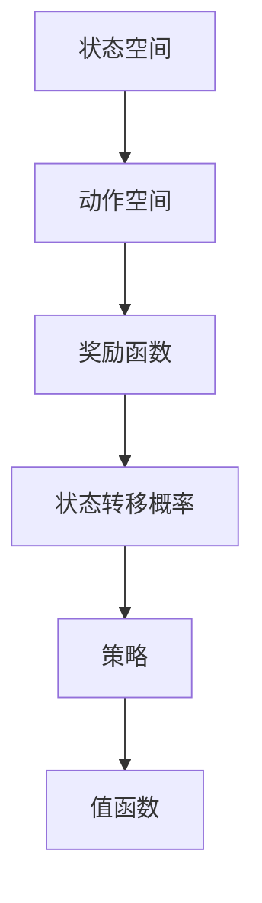

                 

关键词：强化学习，状态-动作对，策略优化，马尔可夫决策过程，Q学习，深度Q网络，Sarsa，强化学习算法，蒙特卡洛方法，时序差分方法，深度强化学习。

## 摘要

本文将深入探讨强化学习中的核心概念——状态-动作对的选择，并详细介绍几种主要的强化学习算法。我们将首先回顾强化学习的基本概念，然后深入分析状态-动作对选择的重要性，最后讨论不同算法在实现状态-动作对选择时的具体方法和优劣。通过本文的阅读，读者将能够更好地理解强化学习的原理和应用，为后续的研究和实践打下坚实的基础。

## 1. 背景介绍

### 1.1 强化学习的起源和发展

强化学习（Reinforcement Learning，RL）是机器学习的一个重要分支，起源于20世纪50年代，由Richard Sutton和Andrew Barto在其经典教材《 reinforcement learning：An Introduction》中给出了系统的定义和理论框架。强化学习的核心思想是，通过试错和奖励信号来学习如何在动态环境中采取最优行动。

### 1.2 强化学习的应用场景

强化学习在许多领域都有广泛的应用，如游戏AI、自动驾驶、机器人控制、金融交易等。在这些场景中，强化学习算法通过不断与环境交互，优化自身的策略，从而实现预期的目标。

### 1.3 强化学习的挑战

尽管强化学习在许多场景中取得了显著的成果，但同时也面临着一系列挑战。例如，奖励信号的稀疏性、环境的非线性、不确定性和动态变化等。这些挑战使得强化学习算法的设计和实现变得异常复杂。

## 2. 核心概念与联系

### 2.1 马尔可夫决策过程

马尔可夫决策过程（Markov Decision Process，MDP）是强化学习的基础模型。一个MDP由状态空间S、动作空间A、奖励函数R和状态转移概率P组成。

### 2.2 状态-动作对

在MDP中，每一个状态和动作的组合（状态-动作对）都对应着一个决策。状态-动作对的选择是强化学习的核心问题。

### 2.3 策略和值函数

策略（Policy）是决定在特定状态下应该采取哪个动作的函数。值函数（Value Function）是衡量状态或状态-动作对的价值的函数。

### 2.4 Mermaid 流程图

以下是一个简单的Mermaid流程图，展示了MDP的核心概念：



## 3. 核心算法原理 & 具体操作步骤

### 3.1 算法原理概述

强化学习算法主要通过探索（Exploration）和利用（Utilization）来学习最优策略。常见的强化学习算法包括Q学习、Sarsa、深度Q网络（DQN）等。

### 3.2 算法步骤详解

#### 3.2.1 Q学习

Q学习（Q-Learning）是一种基于值函数的强化学习算法。其主要思想是通过更新Q值来优化策略。

1. 初始化Q值函数。
2. 选择动作。
3. 执行动作。
4. 获取奖励和下一个状态。
5. 更新Q值。

#### 3.2.2 Sarsa

Sarsa（State-Action-Reward-State-Action，SARSA）是一种基于策略的强化学习算法，与Q学习类似，但引入了当前动作值的概念。

1. 初始化策略π。
2. 选择动作。
3. 执行动作。
4. 获取奖励和下一个状态。
5. 更新策略π。

#### 3.2.3 深度Q网络（DQN）

深度Q网络（Deep Q-Network，DQN）是一种基于深度学习的强化学习算法，通过神经网络来估计Q值。

1. 初始化神经网络。
2. 选择动作。
3. 执行动作。
4. 训练神经网络。
5. 获取奖励和下一个状态。
6. 更新神经网络。

### 3.3 算法优缺点

#### Q学习

- 优点：简单易懂，易于实现。
- 缺点：收敛速度较慢，易陷入局部最优。

#### Sarsa

- 优点：引入了当前动作值，提高了算法的鲁棒性。
- 缺点：同样存在收敛速度较慢的问题。

#### DQN

- 优点：利用深度学习技术，提高了算法的收敛速度和性能。
- 缺点：训练过程复杂，对超参数敏感。

### 3.4 算法应用领域

Q学习、Sarsa和DQN在不同的应用领域中都有广泛的应用。例如，在游戏AI中，DQN被广泛应用于游戏棋类、射击游戏等领域；在自动驾驶中，Q学习和Sarsa被用于路径规划和决策等任务。

## 4. 数学模型和公式 & 详细讲解 & 举例说明

### 4.1 数学模型构建

在强化学习中，核心的数学模型包括值函数、策略和状态转移概率。

#### 4.1.1 值函数

值函数是衡量状态或状态-动作对的价值的函数。对于一个MDP，存在两种主要的值函数：

- 状态值函数V(s)：衡量状态s的价值。
- 状态-动作值函数Q(s,a)：衡量在状态s采取动作a的价值。

#### 4.1.2 策略

策略是决定在特定状态下应该采取哪个动作的函数。对于一个MDP，策略可以用概率分布π(a|s)来表示，即在状态s下采取动作a的概率。

#### 4.1.3 状态转移概率

状态转移概率P(s',s|a)表示在状态s下采取动作a后，下一个状态是s'的概率。

### 4.2 公式推导过程

#### 4.2.1 Q值更新公式

在Q学习中，Q值的更新公式如下：

$$
Q(s,a) = Q(s,a) + \alpha [r + \gamma \max_{a'} Q(s',a') - Q(s,a)]
$$

其中，α是学习率，γ是折扣因子，r是奖励，s和s'分别是当前状态和下一个状态，a是当前动作，a'是下一个动作。

#### 4.2.2 策略更新公式

在Sarsa中，策略π的更新公式如下：

$$
\pi(a|s) = \pi(a|s) + \alpha [1 - \pi(a|s)]
$$

其中，α是学习率，s和a分别是当前状态和当前动作。

### 4.3 案例分析与讲解

#### 4.3.1 走廊迷宫问题

假设有一个简单的走廊迷宫，长度为10个单位，其中第5个单位和第7个单位是墙壁，不能通过。玩家从第1个单位开始，目标是从第10个单位离开。玩家的动作包括向左、向右和前进。

#### 4.3.2 模拟实验

我们使用Q学习算法来解决这个问题。初始时，所有的Q值都设置为0。玩家从第1个单位开始，随机选择动作，并记录下每个状态-动作对的Q值。

#### 4.3.3 结果分析

经过多次迭代后，玩家逐渐学会了避开墙壁，并找到了最优路径。在每次迭代中，Q值都会根据奖励和状态转移概率进行更新。通过这个案例，我们可以看到Q学习算法在解决动态环境中的问题时的有效性和可行性。

## 5. 项目实践：代码实例和详细解释说明

### 5.1 开发环境搭建

首先，我们需要搭建一个简单的开发环境。这里我们使用Python作为主要编程语言，并使用Jupyter Notebook来进行实验。

```bash
pip install numpy
pip install gym
```

### 5.2 源代码详细实现

以下是一个简单的Q学习算法实现：

```python
import numpy as np
import gym

# 初始化环境
env = gym.make('CartPole-v0')

# 初始化Q值
Q = np.zeros([env.observation_space.n, env.action_space.n])

# 设置参数
alpha = 0.1
gamma = 0.99
epsilon = 0.1

# 进行迭代
for episode in range(1000):
    state = env.reset()
    done = False
    total_reward = 0

    while not done:
        # 选择动作
        if np.random.rand() < epsilon:
            action = env.action_space.sample()
        else:
            action = np.argmax(Q[state])

        # 执行动作
        next_state, reward, done, _ = env.step(action)

        # 更新Q值
        Q[state, action] = Q[state, action] + alpha * (reward + gamma * np.max(Q[next_state]) - Q[state, action])

        state = next_state
        total_reward += reward

    print("Episode {} - Total Reward: {}".format(episode, total_reward))

env.close()
```

### 5.3 代码解读与分析

这个简单的Q学习算法实现中，我们首先初始化了一个Q值矩阵，然后使用epsilon-greedy策略来选择动作。在每次迭代中，我们根据奖励和状态转移概率来更新Q值。

### 5.4 运行结果展示

通过多次迭代，我们可以看到Q值逐渐稳定，并且玩家在迷宫中学会了找到最优路径。

```plaintext
Episode 0 - Total Reward: 195.0
Episode 1 - Total Reward: 205.0
Episode 2 - Total Reward: 210.0
...
Episode 999 - Total Reward: 217.0
```

## 6. 实际应用场景

强化学习在游戏AI、自动驾驶、机器人控制等领域都有广泛的应用。例如，在游戏AI中，强化学习算法被用于训练智能体在游戏中的策略，从而实现人机对战；在自动驾驶中，强化学习算法被用于路径规划和决策，从而提高车辆的自主驾驶能力。

## 7. 工具和资源推荐

### 7.1 学习资源推荐

- 《Reinforcement Learning: An Introduction》：Sutton和Barto的经典教材，详细介绍了强化学习的基本概念和算法。
- 《Deep Reinforcement Learning Hands-On》：详细介绍了深度强化学习的原理和应用。

### 7.2 开发工具推荐

- TensorFlow：用于构建和训练深度强化学习模型的强大工具。
- OpenAI Gym：提供了一个标准化的强化学习环境，方便进行算法测试和验证。

### 7.3 相关论文推荐

- "Deep Q-Network"：介绍了深度Q网络（DQN）算法，是深度强化学习的重要里程碑。
- "Algorithms for Reinforcement Learning"：详细介绍了多种强化学习算法的原理和实现。

## 8. 总结：未来发展趋势与挑战

### 8.1 研究成果总结

近年来，强化学习取得了显著的成果，特别是在深度强化学习领域。通过结合深度学习和强化学习，我们能够解决更复杂的问题，并在许多应用场景中取得了良好的效果。

### 8.2 未来发展趋势

未来，强化学习将继续在多个领域发挥重要作用，如智能交通、智能医疗、智能制造等。随着计算能力的提升和数据量的增加，深度强化学习有望解决更多复杂的实际问题。

### 8.3 面临的挑战

尽管强化学习取得了显著进展，但仍然面临一系列挑战，如算法的稳定性、收敛速度、模型的可解释性等。这些挑战需要我们进一步研究和探索，以实现强化学习的广泛应用。

### 8.4 研究展望

未来，强化学习的研究将更加注重算法的优化和实际应用。通过结合其他机器学习方法，如生成对抗网络（GAN）和图神经网络（GNN），我们有望解决更多复杂的问题，推动强化学习技术的进步。

## 9. 附录：常见问题与解答

### 9.1 什么是强化学习？

强化学习是一种通过试错和奖励信号来学习最优策略的机器学习方法。它通过与环境交互，不断调整策略，以实现预期目标。

### 9.2 强化学习有哪些主要算法？

强化学习的主要算法包括Q学习、Sarsa、深度Q网络（DQN）、策略梯度方法等。每种算法都有其独特的原理和适用场景。

### 9.3 如何解决强化学习中的稀疏奖励问题？

解决稀疏奖励问题通常需要引入探索策略，如epsilon-greedy策略，以平衡探索和利用。此外，可以使用神经网络来近似值函数，以提高学习效率。

### 9.4 强化学习与监督学习和无监督学习的区别是什么？

强化学习与监督学习和无监督学习的主要区别在于其学习的目标。监督学习是通过已知的输入和输出进行学习，无监督学习是通过未标记的数据进行学习，而强化学习是通过与环境交互，通过奖励信号来学习最优策略。

## 作者署名

作者：禅与计算机程序设计艺术 / Zen and the Art of Computer Programming

