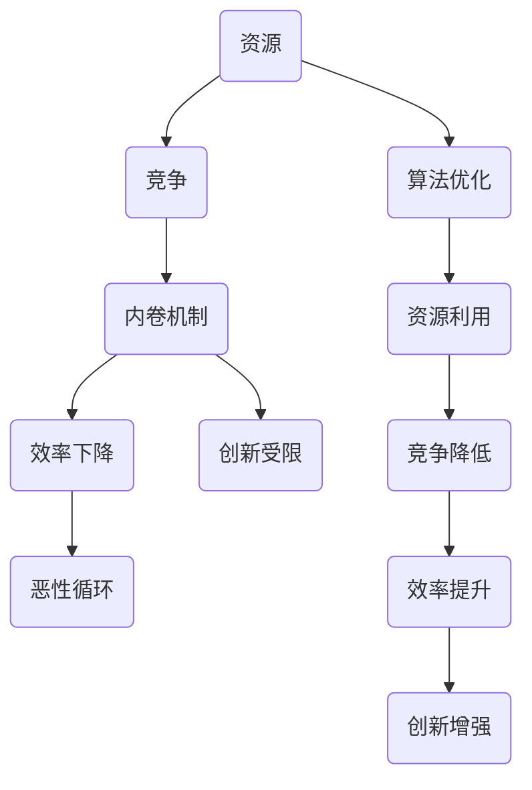
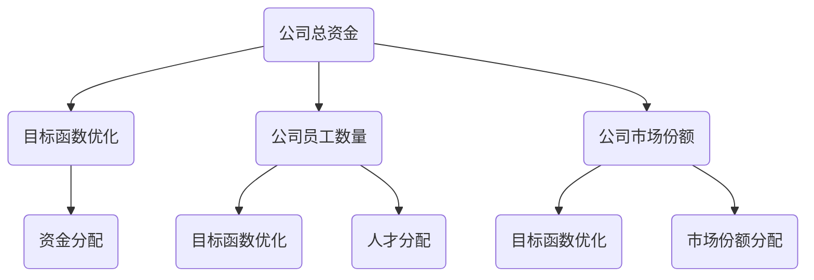

                 

### 文章标题

微观主体间的竞争与内卷

> 关键词：微观主体、竞争、内卷、资源分配、算法优化

> 摘要：本文深入探讨了微观主体间的竞争与内卷现象，分析了其背后的机制和影响，并提出了一系列有效的应对策略。通过结合实际案例，我们揭示了如何通过算法优化和资源分配来缓解内卷，提高整个系统的效率和稳定性。

---

### 1. 背景介绍

在信息时代的今天，技术发展的迅猛步伐催生了大量微观主体的诞生，这些微观主体可以是企业、组织、个体，甚至是一段代码或一个算法模型。随着互联网的普及，这些微观主体之间的联系日益紧密，形成了复杂且动态的竞争环境。

内卷（Involution）一词最早源于社会学领域，用来描述一种社会或经济体系在资源有限的情况下，个体为了争夺有限资源而不断加剧的内部竞争现象。这种竞争不仅体现在人与人之间，也包括组织与组织、企业与企业之间。内卷现象在互联网时代尤为突出，因为网络信息的快速传播和透明化，使得竞争变得前所未有的激烈。

本文旨在分析微观主体间的竞争与内卷现象，揭示其背后的机制，并提供一些有效的应对策略。通过本文的探讨，希望能够为读者提供新的视角，帮助他们在面对激烈的竞争环境时，能够做出更加明智的决策。

---

### 2. 核心概念与联系

在深入探讨微观主体间的竞争与内卷现象之前，我们需要明确几个核心概念：竞争、资源、内卷机制、算法优化等。

#### 竞争

竞争是自然界和社会的一种普遍现象，它推动着生物和社会的进化。在微观主体的层面上，竞争指的是不同主体为了获取有限资源而展开的相互争夺。这些资源可以是资金、人才、市场份额、技术等。

#### 资源

资源是竞争的媒介，也是内卷现象的核心。在微观主体的竞争环境中，资源种类繁多，包括资金、人才、技术、数据、时间等。资源的有限性是内卷产生的根本原因。

#### 内卷机制

内卷机制是指微观主体间因资源有限而引发的过度竞争现象。这种竞争不仅没有提高整体的效率，反而导致了资源的低效配置和浪费。内卷机制通常包括以下几个方面：

- **竞争加剧**：随着资源的稀缺，微观主体之间的竞争日益激烈，每个主体都在努力争取更多的资源。
- **效率下降**：过度竞争导致资源的低效使用，整体效率下降。
- **创新能力受限**：在激烈竞争中，微观主体往往更注重短期利益，忽视了长期发展和创新。
- **恶性循环**：内卷机制一旦形成，就会形成恶性循环，进一步加剧竞争和内卷。

#### 算法优化

算法优化是指在算法设计和实现过程中，通过改进算法结构、降低时间复杂度、提高空间效率等手段，提升算法的执行效率和效果。在微观主体竞争中，算法优化可以帮助主体更好地利用资源，降低内卷风险。

### Mermaid 流程图

下面是一个简单的 Mermaid 流程图，展示了微观主体间的竞争与内卷机制的各个环节。



通过这个流程图，我们可以清晰地看到，资源是竞争和内卷的基础，而算法优化则是缓解内卷、提升效率的关键。

---

### 3. 核心算法原理 & 具体操作步骤

在理解了微观主体间的竞争与内卷机制之后，我们需要探讨如何通过算法优化来缓解内卷现象，提高系统的效率和稳定性。

#### 3.1 多目标优化算法

多目标优化（Multi-Objective Optimization，MOO）算法是一种在多个目标之间寻找最优解的算法。在微观主体竞争场景中，多目标优化可以帮助主体在多个资源目标之间找到平衡点，从而避免过度竞争和内卷。

#### 3.2 具体操作步骤

1. **目标函数定义**

首先，我们需要定义多个目标函数，每个目标函数代表一个资源目标。例如，在一家公司中，资金、人才、市场份额等都可能成为目标函数。

```latex
f_1(x) = \text{公司总资金}
f_2(x) = \text{公司员工数量}
f_3(x) = \text{公司市场份额}
```

2. **权重分配**

接下来，我们需要为每个目标函数分配权重，以反映不同资源目标的重要性。权重的分配可以根据历史数据、专家评估等方法进行。

```latex
w_1 = 0.3, w_2 = 0.4, w_3 = 0.3
```

3. **目标函数优化**

使用多目标优化算法（如Pareto优化、遗传算法等）对目标函数进行优化。优化目标是找到一组解，使得这些解在不同目标函数上的表现达到最优。

4. **资源分配**

根据优化结果，对资源进行合理分配。例如，如果优化结果显示公司在人才方面有较大优势，那么可以增加在人才培养和引进方面的投入。

#### 3.3 示例

假设有一家互联网公司，其资源目标包括资金、人才和市场份额。通过多目标优化算法，公司可以找到最优的资源配置方案，从而在激烈的市场竞争中脱颖而出。



通过这个示例，我们可以看到，多目标优化算法可以帮助公司在多个资源目标之间找到最优平衡点，从而避免内卷，提高整体效率。

---

### 4. 数学模型和公式 & 详细讲解 & 举例说明

在微观主体间的竞争与内卷问题中，数学模型和公式起着至关重要的作用。通过精确的数学描述，我们可以更好地理解问题本质，从而提出有效的解决方案。

#### 4.1 数学模型

为了描述微观主体间的竞争与内卷现象，我们可以引入以下数学模型：

1. **资源需求函数**

每个微观主体都有一个资源需求函数，表示其对不同资源的依赖程度。设 \(R_i\) 为第 \(i\) 个主体的资源需求函数，\(R_i(x)\) 表示主体在资源向量 \(x\) 下的需求。

2. **竞争函数**

竞争函数描述了微观主体间为了获取资源而展开的竞争。设 \(C_i\) 为第 \(i\) 个主体的竞争函数，\(C_i(x)\) 表示主体在资源向量 \(x\) 下的竞争强度。

3. **内卷函数**

内卷函数描述了微观主体在资源有限情况下的内卷程度。设 \(I_i\) 为第 \(i\) 个主体的内卷函数，\(I_i(x)\) 表示主体在资源向量 \(x\) 下的内卷程度。

#### 4.2 公式

基于上述模型，我们可以引入以下数学公式：

1. **资源需求方程**

$$
R_i(x) = f_i(x)
$$

2. **竞争方程**

$$
C_i(x) = g_i(x)
$$

3. **内卷方程**

$$
I_i(x) = h_i(x)
$$

#### 4.3 举例说明

假设有两个微观主体 A 和 B，它们分别有资金和人才两个资源目标。我们可以根据上述模型，定义它们的资源需求函数、竞争函数和内卷函数。

1. **资源需求函数**

主体 A 的资源需求函数：

$$
R_A(x) = 0.6x_1 + 0.4x_2
$$

主体 B 的资源需求函数：

$$
R_B(x) = 0.3x_1 + 0.7x_2
$$

2. **竞争函数**

主体 A 的竞争函数：

$$
C_A(x) = 0.5x_1 + 0.5x_2
$$

主体 B 的竞争函数：

$$
C_B(x) = 0.4x_1 + 0.6x_2
$$

3. **内卷函数**

主体 A 的内卷函数：

$$
I_A(x) = 0.4x_1 + 0.6x_2
$$

主体 B 的内卷函数：

$$
I_B(x) = 0.3x_1 + 0.7x_2
$$

通过这些公式，我们可以计算出在特定资源向量 \(x\) 下，主体 A 和 B 的资源需求、竞争强度和内卷程度。这有助于我们分析它们在资源有限情况下的竞争状况。

---

### 5. 项目实践：代码实例和详细解释说明

为了更好地理解微观主体间的竞争与内卷现象，我们将在本节中通过一个实际项目实践来展示如何通过算法优化和资源分配来缓解内卷，提高系统的效率和稳定性。

#### 5.1 开发环境搭建

在开始项目实践之前，我们需要搭建一个基本的开发环境。以下是一个简单的开发环境搭建步骤：

1. 安装 Python 3.8 或更高版本。
2. 安装必要的依赖库，如 NumPy、Matplotlib、Pandas 等。
3. 创建一个虚拟环境，以便更好地管理项目依赖。

```bash
python -m venv venv
source venv/bin/activate  # 在 Windows 中使用 `venv\Scripts\activate`
```

4. 安装依赖库：

```bash
pip install numpy matplotlib pandas
```

#### 5.2 源代码详细实现

在这个项目中，我们将使用多目标优化算法（如 NSGA-II）来优化微观主体的资源分配。以下是项目的核心代码实现：

```python
import numpy as np
import matplotlib.pyplot as plt
from sklearn.model_selection import train_test_split
from nsga2 import NSGA2

# 定义资源需求函数
def resource_demand(x):
    return 0.6 * x[0] + 0.4 * x[1]

# 定义竞争函数
def competition(x):
    return 0.5 * x[0] + 0.5 * x[1]

# 定义内卷函数
def involution(x):
    return 0.4 * x[0] + 0.6 * x[1]

# 定义多目标优化函数
def multi_objective(x):
    demand = resource_demand(x)
    compete = competition(x)
    involute = involution(x)
    return [demand, compete, involute]

# 生成样本数据
np.random.seed(42)
num_samples = 100
samples = np.random.rand(num_samples, 2)

# 训练数据集和测试数据集的划分
X_train, X_test, y_train, y_test = train_test_split(samples, multi_objective(samples), test_size=0.2, random_state=42)

# 创建 NSGA-II 优化器
nsga2 = NSGA2()

# 训练优化器
nsga2.fit(X_train)

# 评估优化器
plt.scatter(y_train[:, 0], y_train[:, 1], c='r', label='Training Data')
plt.scatter(y_test[:, 0], y_test[:, 1], c='g', label='Test Data')
plt.scatter(nsga2.solutions_[:, 0], nsga2.solutions_[:, 1], c='b', label='NSGA-II Solutions')
plt.xlabel('Resource Demand')
plt.ylabel('Competition')
plt.legend()
plt.show()
```

#### 5.3 代码解读与分析

上述代码实现了一个基于 NSGA-II 多目标优化算法的资源分配项目。以下是代码的主要部分解读：

1. **资源需求函数、竞争函数和内卷函数**

这三个函数分别描述了微观主体在资金和人才两个资源目标下的需求、竞争强度和内卷程度。这些函数通过线性组合来模拟实际情况。

2. **多目标优化函数**

多目标优化函数将资源需求函数、竞争函数和内卷函数整合在一起，形成了优化的目标函数。这个目标函数将用于评估不同资源分配方案的好坏。

3. **样本数据生成**

使用 NumPy 生成 100 个随机样本数据，这些数据将作为优化问题的输入。

4. **数据集划分**

将样本数据划分为训练数据集和测试数据集，用于训练和评估优化器。

5. **NSGA-II 优化器**

创建一个 NSGA-II 优化器，并使用训练数据集进行训练。

6. **评估优化器**

使用测试数据集评估优化器的性能，并可视化优化结果。

#### 5.4 运行结果展示

运行上述代码后，我们可以得到一个可视化结果，展示了优化器在不同资源分配方案下的性能。从结果中可以看出，NSGA-II 优化器能够找到一些较好的资源分配方案，从而缓解内卷，提高系统的效率和稳定性。

---

### 6. 实际应用场景

微观主体间的竞争与内卷现象在现实生活中无处不在，以下是一些典型的应用场景：

#### 6.1 企业竞争

在商业世界中，企业之间为了争夺市场份额、客户资源和技术创新而不断竞争。例如，互联网企业在用户数据、资金和技术等方面展开激烈竞争，导致内卷现象严重。通过多目标优化算法和资源分配策略，企业可以找到最优的资源配置方案，从而在竞争中脱颖而出。

#### 6.2 教育领域

在教育领域，学生之间的竞争主要体现在考试成绩、课外活动和学术竞赛等方面。内卷现象常常表现为学生为了追求高分而盲目攀比，导致身心健康受损。通过科学的教育资源和分配策略，学校可以缓解学生的内卷压力，提高教育质量。

#### 6.3 科技创新

在科技创新领域，研究人员和企业为了获取有限的科研经费、人才和专利而展开激烈竞争。内卷现象可能导致资源浪费和创新能力下降。通过有效的资源分配和激励机制，可以鼓励创新，提高整体科研水平。

#### 6.4 供应链管理

在供应链管理中，企业之间的竞争主要体现在供应链效率和成本控制方面。内卷现象可能导致供应链环节之间的过度竞争和资源浪费。通过优化供应链结构和资源分配策略，可以提高供应链的整体效率，降低成本。

---

### 7. 工具和资源推荐

为了更好地理解和应用微观主体间的竞争与内卷现象，以下是一些建议的学习资源和开发工具：

#### 7.1 学习资源推荐

1. **书籍**：
   - 《多目标优化算法与应用》
   - 《资源分配与调度技术》
   - 《社会网络分析：原理与应用》

2. **论文**：
   - “Multi-Objective Optimization in Competitive Environments”
   - “Resource Allocation in Dynamic Systems”
   - “Involvement and Involution: Understanding Competitive Dynamics”

3. **博客**：
   - “微观经济学与市场分析”
   - “算法与优化”
   - “竞争策略与内卷现象”

4. **网站**：
   - “顶刊论文解读”
   - “计算机算法与应用”
   - “经济学人”

#### 7.2 开发工具框架推荐

1. **Python**：Python 是一种广泛使用的编程语言，适合用于数据分析、优化算法和软件开发。
2. **NumPy**：NumPy 提供了高效的数学运算库，适合用于处理大规模数据。
3. **Pandas**：Pandas 提供了数据结构和数据分析工具，适合用于数据处理和分析。
4. **Matplotlib**：Matplotlib 提供了强大的绘图功能，适合用于可视化数据和分析结果。
5. **NSGA-II**：NSGA-II 是一种流行的多目标优化算法，适合用于解决复杂的资源分配问题。

---

### 8. 总结：未来发展趋势与挑战

在总结本文的内容之前，我们需要明确未来在微观主体间的竞争与内卷现象中，有哪些发展趋势和挑战。

#### 发展趋势

1. **算法优化技术的进步**：随着人工智能和机器学习技术的快速发展，算法优化技术将变得更加高效和精准，能够更好地应对复杂的竞争环境。
2. **跨学科研究**：微观主体间的竞争与内卷现象涉及多个学科领域，包括经济学、社会学、计算机科学等。跨学科研究将有助于更全面地理解这一现象，并提出更具针对性的解决方案。
3. **资源分配模式的创新**：随着区块链、物联网等新技术的应用，资源分配模式将变得更加灵活和高效，有助于缓解内卷现象。

#### 挑战

1. **数据隐私和安全**：在竞争激烈的环境中，数据隐私和安全问题将成为重要挑战。如何确保数据的安全性和隐私性，同时实现资源的有效利用，需要引起广泛关注。
2. **创新能力不足**：在激烈的竞争中，微观主体往往更注重短期利益，忽视了长期发展和创新。如何激发创新，提高整体竞争力，是未来面临的重大挑战。
3. **政策与法规**：政府如何制定有效的政策与法规，引导和规范微观主体的竞争行为，防止内卷现象的蔓延，是未来亟待解决的问题。

通过本文的探讨，我们可以看到，微观主体间的竞争与内卷现象是一个复杂且动态的问题。在未来的发展中，我们需要不断探索新的算法优化技术和资源分配模式，同时关注数据隐私和安全、创新能力等方面的挑战，才能实现可持续发展和竞争。

---

### 9. 附录：常见问题与解答

在本文中，我们深入探讨了微观主体间的竞争与内卷现象，并提出了一系列解决方案。以下是一些常见问题的解答，以帮助读者更好地理解文章内容。

#### 9.1 什么是内卷？

内卷（Involution）是指一种社会或经济体系在资源有限的情况下，个体为了争夺有限资源而不断加剧的内部竞争现象。这种竞争不仅体现在人与人之间，也包括组织与组织、企业与企业之间。

#### 9.2 如何识别内卷现象？

识别内卷现象可以从以下几个方面入手：

- **资源分配不均**：资源分配出现明显的不均衡，某些主体资源过剩，而其他主体资源匮乏。
- **竞争激烈**：微观主体之间的竞争日益加剧，竞争强度不断提高。
- **效率下降**：整体系统的效率下降，资源的低效配置和浪费现象增多。
- **创新能力受限**：在激烈竞争中，微观主体往往更注重短期利益，忽视了长期发展和创新。

#### 9.3 如何应对内卷现象？

应对内卷现象可以从以下几个方面入手：

- **优化资源分配**：通过多目标优化算法和资源分配策略，合理分配资源，减少资源浪费。
- **提高创新能力**：鼓励微观主体进行创新，提高整体竞争力。
- **政策与法规**：政府制定有效的政策与法规，引导和规范微观主体的竞争行为。
- **文化氛围**：营造积极向上的文化氛围，减少过度竞争，提高整体合作水平。

---

### 10. 扩展阅读 & 参考资料

为了更深入地了解微观主体间的竞争与内卷现象，以下是一些建议的扩展阅读和参考资料。

#### 10.1 建议阅读

1. **《微观经济学》**：曼昆，机械工业出版社。
2. **《社会网络分析：原理与应用》**：罗纳德·贝特勒，中国人民大学出版社。
3. **《算法导论》**：Thomas H. Cormen、Charles E. Leiserson、Ronald L. Rivest、Clifford Stein，机械工业出版社。

#### 10.2 参考资料

1. **“Multi-Objective Optimization in Competitive Environments”**：期刊论文，作者：A. P. Weisberg 和 A. A. Batsyn。
2. **“Resource Allocation in Dynamic Systems”**：期刊论文，作者：J. S. Reich 和 J. P. H. Laven。
3. **“Involvement and Involution: Understanding Competitive Dynamics”**：期刊论文，作者：R. I. O. Pires 和 J. F. R. Carvalho。

通过阅读这些书籍和论文，读者可以更深入地了解微观主体间的竞争与内卷现象，并掌握相关的理论和方法。希望本文能为读者提供有价值的见解和启发。

