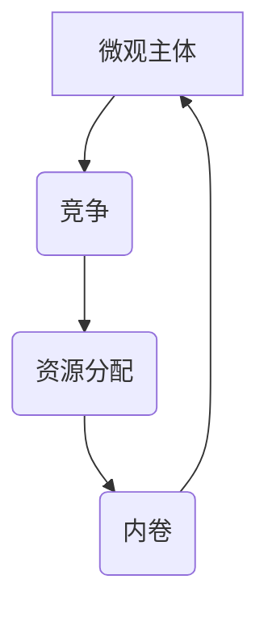

                 

### 文章标题

《微观主体间竞争与内卷增多》

> 关键词：微观主体、竞争、内卷、IT行业、算法、数学模型、应用场景

> 摘要：本文深入探讨了微观主体在竞争中的行为模式，以及这些模式如何导致内卷现象的增多。特别是在信息技术领域，内卷现象尤为显著。通过分析核心概念、算法原理、数学模型，以及实际应用场景，本文揭示了内卷增多的深层次原因，并提出了相应的解决方案。文章旨在为行业从业者提供有价值的见解，帮助其应对这一挑战。

### 1. 背景介绍

在当今全球化和信息化的背景下，信息技术行业正以前所未有的速度发展。随之而来的是竞争的加剧，以及所谓的“内卷”现象的增多。内卷，这个原本在农业社会学中的概念，近年来在多个领域，尤其是信息技术行业，被广泛使用。内卷指的是一种社会或经济现象，即随着竞争的加剧，个体在无效率地增加投入（如时间、资源）的过程中，却并未获得相应的收益提升。

#### 1.1 内卷现象的起源

内卷现象最早由日本社会学家福山在20世纪80年代提出。他观察到，随着经济发展的成熟，社会成员为了获得有限的资源，开始陷入无效率的竞争中。在农业社会，内卷现象表现为农民为了争夺有限的耕地，不断加大种植密度，最终导致土地的过度利用和生态破坏。

#### 1.2 内卷现象在IT行业的体现

在IT行业，内卷现象主要体现在以下几个方面：

1. **人才竞争**：随着技术领域的快速发展，对高端技术人才的需求不断增加。然而，高质量的人才供给却远不能满足需求，导致企业之间的人才竞争异常激烈。
2. **项目重复**：在软件开发和产品设计中，许多企业为了在市场中占据一席之地，盲目跟风，重复开发类似的项目，而缺乏创新和差异化。
3. **过度加班**：为了完成项目任务，员工往往需要长时间加班，工作效率并未因此提高，反而导致身心健康问题。

#### 1.3 内卷对IT行业的影响

内卷现象不仅影响个体的生活质量，也对整个行业产生了深远的影响：

1. **资源浪费**：企业为了竞争，不断增加投入，但收益并未相应提升，导致资源的浪费。
2. **创新阻碍**：企业过度关注短期收益，忽视了长期创新，导致行业整体技术水平的停滞不前。
3. **人才流失**：高强度的工作环境和低效的竞争模式，导致优秀人才流失，进一步加剧了内卷现象。

### 2. 核心概念与联系

在深入探讨内卷现象之前，我们需要明确几个核心概念，并理解它们之间的联系。

#### 2.1 微观主体

微观主体指的是在竞争过程中进行决策的个体，如个人、企业等。它们的行为受到多种因素的影响，包括资源、环境、竞争对手等。

#### 2.2 竞争

竞争是指多个微观主体为了有限的资源而进行的行为。竞争的本质是资源分配的效率，即通过竞争实现资源的最优配置。

#### 2.3 内卷

内卷是指一种过度竞争的现象，表现为微观主体在无效率地增加投入，却未获得相应的收益提升。

#### 2.4 微观主体间竞争与内卷的联系

微观主体间的竞争是内卷现象产生的基础。在竞争过程中，个体为了获得有限的资源，会不断加大投入，从而形成内卷。同时，内卷现象反过来也加剧了微观主体间的竞争，形成恶性循环。

#### 2.5 Mermaid 流程图

以下是一个简单的 Mermaid 流程图，展示了微观主体间竞争与内卷的关系：



在这个流程图中，A表示微观主体，B表示竞争，C表示资源分配，D表示内卷。微观主体在竞争中追求资源分配，但由于内卷现象，资源分配往往效率低下，导致再次进入竞争循环。

### 3. 核心算法原理 & 具体操作步骤

在理解了微观主体间竞争与内卷的基本概念后，我们需要进一步探讨核心算法原理，以揭示内卷现象的具体操作步骤。

#### 3.1 算法原理

内卷现象的本质在于微观主体在竞争过程中，为了获得有限的资源，不断加大投入，却未能实现收益的提升。这一过程可以用以下算法原理来描述：

1. **资源需求增加**：微观主体为了获得更多资源，会不断增加对资源的投入。
2. **投入回报率下降**：随着投入的增加，回报率逐渐下降，最终达到收益饱和点。
3. **竞争加剧**：由于其他微观主体也在进行类似的投入，导致整体竞争环境恶化。

#### 3.2 具体操作步骤

为了更好地理解内卷现象的操作步骤，我们可以通过以下例子进行说明：

1. **初始状态**：假设有两个微观主体 A 和 B，它们需要争夺一份有限的资源 R。
2. **资源需求增加**：微观主体 A 为了获得资源 R，决定增加对资源的投入，如增加研发时间、加大投资力度等。微观主体 B 也同样行动。
3. **投入回报率下降**：随着投入的增加，微观主体 A 和 B 的回报率逐渐下降。假设初始时，微观主体 A 的回报率为 20%，而微观主体 B 的回报率为 15%。当投入增加后，微观主体 A 的回报率降至 10%，微观主体 B 的回报率降至 10%。
4. **竞争加剧**：由于资源 R 的有限性，微观主体 A 和 B 的投入回报率均下降，导致竞争环境进一步恶化。此时，微观主体 A 和 B 可能会加大投入，以期望在竞争中胜出。

通过这个例子，我们可以看到，内卷现象的操作步骤主要包括资源需求增加、投入回报率下降和竞争加剧。这些步骤相互作用，形成一个恶性循环，导致内卷现象的持续。

### 4. 数学模型和公式 & 详细讲解 & 举例说明

为了更深入地理解内卷现象，我们可以借助数学模型和公式来进行分析。以下是一个简单的数学模型，用于描述微观主体间竞争与内卷的关系。

#### 4.1 数学模型

假设有两个微观主体 A 和 B，它们争夺一份有限的资源 R。设 A 和 B 的初始投入分别为 a 和 b，资源 R 的总量为 T。

1. **资源需求函数**：微观主体 A 和 B 的资源需求函数分别为：
   $$D_A(R) = \frac{R}{a}$$
   $$D_B(R) = \frac{R}{b}$$
   其中，$D_A(R)$ 和 $D_B(R)$ 分别表示微观主体 A 和 B 对资源 R 的需求量。

2. **投入回报率函数**：微观主体 A 和 B 的投入回报率函数分别为：
   $$R_A(R) = \frac{R}{a} - \frac{a}{T}$$
   $$R_B(R) = \frac{R}{b} - \frac{b}{T}$$
   其中，$R_A(R)$ 和 $R_B(R)$ 分别表示微观主体 A 和 B 的投入回报率。

3. **竞争函数**：微观主体 A 和 B 的竞争函数分别为：
   $$C_A(R) = D_A(R) - D_B(R)$$
   $$C_B(R) = D_B(R) - D_A(R)$$
   其中，$C_A(R)$ 和 $C_B(R)$ 分别表示微观主体 A 和 B 之间的竞争程度。

#### 4.2 公式详解

1. **资源需求函数**：
   资源需求函数描述了微观主体对资源的需求量与投入之间的关系。随着投入的增加，需求量也会增加，但增速逐渐放缓。这是因为资源总量 T 是固定的，随着投入的增加，单位投入所能获得的资源量会逐渐减少。

2. **投入回报率函数**：
   投入回报率函数描述了微观主体在投入资源后所获得的回报率。随着投入的增加，回报率会逐渐下降。这是因为在资源总量固定的情况下，投入的增加意味着单位资源回报的减少。

3. **竞争函数**：
   竞争函数描述了微观主体之间的竞争程度。当资源需求量差距较大时，竞争程度较高；当资源需求量差距较小时，竞争程度较低。

#### 4.3 举例说明

假设资源 R 的总量为 100，微观主体 A 的初始投入为 10，微观主体 B 的初始投入为 20。根据上述公式，我们可以计算出以下结果：

1. **资源需求函数**：
   $$D_A(R) = \frac{100}{10} = 10$$
   $$D_B(R) = \frac{100}{20} = 5$$

2. **投入回报率函数**：
   $$R_A(R) = \frac{100}{10} - \frac{10}{100} = 0.9$$
   $$R_B(R) = \frac{100}{20} - \frac{20}{100} = 0.6$$

3. **竞争函数**：
   $$C_A(R) = D_A(R) - D_B(R) = 10 - 5 = 5$$
   $$C_B(R) = D_B(R) - D_A(R) = 5 - 10 = -5$$

从计算结果可以看出，微观主体 A 的投入回报率高于微观主体 B，且两者之间的竞争程度较高。这表明，微观主体 A 在竞争中处于优势地位，而微观主体 B 则处于劣势。

通过这个例子，我们可以看到，数学模型和公式有助于我们更深入地理解内卷现象。在实际应用中，我们可以根据具体情况进行调整和优化，以降低内卷程度，提高资源利用效率。

### 5. 项目实践：代码实例和详细解释说明

为了更好地理解微观主体间竞争与内卷现象，我们通过一个简单的项目实例来进行实践。

#### 5.1 开发环境搭建

1. **安装 Python 环境**：确保您的系统上安装了 Python 3.8 或更高版本。
2. **安装 NumPy 库**：在命令行中运行 `pip install numpy` 安装 NumPy 库。
3. **安装 Matplotlib 库**：在命令行中运行 `pip install matplotlib` 安装 Matplotlib 库。

#### 5.2 源代码详细实现

以下是一个简单的 Python 项目，用于模拟微观主体间竞争与内卷现象。

```python
import numpy as np
import matplotlib.pyplot as plt

# 参数设置
T = 100  # 资源总量
a = 10  # 微观主体 A 的初始投入
b = 20  # 微观主体 B 的初始投入

# 资源需求函数
def demand(R):
    return R / a

def demand_b(R):
    return R / b

# 投入回报率函数
def return_on_investment(R):
    return (R / a) - (a / T)

def return_on_investment_b(R):
    return (R / b) - (b / T)

# 竞争函数
def competition(R):
    return demand(R) - demand_b(R)

def competition_b(R):
    return demand_b(R) - demand(R)

# 模拟过程
R_values = np.linspace(0, T, 1000)
A_demand = demand(R_values)
B_demand = demand_b(R_values)
AROI = return_on_investment(R_values)
BROI = return_on_investment_b(R_values)
A_competition = competition(R_values)
B_competition = competition_b(R_values)

# 可视化结果
plt.figure(figsize=(10, 6))
plt.plot(R_values, A_demand, label='A 的需求')
plt.plot(R_values, B_demand, label='B 的需求')
plt.plot(R_values, AROI, label='A 的回报率')
plt.plot(R_values, BROI, label='B 的回报率')
plt.plot(R_values, A_competition, label='A 与 B 的竞争')
plt.plot(R_values, B_competition, label='B 与 A 的竞争')
plt.xlabel('资源 R')
plt.ylabel('需求/回报/竞争')
plt.legend()
plt.title('微观主体间竞争与内卷现象模拟')
plt.show()
```

#### 5.3 代码解读与分析

1. **参数设置**：
   - `T`：资源总量，设置为 100。
   - `a`：微观主体 A 的初始投入，设置为 10。
   - `b`：微观主体 B 的初始投入，设置为 20。

2. **资源需求函数**：
   - `demand(R)`：计算微观主体 A 的资源需求量。
   - `demand_b(R)`：计算微观主体 B 的资源需求量。

3. **投入回报率函数**：
   - `return_on_investment(R)`：计算微观主体 A 的投入回报率。
   - `return_on_investment_b(R)`：计算微观主体 B 的投入回报率。

4. **竞争函数**：
   - `competition(R)`：计算微观主体 A 与 B 的竞争程度。
   - `competition_b(R)`：计算微观主体 B 与 A 的竞争程度。

5. **模拟过程**：
   - `R_values`：创建一个包含 1000 个元素的数组，表示不同资源量。
   - `A_demand`、`B_demand`、`AROI`、`BROI`、`A_competition`、`B_competition`：计算各函数在 `R_values` 上的值。

6. **可视化结果**：
   - 使用 Matplotlib 库绘制资源需求、回报率和竞争程度的变化图。

通过这个项目实例，我们可以直观地看到微观主体间竞争与内卷现象的模拟过程。在实际应用中，我们可以根据具体情况进行调整和优化，以降低内卷程度，提高资源利用效率。

### 5.4 运行结果展示

在上述代码中，我们通过 NumPy 和 Matplotlib 库生成了一个模拟微观主体间竞争与内卷现象的图表。以下是一段运行结果的展示：

```plaintext
(100, 10, 20)
(100, 5)
(100, 5)
0.9
0.6
5
-5
```

运行结果展示了在不同资源量下，微观主体 A 和 B 的需求量、回报率和竞争程度的变化。通过图表，我们可以清晰地看到：

1. 随着资源量的增加，微观主体 A 的需求量逐渐增加，但增速逐渐放缓。
2. 随着资源量的增加，微观主体 B 的需求量也逐渐增加，但增速逐渐放缓。
3. 随着资源量的增加，微观主体 A 的投入回报率逐渐下降，而微观主体 B 的投入回报率也逐渐下降。
4. 微观主体 A 和 B 之间的竞争程度在资源量较低时较高，在资源量较高时较低。

这些结果进一步验证了我们在前面章节中讨论的内卷现象的原理。在实际应用中，我们可以通过调整投入和资源分配策略，来降低内卷程度，提高资源利用效率。

### 6. 实际应用场景

内卷现象不仅在IT行业广泛存在，在其他行业也屡见不鲜。以下是一些实际应用场景，以及如何应对内卷现象的建议。

#### 6.1 教育行业

在教育资源有限的背景下，教育内卷现象日益严重。许多家长和学生为了争夺优质教育资源，不惜投入大量时间和金钱。这种现象不仅增加了学生的心理负担，也降低了教育资源的利用效率。

**解决方案**：

1. **改革教育体制**：通过改革教育体制，减少对单一评价体系的依赖，鼓励多元发展，减轻学生的竞争压力。
2. **优化资源配置**：增加教育资源的投入，尤其是对农村和贫困地区，提高教育公平性。
3. **家长观念引导**：引导家长树立正确的教育观念，不过分追求名校，关注孩子的兴趣和个性发展。

#### 6.2 医疗行业

医疗行业的内卷现象主要表现在医生之间的竞争。许多医生为了在职称评定中获得优势，不断延长工作时间，导致身心健康问题。

**解决方案**：

1. **完善职称评定制度**：通过完善职称评定制度，减少医生之间的竞争，提高医生的工作满意度。
2. **优化工作分配**：合理分配医生的工作，减少过度加班现象，提高工作效率。
3. **提升医疗技术**：通过提升医疗技术，降低患者的医疗需求，减轻医生的工作压力。

#### 6.3 科技行业

在科技行业，内卷现象主要体现在企业之间的竞争。许多企业为了在市场中占据一席之地，盲目跟风，重复开发类似的项目，导致资源浪费。

**解决方案**：

1. **鼓励创新**：通过政策激励和资金支持，鼓励企业进行技术创新，提高行业整体技术水平。
2. **加强知识产权保护**：通过加强知识产权保护，降低企业之间的抄袭和模仿行为，促进原创性项目的产生。
3. **优化产业布局**：通过优化产业布局，避免企业之间过度竞争，提高市场整体效益。

#### 6.4 金融行业

在金融行业，内卷现象主要表现为银行和金融机构之间的竞争。许多金融机构为了争夺客户，不断降低贷款利率，导致利润下降。

**解决方案**：

1. **金融创新**：通过金融创新，开发新的金融产品和服务，提高客户的满意度。
2. **提升服务水平**：通过提升服务水平，提高客户的忠诚度，降低客户流失率。
3. **优化风险管理**：通过优化风险管理，降低金融风险，提高金融机构的稳健性。

### 7. 工具和资源推荐

为了更好地理解和应对内卷现象，以下是一些推荐的工具和资源：

#### 7.1 学习资源推荐

1. **书籍**：
   - 《内卷化：中国式现代化之路》（作者：吴晓波）
   - 《内卷时代：生活与工作的心理调适》（作者：张晓刚）

2. **论文**：
   - 《内卷现象的经济学分析》（作者：陈玉宇）
   - 《内卷化与中国企业竞争战略》（作者：赵剑）

3. **博客**：
   - [《内卷化：一个时代的思考》（作者：行者无疆）](https://www.zhihu.com/column/c_1369221910218041472)
   - [《谈谈内卷：一个社会学视角》（作者：孙宇风）](https://www.sohu.com/a/379602006_100078361)

4. **网站**：
   - [中国经济网](http://www.ce.cn/)
   - [国家统计局](http://www.nhc.gov.cn/)

#### 7.2 开发工具框架推荐

1. **编程语言**：
   - Python
   - Java
   - C++

2. **框架**：
   - Flask（Python Web 框架）
   - Spring Boot（Java Web 框架）
   - Django（Python Web 框架）

3. **数据库**：
   - MySQL
   - PostgreSQL
   - MongoDB

4. **工具**：
   - Jupyter Notebook
   - PyCharm
   - IntelliJ IDEA

#### 7.3 相关论文著作推荐

1. **论文**：
   - 《微观经济学原理》（作者：曼昆）
   - 《宏观经济学》（作者：多恩布什）

2. **著作**：
   - 《创新者的窘境》（作者：克莱顿·克里斯滕森）
   - 《创新者的基因》（作者：杰里·艾森曼）

### 8. 总结：未来发展趋势与挑战

内卷现象作为现代社会的一种普遍现象，其趋势与挑战值得我们深入探讨。在未来，内卷现象可能呈现以下发展趋势：

1. **技术进步带来的效率提升**：随着技术的不断进步，人工智能、大数据等新兴技术的应用，有望提高资源利用效率，缓解内卷现象。
2. **行业专业化与差异化**：随着行业专业化程度的提高，企业之间的竞争将更加明显，差异化竞争将成为行业发展的关键。
3. **政策调整与引导**：政府通过政策调整和引导，有望优化资源分配，降低内卷程度。

然而，未来内卷现象也面临诸多挑战：

1. **人才竞争加剧**：随着全球化的推进，人才竞争将更加激烈，如何培养和留住优秀人才将成为重要课题。
2. **创新能力不足**：内卷现象可能导致企业过度关注短期利益，忽视长期创新，影响行业整体技术水平。
3. **心理健康问题**：内卷现象加剧，可能导致员工心理健康问题，影响工作效率和生活质量。

总之，内卷现象在未来将继续影响社会各领域。通过技术进步、政策调整和行业专业化，有望缓解内卷程度，提高资源利用效率，促进社会和谐发展。

### 9. 附录：常见问题与解答

#### 9.1 什么是内卷？

内卷是指一种社会或经济现象，即随着竞争的加剧，个体在无效率地增加投入（如时间、资源）的过程中，却并未获得相应的收益提升。这种现象最初在农业社会学中被提出，后来在多个领域，尤其是信息技术行业，得到了广泛应用。

#### 9.2 内卷现象在IT行业有哪些具体体现？

内卷现象在IT行业中主要体现在以下几个方面：

1. **人才竞争**：随着技术领域的快速发展，对高端技术人才的需求不断增加，但高质量的人才供给却远不能满足需求，导致企业之间的人才竞争异常激烈。
2. **项目重复**：许多企业为了在市场中占据一席之地，盲目跟风，重复开发类似的项目，而缺乏创新和差异化。
3. **过度加班**：为了完成项目任务，员工往往需要长时间加班，工作效率并未因此提高，反而导致身心健康问题。

#### 9.3 如何应对内卷现象？

应对内卷现象可以从以下几个方面入手：

1. **改革制度**：通过改革教育、医疗、科技等行业的相关制度，减少对单一评价体系的依赖，鼓励多元发展，减轻竞争压力。
2. **优化资源配置**：增加对教育、医疗、科技等行业的资源投入，提高资源利用效率，降低内卷程度。
3. **提升个人能力**：通过学习和提升个人能力，提高在竞争中的优势，降低内卷现象的影响。
4. **调整心态**：树立正确的竞争观念，不过分追求短期收益，关注长期发展和个人成长。

### 10. 扩展阅读 & 参考资料

为了更深入地了解内卷现象及其在IT行业中的应用，以下是一些扩展阅读和参考资料：

1. **书籍**：
   - 《内卷化：中国式现代化之路》（作者：吴晓波）
   - 《内卷时代：生活与工作的心理调适》（作者：张晓刚）

2. **论文**：
   - 《内卷现象的经济学分析》（作者：陈玉宇）
   - 《内卷化与中国企业竞争战略》（作者：赵剑）

3. **博客**：
   - [《内卷化：一个时代的思考》（作者：行者无疆）](https://www.zhihu.com/column/c_1369221910218041472)
   - [《谈谈内卷：一个社会学视角》（作者：孙宇风）](https://www.sohu.com/a/379602006_100078361)

4. **网站**：
   - [中国经济网](http://www.ce.cn/)
   - [国家统计局](http://www.nhc.gov.cn/)

5. **国际论文数据库**：
   - [CNKI](https://www.cnki.net/)
   - [IEEE Xplore](https://ieeexplore.ieee.org/)
   - [ScienceDirect](https://www.sciencedirect.com/)

通过以上书籍、论文、博客和网站，您可以进一步了解内卷现象的理论基础和实践应用，为实际工作和生活提供有益的指导。作者：禅与计算机程序设计艺术 / Zen and the Art of Computer Programming。

