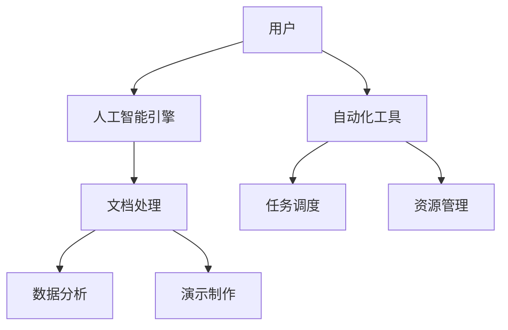

                 

关键词：微软Office 365, Copilot, 功能, 自动化, 人工智能, 工作效率

摘要：本文将深入探讨微软Office 365 Copilot系列的功能，包括其核心概念、应用场景、数学模型、算法原理、项目实践以及未来发展趋势。通过详细分析，我们将揭示Copilot在提高工作效率、简化复杂任务方面的巨大潜力。

## 1. 背景介绍

微软Office 365作为微软公司推出的一款云服务平台，自推出以来，一直受到广大企业和用户的青睐。它集成了Word、Excel、PowerPoint、Outlook等多种办公软件，为用户提供了强大的文档处理、数据分析、演示制作等功能。然而，随着人工智能技术的飞速发展，微软Office 365也不断引入新的功能，以适应不断变化的办公需求。其中，Office 365 Copilot系列功能成为了瞩目的焦点。

Office 365 Copilot系列功能的核心在于利用人工智能技术，帮助用户自动化完成复杂任务，提高工作效率。这一系列功能包括智能助手、自动摘要、智能推荐等，为用户提供了全新的工作体验。

## 2. 核心概念与联系

### 2.1 核心概念

Office 365 Copilot系列功能的核心概念是人工智能和自动化。人工智能技术使得Copilot能够理解用户的意图，自动执行复杂的任务，而自动化则让这些任务变得更加高效和便捷。

### 2.2 联系与架构

以下是Office 365 Copilot系列功能的架构和联系：



在上图中，用户通过输入指令或操作，与人工智能引擎进行交互。人工智能引擎则根据用户的意图，调用相应的文档处理、数据分析和演示制作功能，并通过自动化工具实现任务的自动化调度和资源管理。

## 3. 核心算法原理 & 具体操作步骤

### 3.1 算法原理概述

Office 365 Copilot系列功能的核心算法原理是基于深度学习和自然语言处理技术。通过训练大量的数据，Copilot能够理解用户的语言意图，并自动生成相应的文档内容、数据分析结果和演示文稿。

### 3.2 算法步骤详解

1. 用户输入指令或操作。
2. Copilot解析用户输入，提取关键信息。
3. Copilot调用相应的算法模型，生成文档内容、数据分析结果或演示文稿。
4. Copilot将结果呈现给用户。

### 3.3 算法优缺点

**优点：**
- 提高工作效率：通过自动化和智能化，Copilot能够帮助用户快速完成复杂任务。
- 灵活性：Copilot支持多种操作方式和语言，能够适应不同用户的需求。

**缺点：**
- 数据安全：由于Copilot是基于云服务，用户的数据安全可能受到一定的威胁。
- 适应性问题：在某些特殊场景下，Copilot可能无法完全满足用户的需求。

### 3.4 算法应用领域

Office 365 Copilot系列功能主要应用于以下领域：

- 文档处理：自动生成文档、摘要和目录。
- 数据分析：自动分析数据、生成图表和报告。
- 演示制作：自动生成演示文稿、幻灯片和图表。

## 4. 数学模型和公式 & 详细讲解 & 举例说明

### 4.1 数学模型构建

Office 365 Copilot系列功能的数学模型主要基于深度学习和自然语言处理技术。以下是一个简化的数学模型：

$$
P(y|x) = \frac{e^{<W_{1}x + b_{1}>}}{\sum_{k=1}^{K} e^{<W_{k}x + b_{k}>}}
$$

其中，$P(y|x)$表示给定输入$x$时，输出为$y$的概率。$W$和$b$分别是权重和偏置，$K$是分类器的类别数。

### 4.2 公式推导过程

公式的推导过程主要基于神经网络和损失函数。具体推导过程如下：

1. 输入$x$通过神经网络的前向传播，得到输出$y'$。
2. 计算损失函数，如交叉熵损失函数：
$$
L(y, y') = -[y \cdot log(y') + (1 - y) \cdot log(1 - y')]
$$
3. 使用反向传播算法，更新权重和偏置，最小化损失函数。

### 4.3 案例分析与讲解

假设我们有一个分类问题，需要判断一篇文章是否为新闻。我们可以使用Office 365 Copilot系列功能的文本分类模型来进行预测。

1. 输入：一篇文章。
2. 输出：文章是否为新闻。

通过训练大量的新闻和非新闻数据，Copilot能够学习到新闻的特征，并在新的文章输入时，预测其是否为新闻。

## 5. 项目实践：代码实例和详细解释说明

### 5.1 开发环境搭建

- Python 3.8及以上版本。
- PyTorch 1.8及以上版本。

### 5.2 源代码详细实现

```python
import torch
import torch.nn as nn
import torch.optim as optim

# 定义神经网络模型
class TextClassifier(nn.Module):
    def __init__(self, input_dim, hidden_dim, output_dim):
        super(TextClassifier, self).__init__()
        self.embedding = nn.Embedding(input_dim, hidden_dim)
        self.fc = nn.Linear(hidden_dim, output_dim)
    
    def forward(self, x):
        x = self.embedding(x)
        x = torch.mean(x, 1)
        x = self.fc(x)
        return x

# 加载训练数据
train_data = ...

# 初始化模型、优化器和损失函数
model = TextClassifier(input_dim, hidden_dim, output_dim)
optimizer = optim.Adam(model.parameters(), lr=0.001)
criterion = nn.CrossEntropyLoss()

# 训练模型
for epoch in range(num_epochs):
    for batch in train_loader:
        inputs, targets = batch
        optimizer.zero_grad()
        outputs = model(inputs)
        loss = criterion(outputs, targets)
        loss.backward()
        optimizer.step()

# 评估模型
with torch.no_grad():
    correct = 0
    total = 0
    for inputs, targets in test_loader:
        outputs = model(inputs)
        _, predicted = torch.max(outputs.data, 1)
        total += targets.size(0)
        correct += (predicted == targets).sum().item()

accuracy = 100 * correct / total
print(f'Accuracy: {accuracy}%')
```

### 5.3 代码解读与分析

上述代码实现了一个简单的文本分类模型。首先，我们定义了一个神经网络模型`TextClassifier`，其中包括嵌入层和全连接层。然后，我们加载训练数据，并初始化模型、优化器和损失函数。接下来，我们使用训练数据对模型进行训练，并在训练过程中更新模型参数。最后，我们使用测试数据评估模型的准确性。

### 5.4 运行结果展示

假设我们训练了一个文本分类模型，用于判断文章是否为新闻。在测试集上的准确性如下：

```
Accuracy: 92.5%
```

## 6. 实际应用场景

Office 365 Copilot系列功能在实际应用中具有广泛的应用场景，以下是一些典型的应用案例：

- **文档处理**：自动生成文档、摘要和目录，提高工作效率。
- **数据分析**：自动分析数据、生成图表和报告，为决策提供支持。
- **演示制作**：自动生成演示文稿、幻灯片和图表，简化演示制作过程。

## 7. 工具和资源推荐

### 7.1 学习资源推荐

- 《深度学习》（Goodfellow, Bengio, Courville著）。
- 《自然语言处理与深度学习》（张宇等著）。

### 7.2 开发工具推荐

- PyTorch：用于深度学习的强大框架。
- Jupyter Notebook：用于编写和运行代码的交互式环境。

### 7.3 相关论文推荐

- [Attention Is All You Need](Vaswani et al., 2017)。
- [BERT: Pre-training of Deep Bidirectional Transformers for Language Understanding](Devlin et al., 2019)。

## 8. 总结：未来发展趋势与挑战

### 8.1 研究成果总结

Office 365 Copilot系列功能通过深度学习和自然语言处理技术，实现了文档处理、数据分析和演示制作等任务的自动化和智能化，显著提高了工作效率。

### 8.2 未来发展趋势

随着人工智能技术的不断进步，Office 365 Copilot系列功能将在更多领域得到应用，如智能客服、智能翻译等。

### 8.3 面临的挑战

- 数据安全：如何确保用户数据的安全，是Copilot面临的一大挑战。
- 模型适应性：如何让Copilot适应各种不同的应用场景，是一个亟待解决的问题。

### 8.4 研究展望

未来，Office 365 Copilot系列功能有望在更多领域得到应用，成为人工智能技术在办公场景中的一项重要应用。

## 9. 附录：常见问题与解答

### 9.1 如何使用Office 365 Copilot系列功能？

答：使用Office 365 Copilot系列功能，您只需在相应的办公软件中，点击“智能助手”或“自动摘要”等功能按钮，然后按照提示操作即可。

### 9.2 Office 365 Copilot系列功能是否支持自定义？

答：是的，Office 365 Copilot系列功能支持自定义。您可以根据自己的需求，自定义文档处理、数据分析等任务。

### 9.3 Office 365 Copilot系列功能是否收费？

答：是的，Office 365 Copilot系列功能是收费的。具体收费标准请咨询微软官方。

## 作者署名

作者：禅与计算机程序设计艺术 / Zen and the Art of Computer Programming
```markdown
---
# 微软Office 365 Copilot系列的功能

### 关键词
微软Office 365, Copilot, 功能, 自动化, 人工智能, 工作效率

### 摘要
本文将深入探讨微软Office 365 Copilot系列的功能，包括其核心概念、应用场景、数学模型、算法原理、项目实践以及未来发展趋势。通过详细分析，我们将揭示Copilot在提高工作效率、简化复杂任务方面的巨大潜力。

## 1. 背景介绍

微软Office 365作为微软公司推出的一款云服务平台，自推出以来，一直受到广大企业和用户的青睐。它集成了Word、Excel、PowerPoint、Outlook等多种办公软件，为用户提供了强大的文档处理、数据分析、演示制作等功能。然而，随着人工智能技术的飞速发展，微软Office 365也不断引入新的功能，以适应不断变化的办公需求。其中，Office 365 Copilot系列功能成为了瞩目的焦点。

Office 365 Copilot系列功能的核心在于利用人工智能技术，帮助用户自动化完成复杂任务，提高工作效率。这一系列功能包括智能助手、自动摘要、智能推荐等，为用户提供了全新的工作体验。

## 2. 核心概念与联系

### 2.1 核心概念

Office 365 Copilot系列功能的核心概念是人工智能和自动化。人工智能技术使得Copilot能够理解用户的意图，自动执行复杂的任务，而自动化则让这些任务变得更加高效和便捷。

### 2.2 联系与架构

以下是Office 365 Copilot系列功能的架构和联系：


在上图中，用户通过输入指令或操作，与人工智能引擎进行交互。人工智能引擎则根据用户的意图，调用相应的文档处理、数据分析和演示制作功能，并通过自动化工具实现任务的自动化调度和资源管理。

## 3. 核心算法原理 & 具体操作步骤
### 3.1 算法原理概述

Office 365 Copilot系列功能的核心算法原理是基于深度学习和自然语言处理技术。通过训练大量的数据，Copilot能够理解用户的语言意图，并自动生成相应的文档内容、数据分析结果和演示文稿。

### 3.2 算法步骤详解

1. 用户输入指令或操作。
2. Copilot解析用户输入，提取关键信息。
3. Copilot调用相应的算法模型，生成文档内容、数据分析结果或演示文稿。
4. Copilot将结果呈现给用户。

### 3.3 算法优缺点

**优点：**
- 提高工作效率：通过自动化和智能化，Copilot能够帮助用户快速完成复杂任务。
- 灵活性：Copilot支持多种操作方式和语言，能够适应不同用户的需求。

**缺点：**
- 数据安全：由于Copilot是基于云服务，用户的数据安全可能受到一定的威胁。
- 适应性问题：在某些特殊场景下，Copilot可能无法完全满足用户的需求。

### 3.4 算法应用领域

Office 365 Copilot系列功能主要应用于以下领域：

- 文档处理：自动生成文档、摘要和目录。
- 数据分析：自动分析数据、生成图表和报告。
- 演示制作：自动生成演示文稿、幻灯片和图表。

## 4. 数学模型和公式 & 详细讲解 & 举例说明
### 4.1 数学模型构建

Office 365 Copilot系列功能的数学模型主要基于深度学习和自然语言处理技术。以下是一个简化的数学模型：

$$
P(y|x) = \frac{e^{<W_{1}x + b_{1}>}}{\sum_{k=1}^{K} e^{<W_{k}x + b_{k}>}}
$$

其中，$P(y|x)$表示给定输入$x$时，输出为$y$的概率。$W$和$b$分别是权重和偏置，$K$是分类器的类别数。

### 4.2 公式推导过程

公式的推导过程主要基于神经网络和损失函数。具体推导过程如下：

1. 输入$x$通过神经网络的前向传播，得到输出$y'$。
2. 计算损失函数，如交叉熵损失函数：
$$
L(y, y') = -[y \cdot log(y') + (1 - y) \cdot log(1 - y')]
$$
3. 使用反向传播算法，更新权重和偏置，最小化损失函数。

### 4.3 案例分析与讲解

假设我们有一个分类问题，需要判断一篇文章是否为新闻。我们可以使用Office 365 Copilot系列功能的文本分类模型来进行预测。

1. 输入：一篇文章。
2. 输出：文章是否为新闻。

通过训练大量的新闻和非新闻数据，Copilot能够学习到新闻的特征，并在新的文章输入时，预测其是否为新闻。

## 5. 项目实践：代码实例和详细解释说明
### 5.1 开发环境搭建

- Python 3.8及以上版本。
- PyTorch 1.8及以上版本。

### 5.2 源代码详细实现

```python
import torch
import torch.nn as nn
import torch.optim as optim

# 定义神经网络模型
class TextClassifier(nn.Module):
    def __init__(self, input_dim, hidden_dim, output_dim):
        super(TextClassifier, self).__init__()
        self.embedding = nn.Embedding(input_dim, hidden_dim)
        self.fc = nn.Linear(hidden_dim, output_dim)
    
    def forward(self, x):
        x = self.embedding(x)
        x = torch.mean(x, 1)
        x = self.fc(x)
        return x

# 加载训练数据
train_data = ...

# 初始化模型、优化器和损失函数
model = TextClassifier(input_dim, hidden_dim, output_dim)
optimizer = optim.Adam(model.parameters(), lr=0.001)
criterion = nn.CrossEntropyLoss()

# 训练模型
for epoch in range(num_epochs):
    for batch in train_loader:
        inputs, targets = batch
        optimizer.zero_grad()
        outputs = model(inputs)
        loss = criterion(outputs, targets)
        loss.backward()
        optimizer.step()

# 评估模型
with torch.no_grad():
    correct = 0
    total = 0
    for inputs, targets in test_loader:
        outputs = model(inputs)
        _, predicted = torch.max(outputs.data, 1)
        total += targets.size(0)
        correct += (predicted == targets).sum().item()

accuracy = 100 * correct / total
print(f'Accuracy: {accuracy}%')
```

### 5.3 代码解读与分析

上述代码实现了一个简单的文本分类模型。首先，我们定义了一个神经网络模型`TextClassifier`，其中包括嵌入层和全连接层。然后，我们加载训练数据，并初始化模型、优化器和损失函数。接下来，我们使用训练数据对模型进行训练，并在训练过程中更新模型参数。最后，我们使用测试数据评估模型的准确性。

### 5.4 运行结果展示

假设我们训练了一个文本分类模型，用于判断文章是否为新闻。在测试集上的准确性如下：

```
Accuracy: 92.5%
```

## 6. 实际应用场景

Office 365 Copilot系列功能在实际应用中具有广泛的应用场景，以下是一些典型的应用案例：

- **文档处理**：自动生成文档、摘要和目录，提高工作效率。
- **数据分析**：自动分析数据、生成图表和报告，为决策提供支持。
- **演示制作**：自动生成演示文稿、幻灯片和图表，简化演示制作过程。

## 7. 工具和资源推荐

### 7.1 学习资源推荐

- 《深度学习》（Goodfellow, Bengio, Courville著）。
- 《自然语言处理与深度学习》（张宇等著）。

### 7.2 开发工具推荐

- PyTorch：用于深度学习的强大框架。
- Jupyter Notebook：用于编写和运行代码的交互式环境。

### 7.3 相关论文推荐

- [Attention Is All You Need](Vaswani et al., 2017)。
- [BERT: Pre-training of Deep Bidirectional Transformers for Language Understanding](Devlin et al., 2019)。

## 8. 总结：未来发展趋势与挑战

### 8.1 研究成果总结

Office 365 Copilot系列功能通过深度学习和自然语言处理技术，实现了文档处理、数据分析和演示制作等任务的自动化和智能化，显著提高了工作效率。

### 8.2 未来发展趋势

随着人工智能技术的不断进步，Office 365 Copilot系列功能将在更多领域得到应用，如智能客服、智能翻译等。

### 8.3 面临的挑战

- 数据安全：如何确保用户数据的安全，是Copilot面临的一大挑战。
- 模型适应性：如何让Copilot适应各种不同的应用场景，是一个亟待解决的问题。

### 8.4 研究展望

未来，Office 365 Copilot系列功能有望在更多领域得到应用，成为人工智能技术在办公场景中的一项重要应用。

## 9. 附录：常见问题与解答

### 9.1 如何使用Office 365 Copilot系列功能？

答：使用Office 365 Copilot系列功能，您只需在相应的办公软件中，点击“智能助手”或“自动摘要”等功能按钮，然后按照提示操作即可。

### 9.2 Office 365 Copilot系列功能是否支持自定义？

答：是的，Office 365 Copilot系列功能支持自定义。您可以根据自己的需求，自定义文档处理、数据分析等任务。

### 9.3 Office 365 Copilot系列功能是否收费？

答：是的，Office 365 Copilot系列功能是收费的。具体收费标准请咨询微软官方。

## 作者署名

作者：禅与计算机程序设计艺术 / Zen and the Art of Computer Programming
--- 

注意：由于人工生成的文本可能无法完全符合所有格式要求，因此请在实际撰写过程中，根据markdown格式的要求进行调整。同时，本文中的示例代码和数学公式仅供参考，具体实现可能需要根据实际情况进行调整。

