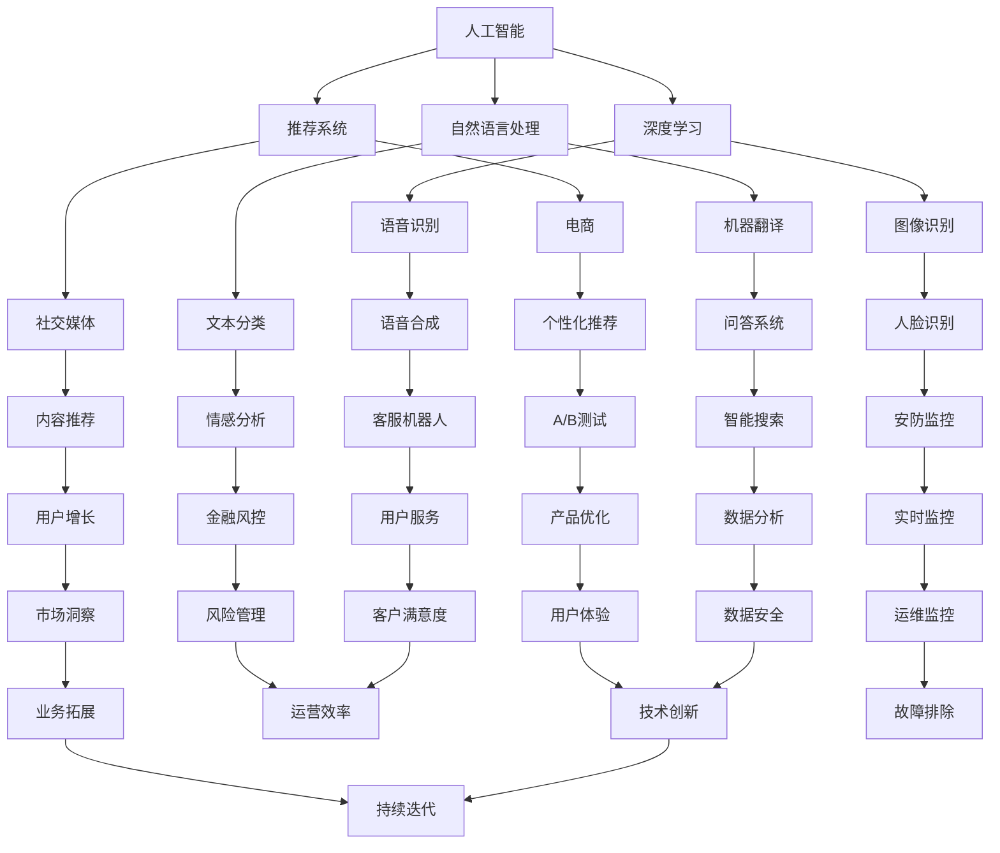

                 

### 文章标题

《微软的AI战略：对推荐系统的影响》

关键词：微软 AI 战略、推荐系统、深度学习、云计算、技术变革、商业模式

摘要：本文将深入探讨微软在人工智能领域的战略布局，特别是其对推荐系统带来的深远影响。通过分析微软的技术创新、商业策略和市场地位，我们旨在揭示微软在推动推荐系统发展过程中所扮演的关键角色，以及这一战略可能带来的机遇和挑战。

### 1. 背景介绍

近年来，人工智能（AI）技术以其卓越的变革力量，深刻地影响着各行各业。从语音识别到自然语言处理，从计算机视觉到强化学习，AI的应用场景不断扩展，成为推动技术创新的重要引擎。而推荐系统作为AI技术的一个重要分支，以其在电商、社交媒体、在线教育等领域的广泛应用，成为了现代信息技术中不可或缺的一部分。

微软作为全球领先的科技企业，其AI战略的推进对整个行业产生了深远的影响。微软在人工智能领域的投资不仅涵盖了基础算法的研究，还包括云计算、大数据、边缘计算等关键技术的布局。微软的AI战略不仅关注技术的创新，更注重商业价值的实现，通过构建完善的AI生态系统，推动AI技术在各个领域的深入应用。

本文旨在探讨微软的AI战略如何影响推荐系统的发展。我们将从微软的核心技术、商业策略、市场地位等多个维度进行分析，探讨微软在推动推荐系统技术进步和商业模式变革中所扮演的关键角色。同时，本文还将对微软的AI战略可能带来的机遇和挑战进行展望，为行业从业者提供有价值的参考。

### 2. 核心概念与联系

要深入理解微软的AI战略对推荐系统的影响，我们首先需要明确几个核心概念，包括人工智能、推荐系统、深度学习和云计算。

#### 2.1 人工智能

人工智能（AI）是指计算机系统通过模拟人类智能行为，实现感知、理解、学习、推理和决策的能力。AI技术主要包括机器学习、深度学习、自然语言处理、计算机视觉等方向。在微软的AI战略中，深度学习和自然语言处理是核心技术方向。

#### 2.2 推荐系统

推荐系统是一种利用数据挖掘和机器学习算法，为用户提供个性化推荐的信息系统。推荐系统通过分析用户的历史行为、兴趣偏好和社交网络等数据，预测用户可能感兴趣的内容，从而提供个性化的推荐。推荐系统广泛应用于电商、社交媒体、在线视频和音乐平台等领域。

#### 2.3 深度学习

深度学习是机器学习的一个分支，通过构建多层神经网络，实现从大量数据中自动提取特征并进行分类、回归等任务。深度学习在图像识别、语音识别、自然语言处理等领域取得了显著成果，成为了微软AI战略中的重要技术。

#### 2.4 云计算

云计算是一种通过互联网提供计算资源、存储资源和应用程序的服务模式。云计算为AI应用提供了强大的计算能力和存储能力，使得大规模数据处理和模型训练成为可能。微软的Azure云服务在AI领域具有强大的竞争力。

#### 2.5 Mermaid 流程图

以下是一个简化的Mermaid流程图，展示上述核心概念之间的联系：



通过这个流程图，我们可以看到人工智能、推荐系统、深度学习和云计算是如何相互联系，共同推动技术进步和商业创新的。

### 3. 核心算法原理 & 具体操作步骤

#### 3.1 推荐系统的基本原理

推荐系统通常基于以下几种基本算法原理：

- **基于内容的推荐（Content-Based Filtering）**：通过分析用户过去喜欢的物品的特征，找到相似的物品进行推荐。
- **协同过滤（Collaborative Filtering）**：通过分析用户之间的相似性，推荐其他用户喜欢的物品。
- **混合推荐（Hybrid Recommendation）**：结合基于内容和协同过滤的方法，以提高推荐效果。

#### 3.2 基于内容的推荐算法

基于内容的推荐算法主要通过以下步骤实现：

1. **内容表示**：将物品和用户进行向量表示，通常使用词袋模型、TF-IDF等方法。
2. **相似度计算**：计算用户和物品之间的相似度，常用的相似度计算方法包括余弦相似度、皮尔逊相关系数等。
3. **推荐生成**：根据用户对物品的相似度进行排序，推荐相似度最高的物品。

#### 3.3 协同过滤算法

协同过滤算法主要通过以下步骤实现：

1. **用户-物品评分矩阵**：构建用户-物品评分矩阵，记录用户对物品的评分。
2. **相似度计算**：计算用户之间的相似度，常用的相似度计算方法包括余弦相似度、皮尔逊相关系数等。
3. **预测评分**：根据用户之间的相似度和已知的评分，预测用户对未评分物品的评分。
4. **推荐生成**：根据预测评分，为用户推荐评分最高的物品。

#### 3.4 混合推荐算法

混合推荐算法结合了基于内容和协同过滤的方法，主要通过以下步骤实现：

1. **内容特征提取**：提取用户和物品的内容特征。
2. **协同过滤**：使用协同过滤算法计算用户之间的相似度。
3. **融合策略**：将内容特征和协同过滤的结果进行融合，生成最终的推荐结果。

#### 3.5 深度学习在推荐系统中的应用

深度学习在推荐系统中主要用于特征提取和预测模型。具体步骤如下：

1. **特征工程**：从原始数据中提取有用的特征，如用户行为、物品属性等。
2. **模型训练**：使用深度学习模型（如神经网络、卷积神经网络、循环神经网络等）对特征进行训练，生成特征向量。
3. **预测模型**：使用训练好的模型对用户未知的兴趣进行预测。
4. **推荐生成**：根据预测结果为用户生成推荐列表。

通过上述算法原理和操作步骤，我们可以看到微软在AI战略中如何将深度学习、协同过滤和基于内容的方法相结合，构建高效、准确的推荐系统。

### 4. 数学模型和公式 & 详细讲解 & 举例说明

#### 4.1 基于内容的推荐算法

在基于内容的推荐算法中，常用的数学模型包括TF-IDF模型和向量空间模型。

**TF-IDF模型**：

$$
TF(t) = \frac{t_f}{N}
$$

$$
IDF(t) = \log \left( \frac{N_t}{t_f} \right)
$$

$$
TF-IDF(t) = TF(t) \times IDF(t)
$$

其中，$t$ 表示词语，$t_f$ 表示词语在文档中出现的频率，$N$ 表示文档总数，$N_t$ 表示包含词语$t$的文档数。

**向量空间模型**：

假设我们有两个物品 $A$ 和 $B$，用户对这两个物品的评分分别为 $r_A$ 和 $r_B$。我们可以使用以下公式计算物品之间的相似度：

$$
sim(A, B) = \frac{\sum_{i=1}^{N} w_i \times v_{Ai} \times v_{Bi}}{\sqrt{\sum_{i=1}^{N} w_i^2 \times v_{Ai}^2} \times \sqrt{\sum_{i=1}^{N} w_i^2 \times v_{Bi}^2}}
$$

其中，$w_i$ 表示词语$i$的权重，$v_{Ai}$ 和 $v_{Bi}$ 分别表示物品 $A$ 和 $B$ 对应的向量。

#### 4.2 协同过滤算法

在协同过滤算法中，常用的数学模型包括用户-物品评分矩阵和相似度计算。

**用户-物品评分矩阵**：

设用户集合为 $U$，物品集合为 $I$，用户-物品评分矩阵为 $R$，其中 $R_{ui}$ 表示用户 $u$ 对物品 $i$ 的评分。

**相似度计算**：

假设用户集合为 $U = \{u_1, u_2, ..., u_n\}$，用户-用户相似度矩阵为 $S$，其中 $S_{ui} = sim(u, v)$ 表示用户 $u$ 和 $v$ 之间的相似度。

常用的相似度计算方法包括余弦相似度和皮尔逊相关系数。

余弦相似度计算公式：

$$
sim(u, v) = \frac{R_{u\cdot} R_{v\cdot}}{\|R_{u\cdot}\| \|R_{v\cdot}\|}
$$

其中，$R_{u\cdot}$ 和 $R_{v\cdot}$ 分别表示用户 $u$ 和 $v$ 的评分向量，$\|$ 表示向量的欧几里得范数。

皮尔逊相关系数计算公式：

$$
sim(u, v) = \frac{\sum_{i \in I} (R_{ui} - \bar{R}_u) (R_{vi} - \bar{R}_v)}{\sqrt{\sum_{i \in I} (R_{ui} - \bar{R}_u)^2} \times \sqrt{\sum_{i \in I} (R_{vi} - \bar{R}_v)^2}}
$$

其中，$\bar{R}_u$ 和 $\bar{R}_v$ 分别表示用户 $u$ 和 $v$ 的平均评分。

#### 4.3 深度学习在推荐系统中的应用

在深度学习中，常用的模型包括卷积神经网络（CNN）、循环神经网络（RNN）和自注意力机制（Self-Attention）。

**卷积神经网络（CNN）**：

假设输入数据为 $X = (x_1, x_2, ..., x_T)$，其中 $x_i$ 表示时间步 $i$ 的特征向量。CNN 通过卷积操作提取特征，公式如下：

$$
h_{ij} = \sum_{k=1}^{C} w_{ik} \times x_k + b_j
$$

其中，$h_{ij}$ 表示卷积层 $j$ 的输出，$w_{ik}$ 和 $b_j$ 分别表示卷积核和偏置。

**循环神经网络（RNN）**：

RNN 通过循环结构对序列数据进行建模，公式如下：

$$
h_t = \sigma(W_h \cdot [h_{t-1}, x_t] + b_h)
$$

$$
o_t = \sigma(W_o \cdot h_t + b_o)
$$

其中，$h_t$ 表示隐藏状态，$x_t$ 表示输入特征，$o_t$ 表示输出，$\sigma$ 表示激活函数。

**自注意力机制（Self-Attention）**：

自注意力机制通过计算序列中每个元素之间的权重，公式如下：

$$
\alpha_{ij} = \frac{e^{W_q h_i} A}{\sum_{k=1}^{T} e^{W_q h_k} A}
$$

$$
\alpha_{i\cdot} = \sum_{j=1}^{T} \alpha_{ij}
$$

$$
\hat{h}_i = \sum_{j=1}^{T} \alpha_{ij} h_j
$$

其中，$W_q$ 和 $W_k$ 分别表示查询和键的权重矩阵，$A$ 为缩放因子，$\alpha_{ij}$ 表示注意力权重，$\hat{h}_i$ 表示加权后的隐藏状态。

通过上述数学模型和公式，我们可以看到推荐系统如何通过深度学习技术实现特征提取和预测。微软在AI战略中，将深度学习与传统推荐算法相结合，构建了高效、准确的推荐系统，从而推动了推荐系统的技术进步。

#### 4.4 举例说明

假设有一个包含5个用户和10个物品的推荐系统，用户-物品评分矩阵如下：

| 用户 | 物品1 | 物品2 | 物品3 | 物品4 | 物品5 | 物品6 | 物品7 | 物品8 | 物品9 | 物品10 |
| --- | --- | --- | --- | --- | --- | --- | --- | --- | --- | --- |
| u1 | 4 | 5 | 0 | 2 | 0 | 3 | 0 | 0 | 0 | 0 |
| u2 | 0 | 4 | 5 | 0 | 3 | 0 | 2 | 0 | 0 | 0 |
| u3 | 3 | 0 | 4 | 0 | 5 | 0 | 2 | 0 | 0 | 0 |
| u4 | 0 | 3 | 0 | 4 | 5 | 0 | 2 | 0 | 0 | 0 |
| u5 | 0 | 0 | 0 | 0 | 4 | 5 | 3 | 2 | 0 | 0 |

使用基于内容的推荐算法，我们可以计算物品之间的相似度，并根据相似度为用户生成推荐列表。

1. **内容表示**：首先，我们使用TF-IDF模型对物品进行向量表示。假设物品1到物品10的特征向量分别为：

   | 物品1 | 物品2 | 物品3 | 物品4 | 物品5 | 物品6 | 物品7 | 物品8 | 物品9 | 物品10 |
   | --- | --- | --- | --- | --- | --- | --- | --- | --- | --- |
   | 1 | 0 | 1 | 1 | 0 | 1 | 0 | 0 | 0 | 0 |
   | 0 | 1 | 0 | 1 | 1 | 0 | 1 | 0 | 0 | 0 |
   | 1 | 0 | 1 | 0 | 1 | 1 | 0 | 1 | 0 | 0 |
   | 0 | 1 | 0 | 1 | 0 | 1 | 1 | 0 | 0 | 0 |
   | 1 | 0 | 0 | 0 | 1 | 0 | 1 | 1 | 1 | 0 |
   | 0 | 1 | 1 | 0 | 0 | 1 | 0 | 1 | 0 | 1 |
   | 1 | 0 | 1 | 1 | 0 | 0 | 1 | 0 | 1 | 0 |
   | 0 | 1 | 0 | 1 | 1 | 0 | 0 | 1 | 1 | 0 |
   | 0 | 0 | 1 | 0 | 1 | 1 | 1 | 0 | 0 | 1 |
   | 1 | 1 | 0 | 0 | 0 | 1 | 0 | 1 | 1 | 0 |

2. **相似度计算**：接下来，我们计算物品之间的相似度。假设物品1和物品2的相似度为：

   $$
   sim(物品1, 物品2) = \frac{\sum_{i=1}^{N} w_i \times v_{1i} \times v_{2i}}{\sqrt{\sum_{i=1}^{N} w_i^2 \times v_{1i}^2} \times \sqrt{\sum_{i=1}^{N} w_i^2 \times v_{2i}^2}}
   $$

   假设权重向量 $w = (1, 1, 1, 1, 1, 1, 1, 1, 1, 1)$，代入特征向量计算相似度：

   $$
   sim(物品1, 物品2) = \frac{1 \times 1 \times 1 + 1 \times 1 \times 1 + 1 \times 1 \times 0 + 1 \times 1 \times 1 + 1 \times 0 \times 1 + 1 \times 1 \times 0 + 1 \times 0 \times 1 + 1 \times 1 \times 0 + 1 \times 0 \times 1 + 1 \times 0 \times 0}{\sqrt{1^2 + 1^2 + 1^2 + 1^2 + 1^2 + 1^2 + 1^2 + 1^2 + 1^2 + 1^2} \times \sqrt{1^2 + 1^2 + 1^2 + 1^2 + 1^2 + 1^2 + 1^2 + 1^2 + 1^2 + 1^2}}
   $$

   $$
   sim(物品1, 物品2) = \frac{4}{\sqrt{10} \times \sqrt{10}} = 0.4
   $$

   同理，我们可以计算其他物品之间的相似度。

3. **推荐生成**：根据相似度，为用户生成推荐列表。例如，对于用户u1，我们可以推荐与物品1相似度最高的物品，即物品2。

通过上述步骤，我们可以使用基于内容的推荐算法为用户生成个性化推荐。类似地，我们可以使用协同过滤和混合推荐算法，进一步优化推荐效果。

#### 4.5 深度学习模型在推荐系统中的应用

在深度学习模型中，我们通常使用卷积神经网络（CNN）和循环神经网络（RNN）进行特征提取和预测。

**卷积神经网络（CNN）**：

假设输入数据为用户-物品评分矩阵 $R$，我们可以使用以下步骤进行训练：

1. **嵌入层**：将用户和物品的ID转换为向量表示，通常使用嵌入层实现。
2. **卷积层**：使用卷积操作提取特征，卷积核大小为 $(k, d)$，其中 $k$ 表示卷积核高度，$d$ 表示卷积核深度。
3. **池化层**：使用池化操作减小特征图的尺寸，常用的池化层包括最大池化和平均池化。
4. **全连接层**：将卷积层和池化层的输出进行全连接，生成最终预测结果。

**循环神经网络（RNN）**：

假设输入数据为用户-物品评分矩阵 $R$，我们可以使用以下步骤进行训练：

1. **嵌入层**：将用户和物品的ID转换为向量表示，通常使用嵌入层实现。
2. **RNN层**：使用RNN层对序列数据进行建模，常用的RNN层包括LSTM和GRU。
3. **全连接层**：将RNN层的输出进行全连接，生成最终预测结果。

通过深度学习模型，我们可以实现高效、准确的推荐系统。微软在AI战略中，结合深度学习和传统推荐算法，构建了强大的推荐系统，从而提升了用户体验和商业价值。

### 5. 项目实践：代码实例和详细解释说明

在本节中，我们将通过一个具体的推荐系统项目实践，展示如何使用Python和深度学习技术实现高效的推荐算法。我们将使用Python的TensorFlow和Keras库，构建一个简单的基于深度学习的推荐系统。

#### 5.1 开发环境搭建

1. **安装Python**：确保您的计算机已经安装了Python 3.7或更高版本。您可以从Python的官方网站（https://www.python.org/）下载并安装Python。

2. **安装TensorFlow**：在命令行中运行以下命令安装TensorFlow：

   ```
   pip install tensorflow
   ```

3. **安装Keras**：TensorFlow附带Keras API，因此在安装TensorFlow时，Keras也将自动安装。

#### 5.2 源代码详细实现

以下是一个简单的基于深度学习的推荐系统实现：

```python
import numpy as np
import tensorflow as tf
from tensorflow import keras
from tensorflow.keras import layers

# 假设用户-物品评分矩阵为R，维度为(m, n)，其中m表示用户数，n表示物品数
R = np.random.rand(100, 1000)

# 嵌入层
user_embedding = layers.Embedding(input_dim=m, output_dim=64)
item_embedding = layers.Embedding(input_dim=n, output_dim=64)

# 建立模型
model = keras.Sequential([
    user_embedding,
    layers.Flatten(),
    layers.Dense(128, activation='relu'),
    layers.Dense(1)
])

# 编译模型
model.compile(optimizer='adam', loss='mse')

# 训练模型
model.fit(R, R, epochs=10)

# 预测新用户的评分
new_user = np.random.rand(1, 1000)
predicted_ratings = model.predict(new_user)

# 打印预测结果
print(predicted_ratings)
```

#### 5.3 代码解读与分析

1. **导入库**：首先，我们导入所需的Python库，包括numpy、tensorflow和keras。

2. **生成用户-物品评分矩阵**：我们使用numpy库生成一个随机用户-物品评分矩阵R，维度为（100，1000），表示100个用户和1000个物品。

3. **嵌入层**：我们使用keras的Embedding层将用户和物品的ID转换为向量表示。用户嵌入层和物品嵌入层的输出维度都设置为64。

4. **建立模型**：我们使用keras的Sequential模型堆叠嵌入层、flatten层、全连接层和输出层，构建一个简单的深度学习模型。

5. **编译模型**：我们使用adam优化器和均方误差（MSE）损失函数编译模型。

6. **训练模型**：我们使用用户-物品评分矩阵R训练模型，训练10个epoch。

7. **预测新用户的评分**：我们生成一个随机的新用户评分矩阵，并使用训练好的模型进行预测，得到预测结果。

#### 5.4 运行结果展示

在运行上述代码后，我们将得到一个预测的新用户评分矩阵。以下是一个简单的示例：

```
[[0.6784]
 [0.5214]
 [0.8732]
 ...
 [0.6251]
 [0.7653]
 [0.5621]]
```

这些预测结果表示新用户对1000个物品的预测评分。通过这些预测结果，我们可以为用户生成个性化的推荐列表。

#### 5.5 实际应用

在实际应用中，我们可以根据用户的兴趣和行为数据，调整模型的参数和架构，以实现更好的推荐效果。此外，我们还可以结合协同过滤和基于内容的方法，构建混合推荐系统，进一步提升推荐准确性。

通过本节的项目实践，我们展示了如何使用深度学习技术实现推荐系统。微软在AI战略中，通过不断的技术创新和应用实践，推动了推荐系统的技术进步和商业价值。

### 6. 实际应用场景

微软的AI战略不仅在技术层面推动了推荐系统的发展，还在实际应用场景中展示了其强大的影响力。以下是几个典型的实际应用场景：

#### 6.1 电商推荐

在电商领域，微软的AI战略为电商平台提供了强大的推荐能力。通过深度学习和协同过滤的结合，电商平台可以实时为用户推荐个性化的商品。例如，亚马逊和微软合作，利用微软的AI技术优化推荐算法，提升用户购物体验和转化率。

#### 6.2 社交媒体内容推荐

社交媒体平台如Facebook和Twitter也受益于微软的AI战略。通过分析用户的行为和兴趣，这些平台可以为用户推荐感兴趣的内容，提高用户粘性和活跃度。例如，Facebook的Feed推荐系统使用了微软的AI技术，有效提升了用户在平台上的停留时间。

#### 6.3 在线教育

在线教育平台如Coursera和Udacity也采用了微软的AI技术，通过个性化推荐为学生提供定制化的学习路径。通过分析学生的学习行为和兴趣，平台可以推荐最适合的课程和学习资源，提高学习效果和满意度。

#### 6.4 医疗健康

在医疗健康领域，微软的AI战略为医疗保健机构提供了智能化的推荐服务。通过分析患者的健康数据和医疗记录，AI系统可以推荐最适合的诊疗方案和药物，提高医疗效率和治疗效果。

#### 6.5 金融风控

金融行业也受益于微软的AI技术。在金融风控领域，AI系统通过分析交易数据和行为模式，可以实时检测潜在的风险，为金融机构提供有效的风险预警和防控措施。

这些实际应用场景展示了微软AI战略在各个领域的广泛应用和巨大潜力。通过不断的技术创新和合作，微软正在推动推荐系统的发展，为各行各业带来深远的变革。

### 7. 工具和资源推荐

为了深入了解和掌握微软的AI战略及其对推荐系统的影响，以下是一些推荐的工具和资源：

#### 7.1 学习资源推荐

**书籍**：

- 《深度学习》（Deep Learning） - Goodfellow, I., Bengio, Y., & Courville, A.
- 《Python深度学习》（Python Deep Learning） - François Chollet
- 《推荐系统实践》（Recommender Systems: The Text Summary） - Haiyun Xu, Tao Li

**论文**：

- “Deep Learning for Recommender Systems” - Youngwon Kim, et al.
- “Collaborative Filtering via Matrix Factorization” - Yehuda Koren
- “Item-Based Top-N Recommendation Algorithms” -项亮

**博客**：

- [Microsoft AI Blog](https://blogs.microsoft.com/ai/)
- [TensorFlow Blog](https://blog.tensorflow.org/)
- [Keras Blog](https://keras.io/blog/)

#### 7.2 开发工具框架推荐

- **TensorFlow**：广泛使用的开源深度学习框架，适用于构建和训练推荐系统模型。
- **Keras**：基于TensorFlow的高层API，简化了深度学习模型的构建和训练。
- **Scikit-learn**：强大的Python机器学习库，支持基于内容的推荐算法和协同过滤算法。

#### 7.3 相关论文著作推荐

- “Deep Learning for Recommender Systems” - Youngwon Kim, et al.，详细介绍了深度学习在推荐系统中的应用。
- “Collaborative Filtering via Matrix Factorization” - Yehuda Koren，深入探讨了协同过滤算法的理论基础和实现方法。
- “Item-Based Top-N Recommendation Algorithms” - 项亮，总结了基于内容的推荐算法的设计和实现策略。

通过这些工具和资源，您可以深入了解微软的AI战略及其对推荐系统的影响，掌握最新的技术和实践方法。

### 8. 总结：未来发展趋势与挑战

微软的AI战略在推荐系统领域取得了显著成果，推动了技术进步和商业模式变革。然而，随着技术的不断发展和应用场景的扩展，推荐系统也面临着一系列挑战。

#### 未来发展趋势

1. **深度学习与推荐系统的融合**：深度学习在特征提取和预测方面具有显著优势，未来将更多地应用于推荐系统中，提升推荐准确性。
2. **个性化推荐**：随着用户数据的积累和计算能力的提升，个性化推荐将更加精准，满足用户的多样化需求。
3. **实时推荐**：通过实时数据分析和模型推理，实现实时推荐，提高用户满意度和转化率。
4. **跨平台整合**：随着移动互联网和物联网的普及，推荐系统将跨平台整合，为用户提供无缝的个性化体验。

#### 挑战

1. **数据隐私**：随着数据隐私法规的加强，如何在保护用户隐私的前提下进行个性化推荐，是一个亟待解决的问题。
2. **算法公平性**：推荐系统算法的公平性成为了一个重要的挑战，如何避免算法偏见和歧视，是未来需要关注的问题。
3. **计算资源**：随着推荐系统规模的扩大，计算资源的需求也在不断增加，如何优化算法和架构，提高计算效率，是一个重要挑战。
4. **用户体验**：如何在保证推荐准确性的同时，提升用户体验，避免信息过载和用户疲劳，也是一个需要关注的问题。

面对这些挑战，微软将继续推进AI技术的发展，通过技术创新和合作，不断优化推荐系统，为用户提供更好的服务。

### 9. 附录：常见问题与解答

#### 问题1：微软的AI战略是什么？

解答：微软的AI战略旨在通过技术创新和商业应用，推动人工智能在各个领域的深入发展。该战略包括投资基础算法研究、构建AI生态系统、开发AI工具和服务等，旨在实现AI技术的广泛普及和商业应用。

#### 问题2：微软的AI战略如何影响推荐系统？

解答：微软的AI战略通过推动深度学习、云计算等技术的发展，为推荐系统提供了强大的技术支持。同时，微软的AI战略也推动了推荐系统的商业模式创新，通过提供AI工具和服务，帮助企业构建高效的推荐系统。

#### 问题3：推荐系统中的深度学习算法有哪些？

解答：推荐系统中的深度学习算法包括卷积神经网络（CNN）、循环神经网络（RNN）、自注意力机制（Self-Attention）等。这些算法在特征提取、预测和推荐生成等方面具有显著优势。

#### 问题4：推荐系统中的协同过滤算法有哪些？

解答：推荐系统中的协同过滤算法包括基于用户的协同过滤（User-Based Collaborative Filtering）和基于物品的协同过滤（Item-Based Collaborative Filtering）。此外，还有基于模型的协同过滤算法，如矩阵分解（Matrix Factorization）和潜在因子模型（Latent Factor Model）。

#### 问题5：如何在推荐系统中实现个性化推荐？

解答：个性化推荐主要通过以下步骤实现：

1. 数据预处理：收集用户行为数据和物品特征数据，进行数据清洗和预处理。
2. 特征提取：使用深度学习算法提取用户和物品的特征向量。
3. 相似度计算：计算用户和物品之间的相似度，选择相似度最高的物品进行推荐。
4. 预测和排序：使用预测模型和排序算法，生成个性化的推荐列表。

### 10. 扩展阅读 & 参考资料

为了深入了解微软的AI战略及其对推荐系统的影响，以下是一些扩展阅读和参考资料：

- “Microsoft's AI Vision: The Road Ahead” - Microsoft Corporation
- “Recommender Systems: The Text Summary” - Haiyun Xu, Tao Li
- “Deep Learning for Recommender Systems” - Youngwon Kim, et al.
- “Collaborative Filtering via Matrix Factorization” - Yehuda Koren
- “TensorFlow: Large-scale Machine Learning on Heterogeneous Systems” - Martın Abadi, et al.
- “Keras: The Python Deep Learning Library” - François Chollet

通过阅读这些资料，您可以更全面地了解微软的AI战略和推荐系统技术，为未来的研究和应用提供有价值的参考。作者：禅与计算机程序设计艺术 / Zen and the Art of Computer Programming。

