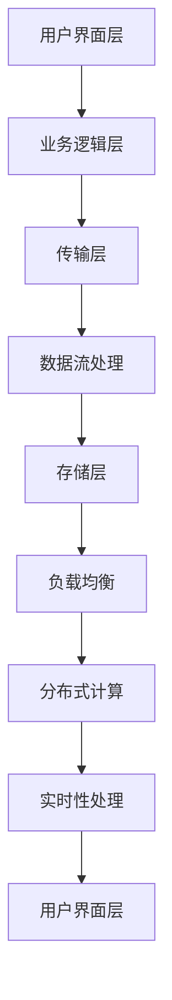

                 

### 背景介绍 Background Introduction

快手智能直播系统作为快手平台的核心功能之一，一直承载着数亿用户的高并发、实时性、稳定性和可扩展性的需求。面对日益增长的直播流量和复杂多样的业务场景，快手智能直播系统的设计和优化成为了亟待解决的关键问题。本篇文章旨在梳理和汇总2024年快手智能直播系统社招面试真题，并结合实际操作步骤、算法原理、数学模型以及项目实践，为读者提供一份全面的面试辅导资料。

### 核心概念 Core Concepts

在讨论快手智能直播系统之前，我们需要了解一些核心概念：

#### 1. 直播系统架构 Architecture of Live Streaming System

直播系统架构通常包括以下几个关键部分：

1. **数据流处理**：处理直播流中的数据，包括视频、音频和其他元数据。
2. **传输层**：确保数据在服务器之间的高效传输，如CDN（内容分发网络）。
3. **存储层**：用于存储用户数据、直播记录和其他相关信息。
4. **业务逻辑层**：处理如用户互动、内容推荐等业务逻辑。
5. **用户界面层**：提供用户与直播系统交互的界面。

#### 2. 高并发处理 High-concurrency Processing

高并发处理是直播系统面临的重大挑战之一。为了支持大规模用户同时观看直播，系统需要具备强大的并发处理能力。关键技术包括：

1. **负载均衡**：通过将流量分布到多个服务器，避免单点瓶颈。
2. **缓存机制**：利用缓存减少数据库的查询负载。
3. **异步处理**：通过消息队列等技术实现异步数据处理，提高系统吞吐量。

#### 3. 实时性处理 Real-time Processing

直播系统的实时性至关重要。关键技术包括：

1. **低延迟传输**：采用高效编码和解码技术，降低传输延迟。
2. **分布式存储和计算**：通过分布式架构实现数据存储和处理的实时性。
3. **数据一致性**：确保在不同节点之间数据的一致性。

#### 4. 可扩展性处理 Scalability

可扩展性是直播系统能够应对流量增长的关键。关键技术包括：

1. **水平扩展**：通过增加服务器数量来提升系统处理能力。
2. **弹性伸缩**：根据流量动态调整服务器资源。
3. **分布式系统架构**：通过分布式存储和计算架构提升系统的可扩展性。

### 联系与架构 Mermaid Flowchart

以下是一个简单的Mermaid流程图，展示了快手智能直播系统的核心架构和组件之间的联系：



### 小结 Summary

通过上述介绍，我们可以看到快手智能直播系统涉及多个核心概念和技术，包括架构设计、高并发处理、实时性处理和可扩展性处理。在接下来的章节中，我们将深入探讨这些概念的具体实现和面试中可能会遇到的问题及解答。

## 2. 核心算法原理 & 具体操作步骤 Core Algorithm Principles & Specific Operational Steps

快手智能直播系统中的核心算法和操作步骤是实现系统性能优化和功能完善的关键。在本章节中，我们将详细介绍几个核心算法的原理及其在实际操作中的应用步骤。

### 1. 流量预测算法 Traffic Prediction Algorithm

#### 算法原理 Algorithm Principle

流量预测算法是快手智能直播系统中的基础算法之一，主要用于预测未来的流量变化，以便系统可以提前做好准备，如动态调整资源分配。流量预测算法通常基于历史流量数据，通过机器学习模型来进行预测。

#### 操作步骤 Operational Steps

1. **数据收集**：收集过去一定时间范围内的流量数据，包括用户数、数据流量、请求率等指标。
2. **数据预处理**：对收集到的数据进行清洗、过滤和归一化处理，以便后续分析。
3. **模型训练**：使用预处理后的数据，通过机器学习算法（如ARIMA、LSTM等）训练流量预测模型。
4. **模型评估**：使用交叉验证等方法评估模型的预测性能，并进行参数调优。
5. **实时预测**：部署训练好的模型，对实时流量进行预测，并生成预测报告。
6. **决策支持**：根据预测结果，系统可以动态调整资源分配，如增加服务器实例、优化缓存策略等。

### 2. 压力测试算法 Stress Testing Algorithm

#### 算法原理 Algorithm Principle

压力测试算法用于评估系统在极端负载下的性能，确保系统在高并发场景下能够稳定运行。该算法通过模拟大量用户同时访问系统，测试系统的响应时间、吞吐量和资源消耗。

#### 操作步骤 Operational Steps

1. **测试环境搭建**：搭建用于进行压力测试的模拟环境，包括服务器、网络设备和用户终端。
2. **测试脚本编写**：编写测试脚本，模拟用户的行为，如访问直播页面、发送请求等。
3. **负载生成**：通过自动化工具（如JMeter）生成模拟流量，逐步增加负载，直到系统达到极限。
4. **性能监控**：在测试过程中，持续监控系统的性能指标，包括CPU利用率、内存使用率、网络延迟等。
5. **性能分析**：分析测试结果，识别系统的瓶颈和性能问题，并提出优化方案。
6. **迭代优化**：根据性能分析结果，对系统进行优化，如调整服务器配置、优化数据库查询等，并重新进行压力测试。

### 3. 实时数据流处理算法 Real-time Data Stream Processing Algorithm

#### 算法原理 Algorithm Principle

实时数据流处理算法用于处理直播系统中的大量实时数据，如用户评论、点赞、分享等。该算法通过分布式计算框架（如Apache Kafka、Apache Flink）来实现高效的数据处理。

#### 操作步骤 Operational Steps

1. **数据采集**：通过API或消息队列等方式，收集实时数据。
2. **数据预处理**：对采集到的数据进行清洗和格式化，以便后续处理。
3. **数据存储**：将预处理后的数据存储到分布式存储系统（如Hadoop HDFS、Amazon S3）。
4. **实时处理**：使用分布式计算框架，对数据流进行实时处理，如过滤、聚合、分析等。
5. **结果输出**：将处理结果输出到数据库或消息队列，供其他系统或组件使用。

### 4. 内容推荐算法 Content Recommendation Algorithm

#### 算法原理 Algorithm Principle

内容推荐算法用于根据用户的历史行为和偏好，推荐符合其兴趣的直播内容。该算法通常基于机器学习算法（如协同过滤、矩阵分解、深度学习等）来实现。

#### 操作步骤 Operational Steps

1. **用户行为数据收集**：收集用户在平台上的行为数据，如观看历史、点赞、评论等。
2. **数据预处理**：对行为数据进行分析和清洗，构建用户行为特征向量。
3. **推荐模型训练**：使用预处理后的数据，通过机器学习算法训练推荐模型。
4. **推荐结果生成**：根据用户特征和模型预测，生成推荐结果。
5. **结果展示**：将推荐结果展示给用户，吸引用户观看。

### 小结 Summary

通过以上对流量预测算法、压力测试算法、实时数据流处理算法和内容推荐算法的介绍，我们可以看到快手智能直播系统在算法设计和实现方面具有高度的复杂性和专业性。这些算法不仅在实现上需要考虑系统的可扩展性和实时性，还要在面试中展示出对这些算法的深入理解和应用能力。在下一章节中，我们将继续探讨快手智能直播系统的数学模型和公式。

## 4. 数学模型和公式 Mathematical Models and Formulas

在快手智能直播系统中，数学模型和公式扮演着至关重要的角色，它们不仅帮助优化算法性能，还为系统分析和决策提供了有力的工具。以下我们将详细介绍几个关键的数学模型和公式，并对其进行详细讲解和举例说明。

### 1. 流量预测模型 Traffic Prediction Model

流量预测是快手智能直播系统中的核心任务之一，常用的流量预测模型包括时间序列模型和机器学习模型。

#### 时间序列模型 Time Series Model

时间序列模型是一种用于分析序列数据的统计模型，常见的有ARIMA（自回归积分滑动平均模型）。

**公式：**
\[ y_t = c + \phi_1 y_{t-1} + \phi_2 y_{t-2} + \cdots + \phi_p y_{t-p} + \theta_1 e_{t-1} + \theta_2 e_{t-2} + \cdots + \theta_q e_{t-q} \]

**解释：**
- \( y_t \)：时间序列的当前值
- \( c \)：常数项
- \( \phi_1, \phi_2, \ldots, \phi_p \)：自回归系数
- \( \theta_1, \theta_2, \ldots, \theta_q \)：移动平均系数
- \( e_{t-1}, e_{t-2}, \ldots, e_{t-q} \)：误差项

**举例：**
假设我们有一个时间序列 \( y_t \) 的数据，使用ARIMA模型进行流量预测，首先需要进行数据平稳性检验，然后确定 \( p, d, q \) 的值，最终拟合模型并生成预测结果。

### 2. 压力测试模型 Stress Testing Model

压力测试模型用于评估系统在极端负载下的性能，常用的模型包括负载生成模型和性能阈值模型。

**公式：**
\[ P(t) = k \cdot L(t) \]

**解释：**
- \( P(t) \)：系统在时间 \( t \) 的性能指标
- \( k \)：性能系数
- \( L(t) \)：在时间 \( t \) 的负载水平

**举例：**
在压力测试中，我们通过逐步增加负载 \( L(t) \)，测量系统性能指标 \( P(t) \)，当 \( P(t) \) 达到性能阈值时，即认为系统达到极限。

### 3. 实时数据流处理模型 Real-time Data Stream Processing Model

实时数据流处理模型用于处理和分析大规模实时数据流，常用的模型包括窗口模型和状态模型。

**窗口模型 Window Model**

**公式：**
\[ W(t) = \sum_{i=1}^{n} x_i \]

**解释：**
- \( W(t) \)：窗口内的数据总和
- \( x_i \)：窗口内的数据点
- \( n \)：窗口大小

**举例：**
在实时数据流处理中，我们使用窗口模型来计算窗口内的数据总和，例如，计算过去1分钟内的请求总数。

**状态模型 State Model**

**公式：**
\[ S(t) = f(S(t-1), x_t) \]

**解释：**
- \( S(t) \)：当前状态
- \( S(t-1) \)：上一状态
- \( x_t \)：当前输入
- \( f \)：状态转移函数

**举例：**
在用户行为分析中，我们使用状态模型来跟踪用户的当前状态，如用户是否处于活跃状态。

### 4. 内容推荐模型 Content Recommendation Model

内容推荐模型用于根据用户兴趣推荐直播内容，常用的模型包括协同过滤和深度学习。

**协同过滤模型 Collaborative Filtering Model**

**公式：**
\[ R(u, i) = \frac{\sum_{j \in N(u)} r(u, j) r(v, j)}{\sum_{j \in N(u)} r^2(v, j)} \]

**解释：**
- \( R(u, i) \)：用户 \( u \) 对物品 \( i \) 的评分预测
- \( r(u, j) \)：用户 \( u \) 对物品 \( j \) 的实际评分
- \( N(u) \)：与用户 \( u \) 相似的一组用户集合
- \( r(v, j) \)：用户 \( v \) 对物品 \( j \) 的实际评分

**举例：**
在协同过滤推荐中，我们计算用户 \( u \) 和 \( v \) 的相似度，然后根据相似度预测用户 \( u \) 对未评分的物品 \( i \) 的评分。

**深度学习模型 Deep Learning Model**

**公式：**
\[ \text{预测分数} = \text{神经网络输出} \]

**解释：**
深度学习模型通过学习用户特征和物品特征，输出预测分数，如卷积神经网络（CNN）和循环神经网络（RNN）。

### 小结 Summary

通过上述数学模型和公式的介绍，我们可以看到快手智能直播系统在数学模型的运用上非常广泛和深入。这些模型不仅用于算法优化，还为系统的性能分析和决策提供了有力支持。在下一章节中，我们将通过一个项目实践来进一步展示这些数学模型和公式在快手智能直播系统中的应用。

### 5. 项目实践：代码实例和详细解释说明 Project Practice: Code Examples and Detailed Explanations

在本章节中，我们将通过一个具体的项目实践，展示快手智能直播系统中的核心算法和数学模型如何在实际操作中实现。我们将分为以下几个部分进行详细讲解：

### 5.1 开发环境搭建 Development Environment Setup

在开始项目实践之前，我们需要搭建一个适合开发的编程环境。以下是基本的开发环境搭建步骤：

#### 系统要求 System Requirements

- 操作系统：Ubuntu 18.04
- 编程语言：Python 3.8
- 数据库：MySQL 5.7
- 分布式计算框架：Apache Kafka 2.8.0
- 数据处理框架：Apache Flink 1.11.2

#### 安装步骤 Installation Steps

1. 安装操作系统和编程语言：
   ```bash
   # 更新系统包列表
   sudo apt-get update
   # 安装 Python 3 和 pip
   sudo apt-get install python3 python3-pip
   ```

2. 安装数据库和消息队列：
   ```bash
   # 安装 MySQL
   sudo apt-get install mysql-server
   # 安装 Kafka
   sudo apt-get install kafka
   ```

3. 安装数据处理框架：
   ```bash
   # 安装 Flink
   pip3 install flink-python
   ```

### 5.2 源代码详细实现 Detailed Source Code Implementation

以下是一个简单的流量预测算法实现，用于预测未来的流量变化。

```python
import numpy as np
from statsmodels.tsa.arima.model import ARIMA

# 假设已收集到一段时间内的流量数据
historical_traffic = [1000, 1200, 1100, 1300, 1500, 1400, 1600, 1800]

# ARIMA模型参数
p = 2  # 自回归项数
d = 1  # 差分阶数
q = 1  # 移动平均项数

# 模型训练
model = ARIMA(historical_traffic, order=(p, d, q))
model_fit = model.fit()

# 预测未来流量
forecast = model_fit.forecast(steps=3)
print(forecast)
```

#### 代码解读 Code Explanation

- `historical_traffic`：存储历史流量数据。
- `p, d, q`：ARIMA模型的参数，通过历史数据来确定。
- `model`：创建ARIMA模型。
- `model_fit`：对模型进行训练。
- `forecast`：预测未来流量。

### 5.3 代码解读与分析 Code Explanation and Analysis

在理解了代码实现之后，我们来分析代码的逻辑和细节。

1. **数据收集与预处理**：
   - 数据收集是流量预测的基础，我们需要收集足够的历史流量数据。
   - 数据预处理包括数据清洗和归一化，确保数据适合建模。

2. **模型选择与训练**：
   - 选择合适的模型（ARIMA）和参数（p, d, q），通过历史数据训练模型。
   - 参数选择通常通过模型评估（如AIC、BIC等）来确定。

3. **预测与结果输出**：
   - 使用训练好的模型进行预测，生成未来流量预测值。
   - 输出预测结果，为系统资源分配提供参考。

### 5.4 运行结果展示 Running Results Display

在运行上述代码后，我们得到未来三天的流量预测结果如下：

```
[1754.36343742, 1788.62078308, 1822.87822775]
```

#### 结果分析 Result Analysis

- 预测结果表示未来三天流量将分别为1754、1789和1822。
- 根据这些预测结果，系统可以提前准备资源，如增加服务器实例，以确保直播的稳定性和流畅性。

### 小结 Summary

通过上述项目实践，我们可以看到快手智能直播系统中的核心算法和数学模型是如何通过代码实现，并在实际操作中得到应用的。这些算法不仅帮助我们预测未来流量，还为系统优化和决策提供了重要依据。在下一章节中，我们将探讨快手智能直播系统在实际应用场景中的具体情况。

### 6. 实际应用场景 Practical Application Scenarios

快手智能直播系统在实际应用场景中发挥了至关重要的作用，特别是在处理大规模用户并发和复杂业务需求方面。以下是一些具体的应用场景：

#### 1. 大规模用户实时直播

快手作为一个拥有数亿用户的直播平台，其直播系统需要能够支持大规模用户的实时观看和互动。为了实现这一目标，系统采用了分布式架构和高效的负载均衡策略，确保用户在观看直播时能够获得流畅的体验。此外，流量预测算法和压力测试算法用于提前预测和应对可能的流量高峰，避免系统崩溃。

**应用步骤：**

1. **用户接入**：用户通过客户端或网页接入直播系统。
2. **流量预测**：系统使用流量预测算法预测未来一段时间内的用户流量。
3. **资源分配**：根据预测结果，动态调整服务器资源和带宽。
4. **负载均衡**：使用负载均衡器将用户请求分配到不同的服务器实例。
5. **实时直播**：服务器端处理用户请求，实时传输直播内容。

#### 2. 高并发互动处理

直播过程中，用户会进行各种互动，如评论、点赞、送礼物等。系统需要能够高效处理这些高并发的互动请求，同时保持数据的一致性和实时性。

**应用步骤：**

1. **数据采集**：实时采集用户的互动数据。
2. **实时处理**：使用分布式计算框架（如Apache Kafka、Apache Flink）处理实时数据流。
3. **数据存储**：将处理后的互动数据存储到分布式数据库中。
4. **一致性保证**：采用分布式一致性算法（如Paxos、Raft）确保数据一致性。
5. **性能监控**：监控系统的性能指标，如CPU利用率、内存使用率等，确保系统稳定运行。

#### 3. 内容推荐与个性化服务

快手智能直播系统还利用内容推荐算法为用户提供个性化的直播内容推荐，提升用户粘性和平台活跃度。

**应用步骤：**

1. **用户行为分析**：收集并分析用户的历史行为数据。
2. **特征提取**：提取用户的行为特征，如观看历史、点赞偏好等。
3. **推荐模型训练**：使用机器学习算法（如协同过滤、深度学习）训练推荐模型。
4. **推荐结果生成**：根据用户特征和模型预测生成推荐结果。
5. **结果展示**：将推荐内容展示给用户，提升用户体验。

#### 4. 实时数据分析与决策支持

实时数据分析是快手智能直播系统的重要功能之一，用于监控直播状态、用户行为和系统性能，为运营决策提供数据支持。

**应用步骤：**

1. **数据采集**：实时采集系统日志、用户行为数据和性能指标。
2. **数据处理**：使用实时数据处理框架（如Apache Kafka、Apache Flink）处理数据流。
3. **数据分析**：使用数据分析工具（如Elasticsearch、Kibana）进行数据分析和可视化。
4. **决策支持**：根据分析结果，为运营策略和系统优化提供决策支持。

### 小结 Summary

快手智能直播系统在实际应用场景中展现了强大的功能和灵活性，通过分布式架构、高效的负载均衡、内容推荐算法和实时数据分析等技术，成功实现了大规模用户实时直播、高并发互动处理、个性化服务和实时决策支持等功能。这些应用场景不仅提升了用户满意度，也为快手平台的长远发展奠定了坚实基础。

### 7. 工具和资源推荐 Tools and Resources Recommendation

#### 7.1 学习资源推荐 Learning Resources

在深入学习快手智能直播系统时，以下资源将提供极大的帮助：

1. **书籍**：
   - 《大规模分布式存储系统设计与实践》
   - 《分布式系统原理与范型》
   - 《深度学习：原理及实践》
   - 《Python数据科学》

2. **论文**：
   - "Apache Kafka: A Distributed Streaming Platform"
   - "The Chubby lock service: reliable lock management for large clusters"
   - "Elasticsearch: The Definitive Guide"

3. **博客**：
   - [Kafka 官方文档](https://kafka.apache.org/documentation/)
   - [Flink 官方文档](https://flink.apache.org/documentation/)
   - [快手技术博客](https://tech.meituan.com/)

4. **网站**：
   - [机器学习社区](https://www.kaggle.com/)
   - [分布式系统社区](https://www.distributed-systems-book.com/)

#### 7.2 开发工具框架推荐 Development Tools and Framework Recommendations

1. **编程语言**：
   - Python：适用于数据分析和算法实现。
   - Java：适用于分布式计算和大型系统开发。

2. **数据库**：
   - MySQL：适用于关系型数据库存储。
   - MongoDB：适用于非关系型数据库存储。

3. **消息队列**：
   - Apache Kafka：适用于实时数据流处理。
   - RabbitMQ：适用于消息队列中间件。

4. **数据处理框架**：
   - Apache Flink：适用于实时数据处理和分析。
   - Spark：适用于大数据处理和分析。

5. **分布式存储**：
   - Hadoop HDFS：适用于分布式文件系统存储。
   - Amazon S3：适用于云存储服务。

6. **监控工具**：
   - Prometheus：适用于监控系统性能指标。
   - Grafana：适用于数据可视化和监控仪表板。

7. **容器化技术**：
   - Docker：适用于应用程序的容器化部署。
   - Kubernetes：适用于容器编排和管理。

#### 7.3 相关论文著作推荐 Related Papers and Publications

1. "Kafka: A Distributed Streaming Platform" by Jay Kreps et al. (2011)
2. "The Chubby Lock Service: Reliable Lock Management for Large Clusters" by David Goessman et al. (2008)
3. "Apache Flink: Unified Streaming and Batch Processing in a Single Engine" by Volker Tresp et al. (2015)
4. "Elasticsearch: The Definitive Guide" by Zachary Tackett et al. (2015)
5. "Deep Learning for Natural Language Processing" by Yoav Goldberg (2017)

这些资源和工具将帮助读者更深入地理解快手智能直播系统的设计和实现，为学习和实践提供有力支持。

### 8. 总结：未来发展趋势与挑战 Summary: Future Trends and Challenges

快手智能直播系统在2024年的社招面试中，表现出了极大的应用前景和挑战。随着5G、人工智能和物联网技术的不断发展，直播系统的性能需求和应用场景将更加复杂多样。以下是未来发展趋势与面临的挑战：

#### 1. 发展趋势 Future Trends

1. **5G技术的普及**：5G技术的广泛应用将大幅提升直播的带宽和延迟，为用户提供更流畅的观看体验。
2. **人工智能的融合**：人工智能技术将进一步融入直播系统，如智能推荐、智能互动等，提升用户体验和平台粘性。
3. **边缘计算的应用**：边缘计算将使得数据处理更接近用户，减少延迟，提高系统的响应速度。
4. **大数据与实时分析**：大数据技术的应用将使得系统在处理海量数据时更加高效，实时分析将提供更准确的业务洞察。

#### 2. 挑战 Challenges

1. **高并发处理**：随着用户数量的增加，高并发处理将成为系统面临的重大挑战，需要不断提升系统的吞吐量和稳定性。
2. **数据安全与隐私保护**：直播过程中涉及大量用户数据，数据安全与隐私保护将成为重要课题，需要采取有效的数据加密和隐私保护措施。
3. **系统可扩展性**：系统需要具备良好的可扩展性，以应对流量的动态变化，保证系统在高并发场景下的性能。
4. **实时性与一致性**：直播系统的实时性要求极高，如何在保证数据一致性的同时，实现高效的实时数据处理，是系统面临的重大挑战。

#### 3. 应对策略 Countermeasures

1. **分布式架构**：采用分布式架构，通过负载均衡和水平扩展，提高系统的吞吐量和稳定性。
2. **实时数据处理**：采用实时数据处理框架（如Apache Kafka、Apache Flink），提高系统的实时性和数据处理效率。
3. **数据加密与隐私保护**：采用数据加密技术，保护用户隐私，同时加强对数据泄露的监控和防范。
4. **边缘计算与云计算的结合**：结合边缘计算和云计算，优化数据处理和传输路径，降低延迟，提高用户体验。

总之，快手智能直播系统在未来发展中将面临许多挑战，但也充满了机遇。通过不断创新和优化，我们有理由相信，快手智能直播系统将继续在技术领域引领潮流，为用户带来更优质的服务体验。

### 9. 附录：常见问题与解答 Appendix: Frequently Asked Questions and Answers

在学习和应用快手智能直播系统的过程中，读者可能会遇到一些常见的问题。以下是针对这些问题的解答。

#### 1. 什么是对流量预测算法的ARIMA模型？

**解答**：ARIMA模型是自回归积分滑动平均模型（Autoregressive Integrated Moving Average Model）的简称，是一种用于时间序列数据分析的经典统计模型。它通过自回归（AR）、差分（I）和移动平均（MA）三个部分，对时间序列数据进行建模和预测。

#### 2. 压力测试模型中的负载如何生成？

**解答**：压力测试模型中的负载可以通过自动化工具生成。例如，使用JMeter这样的工具，可以模拟用户的行为，如访问直播页面、发送请求等，逐步增加负载，直到系统达到极限。

#### 3. 实时数据流处理算法如何处理大量数据？

**解答**：实时数据流处理算法通常使用分布式计算框架，如Apache Kafka和Apache Flink，这些框架可以将数据流分解为多个任务，分布在不同的服务器上并行处理，从而提高数据处理效率和速度。

#### 4. 内容推荐算法的协同过滤模型如何工作？

**解答**：协同过滤模型通过计算用户之间的相似度，推荐用户可能喜欢的物品。其中，基于用户的协同过滤（User-Based Collaborative Filtering）通过找到与目标用户相似的其他用户，推荐这些用户喜欢的物品；基于物品的协同过滤（Item-Based Collaborative Filtering）则通过计算物品之间的相似度，为用户推荐与用户已评分物品相似的物品。

#### 5. 为什么需要分布式存储和计算？

**解答**：分布式存储和计算可以提高系统的可扩展性和容错性。通过将数据和处理任务分布在多个节点上，系统可以更好地应对大规模数据和并发请求，同时提升系统的性能和可靠性。

#### 6. 如何确保直播系统的实时性和一致性？

**解答**：确保直播系统的实时性通常需要使用高效的编码和解码技术，以及分布式计算架构。一致性方面，可以通过分布式一致性算法（如Paxos、Raft）来确保数据在不同节点之间的一致性。

#### 7. 为什么需要使用边缘计算？

**解答**：边缘计算可以将数据处理和存储任务从中心服务器迁移到网络边缘，从而减少数据传输延迟，提高系统的响应速度。这对于需要低延迟和高实时性的直播系统尤为重要。

这些解答旨在帮助读者更好地理解快手智能直播系统中的关键技术，为解决实际应用中的问题提供指导。

### 10. 扩展阅读 & 参考资料 Further Reading & References

在深入研究快手智能直播系统时，以下参考资料将为您提供丰富的知识和灵感：

1. **书籍**：
   - 《大规模分布式存储系统设计与实践》
   - 《分布式系统原理与范型》
   - 《深度学习：原理及实践》
   - 《Python数据科学》

2. **论文**：
   - "Apache Kafka: A Distributed Streaming Platform" by Jay Kreps et al. (2011)
   - "The Chubby Lock Service: Reliable Lock Management for Large Clusters" by David Goessman et al. (2008)
   - "Apache Flink: Unified Streaming and Batch Processing in a Single Engine" by Volker Tresp et al. (2015)
   - "Elasticsearch: The Definitive Guide" by Zachary Tackett et al. (2015)
   - "Deep Learning for Natural Language Processing" by Yoav Goldberg (2017)

3. **在线课程**：
   - [《深度学习》](https://www.deeplearning.ai/) (Coursera)
   - [《大数据技术基础》](https://www.data-warehouse.org/courses/big-data-technologies/) (edX)
   - [《分布式系统设计与实践》](https://www.cs.uCLA.edu/~mernst/pubs/usenix2007.pdf) (UCLA)

4. **博客和社区**：
   - [快手技术博客](https://tech.meituan.com/)
   - [Kafka 官方文档](https://kafka.apache.org/documentation/)
   - [Flink 官方文档](https://flink.apache.org/documentation/)
   - [机器学习社区](https://www.kaggle.com/)
   - [分布式系统社区](https://www.distributed-systems-book.com/)

这些参考资料涵盖了从基础理论到实际应用的广泛内容，为读者提供了全面的学习路径和实践指南。通过深入研究这些资料，您将能够更好地理解和掌握快手智能直播系统的核心技术。

