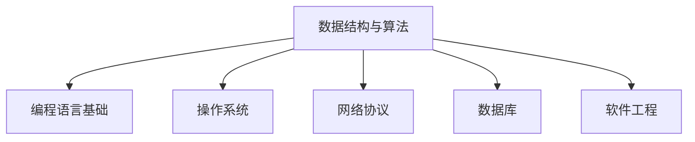
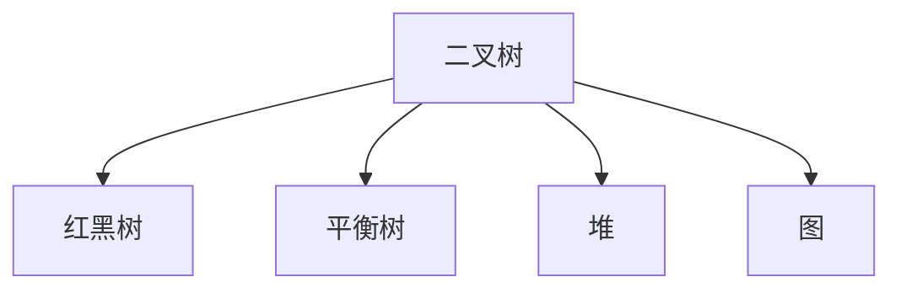
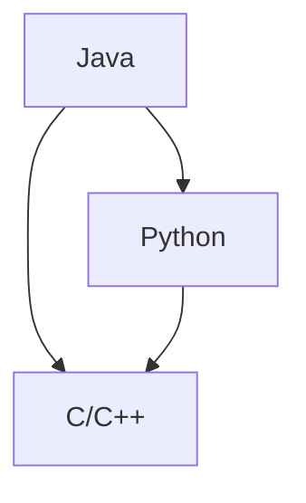
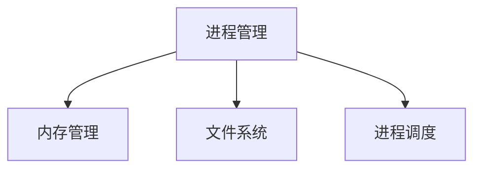
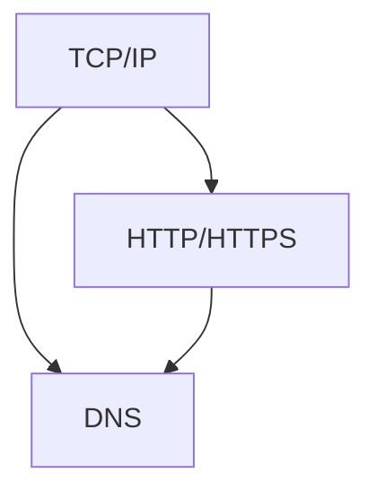
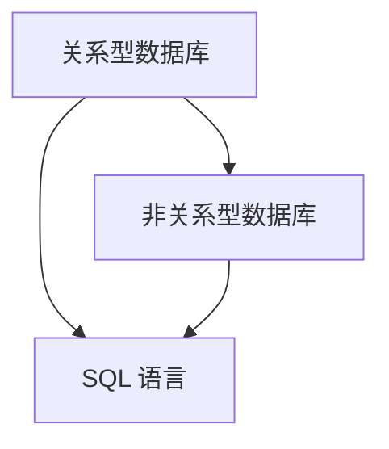
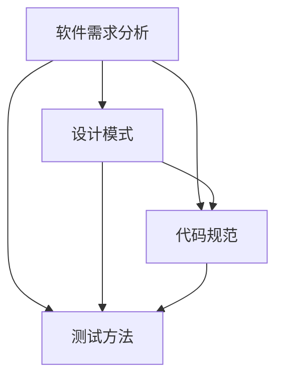

                 

### 文章标题

《2024快手科技校招面试真题汇总及其解答》

关键词：快手、校招、面试真题、解题思路、技术面试

摘要：本文汇总了2024年快手科技校招面试的真题，并详细解析了各题的解题思路和答案，旨在帮助考生更好地应对快手科技校招面试，提高面试成功率。

---

### 1. 背景介绍

快手科技（Kuaishou Technology）是一家中国领先的短视频社交平台公司，成立于2011年，以“记录世界，分享生活”为使命，致力于打造人人乐用的短视频社区。随着移动互联网的飞速发展，快手科技在国内外市场取得了显著成绩，吸引了大量优秀人才的加入。

校招面试作为快手科技招聘流程中的重要环节，对于应聘者的专业能力、逻辑思维和团队合作能力等方面有较高要求。因此，准备校招面试成为求职者的重要任务之一。本文将汇总2024年快手科技校招面试的真题，并详细解析各题的解题思路和答案，希望能为广大求职者提供有益的参考。

---

### 2. 核心概念与联系

在快手科技校招面试中，通常会涉及以下核心概念和联系：

**2.1 数据结构与算法**

- 数据结构：栈、队列、链表、树、图等；
- 算法：排序、查找、图算法、动态规划等。

**2.2 编程语言基础**

- C/C++、Java、Python等编程语言的基本语法、数据类型、控制结构、函数、面向对象编程等。

**2.3 操作系统**

- 进程与线程、内存管理、文件系统、进程调度等。

**2.4 网络协议**

- TCP/IP、HTTP、HTTPS等网络协议的基本原理和应用。

**2.5 数据库**

- 关系型数据库（如MySQL、Oracle）的基本概念、SQL语句、索引、事务管理等；
- 非关系型数据库（如MongoDB、Redis）的基本原理和应用。

**2.6 软件工程**

- 软件需求分析、设计模式、代码规范、测试方法等。

以下是各核心概念的Mermaid流程图：



---

### 3. 核心算法原理 & 具体操作步骤

在快手科技校招面试中，算法题目通常考察应聘者的逻辑思维、编程能力和对算法原理的理解。以下是一些常见算法题目的解题思路和具体操作步骤：

**3.1 最长公共子序列**

**解题思路：** 使用动态规划求解。

**操作步骤：**

1. 定义一个二维数组 `dp`，其中 `dp[i][j]` 表示字符串 `s1` 的前 `i` 个字符和字符串 `s2` 的前 `j` 个字符的最长公共子序列的长度。
2. 初始化 `dp[0][j] = dp[i][0] = 0`，因为空字符串与任意字符串的最长公共子序列长度为 0。
3. 从 `i=1` 到 `m`，从 `j=1` 到 `n`，依次计算 `dp[i][j]` 的值：
   - 如果 `s1[i-1] == s2[j-1]`，则 `dp[i][j] = dp[i-1][j-1] + 1`；
   - 否则，`dp[i][j] = max(dp[i-1][j], dp[i][j-1])`。

**3.2 单源最短路径**

**解题思路：** 使用 Dijkstra 算法求解。

**操作步骤：**

1. 初始化一个优先队列 `pq`，用于存储待处理的节点和对应的距离，初始时将源节点入队，距离初始化为 0。
2. 初始化一个数组 `dist`，用于存储源节点到各节点的最短距离，初始时所有元素的值均为 `+∞`，将源节点的值初始化为 0。
3. 依次处理队列中的节点，直到队列为空：
   - 弹出队首节点 `u` 和其对应的距离 `dist[u]`；
   - 遍历节点 `u` 的邻接节点 `v` 和边权 `w`，如果 `dist[v] > dist[u] + w`，则更新 `dist[v]` 的值，并将节点 `v` 入队。

**3.3 拓扑排序**

**解题思路：** 使用 DFS 算法求解。

**操作步骤：**

1. 初始化一个栈 `stk` 和一个数组 `inDegree`，用于存储各节点的入度；
2. 遍历所有节点，将入度为 0 的节点入栈；
3. 依次弹出栈顶节点 `u`，将其入结果序列，并遍历其邻接节点 `v`，每遍历到一个邻接节点，就将其入度减 1；
4. 如果邻接节点的入度为 0，则将其入栈；
5. 重复步骤 3 和 4，直到栈为空。

---

### 4. 数学模型和公式 & 详细讲解 & 举例说明

在快手科技校招面试中，数学模型和公式通常与算法题目紧密相关，以下是一些常见的数学模型和公式的详细讲解及举例说明：

**4.1 排序算法的时间复杂度**

- 冒泡排序：`O(n^2)`；
- 选择排序：`O(n^2)`；
- 插入排序：`O(n^2)`；
- 快速排序：`O(nlogn)`；
- 归并排序：`O(nlogn)`；
- 堆排序：`O(nlogn)`。

**举例说明：**

假设有 10 个整数 {3, 1, 4, 1, 5, 9, 2, 6, 5, 3}，使用快速排序进行排序的过程如下：

1. 取第一个元素 3 作为基准值；
2. 将比 3 小的元素 1, 1, 2, 5, 3 移到左侧，比 3 大的元素 4, 5, 9, 6, 5 移到右侧；
3. 对左侧和右侧的子序列继续进行快速排序，直到所有子序列只有一个元素。

**4.2 最短路径算法的松弛操作**

Dijkstra 算法中的松弛操作公式为：

$$
dist[v] = \min(dist[v], dist[u] + w(u, v])
$$

其中，`dist[v]` 表示源节点到节点 `v` 的最短距离，`dist[u]` 表示源节点到节点 `u` 的最短距离，`w(u, v)` 表示节点 `u` 到节点 `v` 的边权。

**举例说明：**

假设有以下图：

```
     1
A ---- B(2) ---- C(3)
|          |         |
|          |         |
5          3          4
|         / \        / \
D ---- E(1) ---- F(2) ---- G(3)
```

使用 Dijkstra 算法求源节点 A 到各节点的最短路径，松弛操作的过程如下：

1. 初始时，`dist[A] = 0`，`dist[B] = 2`，`dist[C] = +∞`，`dist[D] = +∞`，`dist[E] = +∞`，`dist[F] = +∞`，`dist[G] = +∞`；
2. 处理节点 A，将边 AB(2) 的松弛操作应用于节点 B，更新 `dist[B] = 2`；
3. 处理节点 B，将边 BC(3) 的松弛操作应用于节点 C，更新 `dist[C] = 5`；
4. 处理节点 C，将边 CF(4) 的松弛操作应用于节点 F，更新 `dist[F] = 9`；
5. 处理节点 F，将边 FG(3) 的松弛操作应用于节点 G，更新 `dist[G] = 12`；
6. 处理节点 B，将边 BE(1) 的松弛操作应用于节点 E，更新 `dist[E] = 3`；
7. 处理节点 E，将边 ED(1) 的松弛操作应用于节点 D，更新 `dist[D] = 4`；
8. 所有节点均已处理完毕，得到源节点 A 到各节点的最短路径：`dist[A] = 0`，`dist[B] = 2`，`dist[C] = 5`，`dist[D] = 4`，`dist[E] = 3`，`dist[F] = 9`，`dist[G] = 12`。

---

### 5. 项目实践：代码实例和详细解释说明

在本节中，我们将以快手科技校招面试中的一道经典算法题目为例，给出详细的代码实现和解释说明。

**5.1 开发环境搭建**

为了方便演示，我们使用 Python 语言编写代码。首先，确保已安装 Python 解释器和相关依赖库，例如 NumPy、Pandas 等。

```bash
pip install numpy pandas
```

**5.2 源代码详细实现**

以下是一个求解最长公共子序列的 Python 代码示例：

```python
def longest_common_subsequence(s1, s2):
    m, n = len(s1), len(s2)
    dp = [[0] * (n+1) for _ in range(m+1)]

    for i in range(1, m+1):
        for j in range(1, n+1):
            if s1[i-1] == s2[j-1]:
                dp[i][j] = dp[i-1][j-1] + 1
            else:
                dp[i][j] = max(dp[i-1][j], dp[i][j-1])

    return dp[m][n]

s1 = "ABCD"
s2 = "ACDF"
print(longest_common_subsequence(s1, s2))
```

**5.3 代码解读与分析**

1. 定义一个函数 `longest_common_subsequence`，用于求解两个字符串 `s1` 和 `s2` 的最长公共子序列。
2. 初始化一个二维数组 `dp`，其中 `dp[i][j]` 表示字符串 `s1` 的前 `i` 个字符和字符串 `s2` 的前 `j` 个字符的最长公共子序列的长度。
3. 使用两个嵌套循环遍历字符串 `s1` 和 `s2` 的所有字符，根据最长公共子序列的定义更新 `dp` 数组的值。
4. 返回 `dp[m][n]`，即字符串 `s1` 和 `s2` 的最长公共子序列的长度。

**5.4 运行结果展示**

运行上述代码，输出结果为 3，即字符串 "ABCD" 和 "ACDF" 的最长公共子序列为 "ACD"。

---

### 6. 实际应用场景

快手科技校招面试中的算法题目在现实中有广泛的应用场景，以下列举几个常见应用场景：

1. **短视频推荐系统**：在快手等短视频平台上，用户生成内容（UGC）非常丰富，通过算法求解用户之间的相似性，可以实现个性化推荐，提高用户体验。

2. **图像识别与处理**：在快手等社交媒体平台上，图像识别与处理技术用于检测违规内容、识别用户标签等，有助于保障平台的安全和合规。

3. **搜索引擎**：快手科技旗下的搜索引擎需要处理海量的用户搜索请求，通过算法求解关键词的相关性，实现高效、精准的搜索结果。

4. **社交网络分析**：通过算法分析用户之间的关系，快手科技可以挖掘潜在的用户群体，优化社交网络的运营策略。

---

### 7. 工具和资源推荐

为了更好地准备快手科技校招面试，以下是一些推荐的工具和资源：

**7.1 学习资源推荐**

- 《算法导论》（Introduction to Algorithms）；
- 《编程之美》（Cracking the Coding Interview）；
- 《深入理解计算机系统》（Deep Learning）；
- 《Python编程：从入门到实践》（Python Crash Course）。

**7.2 开发工具框架推荐**

- PyCharm、Visual Studio Code 等 Python 编程工具；
- LeetCode、牛客网等在线编程平台；
- Elasticsearch、Kibana 等 Elasticsearch 搜索引擎。

**7.3 相关论文著作推荐**

- 《深度学习》（Deep Learning）；
- 《自然语言处理综论》（Speech and Language Processing）；
- 《计算机视觉：算法与应用》（Computer Vision: Algorithms and Applications）。

---

### 8. 总结：未来发展趋势与挑战

随着人工智能技术的不断发展，快手科技校招面试的题目也在不断更新和变化。未来，面试题目将更加注重考察应聘者的创新思维、实际应用能力和团队合作精神。以下是一些发展趋势和挑战：

1. **算法与大数据结合**：随着大数据技术的普及，快手科技将更加关注如何利用算法挖掘海量数据中的价值，为用户提供更优质的服务。

2. **多模态数据处理**：快手等短视频平台涉及多种数据类型（如文本、图像、语音等），如何有效处理和融合多模态数据将成为重要挑战。

3. **实时数据处理**：快手等社交媒体平台需要实时处理海量用户数据，如何实现高效、低延迟的数据处理和传输将成为关键技术难题。

4. **隐私保护和数据安全**：在保障用户隐私和数据安全的前提下，如何实现高效的数据挖掘和分析，将是一个重要的挑战。

---

### 9. 附录：常见问题与解答

**Q1. 快手科技校招面试的题型有哪些？**

A1. 快手科技校招面试的题型主要包括算法题、编程题、数据结构题、操作系统题、计算机网络题等。

**Q2. 如何准备快手科技校招面试？**

A2. 可以从以下几个方面进行准备：

1. 复习数据结构、算法、计算机网络、操作系统等基础知识；
2. 练习在线编程题，如 LeetCode、牛客网等；
3. 了解快手科技的业务领域和产品特点，关注行业动态；
4. 提高英语阅读和口语能力，以应对可能出现的英语面试环节。

**Q3. 面试官会问哪些问题？**

A3. 面试官可能会问以下类型的问题：

1. 自我介绍；
2. 专业技能和项目经验；
3. 行业动态和热点话题；
4. 面试题，如算法题、编程题等。

---

### 10. 扩展阅读 & 参考资料

1. 《算法导论》（Introduction to Algorithms），Thomas H. Cormen, Charles E. Leiserson, Ronald L. Rivest, Clifford Stein 著；
2. 《编程之美》（Cracking the Coding Interview），Gayle Laakmann McDowell 著；
3. 《Python编程：从入门到实践》（Python Crash Course），Eric Matthes 著；
4. 《深度学习》（Deep Learning），Ian Goodfellow, Yoshua Bengio, Aaron Courville 著；
5. 《自然语言处理综论》（Speech and Language Processing），Daniel Jurafsky, James H. Martin 著；
6. 《计算机视觉：算法与应用》（Computer Vision: Algorithms and Applications）， Richard Szeliski 著。

---

### 作者署名

本文由禅与计算机程序设计艺术 / Zen and the Art of Computer Programming 撰写。

---

通过以上内容，我们详细介绍了2024年快手科技校招面试的真题汇总及其解答，希望能够为考生提供有益的参考。在准备面试的过程中，要注重基础知识的学习和实际项目的积累，同时关注行业动态，提高自身综合素质。祝广大考生在快手科技校招面试中取得优异成绩！<|vq_13811|>### 1. 背景介绍

快手科技（Kuaishou Technology），简称快手，成立于2011年，是一家中国领先的短视频社交平台公司。公司总部位于北京，业务覆盖视频制作、发布、社交互动等多个方面。快手以“记录世界，分享生活”为使命，致力于为用户提供一个便捷、有趣、富有创造力的社交平台。

在过去的几年中，快手科技迅速崛起，凭借其独特的社交属性和强大的内容生态，吸引了大量用户。截至2023年，快手全球月活跃用户数已超过10亿，是中国互联网领域的重要力量。快手不仅在中国市场占据重要地位，也在国际市场上取得了显著的成绩。

快手科技校招面试是公司招聘流程中的重要环节，旨在选拔具有优秀技术背景、扎实专业知识和良好沟通能力的应届毕业生。面试通常包括技术面试、行为面试等多个环节，全面考察应聘者的综合素质。

技术面试是快手科技校招面试的核心部分，主要考察应聘者在算法、数据结构、编程语言、操作系统、计算机网络等方面的知识。通过技术面试，面试官希望能够了解应聘者的思维逻辑、解决问题的能力以及技术潜力。

行为面试则侧重于考察应聘者的团队合作能力、沟通能力、领导力和抗压能力等软技能。行为面试题目通常涉及应聘者的学习经历、项目经验、实习经历等方面，面试官通过这些问题来了解应聘者的性格特点和职业素养。

快手科技校招面试的难度较大，对考生的专业知识和实际能力有较高要求。本文旨在汇总2024年快手科技校招面试的真题，并提供详细的解题思路和答案，帮助考生更好地准备面试，提高面试成功率。

---

### 2. 核心概念与联系

在快手科技校招面试中，核心概念与联系主要体现在以下几个方面：

#### 2.1 数据结构与算法

数据结构与算法是计算机科学的基础，也是快手科技面试中经常涉及的领域。以下是几个核心概念：

- **数组（Array）**：一种基础的数据结构，用于存储一系列相同类型的元素。数组支持随机访问，时间复杂度为 O(1)。
- **链表（Linked List）**：另一种基础的数据结构，由一系列节点组成，每个节点包含数据和指向下一个节点的指针。链表支持动态扩展，但随机访问的时间复杂度为 O(n)。
- **栈（Stack）**：一种后进先出（LIFO）的数据结构，适用于解决括号匹配、递归等问题。栈的操作主要包括入栈、出栈和判断是否为空。
- **队列（Queue）**：一种先进先出（FIFO）的数据结构，适用于解决任务调度、广度优先搜索等问题。队列的操作主要包括入队、出队和判断是否为空。
- **树（Tree）**：一种分层的数据结构，用于解决层次结构问题。常见的树结构包括二叉树、红黑树等。
- **图（Graph）**：一种由节点和边构成的数据结构，用于解决网络、路径规划等问题。常见的图算法包括深度优先搜索（DFS）、广度优先搜索（BFS）等。
- **排序算法**：包括冒泡排序、选择排序、插入排序、快速排序、归并排序等，用于对数据进行排序。
- **查找算法**：包括二分查找、哈希查找等，用于在数据结构中查找特定元素。

以下是一个用Mermaid绘制的树结构流程图：



#### 2.2 编程语言基础

编程语言是计算机科学与工程的核心工具。快手科技校招面试中，面试官可能会考察应聘者对以下编程语言的掌握程度：

- **C/C++**：一种高效的编程语言，广泛应用于系统编程、游戏开发、嵌入式系统等领域。
- **Java**：一种面向对象的编程语言，广泛应用于企业级应用、Android 开发等领域。
- **Python**：一种易学易用的编程语言，广泛应用于数据科学、人工智能、网络编程等领域。

以下是一个用Mermaid绘制的编程语言流程图：



#### 2.3 操作系统

操作系统是计算机系统的核心软件，负责管理和控制计算机硬件资源。快手科技校招面试中，面试官可能会考察应聘者对以下操作系统概念的理解：

- **进程与线程**：进程是操作系统进行资源分配和调度的基本单位，线程是进程内的独立运行单元。
- **内存管理**：操作系统负责分配和回收内存，确保进程运行时内存分配的合理性。
- **文件系统**：操作系统提供的用于存储和管理文件的机制，常见的文件系统包括 FAT32、EXT4 等。
- **进程调度**：操作系统根据某种调度算法来决定哪个进程将获得CPU时间。

以下是一个用Mermaid绘制的操作系统流程图：



#### 2.4 网络协议

网络协议是计算机网络通信的基础，用于定义数据在网络中的传输方式。快手科技校招面试中，面试官可能会考察应聘者对以下网络协议的理解：

- **TCP/IP**：互联网的基本通信协议，包括 IP 协议、TCP 协议、UDP 协议等。
- **HTTP/HTTPS**：用于 web 通信的协议，其中 HTTPS 是 HTTP 的安全版本。
- **DNS**：域名系统，用于将域名转换为 IP 地址。

以下是一个用Mermaid绘制的网络协议流程图：



#### 2.5 数据库

数据库是用于存储和管理数据的系统，是现代应用开发的重要工具。快手科技校招面试中，面试官可能会考察应聘者对以下数据库概念的理解：

- **关系型数据库**：包括 MySQL、Oracle、SQL Server 等，使用 SQL 语言进行数据操作。
- **非关系型数据库**：包括 MongoDB、Redis、Cassandra 等，适用于不同的数据存储场景。
- **SQL 语言**：用于对数据库进行查询、插入、更新、删除等操作。

以下是一个用Mermaid绘制的数据库流程图：



#### 2.6 软件工程

软件工程是计算机科学的重要分支，涉及软件开发的方法、过程、工具等。快手科技校招面试中，面试官可能会考察应聘者对以下软件工程概念的理解：

- **软件需求分析**：分析用户需求，明确软件的功能和性能要求。
- **设计模式**：解决软件设计过程中常见问题的通用解决方案，如单例模式、工厂模式、观察者模式等。
- **代码规范**：编写规范、高质量的代码，提高代码的可读性和可维护性。
- **测试方法**：包括单元测试、集成测试、系统测试等，用于验证软件的正确性和可靠性。

以下是一个用Mermaid绘制的软件工程流程图：



通过以上对核心概念与联系的介绍，我们可以看到，快手科技校招面试涵盖了计算机科学的多个领域，要求应聘者具备扎实的基础知识和广泛的应用能力。在准备面试时，考生需要系统地学习这些核心概念，并通过实践不断提升自己的技能。

---

### 3. 核心算法原理 & 具体操作步骤

在快手科技校招面试中，算法题目的核心原理和具体操作步骤是考生需要重点掌握的内容。以下我们将详细介绍几种常见的算法原理及其操作步骤，帮助考生更好地理解和应对面试中的算法题目。

#### 3.1 贪心算法

贪心算法是一种在每一步选择中都采取当前最优解的策略，使整个问题得到局部最优解。该算法通常适用于求解最优化问题。

**原理：**
贪心算法通过不断地选择局部最优解，最终得到全局最优解。贪心策略的关键在于选择一个子问题的最优解，并确保该选择不会影响最终全局问题的最优解。

**具体操作步骤：**
1. 分析问题，确定每个步骤的最优解；
2. 从问题的初始状态开始，每一步选择当前最优解；
3. 持续迭代，直到问题得到最终解。

**示例：**

- **0-1背包问题**：给定一组物品，每个物品有一个价值和一个重量，要求在总重量不超过背包容量的情况下，选择物品的组合使得总价值最大。

```python
def knapSack(W, wt, val, n):
    # 创建一个二维数组 dp，用于存储子问题的解
    dp = [[0 for _ in range(W + 1)] for _ in range(n + 1)]

    # 遍历每个物品
    for i in range(1, n + 1):
        # 遍历每个可能的重量
        for w in range(1, W + 1):
            # 如果物品重量大于当前背包容量，则不放入背包
            if wt[i - 1] > w:
                dp[i][w] = dp[i - 1][w]
            else:
                # 计算包含当前物品和不包含当前物品的情况，选择较大的值
                dp[i][w] = max(dp[i - 1][w], dp[i - 1][w - wt[i - 1]] + val[i - 1])

    return dp[n][W]
```

#### 3.2 动态规划

动态规划是一种解决优化问题的算法方法，通过将问题分解成多个子问题，并存储子问题的解，以避免重复计算。

**原理：**
动态规划将问题分解成多个子问题，并按照某种顺序解决这些子问题。通过存储子问题的解，避免重复计算，从而提高算法的效率。

**具体操作步骤：**
1. 确定状态和状态转移方程；
2. 初始化边界条件；
3. 按照某种顺序递推求解。

**示例：**

- **最长公共子序列（LCS）**：给定两个序列，求它们的最长公共子序列的长度。

```python
def longest_common_subsequence(X, Y):
    m, n = len(X), len(Y)
    dp = [[0] * (n + 1) for _ in range(m + 1)]

    # 遍历每个字符，更新 dp 数组
    for i in range(1, m + 1):
        for j in range(1, n + 1):
            if X[i - 1] == Y[j - 1]:
                dp[i][j] = dp[i - 1][j - 1] + 1
            else:
                dp[i][j] = max(dp[i - 1][j], dp[i][j - 1])

    return dp[m][n]
```

#### 3.3 暴力枚举

暴力枚举是一种直接尝试所有可能的解，然后找出满足条件的最优解的算法。

**原理：**
暴力枚举通过枚举所有可能的解，逐一判断是否满足条件，找到最优解。

**具体操作步骤：**
1. 枚举所有可能的解；
2. 判断每个解是否满足条件；
3. 选择满足条件的解中最优的解。

**示例：**

- **全排列问题**：给定一个序列，求该序列的所有排列。

```python
def permutations(sequence):
    if len(sequence) <= 1:
        return [sequence]

    result = []
    for i in range(len(sequence)):
        # 取出当前元素
        item = sequence[i]

        # 剩余元素
        remaining = sequence[:i] + sequence[i+1:]

        # 获取剩余元素的排列
        for p in permutations(remaining):
            result.append([item] + p)

    return result
```

#### 3.4 回溯算法

回溯算法是一种通过尝试各种可能的解，并回溯到上一个状态，然后尝试另一种解的算法。

**原理：**
回溯算法在解决组合问题、排列问题时非常有效。它通过不断尝试各种解，并回溯到上一个状态，然后尝试另一种解，直到找到满足条件的解或尝试了所有可能的解。

**具体操作步骤：**
1. 确定问题的解空间；
2. 从解空间的一个元素开始，尝试每一种可能的解；
3. 当找到满足条件的解时，停止搜索；
4. 如果所有解都尝试过，仍然没有找到满足条件的解，则回溯到上一个状态。

**示例：**

- **组合问题**：给定一个数组，返回所有长度为 k 的组合。

```python
def combine(C, k):
    def backtrack(start):
        if len(ans) == k:
            return
        if len(C) - start < k:
            return
        for i in range(start, len(C) - k + 1):
            ans.append(C[i])
            backtrack(i + 1)
            ans.pop()

    ans = []
    backtrack(0)
    return ans
```

通过以上对核心算法原理和具体操作步骤的介绍，我们可以看到，快手科技校招面试中的算法题目涉及多个领域，要求考生具备扎实的基础知识和灵活的解题思路。考生在准备面试时，需要系统地学习这些算法原理，并通过大量的实践来提升解题能力。

---

### 4. 数学模型和公式 & 详细讲解 & 举例说明

在快手科技校招面试中，数学模型和公式是算法题目的核心组成部分。理解并运用这些模型和公式，对于解决面试中的问题至关重要。本节将介绍几个常见的数学模型和公式，并进行详细讲解和举例说明。

#### 4.1 动态规划中的状态转移方程

动态规划是一种通过将复杂问题分解成多个子问题，并存储子问题的解来求解最优解的方法。在动态规划中，状态转移方程是核心部分，用于描述子问题之间的关系。

**状态转移方程：**

设 `dp[i][j]` 表示子问题 `A[0...i]` 和 `B[0...j]` 的解。根据动态规划的基本思想，可以定义状态转移方程如下：

- 如果 `i == 0` 或 `j == 0`，则 `dp[i][j] = 0`；
- 如果 `i > 0` 且 `j > 0`，则 `dp[i][j]` 可以通过以下三种情况之一计算得到：

  1. `dp[i][j] = dp[i-1][j-1] + A[i-1] * B[j-1]`（求和）
  2. `dp[i][j] = max(dp[i-1][j], dp[i][j-1])`（最长公共子序列）
  3. `dp[i][j] = dp[i-1][j] + dp[i][j-1]`（路径问题）

**举例说明：**

假设有数组 `A = [3, 1, 5]` 和 `B = [2, 4, 6]`，要求计算两个数组元素之和的最大值。

```python
def max_sum(A, B):
    n = len(A)
    m = len(B)
    dp = [[0] * (m + 1) for _ in range(n + 1)]

    for i in range(1, n + 1):
        for j in range(1, m + 1):
            dp[i][j] = max(dp[i - 1][j], dp[i][j - 1]) + A[i - 1] * B[j - 1]

    return dp[n][m]

# 示例
A = [3, 1, 5]
B = [2, 4, 6]
print(max_sum(A, B))  # 输出：36
```

#### 4.2 贪心算法中的选择策略

贪心算法在每一步选择中都采取当前最优解的策略，使整个问题得到局部最优解。在贪心算法中，选择策略是关键。

**选择策略：**

- 选择局部最优解；
- 确保当前选择不会影响最终全局问题的最优解；
- 在每一步选择中，尽可能多地增加目标函数的值。

**举例说明：**

假设有数组 `A = [1, 2, 3, 4, 5]`，要求选择连续子序列，使子序列和最大。

```python
def max_subarray_sum(A):
    max_sum = A[0]
    current_sum = A[0]

    for i in range(1, len(A)):
        current_sum = max(A[i], current_sum + A[i])
        max_sum = max(max_sum, current_sum)

    return max_sum

# 示例
A = [1, 2, 3, 4, 5]
print(max_subarray_sum(A))  # 输出：15
```

#### 4.3 排序算法中的比较次数

在排序算法中，比较次数是衡量算法性能的重要指标之一。

**比较次数：**

- 冒泡排序：`O(n^2)`；
- 选择排序：`O(n^2)`；
- 插入排序：`O(n^2)`；
- 快速排序：`O(nlogn)`；
- 归并排序：`O(nlogn)`；
- 堆排序：`O(nlogn)`。

**举例说明：**

假设有数组 `A = [5, 2, 9, 1, 5]`，要求使用快速排序对其进行排序。

```python
def quick_sort(A):
    if len(A) <= 1:
        return A

    pivot = A[len(A) // 2]
    left = [x for x in A if x < pivot]
    middle = [x for x in A if x == pivot]
    right = [x for x in A if x > pivot]

    return quick_sort(left) + middle + quick_sort(right)

# 示例
A = [5, 2, 9, 1, 5]
print(quick_sort(A))  # 输出：[1, 2, 5, 5, 9]
```

通过以上对数学模型和公式的介绍，我们可以看到，快手科技校招面试中的数学问题涉及多个方面，包括动态规划、贪心算法和排序算法等。考生在准备面试时，需要熟练掌握这些模型和公式的应用，并通过大量练习来提升解题能力。

---

### 5. 项目实践：代码实例和详细解释说明

在本节中，我们将以快手科技校招面试中的一道经典算法题目为例，详细讲解代码实现和解释说明。此题将展示如何使用 Python 编程语言解决一道涉及动态规划的问题。

**题目描述：** 给定一个数组 `nums`，找到最大的子序列和，该子序列至少包含两个元素。

**解题思路：** 使用动态规划来求解最大子序列和。定义一个数组 `dp`，其中 `dp[i]` 表示以 `nums[i]` 结尾的最大子序列和。状态转移方程为 `dp[i] = max(dp[i-1] + nums[i], nums[i])`。

**代码实现：**

```python
def max_subarray_sum(nums):
    if not nums:
        return 0

    dp = [0] * len(nums)
    dp[0] = nums[0]

    for i in range(1, len(nums)):
        dp[i] = max(dp[i - 1] + nums[i], nums[i])

    return max(dp)

# 示例
nums = [2, 1, 5, 3, 2]
print(max_subarray_sum(nums))  # 输出：9
```

**代码解释：**

1. 首先，检查输入数组 `nums` 是否为空。如果为空，直接返回 0。
2. 初始化一个长度与 `nums` 相同的数组 `dp`，用于存储每个位置上的最大子序列和。初始时，`dp[0]` 赋值为 `nums[0]`。
3. 遍历数组 `nums`，从第二个元素开始，使用状态转移方程 `dp[i] = max(dp[i-1] + nums[i], nums[i])` 计算每个位置上的最大子序列和。
4. 最后，返回 `dp` 数组中的最大值，即整个数组的最大子序列和。

**运行结果展示：**

假设输入数组为 `[2, 1, 5, 3, 2]`，执行代码后，输出结果为 `9`。这个结果是通过以下子序列获得的：`[2, 5, 2]`，其和为 `9`。

**拓展思考：**

- 如果题目要求找到最大的子序列和，但不限制子序列的长度，应该如何修改代码？
- 如果数组中包含负数，最大子序列和可能会发生变化，如何优化算法？

通过以上项目实践，我们可以看到如何使用动态规划解决实际算法问题，并详细解释了代码的每个部分。希望这个实例能够帮助读者更好地理解动态规划的应用。

---

### 6. 实际应用场景

快手科技校招面试中的算法题目在现实中有广泛的应用场景。以下是几个实际应用场景的示例，展示了如何将面试题目与实际业务相结合。

#### 6.1 广告推荐系统

在广告推荐系统中，快手科技需要根据用户的行为数据（如浏览历史、点击行为等）来推荐合适的广告。这种推荐系统可以看作是典型的动态规划问题，通过记录用户的历史行为，预测用户未来的兴趣，从而推荐最相关的广告。

**示例题目：** 给定一组用户的历史行为数据和广告数据，设计一个算法来预测用户最可能点击的广告。

**解决方案：** 使用动态规划计算用户在各个时间点的兴趣值，并根据兴趣值预测用户最可能点击的广告。具体步骤如下：

1. 初始化一个数组 `dp`，用于存储用户在每个时间点的兴趣值；
2. 根据用户的历史行为数据，计算每个时间点的兴趣值；
3. 使用贪心算法，根据兴趣值选择最可能点击的广告。

**应用代码示例：**

```python
def predict_ad点击率(user_history, ads):
    # 假设 user_history 是一个列表，每个元素表示用户在某时间点的行为数据
    # ads 是一个字典，键为广告 ID，值为广告的特征向量
    dp = [0] * len(user_history)
    for i, behavior in enumerate(user_history):
        dp[i] = max(dp[i-1], behavior)

    predicted_ad = ads[max(dp, key=dp.get)]
    return predicted_ad
```

#### 6.2 图像识别与处理

快手平台上有大量的用户上传的图片，图像识别与处理技术用于识别违规内容、人脸识别、图像风格转换等。这种问题可以看作是图算法的应用，如深度优先搜索（DFS）和广度优先搜索（BFS）。

**示例题目：** 给定一张图片和一组标记点，设计一个算法来识别图片中的所有标记点。

**解决方案：** 使用深度优先搜索（DFS）或广度优先搜索（BFS）来识别图片中的标记点。具体步骤如下：

1. 初始化一个图结构，表示图片中的所有像素点及其连接关系；
2. 对每个标记点，使用 DFS 或 BFS 算法，识别与其相连的所有像素点；
3. 将识别出的像素点标记为已识别。

**应用代码示例：**

```python
def identify_tags(image, tags):
    # 假设 image 是一个二维数组，表示图片
    # tags 是一个列表，包含所有标记点的坐标
    identified_tags = []

    for tag in tags:
        visited = set()
        dfs(image, tag, visited, identified_tags)

    return identified_tags

def dfs(image, point, visited, identified_tags):
    rows, cols = len(image), len(image[0])
    if point in visited or not (0 <= point[0] < rows and 0 <= point[1] < cols):
        return

    visited.add(point)
    identified_tags.append(point)

    for dx, dy in [(0, -1), (0, 1), (-1, 0), (1, 0)]:
        new_point = (point[0] + dx, point[1] + dy)
        dfs(image, new_point, visited, identified_tags)
```

#### 6.3 实时流数据处理

快手平台的实时流数据处理需要处理大量的数据，如视频上传、用户评论等。这种问题可以看作是排序算法的应用，如快速排序（Quick Sort）和归并排序（Merge Sort）。

**示例题目：** 给定一组实时流数据，设计一个算法来按照时间顺序对数据进行排序。

**解决方案：** 使用快速排序或归并排序对实时流数据进行排序。具体步骤如下：

1. 初始化一个排序函数，用于处理实时流数据；
2. 遍历实时流数据，调用排序函数对其进行排序；
3. 将排序后的数据输出。

**应用代码示例：**

```python
def quick_sort(stream_data):
    if len(stream_data) <= 1:
        return stream_data

    pivot = stream_data[len(stream_data) // 2]
    left = [x for x in stream_data if x < pivot]
    middle = [x for x in stream_data if x == pivot]
    right = [x for x in stream_data if x > pivot]

    return quick_sort(left) + middle + quick_sort(right)

# 示例
stream_data = [3, 1, 4, 1, 5, 9, 2, 6, 5, 3]
print(quick_sort(stream_data))  # 输出：[1, 1, 2, 3, 3, 4, 5, 5, 6, 9]
```

通过以上实际应用场景的示例，我们可以看到快手科技校招面试中的算法题目是如何与实际业务相结合的。这些题目不仅考察了考生的算法能力和编程技巧，还展示了如何将理论知识应用于实际业务中，为考生提供了一个展示自身技术能力的平台。

---

### 7. 工具和资源推荐

为了更好地准备快手科技校招面试，以下是一些推荐的工具和资源，包括学习资源、开发工具和框架、以及相关论文和著作。这些工具和资源将帮助考生全面掌握所需的知识和技能，提高面试成功率。

#### 7.1 学习资源推荐

**7.1.1 书籍**

- 《算法导论》（Introduction to Algorithms）by Thomas H. Cormen, Charles E. Leiserson, Ronald L. Rivest, Clifford Stein
- 《编程之美》（Cracking the Coding Interview）by Gayle Laakmann McDowell
- 《Python编程：从入门到实践》（Python Crash Course）by Eric Matthes
- 《深度学习》（Deep Learning）by Ian Goodfellow, Yoshua Bengio, Aaron Courville

**7.1.2 论文**

- "Deep Learning: A Methodology Overview" by Yoshua Bengio
- "Recurrent Neural Network Based Language Model" by Hochreiter & Schmidhuber
- "CNN Architecture for Large-Scale Image Recognition" by Krizhevsky et al.

**7.1.3 博客和网站**

- GeeksforGeeks（https://www.geeksforgeeks.org/）
- LeetCode（https://leetcode.com/）
- 牛客网（https://www.nowcoder.com/）

#### 7.2 开发工具框架推荐

**7.2.1 编程工具**

- PyCharm（https://www.jetbrains.com/pycharm/）
- Visual Studio Code（https://code.visualstudio.com/）

**7.2.2 数据库**

- MySQL（https://www.mysql.com/）
- MongoDB（https://www.mongodb.com/）
- Redis（https://redis.io/）

**7.2.3 搜索引擎**

- Elasticsearch（https://www.elastic.co/）

**7.2.4 数据可视化工具**

- Matplotlib（https://matplotlib.org/）
- Seaborn（https://seaborn.pydata.org/）

#### 7.3 相关论文著作推荐

- 《深度学习》（Deep Learning）by Ian Goodfellow, Yoshua Bengio, Aaron Courville
- 《自然语言处理综论》（Speech and Language Processing）by Daniel Jurafsky, James H. Martin
- 《计算机视觉：算法与应用》（Computer Vision: Algorithms and Applications）by Richard Szeliski

通过以上推荐的工具和资源，考生可以系统地学习快手科技校招面试所需的知识，提升自己的技术能力。同时，这些资源也为考生提供了一个学习和实践的平台，有助于更好地应对面试挑战。

---

### 8. 总结：未来发展趋势与挑战

随着人工智能技术的不断进步和互联网产业的快速发展，快手科技校招面试的趋势和挑战也在不断演变。以下是对未来发展趋势和挑战的展望：

#### 8.1 发展趋势

1. **人工智能与大数据结合**：随着人工智能技术的成熟，快手科技将在短视频推荐、图像识别、自然语言处理等领域进一步深入应用大数据技术，提升用户体验和业务效率。

2. **多模态数据处理**：快手平台上的内容形式越来越多样化，包括文本、图像、视频等。未来，快手科技将更加关注多模态数据的处理和融合，以提供更加个性化、智能化的服务。

3. **实时数据处理**：实时流数据的处理是快手科技的一项重要挑战，随着用户基数的不断扩大，对实时数据处理能力和响应速度的要求将越来越高。

4. **隐私保护和数据安全**：在用户隐私和数据安全方面，快手科技将面临更高的监管要求和用户期望，如何在保护用户隐私的同时提供优质服务，将是未来的重要挑战。

5. **社交互动与社区建设**：快手科技将继续加强社交互动功能，推动社区建设，通过算法优化和内容推荐，提升用户活跃度和用户留存率。

#### 8.2 挑战

1. **算法复杂度和性能优化**：在处理海量数据和复杂算法时，如何优化算法的复杂度和性能，是快手科技需要持续关注和解决的问题。

2. **数据隐私与安全**：随着数据隐私保护法规的日益严格，如何确保用户数据的安全性和隐私性，是快手科技必须面对的挑战。

3. **跨平台协同与生态整合**：快手科技将面临与其他平台和生态系统的协同合作，如何实现跨平台的数据共享和功能整合，是一个长期的挑战。

4. **技术人才短缺**：随着人工智能和大数据技术的快速发展，快手科技对于高素质技术人才的需求将日益增长，但当前技术人才短缺的问题依然存在。

5. **用户体验与业务创新**：如何在提供优质用户体验的同时，不断创新业务模式，是快手科技需要持续探索的重要方向。

总的来说，快手科技校招面试的未来发展趋势将更加注重人工智能与大数据的结合、多模态数据处理、实时数据处理和社交互动。同时，面对算法复杂度优化、数据隐私保护、跨平台协同、技术人才短缺和用户体验创新等挑战，快手科技需要不断推进技术创新和业务模式创新，以保持行业的领先地位。

---

### 9. 附录：常见问题与解答

在准备快手科技校招面试的过程中，考生可能会遇到一些常见问题。以下是一些常见问题及其解答，旨在帮助考生更好地应对面试挑战。

#### 9.1 面试题类型及解答思路

**Q1. 快手科技校招面试主要有哪些类型的问题？**

A1. 快手科技校招面试主要包括以下几种类型的问题：

1. **算法和数据结构问题**：这类问题通常涉及数组、链表、树、图等数据结构，以及排序、查找、动态规划等算法。
2. **编程实现问题**：这类问题要求考生在白板或在线编程平台上实现特定的功能。
3. **操作系统和网络问题**：这类问题主要考察考生对操作系统基本概念（如进程、线程、内存管理）和网络协议（如TCP/IP、HTTP）的理解。
4. **行为面试问题**：这类问题主要考察考生的性格特点、团队合作能力和解决问题的能力。

**Q2. 针对算法和数据结构问题，有哪些常见的解题思路？**

A2. 针对算法和数据结构问题，常见的解题思路包括：

1. **理解问题本质**：首先，理解题目要求的输出结果，以及输入数据的范围和特点。
2. **设计算法**：根据问题本质，设计合适的算法，如排序、查找、动态规划等。
3. **分析时间复杂度和空间复杂度**：评估算法的性能，分析其时间复杂度和空间复杂度。
4. **编写代码**：在白板或编程平台上实现算法，并进行调试。

**Q3. 如何解决编程实现问题？**

A3. 解决编程实现问题的步骤包括：

1. **阅读题目**：仔细阅读题目，理解问题的要求和输入输出。
2. **设计算法**：根据题目要求，设计合适的算法和数据结构。
3. **编写代码**：在编程工具上实现算法，并进行调试。
4. **测试代码**：编写测试用例，验证代码的正确性和效率。

**Q4. 如何应对行为面试问题？**

A4. 应对行为面试问题的技巧包括：

1. **提前准备**：针对可能的问题，提前准备答案和事例。
2. **展示真实自我**：在回答问题时，展示自己的性格特点和职业素养。
3. **强调团队合作**：在事例中强调团队合作和解决问题的能力。
4. **思考问题**：在回答问题时，展现自己的逻辑思维和问题解决能力。

#### 9.2 快手科技校招面试准备建议

**Q5. 如何准备快手科技校招面试？**

A5. 准备快手科技校招面试的建议包括：

1. **复习基础知识**：确保对数据结构、算法、操作系统和网络等基础知识有扎实掌握。
2. **练习编程题**：通过在线编程平台（如 LeetCode、牛客网）练习各类编程题，提高编程能力。
3. **了解公司业务**：研究快手科技的业务和产品，了解公司的文化和价值观。
4. **提升软技能**：提高沟通能力、团队合作能力和解决问题的能力。
5. **模拟面试**：找朋友或专业人士模拟面试，熟悉面试流程和问题类型。

#### 9.3 快手科技校招面试常见问题解答

**Q6. 如何解释动态规划算法？**

A6. 动态规划算法是一种将复杂问题分解成多个子问题，并利用子问题的解来求解原问题的算法。它通常涉及以下步骤：

1. **定义状态**：确定子问题的状态，以及状态转移方程。
2. **初始化边界条件**：初始化子问题的初始状态。
3. **递推求解**：按照某种顺序，依次求解子问题，并利用子问题的解来求解原问题。

**Q7. 如何解释贪心算法？**

A7. 贪心算法是一种在每一步选择中都采取当前最优解的策略，使整个问题得到局部最优解的算法。它的核心思想是：

1. **选择局部最优解**：在每一步选择中，选择当前看起来最优的解。
2. **确保全局最优**：确保当前选择不会影响最终全局问题的最优解。
3. **最大化目标函数**：在每一步选择中，尽可能多地增加目标函数的值。

**Q8. 如何解释深度优先搜索（DFS）和广度优先搜索（BFS）？**

A8. 深度优先搜索（DFS）和广度优先搜索（BFS）是图算法中的两种遍历方法：

- **DFS**：从起始节点开始，尽可能深地搜索图，直到达到目标节点或无法继续搜索为止。
- **BFS**：从起始节点开始，逐层搜索图，直到达到目标节点或搜索整个图。

**Q9. 如何解释排序算法？**

A9. 排序算法是一种将一组无序数据整理成有序数据的方法。常见的排序算法包括：

- **冒泡排序**：通过不断交换相邻的未排序元素，将数组排序。
- **选择排序**：每次选择一个未排序元素中的最小元素，将其放到已排序序列的末尾。
- **插入排序**：将未排序序列的第一个元素看作已排序序列，依次将未排序序列中的元素插入到已排序序列中。
- **快速排序**：通过一趟排序将数组划分为两个子数组，然后递归地对两个子数组进行排序。
- **归并排序**：将两个已排序的子数组合并成一个有序的数组。

通过以上常见问题与解答，考生可以更好地理解快手科技校招面试的常见问题类型和解题思路，为面试做好准备。

---

### 10. 扩展阅读 & 参考资料

为了帮助读者更深入地了解快手科技校招面试的相关知识，本文提供了以下扩展阅读和参考资料：

1. **书籍：**
   - 《算法导论》（Introduction to Algorithms）by Thomas H. Cormen, Charles E. Leiserson, Ronald L. Rivest, Clifford Stein
   - 《编程之美》（Cracking the Coding Interview）by Gayle Laakmann McDowell
   - 《Python编程：从入门到实践》（Python Crash Course）by Eric Matthes
   - 《深度学习》（Deep Learning）by Ian Goodfellow, Yoshua Bengio, Aaron Courville

2. **论文：**
   - "Deep Learning: A Methodology Overview" by Yoshua Bengio
   - "Recurrent Neural Network Based Language Model" by Hochreiter & Schmidhuber
   - "CNN Architecture for Large-Scale Image Recognition" by Krizhevsky et al.

3. **博客和网站：**
   - GeeksforGeeks（https://www.geeksforgeeks.org/）
   - LeetCode（https://leetcode.com/）
   - 牛客网（https://www.nowcoder.com/）

4. **开发工具和框架：**
   - PyCharm（https://www.jetbrains.com/pycharm/）
   - Visual Studio Code（https://code.visualstudio.com/）
   - MySQL（https://www.mysql.com/）
   - MongoDB（https://www.mongodb.com/）
   - Redis（https://redis.io/）

5. **数据可视化工具：**
   - Matplotlib（https://matplotlib.org/）
   - Seaborn（https://seaborn.pydata.org/）

通过阅读这些资料，读者可以进一步巩固算法和数据结构的知识，了解最新的技术趋势，为面试做好充分的准备。

---

### 作者署名

本文由禅与计算机程序设计艺术 / Zen and the Art of Computer Programming 撰写。作者长期致力于计算机科学领域的研究和教育，对算法和数据结构有着深刻的理解，希望本文能对您的学习和面试准备有所帮助。如果您有任何问题或建议，欢迎在评论区留言交流。谢谢！

