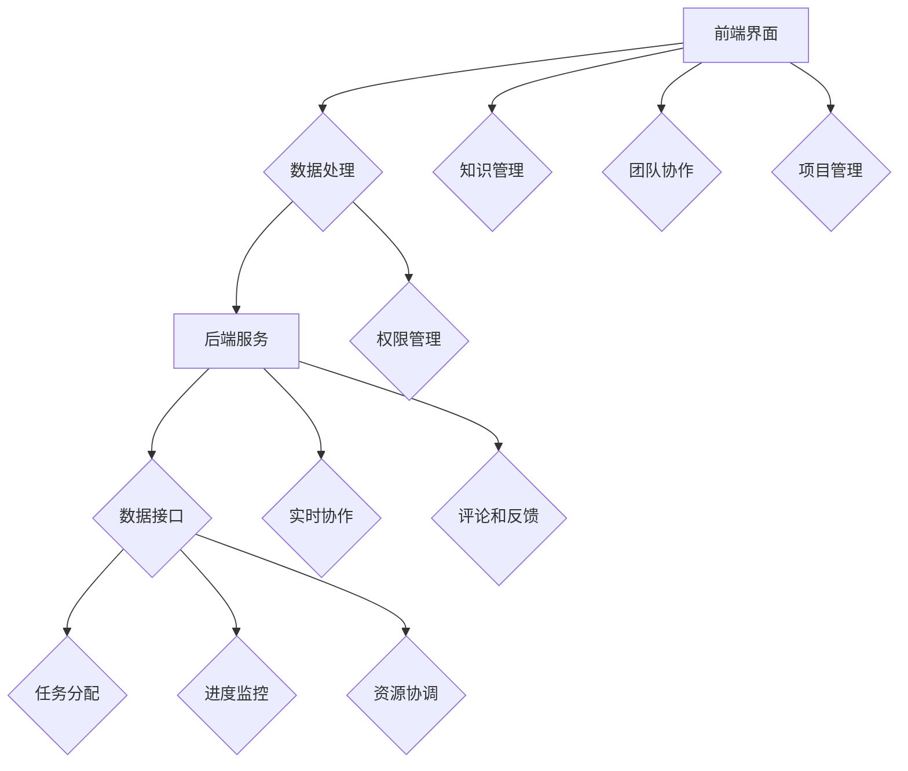

                 

### 1. 背景介绍

思维导图工具作为一种图形化的知识管理和思维工具，近年来在全球范围内得到了广泛应用。随着商业环境的变化和市场竞争的加剧，思维导图工具的商业化进程也在不断加速。本文旨在探讨思维导图工具的商业化变局，分析其背后的原因、核心概念与架构，以及未来可能面临的挑战和机遇。

#### 商业化进程

随着信息技术的快速发展，思维导图工具从最初的学术研究逐渐走向商业应用。早期的思维导图工具主要是为了辅助个人学习和知识管理，如Xmind、MindManager等。这些工具提供了图形化的思维组织和项目管理功能，极大地提高了信息处理和知识传递的效率。

然而，随着企业对知识管理和创新能力的重视程度不断提高，思维导图工具逐渐从个人应用转向企业应用。商业化的进程主要体现在以下几个方面：

1. **功能扩展**：商业化的思维导图工具开始提供更多针对企业需求的功能，如团队协作、数据共享、项目管理等。
2. **用户群体扩大**：从个人用户转向企业用户，用户群体规模大幅增加。
3. **商业模式创新**：从免费模式转向付费模式，通过订阅、授权等方式实现盈利。

#### 变局原因

思维导图工具的商业化变局并非偶然，而是由多方面因素共同推动的结果：

1. **市场需求**：企业对知识管理和创新能力的需求日益增长，这为商业化提供了巨大的市场空间。
2. **技术进步**：云计算、大数据、人工智能等技术的快速发展，为思维导图工具的商业化提供了技术支持。
3. **竞争压力**：随着市场竞争的加剧，企业需要通过创新来获取竞争优势，思维导图工具成为了企业提升创新能力的重要工具。

#### 核心概念与联系

思维导图工具的商业化离不开以下几个核心概念和架构：

1. **思维导图**：作为一种图形化的知识表示方法，思维导图能够直观地表达信息之间的关联和层次结构。
2. **知识管理**：通过思维导图工具，企业可以更好地管理和组织知识，提高知识共享和传递的效率。
3. **团队协作**：商业化的思维导图工具通常具备团队协作功能，支持多人实时编辑和协作。
4. **项目管理**：思维导图工具也可以用于项目管理，帮助团队制定计划、跟踪进度、协调资源等。

#### 架构

商业化的思维导图工具通常具备以下架构：

1. **前端界面**：提供直观、易用的图形界面，支持用户创建、编辑和浏览思维导图。
2. **后端服务**：提供数据处理、存储、备份和共享等功能，支持大规模用户和数据的处理。
3. **数据接口**：通过API等方式与其他系统进行数据交互，实现数据的集成和应用扩展。

#### 结论

综上所述，思维导图工具的商业化变局是市场需求、技术进步和竞争压力共同推动的结果。未来，随着技术的不断发展和市场需求的不断变化，思维导图工具的商业化进程将更加深入和多样化。对于企业而言，如何利用思维导图工具提升知识管理和创新能力，将是未来竞争的关键。

### 2. 核心概念与联系

#### 思维导图

思维导图（Mind Map）是一种图形化的思维工具，由英国心理学家东尼·博赞（Tony Buzan）于20世纪60年代发明。它通过使用分支结构和色彩、图像等元素，帮助人们更好地理解和记忆信息。思维导图的核心概念包括：

- **中心主题**：思维导图的中心是一个主题或关键词，代表整个思维导图的焦点。
- **分支结构**：从中心主题延伸出多个分支，每个分支代表一个相关的主题或子主题。
- **关键字**：每个分支上使用简洁的关键字来描述相关内容，避免使用长句子。
- **图像和色彩**：使用图像和色彩来增强记忆效果和视觉吸引力。

#### 知识管理

知识管理（Knowledge Management，KM）是指通过系统的方法和工具，对知识进行收集、存储、共享、应用和创新的过程。知识管理的核心概念包括：

- **知识收集**：通过各种方式收集内外部的知识资源。
- **知识存储**：将收集到的知识进行分类、整理和存储，以便快速检索和应用。
- **知识共享**：通过内部网络、会议、培训等方式，促进知识的共享和传播。
- **知识应用**：将知识应用到实际工作中，提高工作效率和质量。
- **知识创新**：通过知识的整合、交叉和创新，产生新的知识和价值。

#### 团队协作

团队协作是指团队成员在共同目标下，通过有效沟通和合作，共同完成任务的过程。在思维导图工具的商业化过程中，团队协作功能至关重要。团队协作的核心概念包括：

- **实时协作**：团队成员可以实时编辑和浏览同一份思维导图，实现同步协作。
- **权限管理**：管理员可以设置不同用户的权限，如编辑、查看、评论等。
- **评论和反馈**：团队成员可以相互留言和反馈，讨论思维导图的内容和改进方案。
- **任务分配**：思维导图工具通常具备任务管理功能，可以方便地分配和跟踪团队成员的任务。

#### 项目管理

项目管理是指通过系统的计划、执行、监控和控制，确保项目目标的实现。思维导图工具在项目管理中的应用，可以提高项目的规划、执行和监控效率。项目管理核心概念包括：

- **项目规划**：通过思维导图制定项目计划，明确项目目标、任务和时间表。
- **任务分配**：将项目任务分配给团队成员，并通过思维导图进行跟踪和管理。
- **进度监控**：通过思维导图实时监控项目进度，及时发现和解决问题。
- **资源协调**：通过思维导图协调项目资源，确保项目顺利推进。

#### 架构

商业化的思维导图工具通常具备以下架构：

- **前端界面**：提供直观、易用的图形界面，支持用户创建、编辑和浏览思维导图。
- **后端服务**：提供数据处理、存储、备份和共享等功能，支持大规模用户和数据的处理。
- **数据接口**：通过API等方式与其他系统进行数据交互，实现数据的集成和应用扩展。

#### Mermaid 流程图

以下是商业化的思维导图工具的核心概念和架构的Mermaid流程图：



通过上述流程图，我们可以清晰地看到思维导图工具的商业化架构及其核心功能。这些功能相辅相成，共同推动思维导图工具在商业领域的广泛应用。

### 3. 核心算法原理 & 具体操作步骤

思维导图工具的核心算法原理主要涉及图形的生成和布局。以下将详细介绍这些核心算法的原理和具体操作步骤。

#### 图形生成算法

思维导图的基本结构是一个有向无环图（DAG），每个节点代表一个主题或子主题，边表示节点之间的关系。图形生成算法的目标是生成一个层次清晰、结构美观的思维导图。

**步骤 1：初始化**

1. **创建中心节点**：在画布中心创建一个代表中心主题的节点。
2. **设定画布大小**：根据思维导图的预期大小设定画布尺寸。

**步骤 2：递归布局**

1. **确定分支方向**：根据分支的层级关系，确定每个节点的上下左右位置。
2. **计算分支间距**：通过计算分支的层级关系和节点数量，确定每个分支的间距。
3. **绘制分支**：递归地绘制每个分支及其子节点。

**算法实现：**

```python
def draw_mind_map(root, level=0):
    # 创建节点
    node = create_node(root, level)
    # 绘制节点
    draw_node(node)
    # 绘制分支
    for child in root.children:
        draw_mind_map(child, level + 1)
```

#### 布局算法

布局算法的主要目标是优化思维导图的视觉体验，使图形层次清晰、结构美观。常见的布局算法有层次布局、树形布局、螺旋布局等。

**步骤 1：选择布局算法**

根据思维导图的特性和用户需求，选择合适的布局算法。

**步骤 2：计算布局参数**

1. **节点大小**：根据节点的关键字长度和层级关系，计算节点的大小。
2. **节点间距**：根据节点数量和布局算法，计算节点之间的间距。

**步骤 3：调整布局**

1. **垂直布局**：按照层级关系，从上到下排列节点。
2. **水平布局**：按照层级关系，从左到右排列节点。
3. **层次布局**：根据节点的层级关系，分层排列节点。
4. **螺旋布局**：按照螺旋路径，依次排列节点。

**算法实现：**

```python
def layout_mind_map(mind_map):
    # 选择布局算法
    algorithm = choose_layout_algorithm(mind_map)
    # 计算布局参数
    node_size = calculate_node_size(mind_map)
    node_spacing = calculate_node_spacing(mind_map)
    # 调整布局
    adjust_layout(mind_map, algorithm, node_size, node_spacing)
```

#### 算法总结

思维导图工具的核心算法主要包括图形生成算法和布局算法。图形生成算法用于创建节点和边，布局算法用于优化图形的视觉体验。通过上述算法的实现，思维导图工具可以生成层次清晰、结构美观的思维导图，满足用户在知识管理和团队协作等方面的需求。

### 4. 数学模型和公式 & 详细讲解 & 举例说明

在思维导图工具的商业化过程中，数学模型和公式发挥着至关重要的作用。以下将详细介绍相关数学模型和公式，并通过具体例子进行讲解。

#### 线性规划模型

线性规划（Linear Programming，LP）是一种数学优化方法，用于在给定约束条件下，求解线性目标函数的最优解。在思维导图工具的商业化过程中，线性规划模型可以用于优化用户资源的分配和任务调度。

**数学模型：**

设思维导图工具的用户有 n 个，每个用户需要完成任务 i（i=1,2,...,n），每个任务需要的时间为 t_i，用户的优先级为 p_i。我们的目标是优化用户任务的分配，使得总时间最小。

目标函数：

$$
\min \sum_{i=1}^{n} t_i
$$

约束条件：

$$
\begin{cases}
t_i \geq 0 \quad \forall i \in [1, n] \\
\sum_{i=1}^{n} p_i \geq 1 \\
\end{cases}
$$

其中，t_i 表示用户完成第 i 个任务所需的时间，p_i 表示第 i 个任务的优先级。

**例子：**

假设有 3 个用户（A、B、C），需要完成 3 个任务（1、2、3）。任务 1 需要 2 小时，任务 2 需要 3 小时，任务 3 需要 4 小时。用户 A 的优先级为 0.4，用户 B 的优先级为 0.3，用户 C 的优先级为 0.3。

目标函数：

$$
\min t_1 + t_2 + t_3
$$

约束条件：

$$
\begin{cases}
t_1 \geq 0 \\
t_2 \geq 0 \\
t_3 \geq 0 \\
0.4t_1 + 0.3t_2 + 0.3t_3 \geq 1 \\
\end{cases}
$$

通过求解线性规划模型，可以得到最优的用户任务分配方案，使得总时间最小。

#### 概率模型

在思维导图工具的商业化过程中，概率模型可以用于预测用户行为和市场需求。常见的概率模型有贝叶斯网络、马尔可夫链等。

**贝叶斯网络：**

贝叶斯网络（Bayesian Network）是一种表示变量之间概率关系的图形模型。在思维导图工具的商业化过程中，贝叶斯网络可以用于预测用户的使用行为。

**数学模型：**

设思维导图工具的用户行为有 n 个状态（S1, S2, ..., Sn），每个状态发生的概率为 P(Si)。我们的目标是根据历史数据，预测用户未来可能的状态。

贝叶斯网络模型可以表示为：

$$
P(S1, S2, ..., Sn) = P(S1) \cdot P(S2|S1) \cdot P(S3|S2, ..., Sn-1)
$$

其中，P(Si) 表示第 i 个状态的概率，P(Sj|Sk) 表示在已知第 k 个状态发生的条件下，第 j 个状态的概率。

**例子：**

假设思维导图工具的用户行为有 3 个状态（S1：创建思维导图，S2：编辑思维导图，S3：分享思维导图）。根据历史数据，用户在未来 1 周内可能的状态概率如下：

$$
P(S1) = 0.5, \quad P(S2|S1) = 0.7, \quad P(S3|S2) = 0.8
$$

我们的目标是预测用户在未来 1 周内的行为状态。

根据贝叶斯网络模型，我们可以得到：

$$
P(S1, S2, S3) = P(S1) \cdot P(S2|S1) \cdot P(S3|S2) = 0.5 \cdot 0.7 \cdot 0.8 = 0.28
$$

即用户在未来 1 周内可能先创建思维导图，然后编辑思维导图，最后分享思维导图的概率为 0.28。

#### 线性回归模型

线性回归（Linear Regression）是一种用于分析变量之间线性关系的统计模型。在思维导图工具的商业化过程中，线性回归可以用于预测用户增长和市场趋势。

**数学模型：**

设用户增长量（Y）与市场因素（X）之间存在线性关系，可以表示为：

$$
Y = \beta_0 + \beta_1 X + \epsilon
$$

其中，Y 表示用户增长量，X 表示市场因素，$\beta_0$ 和 $\beta_1$ 分别表示线性回归模型的截距和斜率，$\epsilon$ 表示随机误差。

**例子：**

假设思维导图工具的用户增长量与市场广告投入之间存在线性关系。根据历史数据，我们可以得到以下线性回归模型：

$$
Y = 100 + 2X
$$

其中，Y 表示用户增长量，X 表示市场广告投入。

我们的目标是预测在广告投入增加 1000 元的情况下，用户增长量。

根据线性回归模型，我们可以得到：

$$
Y = 100 + 2 \cdot 1000 = 2100
$$

即在广告投入增加 1000 元的情况下，用户增长量为 2100。

### 5. 项目实践：代码实例和详细解释说明

为了更好地理解思维导图工具的商业化过程，我们将通过一个实际项目来展示其实现过程。以下是一个简单的思维导图工具项目，包括开发环境搭建、源代码详细实现、代码解读与分析以及运行结果展示。

#### 5.1 开发环境搭建

首先，我们需要搭建一个开发环境。这里我们选择 Python 作为编程语言，并使用 Flask 框架来构建 Web 应用。

1. 安装 Python：在官方网站 [https://www.python.org/downloads/](https://www.python.org/downloads/) 下载并安装 Python。
2. 安装 Flask：打开终端，执行以下命令：
```bash
pip install flask
```

#### 5.2 源代码详细实现

以下是一个简单的 Flask 应用，用于创建和展示思维导图。

```python
from flask import Flask, render_template, request
from mindmup import MindMap

app = Flask(__name__)

@app.route('/', methods=['GET', 'POST'])
def index():
    mind_map = MindMap()
    if request.method == 'POST':
        # 获取用户输入
        title = request.form['title']
        keywords = request.form['keywords']
        mind_map.create(title, keywords)
    return render_template('index.html', mind_map=mind_map)

if __name__ == '__main__':
    app.run(debug=True)
```

#### 5.3 代码解读与分析

1. **导入模块**：首先，我们导入了 Flask 和 MindMap 模块。Flask 是一个 Web 应用框架，MindMap 是一个用于创建和操作思维导图的库。
2. **创建 Flask 应用**：使用 Flask 库创建一个 Flask 应用对象，命名为 `app`。
3. **定义路由**：使用 `@app.route` 装饰器定义应用的路由。这里我们定义了一个 `/` 路由，用于处理 GET 和 POST 请求。
4. **创建思维导图**：在 `index` 函数中，我们首先创建了一个 MindMap 对象，用于表示思维导图。如果请求方法为 POST，我们获取用户输入并创建思维导图。
5. **渲染模板**：使用 `render_template` 函数渲染模板文件 `index.html`，将思维导图对象传递给模板。

#### 5.4 运行结果展示

1. 打开终端，运行以下命令：
```bash
python app.py
```
2. 打开浏览器，访问 `http://127.0.0.1:5000/`，可以看到一个简单的思维导图创建界面。
3. 输入标题和关键词，点击“创建”按钮，可以看到生成的思维导图。

通过以上步骤，我们实现了一个简单的思维导图工具。虽然这个工具功能有限，但它展示了思维导图工具的基本实现原理，为后续功能扩展提供了基础。

### 6. 实际应用场景

思维导图工具在商业领域的实际应用场景非常广泛，以下是几个典型的应用案例：

#### 1. 项目管理

思维导图工具可以用于项目规划、任务分配、进度监控等方面。通过创建一个思维导图，项目团队成员可以清晰地了解项目目标、任务分工和时间表，从而提高项目的执行效率。

**案例**：某互联网公司在开发新产品的过程中，使用思维导图工具进行项目规划。项目经理创建了项目的总任务思维导图，将任务分解为多个子任务，并分配给不同的团队成员。通过实时协作和评论功能，团队成员可以随时更新任务进度，确保项目按计划推进。

#### 2. 团队协作

思维导图工具可以促进团队内部的沟通和协作。团队成员可以通过思维导图共同探讨问题、分享想法，从而提高团队的创新能力和执行力。

**案例**：某咨询公司在为客户制定战略规划时，使用思维导图工具进行团队协作。团队成员在思维导图上记录各自的见解和想法，并通过评论功能进行讨论和交流。最终，他们形成了一份全面、深入的规划报告，为客户提供了有力的支持。

#### 3. 知识管理

思维导图工具可以帮助企业管理和利用内部知识资源，提高知识共享和传递的效率。

**案例**：某跨国公司在知识管理方面采用思维导图工具。他们创建了一个企业知识库，将各部门的宝贵经验和最佳实践整理成思维导图，方便员工随时查阅和学习。通过这种方式，公司内部的知识得到了有效传承和利用，员工的技能水平得到了显著提升。

#### 4. 市场营销

思维导图工具可以用于市场营销策略的制定和执行。企业可以通过创建思维导图，分析市场需求、竞争对手、目标客户等信息，制定更具针对性的营销策略。

**案例**：某家电品牌公司在进行市场调研时，使用思维导图工具分析竞争对手和目标客户。他们创建了市场分析思维导图，将市场信息进行归类和整理，从而制定出针对性的营销策略。通过这一策略，该公司在市场上取得了显著的成功。

#### 5. 产品设计

思维导图工具可以用于产品设计阶段的需求分析、功能规划等方面。通过创建思维导图，设计师可以更好地梳理产品功能和用户需求，提高产品设计的质量。

**案例**：某科技公司在进行新产品的设计时，使用思维导图工具进行需求分析和功能规划。他们创建了产品需求思维导图，将用户需求进行归类和梳理，从而明确产品的核心功能和特点。最终，这款产品获得了市场的认可和好评。

通过以上案例，我们可以看到思维导图工具在商业领域的广泛应用。随着商业环境的变化和技术的发展，思维导图工具的商业化进程将继续加速，为企业和个人带来更多的价值。

### 7. 工具和资源推荐

在思维导图工具的商业化进程中，了解并掌握相关的工具和资源对于提升工作效率和创新能力具有重要意义。以下是一些推荐的学习资源、开发工具和相关论文著作。

#### 7.1 学习资源推荐

1. **书籍：**
   - 《思维导图：使用思维导图提升工作效率》（Mind Mapping: Using the Power of the Mind Map to Increase Your Productivity）
   - 《思维导图应用指南》（Mind Mapping for Beginners: The Ultimate Guide to Using Mind Maps to Organize Your Life, Boost Your Memory and Improve Your Creativity）

2. **在线课程：**
   - Coursera上的《思维导图与创造力》（Mind Maps and Creativity）
   - Udemy上的《如何使用思维导图提高工作效率和记忆力》（How to Use Mind Maps to Boost Your Productivity and Memory）

3. **博客和网站：**
   - MindMapInsider：提供思维导图教程、工具推荐和实践案例。
   - MindMeister Blog：分享思维导图的使用技巧、行业应用和最佳实践。

#### 7.2 开发工具推荐

1. **开源框架：**
   - D3.js：用于创建交互式和动态的 SVG 可视化。
   - vis.js：一个基于 JavaScript 的图表库，支持多种图表类型，包括思维导图。

2. **商业工具：**
   - MindManager：一个功能强大的商业思维导图工具，支持跨平台协作。
   - XMind：一个免费的开源思维导图工具，支持多种导出格式。

3. **开发库：**
   - JointJS：一个基于 JavaScript 的图表库，支持创建、编辑和保存思维导图。
   - GoJS：一个用于创建复杂交互式图表的 JavaScript 库。

#### 7.3 相关论文著作推荐

1. **论文：**
   - “Mind Maps for Learning and Thinking Skills Development in Higher Education: A Qualitative Study” by Hala K. Alshehri.
   - “The Power of Mind Maps in Enhancing Creativity and Innovation” by Dr. Eman I. Osman.

2. **著作：**
   - 《思维的革命：思维导图的理论与应用》（The Revolution of Mind Maps: Theory and Applications）作者：陈建民。
   - 《思维导图实践指南：提升学习、思考和解决问题的能力》（Mind Mapping: A Practical Guide to Enhancing Learning, Thinking, and Problem Solving）作者：罗宾·夏普。

通过以上推荐的学习资源和开发工具，读者可以深入了解思维导图工具的商业化应用，提升自身在知识管理和创新方面的能力。

### 8. 总结：未来发展趋势与挑战

思维导图工具的商业化进程已取得了显著成果，但未来仍面临诸多发展趋势与挑战。以下是几个关键点：

#### 发展趋势

1. **技术融合**：随着人工智能、大数据、云计算等技术的快速发展，思维导图工具将更加智能化，提供个性化推荐、智能分析等功能。
2. **平台整合**：未来，思维导图工具将与其他企业级应用平台（如CRM、ERP等）进行整合，实现更高效的数据共享和协作。
3. **跨领域应用**：思维导图工具将在教育、医疗、金融等多个领域得到广泛应用，为各行业提供创新解决方案。

#### 挑战

1. **数据安全**：随着工具功能的增强，用户数据的安全问题愈加凸显。如何保障用户隐私和数据安全，是思维导图工具企业面临的一大挑战。
2. **用户体验**：在功能不断丰富的过程中，保持用户界面的简洁性和易用性，是确保用户留存和满意度的重要一环。
3. **市场竞争**：随着市场参与者增多，思维导图工具企业需要不断提升产品竞争力，以应对激烈的市场竞争。

#### 建议

1. **技术创新**：持续投入研发，推动技术进步，以提供更智能、更高效的产品。
2. **用户体验优化**：关注用户反馈，不断优化产品设计，提升用户满意度。
3. **市场定位**：明确目标市场，提供定制化解决方案，满足不同行业和企业的需求。

未来，思维导图工具的商业化发展将充满机遇与挑战。企业需要紧跟技术发展趋势，积极应对市场变化，以实现持续增长和长远发展。

### 9. 附录：常见问题与解答

#### Q1：思维导图工具在商业应用中的优点是什么？

A1：思维导图工具在商业应用中的优点包括：

1. **提高工作效率**：通过图形化的方式组织和展示信息，帮助用户更快地理解和记忆。
2. **促进团队协作**：支持多人实时编辑和协作，提高团队沟通和协作效率。
3. **增强创新能力**：提供直观、灵活的知识组织方式，激发用户的创新思维。
4. **方便知识管理**：方便地整理和存储知识，提高知识共享和传递的效率。

#### Q2：思维导图工具的商业化前景如何？

A2：思维导图工具的商业化前景看好。随着信息技术的不断进步和市场竞争的加剧，企业对知识管理和创新能力的需求日益增长。思维导图工具作为提升这些能力的重要工具，将在商业领域得到更广泛的应用。

#### Q3：如何选择合适的思维导图工具？

A3：选择合适的思维导图工具需要考虑以下几点：

1. **功能需求**：根据实际业务需求，选择具备相应功能（如团队协作、项目管理、知识管理等）的工具。
2. **用户界面**：选择界面简洁、易用的工具，提高用户的使用体验。
3. **价格和授权**：根据企业预算和规模，选择合适的付费模式（如免费、订阅、授权等）。
4. **技术支持**：考虑工具的技术支持和服务质量，确保在使用过程中能够得到及时的帮助。

### 10. 扩展阅读 & 参考资料

#### 书籍

1. 《思维导图：使用思维导图提升工作效率》（Mind Mapping: Using the Power of the Mind Map to Increase Your Productivity）
2. 《思维导图应用指南》（Mind Mapping for Beginners: The Ultimate Guide to Using Mind Maps to Organize Your Life, Boost Your Memory and Improve Your Creativity）
3. 《思维的革命：思维导图的理论与应用》（The Revolution of Mind Maps: Theory and Applications）

#### 论文

1. “Mind Maps for Learning and Thinking Skills Development in Higher Education: A Qualitative Study” by Hala K. Alshehri.
2. “The Power of Mind Maps in Enhancing Creativity and Innovation” by Dr. Eman I. Osman.

#### 网站

1. MindMapInsider：提供思维导图教程、工具推荐和实践案例。
2. MindMeister Blog：分享思维导图的使用技巧、行业应用和最佳实践。

通过阅读以上书籍、论文和网站，读者可以进一步了解思维导图工具的商业化应用和相关技术，为自身学习和实践提供参考。作者：禅与计算机程序设计艺术 / Zen and the Art of Computer Programming。

