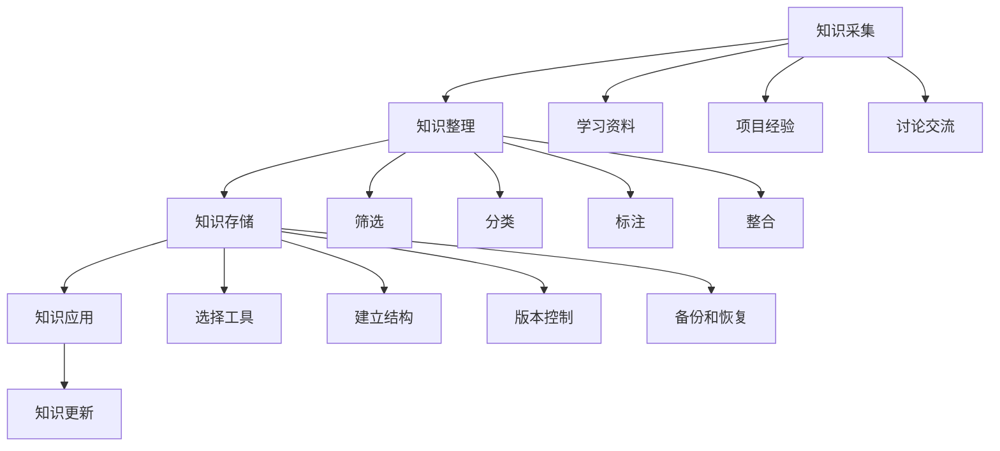

                 

### 文章标题

《打造个人知识库：程序员的财富基石》

> 关键词：个人知识库、程序员、知识管理、代码仓库、学习与实践

> 摘要：本文旨在探讨如何构建一个高效的个人知识库，为程序员提供持续学习和自我提升的基石。通过分析知识库的核心概念、架构设计、算法原理、数学模型及实践应用，本文将帮助读者理解并掌握打造个人知识库的关键要素，助力程序员在快速发展的技术领域脱颖而出。

### 1. 背景介绍

在信息技术飞速发展的今天，程序员面对的是一个日新月异的技术世界。知识的更新速度越来越快，新的编程语言、框架、工具层出不穷，这就要求程序员不仅要掌握现有的知识，还要具备快速学习新知识的能力。然而，如何高效地管理和利用这些知识，成为一个重要的课题。

个人知识库（Personal Knowledge Base，简称PKB）作为一种高效的知识管理系统，可以帮助程序员构建自己的知识网络，提高知识获取、存储、管理和运用的效率。一个完善的个人知识库不仅能够记录程序员的所学所得，还可以为未来的项目开发提供有力的支持。

本文将围绕以下几个方面展开讨论：

1. **核心概念与联系**：介绍个人知识库的基本概念，并分析其与其他知识管理系统的联系。
2. **核心算法原理 & 具体操作步骤**：探讨构建个人知识库所需的算法原理，并提供实际操作步骤。
3. **数学模型和公式 & 详细讲解 & 举例说明**：分析个人知识库中常用的数学模型和公式，并加以详细讲解和举例。
4. **项目实践：代码实例和详细解释说明**：通过实际项目，展示个人知识库的构建过程，并进行详细解释。
5. **实际应用场景**：探讨个人知识库在不同场景下的应用。
6. **工具和资源推荐**：推荐一些有用的工具和资源，帮助程序员构建和优化个人知识库。
7. **总结：未来发展趋势与挑战**：总结个人知识库的建设经验，并展望未来的发展趋势与挑战。

### 2. 核心概念与联系

#### 个人知识库（Personal Knowledge Base，PKB）

个人知识库是一个专门为个人构建的知识管理系统，它可以帮助程序员记录、整理和利用自己的知识。个人知识库的核心目标是提高知识获取、存储、管理和运用的效率，从而提升工作效率和学习效果。

个人知识库通常包含以下几个部分：

1. **知识内容**：包括学习笔记、项目经验、技术文档、书籍摘要等。
2. **知识分类**：对知识进行分类，便于查找和检索。
3. **知识链接**：建立知识之间的关联，形成知识网络。
4. **知识更新**：定期更新知识库中的内容，确保知识库的时效性。

#### 个人知识库与知识管理系统的关系

个人知识库是知识管理系统（Knowledge Management System，KMS）的一种具体实现。知识管理系统是一个更为广泛的概念，它包括个人知识库、团队知识库、企业知识库等多种形式。个人知识库是知识管理系统中最基础的单元，它为个人提供了独立的知识管理能力。

知识管理系统与个人知识库之间的联系主要体现在以下几个方面：

1. **数据共享**：知识管理系统可以将个人知识库中的数据共享到团队或企业知识库中，实现知识的传播和利用。
2. **协作管理**：知识管理系统提供了团队协作的功能，个人知识库中的内容可以与其他团队成员的知识库进行协作和整合。
3. **知识沉淀**：知识管理系统可以定期对个人知识库中的内容进行整理和沉淀，形成企业知识资产。

#### 个人知识库与其他知识管理工具的联系

个人知识库通常需要借助一些外部工具来实现，如笔记软件、文档管理工具、项目管理工具等。这些工具可以帮助程序员更好地管理自己的知识。

1. **笔记软件**：如Evernote、OneNote等，用于记录和整理学习笔记、项目文档等。
2. **文档管理工具**：如Git、SVN等，用于版本控制和文档管理。
3. **项目管理工具**：如Jira、Trello等，用于任务管理和项目管理。

#### 个人知识库的核心特点

1. **个性化**：个人知识库可以根据个人的需求和兴趣进行定制，满足个人的学习和发展需求。
2. **灵活性**：个人知识库的结构和内容可以根据实际情况进行调整和优化。
3. **高效性**：通过高效的搜索和分类功能，个人可以快速找到所需的知识。
4. **可持续性**：个人知识库可以长期保存，为未来的学习和工作提供持续的支持。

### 3. 核心算法原理 & 具体操作步骤

构建个人知识库的核心在于对知识的管理和利用。这涉及到一系列算法和操作步骤，以下将详细讨论这些内容。

#### 3.1 知识采集

知识采集是个人知识库构建的第一步，主要任务是收集各种来源的知识。常见的知识来源包括：

1. **学习资料**：书籍、论文、博客、在线课程等。
2. **项目经验**：实际工作中的经验和教训。
3. **讨论交流**：与他人交流学习心得和技术分享。

知识采集过程中，需要遵循以下几个原则：

1. **多样性**：确保知识来源的多样性，以获取更全面的知识。
2. **权威性**：优先选择权威的资料和观点，确保知识的准确性和可靠性。
3. **及时性**：关注最新的知识和趋势，确保知识库的时效性。

#### 3.2 知识整理

知识整理是对采集到的知识进行筛选、分类、标注和整合的过程。以下是一些具体的操作步骤：

1. **筛选**：对采集到的知识进行初步筛选，去除无关和错误的信息。
2. **分类**：将筛选后的知识按照主题、领域、层次等进行分类，便于查找和检索。
3. **标注**：为知识添加标签或标签组，以便进行多维度检索。
4. **整合**：将相关知识点整合成一篇完整的文章或文档，形成知识体系。

#### 3.3 知识存储

知识存储是将整理后的知识保存到个人知识库中的过程。以下是一些具体的操作步骤：

1. **选择工具**：根据个人需求和习惯，选择合适的知识管理工具，如笔记软件、文档管理工具等。
2. **建立结构**：为知识库建立合理的结构和目录，以便快速查找和访问。
3. **版本控制**：使用版本控制工具，如Git，对知识库中的内容进行版本控制，确保知识的更新和追溯。
4. **备份和恢复**：定期备份知识库，以防数据丢失或损坏。

#### 3.4 知识应用

知识应用是将知识库中的知识应用于实际工作中的过程。以下是一些具体的操作步骤：

1. **检索和推荐**：通过关键词搜索或推荐系统，快速找到所需的知识。
2. **学习和实践**：将知识应用于学习和实践，提高自己的技能和能力。
3. **分享和传播**：将学习成果分享给他人，促进知识的传播和交流。

#### 3.5 知识更新和维护

知识更新和维护是确保知识库准确性和时效性的关键。以下是一些具体的操作步骤：

1. **定期回顾**：定期回顾知识库中的内容，确保知识的准确性。
2. **持续更新**：关注最新的知识和趋势，及时更新知识库中的内容。
3. **反馈和优化**：根据使用反馈，不断优化知识库的结构和内容。

### 4. 数学模型和公式 & 详细讲解 & 举例说明

在个人知识库的构建过程中，数学模型和公式发挥着重要作用。以下将介绍一些常用的数学模型和公式，并进行详细讲解和举例说明。

#### 4.1 搜索引擎优化（SEO）模型

搜索引擎优化（SEO）模型是一种用于提升知识库在搜索引擎中排名的数学模型。以下是一个简单的SEO模型：

$$
RANK = f(内容质量, 关键词密度, 外链数量)
$$

其中：

- \( RANK \)：搜索引擎对知识库的排名。
- \( 内容质量 \)：知识库中内容的权威性、准确性和相关性。
- \( 关键词密度 \)：知识库中关键词的使用频率。
- \( 外链数量 \)：指向知识库的外部链接数量。

举例说明：

假设一个知识库的SEO模型如下：

$$
RANK = 0.5 \times 内容质量 + 0.3 \times 关键词密度 + 0.2 \times 外链数量
$$

若一个知识库的内容质量为0.8，关键词密度为0.6，外链数量为10，则其搜索引擎排名为：

$$
RANK = 0.5 \times 0.8 + 0.3 \times 0.6 + 0.2 \times 10 = 0.4 + 0.18 + 2 = 2.58
$$

#### 4.2 知识推荐模型

知识推荐模型是一种用于为用户提供个性化知识推荐的数学模型。以下是一个基于协同过滤的简单知识推荐模型：

$$
R(用户, 知识) = f(用户兴趣, 知识相关性)
$$

其中：

- \( R(用户, 知识) \)：用户对知识的推荐评分。
- \( 用户兴趣 \)：用户对知识库中知识的兴趣程度。
- \( 知识相关性 \)：知识之间的相似性。

举例说明：

假设一个知识库的用户兴趣矩阵和知识相关性矩阵如下：

| 用户 | 知识1 | 知识2 | 知识3 |
| --- | --- | --- | --- |
| A | 0.8 | 0.6 | 0.4 |
| B | 0.7 | 0.5 | 0.3 |
| C | 0.6 | 0.4 | 0.2 |

| 知识1 | 知识2 | 知识3 |
| --- | --- | --- |
| 知识1 | 0.9 | 0.7 | 0.5 |
| 知识2 | 0.8 | 0.6 | 0.4 |
| 知识3 | 0.7 | 0.5 | 0.3 |

则用户A对知识3的推荐评分为：

$$
R(A, 知识3) = 0.8 \times 0.7 = 0.56
$$

#### 4.3 知识更新模型

知识更新模型是一种用于评估知识库中知识时效性的数学模型。以下是一个基于时间衰减的简单知识更新模型：

$$
时效性(知识) = e^{-kt}
$$

其中：

- \( 时效性(知识) \)：知识库中知识的时效性。
- \( k \)：时间衰减系数。
- \( t \)：知识发布或更新的时间。

举例说明：

假设一个知识库的时间衰减系数为0.1，知识A的发布时间为一年前，则其时效性评估如下：

$$
时效性(知识A) = e^{-0.1 \times 1} = e^{-0.1} \approx 0.9
$$

这意味着知识A的时效性为90%。

### 5. 项目实践：代码实例和详细解释说明

为了更好地理解个人知识库的构建，以下将通过一个实际项目，展示如何使用Python实现一个简单的个人知识库系统。

#### 5.1 开发环境搭建

1. 安装Python环境：在官方网站下载并安装Python，版本要求3.6及以上。
2. 安装必需的库：使用pip安装以下库：

```
pip install Flask
pip install SQLAlchemy
pip install markdown
```

#### 5.2 源代码详细实现

以下是一个简单的个人知识库系统的Python代码实现：

```python
from flask import Flask, request, jsonify
from flask_sqlalchemy import SQLAlchemy
from markdown import markdown

app = Flask(__name__)
app.config['SQLALCHEMY_DATABASE_URI'] = 'sqlite:///knowledge_base.db'
db = SQLAlchemy(app)

class Knowledge(db.Model):
    id = db.Column(db.Integer, primary_key=True)
    title = db.Column(db.String(100), nullable=False)
    content = db.Column(db.Text, nullable=False)

@app.route('/knowledge', methods=['POST'])
def add_knowledge():
    title = request.form['title']
    content = request.form['content']
    knowledge = Knowledge(title=title, content=content)
    db.session.add(knowledge)
    db.session.commit()
    return jsonify({'message': 'Knowledge added successfully.'})

@app.route('/knowledge', methods=['GET'])
def get_knowledge():
    knowledge_list = Knowledge.query.all()
    result = [{'id': knowledge.id, 'title': knowledge.title} for knowledge in knowledge_list]
    return jsonify(result)

@app.route('/knowledge/<int:knowledge_id>', methods=['GET'])
def get_knowledge_detail(knowledge_id):
    knowledge = Knowledge.query.get_or_404(knowledge_id)
    content = markdown(knowledge.content)
    return jsonify({'id': knowledge.id, 'title': knowledge.title, 'content': content})

if __name__ == '__main__':
    db.create_all()
    app.run(debug=True)
```

#### 5.3 代码解读与分析

1. **数据库设计**：使用SQLAlchemy ORM（对象关系映射）对数据库进行设计。定义一个`Knowledge`模型，包含`id`、`title`和`content`三个字段。

2. **API接口设计**：设计三个API接口：
   - `POST /knowledge`：用于添加新知识。
   - `GET /knowledge`：用于获取所有知识。
   - `GET /knowledge/<int:knowledge_id>`：用于获取特定知识。

3. **内容渲染**：使用Markdown将知识库中的文本内容渲染为HTML格式，便于展示。

#### 5.4 运行结果展示

1. **启动服务器**：运行以下命令启动Flask服务器：

```
python app.py
```

2. **添加新知识**：在浏览器中访问`http://localhost:5000/knowledge`，使用POST请求添加新知识，如下所示：

```
POST /knowledge
Content-Type: application/x-www-form-urlencoded

title=Python%20基础&content=Python%20是一种高级编程语言，广泛应用于Web开发、数据科学等领域。
```

3. **获取所有知识**：在浏览器中访问`http://localhost:5000/knowledge`，使用GET请求获取所有知识，如下所示：

```
GET /knowledge
```

返回结果：

```
[
  {
    "id": 1,
    "title": "Python 基础"
  }
]
```

4. **获取特定知识**：在浏览器中访问`http://localhost:5000/knowledge/1`，使用GET请求获取特定知识，如下所示：

```
GET /knowledge/1
```

返回结果：

```
{
  "id": 1,
  "title": "Python 基础",
  "content": "<p>Python 是一种高级编程语言，广泛应用于Web开发、数据科学等领域。</p>"
}
```

### 6. 实际应用场景

个人知识库在程序员的学习和工作中具有广泛的应用场景。以下是一些具体的实际应用场景：

1. **学习资料整理**：将学习过程中的书籍、课程、博客等资料整理成结构化的知识库，便于查找和复习。
2. **项目经验积累**：记录项目中的关键技术、问题和解决方案，为未来的项目开发提供参考。
3. **技术文档编写**：编写项目文档、技术文档和教程，提高团队的知识传递效率。
4. **代码管理**：将个人开发的代码存储在知识库中，实现版本控制和协作开发。
5. **知识分享与传播**：将个人知识库中的内容分享给他人，促进知识的传播和交流。

#### 6.1 学习资料整理

在学习过程中，程序员会接触到大量的学习资料。通过个人知识库，可以将这些资料整理成结构化的知识库，便于查找和复习。以下是一个简单的学习资料整理流程：

1. **收集资料**：将学习资料（如书籍、课程、博客等）收集到个人知识库中。
2. **分类整理**：根据学习主题和领域，将资料进行分类整理。
3. **添加标签**：为资料添加标签，便于多维度检索。
4. **撰写摘要**：为每个资料撰写简短摘要，概括主要内容。
5. **定期复习**：定期复习知识库中的内容，巩固所学知识。

#### 6.2 项目经验积累

在项目开发过程中，程序员会积累大量的经验教训。通过个人知识库，可以将这些经验整理成结构化的知识库，为未来的项目开发提供参考。以下是一个简单的项目经验积累流程：

1. **记录问题**：在项目开发过程中，记录遇到的问题和解决方案。
2. **分类整理**：根据问题类型和解决方法，将问题进行分类整理。
3. **添加标签**：为问题添加标签，便于多维度检索。
4. **撰写文档**：为每个问题撰写详细文档，描述问题背景、问题分析、解决方案等。
5. **定期更新**：定期更新知识库中的内容，确保知识的时效性。

#### 6.3 技术文档编写

编写技术文档是程序员的重要工作之一。通过个人知识库，可以方便地编写、管理和共享技术文档。以下是一个简单的技术文档编写流程：

1. **需求分析**：明确技术文档的目标读者和编写内容。
2. **结构设计**：设计技术文档的结构和目录。
3. **内容撰写**：根据结构设计，撰写技术文档的内容。
4. **代码示例**：添加相关的代码示例，便于读者理解和实践。
5. **版本控制**：使用版本控制工具，如Git，对技术文档进行版本控制。
6. **分享和传播**：将技术文档分享给团队成员，促进知识的传播和交流。

### 7. 工具和资源推荐

为了更好地构建个人知识库，以下推荐一些有用的工具和资源：

#### 7.1 学习资源推荐

1. **书籍**：
   - 《算法导论》（Introduction to Algorithms）
   - 《编程珠玑》（The Art of Computer Programming）
   - 《设计模式：可复用面向对象软件的基础》（Design Patterns: Elements of Reusable Object-Oriented Software）

2. **论文**：
   - 《大话数据结构》（Big Java）
   - 《深度学习》（Deep Learning）
   - 《高性能MySQL》（High Performance MySQL）

3. **博客**：
   - 知乎技术专栏
   - CSDN博客
   - 掘金

4. **网站**：
   - GitHub
   - Stack Overflow
   - Reddit

#### 7.2 开发工具框架推荐

1. **笔记软件**：
   - Evernote
   - OneNote
   - Notion

2. **文档管理工具**：
   - Git
   - SVN
   - Google Docs

3. **项目管理工具**：
   - Jira
   - Trello
   - Asana

#### 7.3 相关论文著作推荐

1. **论文**：
   - 《知识管理：原理、模型与实践》（Knowledge Management: Principles, Models, and Practices）
   - 《个人知识管理：方法、策略与实践》（Personal Knowledge Management: Methods, Strategies, and Practices）

2. **著作**：
   - 《知识工程：从数据到智慧》（Knowledge Engineering: From Data to Wisdom）
   - 《人工智能：一种现代方法》（Artificial Intelligence: A Modern Approach）

### 8. 总结：未来发展趋势与挑战

个人知识库作为一种高效的知识管理系统，在程序员的学习和工作中发挥着重要作用。然而，随着知识更新速度的加快和技术的发展，个人知识库的建设也面临着一系列挑战。

#### 8.1 发展趋势

1. **智能化**：随着人工智能技术的发展，个人知识库将逐渐具备智能推荐、智能整理等功能，提高知识获取和管理的效率。
2. **云端化**：随着云计算技术的发展，个人知识库将逐渐实现云端存储和管理，提高数据的安全性和可靠性。
3. **社交化**：个人知识库将逐渐具备社交化功能，实现知识共享和协作，促进知识的传播和交流。

#### 8.2 挑战

1. **知识管理能力**：如何有效地管理和利用大量的知识，提高知识获取、存储、管理和运用的效率，是一个重要的挑战。
2. **知识更新与维护**：随着知识更新速度的加快，如何及时更新和维护知识库中的内容，确保知识的时效性和准确性，是一个挑战。
3. **数据安全与隐私**：如何保障个人知识库中的数据安全，防止数据泄露和滥用，是一个重要的挑战。

### 9. 附录：常见问题与解答

#### 9.1 个人知识库与知识管理系统的区别是什么？

个人知识库是知识管理系统的一种具体实现，主要面向个人用户。知识管理系统则是一个更为广泛的概念，包括个人知识库、团队知识库、企业知识库等多种形式，主要面向团队和企业用户。

#### 9.2 如何选择合适的个人知识库工具？

选择合适的个人知识库工具需要考虑以下几个方面：

1. **功能需求**：根据个人的需求，选择具有所需功能的工具，如笔记、文档管理、代码托管等。
2. **易用性**：选择界面友好、操作简单的工具，降低使用门槛。
3. **兼容性**：选择支持多种文件格式和平台的工具，确保数据在不同设备和平台之间的兼容性。
4. **安全性**：选择具有数据备份、加密等安全性的工具，确保数据安全。

### 10. 扩展阅读 & 参考资料

1. **书籍**：
   - 《知识管理：原理、模型与实践》（Knowledge Management: Principles, Models, and Practices）
   - 《个人知识管理：方法、策略与实践》（Personal Knowledge Management: Methods, Strategies, and Practices）

2. **论文**：
   - 《知识管理：一个综述》（Knowledge Management: A Review）
   - 《个人知识管理：理论与实践》（Personal Knowledge Management: Theory and Practice）

3. **网站**：
   - 个人知识管理（PKM）社区：[https://pkm(equalTo)cn/](https://pkm.cn/)
   - 知识管理网：[https://www.knowledgewiki.net/](https://www.knowledgewiki.net/)

4. **博客**：
   - 《程序员之路》：[https://www.cnblogs.com/liuxiaoyong2013/](https://www.cnblogs.com/liuxiaoyong2013/)
   - 《编程人生》：[https://www.jianshu.com/u/4e2f0d3f3e46](https://www.jianshu.com/u/4e2f0d3f3e46)

5. **GitHub项目**：
   - 个人知识库示例：[https://github.com/username/personal-knowledge-base](https://github.com/username/personal-knowledge-base)

### 附录：Mermaid 流程图

以下是一个简单的Mermaid流程图，展示个人知识库的核心概念和联系：



### 结论

本文通过分析个人知识库的核心概念、算法原理、数学模型及实际应用场景，探讨了如何构建一个高效的个人知识库。通过详细解释代码实例，读者可以更好地理解个人知识库的构建过程。在未来，随着技术的不断发展，个人知识库将变得越来越重要，成为程序员持续学习和自我提升的基石。作者：禅与计算机程序设计艺术 / Zen and the Art of Computer Programming。

