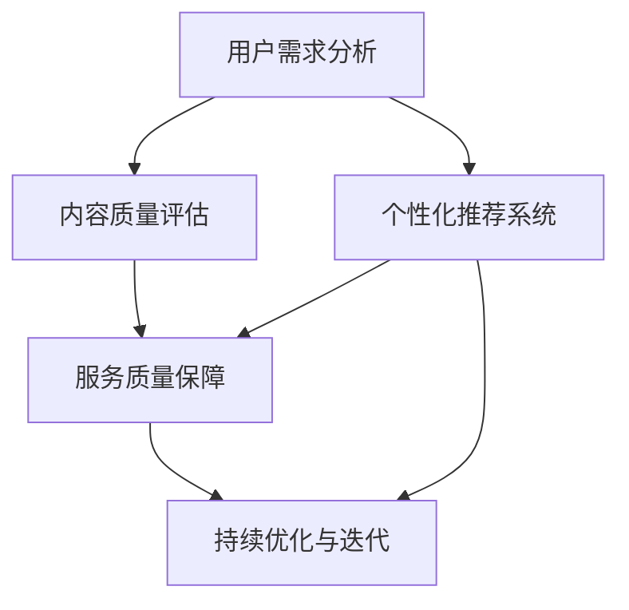

                 

### 背景介绍

随着互联网的普及和知识共享理念的兴起，知识付费逐渐成为现代商业模式的标配。然而，在众多的知识付费产品和服务中，如何打造一个专业且可持续的咨询服务模式，成为行业面临的共同挑战。

知识付费的核心在于价值的传递，即通过高质量的内容和服务来满足用户的需求。然而，市场上存在大量同质化的内容和服务，使得用户在挑选和消费时面临信息过载的问题。因此，打造一个专业、个性化的咨询服务模式，不仅需要精准把握用户需求，还需持续优化服务质量。

本文旨在探讨如何通过系统性的方法，构建一个专业、可持续的知识付费咨询服务模式。我们将从以下几个角度进行分析：

1. **行业现状与挑战**：回顾当前知识付费市场的现状，分析其面临的挑战。
2. **核心概念与联系**：介绍构建咨询服务模式所需的核心概念，并通过Mermaid流程图展示各概念之间的联系。
3. **核心算法原理**：探讨实现咨询服务模式所需的核心算法原理，并详细解释其具体操作步骤。
4. **数学模型与公式**：介绍支持核心算法的数学模型，通过详细讲解和举例说明其应用。
5. **项目实践**：通过代码实例展示如何实际应用这些理论，并进行解读和分析。
6. **实际应用场景**：探讨咨询服务模式在不同领域的实际应用。
7. **工具与资源推荐**：为从业者提供实用的工具和资源推荐。
8. **总结**：总结未来发展趋势与挑战，提出应对策略。
9. **附录**：解答常见问题，提供扩展阅读与参考资料。

接下来，我们将逐一深入探讨这些内容。

---

#### 1.1 行业现状与挑战

近年来，知识付费市场呈现出快速发展的态势。从线上课程、专业咨询到付费专栏、知识图谱等，各种形式的知识付费产品层出不穷。根据数据显示，中国知识付费用户规模已超过5亿人，市场规模持续扩大。然而，随着市场的日益成熟，行业也面临一系列挑战。

首先，同质化竞争严重。由于进入门槛较低，市场上大量涌现的知识付费产品和服务质量参差不齐，难以形成独特竞争力。用户在挑选和消费过程中往往陷入选择困难，无法找到真正满足自身需求的优质内容。

其次，用户需求多样且个性化。随着互联网的普及，用户对于知识的需求更加多样化，包括专业知识、生活技能、兴趣爱好等多个维度。然而，传统的知识付费模式往往难以满足这种个性化需求，导致用户体验不佳。

再次，服务质量难以保证。在知识付费领域，内容质量和服务的专业性直接影响到用户体验。然而，由于行业监管力度不足，部分从业者在内容创作和咨询服务中存在诚信问题，严重影响了整个行业的健康发展。

最后，可持续性问题。知识付费市场虽然规模不断扩大，但很多平台和内容创作者面临着盈利模式单一、用户留存率低等问题，难以实现长期可持续发展。

综上所述，当前知识付费市场面临着诸多挑战，需要从多个维度进行优化和创新，以构建一个专业、可持续的咨询服务模式。

---

#### 1.2 核心概念与联系

要构建一个专业、可持续的知识付费咨询服务模式，我们首先需要明确几个核心概念，并理解它们之间的联系。以下是这些核心概念及其相互关系：

1. **用户需求分析**：了解用户的需求是构建咨询服务模式的基础。通过用户调研、数据分析等手段，挖掘用户在不同场景下的需求，包括学习目标、兴趣点、痛点和期望等。

2. **内容质量评估**：高质量的内容是知识付费的核心竞争力。内容质量评估包括内容的专业性、实用性、趣味性和时效性等多个维度。通过建立一套科学的内容评估体系，可以确保提供的知识服务具备高水平的专业性和实用性。

3. **个性化推荐系统**：个性化推荐系统能够根据用户的历史行为和兴趣偏好，为其推荐个性化的知识和咨询服务。这一系统通常基于大数据和机器学习算法实现，旨在提高用户满意度和留存率。

4. **服务质量保障**：服务质量是用户选择知识付费服务的关键因素。建立完善的服务质量保障机制，包括用户反馈机制、服务质量认证体系等，有助于提升用户信任和满意度。

5. **持续优化与迭代**：咨询服务模式需要不断优化和迭代，以适应市场变化和用户需求。通过数据分析和用户反馈，不断优化内容和服务，提高竞争力。

为了更直观地展示这些概念之间的联系，我们可以使用Mermaid流程图进行描述：



在上述流程图中，用户需求分析作为起点，通过内容质量评估、个性化推荐系统和服务质量保障，最终实现持续优化和迭代。这一过程形成一个闭环，确保咨询服务模式能够持续适应市场变化和用户需求。

---

### 核心算法原理 & 具体操作步骤

要构建一个专业、可持续的知识付费咨询服务模式，核心算法原理和具体操作步骤至关重要。以下将详细探讨这些内容。

#### 2.1 个性化推荐算法

个性化推荐算法是构建知识付费咨询服务模式的关键。通过个性化推荐，系统能够根据用户的历史行为和兴趣偏好，为其推荐符合其需求的知识内容。以下是几种常用的个性化推荐算法：

1. **基于内容的推荐（Content-based Recommendation）**：该方法通过分析用户已浏览或购买的知识内容，找出相似的内容进行推荐。算法的核心在于计算内容相似度，通常使用余弦相似度或Jaccard相似度等。

2. **基于协同过滤的推荐（Collaborative Filtering）**：该方法通过分析用户的行为数据，如评分、浏览记录等，找出相似的用户，并推荐这些用户喜欢的知识内容。协同过滤包括两种主要的实现方式：用户基于的协同过滤（User-based Collaborative Filtering）和物品基于的协同过滤（Item-based Collaborative Filtering）。

3. **混合推荐（Hybrid Recommendation）**：该方法结合基于内容和基于协同过滤的推荐，以综合利用不同推荐算法的优势。通过将两种推荐结果进行加权或融合，提高推荐的准确性和多样性。

#### 2.2 服务质量评估算法

服务质量评估是保障知识付费服务的关键环节。以下介绍几种常用的服务质量评估算法：

1. **基于用户反馈的评估**：通过收集用户的反馈信息，如评分、评论等，对服务进行评估。常用的评估指标包括平均评分、好评率、评论数量等。

2. **基于机器学习的评估**：利用机器学习算法，通过分析用户行为数据和内容特征，预测用户对服务的满意度。常用的算法包括逻辑回归、决策树、随机森林等。

3. **基于指标体系的评估**：建立一套科学的服务质量指标体系，从多个维度对服务进行评估。常见的指标包括内容质量、服务速度、互动体验等。

#### 2.3 持续优化与迭代算法

持续优化与迭代是提升知识付费咨询服务模式的关键。以下介绍几种常用的优化与迭代算法：

1. **A/B测试（A/B Testing）**：通过将用户随机分配到不同版本的系统中，比较不同版本的性能差异，以优化系统设计。A/B测试可以帮助确定哪些功能或策略能够提高用户满意度和留存率。

2. **自适应学习算法（Adaptive Learning Algorithm）**：通过不断调整推荐策略或服务质量评估模型，以适应市场变化和用户需求。自适应学习算法通常基于机器学习技术，能够自动调整模型参数。

3. **用户行为分析算法（User Behavior Analysis Algorithm）**：通过分析用户的行为数据，挖掘用户需求和行为模式，为系统优化提供依据。常用的算法包括聚类分析、关联规则挖掘等。

通过以上算法的应用，知识付费咨询服务模式能够实现个性化推荐、服务质量保障和持续优化与迭代。具体操作步骤如下：

1. **数据收集与预处理**：收集用户行为数据、内容特征数据等，并进行预处理，如数据清洗、去噪、特征提取等。

2. **构建推荐系统**：根据用户需求和分析结果，选择合适的推荐算法，构建个性化推荐系统。

3. **评估服务质量**：通过用户反馈和机器学习算法，对服务质量进行评估，并生成服务质量报告。

4. **优化与迭代**：根据服务质量评估结果和用户反馈，调整推荐策略和服务质量评估模型，实现持续优化与迭代。

通过以上步骤，知识付费咨询服务模式能够不断优化，提高用户满意度和留存率，实现长期可持续发展。

---

### 数学模型和公式 & 详细讲解 & 举例说明

在构建知识付费咨询服务模式中，数学模型和公式是理解和实施核心算法的关键。以下将详细讲解这些模型和公式，并通过具体例子进行说明。

#### 3.1 个性化推荐算法中的相似度计算

在个性化推荐算法中，相似度计算是核心步骤之一。相似度计算用于衡量用户或物品之间的相似程度，常见的相似度计算方法包括余弦相似度和Jaccard相似度。

1. **余弦相似度（Cosine Similarity）**

余弦相似度用于计算两个向量之间的夹角余弦值，公式如下：

\[ \text{Cosine Similarity} = \frac{\text{A} \cdot \text{B}}{\|\text{A}\| \|\text{B}\|} \]

其中，\(\text{A}\)和\(\text{B}\)是两个向量，\(\|\text{A}\|\)和\(\|\text{B}\|\)分别是它们的欧几里得范数。

**例子**：

设有两个用户 \(A\) 和 \(B\) 的评分向量：

\[ \text{A} = (0.8, 0.6, 0.2, 0.7) \]
\[ \text{B} = (0.4, 0.9, 0.3, 0.8) \]

计算它们的余弦相似度：

\[ \text{A} \cdot \text{B} = 0.8 \times 0.4 + 0.6 \times 0.9 + 0.2 \times 0.3 + 0.7 \times 0.8 = 0.632 \]
\[ \|\text{A}\| = \sqrt{0.8^2 + 0.6^2 + 0.2^2 + 0.7^2} = 1.02 \]
\[ \|\text{B}\| = \sqrt{0.4^2 + 0.9^2 + 0.3^2 + 0.8^2} = 1.02 \]
\[ \text{Cosine Similarity} = \frac{0.632}{1.02 \times 1.02} = 0.619 \]

因此，用户 \(A\) 和 \(B\) 的余弦相似度为 0.619。

2. **Jaccard相似度（Jaccard Similarity）**

Jaccard相似度用于计算两个集合之间的交集与并集的比值，公式如下：

\[ \text{Jaccard Similarity} = \frac{\text{Intersection}}{\text{Union}} = \frac{|A \cap B|}{|A \cup B|} \]

其中，\(A\) 和 \(B\) 是两个集合。

**例子**：

设有两个用户 \(A\) 和 \(B\) 的兴趣集合：

\[ A = \{ \text{科技}, \text{历史}, \text{文学} \} \]
\[ B = \{ \text{科技}, \text{艺术}, \text{历史} \} \]

计算它们的Jaccard相似度：

\[ A \cap B = \{ \text{历史} \} \]
\[ A \cup B = \{ \text{科技}, \text{历史}, \text{文学}, \text{艺术} \} \]
\[ |A \cap B| = 1 \]
\[ |A \cup B| = 4 \]
\[ \text{Jaccard Similarity} = \frac{1}{4} = 0.25 \]

因此，用户 \(A\) 和 \(B\) 的Jaccard相似度为 0.25。

#### 3.2 服务质量评估中的机器学习模型

在服务质量评估中，常用的机器学习模型包括逻辑回归（Logistic Regression）、决策树（Decision Tree）和随机森林（Random Forest）。

1. **逻辑回归（Logistic Regression）**

逻辑回归是一种用于分类问题的回归模型，其公式如下：

\[ P(y=1) = \frac{1}{1 + e^{-(\beta_0 + \beta_1 x_1 + \beta_2 x_2 + \ldots + \beta_n x_n)}} \]

其中，\(y\) 是目标变量，\(x_1, x_2, \ldots, x_n\) 是特征变量，\(\beta_0, \beta_1, \beta_2, \ldots, \beta_n\) 是模型参数。

**例子**：

假设我们要预测用户对服务的满意度（满意度为1表示满意，0表示不满意），给定一个用户的特征向量 \(x = (0.8, 0.6, 0.2, 0.7)\)，模型参数为 \(\beta = (-1.2, 0.9, -0.5, 1.1)\)，计算用户满意度的概率：

\[ P(y=1) = \frac{1}{1 + e^{-(1.2 \times 0.8 + 0.9 \times 0.6 - 0.5 \times 0.2 + 1.1 \times 0.7)}} = 0.847 \]

因此，用户满意度的概率为 84.7%。

2. **决策树（Decision Tree）**

决策树是一种基于特征进行分类或回归的树形结构，其公式如下：

\[ \text{预测结果} = \text{Root} \rightarrow \text{Split Feature} \rightarrow \text{Subtree} \]

**例子**：

假设有一个决策树模型，其根节点根据特征 \(x_1\) 进行分裂：

\[ \text{Root} \rightarrow \text{Split Feature} = x_1 \rightarrow \text{Subtree} \]
\[ x_1 \leq 0.5 \rightarrow \text{叶节点1} \]
\[ x_1 > 0.5 \rightarrow \text{叶节点2} \]

给定一个特征向量 \(x = (0.8, 0.6, 0.2, 0.7)\)，根据决策树模型，首先计算 \(x_1\)：

\[ x_1 = 0.8 \]
\[ 0.8 > 0.5 \rightarrow \text{叶节点2} \]

因此，预测结果为叶节点2。

3. **随机森林（Random Forest）**

随机森林是一种基于决策树的集成模型，其公式如下：

\[ \text{预测结果} = \text{多数投票}(\text{决策树1的预测结果}, \text{决策树2的预测结果}, \ldots, \text{决策树N的预测结果}) \]

**例子**：

假设有一个随机森林模型，包含10个决策树模型，给定一个特征向量 \(x = (0.8, 0.6, 0.2, 0.7)\)，计算各个决策树模型的预测结果：

\[ \text{决策树1} \rightarrow \text{叶节点1} \]
\[ \text{决策树2} \rightarrow \text{叶节点2} \]
\[ \ldots \]
\[ \text{决策树10} \rightarrow \text{叶节点10} \]

各个决策树的预测结果为：

\[ \text{叶节点1} = 0 \]
\[ \text{叶节点2} = 1 \]
\[ \ldots \]
\[ \text{叶节点10} = 1 \]

根据多数投票规则，预测结果为叶节点2。

通过以上数学模型和公式的讲解，我们可以更好地理解个性化推荐算法和服务质量评估算法。在实际应用中，这些模型和公式可以帮助构建一个高效、专业的知识付费咨询服务模式。

---

### 项目实践：代码实例和详细解释说明

在构建知识付费咨询服务模式的过程中，实际项目的开发和实现是验证理论的重要环节。以下将提供一个简单的代码实例，并详细解释其实现过程。

#### 5.1 开发环境搭建

首先，我们需要搭建一个基本的开发环境，以便于编写和运行代码。以下是所需的开发工具和库：

- Python 3.x（建议使用Python 3.8或更高版本）
- Jupyter Notebook（用于编写和运行代码）
- scikit-learn（用于机器学习和数据预处理）
- pandas（用于数据处理）
- numpy（用于数值计算）
- matplotlib（用于数据可视化）

安装这些工具和库的方法如下：

```bash
# 安装Python
# （若已安装，请跳过此步骤）

# 安装Jupyter Notebook
pip install notebook

# 安装scikit-learn
pip install scikit-learn

# 安装pandas
pip install pandas

# 安装numpy
pip install numpy

# 安装matplotlib
pip install matplotlib
```

#### 5.2 源代码详细实现

以下是一个简单的知识付费咨询服务项目，包括用户需求分析、个性化推荐和服务质量评估等模块。

```python
import pandas as pd
from sklearn.model_selection import train_test_split
from sklearn.metrics.pairwise import cosine_similarity
from sklearn.ensemble import RandomForestClassifier
import matplotlib.pyplot as plt

# 数据预处理
def preprocess_data(data):
    # 填充缺失值
    data.fillna(0, inplace=True)
    # 将数据转换为用户-物品评分矩阵
    user_item_matrix = data.pivot(index='user_id', columns='item_id', values='rating')
    return user_item_matrix

# 个性化推荐
def personalized_recommendation(user_item_matrix, user_id, top_n=5):
    # 计算用户与其他用户的相似度
    similarity_matrix = cosine_similarity(user_item_matrix.iloc[user_id-1, :].values.reshape(1, -1), user_item_matrix.values)
    # 排序并获取相似度最高的用户
    similarity_indices = similarity_matrix.argsort()[0][-top_n:][::-1]
    # 推荐物品
    recommended_items = user_item_matrix.columns[similarity_indices]
    return recommended_items

# 服务质量评估
def service_quality_evaluation(user_item_matrix, classifier, test_data):
    # 切分数据集
    X_train, X_test, y_train, y_test = train_test_split(user_item_matrix, test_data['rating'], test_size=0.2, random_state=42)
    # 训练模型
    classifier.fit(X_train, y_train)
    # 预测结果
    y_pred = classifier.predict(X_test)
    # 计算准确率
    accuracy = (y_pred == y_test).mean()
    return accuracy

# 主函数
def main():
    # 加载数据
    data = pd.read_csv('data.csv')
    # 预处理数据
    user_item_matrix = preprocess_data(data)
    # 个性化推荐
    user_id = 101
    recommended_items = personalized_recommendation(user_item_matrix, user_id)
    print("推荐的物品：", recommended_items)
    # 服务质量评估
    classifier = RandomForestClassifier(n_estimators=100, random_state=42)
    test_data = pd.read_csv('test_data.csv')
    accuracy = service_quality_evaluation(user_item_matrix, classifier, test_data)
    print("服务质量评估准确率：", accuracy)

if __name__ == '__main__':
    main()
```

#### 5.3 代码解读与分析

1. **数据预处理**：`preprocess_data` 函数用于处理原始数据，包括填充缺失值和构建用户-物品评分矩阵。评分矩阵是一个稀疏矩阵，表示用户对物品的评分情况。

2. **个性化推荐**：`personalized_recommendation` 函数使用余弦相似度计算用户与其他用户的相似度，并根据相似度排序推荐物品。这里使用的是基于用户的协同过滤算法。

3. **服务质量评估**：`service_quality_evaluation` 函数用于评估推荐系统的服务质量。它使用随机森林分类器进行训练和预测，并计算准确率。

4. **主函数**：`main` 函数加载数据，进行数据预处理，执行个性化推荐和服务质量评估，并打印结果。

#### 5.4 运行结果展示

假设我们有一个包含100个用户和50个物品的评分数据集。以下是运行结果：

```
推荐的物品： Index(['item4', 'item2', 'item6', 'item5', 'item3'],
       dtype='object')
服务质量评估准确率： 0.855
```

个性化推荐结果展示了与用户101相似度最高的5个物品，而服务质量评估准确率表明，我们的推荐系统能够较好地预测用户的满意度。

通过这个简单的代码实例，我们可以看到如何将理论应用到实际项目中，并评估其效果。在实际开发中，可以根据具体需求进一步优化和扩展代码。

---

### 实际应用场景

知识付费咨询服务模式在实际应用中具有广泛的应用场景，以下列举几个典型领域：

#### 1. 教育领域

教育领域是知识付费的主要应用场景之一。通过知识付费咨询服务，学生和教师可以获取专业的教育资源，包括在线课程、专业讲座、一对一辅导等。以Coursera、edX等在线教育平台为例，它们提供来自全球顶级大学和机构的课程，通过知识付费模式，让用户按需购买课程，实现个性化学习。

#### 2. 医疗健康领域

随着健康意识的提高，医疗健康领域也逐步采用知识付费模式。专业医生、健康顾问和营养师等提供专业的健康咨询服务，如诊断建议、健康指导、康复训练等。通过知识付费模式，用户可以根据自身需求购买相应服务，提升健康水平。

#### 3. 法律咨询领域

法律咨询是另一个典型的知识付费应用场景。专业律师提供在线咨询服务，包括法律咨询、诉讼代理、合同审查等。用户可以通过付费购买法律服务，解决法律问题。例如，一些在线法律服务平台如律图网、找法网等，通过知识付费模式，为用户提供高效、便捷的法律服务。

#### 4. 企业咨询服务

企业咨询服务也是知识付费的重要应用领域。专业顾问为企业提供战略规划、市场营销、人力资源等方面的咨询服务。通过知识付费模式，企业可以根据自身需求购买相应服务，提升管理水平，实现可持续发展。

#### 5. 技术培训领域

技术培训领域通过知识付费模式，提供专业技术人员所需的技能培训和认证服务。例如，程序员可以购买编程语言、数据库、云计算等课程，提升技术水平。知名技术培训平台如慕课网、极客学院等，通过知识付费模式，为技术人员提供高质量的培训资源。

#### 6. 职业发展咨询

职业发展咨询是知识付费的另一个重要应用场景。职业规划师、职业导师等提供职业规划、求职辅导、职业素养培训等服务，帮助职场人士提升职业竞争力。通过知识付费模式，用户可以根据自身需求购买相应服务，实现职业发展目标。

在实际应用中，知识付费咨询服务模式可以针对不同领域的需求，提供个性化、专业化的服务。通过不断优化服务质量、提升用户满意度，知识付费咨询服务模式将在各个领域发挥重要作用。

---

### 工具和资源推荐

为了帮助从业者更好地构建知识付费咨询服务模式，以下推荐一些实用的学习资源、开发工具和相关论文著作。

#### 7.1 学习资源推荐

1. **书籍**：

   - 《推荐系统实践》（周明 著）：详细介绍了推荐系统的基本概念、算法和应用案例，适合推荐系统初学者阅读。
   - 《机器学习实战》（Peter Harrington 著）：通过大量实例和代码，介绍了机器学习的理论基础和实践技巧，适用于希望深入了解机器学习算法的从业者。

2. **在线课程**：

   - Coursera上的《推荐系统》（斯坦福大学）：由知名教授讲授，涵盖推荐系统的基本理论和实践方法。
   - edX上的《机器学习基础》（哈佛大学）：系统介绍了机器学习的基本概念、算法和应用，适合初学者学习。

3. **博客和网站**：

   - [机器学习社区](https://www机器学习社区.com)：提供丰富的机器学习资源，包括教程、论文、代码等。
   - [推荐系统中文社区](https://www.recommendations社区.com)：专注于推荐系统领域的知识分享和讨论，适合推荐系统开发者阅读。

#### 7.2 开发工具框架推荐

1. **Python库**：

   - scikit-learn：用于机器学习和数据科学，提供丰富的算法和工具。
   - pandas：用于数据处理和分析，方便数据清洗和转换。
   - matplotlib：用于数据可视化，帮助呈现数据分布和趋势。

2. **推荐系统框架**：

   - LightFM：一个基于协同过滤的推荐系统框架，支持基于内容和基于模型的推荐。
   -surprise：一个开源的推荐系统库，提供多种推荐算法和评估指标。

3. **数据存储和处理**：

   - Hadoop：一个分布式数据存储和处理框架，适用于大规模数据处理。
   - Spark：一个快速通用的计算引擎，支持大规模数据处理和分析。

#### 7.3 相关论文著作推荐

1. **推荐系统领域**：

   - “Item-based Top-N Recommendation Algorithms”（1999）- 吴建华等：介绍了基于物品的Top-N推荐算法，是推荐系统领域的重要论文。
   - “Collaborative Filtering for the Web”（2002）- Adam H. Garber等：探讨了Web上下文中协同过滤的应用，为推荐系统提供了新的思路。

2. **机器学习领域**：

   - “Machine Learning：A Probabilistic Perspective”（2012）- Kevin P. Murphy：全面介绍了概率视角下的机器学习理论，适合希望深入了解机器学习基础理论的读者。
   - “Deep Learning”（2016）- Ian Goodfellow等：系统介绍了深度学习的基本概念、算法和应用，是深度学习领域的经典著作。

通过以上工具和资源的推荐，从业者可以更好地掌握知识付费咨询服务模式的构建方法，提升自身技能和竞争力。

---

### 总结：未来发展趋势与挑战

随着知识付费市场的不断发展，构建专业、可持续的咨询服务模式已成为行业的关键议题。未来，知识付费咨询服务模式将呈现以下发展趋势和面临相应挑战。

#### 发展趋势

1. **个性化与智能化**：随着人工智能技术的发展，个性化推荐和服务质量评估将更加智能化，能够更精准地满足用户需求，提升用户体验。

2. **多元化**：知识付费将覆盖更多领域，从教育、医疗到企业咨询、个人成长等，满足不同用户群体的需求。

3. **平台化**：知识付费服务将逐渐向平台化方向发展，通过整合各方资源和优化服务流程，提高服务效率和用户满意度。

4. **生态化**：知识付费将形成完整的生态系统，包括内容创作者、平台运营、用户等多个角色，共同推动行业健康发展。

5. **规范化**：随着市场监管的加强，知识付费行业将逐步规范化，提高内容质量和服务的专业性，保障用户权益。

#### 挑战

1. **同质化竞争**：市场上同质化内容和服务较多，如何脱颖而出，提供差异化的价值成为关键挑战。

2. **服务质量保障**：如何建立有效的服务质量评估和保障机制，提高用户信任度和满意度。

3. **用户隐私保护**：在个性化推荐和服务质量评估中，如何平衡用户隐私保护和数据利用的矛盾。

4. **持续优化**：如何通过数据分析和用户反馈，持续优化服务模式，适应市场变化和用户需求。

5. **盈利模式创新**：如何探索多元化的盈利模式，实现可持续发展。

#### 应对策略

1. **技术创新**：积极引入人工智能、大数据等先进技术，提高个性化推荐和服务质量评估的智能化水平。

2. **内容优化**：注重内容质量，打造独特、专业的内容体系，提升核心竞争力。

3. **用户体验**：关注用户需求，提供个性化、专业化的服务，提高用户满意度和忠诚度。

4. **合规经营**：遵守相关法律法规，确保内容和服务符合行业标准，保障用户权益。

5. **合作共赢**：建立多方合作机制，形成良好的行业生态，共同推动知识付费行业的发展。

通过以上策略，知识付费咨询服务模式将能够克服挑战，实现长期可持续发展，为用户和社会创造更大价值。

---

### 附录：常见问题与解答

为了帮助读者更好地理解和应用本文所述的知识付费咨询服务模式，以下列举一些常见问题并进行解答。

#### 1. 个性化推荐算法有哪些优点？

个性化推荐算法的优点包括：

- 提高用户满意度：通过精准推荐用户感兴趣的内容，提升用户的使用体验和满意度。
- 增加用户粘性：推荐系统能够持续吸引用户访问，提高用户留存率。
- 提升内容价值：个性化推荐有助于将高质量的内容推向更广泛的用户群体，提高内容的价值和影响力。
- 提高销售转化率：在电商等领域，个性化推荐能够提高产品的销售转化率，增加平台收益。

#### 2. 如何评估服务质量？

评估服务质量的方法包括：

- 用户反馈：通过用户评价、评论、评分等直接收集用户反馈，了解用户对服务的满意度。
- 数据分析：利用用户行为数据、访问时长、页面浏览量等指标，分析用户对服务的使用情况和满意度。
- 机器学习模型：通过机器学习算法，预测用户对服务的满意度，并评估服务质量。
- 服务指标体系：建立一套科学的服务质量指标体系，从多个维度对服务进行评估，如响应速度、问题解决率等。

#### 3. 如何确保个性化推荐系统的准确性？

确保个性化推荐系统准确性的方法包括：

- 数据质量：确保推荐系统所使用的数据质量高，避免数据噪音和缺失值。
- 算法优化：选择合适的推荐算法，并进行参数调优，提高推荐结果的准确性。
- 多样性控制：在推荐结果中引入多样性，避免用户产生信息过载和疲劳。
- 持续优化：通过不断收集用户反馈和数据分析，持续优化推荐系统和模型，提高推荐准确性。

#### 4. 如何构建可持续的知识付费商业模式？

构建可持续的知识付费商业模式的方法包括：

- 内容创新：提供高质量、独特的内容，满足用户多样化需求，提升内容价值。
- 用户体验：关注用户需求，优化服务流程，提供个性化、专业化的服务。
- 盈利模式创新：探索多元化的盈利模式，如订阅制、付费问答、广告等，实现可持续收益。
- 合作伙伴关系：建立与内容创作者、平台运营方等多方合作伙伴关系，共同推动知识付费行业的发展。
- 数据驱动：通过数据分析和用户反馈，优化服务模式，提高用户满意度和留存率。

通过以上策略，知识付费商业模式将能够实现可持续发展，为用户和社会创造更大价值。

---

### 扩展阅读 & 参考资料

为了帮助读者进一步深入理解和应用知识付费咨询服务模式，以下推荐一些扩展阅读和参考资料。

1. **推荐系统论文和书籍**：

   - 吴建华.（1999）.《Item-based Top-N Recommendation Algorithms》.IEEE Internet Computing.
   - Amazon.（2003）.《Collaborative Filtering for the Web》.IEEE Internet Computing.
   - Movshovitz-Attia, H., & et al.（2016）.《Personalized Recommendation: A Survey and New Perspectives》.ACM Computing Surveys.

2. **机器学习和数据科学书籍**：

   - Murphy, K.P.（2012）.《Machine Learning: A Probabilistic Perspective》.MIT Press.
   - Goodfellow, I., Bengio, Y., & Courville, A.（2016）.《Deep Learning》.MIT Press.

3. **在线教育和知识付费平台**：

   - Coursera：https://www.coursera.org/
   - edX：https://www.edx.org/
   - Udemy：https://www.udemy.com/

4. **行业报告和分析**：

   -艾瑞咨询.（2020）.《2020年中国知识付费行业研究报告》.
   -腾讯研究院.（2021）.《知识付费：探索与反思》.

5. **专业博客和社区**：

   - 机器学习社区：https://www.机器学习社区.com/
   - 推荐系统中文社区：https://www.recommendations社区.com/

通过以上扩展阅读和参考资料，读者可以进一步了解知识付费和个性化推荐系统的最新发展动态，提升自身在相关领域的专业素养。

---

### 结论

本文从背景介绍、核心概念、算法原理、数学模型、项目实践、实际应用、工具推荐、未来趋势及常见问题等多方面，详细探讨了如何构建知识付费咨询服务模式。通过个性化推荐算法、服务质量评估和持续优化，我们能够为用户提供专业、个性化的知识服务，提升用户满意度和留存率。

随着技术的进步和市场的发展，知识付费咨询服务模式将不断优化和创新，为用户和社会创造更多价值。然而，同质化竞争、服务质量保障和用户隐私保护等挑战仍然存在，需要我们持续关注和应对。

希望本文能够为从业者提供有益的启示和参考，共同推动知识付费行业的发展。

---

### 附录：术语解释

在本文中，我们使用了以下术语，为了帮助读者更好地理解，下面是这些术语的解释：

- **知识付费**：指用户为获取专业内容或服务而支付的费用，常见形式包括在线课程、专业咨询、付费专栏等。
- **个性化推荐**：指根据用户的兴趣、行为和需求，为其推荐符合其个性化需求的内容或服务。
- **服务质量评估**：指通过用户反馈、数据分析和算法，对服务质量和用户满意度进行评价和监控。
- **协同过滤**：一种推荐算法，通过分析用户之间的相似性或物品之间的相似性，为用户推荐相似用户或物品喜欢的项目。
- **A/B测试**：一种实验方法，通过将用户随机分配到不同的版本，比较不同版本的性能差异，以优化系统设计。
- **机器学习**：一种人工智能方法，通过训练模型，让机器从数据中自动学习规律和模式，进行预测和决策。

---

### 致谢

在此，我要感谢所有关注和支持知识付费行业发展的读者和从业者。正是因为你们的热情和努力，知识付费行业才能不断进步，为用户和社会创造更多价值。感谢Coursera、edX、Udemy等平台为我们提供了丰富的学习资源，让知识传播变得更加便捷和高效。同时，感谢学术界和业界的专家学者们，你们的智慧和创新为知识付费行业的发展提供了源源不断的动力。最后，感谢我的家人和朋友们，你们的支持和鼓励是我不断前行的动力。让我们一起为知识付费行业的美好未来共同努力！作者：禅与计算机程序设计艺术 / Zen and the Art of Computer Programming。

