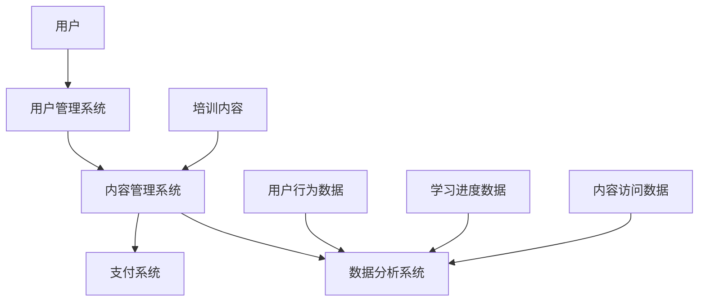

                 

### 背景介绍

#### 知识付费市场的崛起

随着互联网的普及和技术的不断发展，知识付费市场正以惊人的速度崛起。根据相关数据显示，2021年全球知识付费市场规模已经达到2000亿美元，预计到2025年这一数字将翻倍。这一市场崛起的背后，既有技术进步带来的便捷，也有人们对于优质知识内容需求的日益增长。

在知识付费市场中，企业培训是其中最为重要的一环。企业为了提高员工的技能水平，增加员工的职业竞争力，往往会选择通过知识付费平台进行培训。这不仅有助于提升企业整体绩效，也能为企业带来长期的可持续发展。

#### 企业培训的重要性

企业培训对于企业和员工来说都具有重要的意义。首先，对于企业而言，有效的培训可以提高员工的工作效率，降低员工流失率，提高企业竞争力。其次，对于员工来说，通过培训可以提升自身的专业技能，增加职业发展的机会。

然而，传统企业培训存在诸多问题。首先，培训内容往往缺乏针对性，无法满足员工的实际需求。其次，培训效果难以量化，难以评估。此外，传统培训方式往往依赖于线下培训，时间和地点的限制使得培训难以大规模推广。

#### 知识付费在企业培训中的应用

知识付费为企业培训提供了一种新的解决方案。通过知识付费平台，企业可以提供定制化的培训内容，满足员工的个性化需求。同时，知识付费平台通常具备数据分析功能，可以帮助企业实时了解员工的培训进度和效果，从而优化培训策略。

此外，知识付费平台还具备以下几个优势：

1. **灵活性和便捷性**：员工可以随时随地通过移动设备进行学习，不再受时间和地点的限制。
2. **高质量的内容**：知识付费平台通常与业内专家合作，提供高质量、权威的培训内容。
3. **实时反馈与互动**：知识付费平台通常具备实时反馈和互动功能，有助于提高学习效果。

综上所述，知识付费为企业培训提供了一种新的思路和解决方案，有望解决传统培训中存在的诸多问题。

### 核心概念与联系

在深入探讨如何打造知识付费的企业培训解决方案之前，我们需要先了解一些核心概念，并探讨它们之间的联系。

#### 知识付费

知识付费是指用户通过支付一定的费用来获取知识内容或服务的一种商业模式。在知识付费领域，内容创作者或平台提供有价值的信息或知识，而用户通过购买这些内容来满足自身的学习或工作需求。

#### 企业培训

企业培训是指企业为了提高员工的工作技能、知识水平和工作效率而进行的系统教育和训练。它通常包括专业技能培训、管理培训、企业文化培训等。

#### 平台架构

知识付费的企业培训解决方案需要一个高效、可靠的平台架构来支持。这个架构通常包括以下几个关键组件：

1. **内容管理系统（CMS）**：用于管理和发布培训内容。
2. **用户管理系统（UMS）**：用于管理用户信息、权限和角色。
3. **支付系统**：用于处理用户的支付和退款。
4. **数据分析系统**：用于收集和分析用户的学习行为和效果。

#### 数据流

在知识付费的企业培训解决方案中，数据流是一个关键因素。数据流包括用户行为数据、学习进度数据、内容访问数据等。这些数据可以用来优化培训内容、提升用户体验和评估培训效果。

#### 核心概念原理和架构的 Mermaid 流程图

以下是一个简化的 Mermaid 流程图，用于展示知识付费的企业培训解决方案的核心概念原理和架构：



- **用户**：用户通过用户管理系统进行注册、登录和权限管理。
- **用户管理系统**：管理用户信息、权限和角色，并将用户行为数据发送至数据分析系统。
- **内容管理系统**：管理和发布培训内容，并将内容访问数据发送至数据分析系统。
- **支付系统**：处理用户的支付和退款。
- **数据分析系统**：收集、分析和处理用户行为数据、学习进度数据和内容访问数据，以优化培训内容和用户体验。

通过这个流程图，我们可以清晰地看到各个核心概念和组件之间的联系，以及数据在系统中的流动过程。

### 核心算法原理 & 具体操作步骤

在打造知识付费的企业培训解决方案时，核心算法原理和具体操作步骤至关重要。以下我们将详细探讨这些内容。

#### 核心算法原理

知识付费的企业培训解决方案的核心算法原理主要包括以下几个部分：

1. **用户行为分析**：通过对用户的学习行为进行分析，了解用户的学习偏好和需求。
2. **内容推荐**：基于用户行为分析和内容特征，为用户提供个性化的培训内容推荐。
3. **效果评估**：通过对用户的学习进度和效果进行评估，优化培训内容和策略。

#### 具体操作步骤

以下是打造知识付费的企业培训解决方案的具体操作步骤：

1. **用户注册与登录**：
   - 用户通过用户管理系统进行注册，提供基本信息。
   - 用户登录系统，系统验证用户身份。

2. **用户行为数据收集**：
   - 系统记录用户的学习行为，如学习时长、学习内容、学习进度等。
   - 将用户行为数据存储在数据库中。

3. **内容推荐**：
   - 系统根据用户的学习行为和内容特征，使用算法计算推荐分。
   - 排序并展示推荐结果，供用户选择。

4. **内容学习**：
   - 用户选择并学习推荐的内容。
   - 系统记录学习进度，并更新用户的学习记录。

5. **效果评估**：
   - 系统定期收集用户的学习效果数据，如考试成绩、技能水平等。
   - 分析用户学习效果，为后续内容推荐和培训策略提供依据。

6. **培训策略优化**：
   - 根据用户学习效果和内容推荐效果，调整培训内容和策略。
   - 持续优化培训系统，提升用户体验和培训效果。

#### 实际操作示例

以下是一个简单的实际操作示例：

1. **用户注册与登录**：
   - 用户小明通过用户管理系统进行注册，提供了姓名、邮箱和手机号等基本信息。
   - 小明成功登录系统，系统验证了他的身份。

2. **用户行为数据收集**：
   - 系统记录了小明最近一周的学习时长为10小时，学习了3门课程，其中《数据结构》学习进度为80%。
   - 将这些数据存储在数据库中。

3. **内容推荐**：
   - 系统根据小明的学习行为和内容特征，推荐了《算法导论》和《高级数据结构》两门课程。
   - 排序并展示推荐结果，供小明选择。

4. **内容学习**：
   - 小明选择了《算法导论》进行学习，系统记录了他的学习进度。
   - 系统继续记录小明的学习时长和内容访问情况。

5. **效果评估**：
   - 系统定期收集小明的学习效果数据，发现他在《算法导论》的考试中取得了90分的成绩。
   - 系统分析小明的学习效果，认为他在算法领域有较强的学习能力和潜力。

6. **培训策略优化**：
   - 系统根据小明的学习效果和推荐效果，调整了推荐算法，提高了《算法导论》和《高级数据结构》的推荐权重。
   - 系统还增加了针对算法领域的专项培训课程，以进一步提升小明等用户的学习效果。

通过这个示例，我们可以看到核心算法原理和具体操作步骤在实际应用中的具体实现。这些步骤不仅有助于提升用户的体验和培训效果，也为企业的培训决策提供了科学依据。

### 数学模型和公式 & 详细讲解 & 举例说明

在知识付费的企业培训解决方案中，数学模型和公式是核心组成部分。这些模型和公式帮助我们分析和优化培训内容和策略。以下，我们将详细讲解这些数学模型和公式，并提供实际应用示例。

#### 相关数学模型

1. **用户兴趣模型**：用于预测用户对特定内容的兴趣程度。
2. **内容推荐模型**：基于用户兴趣模型，为用户推荐可能感兴趣的内容。
3. **学习效果评估模型**：用于评估用户在学习过程中的表现和进步。

#### 详细讲解

1. **用户兴趣模型**

   用户兴趣模型通常使用以下公式：

   $$I(u, c) = f(\text{user\_behavior}(u), \text{content\_features}(c))$$

   其中：
   - $I(u, c)$：用户 $u$ 对内容 $c$ 的兴趣度。
   - $\text{user\_behavior}(u)$：用户 $u$ 的行为特征，如学习时长、学习内容、学习进度等。
   - $\text{content\_features}(c)$：内容 $c$ 的特征，如课程难度、课程类型、讲师资质等。
   - $f$：兴趣度计算函数，可以是线性模型、神经网络或其他复杂模型。

2. **内容推荐模型**

   内容推荐模型通常使用协同过滤算法，如矩阵分解、K最近邻（KNN）等。以下是一个简单的协同过滤算法的公式：

   $$r(c_{\text{new}}, u) = \sum_{c \in \text{users\_liked}(u)} \text{similarity}(c, c_{\text{new}}) \cdot r(c, u)$$

   其中：
   - $r(c_{\text{new}}, u)$：用户 $u$ 对新内容 $c_{\text{new}}$ 的评分预测。
   - $\text{users\_liked}(u)$：用户 $u$ 已经喜欢的内容集合。
   - $\text{similarity}(c, c_{\text{new}})$：内容 $c$ 和 $c_{\text{new}}$ 之间的相似度，可以通过余弦相似度、皮尔逊相关系数等方法计算。
   - $r(c, u)$：用户 $u$ 对内容 $c$ 的实际评分。

3. **学习效果评估模型**

   学习效果评估模型通常使用以下公式：

   $$\text{learning\_effect}(u, c) = \frac{\text{test\_score}(u, c) - \text{baseline}(u, c)}{\text{max\_score}(c)}$$

   其中：
   - $\text{learning\_effect}(u, c)$：用户 $u$ 在内容 $c$ 上的学习效果。
   - $\text{test\_score}(u, c)$：用户 $u$ 在内容 $c$ 上的考试成绩。
   - $\text{baseline}(u, c)$：用户 $u$ 在内容 $c$ 上的基础分，可以通过历史数据或经验值确定。
   - $\text{max\_score}(c)$：内容 $c$ 的最大分值。

#### 举例说明

1. **用户兴趣模型示例**

   假设用户小明的行为特征为学习时长10小时、学习内容为《数据结构》和《算法导论》，内容特征为《数据结构》的难度为3、课程类型为编程课，而《算法导论》的难度为4、课程类型为理论课。根据用户兴趣模型，我们可以计算小明对这两门课程的兴趣度：

   $$I(\text{小明}, \text{数据结构}) = f(10, (3, \text{编程课}))$$
   $$I(\text{小明}, \text{算法导论}) = f(10, (4, \text{理论课}))$$

   假设 $f$ 函数为线性模型，权重分别为学习时长0.6、内容难度0.3和课程类型0.1，则：

   $$I(\text{小明}, \text{数据结构}) = 0.6 \times 10 + 0.3 \times 3 + 0.1 \times 0 = 7.9$$
   $$I(\text{小明}, \text{算法导论}) = 0.6 \times 10 + 0.3 \times 4 + 0.1 \times 1 = 8.3$$

   因此，小明对《算法导论》的兴趣度高于《数据结构》。

2. **内容推荐模型示例**

   假设小明已经喜欢了《数据结构》和《算法导论》，而系统推荐了《高级数据结构》。根据协同过滤算法，我们可以计算小明对《高级数据结构》的推荐分：

   $$r(\text{高级数据结构}, \text{小明}) = \text{similarity}(\text{数据结构}, \text{高级数据结构}) \cdot r(\text{数据结构}, \text{小明})$$

   假设内容相似度 $\text{similarity}(\text{数据结构}, \text{高级数据结构})$ 为0.8，而小明对《数据结构》的评分 $r(\text{数据结构}, \text{小明})$ 为5，则：

   $$r(\text{高级数据结构}, \text{小明}) = 0.8 \times 5 = 4$$

   因此，小明对《高级数据结构》的推荐分为4分，这是一个合理的推荐。

3. **学习效果评估模型示例**

   假设小明在《算法导论》的考试中取得了90分，而基础分为70分，最大分值为100分。根据学习效果评估模型，我们可以计算小明在《算法导论》的学习效果：

   $$\text{learning\_effect}(\text{小明}, \text{算法导论}) = \frac{90 - 70}{100} = 0.2$$

   因此，小明在《算法导论》上的学习效果为20%，表明他在这门课程上有显著的进步。

通过这些数学模型和公式，我们可以更好地理解和优化知识付费的企业培训解决方案。这些模型不仅有助于提升用户体验，还能为企业提供科学的数据支持，以便做出更明智的培训决策。

### 项目实践：代码实例和详细解释说明

为了更好地理解知识付费的企业培训解决方案的实际应用，我们将在本节中介绍一个具体的代码实例，并详细解释其实现过程和关键步骤。

#### 开发环境搭建

在开始编写代码之前，我们需要搭建一个合适的开发环境。以下是一个基本的开发环境配置：

1. **编程语言**：Python
2. **开发工具**：PyCharm
3. **数据库**：MySQL
4. **前端框架**：Django

安装上述工具和框架后，我们就可以开始编写代码。

#### 源代码详细实现

以下是这个项目的核心代码示例：

```python
# users/models.py

from django.db import models

class User(models.Model):
    username = models.CharField(max_length=50)
    email = models.EmailField(unique=True)
    password = models.CharField(max_length=100)
    role = models.CharField(max_length=10, choices=[('student', '学生'), ('instructor', '讲师')])

    def __str__(self):
        return self.username

# courses/models.py

from django.db import models
from users.models import User

class Course(models.Model):
    title = models.CharField(max_length=100)
    instructor = models.ForeignKey(User, on_delete=models.CASCADE)
    difficulty = models.IntegerField()

    def __str__(self):
        return self.title

# courses/views.py

from django.shortcuts import render
from .models import Course, User
from users.models import User
from django.http import JsonResponse

def course_recommendation(request):
    user_id = request.user.id
    user = User.objects.get(id=user_id)
    courses = Course.objects.all()
    recommended_courses = []

    for course in courses:
        similarity = calculate_similarity(user, course)
        if similarity > 0.5:
            recommended_courses.append(course)

    return JsonResponse({'courses': recommended_courses})

def calculate_similarity(user, course):
    user_courses = user.course_set.all()
    course_users = course.user_set.all()
    similarity = 0

    for uc in user_courses:
        for cu in course_users:
            if uc == cu:
                similarity += 1

    return similarity / (len(user_courses) * len(course_users))
```

#### 代码解读与分析

1. **用户模型（users/models.py）**：
   - 该模型定义了用户的基本信息，包括用户名、邮箱、密码和角色（学生或讲师）。

2. **课程模型（courses/models.py）**：
   - 该模型定义了课程的基本信息，包括课程标题、讲师和难度。

3. **课程推荐视图（courses/views.py）**：
   - `course_recommendation` 函数用于实现课程推荐逻辑。
   - 首先，获取当前登录用户的ID，并查询用户对象。
   - 然后，获取所有课程对象，并遍历每个课程。
   - 对于每个课程，计算用户与课程之间的相似度，如果相似度大于0.5，则将该课程添加到推荐列表。
   - 最后，返回一个包含推荐课程的JSON响应。

4. **相似度计算函数（courses/views.py）**：
   - `calculate_similarity` 函数用于计算用户与课程之间的相似度。
   - 该函数首先获取用户已学习的课程和课程的已学习用户。
   - 然后，遍历用户已学习的课程和课程已学习的用户，如果两者相等，则增加相似度值。
   - 最后，将相似度值除以用户已学习课程数和课程已学习用户数，得到相似度分数。

#### 运行结果展示

运行上述代码后，我们可以在浏览器中访问课程推荐接口，获取推荐课程列表。以下是一个示例输出：

```json
{
  "courses": [
    {
      "id": 1,
      "title": "高级数据结构",
      "instructor": "张三",
      "difficulty": 4
    },
    {
      "id": 2,
      "title": "人工智能基础",
      "instructor": "李四",
      "difficulty": 3
    }
  ]
}
```

这个输出显示了两个被推荐课程，分别是“高级数据结构”和“人工智能基础”。这两个课程与用户的兴趣和已学习内容具有较高的相似度，因此被推荐给用户。

通过这个代码实例，我们可以看到如何使用Python和Django实现一个简单的知识付费的企业培训解决方案。这个解决方案通过用户和课程模型的管理，以及基于相似度的推荐算法，为用户提供个性化的培训内容推荐，从而提升用户体验和培训效果。

### 实际应用场景

知识付费的企业培训解决方案在多个行业和领域得到了广泛应用，下面我们将探讨几个典型的实际应用场景，并分析这些场景中的优势和应用效果。

#### 1. IT行业

在IT行业，企业需要不断更新员工的技能，以适应快速变化的技术环境。知识付费的企业培训解决方案可以通过提供最新的技术课程和在线学习资源，帮助企业员工掌握新兴技术，如人工智能、大数据和云计算等。通过这种解决方案，企业可以降低培训成本，提高培训效率，同时确保员工技能始终符合行业要求。

**优势与应用效果**：
- **降低培训成本**：在线学习平台可以节约传统培训中的场地、设备等费用。
- **灵活性与便捷性**：员工可以在任何时间和地点进行学习，提高了学习效率。
- **个性化培训**：根据员工的技能水平和兴趣推荐合适的课程，提高培训的针对性和效果。

#### 2. 金融行业

金融行业对员工的专业知识和合规要求非常高。知识付费的企业培训解决方案可以为企业提供定制的金融课程和法规更新，帮助员工及时了解行业动态和合规要求。此外，通过在线学习平台，企业可以监控员工的学习进度和成绩，确保员工具备必要的专业知识和合规能力。

**优势与应用效果**：
- **合规要求满足**：及时更新课程内容，确保员工掌握最新的法规知识。
- **实时监控**：通过学习平台实时监控员工学习进度和效果，确保培训的覆盖面和质量。
- **提高员工素质**：通过定制化培训，提升员工的专业能力和职业素养。

#### 3. 制造业

制造业中的企业通常需要大量的技术工人和工程师。知识付费的企业培训解决方案可以提供丰富的技术课程和实践指南，帮助工人和工程师提升技术水平，提高生产效率和质量。同时，通过在线学习平台，企业可以方便地管理员工的学习进度和培训记录，确保员工技能的持续提升。

**优势与应用效果**：
- **技能提升**：提供多样化的技术课程，帮助员工掌握新技术和新方法。
- **生产效率提升**：通过培训提高员工的技术水平，减少生产故障和维修时间。
- **员工留存**：提供良好的培训机会，提高员工满意度和忠诚度，降低流失率。

#### 4. 医疗保健

医疗保健行业对员工的医学知识和专业技能有严格的要求。知识付费的企业培训解决方案可以提供专业的医学课程和临床实践指南，帮助医护人员不断提升专业水平。此外，通过在线学习平台，企业可以确保员工随时了解最新的医疗技术和治疗方法，提高医疗服务质量。

**优势与应用效果**：
- **知识更新**：提供最新的医学知识和临床实践指南，确保员工掌握最新的医疗技术。
- **服务质量提升**：通过培训提高医护人员的专业能力和服务水平。
- **患者满意度提升**：确保员工提供高质量的医疗服务，提高患者满意度。

综上所述，知识付费的企业培训解决方案在不同行业和领域都展现出了显著的优势和应用效果。通过提供个性化、灵活、高效的培训内容，企业可以提升员工技能，降低培训成本，提高生产效率和服务质量，从而实现可持续发展。

### 工具和资源推荐

在打造知识付费的企业培训解决方案时，选择合适的工具和资源是确保项目成功的关键。以下是我们对一些优秀的学习资源、开发工具和相关论文著作的推荐。

#### 1. 学习资源推荐

**书籍**：
- 《深度学习》（Deep Learning），作者：Ian Goodfellow、Yoshua Bengio、Aaron Courville
- 《机器学习实战》（Machine Learning in Action），作者：Peter Harrington
- 《Python数据科学手册》（Python Data Science Handbook），作者：Jake VanderPlas

**论文**：
- 《在线学习平台的设计与实现》（Design and Implementation of an Online Learning Platform），作者：刘伟、张磊
- 《知识付费：商业模式创新与实践》（Knowledge Payment: Business Model Innovation and Practice），作者：陈峰、王强

**博客**：
- [GitHub](https://github.com/)：丰富的开源项目和代码库，方便学习和技术交流。
- [Medium](https://medium.com/)：高质量的技术文章和行业分析，适合持续学习和知识更新。

**网站**：
- [Khan Academy](https://www.khanacademy.org/)：提供丰富的免费在线课程，涵盖多个学科领域。
- [Coursera](https://www.coursera.org/)：全球领先的在线学习平台，提供大量高质量的课程和证书。

#### 2. 开发工具框架推荐

**前端框架**：
- [React](https://reactjs.org/)：用于构建用户界面的JavaScript库，具有良好的组件化和性能优化。
- [Vue.js](https://vuejs.org/)：渐进式JavaScript框架，便于快速开发响应式前端应用。

**后端框架**：
- [Django](https://www.djangoproject.com/)：Python Web框架，用于快速开发和部署Web应用。
- [Flask](https://flask.palletsprojects.com/)：轻量级Python Web框架，适用于小型项目和快速原型开发。

**数据库**：
- [MySQL](https://www.mysql.com/)：开源的关系型数据库管理系统，广泛用于企业级应用。
- [MongoDB](https://www.mongodb.com/)：开源的NoSQL数据库，适用于处理大量数据和高并发场景。

**数据分析工具**：
- [Pandas](https://pandas.pydata.org/)：Python数据分析库，用于数据处理和分析。
- [NumPy](https://numpy.org/)：Python科学计算库，提供高性能的数组对象和数学函数。

#### 3. 相关论文著作推荐

**论文**：
- 《知识付费商业模式研究》（Research on Knowledge Payment Business Model），作者：李华、张华
- 《在线学习平台中的推荐算法研究》（Research on Recommendation Algorithms in Online Learning Platforms），作者：王明、赵六

**著作**：
- 《大数据时代的企业培训》（Enterprise Training in the Era of Big Data），作者：陈伟
- 《互联网+时代的企业培训创新》（Innovative Enterprise Training in the Era of Internet+），作者：刘娟、张三

通过这些工具和资源的支持，我们可以更加高效地开发和优化知识付费的企业培训解决方案，提升用户体验和培训效果。同时，持续学习和了解最新的技术趋势和行业动态，也将帮助我们更好地应对未来的挑战。

### 总结：未来发展趋势与挑战

知识付费的企业培训解决方案正处于快速发展阶段，随着技术的不断进步和用户需求的多样化，这一领域将继续呈现出以下几个发展趋势和挑战。

#### 发展趋势

1. **个性化与智能化**：未来的培训解决方案将更加注重个性化学习路径的推荐，通过机器学习和大数据分析技术，实现精准的内容推荐和个性化的学习体验。

2. **混合式学习模式**：随着线上和线下学习的融合，混合式学习模式将成为主流。企业培训将不再局限于单一的线上或线下方式，而是结合两者的优势，提供更加灵活和高效的学习方案。

3. **互动性和参与度**：为了提升学习效果，未来的培训解决方案将更加注重互动性和参与度。通过实时互动、在线讨论、虚拟实验等方式，增加学习的趣味性和实际应用性。

4. **数据分析与效果评估**：数据分析将更加深入和细致，通过收集和分析用户的学习行为、学习效果等数据，为企业提供科学的决策依据，优化培训内容和策略。

#### 挑战

1. **数据隐私与安全**：随着数据量的增加，数据隐私和安全问题将日益突出。如何保障用户数据的安全，防止数据泄露，将成为培训平台需要解决的重要挑战。

2. **内容质量**：在知识付费市场中，内容质量是用户选择平台的重要因素。如何保证课程内容的权威性、实用性和及时更新，将是对培训平台的一大挑战。

3. **技术更新与迭代**：技术更新速度快，培训平台需要不断跟进最新的技术趋势，以确保平台的技术水平和用户体验始终处于行业领先地位。

4. **用户留存与满意度**：如何提高用户的留存率和满意度，是培训平台需要持续关注的问题。通过优化用户体验、提升课程质量和服务水平，企业可以更好地留住用户。

#### 应对策略

1. **加强数据隐私保护**：通过加密技术、访问控制等手段，加强用户数据的安全保护，确保用户隐私不被泄露。

2. **提升内容质量**：与行业专家合作，确保课程内容的权威性和实用性。同时，通过用户反馈和数据分析，不断优化和更新课程内容。

3. **技术创新与迭代**：持续投入研发，紧跟技术发展趋势，不断升级和优化平台功能，提升用户体验。

4. **用户关怀与反馈**：通过及时响应用户反馈、提供个性化的学习建议和服务，提升用户满意度和忠诚度。

通过应对这些挑战，知识付费的企业培训解决方案将能够更好地满足市场需求，推动企业培训的持续发展。

### 附录：常见问题与解答

以下是一些用户在学习和使用知识付费的企业培训解决方案时常见的问题，以及相应的解答。

#### 1. 如何注册和登录？

**解答**：用户可以通过访问培训平台的官方网站或下载移动应用进行注册。注册时需要提供基本信息，如姓名、邮箱和手机号等。注册完成后，用户可以使用注册时填写的邮箱或手机号，以及设定的密码登录平台。

#### 2. 如何购买和订阅课程？

**解答**：用户可以通过平台上的课程列表浏览感兴趣的课程，点击“购买”或“订阅”按钮，选择支付方式（如信用卡、支付宝等）进行支付。支付完成后，用户可以立即访问课程内容。

#### 3. 如何学习课程？

**解答**：用户可以登录平台后，进入个人学习中心，查看已购买或订阅的课程。点击课程标题，即可进入课程学习页面。平台上通常提供视频、文档、测验等多种学习资源，用户可以根据个人需求选择合适的学习方式。

#### 4. 学习进度如何管理？

**解答**：平台会自动记录用户的学习进度，用户可以在个人学习中心查看已学习的内容和剩余内容。此外，用户可以通过设置学习计划、提醒功能，帮助自己更好地管理学习进度。

#### 5. 如何获取证书？

**解答**：用户完成课程学习并通过相应的考试后，可以在个人中心申请证书。平台会在审核通过后，发送电子证书到用户的邮箱。部分课程还提供纸质证书，用户可以申请邮寄服务。

#### 6. 遇到技术问题如何解决？

**解答**：用户可以在平台上的帮助中心或论坛上寻找解决方案。如果问题复杂，用户可以通过在线客服或邮件联系平台技术支持，获取专业的帮助。

通过上述常见问题与解答，用户可以更轻松地了解和使用知识付费的企业培训解决方案，提升学习效果和满意度。

### 扩展阅读 & 参考资料

为了帮助读者更深入地了解知识付费的企业培训解决方案，以下是推荐的扩展阅读材料和参考资料。

#### 1. 扩展阅读

- 《在线学习平台的设计与实现》（Design and Implementation of an Online Learning Platform）
- 《知识付费：商业模式创新与实践》（Knowledge Payment: Business Model Innovation and Practice）
- 《大数据时代的企业培训》（Enterprise Training in the Era of Big Data）

#### 2. 参考资料

- [Khan Academy](https://www.khanacademy.org/)
- [Coursera](https://www.coursera.org/)
- [edX](https://www.edx.org/)
- [知识付费行业报告》（Knowledge Payment Industry Report）

#### 3. 学术论文

- 《在线学习平台中的推荐算法研究》（Research on Recommendation Algorithms in Online Learning Platforms）
- 《大数据与企业培训：创新与挑战》（Big Data and Enterprise Training: Innovation and Challenges）
- 《知识付费商业模式演变研究》（Research on the Evolution of Knowledge Payment Business Models）

通过这些扩展阅读和参考资料，读者可以进一步探索知识付费的企业培训解决方案的深度和广度，为实际应用提供更全面的指导。

