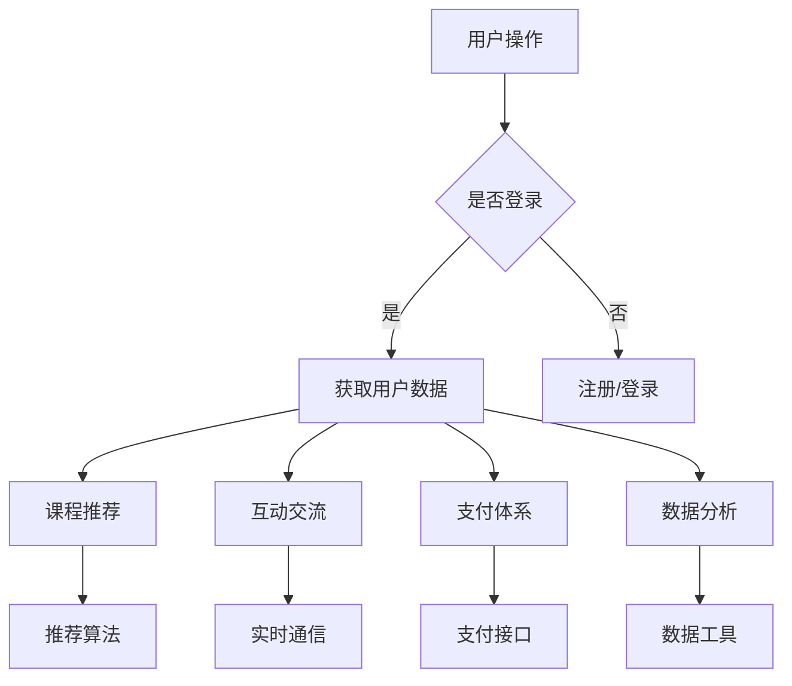

                 

### 1. 背景介绍

知识付费作为一种新型商业模式，近年来在全球范围内迅速崛起。它改变了人们获取知识的传统方式，通过在线教育、在线课程、付费问答等形式，将优质的教育资源以有偿方式提供给学习者。这一现象的出现，不仅满足了人们对高质量知识的需求，还激发了教育产业的市场潜力。

移动学习App作为知识付费的重要载体，其市场需求日益增长。移动学习App不仅能够实现随时随地学习，还具备个性化推荐、互动交流等功能，极大地提升了学习体验。随着移动互联网的普及，智能手机和平板电脑的广泛使用，移动学习App已经成为知识付费领域的重要趋势。

在这个背景下，打造一款优秀的移动学习App显得尤为重要。首先，它需要具备强大的内容库，能够提供丰富多样的课程和学习资源。其次，它需要拥有良好的用户体验，通过简洁直观的界面设计和流畅的操作流程，吸引用户并提升用户留存率。此外，移动学习App还需要具备完善的支付体系和安全保障机制，确保用户的支付安全和数据隐私。

本文将围绕打造知识付费的移动学习App这一主题，从多个方面进行探讨。首先，我们将介绍移动学习App的基本架构，包括前端、后端和数据库等组成部分。然后，我们将深入讨论移动学习App的核心功能，如课程推荐、互动交流、支付体系等。接着，我们将介绍如何通过算法优化和数据分析，提升移动学习App的用户体验和运营效率。最后，我们将探讨移动学习App在实际应用中的挑战和解决方案，并预测其未来发展趋势。

通过本文的探讨，我们希望能够为开发者和创业者提供一些有价值的参考和指导，帮助他们在竞争激烈的市场中打造出优秀的移动学习App。

### 2. 核心概念与联系

#### 2.1 移动学习App的基本架构

要构建一款优秀的移动学习App，首先需要了解其基本架构，这包括前端、后端和数据库三个核心组成部分。

**2.1.1 前端架构**

前端架构是移动学习App的用户界面层，直接与用户交互。它通常由HTML、CSS和JavaScript组成，负责展示课程内容、用户界面和交互逻辑。前端框架如React、Vue.js和Angular等，可以显著提高开发效率和代码可维护性。

**2.1.2 后端架构**

后端架构是移动学习App的核心功能实现层，负责处理业务逻辑、数据存储和安全性等。后端通常由服务器和数据库组成。常用的后端技术包括Node.js、Java Spring Boot和Python Django等。

**2.1.3 数据库架构**

数据库是移动学习App的数据存储中心，用于存储用户信息、课程数据、支付记录等。关系型数据库如MySQL、PostgreSQL，以及NoSQL数据库如MongoDB、Redis，根据具体需求选择适合的数据库类型。

#### 2.2 核心功能

**2.2.1 课程推荐**

课程推荐是移动学习App的核心功能之一。通过算法分析用户的兴趣和行为数据，智能推荐符合用户需求的课程。常用的推荐算法包括基于内容的推荐（Content-based Filtering）和协同过滤（Collaborative Filtering）。

**2.2.2 互动交流**

互动交流功能增强了用户之间的互动和社区氛围。常见的互动方式包括评论、点赞、问答等。通过实时通信技术如WebSocket，可以实现用户的实时互动。

**2.2.3 支付体系**

支付体系是确保用户能够顺利购买课程和服务的关键。移动学习App通常支持多种支付方式，如支付宝、微信支付、信用卡支付等。同时，需要确保支付过程的安全性和稳定性。

**2.2.4 数据分析**

数据分析功能用于分析用户行为数据，了解用户偏好和使用习惯，从而优化产品功能和营销策略。常见的数据分析工具包括Google Analytics、Mixpanel等。

#### 2.3 Mermaid 流程图

以下是移动学习App的核心架构和功能流程的Mermaid流程图：



通过上述流程图，我们可以清晰地看到移动学习App的各个模块是如何相互协作，共同构建一个完整的用户体验。

### 3. 核心算法原理 & 具体操作步骤

#### 3.1 课程推荐算法

课程推荐是移动学习App的核心功能之一。为了实现个性化的课程推荐，我们通常会采用以下两种算法：基于内容的推荐（Content-based Filtering）和协同过滤（Collaborative Filtering）。

**3.1.1 基于内容的推荐**

基于内容的推荐算法通过分析课程的内容特征，将其与用户的兴趣偏好进行匹配，从而推荐相关课程。具体步骤如下：

1. **特征提取**：首先，我们需要对课程的内容进行特征提取，这些特征可以包括课程标签、课程描述、课程分类等。例如，假设我们有一门课程，其标签包括“编程”、“Python”和“机器学习”。

2. **用户兴趣建模**：接下来，我们需要根据用户的浏览历史、收藏记录等数据，建模用户的兴趣偏好。例如，如果一个用户经常浏览与“编程”相关的课程，我们可以将其对“编程”的兴趣值设为较高。

3. **相似度计算**：然后，我们将课程的特征与用户的兴趣特征进行相似度计算。常用的相似度计算方法包括余弦相似度、Jaccard相似度等。

4. **推荐课程**：根据相似度计算结果，推荐与用户兴趣最相关的课程。

**3.1.2 协同过滤**

协同过滤算法通过分析用户之间的行为数据，找出相似用户，并基于相似用户的偏好推荐课程。具体步骤如下：

1. **用户行为数据收集**：收集用户在App中的行为数据，如观看历史、评分、收藏等。

2. **用户相似度计算**：计算用户之间的相似度，常用的相似度计算方法包括皮尔逊相关系数、余弦相似度等。

3. **课程评分预测**：基于相似用户的行为数据，预测用户对课程的评分。

4. **推荐课程**：根据用户对课程的预测评分，推荐评分较高的课程。

**3.2 互动交流算法**

互动交流功能增强了用户之间的互动和社区氛围。为了实现实时、高效的互动交流，我们可以采用以下算法：

1. **消息排序**：根据用户的行为和偏好，动态调整消息的排序，将重要的消息推送到用户面前。

2. **实时通信**：使用WebSocket等实时通信技术，实现用户之间的实时消息传递。

3. **社区推荐**：基于用户的互动数据，推荐相关的社区话题和用户，促进用户之间的互动。

**3.3 支付体系算法**

支付体系是移动学习App的重要组成部分，其核心是确保支付的安全性和稳定性。以下是一些常用的支付算法：

1. **支付加密**：使用SSL等加密技术，确保支付过程中的数据传输安全。

2. **支付验证**：通过支付验证算法，如双因素认证、动态验证码等，确保支付操作的安全性。

3. **风险控制**：采用风险控制算法，如异常行为检测、黑名单管理等，防范支付欺诈和风险。

#### 3.3 具体操作步骤

**3.3.1 课程推荐算法**

1. **特征提取**：
   - 收集课程标签、描述、分类等特征信息。
   - 收集用户浏览历史、收藏记录等行为数据。

2. **用户兴趣建模**：
   - 训练用户兴趣模型，如使用决策树、神经网络等。
   - 根据用户行为数据，更新用户兴趣模型。

3. **相似度计算**：
   - 使用余弦相似度计算课程和用户之间的相似度。
   - 根据相似度分数，对课程进行排序。

4. **推荐课程**：
   - 根据排序结果，推荐前N个相似度最高的课程。

**3.3.2 互动交流算法**

1. **消息排序**：
   - 根据用户互动行为数据，如点赞、评论等，调整消息排序。
   - 使用机器学习算法，动态调整消息排序策略。

2. **实时通信**：
   - 使用WebSocket建立实时通信连接。
   - 实现用户之间的实时消息发送和接收。

3. **社区推荐**：
   - 基于用户互动数据，推荐相关社区话题和用户。
   - 使用协同过滤算法，推荐相似用户。

**3.3.3 支付体系算法**

1. **支付加密**：
   - 使用SSL加密技术，确保数据传输安全。
   - 对支付数据进行加密处理。

2. **支付验证**：
   - 实现双因素认证，确保支付操作的安全性。
   - 使用动态验证码，增加支付操作的复杂度。

3. **风险控制**：
   - 构建异常行为检测模型，检测和防范支付欺诈。
   - 维护黑名单，禁止恶意用户进行支付操作。

通过上述算法和操作步骤，我们可以构建一个高效、安全的移动学习App，为用户提供优质的课程推荐、互动交流和支付体验。

### 4. 数学模型和公式 & 详细讲解 & 举例说明

#### 4.1 课程推荐算法的数学模型

**4.1.1 基于内容的推荐**

在基于内容的推荐算法中，我们使用向量空间模型（Vector Space Model）来表示课程和用户。假设我们有一组课程和一组用户，每个课程和用户都可以表示为一个向量。

**向量表示**：

- **课程向量**：假设课程\( C \)由标签集合\( T_C = \{t_1, t_2, \ldots, t_n\} \)组成，我们可以使用一个\( n \)维的向量\( \vec{C} \)来表示它，其中每个维度对应一个标签。例如：
  \[
  \vec{C} = (c_1, c_2, \ldots, c_n)
  \]
  其中，\( c_i = 1 \)如果课程\( C \)包含标签\( t_i \)，否则为0。

- **用户向量**：类似地，我们可以使用一个\( n \)维的向量\( \vec{U} \)来表示用户\( U \)的兴趣，其中每个维度对应一个标签。例如：
  \[
  \vec{U} = (u_1, u_2, \ldots, u_n)
  \]
  其中，\( u_i = 1 \)如果用户\( U \)对标签\( t_i \)感兴趣，否则为0。

**相似度计算**：

- **余弦相似度**：两个向量\( \vec{C} \)和\( \vec{U} \)之间的余弦相似度（Cosine Similarity）可以用以下公式计算：
  \[
  \cos(\vec{C}, \vec{U}) = \frac{\vec{C} \cdot \vec{U}}{||\vec{C}|| \cdot ||\vec{U}||}
  \]
  其中，\( \cdot \)表示向量的点积，\( ||\vec{C}|| \)和\( ||\vec{U}|| \)分别表示向量的欧几里得范数。

**举例说明**：

假设我们有两个课程\( C_1 \)和\( C_2 \)，以及一个用户\( U \)，他们的向量表示如下：

- \( \vec{C_1} = (1, 1, 0, 0) \)
- \( \vec{C_2} = (0, 1, 1, 0) \)
- \( \vec{U} = (0.5, 0.5, 0.5, 0.5) \)

我们可以计算两个课程与用户之间的余弦相似度：

- \( \vec{C_1} \cdot \vec{U} = 1 \cdot 0.5 + 1 \cdot 0.5 + 0 \cdot 0.5 + 0 \cdot 0.5 = 1 \)
- \( ||\vec{C_1}|| = \sqrt{1^2 + 1^2 + 0^2 + 0^2} = \sqrt{2} \)
- \( ||\vec{U}|| = \sqrt{0.5^2 + 0.5^2 + 0.5^2 + 0.5^2} = \sqrt{1} \)
- \( \cos(\vec{C_1}, \vec{U}) = \frac{1}{\sqrt{2} \cdot \sqrt{1}} = \frac{1}{\sqrt{2}} \)

- \( \vec{C_2} \cdot \vec{U} = 0 \cdot 0.5 + 1 \cdot 0.5 + 1 \cdot 0.5 + 0 \cdot 0.5 = 1 \)
- \( ||\vec{C_2}|| = \sqrt{0^2 + 1^2 + 1^2 + 0^2} = \sqrt{2} \)
- \( ||\vec{U}|| = \sqrt{0.5^2 + 0.5^2 + 0.5^2 + 0.5^2} = \sqrt{1} \)
- \( \cos(\vec{C_2}, \vec{U}) = \frac{1}{\sqrt{2} \cdot \sqrt{1}} = \frac{1}{\sqrt{2}} \)

由此可见，两个课程与用户之间的余弦相似度相同，均为\( \frac{1}{\sqrt{2}} \)。

**4.1.2 协同过滤**

在协同过滤算法中，我们使用用户-物品评分矩阵来表示用户对物品的评分。假设有一个用户集合\( U = \{u_1, u_2, \ldots, u_m\} \)和一个物品集合\( I = \{i_1, i_2, \ldots, i_n\} \)，以及一个评分矩阵\( R \)：

- \( R_{ui} \)表示用户\( u_i \)对物品\( i_j \)的评分，如果用户没有对物品进行评分，则\( R_{ui} = 0 \)。

**预测用户评分**：

- **用户-用户相似度**：计算用户\( u_i \)和用户\( u_j \)之间的相似度，通常使用皮尔逊相关系数：
  \[
  \rho_{ij} = \frac{\sum_{k=1}^n (R_{ik} - \bar{R}_i)(R_{jk} - \bar{R}_j)}{\sqrt{\sum_{k=1}^n (R_{ik} - \bar{R}_i)^2} \cdot \sqrt{\sum_{k=1}^n (R_{jk} - \bar{R}_j)^2}}
  \]
  其中，\( \bar{R}_i \)和\( \bar{R}_j \)分别表示用户\( u_i \)和用户\( u_j \)的平均评分。

- **预测评分**：基于相似用户\( u_i \)和用户\( u_j \)的评分，预测用户\( u_i \)对物品\( i_j \)的评分：
  \[
  \hat{R}_{ij} = \bar{R}_i + \rho_{ij} (\bar{R}_j - \bar{R}_i)
  \]

**举例说明**：

假设我们有三个用户\( u_1, u_2, u_3 \)和三个物品\( i_1, i_2, i_3 \)，以及他们的评分矩阵如下：

\[
R =
\begin{bmatrix}
0 & 5 & 0 \\
0 & 0 & 5 \\
4 & 0 & 0
\end{bmatrix}
\]

- \( u_1 \)和\( u_2 \)之间的相似度：
  \[
  \rho_{12} = \frac{(5-3)(5-3) + (5-3)(5-3) + (0-3)(0-3)}{\sqrt{(5-3)^2 + (0-3)^2 + (0-3)^2} \cdot \sqrt{(5-3)^2 + (0-3)^2 + (0-3)^2}} = \frac{4}{\sqrt{16} \cdot \sqrt{16}} = \frac{4}{16} = \frac{1}{4}
  \]

- \( u_1 \)和\( u_3 \)之间的相似度：
  \[
  \rho_{13} = \frac{(5-3)(4-3) + (0-3)(0-3) + (0-3)(0-3)}{\sqrt{(5-3)^2 + (0-3)^2 + (0-3)^2} \cdot \sqrt{(4-3)^2 + (0-3)^2 + (0-3)^2}} = \frac{2}{\sqrt{16} \cdot \sqrt{6}} = \frac{2}{\sqrt{96}} = \frac{1}{\sqrt{48}}
  \]

- \( u_2 \)和\( u_3 \)之间的相似度：
  \[
  \rho_{23} = \frac{(0-3)(4-3) + (0-3)(0-3) + (0-3)(0-3)}{\sqrt{(0-3)^2 + (0-3)^2 + (0-3)^2} \cdot \sqrt{(4-3)^2 + (0-3)^2 + (0-3)^2}} = \frac{-6}{\sqrt{9} \cdot \sqrt{6}} = -\frac{2}{\sqrt{6}}
  \]

- \( u_1 \)对\( i_2 \)的预测评分：
  \[
  \hat{R}_{12} = 3 + \frac{1}{4}(3 - 3) = 3
  \]

- \( u_1 \)对\( i_3 \)的预测评分：
  \[
  \hat{R}_{13} = 3 + \frac{1}{\sqrt{48}}(4 - 3) = 3 + \frac{1}{\sqrt{48}} = 3 + \frac{1}{4\sqrt{3}} \approx 3.09
  \]

- \( u_2 \)对\( i_3 \)的预测评分：
  \[
  \hat{R}_{23} = 0 + \left(-\frac{2}{\sqrt{6}}\right)(0 - 4) = \frac{8}{\sqrt{6}} \approx 4.90
  \]

通过这些数学模型和公式，我们可以实现高效的课程推荐算法，为用户推荐符合他们兴趣的课程。

### 5. 项目实践：代码实例和详细解释说明

#### 5.1 开发环境搭建

在开始具体项目实践之前，我们需要搭建一个适合开发移动学习App的开发环境。以下是推荐的开发工具和框架：

- **前端开发框架**：React、Vue.js 或 Angular
- **后端开发框架**：Node.js（Express）、Java Spring Boot 或 Python Django
- **数据库**：MySQL、PostgreSQL 或 MongoDB
- **版本控制**：Git
- **集成开发环境**：Visual Studio Code、IntelliJ IDEA 或 PyCharm
- **测试工具**：Jest（React）、Jasmine（Angular）或 PyTest（Python）

**环境搭建步骤**：

1. **安装Node.js和npm**：

   - 访问 [Node.js 官网](https://nodejs.org/) 下载并安装 Node.js。
   - 打开命令行工具，输入 `npm -v` 验证是否安装成功。

2. **安装前端开发框架**：

   - 以 React 为例，运行以下命令安装：
     \[
     npm install -g create-react-app
     \]
     然后创建一个新的 React 项目：
     \[
     npx create-react-app mobile-learning-app
     \]

3. **安装后端开发框架**：

   - 以 Node.js 和 Express 为例，进入项目根目录并运行：
     \[
     npm install express mysql
     \]

4. **安装数据库**：

   - 以 MySQL 为例，下载并安装 [MySQL](https://www.mysql.com/)。
   - 配置 MySQL 数据库和用户，并创建必要的数据库表。

5. **配置版本控制**：

   - 使用 Git 对项目进行版本控制，初始化 Git 仓库：
     \[
     git init
     \]
     并将项目文件添加到仓库中：
     \[
     git add .
     \]
     提交初始版本：
     \[
     git commit -m "Initial commit"
     \]

#### 5.2 源代码详细实现

**5.2.1 前端实现**

在前端部分，我们使用 React 框架来构建用户界面。以下是主要组件的实现：

1. **App组件**：

   - 这是应用的主组件，负责组织各个子组件。
     ```jsx
     import React from 'react';
     import { BrowserRouter as Router, Route, Switch } from 'react-router-dom';
     import Home from './components/Home';
     import CourseDetail from './components/CourseDetail';
     
     function App() {
       return (
         <Router>
           <div>
             <Switch>
               <Route path="/" exact component={Home} />
               <Route path="/course/:id" component={CourseDetail} />
             </Switch>
           </div>
         </Router>
       );
     }
     
     export default App;
     ```

2. **Home组件**：

   - 这是主页组件，负责显示推荐课程和导航菜单。
     ```jsx
     import React, { useState, useEffect } from 'react';
     import CourseCard from './components/CourseCard';
     
     function Home() {
       const [courses, setCourses] = useState([]);
       
       useEffect(() => {
         // 调用API获取推荐课程
         fetch('/api/recommend')
           .then(response => response.json())
           .then(data => setCourses(data));
       }, []);
       
       return (
         <div>
           {courses.map(course => (
             <CourseCard key={course.id} course={course} />
           ))}
         </div>
       );
     }
     
     export default Home;
     ```

3. **CourseCard组件**：

   - 这是课程卡片组件，用于展示单个课程的信息。
     ```jsx
     import React from 'react';
     
     function CourseCard({ course }) {
       return (
         <div className="course-card">
           
           <h3>{course.title}</h3>
           <p>{course.description}</p>
           <button>查看详情</button>
         </div>
       );
     }
     
     export default CourseCard;
     ```

**5.2.2 后端实现**

在后端部分，我们使用 Express 框架来处理 HTTP 请求和数据操作。以下是主要路由的实现：

1. **推荐课程接口**：

   - 这段代码负责从数据库中获取推荐课程，并返回给前端。
     ```javascript
     const express = require('express');
     const router = express.Router();
     const CourseModel = require('../models/CourseModel');
     
     router.get('/api/recommend', async (req, res) => {
       try {
         // 从数据库中获取推荐课程
         const courses = await CourseModel.findRecommended();
         res.json(courses);
       } catch (error) {
         res.status(500).send('服务器错误');
       }
     });
     
     module.exports = router;
     ```

2. **课程详情接口**：

   - 这段代码负责根据课程ID获取课程详细信息。
     ```javascript
     const express = require('express');
     const router = express.Router();
     const CourseModel = require('../models/CourseModel');
     
     router.get('/api/course/:id', async (req, res) => {
       try {
         const courseId = req.params.id;
         // 从数据库中获取课程详情
         const course = await CourseModel.findById(courseId);
         if (course) {
           res.json(course);
         } else {
           res.status(404).send('课程不存在');
         }
       } catch (error) {
         res.status(500).send('服务器错误');
       }
     });
     
     module.exports = router;
     ```

**5.2.3 数据库实现**

在数据库部分，我们使用 MongoDB 来存储课程数据。以下是课程模型（Mongoose Schema）的实现：

1. **课程模型**：

   - 这段代码定义了课程的数据结构和操作方法。
     ```javascript
     const mongoose = require('mongoose');
     
     const courseSchema = new mongoose.Schema({
       title: String,
       description: String,
       cover: String,
       tags: [String],
       creator: String,
       rating: Number
     });
     
     courseSchema.methods.findRecommended = function() {
       // 使用内置方法进行推荐
       return this.model('Course').find({
         tags: { $in: this.tags },
         _id: { $ne: this._id }
       }).limit(5);
     };
     
     const CourseModel = mongoose.model('Course', courseSchema);
     
     module.exports = CourseModel;
     ```

#### 5.3 代码解读与分析

**5.3.1 前端解读**

在前端代码中，我们使用 React 组件来构建用户界面。主组件 `App.js` 使用 React Router 负责路由管理，通过 `Switch` 和 `Route` 组件实现页面跳转。

- **App组件**：
  - 使用 `BrowserRouter` 包裹整个应用，确保路由功能正常。
  - 使用 `Switch` 组件确保每个路由只匹配一次，避免重复渲染。
  - 使用 `Route` 组件定义路由和对应的组件。

- **Home组件**：
  - 使用 `useState` 和 `useEffect` 实现组件的状态管理和生命周期钩子。
  - 在 `useEffect` 中调用 API 获取推荐课程，并将数据存储在状态中。
  - 使用 `.map()` 方法将获取到的课程渲染为 `CourseCard` 组件。

- **CourseCard组件**：
  - 负责展示单个课程的信息，包括封面图片、标题、描述和查看详情按钮。

**5.3.2 后端解读**

在后端代码中，我们使用 Express 框架来处理 HTTP 请求。主要路由包括推荐课程接口和课程详情接口。

- **推荐课程接口**：
  - 使用 `get` 方法创建一个获取推荐课程的 API。
  - 使用 `async/await` 语法处理异步操作，确保代码的可读性和可维护性。
  - 使用 `findRecommended` 方法根据课程标签进行推荐，并将结果返回给前端。

- **课程详情接口**：
  - 使用 `get` 方法创建一个获取课程详情的 API。
  - 使用 `findById` 方法根据课程 ID 获取详细信息，并返回给前端。

**5.3.3 数据库解读**

在数据库部分，我们使用 MongoDB 和 Mongoose 模型来存储课程数据。

- **课程模型**：
  - 使用 `Schema` 类定义课程数据结构，包括标题、描述、封面、标签、创建者和评分等字段。
  - 使用 `methods` 添加自定义方法 `findRecommended`，实现课程推荐逻辑。

#### 5.4 运行结果展示

在完成代码实现后，我们需要运行整个应用并验证其功能。

1. **启动前端**：

   - 进入前端项目目录，运行以下命令启动开发服务器：
     \[
     npm start
     \]
     浏览器中访问 `http://localhost:3000`，应该可以看到主页上的推荐课程列表。

2. **启动后端**：

   - 进入后端项目目录，运行以下命令启动服务器：
     \[
     node server.js
     \]
     使用浏览器访问 `http://localhost:3000/api/recommend`，应该可以获取到推荐课程的 JSON 数据。

3. **访问课程详情**：

   - 在前端页面上，点击某个推荐课程，浏览器会跳转到 `/course/:id` 页面。
   - 使用浏览器访问 `http://localhost:3000/course/123`，应该可以获取到指定课程详情的 JSON 数据。

通过以上步骤，我们可以验证移动学习App的基本功能，并为后续开发和优化提供基础。

### 6. 实际应用场景

#### 6.1 在线教育平台

移动学习App的一个主要应用场景是在线教育平台。通过移动学习App，用户可以随时随地访问在线课程，提升学习效率。具体应用场景包括：

- **职业技能培训**：用户可以通过App学习编程、设计、营销等职业技能，为职场发展做好准备。
- **语言学习**：提供多语种课程，帮助用户学习英语、西班牙语、法语等，满足全球化的需求。
- **兴趣爱好培养**：为用户提供舞蹈、音乐、绘画等兴趣课程，丰富用户的业余生活。

#### 6.2 企业培训

企业可以通过移动学习App为员工提供定制化的培训课程，提升员工的技能水平和团队协作能力。具体应用场景包括：

- **新员工培训**：帮助新员工快速了解企业文化、业务流程和岗位职责。
- **领导力培训**：提升中层管理人员的管理能力和领导力。
- **专业技能培训**：为技术人员提供最新技术课程，确保团队技术水平的领先。

#### 6.3 线上讲座与研讨会

移动学习App可以支持线上讲座与研讨会，为用户提供高质量的学术交流平台。具体应用场景包括：

- **学术讲座**：邀请知名学者、专家进行讲座，分享学术研究成果和前沿观点。
- **行业研讨会**：组织行业专家、企业高管进行讨论，探讨行业发展趋势和解决方案。
- **互动问答**：用户可以在讲座和研讨会期间提问，与嘉宾实时互动。

#### 6.4 远程办公

在远程办公日益普及的今天，移动学习App为远程办公人员提供了重要的学习工具。具体应用场景包括：

- **在线培训**：公司可以组织在线培训，提高员工的技能和知识水平。
- **团队协作**：通过App的互动交流功能，团队成员可以实时讨论和协作，提高工作效率。
- **远程办公支持**：为远程办公人员提供工作指导和支持，确保工作顺利进行。

通过这些实际应用场景，我们可以看到移动学习App在知识付费领域的广泛应用和巨大潜力。随着移动互联网技术的不断进步，移动学习App将继续拓展其应用场景，为用户带来更加便捷和高效的学习体验。

### 7. 工具和资源推荐

#### 7.1 学习资源推荐

在构建移动学习App的过程中，以下资源可以帮助开发者了解和掌握相关技术：

- **书籍**：
  - 《React.js 小书》：适合初学者快速入门 React。
  - 《深入理解ES6》：详细介绍了 ES6 的新特性和用法。
  - 《You Don't Know JS》：涵盖了 JavaScript 的各个方面，有助于深入理解语言特性。

- **论文**：
  - 《Collaborative Filtering for the YouTube Recommendations System》：研究了 YouTube 推荐系统的协同过滤算法。
  - 《Latent Factor Models for Collaborative Filtering》：介绍了用于协同过滤的隐语义模型。

- **博客**：
  - React 官方文档（[reactjs.org/docs/getting-started.html](https://reactjs.org/docs/getting-started.html)）：最权威的 React 学习资源。
  - Node.js 官方文档（[nodejs.org/en/docs/](https://nodejs.org/en/docs/)）：详细介绍了 Node.js 的用法和最佳实践。

- **网站**：
  - Udacity（[udacity.com](https://udacity.com)）：提供在线编程课程和项目实践，适合技能提升。
  - FreeCodeCamp（[freecodecamp.org](https://freecodecamp.org)）：提供免费的编程学习资源，适合初学者入门。

#### 7.2 开发工具框架推荐

在开发移动学习App时，以下工具和框架可以显著提高开发效率和代码质量：

- **前端开发框架**：
  - React：适用于构建复杂交互的应用。
  - Vue.js：简洁易学，适合快速开发。

- **后端开发框架**：
  - Node.js（Express）：轻量级、高效，适用于构建实时应用。
  - Java Spring Boot：功能强大，适用于企业级应用。
  - Python Django：快速开发，适用于中小型项目。

- **数据库**：
  - MySQL：适用于关系型数据存储。
  - MongoDB：适用于文档型数据存储。
  - Redis：适用于缓存和会话存储。

- **版本控制**：
  - Git：版本控制和代码管理。
  - GitHub：代码托管和协作平台。

- **测试工具**：
  - Jest：适用于 React 的单元测试框架。
  - Jasmine：适用于 Angular 的单元测试框架。
  - PyTest：适用于 Python 的单元测试框架。

通过以上资源和工具，开发者可以更好地理解和掌握移动学习App的开发技术，提高项目开发的效率和质量。

### 8. 总结：未来发展趋势与挑战

随着移动互联网和人工智能技术的不断发展，移动学习App在知识付费领域展现出巨大的潜力和市场前景。未来，移动学习App将呈现以下发展趋势：

#### 8.1 个性化推荐技术

个性化推荐将是移动学习App的重要发展方向。通过深度学习、自然语言处理等技术，推荐系统将更加精准地满足用户的需求，提高用户满意度和粘性。

#### 8.2 社交互动功能

社交互动功能将进一步强化，通过社区、讨论区、实时聊天等功能，用户之间可以更加便捷地进行交流和学习，形成良好的学习氛围。

#### 8.3 智能化学习路径

基于大数据分析和人工智能算法，移动学习App将能够根据用户的学习习惯和进度，自动生成个性化的学习路径，帮助用户更加高效地学习。

#### 8.4 VR/AR技术

虚拟现实（VR）和增强现实（AR）技术的应用将使学习体验更加沉浸式和互动性，为用户提供全新的学习方式。

然而，移动学习App在未来的发展过程中也将面临以下挑战：

#### 8.5 数据隐私与安全问题

随着用户数据的日益增多，如何确保用户隐私和数据安全将成为一个重要课题。需要采用先进的加密技术和严格的安全策略，保护用户数据不被泄露。

#### 8.6 内容质量与版权问题

高质量的内容是移动学习App的核心竞争力，但内容质量参差不齐，且版权问题仍然存在。需要建立完善的内容审核和版权保护机制，确保优质内容的提供。

#### 8.7 竞争压力与市场饱和

随着越来越多的公司进入知识付费市场，竞争将日趋激烈。如何在市场中脱颖而出，提升用户满意度和品牌影响力，是移动学习App需要面对的重要挑战。

通过不断技术创新和优化用户体验，移动学习App有望在未来克服挑战，实现更加广泛的应用和更高质量的发展。

### 9. 附录：常见问题与解答

#### 9.1 如何优化移动学习App的用户体验？

优化用户体验的关键在于以下几点：

- **界面设计**：简洁直观的界面设计，确保用户能够快速找到所需功能。
- **交互体验**：流畅的交互过程，减少用户等待时间，提高用户满意度。
- **个性化推荐**：基于用户的兴趣和行为数据，提供个性化的课程推荐。
- **反馈机制**：建立完善的用户反馈机制，及时响应用户需求。

#### 9.2 如何确保移动学习App的数据安全和用户隐私？

确保数据安全和用户隐私需要采取以下措施：

- **数据加密**：使用SSL加密技术保护数据传输过程中的安全。
- **隐私政策**：制定明确的隐私政策，告知用户数据收集和使用的目的。
- **安全审计**：定期进行安全审计，确保系统不存在漏洞。
- **访问控制**：限制对敏感数据的访问权限，确保只有授权人员可以访问。

#### 9.3 如何提升移动学习App的运营效率？

提升运营效率可以通过以下方式实现：

- **数据分析**：利用数据分析工具，了解用户行为和需求，优化运营策略。
- **自动化流程**：通过自动化工具，减少重复性工作，提高工作效率。
- **用户社区**：建立用户社区，增强用户黏性，提高用户活跃度。
- **合作伙伴**：与优质教育内容提供商合作，丰富课程内容。

通过以上常见问题的解答，我们希望能够帮助开发者在构建移动学习App的过程中更好地应对挑战，提升产品和服务质量。

### 10. 扩展阅读 & 参考资料

为了更深入地了解移动学习App的开发和运营，以下推荐一些优质的扩展阅读和参考资料：

- **书籍**：
  - 《移动学习应用设计与开发实战》：详细介绍了移动学习App的设计和开发过程。
  - 《深度学习与推荐系统》：探讨了深度学习在推荐系统中的应用，为个性化推荐提供了新思路。

- **论文**：
  - 《Recommender Systems Handbook》：系统介绍了推荐系统的基本原理和应用技术。
  - 《Deep Learning for Recommender Systems》：介绍了深度学习在推荐系统中的最新研究进展。

- **博客**：
  - [Medium - Mobile Learning Apps](https://medium.com/search?q=mobile+learning+apps)：收录了多篇关于移动学习App的开发和运营博客。
  - [Dev.to - Mobile Learning](https://dev.to/t/mobile-learning)：Dev.to 上的移动学习相关讨论和教程。

- **网站**：
  - [Udacity - Mobile Web Development](https://www.udacity.com/course/mobile-web-development--ud282)：Udacity 提供的移动Web开发课程。
  - [Coursera - Recommender Systems](https://www.coursera.org/specializations/recommender-systems)：Coursera 上的推荐系统专项课程。

通过这些扩展阅读和参考资料，开发者可以进一步了解移动学习App的开发和运营知识，提升项目质量和市场竞争力。

