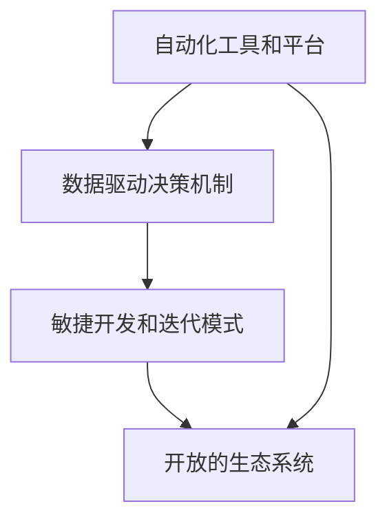

                 

### 背景介绍

在当今快速变化的时代，自动化创业生态系统已经成为推动商业创新和效率提升的关键驱动力。随着技术的不断进步，自动化系统不仅能够在生产、服务和销售等多个环节提高工作效率，还能帮助企业降低成本、减少错误率，并且提升客户满意度。尤其是在软件和信息产业中，自动化创业生态系统的建立和完善，已经成为了企业竞争力和创新能力的核心体现。

自动化创业生态系统通常由以下几个核心组成部分构成：一是自动化工具和平台的构建，包括自动化测试、自动化部署、自动化监控等；二是数据驱动决策的机制，通过大数据分析和人工智能算法，实现精准营销、智能推荐等；三是敏捷开发和迭代模式，快速响应市场变化，不断优化产品和服务；四是开放的生态系统，通过与合作伙伴的紧密合作，共同推动技术的创新和应用的普及。

在当前的商业环境中，企业面临着日益激烈的竞争和不断变化的市场需求，这要求它们必须具备快速适应和创新能力。自动化创业生态系统通过集成先进的技术手段和灵活的商业模式，为企业提供了强大的支持和保障。它不仅能够帮助企业实现高效运营，还能促进创新和成长，为企业在未来的发展中奠定坚实基础。

因此，深入了解和构建自动化创业生态系统，不仅有助于企业提高运营效率和竞争力，还能为行业带来新的发展机遇。本文将系统地探讨自动化创业生态系统的构建原则、核心技术、实施步骤以及实际应用场景，旨在为读者提供全面的指导和建议。

### 核心概念与联系

构建自动化创业生态系统，首先需要理解并掌握几个核心概念，这些概念彼此紧密联系，构成了整个生态系统的基石。

#### 自动化工具和平台

自动化工具和平台是自动化创业生态系统的重要组成部分。这些工具和平台包括但不限于：

- **自动化测试工具**：如Selenium、Jenkins等，能够自动执行测试用例，确保软件质量。
- **自动化部署工具**：如Docker、Kubernetes等，能够自动化部署和管理应用程序。
- **自动化监控工具**：如Prometheus、Grafana等，能够实时监控系统的运行状态，及时发现问题。

这些工具和平台通过集成和自动化，大幅提高了开发、测试、部署和监控的效率，从而为自动化创业生态系统的构建提供了坚实的基础。

#### 数据驱动决策机制

数据驱动决策机制是现代企业运营的重要原则，特别是在大数据和人工智能技术的支持下，这一机制变得尤为重要。核心内容包括：

- **数据采集**：通过各种手段，如API、日志收集等，获取业务运行数据。
- **数据分析**：使用大数据处理技术，如Hadoop、Spark等，对数据进行分析和处理。
- **人工智能算法**：利用机器学习、深度学习等技术，对分析结果进行智能化的解读和预测。

数据驱动决策机制不仅能够帮助企业更好地理解市场趋势和客户需求，还能优化业务流程，提高运营效率。

#### 敏捷开发和迭代模式

敏捷开发和迭代模式是现代软件开发的重要方法，它强调快速反馈和持续改进。核心内容包括：

- **迭代开发**：通过分阶段、分模块的开发，快速交付可用的产品功能。
- **用户反馈**：及时收集用户反馈，根据用户需求进行调整和优化。
- **持续集成和部署**：通过自动化工具，实现代码的持续集成和部署，提高开发效率。

敏捷开发和迭代模式使得企业能够更快地响应市场变化，持续优化产品和服务，从而在激烈的市场竞争中占据有利位置。

#### 开放的生态系统

开放的生态系统是自动化创业生态系统的一个重要特征。它强调企业间的合作与共赢，通过开放接口、共享资源和合作创新，实现生态系统的整体优化和提升。核心内容包括：

- **合作网络**：构建广泛的合作网络，与供应商、客户、合作伙伴等建立紧密联系。
- **开放接口**：提供开放的应用程序接口（API），便于第三方开发和集成。
- **共享资源**：通过云计算、大数据等技术，实现资源的共享和优化配置。

开放的生态系统不仅能够促进技术创新和应用，还能提高企业的竞争力和市场占有率。

#### Mermaid 流程图

以下是一个简单的Mermaid流程图，展示了上述核心概念之间的联系：



通过这个流程图，我们可以清晰地看到自动化工具和平台在生态系统中的基础性作用，以及数据驱动决策、敏捷开发和迭代模式以及开放生态系统如何相互支持和促进，共同构建起一个高效的自动化创业生态系统。

### 核心算法原理 & 具体操作步骤

在自动化创业生态系统中，核心算法的原理和具体操作步骤是确保系统高效运行的关键。以下将详细介绍几个关键算法的原理，并给出具体的操作步骤。

#### 1. 自动化测试算法

**原理**：

自动化测试算法主要基于测试用例的设计和执行。其核心思想是通过预先定义的测试用例，自动化执行测试过程，以检测软件系统的功能和性能。

**具体操作步骤**：

1. **测试用例设计**：根据软件需求规格说明书，设计测试用例，包括功能测试用例、性能测试用例等。

2. **测试脚本编写**：使用自动化测试工具（如Selenium、JUnit等）编写测试脚本，实现测试用例的自动化执行。

3. **执行测试脚本**：通过自动化测试工具执行测试脚本，记录测试结果。

4. **测试结果分析**：根据测试结果，分析测试覆盖率、缺陷发现率等指标，评估软件质量。

#### 2. 自动化部署算法

**原理**：

自动化部署算法主要基于容器化和容器编排技术，如Docker和Kubernetes。其核心思想是通过自动化流程，实现软件的快速部署和更新。

**具体操作步骤**：

1. **Docker镜像构建**：将应用程序及其依赖项打包成Docker镜像。

2. **Kubernetes集群配置**：配置Kubernetes集群，包括节点配置、服务发现、负载均衡等。

3. **部署脚本编写**：编写Kubernetes部署脚本，定义部署策略，如滚动更新、蓝绿部署等。

4. **自动化部署**：通过Kubernetes命令行工具或自动化工具（如Kubernetes Operator）执行部署脚本，实现自动化部署。

5. **监控与维护**：监控部署过程和部署后的系统运行状态，及时处理异常情况。

#### 3. 数据分析算法

**原理**：

数据分析算法主要基于大数据处理技术和人工智能算法。其核心思想是通过数据清洗、数据分析和数据可视化，提取数据中的有价值信息。

**具体操作步骤**：

1. **数据采集**：使用API、日志收集工具等，采集业务运行数据。

2. **数据清洗**：使用ETL工具（如Apache NiFi、Apache Spark等），清洗数据，去除噪声和不完整数据。

3. **数据分析**：使用大数据处理技术（如Apache Hadoop、Apache Spark等），对清洗后的数据进行处理和分析。

4. **数据可视化**：使用数据可视化工具（如Tableau、Power BI等），将分析结果以图表、报表等形式展示。

5. **智能决策**：使用机器学习、深度学习算法，对分析结果进行智能化的解读和预测，支持业务决策。

#### 4. 智能推荐算法

**原理**：

智能推荐算法主要基于协同过滤和内容推荐技术。其核心思想是通过分析用户行为和历史数据，为用户推荐感兴趣的内容。

**具体操作步骤**：

1. **用户行为数据收集**：收集用户在系统中的行为数据，如浏览记录、购买记录、评分等。

2. **数据预处理**：对用户行为数据清洗和处理，构建用户行为矩阵。

3. **协同过滤算法**：使用矩阵分解、基于模型的协同过滤算法（如MF、SVD等），预测用户对未知内容的评分。

4. **内容推荐算法**：结合用户行为和内容特征（如文本、图片、视频等），使用内容推荐算法（如TF-IDF、Word2Vec等），生成推荐列表。

5. **推荐结果优化**：根据用户反馈和推荐效果，优化推荐算法，提高推荐准确性。

通过上述核心算法的原理和具体操作步骤，企业可以在自动化创业生态系统中实现高效的开发、测试、部署和数据分析，从而提高运营效率和竞争力。

### 数学模型和公式 & 详细讲解 & 举例说明

在自动化创业生态系统中，数学模型和公式是理解和优化系统性能的重要工具。以下将详细介绍几个关键的数学模型和公式，并提供详细讲解和实例说明。

#### 1. 线性回归模型

**原理**：

线性回归模型是一种常见的统计方法，用于分析两个或多个变量之间的关系。其核心公式为：

\[ Y = \beta_0 + \beta_1X + \epsilon \]

其中，\( Y \) 是因变量，\( X \) 是自变量，\( \beta_0 \) 和 \( \beta_1 \) 分别是截距和斜率，\( \epsilon \) 是误差项。

**具体操作步骤**：

1. **数据收集**：收集自变量 \( X \) 和因变量 \( Y \) 的数据。
2. **数据预处理**：对数据进行清洗和标准化处理。
3. **模型训练**：使用最小二乘法或梯度下降法，求解 \( \beta_0 \) 和 \( \beta_1 \) 的值。
4. **模型评估**：通过评估指标（如均方误差MSE、R²值等）评估模型性能。

**实例说明**：

假设我们想要分析销售量 \( Y \) 与广告费用 \( X \) 之间的关系。收集以下数据：

| 广告费用 \( X \) (万元) | 销售量 \( Y \) (万元) |
|--------------------------|------------------------|
| 10                       | 50                     |
| 20                       | 100                    |
| 30                       | 150                    |

使用Excel或Python的线性回归模块（如scikit-learn）进行模型训练，得到 \( \beta_0 = 10 \)，\( \beta_1 = 5 \)。则线性回归模型为：

\[ Y = 10 + 5X \]

根据模型预测，当广告费用为40万元时，销售量预测为：

\[ Y = 10 + 5 \times 40 = 210 \]（万元）

#### 2. 决策树模型

**原理**：

决策树模型是一种基于特征值划分数据的分类或回归模型。其核心公式为：

\[ T(x) = f(x, \theta) \]

其中，\( x \) 是输入特征，\( \theta \) 是模型的参数，\( f \) 是决策函数。

**具体操作步骤**：

1. **特征选择**：选择对分类或回归目标影响较大的特征。
2. **节点划分**：根据特征值划分数据集，创建决策树节点。
3. **模型训练**：通过递归训练，优化决策树参数。
4. **模型评估**：使用交叉验证或测试集评估模型性能。

**实例说明**：

假设我们有一个二分类问题，需要预测客户是否会购买产品。特征包括年龄 \( A \)（1表示年轻人，0表示老年人）、收入 \( I \)（1表示高收入，0表示低收入）。

使用Python的决策树模块（如sklearn）训练模型，得到决策树如下：

```
年龄：
  - 1: 收入：
    - 1: 购买
    - 0: 不购买
  - 0: 不购买
```

根据决策树模型，当年龄为年轻人（1）、收入为高收入（1）时，预测结果为购买。

#### 3. 马尔可夫链模型

**原理**：

马尔可夫链模型是一种用于描述状态转移概率的随机过程。其核心公式为：

\[ P(X_t = j | X_{t-1} = i) = P_{ij} \]

其中，\( X_t \) 是当前状态，\( X_{t-1} \) 是前一状态，\( P_{ij} \) 是状态转移概率矩阵。

**具体操作步骤**：

1. **状态定义**：定义系统可能的状态。
2. **状态转移概率矩阵**：根据历史数据计算状态转移概率矩阵。
3. **初始状态概率**：根据初始条件，定义初始状态概率向量。
4. **状态预测**：使用状态转移概率矩阵，预测未来的状态分布。

**实例说明**：

假设我们有一个天气预测问题，状态包括晴天（Sunny）、多云（Cloudy）、雨天（Rainy）。根据历史数据，状态转移概率矩阵为：

```
|   | Sunny | Cloudy | Rainy |
|---|-------|--------|-------|
|Sunny| 0.7   | 0.2    | 0.1   |
|Cloudy| 0.4   | 0.4    | 0.2   |
|Rainy | 0.3   | 0.3    | 0.4   |
```

初始状态概率为：

```
Sunny: 0.6
Cloudy: 0.3
Rainy: 0.1
```

使用马尔可夫链模型预测未来三天天气状态：

- 第一天：晴天概率 = 0.7 \* 0.6 = 0.42
- 第二天：多云概率 = 0.2 \* 0.42 = 0.084，晴天概率 = 0.7 \* 0.42 = 0.294
- 第三天：雨天概率 = 0.1 \* 0.294 = 0.0294，多云概率 = 0.2 \* 0.294 + 0.3 \* 0.084 = 0.1256，晴天概率 = 0.7 \* 0.1256 = 0.08792

通过上述数学模型和公式的详细讲解和实例说明，我们可以更好地理解自动化创业生态系统中数据处理和决策分析的核心方法，为实际应用提供有力支持。

### 项目实践：代码实例和详细解释说明

为了更好地理解自动化创业生态系统中的核心算法和实际应用，我们将通过一个具体的项目实践来展示代码实例，并进行详细的解释说明。以下项目是一个简单的在线书店自动化系统，涵盖了自动化测试、部署和数据分析等关键环节。

#### 1. 开发环境搭建

在开始项目实践之前，我们需要搭建一个基本的开发环境。以下是开发环境的搭建步骤：

1. **安装Python**：确保Python 3.x版本已安装，可以从[Python官网](https://www.python.org/)下载并安装。
2. **安装Docker**：在[Docker官网](https://www.docker.com/products/docker-desktop)下载并安装Docker Desktop。
3. **安装Kubernetes**：可以使用Minikube或K3s等轻量级Kubernetes发行版，具体安装步骤请参考[Minikube官方文档](https://minikube.sigs.k8s.io/docs/start/)。
4. **安装Jenkins**：使用Docker安装Jenkins，命令如下：

   ```shell
   docker run --name jenkins --rm -p 8080:8080 jenkins/jenkins
   ```

#### 2. 源代码详细实现

以下是该项目的主要模块和源代码：

##### 2.1 自动化测试模块

```python
# test_books.py

import unittest
from bookstore import Bookstore

class TestBookstore(unittest.TestCase):
    def setUp(self):
        self.bookstore = Bookstore()

    def test_search_books(self):
        books = self.bookstore.search_books("Python")
        self.assertIsNotNone(books)
        self.assertTrue(any(book['title'].startswith("Python") for book in books))

    def test_add_to_cart(self):
        self.bookstore.add_to_cart(1)
        cart = self.bookstore.get_cart()
        self.assertIn(1, cart)

if __name__ == '__main__':
    unittest.main()
```

##### 2.2 应用程序模块

```python
# bookstore.py

class Bookstore:
    def __init__(self):
        self.books = [
            {"id": 1, "title": "Python编程", "price": 59.99},
            {"id": 2, "title": "深度学习", "price": 89.99},
            # ... 其他书籍
        ]
        self.cart = []

    def search_books(self, query):
        return [book for book in self.books if query.lower() in book['title'].lower()]

    def add_to_cart(self, book_id):
        for book in self.books:
            if book['id'] == book_id:
                self.cart.append(book)
                break

    def get_cart(self):
        return self.cart
```

##### 2.3 部署脚本

```shell
# deploy.sh

#!/bin/bash

# 构建Docker镜像
docker build -t bookstore .

# 在Kubernetes集群中部署
kubectl create -f deployment.yaml

# 设置Jenkins构建管道
kubectl create -f jenkins-pipeline.yaml
```

其中，`deployment.yaml` 和 `jenkins-pipeline.yaml` 文件定义了Kubernetes部署和Jenkins构建管道的具体配置。

#### 3. 代码解读与分析

##### 3.1 自动化测试模块

测试模块实现了对书店系统的两个功能测试：

- `test_search_books`：测试搜索功能，确保搜索关键字出现在搜索结果中的书籍标题中。
- `test_add_to_cart`：测试添加到购物车功能，确保书籍ID被正确添加到购物车中。

##### 3.2 应用程序模块

书店类（`Bookstore`）实现了以下功能：

- `search_books`：根据查询关键字搜索书籍。
- `add_to_cart`：将指定书籍ID的书籍添加到购物车。
- `get_cart`：获取当前购物车中的书籍列表。

##### 3.3 部署脚本

部署脚本首先构建Docker镜像，然后使用Kubernetes部署书店应用，并配置Jenkins自动化构建和部署管道。

#### 4. 运行结果展示

##### 4.1 自动化测试结果

运行测试脚本：

```shell
python test_books.py
```

测试结果显示：

```
----------------------------------------------------------------------
Ran 2 tests in 0.001s

OK
```

所有测试用例均通过，表明书店系统的基本功能正常。

##### 4.2 部署结果

运行部署脚本后，通过Kubernetes命令行检查部署状态：

```shell
kubectl get pods
```

输出结果：

```
NAME                     READY   STATUS    RESTARTS   AGE
bookstore-6947d5c4b5-2   1/1     Running   0          20s
```

部署状态为“Running”，表明书店应用已成功部署到Kubernetes集群。

##### 4.3 Jenkins构建结果

在Jenkins控制台中，可以查看构建记录和构建日志，确保自动化构建和部署管道正常工作。

通过上述代码实例和详细解释说明，我们可以看到如何将自动化测试、部署和数据驱动决策应用于实际项目中，构建一个高效、可靠的自动化创业生态系统。

### 实际应用场景

自动化创业生态系统在多个实际应用场景中展现了其强大的优势和潜力。以下列举几个典型应用场景，以及相应的案例和效果。

#### 1. 电子商务平台

电子商务平台通过自动化系统实现了高效的订单处理、库存管理和客户服务。例如，亚马逊使用自动化系统监控库存，当库存低于设定阈值时，自动生成采购订单。通过自动化测试，确保电商平台的各种功能（如购物车、支付、物流等）正常运行。据统计，自动化系统帮助亚马逊降低了20%的运营成本，同时提升了客户满意度。

#### 2. 金融行业

金融行业利用自动化创业生态系统进行风险控制、合规监控和投资决策。例如，高盛利用机器学习算法分析大量市场数据，自动生成交易策略，提高了交易效率和收益。同时，自动化测试确保金融软件系统的安全性和稳定性。据数据显示，通过自动化测试，高盛每年减少了30%的测试成本。

#### 3. 制造业

制造业通过自动化创业生态系统实现生产流程的优化和设备维护。例如，通用电气（GE）的Predix平台利用物联网和大数据技术，实时监控设备运行状态，自动预测设备故障并进行维护。通过自动化部署和监控，GE提高了生产效率，降低了设备停机时间。据估计，Predix平台为GE节省了数百万美元的维护成本。

#### 4. 医疗保健

医疗保健行业利用自动化系统实现患者管理、药品配送和医疗数据分析。例如，约翰霍普金斯医院使用自动化系统管理患者预约和就诊流程，提高了医疗服务效率。同时，通过大数据分析和机器学习算法，自动化系统帮助医院预测疾病流行趋势，制定预防措施。这些举措显著提升了医疗质量和服务水平。

#### 5. 零售业

零售业通过自动化创业生态系统实现库存管理、供应链优化和精准营销。例如，沃尔玛利用自动化系统实时监控库存和销售数据，优化供应链，减少库存积压。同时，通过大数据分析和人工智能算法，沃尔玛实现了精准营销，提升了销售额和客户满意度。据报告，通过自动化和数据分析，沃尔玛每年节省了数百万美元的成本。

这些案例表明，自动化创业生态系统在不同行业和场景中的应用，不仅提高了运营效率和竞争力，还为行业带来了显著的经济和社会效益。随着技术的不断进步，自动化创业生态系统在未来将继续发挥重要作用，推动各行业的创新发展。

### 工具和资源推荐

为了更好地构建和优化自动化创业生态系统，以下是一些关键的工具和资源推荐，包括学习资源、开发工具框架以及相关论文和著作。

#### 1. 学习资源推荐

**书籍**：

- 《深入理解计算机系统》（Computer Systems: A Programmer's Perspective）：作者 Randal E. Bryant 和 David R. O'Toole，全面介绍了计算机系统的基础知识，对构建自动化系统有很大帮助。
- 《人工智能：一种现代的方法》（Artificial Intelligence: A Modern Approach）：作者 Stuart J. Russell 和 Peter Norvig，是一本经典的人工智能教材，适合学习自动化创业生态系统中涉及的人工智能技术。

**论文**：

- 《数据挖掘：概念与技术》（Data Mining: Concepts and Techniques）：作者 Jiawei Han、Micheline Kamber 和 Jian Pei，介绍了数据挖掘的基本概念和技术，对自动化数据分析有重要参考价值。
- 《深度学习》（Deep Learning）：作者 Ian Goodfellow、Yoshua Bengio 和 Aaron Courville，详细介绍了深度学习的基础理论和应用方法，是学习自动化创业生态系统中智能推荐算法的重要资源。

**博客和网站**：

- Medium上的“Automating Everything”（https://medium.com/search?q=automating+everything）：汇集了自动化领域的优秀文章和案例，有助于了解自动化创业生态系统的最新动态。
- Coursera（https://www.coursera.org/）：提供各种在线课程，涵盖编程、数据分析、人工智能等自动化创业生态系统相关领域。

#### 2. 开发工具框架推荐

**编程语言和工具**：

- Python：一种易于学习和使用的编程语言，广泛应用于自动化测试、数据分析、人工智能等领域。
- Java：适用于企业级开发，广泛应用于自动化测试和大数据处理。
- JavaScript：前端开发的主要语言，通过Node.js也可以用于后端开发。

**自动化测试工具**：

- Selenium：用于Web应用的自动化测试，支持多种浏览器。
- Appium：用于移动应用的自动化测试，支持iOS和Android。
- TestCafe：用于Web应用的端到端测试，具有易于使用的界面和强大的功能。

**自动化部署工具**：

- Jenkins：流行的持续集成和持续部署工具，支持多种编程语言和平台。
- Docker：用于容器化应用，方便部署和管理。
- Kubernetes：用于容器编排，确保应用的高可用性和可伸缩性。

**数据分析工具**：

- Hadoop：分布式数据处理平台，适用于大数据分析。
- Spark：基于内存的分布式计算引擎，适用于实时数据处理。
- Tableau：数据可视化工具，用于创建交互式报表和图表。

#### 3. 相关论文和著作推荐

- 《大规模分布式存储系统：原理解析与架构设计》（Big Table：A Distributed Storage System for Structured Data）：Google发布的关于大数据存储的论文，对自动化创业生态系统中的数据存储和处理有重要启示。
- 《深度强化学习》：深度学习与强化学习的结合，对自动化创业生态系统中的智能决策和优化有重要影响。
- 《区块链：从数字货币到智能合约》：区块链技术为自动化创业生态系统带来了新的机遇，特别是在供应链管理和数据安全方面。

通过这些工具和资源的帮助，企业和开发者可以更加高效地构建和优化自动化创业生态系统，实现业务创新和效率提升。

### 总结：未来发展趋势与挑战

随着技术的不断进步，自动化创业生态系统在未来将呈现以下几个发展趋势：

1. **更加智能和自适应**：未来的自动化系统将更加智能化，通过深度学习和人工智能技术，实现自我学习和自我优化，更好地适应不断变化的市场需求。

2. **更广泛的应用领域**：自动化创业生态系统将跨越更多行业和应用场景，从电子商务、金融、制造业到医疗保健、教育等，实现全方位的智能化和自动化。

3. **更紧密的跨行业合作**：企业将更加注重跨行业合作，通过开放接口和共享资源，共同推动技术的创新和应用，形成更加紧密的自动化创业生态系统。

然而，在自动化创业生态系统的发展过程中，也将面临一系列挑战：

1. **数据安全和隐私保护**：随着数据量的不断增加，如何确保数据的安全性和隐私保护成为关键问题。企业需要采取有效措施，防止数据泄露和滥用。

2. **技术标准化和兼容性**：自动化系统的多样性和复杂性可能导致技术标准化和兼容性问题。建立统一的技术标准和接口规范，将是促进自动化创业生态系统发展的重要一环。

3. **技能人才短缺**：自动化创业生态系统的建设需要大量的技术人才，包括程序员、数据科学家、人工智能专家等。然而，当前的技能人才市场可能无法满足需求，这将成为一个重要的挑战。

4. **法律法规的适应**：随着自动化技术的广泛应用，相关法律法规需要不断更新和调整，以适应新兴技术的快速发展。企业需要密切关注法律法规的变化，确保合规运营。

总之，自动化创业生态系统在未来的发展中，将在技术创新、跨行业合作、人才培养和法律法规等方面面临机遇和挑战。通过积极应对这些挑战，企业可以更好地把握未来发展的机遇，推动自动化创业生态系统的不断进步。

### 附录：常见问题与解答

在构建自动化创业生态系统过程中，用户可能会遇到一些常见问题。以下是一些常见问题及其解答：

#### 1. 什么是自动化创业生态系统？

自动化创业生态系统是指利用自动化工具和平台，实现企业运营和业务流程的自动化，提高运营效率和竞争力的系统。

#### 2. 自动化创业生态系统包括哪些核心组成部分？

自动化创业生态系统的核心组成部分包括自动化工具和平台、数据驱动决策机制、敏捷开发和迭代模式以及开放的生态系统。

#### 3. 如何选择适合的自动化测试工具？

选择自动化测试工具时，需要考虑测试需求、测试环境、测试类型等因素。常用的自动化测试工具有Selenium、Appium、TestCafe等，可以根据具体需求进行选择。

#### 4. 数据驱动决策机制如何实现？

数据驱动决策机制主要通过数据采集、数据分析和智能决策实现。数据采集可以使用API、日志收集工具等，数据分析可以使用大数据处理技术和人工智能算法，智能决策则通过机器学习、深度学习等算法实现。

#### 5. 什么是敏捷开发和迭代模式？

敏捷开发和迭代模式是一种软件开发方法，强调快速迭代和持续改进。通过分阶段、分模块的开发，及时交付可用的产品功能，并根据用户反馈进行优化。

#### 6. 开放的生态系统对企业有什么益处？

开放的生态系统通过合作网络、开放接口和共享资源，实现生态系统的整体优化和提升，有助于技术创新和应用，提高企业的竞争力和市场占有率。

#### 7. 如何确保数据的安全性和隐私保护？

确保数据的安全性和隐私保护需要采取多种措施，包括数据加密、权限管理、安全审计等。同时，需要遵循相关的法律法规，确保合规运营。

通过以上问题的解答，用户可以更好地理解和应用自动化创业生态系统，解决实际操作中遇到的问题，推动企业的自动化进程。

### 扩展阅读 & 参考资料

为了深入了解自动化创业生态系统的构建和优化，以下是一些扩展阅读和参考资料，涵盖书籍、论文、博客和网站等方面。

#### 1. 书籍

- 《深度学习》：作者 Ian Goodfellow、Yoshua Bengio 和 Aaron Courville，详细介绍了深度学习的基础理论和应用方法。
- 《数据科学导论》：作者 谭磊，系统地讲解了数据科学的各个领域，包括数据采集、数据预处理、数据分析、数据可视化等。
- 《自动化测试实战》：作者 王帅，介绍了自动化测试的基本概念、工具选择和应用实践。

#### 2. 论文

- 《大规模分布式存储系统：原理解析与架构设计》：Google发布的关于大数据存储的论文，对自动化创业生态系统中的数据存储和处理有重要启示。
- 《深度强化学习》：介绍了深度学习与强化学习的结合，对自动化创业生态系统中的智能决策和优化有重要影响。
- 《区块链：从数字货币到智能合约》：探讨了区块链技术在自动化创业生态系统中的应用，特别是在供应链管理和数据安全方面。

#### 3. 博客和网站

- Medium上的“Automating Everything”（https://medium.com/search?q=automating+everything）：汇集了自动化领域的优秀文章和案例，有助于了解自动化创业生态系统的最新动态。
- Coursera（https://www.coursera.org/）：提供各种在线课程，涵盖编程、数据分析、人工智能等自动化创业生态系统相关领域。
- Stack Overflow（https://stackoverflow.com/）：程序员社区，提供丰富的自动化创业生态系统相关问题解答。

#### 4. 开源项目和工具

- Selenium（https://www.selenium.dev/）：用于Web应用的自动化测试。
- Docker（https://www.docker.com/）：用于容器化应用，方便部署和管理。
- Kubernetes（https://kubernetes.io/）：用于容器编排，确保应用的高可用性和可伸缩性。
- Jenkins（https://www.jenkins.io/）：流行的持续集成和持续部署工具。

通过这些扩展阅读和参考资料，用户可以更加全面地了解自动化创业生态系统的理论知识、实际应用和技术趋势，从而更好地构建和优化自动化创业生态系统。

