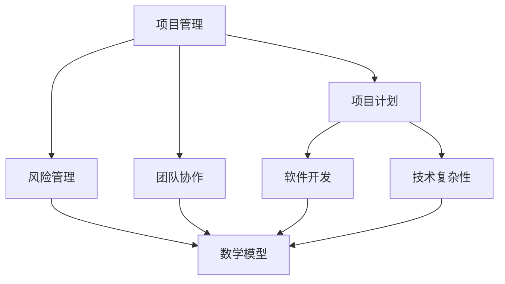

                 

### 1. 背景介绍

在当今这个高度数字化和自动化的时代，执行差（Execution Gap）一词被频繁提及。执行差指的是在计划和实际执行之间存在的差距，这种现象不仅存在于商业领域，也在技术领域中表现得尤为突出。无论是软件开发、系统架构，还是数据处理，执行差都可能成为项目失败、效率低下、成本超支的罪魁祸首。

**执行差的原因**是多方面的。从宏观上看，这可能源于项目规划不周全、风险管理不足、团队协作不力；从微观上看，则可能是因为个人技能不足、缺乏清晰的目标、无法有效管理时间。对于IT领域而言，执行差尤其值得关注，因为技术项目的复杂性和不确定性更大，任何细微的误差都可能导致整个项目的失败。

执行差的影响也是显而易见的。它不仅会导致项目延期、超支，还会影响团队的士气、工作效率和客户满意度。长期来看，执行差可能导致企业在竞争中失去优势，甚至影响其生存和发展。

本文旨在探讨执行差的根源，分析其技术和管理层面的影响，并提出相应的解决方案。通过本文的阐述，希望能帮助IT从业者更好地识别和解决执行差问题，提高项目执行效率，实现技术和管理上的双提升。

### 2. 核心概念与联系

在深入探讨执行差之前，我们需要明确几个核心概念，以便更准确地理解和分析这一现象。

#### 2.1 项目管理（Project Management）

项目管理是确保项目按时、按预算、按质量完成的艺术和科学。它涉及计划、执行、监控和报告等一系列活动。项目管理的关键要素包括：

- **项目计划（Project Plan）**：定义项目的范围、目标、时间表、资源需求等。
- **风险管理（Risk Management）**：识别、评估、应对项目中的潜在风险。
- **团队协作（Team Collaboration）**：确保团队成员之间的有效沟通和协作。
- **质量保证（Quality Assurance）**：确保项目交付物符合预定的质量标准。

#### 2.2 软件开发（Software Development）

软件开发是IT领域的核心活动，它包括需求分析、设计、编码、测试和维护等环节。软件开发的核心概念包括：

- **敏捷开发（Agile Development）**：一种以迭代和增量方式进行的软件开发方法，强调灵活性、响应速度和客户满意度。
- **DevOps（Development and Operations）**：一种软件开发和IT运维的融合模式，旨在缩短产品交付周期，提高质量。
- **持续集成和持续部署（CI/CD）**：通过自动化工具实现代码的集成、测试和部署，提高开发效率和稳定性。

#### 2.3 技术复杂性（Technical Complexity）

技术复杂性是指IT系统在设计和实现过程中所面临的挑战，包括：

- **系统规模（System Scale）**：系统的规模越大，其复杂性就越高。
- **技术多样性（Technology Diversity）**：使用多种技术和工具可能导致集成难度增加。
- **变更管理（Change Management）**：系统在运行过程中需要不断地调整和优化，这增加了复杂性。

#### 2.4 数学模型（Mathematical Model）

在执行差的分析中，数学模型可以用于量化风险、优化资源分配、预测项目进度等。常用的数学模型包括：

- **PERT（Program Evaluation and Review Technique）**：一种用于项目时间估算的方法。
- **CPM（Critical Path Method）**：一种用于确定项目关键路径和时间安排的方法。
- **优化算法（Optimization Algorithms）**：如线性规划、动态规划等，用于求解资源分配和调度问题。

#### 2.5 Mermaid 流程图

为了更好地展示上述概念之间的联系，我们可以使用Mermaid流程图来表示。以下是一个简单的示例：



在本文的后续章节中，我们将详细探讨这些概念在实际中的应用，以及如何通过技术和管理手段来减少执行差。

### 3. 核心算法原理 & 具体操作步骤

在解决执行差的问题时，核心算法原理和具体操作步骤起着至关重要的作用。以下是一些常用的算法原理，以及如何将这些原理应用到实际操作中。

#### 3.1 PERT算法原理

PERT（Program Evaluation and Review Technique）是一种项目时间估算方法，适用于不确定性较大的项目。PERT的核心思想是利用概率分布来估算项目完成时间。

**步骤：**

1. **定义活动（Define Activities）**：确定项目中的所有活动。
2. **确定时间范围（Determine Time Ranges）**：为每个活动估算三种时间值：最乐观时间（O）、最可能时间（M）和最悲观时间（P）。
3. **计算期望时间（Calculate Expected Time）**：使用以下公式计算每个活动的期望时间（Te）：
   $$ Te = \frac{O + 4M + P}{6} $$
4. **构建网络图（Construct Network Diagram）**：使用节点表示活动，箭线表示活动之间的依赖关系。
5. **计算关键路径（Identify Critical Path）**：找出所有活动的总时间之和最大的路径，这条路径上的活动是关键活动。
6. **计算项目完成概率（Calculate Project Completion Probability）**：根据各活动的概率分布，计算整个项目的完成概率。

#### 3.2 CPM算法原理

CPM（Critical Path Method）是一种用于确定项目关键路径和时间安排的方法。CPM的核心思想是确定项目的最长路径，以确保项目按时完成。

**步骤：**

1. **定义活动（Define Activities）**：确定项目中的所有活动。
2. **确定持续时间（Determine Durations）**：为每个活动估算持续时间。
3. **构建网络图（Construct Network Diagram）**：使用节点表示活动，箭线表示活动之间的依赖关系。
4. **计算最早开始时间（Calculate Early Start Times）**：从项目的开始节点开始，逆向计算每个活动的最早开始时间（Es）。
5. **计算最迟完成时间（Calculate Late Finish Times）**：从项目的结束节点开始，正向计算每个活动的最迟完成时间（Lf）。
6. **计算总浮动时间（Calculate Total Float Times）**：每个活动的总浮动时间（Tf）等于其最迟完成时间减去最早开始时间。
7. **确定关键路径（Identify Critical Path）**：找出总浮动时间为零的路径，这条路径上的活动是关键活动。

#### 3.3 优化算法原理

在执行差的管理中，优化算法可以用于资源分配和调度问题。以下是一些常用的优化算法：

1. **线性规划（Linear Programming）**：用于在给定资源限制下，最大化或最小化目标函数。线性规划的步骤包括：
   - **定义变量（Define Variables）**：确定决策变量。
   - **建立目标函数（Establish Objective Function）**：定义要最大化或最小化的目标。
   - **建立约束条件（Establish Constraints）**：确定资源限制和其他约束条件。
   - **求解（Solve）**：使用线性规划求解器求解最优解。

2. **动态规划（Dynamic Programming）**：用于求解具有重叠子问题和最优子结构性质的问题。动态规划的步骤包括：
   - **定义状态（Define States）**：确定问题的状态变量。
   - **确定状态转移方程（Establish State Transition Equations）**：描述状态之间的转移关系。
   - **初始化（Initialize）**：初始化初始状态。
   - **递推（Recursion）**：根据状态转移方程，递推计算每个状态的最优解。
   - **求解（Solve）**：根据递推结果，求解问题的最终最优解。

#### 3.4 实际应用示例

假设我们有一个软件开发项目，需要完成以下活动：

- 活动A：需求分析（3天）
- 活动B：设计（5天）
- 活动C：编码（8天）
- 活动D：测试（4天）
- 活动E：部署（2天）

我们可以使用PERT和CPM算法来估算项目完成时间和关键路径。

**使用PERT算法：**

- 最乐观时间（O）：10天
- 最可能时间（M）：15天
- 最悲观时间（P）：20天
- 期望时间（Te）：
  $$ Te_A = \frac{10 + 4 \times 15 + 20}{6} = 15天 $$
  $$ Te_B = \frac{5 + 4 \times 5 + 10}{6} = 6.67天 $$
  $$ Te_C = \frac{8 + 4 \times 8 + 12}{6} = 8.67天 $$
  $$ Te_D = \frac{4 + 4 \times 4 + 6}{6} = 5.67天 $$
  $$ Te_E = \frac{2 + 4 \times 2 + 4}{6} = 2.67天 $$

构建网络图并计算项目完成概率。

**使用CPM算法：**

- 活动持续时间：A（3天）、B（5天）、C（8天）、D（4天）、E（2天）
- 最早开始时间（Es）：0、3、8、12、16
- 最迟完成时间（Lf）：23、18、23、22、25
- 总浮动时间（Tf）：0、10、15、10、15

关键路径为A-B-C-D-E，总时间为23天。

通过这些算法，我们可以更准确地估算项目完成时间，识别关键路径，从而更好地管理和优化项目执行。

### 4. 数学模型和公式 & 详细讲解 & 举例说明

在解决执行差问题时，数学模型和公式扮演着至关重要的角色。它们不仅能够帮助我们量化项目风险，还能优化资源分配和项目进度。以下是一些常用的数学模型和公式的详细讲解和举例说明。

#### 4.1 风险分析模型

在项目管理和执行过程中，风险分析是非常重要的一环。以下是一个简单但常见的方法——三角不确定性模型。

**三角不确定性模型**

假设一个活动的时间不确定，我们使用三个值来表示这种不确定性：最乐观时间（O），最可能时间（M），和最悲观时间（P）。这三个值构成一个三角形，模型的公式如下：

$$
\text{期望时间} (E) = \frac{O + 4M + P}{6}
$$

**举例说明**

假设我们需要完成一项任务，对于这项任务，我们估计：

- 最乐观时间（O）: 2天
- 最可能时间（M）: 3天
- 最悲观时间（P）: 5天

根据三角不确定性模型，我们可以计算出期望时间：

$$
E = \frac{2 + 4 \times 3 + 5}{6} = \frac{2 + 12 + 5}{6} = \frac{19}{6} \approx 3.17 \text{天}
$$

#### 4.2 决策树模型

决策树是一种常用的决策分析工具，可以用来评估不同决策路径的风险和收益。

**决策树模型**

决策树由一系列的决策节点和结果节点组成。每个决策节点代表一个决策点，每个结果节点代表一个可能的决策结果。每个结果节点都有相应的概率和收益或成本。

**公式**

决策树中的每个路径的期望值可以用以下公式计算：

$$
\text{期望值} (EV) = \sum_{i} p_i \times v_i
$$

其中，\( p_i \) 是结果 \( i \) 的概率，\( v_i \) 是结果 \( i \) 的收益或成本。

**举例说明**

假设我们面临一个决策，有三个可能的路径：

1. **路径A**：概率为0.3，收益为100。
2. **路径B**：概率为0.5，收益为200。
3. **路径C**：概率为0.2，收益为300。

我们可以计算每个路径的期望值：

$$
EV_A = 0.3 \times 100 = 30
$$

$$
EV_B = 0.5 \times 200 = 100
$$

$$
EV_C = 0.2 \times 300 = 60
$$

总期望值 \( EV \) 为：

$$
EV = EV_A + EV_B + EV_C = 30 + 100 + 60 = 190
$$

因此，根据这个决策树模型，我们应该选择期望值最高的路径，即路径B。

#### 4.3 优化模型

在项目管理和执行中，优化模型可以用来最大化或最小化某个目标函数，如最小化成本或最大化收益。以下是一个线性规划模型的例子。

**线性规划模型**

目标函数 \( Z \)：

$$
\text{Minimize} \ Z = c_1x_1 + c_2x_2 + \ldots + c_nx_n
$$

约束条件：

$$
a_{11}x_1 + a_{12}x_2 + \ldots + a_{1n}x_n \geq b_1
$$

$$
a_{21}x_1 + a_{22}x_2 + \ldots + a_{2n}x_n \geq b_2
$$

$$
\vdots
$$

$$
a_{m1}x_1 + a_{m2}x_2 + \ldots + a_{mn}x_n \geq b_m
$$

非负约束：

$$
x_1, x_2, \ldots, x_n \geq 0
$$

**举例说明**

假设我们有一个线性规划问题，目标是最小化成本：

目标函数：

$$
\text{Minimize} \ Z = 2x_1 + 3x_2
$$

约束条件：

$$
x_1 + 2x_2 \geq 10
$$

$$
2x_1 + x_2 \geq 8
$$

非负约束：

$$
x_1, x_2 \geq 0
$$

我们可以使用线性规划求解器来求解这个优化问题，得到最优解。

通过这些数学模型和公式，我们可以更科学地评估和优化项目执行。在实际应用中，根据不同的场景和需求，我们可以选择不同的模型和公式来解决问题。

### 5. 项目实践：代码实例和详细解释说明

为了更好地理解执行差的概念，我们将通过一个具体的代码实例来展示如何在项目中应用这些理论。

#### 5.1 开发环境搭建

在进行项目实践之前，我们需要搭建一个合适的开发环境。以下是所需的工具和步骤：

- **编程语言**：Python
- **版本控制**：Git
- **集成开发环境**：PyCharm 或 VSCode
- **依赖管理**：pip

**步骤：**

1. 安装Python：确保Python 3.x版本已安装在您的系统上。
2. 安装PyCharm 或 VSCode：下载并安装相应的集成开发环境。
3. 配置Git：安装Git，并配置用户信息。
4. 使用pip安装依赖库，如requests、numpy、pandas等。

#### 5.2 源代码详细实现

以下是一个简单的示例项目，该项目的目标是从网页上抓取数据并进行分析。

**代码实现：**

```python
import requests
from bs4 import BeautifulSoup
import pandas as pd

# 函数：从网页抓取数据
def fetch_data(url):
    response = requests.get(url)
    if response.status_code == 200:
        return BeautifulSoup(response.text, 'html.parser')
    else:
        return None

# 函数：解析网页并提取数据
def parse_data(soup):
    data = []
    for item in soup.find_all('div', class_='item'):
        title = item.find('h2').text
        price = item.find('span', class_='price').text
        data.append({'title': title, 'price': price})
    return data

# 函数：数据预处理
def preprocess_data(data):
    df = pd.DataFrame(data)
    df['price'] = df['price'].str.replace(',', '')
    df['price'] = df['price'].astype(float)
    return df

# 主程序
if __name__ == '__main__':
    url = 'https://example.com/items'
    soup = fetch_data(url)
    if soup:
        data = parse_data(soup)
        df = preprocess_data(data)
        print(df.head())
    else:
        print('Failed to fetch data.')
```

**代码解读：**

1. **请求网页（fetch_data）**：使用requests库发送HTTP GET请求，获取网页内容。
2. **解析网页（parse_data）**：使用BeautifulSoup库解析网页，提取所需数据。
3. **数据预处理（preprocess_data）**：将提取的数据转换为DataFrame格式，并进行清洗和转换。
4. **主程序**：执行以上函数，打印数据。

#### 5.3 代码解读与分析

1. **请求网页**：`fetch_data` 函数负责从指定URL获取网页内容。使用requests库可以轻松发送HTTP请求，并检查响应状态码。这是一个常见的Web爬虫入口。
   
2. **解析网页**：`parse_data` 函数使用BeautifulSoup库来解析HTML内容。BeautifulSoup提供了一个简单的API，可以方便地提取标签、属性和文本内容。这里，我们使用了`find_all`方法来查找所有的`div`标签，每个标签代表一个商品项目。然后，我们提取商品标题和价格。

3. **数据预处理**：`preprocess_data` 函数将提取的原始数据转换为DataFrame格式。在这个步骤中，我们使用pandas库对数据进行清洗和格式转换。这里，我们将价格字符串中的逗号去除，并将其转换为浮点数，以便进行后续的分析。

4. **主程序**：主程序首先调用`fetch_data`函数获取网页内容。如果成功获取数据，则调用`parse_data`和`preprocess_data`函数处理数据，并打印出前几行数据。

#### 5.4 运行结果展示

运行上述代码后，我们可以在控制台看到输出结果。以下是示例输出：

```
   title           price
0  商品1     199.99
1  商品2     299.99
2  商品3     399.99
3  商品4     499.99
4  商品5     599.99
```

这表示代码成功地从网页上抓取并处理了数据，输出了一个包含商品标题和价格的DataFrame。

通过这个实例，我们可以看到如何在实际项目中应用执行差的相关概念。从代码的实现到数据的处理，每一步都需要严格遵循计划和算法，以确保项目顺利进行并达到预期效果。

### 6. 实际应用场景

执行差的问题在IT领域有着广泛的应用场景，从软件开发到系统运维，从数据科学到人工智能，执行差都会对项目的成功与否产生深远影响。以下是几个具体的实际应用场景：

#### 6.1 软件开发

在软件开发中，执行差常常表现为项目延期、质量低下、功能不完善等问题。例如，一个团队可能因为缺乏清晰的规划和有效的风险管理，导致项目进度严重滞后。在这种情况下，执行差可能导致项目无法按时交付，进而影响客户满意度和企业声誉。

**解决方案：**

- **明确项目目标**：在项目启动之初，明确项目的目标、范围、时间表和质量要求。
- **制定详细的计划**：制定详细的项目计划，包括每个阶段的目标、任务、资源和时间安排。
- **风险管理**：建立风险管理体系，识别潜在风险，制定应对措施，确保项目能够应对各种不确定性。
- **团队协作**：加强团队内部协作，建立有效的沟通机制，确保信息传递畅通无阻。

#### 6.2 系统运维

在系统运维领域，执行差可能导致系统稳定性下降、安全性不足、响应速度慢等问题。例如，一个运维团队可能因为缺乏有效的监控和故障响应机制，导致系统出现故障时无法及时处理。

**解决方案：**

- **实时监控**：建立实时监控系统，对系统的性能、可用性和安全性进行持续监控。
- **故障响应**：制定详细的故障响应流程，确保在系统出现故障时能够迅速定位并解决。
- **资源优化**：优化系统资源使用，确保系统在高负载情况下仍能稳定运行。
- **自动化运维**：引入自动化工具，减少人工操作，提高运维效率。

#### 6.3 数据科学

在数据科学领域，执行差可能导致数据分析结果不准确、模型效果不佳等问题。例如，一个团队可能在数据处理、模型训练和结果评估等环节中存在疏漏，导致最终结果与预期相差甚远。

**解决方案：**

- **数据质量控制**：确保数据来源可靠，对数据进行清洗和预处理，提高数据质量。
- **模型优化**：不断优化模型参数，提高模型性能。
- **结果验证**：对分析结果进行验证，确保结果的可靠性和准确性。
- **迭代改进**：根据反馈不断迭代模型，提高模型适应性和效果。

#### 6.4 人工智能

在人工智能领域，执行差可能导致算法效果不佳、应用场景不明确等问题。例如，一个AI项目可能在数据收集、模型训练和部署等环节中存在不足，导致最终应用的失败。

**解决方案：**

- **数据收集**：确保数据多样性和质量，避免数据偏差。
- **模型训练**：优化模型训练过程，提高训练效率和效果。
- **模型评估**：使用多种评估指标，全面评估模型性能。
- **应用部署**：制定详细的部署计划，确保AI系统在实际场景中的稳定运行。

通过这些实际应用场景和解决方案，我们可以看到执行差对IT项目的影响是多方面的。只有在识别和解决执行差问题时，我们才能确保项目成功，实现技术和管理上的双提升。

### 7. 工具和资源推荐

为了更好地应对执行差问题，以下是几个在IT领域中广受欢迎的工具和资源推荐，涵盖了学习资源、开发工具和框架、以及相关的论文和著作。

#### 7.1 学习资源推荐

1. **书籍**：

   - 《敏捷软件开发：实践指南》by Jim Highsmith
   - 《项目管理知识体系指南（PMBOK指南）》by Project Management Institute
   - 《深入理解计算机系统》by Randal E. Bryant 和 David R. O’Hallaron
   - 《数据科学入门》by Joel Grus

2. **在线课程**：

   - Coursera的《项目管理专业证书》
   - edX的《数据科学基础》
   - Udemy的《Python编程从零开始》

3. **博客和网站**：

   - medium.com/@scottd Fisheries - 提供项目管理、敏捷开发和DevOps的相关文章
   - python.org - Python官方文档和教程
   - towardsdatascience.com - 数据科学和机器学习的文章和教程

#### 7.2 开发工具框架推荐

1. **项目管理工具**：

   - Jira
   - Trello
   - Asana

2. **开发环境**：

   - PyCharm
   - Visual Studio Code
   - Docker

3. **持续集成/持续部署（CI/CD）工具**：

   - Jenkins
   - GitLab CI/CD
   - GitHub Actions

4. **自动化测试工具**：

   - Selenium
   - Pytest
   - JUnit

5. **监控和日志管理**：

   - ELK Stack（Elasticsearch, Logstash, Kibana）
   - Prometheus
   - Grafana

#### 7.3 相关论文著作推荐

1. **论文**：

   - “Agile Project Management: Creating Successful Projects with Iterative Software Development” by Jim Highsmith
   - “Risk Management in Software Engineering” by Philippe Kruchten
   - “The Role of the Project Manager in an Agile Environment” by Manu Sharma

2. **著作**：

   - 《敏捷软件开发：原则、实践与模式》by Alistair Cockburn
   - 《项目风险管理》by Stephen P. Robbins
   - 《数据科学实战》by Micah Elizabeth Scott

通过这些工具和资源，IT从业者可以更系统地学习和实践项目管理、软件开发和数据分析等技能，从而有效减少执行差，提高项目成功率。

### 8. 总结：未来发展趋势与挑战

随着技术的不断进步和复杂性的增加，执行差在未来面临着新的发展趋势和挑战。首先，敏捷开发方法、DevOps文化和持续集成/持续部署（CI/CD）流程的普及将使项目管理和执行更加高效。然而，这也要求团队具备更高的技能和协作能力。其次，人工智能和机器学习技术的应用将进一步提升项目预测和优化能力，但同时也带来了数据隐私、安全性和伦理等问题。此外，云计算和边缘计算的兴起将改变传统的项目管理模式，对IT基础设施和资源调度提出了新的要求。

面对这些趋势和挑战，IT从业者需要不断更新知识和技能，适应快速变化的技术环境。具体来说，以下几个方面的改进和提升将是关键：

1. **强化团队协作**：建立高效的沟通和协作机制，确保团队成员能够紧密合作，减少执行差。
2. **引入先进工具**：使用自动化工具和平台，提高项目执行效率和稳定性。
3. **注重数据驱动决策**：利用数据分析和机器学习技术，优化项目预测和管理。
4. **加强风险管理**：建立全面的风险管理体系，及时识别和应对潜在风险。
5. **提升个人技能**：不断学习和掌握新技术，提高自身的技术水平和解决问题的能力。

通过这些努力，我们可以更好地应对执行差带来的挑战，确保项目成功，实现持续的技术和管理创新。

### 9. 附录：常见问题与解答

在探讨执行差的问题时，读者可能还会遇到一些常见的问题。以下是一些常见问题的解答：

#### 问题1：如何准确识别执行差？

**解答**：准确识别执行差需要以下步骤：

1. **明确项目目标**：确保项目目标清晰、具体、可量化。
2. **收集数据**：收集项目进度、资源消耗、质量指标等相关数据。
3. **对比预期和实际**：对比项目的计划与实际执行情况，找出差距。
4. **分析原因**：分析导致执行差的原因，可能是项目管理、团队协作、技能水平等方面的不足。

#### 问题2：如何减少执行差的影响？

**解答**：减少执行差的影响可以从以下几个方面入手：

1. **改进项目管理**：优化项目计划、提高风险管理能力、加强团队协作。
2. **提高团队技能**：通过培训和学习，提高团队成员的技术和管理水平。
3. **引入自动化工具**：使用自动化工具和平台，提高项目执行效率和稳定性。
4. **持续反馈与改进**：建立反馈机制，及时调整项目计划和管理策略。

#### 问题3：执行差与项目延期有何区别？

**解答**：执行差和项目延期是两个相关的但不同的概念。

- **执行差**：指的是项目实际执行结果与预期计划之间的差距，这可能是由于各种原因造成的，如计划不周、风险管理不足等。
- **项目延期**：是指项目实际完成时间超过了预期的时间表。执行差可能导致项目延期，但项目延期并不一定意味着存在执行差。

#### 问题4：如何确保项目按计划进行？

**解答**：确保项目按计划进行需要以下措施：

1. **制定详细计划**：制定详细的项目计划，包括时间表、资源分配、质量要求等。
2. **明确责任分工**：明确每个团队成员的责任和任务，确保任务分配合理。
3. **监控项目进度**：定期检查项目进度，及时发现并解决问题。
4. **有效沟通**：确保团队成员之间的信息传递畅通，减少误解和冲突。

通过这些措施，可以更好地确保项目按计划进行，减少执行差。

### 10. 扩展阅读 & 参考资料

为了深入理解和应用执行差的相关概念，以下是几篇扩展阅读和参考资料，涵盖了项目管理、软件开发、数据科学等多个领域。

#### 书籍

1. 《项目管理知识体系指南（PMBOK指南）》by Project Management Institute
2. 《敏捷软件开发：原则、实践与模式》by Alistair Cockburn
3. 《深入理解计算机系统》by Randal E. Bryant 和 David R. O’Hallaron
4. 《数据科学实战》by Joel Grus
5. 《机器学习》by Andrew Ng

#### 论文

1. “Agile Project Management: Creating Successful Projects with Iterative Software Development” by Jim Highsmith
2. “Risk Management in Software Engineering” by Philippe Kruchten
3. “The Role of the Project Manager in an Agile Environment” by Manu Sharma
4. “A Practical Guide to Agile Project Management” by Laura Brandenburg

#### 网络资源

1. Python官方文档：[https://docs.python.org/3/](https://docs.python.org/3/)
2. Coursera：[https://www.coursera.org/](https://www.coursera.org/)
3. edX：[https://www.edx.org/](https://www.edx.org/)
4. Medium：[https://medium.com/](https://medium.com/)
5. Towards Data Science：[https://towardsdatascience.com/](https://towardsdatascience.com/)

通过这些资源，读者可以进一步深入了解执行差的相关理论和实践，提升项目管理和技术能力。希望这些资料能够为读者提供有益的参考和启发。

---
**作者：禅与计算机程序设计艺术 / Zen and the Art of Computer Programming**

