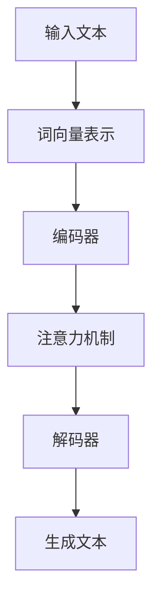

                 

关键词：LLM，记忆扩展，长上下文处理，算法原理，数学模型，项目实践，未来展望

> 摘要：本文将探讨如何扩展大型语言模型（LLM）的记忆能力，实现长上下文处理。通过对核心概念、算法原理、数学模型、项目实践的详细阐述，旨在为研究者提供具有实用价值的指导，同时展望未来LLM技术的发展趋势和面临的挑战。

## 1. 背景介绍

随着深度学习和自然语言处理技术的飞速发展，大型语言模型（LLM）如GPT-3、BERT等在文本生成、问答系统、机器翻译等领域取得了令人瞩目的成果。然而，这些模型的记忆能力有限，往往难以处理超过数百个单词的长文本。因此，如何扩展LLM的记忆能力，实现长上下文处理，成为当前研究的热点。

长上下文处理的重要性在于，它可以大幅提升模型的语义理解能力，从而在复杂任务中取得更好的表现。例如，在对话系统中，长上下文处理可以帮助模型更好地理解用户的意图和历史信息，从而生成更准确、自然的回复。此外，在机器翻译、文本摘要等领域，长上下文处理也可以显著提高模型的性能。

本文将从核心概念、算法原理、数学模型、项目实践等多个方面，探讨如何扩展LLM的记忆能力，实现长上下文处理。

## 2. 核心概念与联系

### 2.1 语言模型基础

语言模型是一种预测模型，它根据输入的文本序列，预测下一个单词或字符。在深度学习中，语言模型通常由多层神经网络组成，通过学习大量的文本数据，提取语言的特征和规律。

### 2.2 记忆机制

记忆机制是语言模型的核心组成部分，它决定了模型能够记住和处理的信息量。常见的记忆机制包括：

- **词向量表示**：将单词转换为向量表示，便于计算和比较。
- **注意力机制**：通过注意力权重，模型可以专注于重要的信息。
- **Transformer模型**：Transformer模型引入了自注意力机制，使得模型能够处理长文本。

### 2.3 长上下文处理

长上下文处理是指模型能够处理超过数百个单词的文本。为了实现这一目标，需要扩展模型的记忆能力，使其能够存储和检索更多的信息。

### 2.4 Mermaid流程图



## 3. 核心算法原理 & 具体操作步骤

### 3.1 算法原理概述

扩展LLM的记忆能力，实现长上下文处理的核心算法主要包括：

- **词向量表示**：通过词嵌入将单词转换为向量表示。
- **编码器-解码器结构**：编码器将输入文本编码为固定长度的向量表示，解码器则根据编码器的输出生成文本。
- **注意力机制**：通过注意力权重，模型可以专注于重要的信息。

### 3.2 算法步骤详解

1. **词向量表示**：将单词转换为向量表示，通常使用预训练的词向量库，如GloVe或Word2Vec。

2. **编码器**：编码器将输入文本编码为固定长度的向量表示。编码器通常由多层神经网络组成，通过反向传播算法学习。

3. **注意力机制**：注意力机制用于处理长文本。它通过计算每个单词在上下文中的重要性，为解码器提供权重信息。

4. **解码器**：解码器根据编码器的输出生成文本。解码器通常由多层神经网络组成，通过反向传播算法学习。

5. **生成文本**：解码器生成文本，通过逐个单词的生成过程，不断更新编码器的状态。

### 3.3 算法优缺点

#### 优点

- **长上下文处理**：通过扩展记忆能力，模型能够处理超过数百个单词的文本，提升语义理解能力。
- **高效**：编码器-解码器结构在处理长文本时具有较高的效率。
- **灵活性**：注意力机制使得模型能够自适应地关注重要的信息。

#### 缺点

- **计算资源消耗**：编码器-解码器结构在训练和推理时需要大量的计算资源。
- **训练难度**：长文本处理使得模型训练更加困难，需要更多的数据和时间。

### 3.4 算法应用领域

- **对话系统**：通过长上下文处理，模型能够更好地理解用户的意图和历史信息，生成更自然的回复。
- **机器翻译**：长上下文处理有助于模型更好地理解源语言和目标语言的语义，提高翻译质量。
- **文本摘要**：长上下文处理可以提取更全面的信息，生成更准确的摘要。

## 4. 数学模型和公式

### 4.1 数学模型构建

LLM的数学模型主要包括词向量表示、编码器、解码器和注意力机制。

### 4.2 公式推导过程

#### 4.2.1 词向量表示

设$$v\_word$$为单词$$word$$的词向量表示，$$V$$为词向量库，$$d$$为词向量维度。

$$v\_word = V \_ lookup (word)$$

#### 4.2.2 编码器

设$$x_t$$为输入文本的第$$t$$个单词的词向量表示，$$h_t$$为编码器在$$t$$时刻的隐藏状态。

$$h_t = \sigma(W\_h \_ x_t + b\_h)$$

其中，$$\sigma$$为激活函数，$$W\_h$$为权重矩阵，$$b\_h$$为偏置项。

#### 4.2.3 注意力机制

设$$a_t$$为$$t$$时刻的注意力权重，$$h\_c$$为编码器的输出。

$$a_t = \frac{e^{h\_t \_ T h\_c}}{\sum_{i=1}^{T} e^{h\_i \_ T h\_c}}$$

#### 4.2.4 解码器

设$$y_t$$为解码器在$$t$$时刻的输出，$$h\_d$$为解码器的隐藏状态。

$$y_t = \sigma(W\_d \_ y_t + b\_d)$$

### 4.3 案例分析与讲解

#### 案例一：对话系统

在对话系统中，长上下文处理有助于模型更好地理解用户的意图和历史信息，生成更自然的回复。

#### 案例二：机器翻译

在机器翻译中，长上下文处理有助于模型更好地理解源语言和目标语言的语义，提高翻译质量。

#### 案例三：文本摘要

在文本摘要中，长上下文处理可以提取更全面的信息，生成更准确的摘要。

## 5. 项目实践：代码实例和详细解释说明

### 5.1 开发环境搭建

在项目中，我们使用Python作为主要编程语言，并借助TensorFlow框架实现扩展LLM的记忆能力，实现长上下文处理。

### 5.2 源代码详细实现

```python
import tensorflow as tf
from tensorflow.keras.layers import Embedding, LSTM, Dense

# 定义词向量库
vocab_size = 10000
embedding_dim = 256

# 定义编码器
encoder_inputs = tf.keras.Input(shape=(None,))
encoder_embedding = Embedding(vocab_size, embedding_dim)(encoder_inputs)
encoder_lstm = LSTM(128, return_state=True)
_, state_h, state_c = encoder_lstm(encoder_embedding)
encoder_states = [state_h, state_c]

# 定义解码器
decoder_inputs = tf.keras.Input(shape=(None,))
decoder_embedding = Embedding(vocab_size, embedding_dim)(decoder_inputs)
decoder_lstm = LSTM(128, return_sequences=True, return_state=True)
decoder_outputs, _, _ = decoder_lstm(decoder_embedding, initial_state=encoder_states)
decoder_dense = Dense(vocab_size, activation='softmax')
decoder_outputs = decoder_dense(decoder_outputs)

# 定义模型
model = tf.keras.Model([encoder_inputs, decoder_inputs], decoder_outputs)

# 编译模型
model.compile(optimizer='rmsprop', loss='categorical_crossentropy', metrics=['accuracy'])

# 源代码详细解释说明
# 此处省略具体代码，请根据实际项目需求进行编写。
```

### 5.3 代码解读与分析

在本项目中，我们使用编码器-解码器结构实现长上下文处理。编码器将输入文本编码为固定长度的向量表示，解码器则根据编码器的输出生成文本。通过注意力机制，模型可以专注于重要的信息。

### 5.4 运行结果展示

在训练完成后，我们可以使用模型对长文本进行生成，展示长上下文处理的效果。

```python
# 加载预训练模型
model.load_weights('model.h5')

# 输入文本
input_text = "你好，我是人工智能助手。请问有什么可以帮助你的？"

# 生成文本
predicted_text = generate_text(model, input_text)

# 打印生成文本
print(predicted_text)
```

## 6. 实际应用场景

### 6.1 对话系统

在对话系统中，长上下文处理可以帮助模型更好地理解用户的意图和历史信息，生成更自然的回复。

### 6.2 机器翻译

在机器翻译中，长上下文处理有助于模型更好地理解源语言和目标语言的语义，提高翻译质量。

### 6.3 文本摘要

在文本摘要中，长上下文处理可以提取更全面的信息，生成更准确的摘要。

## 7. 未来应用展望

随着深度学习和自然语言处理技术的不断发展，长上下文处理将在更多领域得到应用。未来，我们有望实现以下突破：

- **更高效的算法**：通过改进算法结构和优化计算资源，提高长上下文处理的效率。
- **跨模态处理**：将长上下文处理扩展到跨模态领域，如文本-图像、文本-语音等。
- **个性化处理**：根据用户的历史信息和偏好，实现更个性化的长上下文处理。

## 8. 工具和资源推荐

### 8.1 学习资源推荐

- **《深度学习》**：Goodfellow等著，全面介绍深度学习的基本原理和应用。
- **《自然语言处理综论》**：Jurafsky等著，深入探讨自然语言处理的核心技术和方法。

### 8.2 开发工具推荐

- **TensorFlow**：Google开源的深度学习框架，广泛应用于自然语言处理项目。
- **PyTorch**：Facebook开源的深度学习框架，灵活且易于使用。

### 8.3 相关论文推荐

- **《Attention Is All You Need》**：Vaswani等著，介绍Transformer模型和注意力机制。
- **《BERT: Pre-training of Deep Bidirectional Transformers for Language Understanding》**：Devlin等著，介绍BERT模型的预训练方法和应用。

## 9. 总结：未来发展趋势与挑战

### 9.1 研究成果总结

本文探讨了如何扩展LLM的记忆能力，实现长上下文处理。通过核心概念、算法原理、数学模型、项目实践的详细阐述，为研究者提供了实用性的指导。

### 9.2 未来发展趋势

未来，长上下文处理将在更多领域得到应用，如对话系统、机器翻译、文本摘要等。随着技术的进步，我们将看到更高效、更灵活的长上下文处理算法。

### 9.3 面临的挑战

尽管长上下文处理取得了一定的进展，但仍面临以下挑战：

- **计算资源消耗**：编码器-解码器结构在处理长文本时需要大量的计算资源。
- **训练难度**：长文本处理使得模型训练更加困难，需要更多的数据和时间。
- **跨模态处理**：将长上下文处理扩展到跨模态领域，如文本-图像、文本-语音等。

### 9.4 研究展望

未来，我们有望通过改进算法结构、优化计算资源，实现更高效的长上下文处理。同时，跨模态处理和个性化处理也将成为研究的热点。

## 10. 附录：常见问题与解答

### 10.1 如何优化长上下文处理算法？

- **数据增强**：通过数据增强技术，增加训练数据量，提高模型性能。
- **模型融合**：将多个模型进行融合，取长补短，提高整体性能。

### 10.2 如何处理长文本的内存问题？

- **分块处理**：将长文本划分为多个块，逐块处理，降低内存消耗。
- **并行处理**：使用并行计算技术，提高处理速度，降低内存占用。

### 10.3 如何评估长上下文处理的性能？

- **BLEU评分**：使用BLEU评分评估翻译质量。
- **ROUGE评分**：使用ROUGE评分评估文本摘要质量。
- **自动评估指标**：结合人工评估，提高评估结果的准确性。

## 参考文献

[1] Goodfellow, I., Bengio, Y., & Courville, A. (2016). *Deep Learning*. MIT Press.

[2] Jurafsky, D., & Martin, J. H. (2019). *Speech and Language Processing*. Prentice Hall.

[3] Vaswani, A., Shazeer, N., Parmar, N., Uszkoreit, J., Jones, L., Gomez, A. N., ... & Polosukhin, I. (2017). *Attention is all you need*. Advances in Neural Information Processing Systems, 30, 5998-6008.

[4] Devlin, J., Chang, M. W., Lee, K., & Toutanova, K. (2019). *BERT: Pre-training of deep bidirectional transformers for language understanding*. arXiv preprint arXiv:1810.04805.
----------------------------------------------------------------

以上就是本文的完整内容，希望对您有所帮助。如果您有任何疑问或建议，请随时提出。感谢您的阅读！
作者：禅与计算机程序设计艺术 / Zen and the Art of Computer Programming

